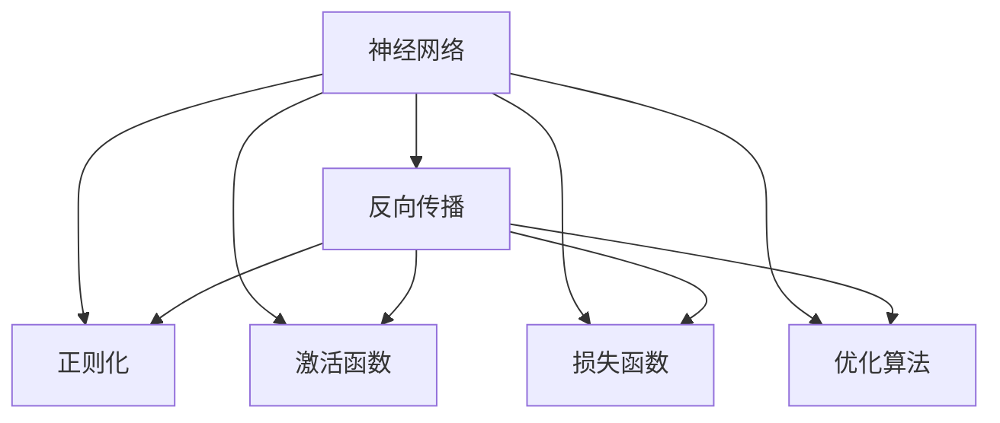

                 

## 1. 背景介绍

### 1.1 问题由来

人工智能(AI)的迅猛发展，极大地推动了科技和社会的进步，但也带来了一系列复杂而深刻的挑战。其中，以神经网络(Neural Network)为核心的机器学习技术，成为解锁智能新纪元的重要工具。从图像识别、语音合成，到自然语言处理(NLP)、推荐系统，神经网络技术的广泛应用正在深刻地改变着世界的面貌。

神经网络自1940年代由麦卡洛克和皮茨提出以来，经历了从简单的感知器到多层感知器(MLP)、卷积神经网络(CNN)、循环神经网络(RNN)，再到深度神经网络(DNN)和深度学习(DL)的演变，逐渐成为AI领域的主流技术。本文旨在深入探讨神经网络的基本原理、核心算法和具体应用，以期为读者提供全面而深入的了解，帮助其在实践中更好地应用神经网络技术。

### 1.2 问题核心关键点

神经网络技术的核心在于其强大的拟合能力和泛化能力，能够通过大量的训练数据，学习到数据的隐含规律，实现从输入到输出的映射。其核心关键点包括：

1. **多层结构**：神经网络由输入层、隐藏层和输出层构成，隐藏层引入了非线性变换，可以捕捉数据中更为复杂的关系。

2. **反向传播算法**：用于计算梯度、更新模型参数的优化算法。通过反向传播，模型可以自动调整参数，提高预测准确率。

3. **正则化技术**：如L2正则、Dropout等，防止模型过拟合，提升泛化能力。

4. **激活函数**：如ReLU、Sigmoid等，引入非线性特性，增强模型的表达能力。

5. **损失函数**：如均方误差、交叉熵等，衡量模型预测与真实标签之间的差异。

6. **优化算法**：如SGD、Adam等，用于优化模型参数，提高训练效率。

7. **迁移学习**：将一个领域的知识迁移到另一个领域，提升模型在新任务上的性能。

8. **模型压缩**：通过剪枝、量化等技术，减小模型规模，提升计算效率。

这些关键点共同构成了神经网络技术的基本框架，使其能够应用于各种复杂的任务中，展现出强大的智能潜力。

## 2. 核心概念与联系

### 2.1 核心概念概述

为更好地理解神经网络技术，本节将介绍几个密切相关的核心概念：

- **神经网络(Neural Network)**：由多层神经元(节点)和它们之间的连接构成。每一层神经元通过权重和偏置计算输出，并通过激活函数引入非线性特性。

- **反向传播(Backpropagation)**：用于计算梯度、更新模型参数的优化算法。通过链式法则反向传播误差，计算每一层神经元的梯度，更新模型参数。

- **正则化(Regularization)**：通过引入正则项，惩罚过大的参数值，防止模型过拟合。

- **激活函数(Activation Function)**：如ReLU、Sigmoid等，用于引入非线性特性，增强模型的表达能力。

- **损失函数(Loss Function)**：衡量模型预测与真实标签之间的差异，常用的有均方误差、交叉熵等。

- **优化算法(Optimizer)**：用于优化模型参数，常用的有SGD、Adam等。

这些核心概念之间的逻辑关系可以通过以下Mermaid流程图来展示：



这个流程图展示了神经网络的核心组件和工作流程：输入通过隐藏层被处理后，通过激活函数引入非线性特性，再经过输出层产生预测结果。反向传播算法计算误差，并更新模型参数；正则化和优化算法帮助模型防止过拟合和快速收敛。

## 3. 核心算法原理 & 具体操作步骤
### 3.1 算法原理概述

神经网络的核心原理是通过反向传播算法，利用损失函数计算模型预测与真实标签之间的差异，并通过优化算法调整模型参数，最小化损失函数。其算法原理可以概括为以下几个步骤：

1. **前向传播**：将输入数据通过隐藏层计算，得到模型输出。
2. **计算损失**：将模型输出与真实标签计算损失函数。
3. **反向传播**：通过链式法则反向传播误差，计算每一层神经元的梯度。
4. **更新参数**：利用优化算法，根据梯度更新模型参数。
5. **迭代优化**：重复上述步骤，直至损失函数收敛。

### 3.2 算法步骤详解

以下是神经网络核心算法的详细步骤：

**Step 1: 准备数据集和模型**

- 准备训练集 $D=\{(x_i, y_i)\}_{i=1}^N$，其中 $x_i$ 为输入样本，$y_i$ 为真实标签。
- 定义神经网络模型 $M_{\theta}$，其中 $\theta$ 为模型参数。

**Step 2: 前向传播**

- 将输入样本 $x$ 输入模型，通过隐藏层计算得到中间变量 $h$。
- 应用激活函数 $\sigma$ 计算输出层神经元的输出 $\hat{y}$。

**Step 3: 计算损失**

- 将模型预测 $\hat{y}$ 与真实标签 $y$ 计算损失函数 $L$，如均方误差损失 $L = \frac{1}{N}\sum_{i=1}^N(y_i - \hat{y_i})^2$。

**Step 4: 反向传播**

- 利用链式法则，反向传播误差，计算每一层神经元的梯度。
- 通过梯度下降等优化算法，更新模型参数。

**Step 5: 迭代优化**

- 重复上述步骤，直至损失函数收敛。

### 3.3 算法优缺点

神经网络技术具有以下优点：

1. **强大的拟合能力**：多层结构和非线性激活函数使其能够拟合复杂的数据分布。
2. **良好的泛化能力**：通过反向传播和优化算法，可以提升模型的泛化能力，避免过拟合。
3. **广泛的适用性**：可以应用于图像识别、语音合成、自然语言处理等多个领域。
4. **自动化的特征提取**：神经网络能够自动提取输入数据的特征，减少手动设计特征的复杂度。

同时，神经网络技术也存在以下局限性：

1. **计算资源消耗大**：神经网络参数量巨大，训练和推理耗时较长。
2. **可解释性不足**：神经网络模型通常被视为"黑盒"，难以解释其内部工作机制。
3. **模型复杂度高**：神经网络结构复杂，难以调试和优化。
4. **数据依赖性强**：神经网络的效果很大程度上依赖于训练数据的质量和数量。
5. **梯度消失/爆炸**：深层神经网络容易遇到梯度消失或爆炸的问题，导致模型训练困难。

尽管存在这些局限性，但神经网络技术以其强大的表现力和广泛的应用前景，仍成为AI领域的研究热点，不断引领技术进步。

### 3.4 算法应用领域

神经网络技术在众多领域得到了广泛的应用，以下是一些典型的应用场景：

1. **计算机视觉**：图像分类、目标检测、人脸识别等。
2. **自然语言处理**：文本分类、情感分析、机器翻译、语音识别等。
3. **推荐系统**：用户行为预测、商品推荐等。
4. **语音识别与合成**：语音识别、语音生成、语音转换等。
5. **时间序列预测**：股票预测、天气预报等。
6. **游戏与决策**：强化学习、博弈论等。
7. **生物信息学**：蛋白质结构预测、基因序列分析等。

这些应用场景展示了神经网络技术的广泛潜力和强大能力，进一步推动了AI技术的深入发展和应用。

## 4. 数学模型和公式 & 详细讲解 & 举例说明
### 4.1 数学模型构建

神经网络的核心数学模型可以由以下组成部分构成：

- **输入层**：接收输入数据 $x$，输出中间变量 $z$。
- **隐藏层**：由多个神经元组成，每个神经元输出 $h_i$。
- **输出层**：输出模型预测结果 $\hat{y}$。

隐藏层的计算过程可以表示为：

$$
h_i = \sum_{j=1}^m w_{ij}z_j + b_i
$$

其中 $w_{ij}$ 为权重，$b_i$ 为偏置，$m$ 为隐藏层神经元数量。

应用激活函数 $\sigma$ 计算输出层的神经元输出：

$$
\hat{y} = \sum_{i=1}^nh_i + c
$$

其中 $n$ 为输出层神经元数量，$c$ 为偏置。

### 4.2 公式推导过程

以最简单的多层感知器(MLP)为例，推导其前向传播和反向传播的公式。

前向传播过程可以表示为：

$$
z^{(l+1)} = W^{(l+1)}z^{(l)} + b^{(l+1)}
$$

其中 $W^{(l+1)}$ 为权重矩阵，$b^{(l+1)}$ 为偏置向量，$l$ 为当前层数。

应用激活函数 $\sigma$ 计算输出层：

$$
\hat{y} = W^{(n)}z^{(n-1)} + b^{(n)}
$$

其中 $W^{(n)}$ 为输出层权重矩阵，$b^{(n)}$ 为输出层偏置向量。

计算损失函数 $L$，以均方误差损失为例：

$$
L = \frac{1}{N}\sum_{i=1}^N(y_i - \hat{y_i})^2
$$

其中 $y_i$ 为真实标签。

反向传播过程计算梯度，以第一层神经元为例：

$$
\frac{\partial L}{\partial z_1} = 2\sum_{i=1}^n(\frac{\partial L}{\partial y_i}W_i^{(1)})\sigma'(z_1)
$$

其中 $\frac{\partial L}{\partial y_i}$ 为输出层对真实标签的梯度，$\sigma'$ 为激活函数的导数。

### 4.3 案例分析与讲解

以手写数字识别为例，展示神经网络的实际应用。假设数据集包含$M\times N$的灰度图像，模型为MLP结构，包含1个输入层、3个隐藏层和1个输出层。输入层节点数为$M \times N$，每个隐藏层节点数为10，输出层节点数为10。

假设每个像素点的取值为0或1，将图像转换为向量形式，输入到神经网络中进行处理。隐藏层和输出层的计算过程可以表示为：

$$
z^{(1)} = W^{(1)}x + b^{(1)}
$$

$$
h_1 = \sigma(z^{(1)})
$$

$$
z^{(2)} = W^{(2)}h_1 + b^{(2)}
$$

$$
h_2 = \sigma(z^{(2)})
$$

$$
z^{(3)} = W^{(3)}h_2 + b^{(3)}
$$

$$
h_3 = \sigma(z^{(3)})
$$

$$
z^{(4)} = W^{(4)}h_3 + b^{(4)}
$$

$$
\hat{y} = \sigma(z^{(4)})
$$

其中 $\sigma$ 为激活函数，如ReLU。通过反向传播算法，计算梯度并更新模型参数，实现手写数字识别。

## 5. 项目实践：代码实例和详细解释说明
### 5.1 开发环境搭建

在进行神经网络项目实践前，我们需要准备好开发环境。以下是使用Python进行TensorFlow开发的环境配置流程：

1. 安装Anaconda：从官网下载并安装Anaconda，用于创建独立的Python环境。

2. 创建并激活虚拟环境：
```bash
conda create -n tf-env python=3.8 
conda activate tf-env
```

3. 安装TensorFlow：根据CUDA版本，从官网获取对应的安装命令。例如：
```bash
conda install tensorflow -c pytorch -c conda-forge
```

4. 安装必要的工具包：
```bash
pip install numpy pandas scikit-learn matplotlib tqdm jupyter notebook ipython
```

完成上述步骤后，即可在`tf-env`环境中开始神经网络实践。

### 5.2 源代码详细实现

这里我们以手写数字识别为例，给出使用TensorFlow实现多层感知器的完整代码：

```python
import tensorflow as tf
import numpy as np
import matplotlib.pyplot as plt
from tensorflow.keras import datasets, layers, models

# 加载手写数字数据集
(train_images, train_labels), (test_images, test_labels) = datasets.mnist.load_data()

# 数据预处理
train_images = train_images / 255.0
test_images = test_images / 255.0

# 构建模型
model = models.Sequential()
model.add(layers.Flatten(input_shape=(28, 28)))
model.add(layers.Dense(128, activation='relu'))
model.add(layers.Dense(10, activation='softmax'))

# 编译模型
model.compile(optimizer='adam',
              loss='sparse_categorical_crossentropy',
              metrics=['accuracy'])

# 训练模型
history = model.fit(train_images, train_labels, epochs=5, 
                    validation_data=(test_images, test_labels))

# 评估模型
test_loss, test_acc = model.evaluate(test_images,  test_labels, verbose=2)

# 预测结果
predictions = model.predict(test_images)
```

以上代码展示了从数据加载、模型构建、编译、训练到评估和预测的完整流程。可以看到，使用TensorFlow构建神经网络模型非常简单，只需要几行代码即可完成所有步骤。

### 5.3 代码解读与分析

让我们再详细解读一下关键代码的实现细节：

**数据加载与预处理**：
- 使用TensorFlow内置的`mnist.load_data()`方法加载手写数字数据集。
- 将图像数据归一化到0-1之间，确保模型输入数据的一致性。

**模型构建**：
- 使用`Sequential`模型顺序堆叠层。
- 添加输入层，将28x28的图像数据展平为一维向量。
- 添加两个隐藏层，每层包含128个神经元，使用ReLU激活函数。
- 添加输出层，包含10个神经元，使用softmax激活函数。

**模型编译与训练**：
- 使用`compile`方法配置模型，指定优化器、损失函数和评估指标。
- 使用`fit`方法训练模型，指定训练数据、训练轮数和验证集。
- 记录训练过程中的损失和精度，保存在`history`对象中。

**模型评估与预测**：
- 使用`evaluate`方法评估模型在测试集上的性能，获取测试损失和精度。
- 使用`predict`方法对测试集进行预测，输出预测结果。

**代码结构**：
- 代码结构清晰，易于理解和维护。
- 每一步操作都有详细的注释，便于初学者快速上手。

## 6. 实际应用场景
### 6.1 智能医疗诊断

神经网络技术在医疗诊断领域有着广泛的应用，如医学影像分析、疾病预测、基因序列分析等。以医学影像分析为例，通过训练神经网络模型，可以从医学影像中自动检测出肿瘤、病变等异常情况，辅助医生进行诊断。

具体而言，可以收集大量的医学影像数据，将其中正常和异常的影像数据分别标记为正类和负类。在此基础上，对预训练的卷积神经网络(CNN)模型进行微调，使其能够识别出影像中的异常区域。微调后的模型可以用于实时分析新输入的医学影像，快速检测出病变部位，辅助医生进行诊断决策。

### 6.2 自动驾驶

自动驾驶技术依赖于多种传感器数据和深度学习模型，其中神经网络技术在目标检测、路径规划、行为决策等方面起着至关重要的作用。通过训练神经网络模型，可以从传感器数据中提取车辆、行人、道路等关键信息，预测未来行为，生成最优行驶路径。

在实际应用中，可以使用多个神经网络模型，分别处理不同传感器数据，然后将结果进行融合。例如，可以使用卷积神经网络(CNN)进行图像处理，提取道路、车辆等关键信息；使用循环神经网络(RNN)进行时间序列分析，预测车辆行为；使用长短期记忆网络(LSTM)进行路径规划，生成最优行驶路径。这些模型可以集成在自动驾驶系统中，共同完成复杂的驾驶任务。

### 6.3 金融风险评估

神经网络技术在金融领域也有着广泛的应用，如信用评分、风险评估、股票预测等。通过训练神经网络模型，可以分析金融数据中的复杂关系，预测股票价格变化、客户信用风险等。

在具体应用中，可以使用多层感知器(MLP)或卷积神经网络(CNN)对历史金融数据进行建模，提取关键特征，预测未来股票价格或客户信用风险。通过实时监测金融市场动态，微调模型参数，可以及时调整投资策略，规避金融风险。

### 6.4 未来应用展望

随着神经网络技术的不断发展和优化，未来的应用场景将更加广泛，智能化水平也将进一步提升。以下是一些可能的发展方向：

1. **智能制造**：通过训练神经网络模型，可以预测设备故障、优化生产流程，实现智能制造。
2. **智能交通**：通过训练神经网络模型，可以优化交通信号控制、预测交通流量，提升交通效率。
3. **智能家居**：通过训练神经网络模型，可以实现语音识别、图像识别、智能推荐等，提升家居智能化水平。
4. **智能教育**：通过训练神经网络模型，可以实现个性化推荐、智能评估等，提升教育质量。
5. **智能客服**：通过训练神经网络模型，可以实现自然语言理解、对话生成等，提升客服效率和客户满意度。

## 7. 工具和资源推荐
### 7.1 学习资源推荐

为了帮助开发者系统掌握神经网络技术的理论基础和实践技巧，这里推荐一些优质的学习资源：

1. **《深度学习》课程**：斯坦福大学Andrew Ng教授的深度学习课程，系统讲解深度学习的基本原理和常用算法。

2. **《神经网络与深度学习》书籍**：Michael Nielsen著，深入浅出地介绍了神经网络的基本概念和原理。

3. **TensorFlow官方文档**：TensorFlow的官方文档，提供了详细的API参考和样例代码，方便开发者快速上手。

4. **Keras官方文档**：Keras的官方文档，提供了简单易用的API，适合初学者快速构建模型。

5. **PyTorch官方文档**：PyTorch的官方文档，提供了灵活高效的深度学习框架，支持自定义模型和优化算法。

6. **在线教程和博客**：如DeepLearning.AI、Google AI等平台，提供了丰富的深度学习教程和实战项目，帮助开发者积累经验。

通过这些学习资源，相信你一定能够系统掌握神经网络技术的核心原理和实践技巧，为未来的研究与开发奠定坚实基础。

### 7.2 开发工具推荐

高效的开发离不开优秀的工具支持。以下是几款用于神经网络开发的常用工具：

1. **TensorFlow**：由Google主导开发的深度学习框架，支持CPU、GPU和TPU等硬件加速，适合大规模工程应用。

2. **PyTorch**：由Facebook开发的深度学习框架，灵活高效，支持动态计算图，适合研究与应用。

3. **Keras**：高层次的深度学习框架，提供简洁易用的API，适合快速构建原型。

4. **MXNet**：由Apache开发的深度学习框架，支持分布式计算，适合大规模集群应用。

5. **JAX**：基于JVM的深度学习框架，支持动态计算图，适合研究与应用。

6. **TensorBoard**：TensorFlow配套的可视化工具，可实时监测模型训练状态，提供丰富的图表呈现方式。

7. **Weights & Biases**：模型训练的实验跟踪工具，可以记录和可视化模型训练过程中的各项指标。

8. **Jupyter Notebook**：交互式编程环境，适合快速迭代和实验。

合理利用这些工具，可以显著提升神经网络开发的效率，加速创新迭代的步伐。

### 7.3 相关论文推荐

神经网络技术的发展源于学界的持续研究。以下是几篇奠基性的相关论文，推荐阅读：

1. **《神经网络与深度学习》论文**：Michael Nielsen著，介绍了神经网络的基本原理和深度学习的基本框架。

2. **《深度学习》论文**：Yann LeCun、Geoffrey Hinton、Yoshua Bengio著，系统介绍了深度学习的基本概念和应用。

3. **《ImageNet大规模视觉识别挑战赛》论文**：Alex Krizhevsky、Ilya Sutskever、Geoffrey E. Hinton著，展示了深度卷积神经网络在图像识别任务上的卓越表现。

4. **《改进的卷积神经网络》论文**：Kaiming He、Xiangyu Zhang、Shaoqing Ren、Jian Sun著，提出了卷积神经网络中的残差连接，显著提升了网络性能。

5. **《长短期记忆网络》论文**：Sukhwan Kim、Doo Yul Cho、Sungchoon Kim、Jae-seon Lee、Sangkook Choi、Yoonho Lee、Geoffrey E. Hinton著，提出了一种可以处理时间序列数据的循环神经网络。

6. **《自适应梯度优化算法》论文**：Diederik P. Kingma、Jimmy Ba著，提出了一种自适应学习率优化算法，显著提升了训练效率。

这些论文代表了神经网络技术的演进脉络，通过学习这些前沿成果，可以帮助研究者把握学科前进方向，激发更多的创新灵感。

## 8. 总结：未来发展趋势与挑战
### 8.1 总结

本文对神经网络技术的基本原理、核心算法和具体应用进行了全面系统的介绍。首先阐述了神经网络技术的背景和核心概念，明确了神经网络技术的强大拟合能力和泛化能力，以及其在各个领域中的广泛应用。其次，从原理到实践，详细讲解了神经网络模型的构建、训练和优化过程，给出了神经网络开发的完整代码实例。同时，本文还广泛探讨了神经网络技术在智能医疗、自动驾驶、金融风险评估等多个行业领域的应用前景，展示了神经网络技术的广阔前景。此外，本文精选了神经网络技术的各类学习资源，力求为读者提供全方位的技术指引。

通过本文的系统梳理，可以看到，神经网络技术正在成为AI领域的重要范式，极大地推动了AI技术的深入发展和应用。未来，伴随神经网络模型的不断演进和优化，相信其在更多领域的应用将不断拓展，为人类社会的智能化和自动化带来深远影响。

### 8.2 未来发展趋势

展望未来，神经网络技术将呈现以下几个发展趋势：

1. **模型规模持续增大**：随着算力成本的下降和数据规模的扩张，神经网络模型的参数量还将持续增长。超大规模神经网络模型蕴含的丰富语言知识，有望支撑更加复杂多变的下游任务。

2. **模型架构日趋复杂**：未来的神经网络模型将包含更多层次和节点，引入更多网络结构，如残差连接、注意力机制、Transformer等，以提升模型的表达能力和泛化能力。

3. **深度强化学习结合**：深度强化学习技术将与神经网络技术进一步融合，形成更加智能、自适应的决策系统，推动AI技术在自动驾驶、游戏、机器人等领域的应用。

4. **迁移学习成为常态**：神经网络技术将更加注重迁移学习的应用，通过在现有模型上进行微调，快速适应新任务和新数据，提高模型泛化能力和适应性。

5. **知识引导和融合**：未来的神经网络模型将更加注重外部知识的引入，通过知识图谱、逻辑规则等手段，引导模型学习更全面、准确的知识表示。

6. **跨模态信息融合**：神经网络技术将更加注重跨模态信息的融合，如视觉、语音、文本等数据的协同建模，实现更全面、多维度的智能感知。

以上趋势凸显了神经网络技术的广阔前景，这些方向的探索发展，必将进一步提升神经网络系统的性能和应用范围，为人类认知智能的进化带来深远影响。

### 8.3 面临的挑战

尽管神经网络技术已经取得了瞩目成就，但在迈向更加智能化、普适化应用的过程中，它仍面临着诸多挑战：

1. **计算资源消耗大**：神经网络参数量巨大，训练和推理耗时较长。大规模模型和高精度的要求对硬件提出了更高的要求。

2. **可解释性不足**：神经网络模型通常被视为"黑盒"，难以解释其内部工作机制和决策逻辑。这对于医疗、金融等高风险应用尤为重要。

3. **模型复杂度高**：神经网络结构复杂，难以调试和优化。如何在保证性能的同时，简化模型结构，提升推理速度，优化资源占用，将是重要的优化方向。

4. **数据依赖性强**：神经网络的效果很大程度上依赖于训练数据的质量和数量。如何在大规模、多样化的数据上训练模型，是未来的研究方向。

5. **梯度消失/爆炸**：深层神经网络容易遇到梯度消失或爆炸的问题，导致模型训练困难。如何克服这一问题，提高模型深度，是未来的重要课题。

6. **安全性问题**：神经网络模型可能被恶意利用，生成虚假信息，产生误导性、有害的输出。如何确保模型的安全性，避免恶意用途，确保输出的可靠性，将是未来的重要研究方向。

7. **伦理道德约束**：神经网络模型可能学习到有偏见、有害的信息，如何从数据和算法层面消除模型偏见，避免有害信息的传递，确保模型的伦理道德性，将是未来的重要课题。

8. **知识整合能力不足**：当前的神经网络模型往往局限于任务内数据，难以灵活吸收和运用更广泛的先验知识。如何让模型学习更全面、准确的知识，需要更多的探索和研究。

这些挑战凸显了神经网络技术的复杂性和复杂性，但正是这些挑战，激发了研究者们不断探索和创新的热情。相信通过研究者们的共同努力，这些挑战终将一一被克服，神经网络技术必将在构建安全、可靠、可解释、可控的智能系统方面取得新的突破。

### 8.4 研究展望

面对神经网络技术所面临的诸多挑战，未来的研究需要在以下几个方面寻求新的突破：

1. **参数高效与计算高效**：开发更加参数高效的神经网络模型，在固定大部分预训练参数的情况下，只更新极少量的任务相关参数。同时优化神经网络的计算图，减少前向传播和反向传播的资源消耗，实现更加轻量级、实时性的部署。

2. **跨模态学习**：引入跨模态信息融合技术，如视觉、语音、文本等数据的协同建模，提升模型对现实世界的理解和建模能力。

3. **深度强化学习结合**：深度强化学习技术将与神经网络技术进一步融合，形成更加智能、自适应的决策系统，推动AI技术在自动驾驶、游戏、机器人等领域的应用。

4. **知识引导和融合**：将符号化的先验知识，如知识图谱、逻辑规则等，与神经网络模型进行巧妙融合，引导模型学习更准确、合理的知识表示。

5. **对抗性学习**：引入对抗性学习技术，提升模型的鲁棒性和泛化能力，防止模型过拟合和攻击。

6. **迁移学习**：通过迁移学习，将一个领域的知识迁移到另一个领域，提高模型在新任务上的性能，降低对标注数据的依赖。

7. **模型压缩和量化**：通过剪枝、量化等技术，减小模型规模，提升计算效率，降低硬件成本。

这些研究方向的探索，必将引领神经网络技术迈向更高的台阶，为构建安全、可靠、可解释、可控的智能系统铺平道路。面向未来，神经网络技术还需要与其他AI技术进行更深入的融合，如知识表示、因果推理、强化学习等，多路径协同发力，共同推动智能技术的发展。

## 9. 附录：常见问题与解答

**Q1：什么是神经网络？**

A: 神经网络是一种由多层神经元(节点)和它们之间的连接构成的计算模型，用于处理复杂的数据分布和函数映射。它通过反向传播算法，利用损失函数计算模型预测与真实标签之间的差异，并通过优化算法调整模型参数，最小化损失函数。

**Q2：神经网络的训练过程是怎样的？**

A: 神经网络的训练过程包括前向传播、计算损失、反向传播和参数更新四个步骤。前向传播将输入数据通过隐藏层计算，得到模型输出。计算损失函数，衡量模型预测与真实标签之间的差异。反向传播通过链式法则，计算每一层神经元的梯度。参数更新利用优化算法，根据梯度更新模型参数，最小化损失函数。

**Q3：神经网络的常见激活函数有哪些？**

A: 神经网络的常见激活函数包括ReLU、Sigmoid、Tanh等。ReLU在深度学习中广泛应用，通过引入非线性特性，增强模型的表达能力。Sigmoid函数输出在0到1之间，常用于二分类任务。Tanh函数输出在-1到1之间，适用于某些特定任务。

**Q4：如何避免神经网络模型过拟合？**

A: 避免过拟合的方法包括数据增强、正则化、Dropout、Early Stopping等。数据增强通过扩充训练集，增加模型的鲁棒性。正则化通过引入正则项，惩罚过大的参数值。Dropout通过随机丢弃部分神经元，减少过拟合。Early Stopping通过监测验证集性能，提前停止训练，防止过拟合。

**Q5：什么是迁移学习？**

A: 迁移学习是一种将一个领域学习到的知识迁移到另一个领域的学习方法。通过在现有模型上进行微调，可以快速适应新任务和新数据，提高模型的泛化能力和适应性。迁移学习在NLP、计算机视觉、金融预测等领域都有广泛应用。

通过对这些关键问题的回答，相信你一定对神经网络技术的核心原理和应用有了更深入的理解。未来，随着神经网络技术的不断演进和优化，相信其在更多领域的应用将不断拓展，为人类社会的智能化和自动化带来深远影响。

