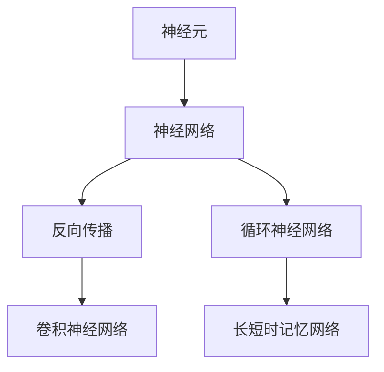

                 

# 神经网络：开启智能新纪元

## 1. 背景介绍

### 1.1 问题由来
随着计算技术、数据获取和处理能力的飞速提升，人工智能(AI)正逐步从算法与技术探索阶段走向广泛应用。神经网络作为其中最为重要的技术之一，正在开启智能技术的新纪元。从计算机视觉、自然语言处理到游戏智能、自动驾驶，神经网络在各领域中已展现出强大的学习与适应能力。本文将深入探讨神经网络的核心原理、最新进展与实际应用，为读者提供一个全面且深入的认识。

### 1.2 问题核心关键点
神经网络（Neural Networks, NNs）是一种受生物神经元启发的计算模型，通过构建人工神经元之间的连接与激活函数，实现复杂的非线性映射和泛化学习。关键点包括：
1. 神经元的激励函数（如Sigmoid、ReLU、Leaky ReLU等）
2. 网络的层次结构与激活函数（如卷积层、池化层、全连接层等）
3. 损失函数与反向传播算法
4. 深度学习中的优化器（如SGD、Adam、Adagrad等）

神经网络已经在图像识别、语音识别、自然语言处理等诸多领域取得了突破性进展，成为推动人工智能发展的重要引擎。

### 1.3 问题研究意义
研究神经网络的核心原理与最新进展，对于促进人工智能技术的落地应用，加速智能系统的开发和部署，具有重要意义：

1. 提升系统性能：神经网络通过数据驱动的学习，能够高效提取输入数据中的关键特征，显著提升任务性能。
2. 解决复杂问题：神经网络可处理高维、非线性数据，在实际应用中，常用于解决传统算法难以应对的复杂问题。
3. 推动技术革新：神经网络催生了许多前沿算法和技术，如深度学习、迁移学习、自监督学习等。
4. 推动产业升级：神经网络技术广泛应用于工业、医疗、金融、交通等众多领域，促进产业数字化转型。

## 2. 核心概念与联系

### 2.1 核心概念概述

为更好地理解神经网络的工作原理，本文将介绍几个关键概念：

- 神经元（Neuron）：神经网络的基本单元，模拟生物神经元的工作方式，接收输入信号并产生输出。
- 神经网络（Neural Network, NN）：由多个神经元组成的层次结构，通过连接权重和学习算法实现对数据的深度抽象。
- 反向传播（Backpropagation）：一种基于梯度下降优化的训练算法，通过反向传播损失函数对权重进行更新，实现模型学习。
- 卷积神经网络（Convolutional Neural Network, CNN）：一种专门用于图像识别任务的神经网络，通过卷积层和池化层提取空间特征。
- 循环神经网络（Recurrent Neural Network, RNN）：一种专门用于序列数据处理的神经网络，通过时间步长实现时间序列的建模。
- 长短时记忆网络（Long Short-Term Memory, LSTM）：一种RNN的变种，通过门控机制有效解决梯度消失问题。

这些核心概念之间的逻辑关系可以通过以下Mermaid流程图来展示：



这个流程图展示了几类核心神经网络结构及其之间的联系：

1. 神经元作为网络的基本构建块。
2. 神经网络通过连接权重和学习算法实现数据抽象。
3. CNN通过卷积层和池化层提取空间特征。
4. RNN及其变种通过时间步长建模序列数据。
5. LSTM通过门控机制解决梯度消失问题。

## 3. 核心算法原理 & 具体操作步骤
### 3.1 算法原理概述

神经网络的训练基于反向传播算法，其核心思想是通过前向传播和反向传播两个步骤迭代更新网络权重，以最小化损失函数。

**前向传播（Forward Propagation）**：将输入数据送入网络，通过神经元逐层处理，最终输出预测结果。假设输入数据为 $x$，经过 $L$ 层神经元的逐层变换，输出为 $y$。

$$
y = f_L(f_{L-1}(\dots f_1(x)\dots))
$$

其中 $f_i$ 为第 $i$ 层的激活函数。

**反向传播（Backpropagation）**：通过计算输出误差和损失函数的梯度，反向更新各层权重。假设损失函数为 $L(y)$，则梯度计算公式为：

$$
\frac{\partial L}{\partial x} = \sum_{i=L}^{1} \frac{\partial L}{\partial y_i} \cdot \frac{\partial y_i}{\partial x}
$$

其中 $\frac{\partial y_i}{\partial x}$ 表示第 $i$ 层的激活函数的梯度。

### 3.2 算法步骤详解

神经网络的训练一般包括以下几个关键步骤：

**Step 1: 准备训练数据与标签**

- 收集和准备训练数据集 $D=\{(x_i, y_i)\}_{i=1}^N$，其中 $x_i$ 为输入数据，$y_i$ 为标签。
- 对数据进行预处理，如归一化、数据增强等，提升模型的泛化能力。

**Step 2: 构建神经网络**

- 选择合适的网络结构，包括卷积层、全连接层、激活函数等。
- 初始化网络权重，如使用高斯分布等。

**Step 3: 定义损失函数**

- 根据具体任务选择合适的损失函数，如交叉熵损失、均方误差损失等。
- 构建损失函数 $L(y, \hat{y})$，其中 $\hat{y}$ 为模型预测结果。

**Step 4: 实现反向传播算法**

- 通过前向传播计算预测结果 $\hat{y}$。
- 计算输出误差 $e = L(y, \hat{y})$。
- 反向传播计算各层梯度，更新权重参数。

**Step 5: 循环迭代训练**

- 重复上述步骤，通过迭代更新权重，最小化损失函数。

**Step 6: 模型评估与优化**

- 在验证集上评估模型性能，如准确率、精确率等。
- 使用学习率衰减、早停法等策略，防止过拟合。
- 使用正则化技术，如L2正则、Dropout等，提升模型鲁棒性。

### 3.3 算法优缺点

神经网络具有以下优点：

1. 强大的泛化能力：通过多层次、多维度的抽象，神经网络能够处理复杂的非线性数据，适应性强。
2. 高效的数据驱动学习：神经网络通过反向传播算法，自动学习数据中的关键特征，优化预测结果。
3. 适应性强：神经网络可以应用于图像识别、语音识别、自然语言处理等多个领域。
4. 可扩展性高：神经网络的深度和宽度均可调节，支持大规模模型训练。

同时，神经网络也存在以下缺点：

1. 训练时间长：深度神经网络的参数量巨大，训练过程需要大量的计算资源。
2. 数据依赖性强：神经网络的训练效果高度依赖于数据质量与标注。
3. 模型复杂度高：神经网络的结构复杂，难以解释其内部机制和决策过程。
4. 局部最优问题：神经网络的训练可能陷入局部最优，难以得到全局最优解。

### 3.4 算法应用领域

神经网络已经在多个领域取得了广泛应用，具体包括：

- **计算机视觉**：图像分类、物体检测、图像分割等任务。
- **自然语言处理**：机器翻译、文本生成、情感分析等任务。
- **语音识别**：自动语音识别、语音合成、语音命令控制等任务。
- **游戏智能**：围棋、星际争霸等复杂游戏的高水平AI玩家。
- **自动驾驶**：通过感知和决策算法，实现自动驾驶车辆的控制。
- **推荐系统**：通过用户行为和物品属性，进行个性化推荐。

## 4. 数学模型和公式 & 详细讲解 & 举例说明（备注：数学公式请使用latex格式，latex嵌入文中独立段落使用 $$，段落内使用 $)
### 4.1 数学模型构建

**多层感知机（Multi-Layer Perceptron, MLP）模型**：

假设多层感知机模型具有 $L$ 层神经元，输入层有 $n$ 个神经元，输出层有 $m$ 个神经元，激活函数为 $f(x)$。

$$
\begin{aligned}
    z_1 &= w_1 x + b_1 \\
    a_1 &= f(z_1) \\
    z_2 &= w_2 a_1 + b_2 \\
    a_2 &= f(z_2) \\
    &\dots \\
    z_L &= w_L a_{L-1} + b_L \\
    y &= f(z_L)
\end{aligned}
$$

其中 $w$ 和 $b$ 分别为权重矩阵和偏置向量，$f$ 为激活函数。

**损失函数（交叉熵损失）**：

假设标签为 $y$，模型预测结果为 $\hat{y}$，则交叉熵损失函数为：

$$
L(y, \hat{y}) = -\frac{1}{N} \sum_{i=1}^N \sum_{j=1}^m y_j \log \hat{y}_j
$$

**激活函数（ReLU）**：

ReLU激活函数定义如下：

$$
f(x) = \max(0, x)
$$

ReLU函数在输入大于0时，输出等于输入，小于0时输出0，具有较好的非线性特性。

**反向传播算法**：

假设第 $l$ 层的激活函数为 $f$，输出为 $z_l$，前一层的输出为 $a_{l-1}$，权重矩阵为 $W_l$，偏置向量为 $b_l$，损失函数为 $L(y, \hat{y})$。则反向传播算法如下：

1. 前向传播计算 $z_l$ 和 $a_l$：

$$
z_l = W_l a_{l-1} + b_l
$$

2. 计算输出误差 $e$：

$$
e = \frac{\partial L}{\partial z_L} \cdot \frac{\partial z_L}{\partial z_{L-1}} \cdot \dots \cdot \frac{\partial z_2}{\partial z_1}
$$

3. 反向传播计算梯度：

$$
\frac{\partial L}{\partial a_l} = \frac{\partial L}{\partial z_l} \cdot f'(z_l)
$$

$$
\frac{\partial L}{\partial z_l} = \frac{\partial L}{\partial a_l} \cdot W_l^T
$$

$$
\frac{\partial L}{\partial W_l} = \frac{\partial L}{\partial z_l} a_{l-1}^T
$$

$$
\frac{\partial L}{\partial b_l} = \frac{\partial L}{\partial z_l}
$$

### 4.2 公式推导过程

**多层感知机模型的推导**：

假设输入数据 $x$ 为 $n$ 维向量，输出 $y$ 为 $m$ 维向量，激活函数为 $f$。则多层感知机模型的计算过程如下：

1. 前向传播计算第 $l$ 层的输出：

$$
z_l = W_l a_{l-1} + b_l
$$

$$
a_l = f(z_l)
$$

2. 计算输出结果：

$$
y = W_L a_{L-1} + b_L
$$

3. 计算损失函数：

$$
L(y, \hat{y}) = -\frac{1}{N} \sum_{i=1}^N \sum_{j=1}^m y_j \log \hat{y}_j
$$

**梯度下降算法的推导**：

梯度下降算法用于最小化损失函数 $L(y, \hat{y})$，公式如下：

$$
w_l^{(t+1)} = w_l^{(t)} - \eta \nabla_L(w_l, b_l)
$$

其中 $\eta$ 为学习率，$\nabla_L(w_l, b_l)$ 为损失函数对权重 $w_l$ 和偏置 $b_l$ 的梯度。

**反向传播算法的推导**：

假设当前层为第 $l$ 层，上一层为第 $l-1$ 层，下一层为第 $l+1$ 层。则反向传播算法如下：

1. 计算当前层的激活函数梯度：

$$
\frac{\partial L}{\partial a_l} = \frac{\partial L}{\partial z_l} \cdot f'(z_l)
$$

2. 计算当前层的权重梯度：

$$
\frac{\partial L}{\partial w_l} = \frac{\partial L}{\partial z_l} a_{l-1}^T
$$

3. 计算当前层的偏置梯度：

$$
\frac{\partial L}{\partial b_l} = \frac{\partial L}{\partial z_l}
$$

### 4.3 案例分析与讲解

**手写数字识别案例**：

假设输入数据 $x$ 为 $28 \times 28 = 784$ 维的向量，输出 $y$ 为 $10$ 维的向量，标签为 $0-9$。使用多层感知机模型，激活函数为 ReLU，损失函数为交叉熵。

1. 前向传播计算 $z_1$ 和 $a_1$：

$$
z_1 = w_1 x + b_1
$$

$$
a_1 = f(z_1)
$$

2. 前向传播计算 $z_2$ 和 $a_2$：

$$
z_2 = w_2 a_1 + b_2
$$

$$
a_2 = f(z_2)
$$

3. 计算输出结果：

$$
y = W_L a_{L-1} + b_L
$$

4. 计算损失函数：

$$
L(y, \hat{y}) = -\frac{1}{N} \sum_{i=1}^N \sum_{j=1}^m y_j \log \hat{y}_j
$$

5. 反向传播计算梯度：

$$
\frac{\partial L}{\partial w_l} = \frac{\partial L}{\partial z_l} a_{l-1}^T
$$

$$
\frac{\partial L}{\partial b_l} = \frac{\partial L}{\partial z_l}
$$

通过反向传播算法，可以高效更新神经网络的权重，使其在训练过程中逐步学习输入数据的特征，提升模型的泛化能力。

## 5. 项目实践：代码实例和详细解释说明
### 5.1 开发环境搭建

为了实现神经网络模型，需要安装Python及相关的深度学习框架，如TensorFlow或PyTorch。以下是在TensorFlow环境下搭建神经网络模型的流程：

1. 安装Anaconda，并创建虚拟环境。

```bash
conda create -n tf-env python=3.7
conda activate tf-env
```

2. 安装TensorFlow：

```bash
pip install tensorflow==2.4.1
```

3. 安装相关库：

```bash
pip install numpy matplotlib pandas sklearn
```

### 5.2 源代码详细实现

以下是使用TensorFlow实现手写数字识别的完整代码：

```python
import tensorflow as tf
import numpy as np
from tensorflow.keras import datasets, layers, models

# 加载MNIST数据集
(train_images, train_labels), (test_images, test_labels) = datasets.mnist.load_data()

# 数据预处理
train_images = train_images.reshape((60000, 28 * 28))
test_images = test_images.reshape((10000, 28 * 28))
train_images, test_images = train_images / 255.0, test_images / 255.0

# 构建模型
model = models.Sequential()
model.add(layers.Dense(256, activation='relu', input_shape=(784,)))
model.add(layers.Dense(10, activation='softmax'))

# 编译模型
model.compile(optimizer='adam',
              loss='sparse_categorical_crossentropy',
              metrics=['accuracy'])

# 训练模型
model.fit(train_images, train_labels, epochs=5, batch_size=64)

# 评估模型
test_loss, test_acc = model.evaluate(test_images, test_labels)
print('Test accuracy:', test_acc)
```

### 5.3 代码解读与分析

**代码解读**：

1. 加载和预处理数据：使用MNIST数据集，将图像数据展平为向量，并进行归一化处理。

2. 构建模型：定义一个包含两个全连接层的神经网络，第一层有256个神经元，激活函数为ReLU，输出层有10个神经元，激活函数为Softmax。

3. 编译模型：使用Adam优化器，交叉熵损失函数，评估指标为准确率。

4. 训练模型：使用训练数据集进行5轮训练，每轮64个样本。

5. 评估模型：使用测试数据集评估模型性能。

**分析**：

1. 神经网络的结构设计：模型的选择和参数配置对性能有重要影响。

2. 数据预处理：归一化和数据增强等预处理技术可以提升模型泛化能力。

3. 训练策略：选择合适的损失函数和优化器，合理设置超参数，如学习率、批次大小等。

4. 模型评估：使用测试集评估模型性能，确定模型泛化能力。

## 6. 实际应用场景
### 6.1 智能推荐系统

神经网络在推荐系统中有着广泛应用，通过分析用户的历史行为数据，构建用户兴趣模型，实现个性化推荐。具体步骤如下：

1. 数据收集与预处理：收集用户行为数据，如浏览、点击、购买等行为数据，并进行数据清洗、特征工程等预处理。

2. 构建用户模型：使用神经网络模型，如DNN、RNN等，提取用户兴趣特征。

3. 构建物品模型：使用神经网络模型，如DNN、CNN等，提取物品特征。

4. 计算用户-物品相似度：使用cosine相似度或欧氏距离计算用户和物品的相似度。

5. 推荐排序：根据用户模型和物品模型，计算每个物品的相关度，进行排序推荐。

### 6.2 智能客服系统

神经网络在智能客服系统中同样具有广泛应用，通过构建聊天机器人和语音识别系统，实现自动化客服服务。具体步骤如下：

1. 数据收集与预处理：收集客服对话记录和语音数据，并进行文本清洗、语音转文本等预处理。

2. 构建对话模型：使用RNN、LSTM等序列模型，构建聊天机器人。

3. 构建语音识别模型：使用CNN、RNN等神经网络模型，进行语音识别和文本转语音转换。

4. 集成系统：将对话模型和语音识别模型集成，实现智能客服系统。

### 6.3 医学影像分析

神经网络在医学影像分析中有着广泛应用，通过分析医学影像，识别病变区域和病变类型。具体步骤如下：

1. 数据收集与预处理：收集医学影像数据，并进行数据清洗、标注等预处理。

2. 构建神经网络模型：使用CNN等卷积神经网络模型，提取医学影像的特征。

3. 训练模型：使用标注数据集进行模型训练，优化神经网络参数。

4. 预测与分析：使用训练好的模型，对新医学影像进行预测和分析。

## 7. 工具和资源推荐
### 7.1 学习资源推荐

1. **Deep Learning Specialization**（Coursera）：Andrew Ng教授深度学习课程，涵盖神经网络、卷积神经网络、循环神经网络等内容。

2. **Neural Networks and Deep Learning**（Deep Learning Book）：Ian Goodfellow等著，全面介绍神经网络原理和深度学习算法。

3. **CS231n: Convolutional Neural Networks for Visual Recognition**（Stanford）：深度学习课程，重点介绍卷积神经网络在计算机视觉中的应用。

4. **CS224n: Natural Language Processing with Deep Learning**（Stanford）：深度学习课程，重点介绍神经网络在自然语言处理中的应用。

5. **Fast.ai**（Fast.ai）：深度学习实战课程，提供大量代码和实践指导，涵盖神经网络、迁移学习等内容。

### 7.2 开发工具推荐

1. **TensorFlow**：Google开源的深度学习框架，支持GPU和TPU加速，广泛应用于神经网络模型的开发。

2. **PyTorch**：Facebook开源的深度学习框架，支持动态计算图，易于调试和扩展。

3. **Keras**：高级神经网络API，可运行于TensorFlow、Theano、CNTK等后端，适合快速原型开发。

4. **MXNet**：Apache开源的深度学习框架，支持分布式训练和多语言支持。

5. **JAX**：基于NumPy的深度学习库，支持高性能计算和自动微分，易于编写复杂神经网络模型。

### 7.3 相关论文推荐

1. **ImageNet Classification with Deep Convolutional Neural Networks**（AlexNet）：Hinton等，介绍卷积神经网络在图像识别中的应用。

2. **Recurrent Neural Network for Language Modeling**：Hochreiter & Schmidhuber，介绍RNN和LSTM在自然语言处理中的应用。

3. **Visualizing and Understanding the Representation of Neural Networks**：Zeiler & Fergus，介绍神经网络中的激活函数和特征映射。

4. **Attention Is All You Need**：Vaswani等，介绍Transformer模型和注意力机制在自然语言处理中的应用。

5. **A Simple Framework for High-Performance Large-Scale Image Recognition with Deep CNN**：Krizhevsky等，介绍深度卷积神经网络在图像识别中的应用。

## 8. 总结：未来发展趋势与挑战
### 8.1 研究成果总结

本文从神经网络的原理、算法和应用等方面，系统地介绍了神经网络技术的基本框架和最新进展。神经网络技术已经在多个领域取得了广泛应用，成为推动人工智能发展的重要引擎。

### 8.2 未来发展趋势

1. **神经网络模型的深化**：未来神经网络将进一步深化，模型的层数和参数量将不断增加，提高模型的泛化能力和学习效率。

2. **多模态神经网络**：未来神经网络将支持多种输入数据类型，如图像、文本、语音等，实现多模态数据融合，提升模型的综合能力。

3. **联邦学习与边缘计算**：未来神经网络将通过联邦学习和边缘计算技术，实现在保护数据隐私的前提下，跨设备和跨系统的网络协同训练。

4. **对抗神经网络与鲁棒性**：未来神经网络将更加关注对抗神经网络和鲁棒性研究，提高模型的抗干扰能力和泛化能力。

5. **可解释性与透明性**：未来神经网络将更加注重模型的可解释性和透明性，提高模型的可信度和可靠性。

### 8.3 面临的挑战

1. **计算资源瓶颈**：深度神经网络的训练和推理需要大量的计算资源，如何高效利用计算资源是一个重要挑战。

2. **数据质量与标注**：神经网络的性能高度依赖于数据质量与标注，如何高效地获取和标注高质量数据是一个关键问题。

3. **模型复杂性与可解释性**：神经网络模型往往过于复杂，难以解释其内部机制和决策过程。如何提高模型的透明性和可解释性是一个重要挑战。

4. **隐私与安全问题**：神经网络在处理敏感数据时，如何保护用户隐私和安全，避免数据泄露和恶意攻击，是一个重要挑战。

### 8.4 研究展望

未来神经网络研究需要在以下几个方面进行突破：

1. **轻量级神经网络模型**：开发更加轻量级和高效的神经网络模型，适合在移动设备和嵌入式设备上运行。

2. **跨领域神经网络**：研究神经网络在跨领域迁移学习中的应用，提升模型的适应能力和泛化能力。

3. **对抗神经网络**：研究对抗神经网络技术，提高模型的鲁棒性和安全性。

4. **联邦学习与边缘计算**：研究联邦学习和边缘计算技术，实现在保护数据隐私的前提下，跨设备和跨系统的网络协同训练。

5. **可解释性与透明性**：研究神经网络的可解释性和透明性，提升模型的可信度和可靠性。

总之，神经网络技术在人工智能领域有着广泛应用前景，未来需要进一步深化和优化，推动其更广泛的应用和发展。

## 9. 附录：常见问题与解答

**Q1: 什么是神经网络？**

A: 神经网络是一种受生物神经元启发的计算模型，由多个神经元通过连接权重和激活函数组成，通过前向传播和反向传播算法进行训练和预测。

**Q2: 神经网络的应用场景有哪些？**

A: 神经网络在图像识别、自然语言处理、语音识别、游戏智能、自动驾驶、推荐系统等领域有广泛应用。

**Q3: 神经网络的优势和劣势是什么？**

A: 神经网络的优势包括强大的泛化能力、高效的数据驱动学习、适应性强、可扩展性高等。劣势包括计算资源需求高、数据依赖性强、模型复杂度高等。

**Q4: 神经网络的研究方向有哪些？**

A: 神经网络的研究方向包括轻量级神经网络、跨领域迁移学习、对抗神经网络、联邦学习、可解释性等。

**Q5: 如何选择合适的神经网络模型？**

A: 根据具体任务和数据类型，选择合适的神经网络模型和超参数，如卷积神经网络用于图像识别、循环神经网络用于序列数据处理、全连接网络用于数据分类等。

---

作者：禅与计算机程序设计艺术 / Zen and the Art of Computer Programming

