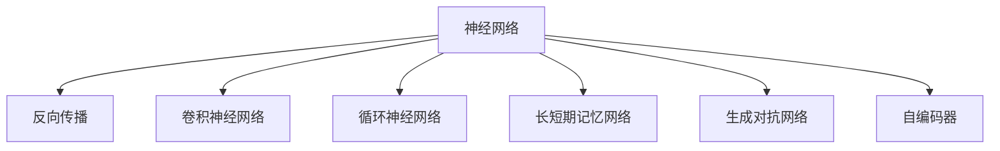

                 

# 神经网络：推动社会进步的力量

在当今数字化时代，神经网络（Neural Networks）作为一种强大的人工智能技术，正以令人惊叹的速度改变着我们的世界。从智能助手、自动驾驶汽车、医疗诊断到金融预测，几乎每一个角落都有神经网络的身影。本文将深入探讨神经网络的核心原理、关键应用以及未来发展方向，揭示其如何成为推动社会进步的强大力量。

## 1. 背景介绍

### 1.1 问题由来

神经网络技术的飞速发展，源于对深度学习模型能力的重新认识。深度学习作为人工智能的核心技术，已经在多个领域取得了显著的成果。神经网络正是深度学习的关键组成部分，通过模拟人脑神经元的工作方式，神经网络可以从数据中学习到抽象的特征表示，进行分类、回归、生成等多种复杂的任务。

深度学习的先驱之一是Geoffrey Hinton，他于1986年首次提出反向传播算法，极大地推动了神经网络技术的发展。此后，通过大量的研究积累，神经网络技术逐渐成熟，并在2012年ImageNet图像识别挑战中取得了突破性进展，催生了今天广泛应用的卷积神经网络（Convolutional Neural Networks, CNNs）。

神经网络技术的突破，使得人工智能从理论研究走向实际应用，对各个行业产生了深远影响。医疗、金融、交通、制造业等行业纷纷引入神经网络，优化流程、提高效率、降低成本，开启了智能化的新时代。

### 1.2 问题核心关键点

神经网络的核心在于其强大的非线性表达能力和自适应学习能力。神经网络通过多层非线性变换，将输入数据映射到高维空间，能够捕获到复杂、非线性的数据特征。此外，神经网络具备高度的自适应能力，通过反向传播算法不断调整模型参数，优化模型性能，使其在复杂任务中取得良好效果。

神经网络的应用领域广泛，涵盖了计算机视觉、自然语言处理、语音识别、推荐系统等多个方面。其独特的架构和强大的学习能力，使得神经网络成为推动社会进步的重要技术。

## 2. 核心概念与联系

### 2.1 核心概念概述

为更好地理解神经网络的核心原理，本节将介绍几个密切相关的核心概念：

- 神经网络（Neural Networks）：由大量神经元（Neurons）组成的网络结构，通过多层非线性变换进行特征学习。
- 反向传播（Backpropagation）：神经网络的训练算法，通过梯度下降优化模型参数，使得网络能够准确预测输入。
- 卷积神经网络（Convolutional Neural Networks, CNNs）：一种特殊的神经网络结构，常用于图像处理和计算机视觉任务，通过卷积操作提取局部特征。
- 循环神经网络（Recurrent Neural Networks, RNNs）：一种能够处理序列数据的神经网络，常用于自然语言处理和语音识别任务，通过循环结构捕捉序列依赖。
- 长短期记忆网络（Long Short-Term Memory, LSTM）：一种特殊的RNN结构，通过门控机制解决梯度消失问题，适用于处理长时间序列数据。
- 生成对抗网络（Generative Adversarial Networks, GANs）：一种生成模型，通过两个对抗的网络进行训练，生成高质量的图像、音频等。
- 自编码器（Autoencoder）：一种无监督学习模型，通过重构输入数据的方式学习数据的低维表示。

这些核心概念之间的逻辑关系可以通过以下Mermaid流程图来展示：



这个流程图展示了大类神经网络结构的层次关系：

1. 神经网络通过反向传播算法进行训练，学习数据特征。
2. 卷积神经网络用于处理图像数据，通过卷积操作提取局部特征。
3. 循环神经网络处理序列数据，通过循环结构捕捉序列依赖。
4. 长短期记忆网络是循环神经网络的一种变体，解决梯度消失问题。
5. 生成对抗网络通过对抗训练生成高质量的图像、音频等。
6. 自编码器通过重构输入数据，学习数据的低维表示。

## 3. 核心算法原理 & 具体操作步骤
### 3.1 算法原理概述

神经网络的核心算法是反向传播算法。该算法通过链式法则计算损失函数对模型参数的梯度，并根据梯度调整参数，最小化预测误差，提升模型性能。

### 3.2 算法步骤详解

神经网络的反向传播算法一般包括以下几个关键步骤：

**Step 1: 前向传播计算预测输出**

给定输入数据 $x$，通过前向传播计算神经网络的预测输出 $y$：

$$
y = f(W^Tx + b)
$$

其中 $f$ 为激活函数，$W$ 和 $b$ 为模型参数。

**Step 2: 计算损失函数**

根据预测输出 $y$ 和真实标签 $y^*$，计算损失函数 $L(y, y^*)$：

$$
L(y, y^*) = \frac{1}{N}\sum_{i=1}^N (y_i - y_i^*)^2
$$

其中 $N$ 为样本数。

**Step 3: 反向传播计算梯度**

通过反向传播算法计算损失函数对模型参数的梯度：

$$
\frac{\partial L}{\partial W} = \frac{\partial L}{\partial y} \cdot \frac{\partial y}{\partial W}
$$

$$
\frac{\partial L}{\partial b} = \frac{\partial L}{\partial y} \cdot \frac{\partial y}{\partial b}
$$

其中 $\frac{\partial y}{\partial W}$ 和 $\frac{\partial y}{\partial b}$ 可通过链式法则递归计算。

**Step 4: 更新模型参数**

根据梯度下降算法更新模型参数：

$$
W \leftarrow W - \eta \frac{\partial L}{\partial W}, \quad b \leftarrow b - \eta \frac{\partial L}{\partial b}
$$

其中 $\eta$ 为学习率，通常取值为 $0.001$ 或 $0.01$。

### 3.3 算法优缺点

神经网络算法具有以下优点：

1. 强大的非线性表达能力：多层非线性变换能够捕获复杂、非线性的数据特征，适用于处理各种类型的输入数据。
2. 高度的自适应学习能力：通过反向传播算法不断调整模型参数，优化模型性能，适应数据分布的变化。
3. 适用范围广泛：可以应用于图像识别、语音识别、自然语言处理、推荐系统等多个领域，推动各行各业的智能化转型。
4. 高效的并行计算：神经网络通常具有较大的计算量，并行计算能够显著提高训练速度和推理效率。

同时，该算法也存在一些缺点：

1. 过拟合风险：神经网络模型参数较多，容易出现过拟合现象。需要引入正则化技术，如Dropout、L2正则等，避免过拟合。
2. 计算资源消耗大：神经网络模型通常具有较大的参数量和计算量，需要高性能的硬件设备进行训练和推理。
3. 训练时间长：神经网络的训练过程通常需要大量的样本和计算资源，训练时间较长，对实时应用存在一定的限制。
4. 难以解释：神经网络的决策过程通常是"黑盒"的，难以对其内部机制进行解释和调试，增加了模型的可解释性挑战。

尽管存在这些局限性，但神经网络算法仍是目前最强大、最有效的深度学习技术之一。通过不断的技术进步和算法优化，神经网络将在更多领域发挥重要作用。

### 3.4 算法应用领域

神经网络的应用领域广泛，涵盖了以下几个方面：

- **计算机视觉**：神经网络在图像识别、物体检测、图像生成等方面表现优异，广泛应用于自动驾驶、人脸识别、医学影像分析等领域。
- **自然语言处理**：神经网络在语言模型、机器翻译、情感分析、文本生成等方面取得了显著成果，推动了智能客服、智能写作、智能问答等应用的发展。
- **语音识别**：神经网络在语音识别和生成任务中表现出色，成为智能音箱、语音助手等设备的核心技术。
- **推荐系统**：神经网络通过学习用户行为和物品特征，推荐个性化的内容，广泛应用于电商、视频、新闻等平台。
- **游戏AI**：神经网络在强化学习任务中表现出色，能够自主学习和决策，推动了电子游戏和机器人领域的发展。
- **生物医药**：神经网络在蛋白质结构预测、药物发现、基因组分析等方面显示出巨大潜力，加速了生物医药领域的研究和应用。

以上领域只是神经网络应用的冰山一角，未来随着技术的不断进步，神经网络将在更多领域发挥重要作用，推动社会的智能化转型。

## 4. 数学模型和公式 & 详细讲解 & 举例说明
### 4.1 数学模型构建

神经网络的数学模型通常包括输入层、若干个隐藏层和输出层，每层由多个神经元组成。

- 输入层：接收原始数据，每个神经元代表输入的一个特征。
- 隐藏层：通过非线性变换提取数据特征，隐藏层数可根据任务复杂度进行调整。
- 输出层：输出最终结果，通常对应具体的任务类型，如分类、回归、生成等。

### 4.2 公式推导过程

以一个简单的多层感知器（Multilayer Perceptron, MLP）为例，推导神经网络的数学模型：

- **输入层**：

$$
z_1 = x_1w_{11} + x_2w_{12} + b_1
$$

$$
z_2 = x_1w_{21} + x_2w_{22} + b_2
$$

其中 $x_1, x_2$ 为输入数据，$w_{11}, w_{12}, w_{21}, w_{22}$ 为权重参数，$b_1, b_2$ 为偏置参数。

- **隐藏层**：

$$
h_1 = \sigma(z_1)
$$

$$
h_2 = \sigma(z_2)
$$

其中 $\sigma$ 为激活函数，通常使用sigmoid或ReLU函数。

- **输出层**：

$$
y = h_1w_{31} + h_2w_{32} + b_3
$$

其中 $h_1, h_2$ 为隐藏层输出，$w_{31}, w_{32}, b_3$ 为输出层参数。

通过前向传播计算得到预测输出 $y$。

### 4.3 案例分析与讲解

以ImageNet图像识别任务为例，展示神经网络的应用：

- **输入数据**：原始图像数据。
- **隐藏层**：通过卷积操作提取局部特征，通过池化操作降低特征维度，多次重复操作提取更高级别的特征。
- **输出层**：使用全连接层将特征映射到1000个类别的概率分布。

使用反向传播算法训练模型，最小化损失函数，调整模型参数，使得模型能够准确预测图像类别。

## 5. 项目实践：代码实例和详细解释说明
### 5.1 开发环境搭建

在进行神经网络项目实践前，我们需要准备好开发环境。以下是使用Python进行TensorFlow开发的典型环境配置流程：

1. 安装Anaconda：从官网下载并安装Anaconda，用于创建独立的Python环境。

2. 创建并激活虚拟环境：
```bash
conda create -n tf-env python=3.8 
conda activate tf-env
```

3. 安装TensorFlow：根据CUDA版本，从官网获取对应的安装命令。例如：
```bash
conda install tensorflow-gpu=2.7.0
```

4. 安装各类工具包：
```bash
pip install numpy pandas scikit-learn matplotlib tqdm jupyter notebook ipython
```

完成上述步骤后，即可在`tf-env`环境中开始神经网络实践。

### 5.2 源代码详细实现

下面我们以手写数字识别（MNIST）任务为例，给出使用TensorFlow实现多层感知器的PyTorch代码实现。

首先，定义数据处理函数：

```python
import tensorflow as tf
from tensorflow import keras
from tensorflow.keras import layers

def load_data():
    (x_train, y_train), (x_test, y_test) = keras.datasets.mnist.load_data()
    x_train = x_train.reshape(-1, 28 * 28) / 255.0
    x_test = x_test.reshape(-1, 28 * 28) / 255.0
    return (x_train, y_train), (x_test, y_test)
```

然后，定义模型：

```python
def create_model(input_dim):
    model = keras.Sequential([
        layers.Dense(64, activation='relu', input_dim=input_dim),
        layers.Dense(64, activation='relu'),
        layers.Dense(10, activation='softmax')
    ])
    return model
```

接着，定义训练和评估函数：

```python
def compile_model(model, optimizer, loss_fn):
    model.compile(optimizer=optimizer, loss=loss_fn, metrics=['accuracy'])

def train_model(model, train_data, epochs, batch_size):
    model.fit(train_data[0], train_data[1], epochs=epochs, batch_size=batch_size, validation_split=0.2)

def evaluate_model(model, test_data, batch_size):
    test_loss, test_acc = model.evaluate(test_data[0], test_data[1], batch_size=batch_size)
    print(f'Test Loss: {test_loss:.4f}, Test Accuracy: {test_acc:.4f}')
```

最后，启动训练流程并在测试集上评估：

```python
(x_train, y_train), (x_test, y_test) = load_data()

model = create_model(input_dim=784)
optimizer = tf.keras.optimizers.Adam(learning_rate=0.001)
compile_model(model, optimizer, loss_fn='categorical_crossentropy')
train_model(model, (x_train, y_train), epochs=10, batch_size=64)
evaluate_model(model, (x_test, y_test), batch_size=64)
```

以上就是使用TensorFlow实现手写数字识别任务的完整代码实现。可以看到，使用TensorFlow的高层API（如Sequential、Dense等），可以方便地搭建和训练神经网络模型。

### 5.3 代码解读与分析

让我们再详细解读一下关键代码的实现细节：

**load_data函数**：
- 加载MNIST数据集，将其转换为浮点数并归一化。

**create_model函数**：
- 定义多层感知器的模型结构，包含两个隐藏层和一个输出层。

**compile_model函数**：
- 定义模型的优化器和损失函数，并编译模型。

**train_model函数**：
- 定义训练过程，使用Adam优化器进行梯度下降训练。

**evaluate_model函数**：
- 定义评估过程，计算测试集上的损失和准确率。

**启动训练流程**：
- 加载数据集，创建模型，定义优化器和损失函数，编译模型，训练模型，评估模型。

可以看到，使用TensorFlow搭建神经网络模型非常简单，可以极大地降低开发成本。TensorFlow的高层API和底层计算图机制，使得开发者可以专注于模型设计和算法优化，而不必过多关注底层实现细节。

当然，工业级的系统实现还需考虑更多因素，如模型的保存和部署、超参数的自动搜索、更灵活的任务适配层等。但核心的神经网络模型搭建和训练流程与上述示例类似。

## 6. 实际应用场景
### 6.1 智能推荐系统

神经网络在推荐系统中的应用非常广泛。通过学习用户行为和物品特征，推荐系统可以为用户提供个性化的内容推荐，提升用户体验和满意度。

在推荐系统中，通常使用协同过滤和内容基推荐两种方法。协同过滤方法通过用户历史行为数据和物品相似度，预测用户对未交互物品的评分，从而推荐物品。内容基推荐方法通过物品特征和用户兴趣点，预测用户对物品的评分，从而推荐物品。

使用神经网络可以进一步提升推荐系统的效果。以协同过滤为例，可以使用深度神经网络对用户历史行为数据进行建模，提取用户兴趣和物品特征，从而提升推荐效果。例如，可以使用LSTM网络捕捉用户行为序列，使用CNN网络提取物品特征，使用全连接层进行用户行为和物品特征的融合。

### 6.2 医疗诊断系统

神经网络在医疗诊断系统中也有广泛应用。通过学习医学影像和病历数据，神经网络可以辅助医生进行疾病诊断和预测。

在医疗诊断中，通常使用卷积神经网络（CNNs）对医学影像进行特征提取和分类。CNNs能够自动学习图像中的局部特征和全局结构，从而提高图像分类的准确率。例如，可以使用CNNs对X光片、CT影像等进行肺部结节检测、肿瘤诊断等任务。

此外，还可以使用递归神经网络（RNNs）对病历数据进行处理，提取文本中的关键信息，进行疾病预测和诊断。例如，可以使用LSTM网络对病历数据进行序列建模，提取文本中的时间、地点、症状等信息，进行疾病预测。

### 6.3 金融预测系统

神经网络在金融预测系统中也有广泛应用。通过学习历史金融数据，神经网络可以预测股票价格、汇率波动等金融指标。

在金融预测中，通常使用循环神经网络（RNNs）对时间序列数据进行处理，提取时间依赖关系，进行预测。例如，可以使用LSTM网络对历史股票价格进行序列建模，预测未来的股票价格波动。

此外，还可以使用生成对抗网络（GANs）生成高质量的金融数据，提高预测模型的泛化能力。例如，可以使用GANs生成合成股票数据，对预测模型进行增强训练。

### 6.4 未来应用展望

随着神经网络技术的不断进步，未来在更多领域将看到神经网络的应用：

- **自动驾驶**：神经网络在图像识别、环境感知、路径规划等方面具有显著优势，推动自动驾驶技术的快速发展。
- **智能制造**：神经网络在质量检测、设备预测性维护、生产调度等方面发挥重要作用，提升制造业的智能化水平。
- **智慧医疗**：神经网络在疾病预测、医疗影像分析、药物发现等方面取得突破，推动医疗服务的智能化转型。
- **智能客服**：神经网络在智能问答、语音识别、自然语言处理等方面取得显著成果，提升客服系统的智能化水平。
- **社会治理**：神经网络在城市管理、公共安全、环境保护等方面发挥重要作用，推动社会治理的智能化转型。

神经网络技术将在更多领域发挥重要作用，推动社会的智能化转型。未来，随着技术的不断进步和应用场景的拓展，神经网络将在更多领域展示其强大的潜力，推动社会的进步和发展。

## 7. 工具和资源推荐
### 7.1 学习资源推荐

为了帮助开发者系统掌握神经网络理论基础和实践技巧，这里推荐一些优质的学习资源：

1. 《深度学习》（Ian Goodfellow等著）：全面介绍深度学习的基本概念、模型架构和算法优化，是深度学习领域的经典教材。

2. 《Python深度学习》（Francois Chollet著）：使用Keras框架介绍深度学习模型的搭建和训练，适合快速上手。

3. 《Neural Networks and Deep Learning》（Michael Nielsen著）：讲解神经网络的核心原理和应用，适合初学者入门。

4. 《CS231n: Convolutional Neural Networks for Visual Recognition》：斯坦福大学开设的计算机视觉课程，包含大量深度学习实践案例。

5. 《CS224n: Natural Language Processing with Deep Learning》：斯坦福大学开设的自然语言处理课程，涵盖深度学习在NLP中的应用。

6. 《Deep Learning Specialization》：由Andrew Ng教授主讲的深度学习系列课程，适合系统学习深度学习。

通过对这些资源的学习实践，相信你一定能够快速掌握神经网络的核心原理和应用技巧，并用于解决实际的NLP问题。

### 7.2 开发工具推荐

高效的开发离不开优秀的工具支持。以下是几款用于神经网络开发的常用工具：

1. TensorFlow：由Google主导开发的深度学习框架，生产部署方便，适合大规模工程应用。

2. PyTorch：基于Python的开源深度学习框架，灵活动态的计算图，适合快速迭代研究。

3. Keras：Keras提供了高层次的API，可以方便地搭建和训练神经网络模型。

4. JAX：Google开发的深度学习框架，支持JIT编译、自动微分等特性，适合高性能计算。

5. MXNet：由Apache开发的深度学习框架，支持多种编程语言和硬件设备，适合大规模分布式训练。

6. Caffe：由Berkeley开发的深度学习框架，适合图像处理和计算机视觉任务。

合理利用这些工具，可以显著提升神经网络开发效率，加快创新迭代的步伐。

### 7.3 相关论文推荐

神经网络的发展源于学界的持续研究。以下是几篇奠基性的相关论文，推荐阅读：

1. Backpropagation Algorithm and its Application to Speech Recognition（反向传播算法及其在语音识别中的应用）：1986年，Geoffrey Hinton提出反向传播算法，奠定了深度学习的基础。

2. ImageNet Classification with Deep Convolutional Neural Networks（使用深度卷积神经网络进行图像分类）：2012年，Alex Krizhevsky等提出AlexNet，在ImageNet图像识别挑战中取得突破性进展。

3. Deep Residual Learning for Image Recognition（深度残差学习进行图像识别）：2015年，Kaiming He等提出ResNet，进一步提升深度神经网络的效果。

4. Attention Is All You Need（注意力机制是关键）：2017年，Ashish Vaswani等提出Transformer模型，开创了自注意力机制的先河。

5. Learning Transferable Architectures for Scalable Image Recognition（学习可迁移的模型架构进行可扩展的图像识别）：2017年，Ian Goodfellow等提出Tower Architecture，解决大规模图像分类问题。

这些论文代表了大神经网络的发展脉络。通过学习这些前沿成果，可以帮助研究者把握学科前进方向，激发更多的创新灵感。

## 8. 总结：未来发展趋势与挑战

### 8.1 总结

本文对神经网络的核心原理、关键应用以及未来发展方向进行了全面系统的介绍。首先阐述了神经网络的兴起背景和重要意义，明确了神经网络在推动社会进步中的核心地位。其次，从原理到实践，详细讲解了神经网络的数学模型和关键算法，给出了神经网络项目开发的完整代码实现。同时，本文还广泛探讨了神经网络在智能推荐、医疗诊断、金融预测等诸多领域的实际应用，展示了神经网络技术的广阔前景。此外，本文精选了神经网络技术的各类学习资源，力求为读者提供全方位的技术指引。

通过本文的系统梳理，可以看到，神经网络作为当前最强大的人工智能技术之一，已经在多个领域展示其卓越的能力。未来，随着技术的不断进步和应用场景的拓展，神经网络将在更多领域发挥重要作用，推动社会的智能化转型。

### 8.2 未来发展趋势

展望未来，神经网络技术将呈现以下几个发展趋势：

1. 模型的深度和规模将不断增大。随着算力成本的下降和数据规模的扩张，神经网络模型将逐步迈向更大的深度和规模，从而获得更强大的表达能力。

2. 模型架构将更加多样化。未来将涌现更多高效的神经网络架构，如Transformer、ResNet、LSTM等，解决不同类型任务的需求。

3. 迁移学习将成为主流。神经网络模型将通过迁移学习在不同领域和任务间进行知识共享，提升模型泛化能力和适应性。

4. 模型集成和融合将更加普遍。未来的神经网络模型将更多地进行组合和融合，如Stacking、Ensemble等，提升模型的稳定性和鲁棒性。

5. 模型的自监督学习将进一步增强。未来将涌现更多无监督和半监督学习范式，通过自监督学习提升模型的表达能力和泛化能力。

6. 模型的在线学习将成为常态。未来的神经网络模型将更多地进行在线学习，动态更新模型参数，适应数据分布的变化。

7. 模型的可解释性将进一步提升。未来的神经网络模型将更多地使用可解释性技术，如Attention机制、Layer-wise可视化等，提升模型的可解释性和可信度。

8. 模型的伦理与安全将受到更多关注。未来的神经网络模型将更多地进行伦理和安全设计，避免模型偏见、隐私泄露等问题。

这些趋势将推动神经网络技术不断进步，为社会带来更多的智能化和进步。

### 8.3 面临的挑战

尽管神经网络技术取得了显著进展，但在迈向更加智能化、普适化应用的过程中，仍面临诸多挑战：

1. 数据隐私和安全问题。神经网络模型在处理大量数据时，可能面临数据泄露和隐私侵害的风险，需要加强数据保护和安全设计。

2. 模型的鲁棒性和泛化能力。神经网络模型在面对噪声、干扰等情况下，鲁棒性和泛化能力有待提高，需要引入更多正则化技术和训练技巧。

3. 模型的可解释性和可信度。神经网络模型通常具有"黑盒"特性，难以解释其内部机制和决策逻辑，需要更多可解释性技术和模型可视化手段。

4. 模型的资源消耗和训练成本。神经网络模型通常具有较大的参数量和计算量，需要高性能的硬件设备进行训练和推理，训练成本较高。

5. 模型的公平性和伦理问题。神经网络模型可能学习到数据中的偏见和歧视，导致不公正的决策，需要引入公平性和伦理设计的技术。

6. 模型的适应性和迁移能力。神经网络模型在不同领域和任务间进行迁移时，效果可能大打折扣，需要更多迁移学习技术和领域自适应方法。

这些挑战需要不断突破和解决，才能推动神经网络技术走向成熟，真正实现其潜力。

### 8.4 研究展望

面对神经网络技术面临的挑战，未来的研究需要在以下几个方面寻求新的突破：

1. 探索无监督和半监督学习范式。摆脱对大规模标注数据的依赖，利用自监督学习、主动学习等无监督和半监督范式，最大限度利用非结构化数据，实现更加灵活高效的神经网络模型。

2. 研究参数高效和计算高效的模型结构。开发更加参数高效的模型结构，在固定大部分预训练参数的同时，只更新极少量的任务相关参数，提升模型的迁移能力和泛化能力。

3. 引入因果推断和强化学习思想。通过引入因果推断和强化学习思想，增强神经网络模型的因果关系和决策能力，提升模型的稳定性和鲁棒性。

4. 融合符号化的先验知识。将符号化的先验知识，如知识图谱、逻辑规则等，与神经网络模型进行巧妙融合，引导神经网络模型学习更准确、合理的语言模型。

5. 结合因果分析和博弈论工具。将因果分析方法引入神经网络模型，识别出模型决策的关键特征，增强模型输出的因果性和逻辑性。

6. 纳入伦理道德约束。在神经网络模型训练目标中引入伦理导向的评估指标，过滤和惩罚有偏见、有害的输出倾向，确保模型的伦理和安全。

这些研究方向的探索，必将引领神经网络技术迈向更高的台阶，为构建安全、可靠、可解释、可控的智能系统铺平道路。面向未来，神经网络技术还需要与其他人工智能技术进行更深入的融合，如知识表示、因果推理、强化学习等，多路径协同发力，共同推动人工智能技术的进步。只有勇于创新、敢于突破，才能不断拓展神经网络技术的边界，让智能技术更好地造福人类社会。

## 9. 附录：常见问题与解答

**Q1：神经网络如何避免过拟合？**

A: 神经网络模型通常具有较多的参数量，容易出现过拟合现象。为了避免过拟合，可以采取以下措施：

1. 数据增强：通过旋转、缩放、翻转等方式扩充训练集，增加数据多样性。

2. 正则化：使用L2正则、Dropout、Early Stopping等技术，避免过拟合。

3. 模型集成：通过Bagging、Boosting等方法进行模型集成，提升模型的泛化能力。

4. 模型裁剪：通过剪枝、量化等技术对模型进行裁剪，减少模型参数量。

这些措施可以显著提升神经网络的泛化能力和稳定性，避免过拟合现象。

**Q2：神经网络如何提高训练效率？**

A: 神经网络模型的训练过程通常需要大量的计算资源，为提高训练效率，可以采取以下措施：

1. 使用GPU/TPU等高性能设备进行训练，加速计算过程。

2. 采用模型并行和分布式训练，利用多台设备同时进行训练，提高训练速度。

3. 使用梯度累积和混合精度训练，减少每次迭代计算量，提高训练效率。

4. 使用迁移学习技术，利用预训练模型初始化权重，减少训练时间。

5. 使用深度学习框架的优化器（如Adam、Adagrad等），加速训练过程。

通过这些措施，可以显著提高神经网络的训练效率，缩短训练时间。

**Q3：神经网络如何提高模型的可解释性？**

A: 神经网络模型通常具有"黑盒"特性，难以解释其内部机制和决策逻辑。为提高模型的可解释性，可以采取以下措施：

1. Attention机制：通过Attention机制，可视化模型在输入中关注的关键部分，解释模型的决策依据。

2. Layer-wise可视化：通过可视化不同层中的特征表示，解释模型的特征学习过程。

3. SHAP（SHapley Additive exPlanations）：通过SHAP值，计算每个特征对模型输出的贡献，解释模型的预测结果。

4. LIME（Local Interpretable Model-agnostic Explanations）：通过局部解释技术，生成模型在输入附近的解释结果，帮助理解模型的行为。

5. 知识图谱：将知识图谱与神经网络模型结合，解释模型在知识图谱中的推理过程，增强模型的可解释性。

这些措施可以显著提升神经网络的可解释性和可信度，帮助用户理解和信任模型的决策过程。

**Q4：神经网络如何处理大规模数据集？**

A: 神经网络模型通常需要处理大规模数据集，为处理大规模数据集，可以采取以下措施：

1. 数据分批次加载：通过TensorFlow的DataLoader等工具，将数据分批次加载到模型中，避免内存溢出。

2. 数据预处理：对数据进行归一化、标准化、特征工程等预处理，提高数据质量。

3. 分布式训练：利用多台设备同时进行训练，加速计算过程。

4. 模型裁剪和量化：通过剪枝、量化等技术对模型进行裁剪，减少模型参数量，提高计算效率。

5. 数据增强：通过旋转、缩放、翻转等方式扩充训练集，增加数据多样性，提高模型泛化能力。

通过这些措施，可以显著处理大规模数据集，提高神经网络的训练和推理效率。

**Q5：神经网络如何处理不平衡数据集？**

A: 神经网络模型在处理不平衡数据集时，容易出现类别偏斜的问题。为处理不平衡数据集，可以采取以下措施：

1. 重采样：对少数类样本进行过采样或对多数类样本进行欠采样，平衡数据分布。

2. 类别权重：为少数类样本设置更高的权重，提升其在模型训练中的重要性。

3. 生成对抗训练：利用生成对抗网络生成合成数据，增加少数类样本的数量。

4. Focal Loss：使用Focal Loss等损失函数，提升少数类样本的学习效果。

5. 阈值调整：通过调整模型的预测阈值，提高少数类样本的识别率。

通过这些措施，可以显著提升神经网络在不平衡数据集上的性能，避免类别偏斜问题。

---

作者：禅与计算机程序设计艺术 / Zen and the Art of Computer Programming

