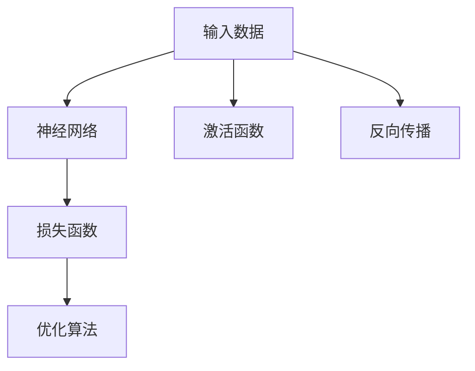

                 

# 神经网络：推动社会进步的力量

## 1. 背景介绍

### 1.1 问题由来

在过去的几十年中，神经网络（Neural Networks, NNs）这一深度学习技术为人工智能（AI）的发展开辟了新的道路，其变革性的力量在多个领域中逐渐显现。从图像识别、语音处理到自然语言理解、自动驾驶等，神经网络的应用范围和深度正在不断拓展，推动着人类社会的进步。

### 1.2 问题核心关键点

神经网络之所以能够推动社会进步，主要基于以下几点：
1. **高度的拟合能力**：通过多层的非线性变换，神经网络能够学习复杂的特征关系，实现对数据的高度拟合。
2. **强大的泛化能力**：经过良好训练的神经网络能够很好地适应新数据，泛化到不同的应用场景。
3. **高效的自动特征提取**：通过自动学习特征，神经网络减少了人工设计特征的复杂性，提升了数据处理效率。
4. **强大的模型学习能力**：通过反向传播算法和大规模数据集训练，神经网络能够不断提升自身的性能和表现。
5. **跨领域应用性**：神经网络可以应用于几乎所有的数据密集型任务，从医疗诊断到金融预测，展示了其跨领域的应用潜力。

## 2. 核心概念与联系

### 2.1 核心概念概述

为更好地理解神经网络，本节将介绍几个核心概念：

- **神经网络（Neural Network, NN）**：由多层神经元（Neurons）通过连接构成的网络结构，用于学习输入数据的特征和模式。
- **反向传播（Backpropagation）**：一种用于优化神经网络模型参数的算法，通过链式法则计算误差梯度，反向更新模型参数。
- **激活函数（Activation Function）**：用于引入非线性变换，如ReLU、Sigmoid、Tanh等，使得神经网络可以学习非线性关系。
- **损失函数（Loss Function）**：用于衡量模型输出与真实标签之间的差异，如均方误差、交叉熵等。
- **优化算法（Optimization Algorithm）**：如随机梯度下降（SGD）、Adam等，用于更新模型参数，最小化损失函数。

这些核心概念之间的逻辑关系可以通过以下Mermaid流程图来展示：



这个流程图展示了几类核心概念之间的关系：

1. 输入数据经过神经网络的层级处理，得到模型输出。
2. 损失函数衡量模型输出与真实标签之间的差异。
3. 优化算法用于最小化损失函数，更新模型参数。
4. 激活函数引入非线性变换，使得网络可以学习复杂关系。
5. 反向传播算法通过链式法则计算误差梯度，更新参数。

## 3. 核心算法原理 & 具体操作步骤

### 3.1 算法原理概述

神经网络的训练过程主要基于反向传播算法。该算法通过链式法则，计算误差对各个参数的梯度，并据此更新模型参数，以最小化损失函数。

假设有一个简单的前馈神经网络，包含两个隐藏层 $h_1, h_2$ 和一个输出层 $y$。网络结构如下：

```
input --(输入层)--> h1 --(隐藏层1)--> h2 --(隐藏层2)--> output
```

网络通过反向传播算法进行训练。假设当前输入为 $x$，真实标签为 $y^*$，模型的预测输出为 $\hat{y}$。则网络的总误差 $\mathcal{L}$ 定义为：

$$
\mathcal{L} = \frac{1}{N} \sum_{i=1}^N \ell(y_i, \hat{y_i})
$$

其中 $\ell(y_i, \hat{y_i})$ 为单个样本的损失函数，如均方误差。

### 3.2 算法步骤详解

神经网络的训练主要包括以下几个关键步骤：

**Step 1: 准备数据集**
- 收集并准备训练数据集 $D=\{(x_i,y_i)\}_{i=1}^N$，划分训练集、验证集和测试集。
- 对数据进行预处理，如归一化、标准化、标签编码等。

**Step 2: 初始化模型参数**
- 随机初始化模型参数 $w$ 和偏置 $b$，通常使用高斯分布或均匀分布。
- 设置优化算法及其参数，如学习率 $\eta$、批量大小 $M$ 等。

**Step 3: 前向传播**
- 将输入数据 $x$ 输入网络，计算各层输出 $h_1$、$h_2$ 和最终输出 $\hat{y}$。
- 使用激活函数 $\sigma$ 计算隐藏层的激活值。

**Step 4: 计算损失函数**
- 计算预测输出 $\hat{y}$ 与真实标签 $y^*$ 之间的误差 $\mathcal{L}$，使用均方误差或交叉熵等。
- 计算每个样本的损失值 $\ell$。

**Step 5: 反向传播**
- 使用链式法则计算误差 $\mathcal{L}$ 对各层参数的梯度 $\frac{\partial \mathcal{L}}{\partial w}, \frac{\partial \mathcal{L}}{\partial b}$。
- 将误差反向传播到每个神经元，计算各层的误差梯度。

**Step 6: 更新参数**
- 使用优化算法更新模型参数 $w$ 和 $b$，使得误差 $\mathcal{L}$ 最小化。
- 重复 Step 3-6 直到收敛或达到预设迭代次数。

**Step 7: 验证和测试**
- 在验证集上评估模型性能，防止过拟合。
- 在测试集上最终评估模型性能，提供性能指标。

### 3.3 算法优缺点

神经网络具有以下优点：
1. **强大的特征提取能力**：通过多层非线性变换，神经网络能够自动学习数据中的特征和模式。
2. **泛化能力强**：经过充分训练的神经网络，能够很好地泛化到新数据，避免过拟合。
3. **高效自动学习**：无需手工设计特征，神经网络能够自动学习输入数据的有效表示。
4. **可解释性强**：使用激活函数和反向传播算法，可以较好地解释模型的工作机制。

同时，神经网络也存在一些缺点：
1. **计算资源消耗大**：神经网络参数众多，训练和推理过程需要大量的计算资源。
2. **模型复杂度高**：神经网络的层数和节点数较多，训练过程容易过拟合。
3. **数据依赖性强**：需要大量的标注数据，训练过程对数据分布有较强依赖。
4. **模型可解释性不足**：复杂的非线性变换使得神经网络的内部工作机制难以解释。

尽管存在这些缺点，但神经网络在实际应用中表现优异，已成为推动人工智能发展的重要力量。

### 3.4 算法应用领域

神经网络已经被广泛应用于多个领域，以下是几个典型的应用场景：

- **图像识别**：通过卷积神经网络（CNN）处理图像数据，实现高效的图像分类和物体检测。
- **语音识别**：使用循环神经网络（RNN）和变种如长短时记忆网络（LSTM）、门控循环单元（GRU）等处理语音信号，实现语音识别和合成。
- **自然语言处理（NLP）**：利用递归神经网络（RNN）、卷积神经网络（CNN）和变种如注意力机制（Attention）等处理文本数据，实现文本分类、机器翻译、情感分析等任务。
- **推荐系统**：通过协同过滤和深度学习技术，基于用户历史行为数据，实现个性化推荐。
- **控制系统**：使用强化学习技术，构建智能控制系统，如自动驾驶、机器人等。

## 4. 数学模型和公式 & 详细讲解 & 举例说明

### 4.1 数学模型构建

本节将使用数学语言对神经网络进行更加严格的刻画。

假设有一个简单的前馈神经网络，包含两个隐藏层 $h_1, h_2$ 和一个输出层 $y$。网络的输入为 $x$，输出为 $\hat{y}$。各层的节点数分别为 $n_1, n_2, n_y$。

### 4.2 公式推导过程

首先，定义神经网络的参数 $w$ 和偏置 $b$：

$$
w = \{w_{ij}\}_{i=1}^{n_y-1, j=1}^{n_i} \in \mathbb{R}^{(n_y-1) \times n_i}
$$
$$
b = \{b_j\}_{j=1}^{n_i} \in \mathbb{R}^{n_i}
$$

其中 $w_{ij}$ 表示第 $j$ 层到第 $i$ 层的权重矩阵，$b_j$ 表示第 $j$ 层的偏置向量。

定义神经网络的激活函数 $\sigma$：

$$
\sigma(z) = \text{ReLU}(z) = \max(0, z)
$$

定义神经网络的输出 $\hat{y}$ 和损失函数 $\ell$：

$$
\hat{y} = \sigma(\mathbf{W}_y \sigma(\mathbf{W}_2 \sigma(\mathbf{W}_1 x + b_1) + b_2) + b_y)
$$

$$
\ell(y_i, \hat{y_i}) = \frac{1}{2}(y_i - \hat{y_i})^2
$$

其中 $\mathbf{W}_y, \mathbf{W}_2, \mathbf{W}_1$ 分别表示输出层和隐藏层的权重矩阵，$b_y, b_2, b_1$ 分别表示相应的偏置向量。

### 4.3 案例分析与讲解

考虑一个二分类问题，输入数据为 $x \in \mathbb{R}^n$，标签为 $y \in \{0,1\}$。使用一个简单的二层神经网络进行二分类，激活函数为ReLU，输出层使用Sigmoid函数：

$$
\hat{y} = \sigma(\mathbf{W}_y \sigma(\mathbf{W}_2 \sigma(\mathbf{W}_1 x + b_1) + b_2) + b_y)
$$

$$
\ell(y_i, \hat{y_i}) = -y_i \log \hat{y_i} - (1-y_i) \log (1-\hat{y_i})
$$

训练过程如下：

1. 输入数据 $x_i$ 和标签 $y_i$。
2. 前向传播计算预测输出 $\hat{y_i}$。
3. 计算损失函数 $\ell_i$。
4. 反向传播计算误差 $\mathcal{L}$ 对各层参数的梯度。
5. 使用优化算法更新模型参数。

这个过程可以使用Python和TensorFlow库实现：

```python
import tensorflow as tf
from tensorflow.keras import layers

# 定义模型
model = tf.keras.Sequential([
    layers.Dense(64, activation='relu', input_shape=(28,28)),
    layers.Dense(64, activation='relu'),
    layers.Dense(1, activation='sigmoid')
])

# 定义损失函数和优化器
loss_fn = tf.keras.losses.BinaryCrossentropy(from_logits=True)
optimizer = tf.keras.optimizers.Adam(learning_rate=0.001)

# 训练模型
model.compile(optimizer=optimizer, loss=loss_fn, metrics=['accuracy'])
model.fit(x_train, y_train, epochs=10, batch_size=32, validation_data=(x_val, y_val))
```

## 5. 项目实践：代码实例和详细解释说明

### 5.1 开发环境搭建

在进行神经网络项目开发前，需要准备好开发环境。以下是使用Python进行TensorFlow开发的环境配置流程：

1. 安装Anaconda：从官网下载并安装Anaconda，用于创建独立的Python环境。

2. 创建并激活虚拟环境：
```bash
conda create -n tf-env python=3.8 
conda activate tf-env
```

3. 安装TensorFlow：根据CUDA版本，从官网获取对应的安装命令。例如：
```bash
pip install tensorflow-gpu==2.7.0
```

4. 安装numpy、pandas、matplotlib等常用工具包：
```bash
pip install numpy pandas matplotlib scikit-learn
```

完成上述步骤后，即可在`tf-env`环境中开始神经网络开发。

### 5.2 源代码详细实现

下面我们以手写数字识别（MNIST数据集）为例，给出使用TensorFlow实现神经网络的完整代码实现。

首先，导入TensorFlow库和数据集：

```python
import tensorflow as tf
from tensorflow.keras.datasets import mnist

# 加载数据集
(x_train, y_train), (x_test, y_test) = mnist.load_data()
```

然后，定义数据预处理函数：

```python
def preprocess_data(data, image_size):
    data = data / 255.0  # 归一化
    data = tf.image.resize(data, [image_size, image_size])  # 调整图像大小
    return data

x_train = preprocess_data(x_train, 28)
x_test = preprocess_data(x_test, 28)
```

接着，定义神经网络模型：

```python
# 定义模型
model = tf.keras.Sequential([
    tf.keras.layers.Flatten(input_shape=(28,28)),
    tf.keras.layers.Dense(64, activation='relu'),
    tf.keras.layers.Dense(64, activation='relu'),
    tf.keras.layers.Dense(10, activation='softmax')
])

# 编译模型
model.compile(optimizer='adam', loss='sparse_categorical_crossentropy', metrics=['accuracy'])
```

最后，启动训练流程并在测试集上评估：

```python
# 训练模型
model.fit(x_train, y_train, epochs=10, batch_size=32, validation_data=(x_test, y_test))

# 评估模型
model.evaluate(x_test, y_test)
```

以上就是使用TensorFlow实现手写数字识别的完整代码实现。可以看到，得益于TensorFlow的强大封装，我们可以用相对简洁的代码完成神经网络的构建和训练。

### 5.3 代码解读与分析

让我们再详细解读一下关键代码的实现细节：

**preprocess_data函数**：
- 对输入数据进行归一化和图像调整，标准化输入数据格式，为模型接受。

**模型定义**：
- 使用Sequential模型顺序堆叠多个层级，包含输入层、两个隐藏层和一个输出层。
- 使用Flatten层将二维图像数据展平，输入到全连接层。
- 全连接层使用ReLU激活函数，隐藏层使用64个节点。
- 输出层使用softmax激活函数，输出10个类别的概率分布。

**模型编译**：
- 指定优化器、损失函数和评估指标。
- 使用Adam优化器，交叉熵损失函数，准确率评估指标。

**训练流程**：
- 调用model.fit方法，训练模型10个epoch，每次处理32个样本。
- 在验证集上评估模型性能。

**模型评估**：
- 调用model.evaluate方法，评估测试集上的性能指标。

可以看到，TensorFlow使得神经网络的构建和训练过程变得简洁高效。开发者可以将更多精力放在数据处理、模型改进等高层逻辑上，而不必过多关注底层的实现细节。

当然，工业级的系统实现还需考虑更多因素，如模型的保存和部署、超参数的自动搜索、更灵活的网络结构等。但核心的神经网络训练流程基本与此类似。

## 6. 实际应用场景

### 6.1 医疗影像诊断

在医疗领域，神经网络被广泛应用于影像诊断。通过大规模的影像数据预训练，神经网络可以学习到复杂的医学特征，并用于疾病诊断、影像分割等任务。

具体而言，可以将医疗影像数据进行标注，如肿瘤、器官、病灶等，构建标注数据集。在此基础上对神经网络进行预训练和微调，使其能够识别不同医学图像中的特定结构。然后，将微调后的模型应用于实际医疗影像，自动识别和标注各类病变，辅助医生进行诊断和治疗。

### 6.2 自动驾驶

自动驾驶技术是神经网络在汽车领域的重要应用之一。通过多传感器融合和深度学习技术，神经网络可以实时处理车辆传感器数据，识别道路、车辆、行人等目标，辅助驾驶员进行驾驶决策。

在实践中，可以收集大量的驾驶数据，包括车辆传感器数据、道路标线、交通信号等，进行标注和预训练。然后在实际驾驶场景中，使用神经网络对传感器数据进行处理，进行目标检测和行为预测，辅助驾驶决策。此外，神经网络还可以用于驾驶行为分析、事故预测等任务，提升驾驶安全性和效率。

### 6.3 金融风险预测

在金融领域，神经网络被广泛用于风险预测和资产管理。通过分析大量的金融数据，神经网络可以学习到市场趋势和行为模式，用于预测股票价格、信用评分、风险评估等任务。

具体而言，可以收集金融市场数据，如股票价格、交易量、新闻评论等，进行标注和预训练。然后，使用神经网络对实时数据进行处理，预测股票价格走势、评估信贷风险等。此外，神经网络还可以用于构建金融市场模型，进行市场分析和投资决策。

### 6.4 未来应用展望

随着神经网络的不断发展，其在多个领域的应用前景将更加广阔。以下列出了几个未来可能的应用方向：

- **智能制造**：使用神经网络进行质量控制、生产优化、故障诊断等任务，提高生产效率和产品质量。
- **智慧城市**：使用神经网络进行交通流量预测、智能安防、智慧能源管理等任务，提升城市管理和居民生活质量。
- **个性化推荐系统**：使用神经网络进行用户行为分析，构建个性化推荐模型，提升用户体验和推荐效果。
- **语音助手**：使用神经网络进行语音识别和自然语言理解，构建智能语音助手，提升人机交互体验。
- **自动生成文本**：使用神经网络进行文本生成和自然语言推理，构建智能写作、智能翻译、智能问答系统等。

## 7. 工具和资源推荐

### 7.1 学习资源推荐

为了帮助开发者系统掌握神经网络的理论基础和实践技巧，这里推荐一些优质的学习资源：

1. 《深度学习》课程（Coursera）：斯坦福大学Andrew Ng教授开设的深度学习课程，系统介绍了深度学习的基本原理和应用。
2. 《神经网络与深度学习》（Deep Learning）书籍：Ian Goodfellow等著，全面介绍了神经网络的理论基础和实践技术。
3. 《动手学深度学习》（Deep Learning with Python）书籍：李沐等著，提供Python实现的深度学习框架，涵盖神经网络、卷积神经网络、循环神经网络等。
4. PyTorch官方文档：PyTorch官方文档提供了丰富的神经网络模型和案例，是学习神经网络的重要参考。
5. TensorFlow官方文档：TensorFlow官方文档提供了大量的神经网络模型和案例，是学习神经网络的重要参考。

通过对这些资源的学习实践，相信你一定能够快速掌握神经网络的理论和实践技术，并用于解决实际的AI问题。

### 7.2 开发工具推荐

高效的开发离不开优秀的工具支持。以下是几款用于神经网络开发的常用工具：

1. PyTorch：基于Python的开源深度学习框架，灵活动态的计算图，适合快速迭代研究。

2. TensorFlow：由Google主导开发的开源深度学习框架，生产部署方便，适合大规模工程应用。

3. Keras：高层次的神经网络API，提供简洁易用的接口，快速搭建深度学习模型。

4. Jupyter Notebook：交互式的Python代码执行环境，支持多种格式的代码输入和输出，方便调试和分享。

5. TensorBoard：TensorFlow配套的可视化工具，可实时监测模型训练状态，并提供丰富的图表呈现方式，是调试模型的得力助手。

6. Weights & Biases：模型训练的实验跟踪工具，可以记录和可视化模型训练过程中的各项指标，方便对比和调优。

合理利用这些工具，可以显著提升神经网络的开发效率，加快创新迭代的步伐。

### 7.3 相关论文推荐

神经网络的发展离不开学界的持续研究。以下是几篇奠基性的相关论文，推荐阅读：

1. Backpropagation: Application to Handwritten Zeros (1989)：提出反向传播算法，奠定了神经网络训练的基础。
2. ImageNet Classification with Deep Convolutional Neural Networks (2012)：提出卷积神经网络（CNN），在图像识别任务上取得突破。
3. Deep Residual Learning for Image Recognition (2015)：提出残差网络（ResNet），解决了深层神经网络训练困难的问题。
4. Attention Is All You Need (2017)：提出Transformer结构，开启了NLP领域的预训练大模型时代。
5. Generative Adversarial Nets (2014)：提出生成对抗网络（GAN），在图像生成、语音合成等任务上取得突破。

这些论文代表了大神经网络的研究脉络。通过学习这些前沿成果，可以帮助研究者把握学科前进方向，激发更多的创新灵感。

## 8. 总结：未来发展趋势与挑战

### 8.1 总结

本文对神经网络的原理和应用进行了全面系统的介绍。首先阐述了神经网络的发展背景和重要应用，明确了其在推动社会进步方面的独特价值。其次，从原理到实践，详细讲解了神经网络的设计和训练过程，给出了神经网络项目开发的完整代码实例。同时，本文还广泛探讨了神经网络在医疗、自动驾驶、金融等领域的应用前景，展示了神经网络技术的广阔前景。此外，本文精选了神经网络相关的学习资源和开发工具，力求为读者提供全方位的技术指引。

通过本文的系统梳理，可以看到，神经网络技术正在成为人工智能发展的重要力量，其变革性的力量在多个领域中逐渐显现。得益于深度学习和大数据技术的发展，神经网络模型在精度、泛化能力和适应性方面取得了显著提升，成为推动科技进步的关键技术。未来，伴随神经网络的不断演进，其应用领域和影响力将进一步扩展，为社会带来更多深远的影响。

### 8.2 未来发展趋势

展望未来，神经网络将呈现以下几个发展趋势：

1. **模型规模持续增大**：随着计算资源和数据规模的提升，神经网络的规模将不断增大，涵盖更多复杂的非线性关系。
2. **模型结构更加多样化**：深度神经网络将与其它模型结构结合，如卷积神经网络（CNN）、循环神经网络（RNN）、注意力机制（Attention）等，形成更加复杂的网络结构。
3. **模型训练方法更加高效**：诸如自监督学习、无监督学习、半监督学习等训练方法将逐渐普及，提升神经网络的泛化能力和训练效率。
4. **模型可解释性增强**：通过对神经网络进行简化和可视化，提高其可解释性，增强模型的可信度和安全性。
5. **跨模态信息融合**：将神经网络与其他模型结合，如自然语言处理（NLP）、计算机视觉（CV）、语音处理（ASR）等，实现多模态信息的协同建模。

### 8.3 面临的挑战

尽管神经网络技术已经取得了显著成就，但在迈向更加智能化、普适化应用的过程中，它仍面临诸多挑战：

1. **计算资源消耗大**：神经网络模型参数众多，训练和推理过程需要大量的计算资源。如何提高计算效率，降低资源消耗，是一个重要研究方向。
2. **数据依赖性强**：需要大量的标注数据，训练过程对数据分布有较强依赖。如何降低数据需求，提升模型泛化能力，仍需深入研究。
3. **模型鲁棒性不足**：神经网络面对噪声数据和异常情况，容易出现过拟合和泛化性能下降。如何提高模型鲁棒性，增强模型泛化能力，是未来研究的重要方向。
4. **模型可解释性不足**：复杂的神经网络结构使得模型难以解释，导致算法可信度和安全性问题。如何提高模型可解释性，增强用户信任，是未来研究的重要方向。
5. **伦理和安全性问题**：神经网络可能会学习到有害信息，造成负面影响。如何确保模型的伦理和安全，是未来研究的重要方向。

### 8.4 研究展望

面对神经网络面临的诸多挑战，未来的研究需要在以下几个方面寻求新的突破：

1. **强化学习与神经网络结合**：将强化学习技术引入神经网络训练，提升模型的自适应能力和智能决策能力。
2. **多模态信息融合**：将神经网络与其他模型结合，实现多模态信息的协同建模，提升模型的综合表现。
3. **知识图谱与神经网络结合**：将符号化的先验知识与神经网络结合，提升模型的知识表示能力和推理能力。
4. **模型压缩与加速**：通过模型压缩和加速技术，如剪枝、量化、蒸馏等，提高模型的计算效率和资源利用率。
5. **跨领域知识迁移**：通过跨领域知识迁移，提升神经网络在新的任务和领域中的泛化能力和应用范围。
6. **对抗样本防御**：研究对抗样本攻击和防御技术，提升神经网络的鲁棒性和安全性。

这些研究方向将推动神经网络技术的进一步发展，提升其应用范围和表现效果，为人工智能技术的发展带来更多可能性。

## 9. 附录：常见问题与解答

**Q1: 神经网络与传统机器学习模型有何不同？**

A: 神经网络与传统机器学习模型的主要区别在于其模型结构和训练方式。神经网络通过多层非线性变换，能够自动学习数据的复杂特征和关系，而传统机器学习模型通常需要手工设计特征。此外，神经网络使用反向传播算法进行训练，能够自动优化模型参数，而传统机器学习模型需要手动调整模型参数。

**Q2: 神经网络训练时如何防止过拟合？**

A: 防止过拟合通常采用以下方法：
1. 数据增强：通过变换数据的方式扩充训练集，如旋转、缩放、翻转等。
2. 正则化：使用L2正则、Dropout等方法，防止模型对训练数据过度拟合。
3. 早停法：在验证集上监控模型性能，一旦性能不再提升，停止训练。
4. 集成学习：通过多个模型的结合，提升模型的泛化能力和鲁棒性。

**Q3: 神经网络在实际应用中面临哪些挑战？**

A: 神经网络在实际应用中面临以下挑战：
1. 计算资源消耗大：神经网络参数众多，训练和推理过程需要大量的计算资源。
2. 数据依赖性强：需要大量的标注数据，训练过程对数据分布有较强依赖。
3. 模型鲁棒性不足：神经网络面对噪声数据和异常情况，容易出现过拟合和泛化性能下降。
4. 模型可解释性不足：复杂的神经网络结构使得模型难以解释，导致算法可信度和安全性问题。
5. 伦理和安全性问题：神经网络可能会学习到有害信息，造成负面影响。

**Q4: 神经网络在哪些领域有应用？**

A: 神经网络在多个领域有广泛应用，包括但不限于：
1. 图像识别与处理：使用卷积神经网络（CNN）进行图像分类、目标检测等任务。
2. 自然语言处理（NLP）：使用递归神经网络（RNN）、卷积神经网络（CNN）等进行文本分类、机器翻译、情感分析等任务。
3. 语音识别与处理：使用循环神经网络（RNN）、变种如长短时记忆网络（LSTM）等进行语音识别和合成。
4. 自动驾驶：使用神经网络进行目标检测、行为预测等任务，辅助驾驶决策。
5. 医疗影像诊断：使用神经网络进行影像分割、疾病诊断等任务，辅助医疗决策。

**Q5: 如何训练一个高效的神经网络？**

A: 训练高效神经网络通常采用以下方法：
1. 网络结构设计：选择合适的网络结构，如卷积神经网络（CNN）、循环神经网络（RNN）等，根据任务特点进行设计。
2. 正则化技术：使用L2正则、Dropout等方法，防止模型对训练数据过度拟合。
3. 数据增强：通过变换数据的方式扩充训练集，如旋转、缩放、翻转等。
4. 集成学习：通过多个模型的结合，提升模型的泛化能力和鲁棒性。
5. 梯度裁剪：使用梯度裁剪技术，防止梯度爆炸或消失。

**Q6: 神经网络在深度学习中扮演什么角色？**

A: 神经网络在深度学习中扮演核心角色，主要体现在以下几个方面：
1. 强大的特征提取能力：通过多层非线性变换，神经网络能够自动学习数据的复杂特征和关系。
2. 高效的自动学习：无需手工设计特征，神经网络能够自动学习输入数据的有效表示。
3. 强大的模型学习能力：通过反向传播算法和大规模数据集训练，神经网络能够不断提升自身的性能和表现。

这些特性使得神经网络成为深度学习技术中不可或缺的核心组件，推动了深度学习在多个领域的应用和突破。

