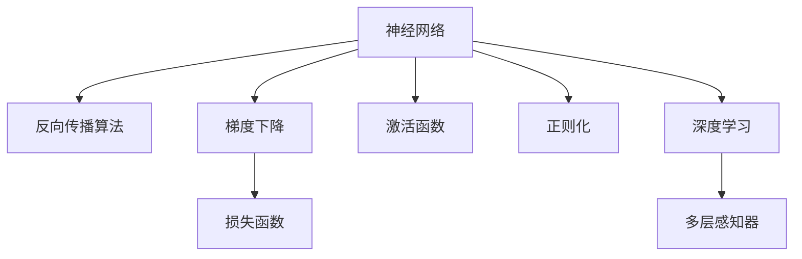

                 

# 神经网络：改变世界的技术

> 关键词：神经网络,深度学习,人工智能,机器学习,计算能力,大数据,创新,应用,技术

## 1. 背景介绍

### 1.1 问题由来
随着科技的进步，人工智能（AI）技术正以前所未有的速度快速发展。神经网络，作为AI的核心组成部分，已经成为推动现代科技进步的重要力量。神经网络通过模拟人类神经系统的工作原理，赋予机器学习和模仿人类认知和行为的能力，从而在众多领域产生了深远影响。

神经网络最初由生物神经学启发，通过多层感知器（Multi-Layer Perceptron, MLP）模型为基础，模拟大脑的神经元结构和信息处理机制。而现代深度学习技术的崛起，使得神经网络得以应用到更加复杂的问题中，例如图像识别、自然语言处理、语音识别和自动驾驶等领域，极大地拓展了人工智能的应用范围。

### 1.2 问题核心关键点
神经网络的核心在于通过反向传播算法（Backpropagation）和梯度下降（Gradient Descent）算法，对大规模数据集进行训练，以优化模型参数。这一过程被称为“深度学习”，是现代AI技术发展的核心动力。

核心技术点包括：
1. 多层感知器（MLP）：通过多层次的神经元，实现对非线性数据的复杂映射。
2. 反向传播算法：通过计算梯度，更新模型参数以最小化损失函数。
3. 梯度下降：用于参数更新的优化算法，通过迭代逐步优化模型。
4. 损失函数（Loss Function）：用于度量模型预测与真实标签之间的差距。
5. 激活函数（Activation Function）：决定神经元输出值的变化规则。
6. 正则化（Regularization）：防止过拟合，保持模型泛化能力。

神经网络的应用和发展，不仅推动了科技进步，也引发了新一轮的技术革命，影响深远。

### 1.3 问题研究意义
神经网络技术的研发和应用，对社会、经济、科技和工业领域产生了巨大影响：

1. 推动科技进步：神经网络的出现，使得AI技术可以实现更复杂的问题求解，并突破传统机器学习算法的局限。
2. 提升计算能力：神经网络能够处理海量数据，利用并行计算加速训练过程。
3. 大数据应用：神经网络能够从大数据中提取有用的特征，实现智能决策。
4. 促进创新：神经网络的多样性和深度，为算法创新和应用提供了新方向。
5. 实际应用：神经网络在多个领域实现了落地应用，提升了效率和质量。
6. 技术驱动：神经网络作为核心技术，成为推动AI技术发展的动力。

研究神经网络及其应用，有助于理解其原理和优势，更好地应用于实际问题中。

## 2. 核心概念与联系

### 2.1 核心概念概述

为深入理解神经网络的基本原理和结构，本节将介绍几个核心概念：

- **神经网络**：由大量的人工神经元（即节点）和节点之间的连接（即边）组成的网络。通过训练数据调整连接权重和节点激活状态，实现对输入数据的复杂映射。
- **深度学习**：利用多层神经网络进行数据处理和模式识别。其中，“深度”通常指网络中的层数和神经元数量。
- **反向传播算法**：一种用于训练神经网络的多层算法，通过梯度下降优化损失函数，调整神经元之间的连接权重。
- **梯度下降**：一种优化算法，通过不断迭代计算梯度，逐步调整模型参数，以最小化损失函数。
- **损失函数**：用于度量模型预测结果与真实标签之间的误差，如均方误差（MSE）、交叉熵（Cross Entropy）等。
- **激活函数**：决定神经元输出值的函数，如sigmoid、ReLU等。
- **正则化**：通过添加正则项，防止模型过拟合，保持模型泛化能力。

这些核心概念之间的联系可以通过以下Mermaid流程图来展示：



这个流程图展示了神经网络及其核心组件之间的关系：

1. **神经网络**：基本结构，通过反向传播算法进行参数优化。
2. **反向传播算法**：训练神经网络的核心方法，通过梯度下降调整连接权重。
3. **梯度下降**：优化算法，不断迭代调整参数。
4. **损失函数**：用于评估模型预测准确性。
5. **激活函数**：决定神经元输出值，保证非线性映射能力。
6. **正则化**：防止过拟合，保持模型泛化能力。
7. **深度学习**：应用多层神经网络，实现复杂数据映射。

这些概念共同构成了神经网络的理论基础和核心原理。

## 3. 核心算法原理 & 具体操作步骤
### 3.1 算法原理概述

神经网络通过反向传播算法和梯度下降算法进行参数优化。其核心思想是：利用输入数据对模型进行前向传播（Forward Propagation），计算损失函数。然后通过反向传播计算梯度，利用梯度下降算法更新参数，使得模型预测结果尽可能接近真实标签。

具体来说，对于一个给定的神经网络模型和训练数据集，算法步骤如下：

1. **前向传播**：输入数据通过网络，计算每个神经元的激活值，最终得到模型的输出。
2. **计算损失**：将模型的输出与真实标签进行对比，计算损失函数的值。
3. **反向传播**：利用链式法则计算梯度，通过反向传播将损失函数的梯度传递回每个神经元。
4. **更新参数**：通过梯度下降算法，根据梯度调整每个神经元的连接权重和激活状态。
5. **重复迭代**：重复上述步骤，直至模型收敛。

### 3.2 算法步骤详解

以下是神经网络训练的详细步骤：

**Step 1: 准备数据集**
- 准备训练集、验证集和测试集，通常要求数据集规模较大且分布均匀。

**Step 2: 定义模型结构**
- 根据任务类型选择合适的网络结构，如卷积神经网络（CNN）、递归神经网络（RNN）等。
- 确定网络层数、每层神经元数量、激活函数等。

**Step 3: 初始化参数**
- 随机初始化所有可训练参数，如权重和偏置。

**Step 4: 前向传播**
- 将输入数据通过网络，计算每个神经元的激活值，得到模型的输出。

**Step 5: 计算损失**
- 将模型的输出与真实标签进行对比，计算损失函数的值。

**Step 6: 反向传播**
- 利用链式法则计算每个神经元的梯度，传递回网络。

**Step 7: 更新参数**
- 根据梯度下降算法，更新模型参数，最小化损失函数。

**Step 8: 重复迭代**
- 重复Step 4到Step 7，直至模型收敛。

### 3.3 算法优缺点

神经网络训练的优缺点如下：

**优点：**
1. **强大的泛化能力**：通过多层神经元实现非线性映射，能处理复杂数据。
2. **并行计算能力**：利用GPU或TPU进行并行计算，加速训练过程。
3. **易于实现**：现代深度学习框架如TensorFlow、PyTorch等提供了大量预训练模型和工具。
4. **适用性广**：应用领域广泛，如图像识别、自然语言处理、语音识别等。

**缺点：**
1. **需要大量数据**：训练过程中需要大量标注数据，数据获取成本较高。
2. **过拟合问题**：容易发生过拟合，需要正则化等方法防止。
3. **计算资源消耗大**：模型规模大，计算需求高，需要高性能计算资源。
4. **可解释性不足**：神经网络的决策过程复杂，难以解释。

尽管存在这些缺点，神经网络在现代AI技术中仍占据重要地位。未来，需要进一步改进训练算法和优化模型结构，以解决这些问题。

### 3.4 算法应用领域

神经网络在多个领域得到了广泛应用，包括但不限于：

- **计算机视觉**：如图像分类、目标检测、图像生成等任务。
- **自然语言处理**：如语言模型、机器翻译、情感分析等任务。
- **语音识别**：如语音识别、语音合成等任务。
- **信号处理**：如音频处理、视频分析等任务。
- **强化学习**：如自动驾驶、游戏AI等任务。

神经网络的应用范围不断扩大，推动了相关技术的进步，带来了广泛的社会和经济效益。

## 4. 数学模型和公式 & 详细讲解  
### 4.1 数学模型构建

神经网络的数学模型通常由输入层、隐藏层和输出层组成。下面以一个简单的三层前馈神经网络为例，介绍其数学模型构建过程。

设神经网络由一个输入层、两个隐藏层和一个输出层组成，每层神经元数量为 $n_1, n_2, n_3$。神经元之间的连接权重为 $W_1, W_2, W_3$，激活函数为 $f(x)$。输入数据为 $x$，目标输出为 $y$。

输入层：
$$
x_1 = x
$$

第一隐藏层：
$$
h_1 = f(W_1 x + b_1)
$$

第二隐藏层：
$$
h_2 = f(W_2 h_1 + b_2)
$$

输出层：
$$
y = f(W_3 h_2 + b_3)
$$

其中，$b_i$ 为偏置项，$f(x)$ 为激活函数，如 sigmoid 或 ReLU。

### 4.2 公式推导过程

以二分类任务为例，推导神经网络损失函数及其梯度计算公式。

假设模型 $M_{\theta}$ 在输入 $x$ 上的输出为 $\hat{y}=M_{\theta}(x) \in [0,1]$，表示样本属于正类的概率。真实标签 $y \in \{0,1\}$。则二分类交叉熵损失函数定义为：

$$
\ell(M_{\theta}(x),y) = -[y\log \hat{y} + (1-y)\log (1-\hat{y})]
$$

将其代入经验风险公式，得：

$$
\mathcal{L}(\theta) = -\frac{1}{N}\sum_{i=1}^N [y_i\log M_{\theta}(x_i)+(1-y_i)\log(1-M_{\theta}(x_i))]
$$

根据链式法则，损失函数对参数 $\theta_k$ 的梯度为：

$$
\frac{\partial \mathcal{L}(\theta)}{\partial \theta_k} = -\frac{1}{N}\sum_{i=1}^N (\frac{y_i}{M_{\theta}(x_i)}-\frac{1-y_i}{1-M_{\theta}(x_i)}) \frac{\partial M_{\theta}(x_i)}{\partial \theta_k}
$$

其中 $\frac{\partial M_{\theta}(x_i)}{\partial \theta_k}$ 可进一步递归展开，利用自动微分技术完成计算。

### 4.3 案例分析与讲解

以手写数字识别任务为例，分析神经网络训练的实际应用。

首先，准备手写数字图像数据集，将其转换为神经网络的输入格式，即图像像素值。然后，通过神经网络模型对图像进行前向传播，得到每个神经元的激活值。接着，计算损失函数，利用反向传播算法计算梯度，并使用梯度下降算法更新模型参数。重复此过程直至模型收敛，即可实现对手写数字的准确识别。

## 5. 项目实践：代码实例和详细解释说明
### 5.1 开发环境搭建

在进行神经网络项目实践前，我们需要准备好开发环境。以下是使用Python进行PyTorch开发的环境配置流程：

1. 安装Anaconda：从官网下载并安装Anaconda，用于创建独立的Python环境。

2. 创建并激活虚拟环境：
```bash
conda create -n pytorch-env python=3.8 
conda activate pytorch-env
```

3. 安装PyTorch：根据CUDA版本，从官网获取对应的安装命令。例如：
```bash
conda install pytorch torchvision torchaudio cudatoolkit=11.1 -c pytorch -c conda-forge
```

4. 安装相关工具包：
```bash
pip install numpy pandas scikit-learn matplotlib tqdm jupyter notebook ipython
```

完成上述步骤后，即可在`pytorch-env`环境中开始神经网络项目实践。

### 5.2 源代码详细实现

下面以手写数字识别（MNIST）任务为例，给出使用PyTorch进行神经网络训练的完整代码实现。

首先，定义神经网络模型类：

```python
import torch
import torch.nn as nn
import torch.optim as optim

class Net(nn.Module):
    def __init__(self):
        super(Net, self).__init__()
        self.fc1 = nn.Linear(784, 128)
        self.fc2 = nn.Linear(128, 64)
        self.fc3 = nn.Linear(64, 10)
        self.relu = nn.ReLU()
        
    def forward(self, x):
        x = x.view(-1, 784)
        x = self.fc1(x)
        x = self.relu(x)
        x = self.fc2(x)
        x = self.relu(x)
        x = self.fc3(x)
        return x
```

然后，准备训练数据和测试数据：

```python
from torchvision import datasets, transforms

# 数据预处理
transform = transforms.Compose([transforms.ToTensor(), transforms.Normalize((0.5,), (0.5,))])

# 加载数据集
train_dataset = datasets.MNIST(root='./data', train=True, transform=transform, download=True)
test_dataset = datasets.MNIST(root='./data', train=False, transform=transform, download=True)
```

接着，定义训练和评估函数：

```python
def train_epoch(model, optimizer, train_loader, device):
    model.train()
    epoch_loss = 0
    for data, target in train_loader:
        data, target = data.to(device), target.to(device)
        optimizer.zero_grad()
        output = model(data)
        loss = nn.CrossEntropyLoss()(output, target)
        loss.backward()
        optimizer.step()
        epoch_loss += loss.item()
    return epoch_loss / len(train_loader)

def evaluate(model, test_loader, device):
    model.eval()
    correct = 0
    with torch.no_grad():
        for data, target in test_loader:
            data, target = data.to(device), target.to(device)
            output = model(data)
            _, predicted = output.max(1)
            correct += (predicted == target).sum().item()
    return correct / len(test_loader.dataset)

def main():
    # 定义设备
    device = torch.device('cuda' if torch.cuda.is_available() else 'cpu')
    
    # 定义模型和优化器
    model = Net().to(device)
    optimizer = optim.Adam(model.parameters(), lr=0.001)
    
    # 训练过程
    epochs = 10
    for epoch in range(epochs):
        train_loss = train_epoch(model, optimizer, train_loader, device)
        train_acc = evaluate(model, train_loader, device)
        test_loss = train_epoch(model, optimizer, test_loader, device)
        test_acc = evaluate(model, test_loader, device)
        print(f'Epoch {epoch+1}/{epochs}, Train Loss: {train_loss:.4f}, Train Acc: {train_acc:.4f}, Test Loss: {test_loss:.4f}, Test Acc: {test_acc:.4f}')
        
    # 模型保存
    torch.save(model.state_dict(), 'mnist_net.pth')
```

最后，运行训练代码：

```bash
python main.py
```

### 5.3 代码解读与分析

让我们再详细解读一下关键代码的实现细节：

**Net类**：
- `__init__`方法：初始化神经网络结构，包括全连接层（Linear）和激活函数（ReLU）。
- `forward`方法：前向传播计算输出，利用全连接层和激活函数进行数据变换。

**数据处理**：
- 使用`transforms.Compose`定义数据预处理流程，将原始图像数据转换为模型所需的格式。
- 使用`torchvision.datasets.MNIST`加载MNIST数据集，并进行下载和预处理。

**训练函数**：
- `train_epoch`函数：定义每个epoch的训练过程，前向传播、计算损失、反向传播和参数更新。
- `evaluate`函数：定义评估过程，计算模型在测试集上的准确率。

**训练流程**：
- 定义总的epoch数和优化器，开始循环迭代
- 每个epoch内，先在训练集上训练，输出训练损失和准确率
- 在测试集上评估，输出测试损失和准确率
- 所有epoch结束后，保存模型参数

可以看到，PyTorch框架使得神经网络训练的代码实现变得简洁高效。开发者可以将更多精力放在数据处理、模型改进等高层逻辑上，而不必过多关注底层的实现细节。

当然，工业级的系统实现还需考虑更多因素，如模型的保存和部署、超参数的自动搜索、更灵活的任务适配层等。但核心的训练范式基本与此类似。

## 6. 实际应用场景
### 6.1 计算机视觉

神经网络在计算机视觉领域具有广泛应用，如图像分类、目标检测、图像生成等。以图像分类为例，通过训练神经网络模型，可以从大量图像数据中提取出高级特征，实现对图像的自动分类。例如，利用卷积神经网络（CNN）对数字、动物、车辆等进行分类，准确率已经达到了和人类相当的水平。

### 6.2 自然语言处理

神经网络在自然语言处理领域同样取得了巨大成功。通过训练神经网络模型，可以实现语言建模、机器翻译、情感分析、文本分类等任务。例如，使用循环神经网络（RNN）或长短期记忆网络（LSTM）对文本进行建模，能够自动理解语言的语法和语义结构。在机器翻译任务中，通过序列到序列模型（Seq2Seq），可以将一种语言的文本自动翻译成另一种语言。

### 6.3 语音识别

神经网络在语音识别领域的应用也不断取得突破。例如，利用卷积神经网络（CNN）和循环神经网络（RNN）进行语音特征提取，然后使用全连接层进行分类。这些模型已经在语音识别、语音合成、语音情感分析等任务中取得了优异的表现。

### 6.4 未来应用展望

未来，神经网络的应用领域将进一步拓展，技术也将不断进步。以下是几个可能的未来应用方向：

1. **自动驾驶**：利用神经网络进行图像识别、目标检测、路径规划等，推动自动驾驶技术的发展。
2. **医疗诊断**：通过训练神经网络模型，实现疾病的早期诊断和治疗方案推荐。
3. **金融分析**：利用神经网络对金融数据进行分析和预测，实现智能投融资和风险控制。
4. **智慧城市**：通过神经网络对城市数据进行智能分析和决策，提升城市管理和服务的水平。
5. **教育和培训**：利用神经网络进行个性化教育和学习路径推荐，提高教育效果。

神经网络的应用前景广阔，必将推动更多领域的技术进步和创新。

## 7. 工具和资源推荐
### 7.1 学习资源推荐

为了帮助开发者系统掌握神经网络技术，以下推荐一些优质的学习资源：

1. **《深度学习》（Ian Goodfellow等著）**：深度学习领域的经典教材，详细介绍了神经网络的基本原理和应用。
2. **Coursera《深度学习专项课程》（Andrew Ng主讲）**：由Coursera提供的一系列深度学习课程，涵盖了从基础到高级的内容。
3. **DeepLearning.ai**：提供深度学习课程和实践项目，帮助学生深入理解神经网络的应用。
4. **Kaggle**：一个数据科学竞赛平台，提供了大量的深度学习项目和数据集，是实践神经网络的好地方。

通过对这些资源的学习实践，相信你一定能够快速掌握神经网络的核心技术，并用于解决实际的NLP问题。

### 7.2 开发工具推荐

高效的开发离不开优秀的工具支持。以下是几款用于神经网络开发的常用工具：

1. **PyTorch**：基于Python的开源深度学习框架，支持动态计算图和GPU计算，灵活性和性能都很强。
2. **TensorFlow**：由Google主导开发的深度学习框架，支持分布式计算，适用于大规模工程应用。
3. **Keras**：一个高层次的神经网络API，支持快速原型设计和模型构建。
4. **MXNet**：一个灵活的深度学习框架，支持多种编程语言，适合跨平台开发。
5. **TensorBoard**：TensorFlow配套的可视化工具，实时监测模型训练状态，提供丰富的图表呈现方式。
6. **Weights & Biases**：用于实验跟踪和分析的第三方工具，记录和可视化模型训练过程中的各项指标。

合理利用这些工具，可以显著提升神经网络开发的效率，加快创新迭代的步伐。

### 7.3 相关论文推荐

神经网络技术的进步离不开学界的持续研究。以下是几篇奠基性的相关论文，推荐阅读：

1. **《深度学习》（Ian Goodfellow等著）**：深度学习领域的经典教材，详细介绍了神经网络的基本原理和应用。
2. **AlexNet：ImageNet大规模视觉识别挑战赛2012**：提出卷积神经网络（CNN），开启了深度学习在计算机视觉领域的应用。
3. **LSTM：Long Short-Term Memory**：提出长短期记忆网络（LSTM），提升了神经网络处理序列数据的能力。
4. **VGGNet：Very Deep Convolutional Networks for Large-Scale Image Recognition**：提出VGGNet，展示了深度网络在图像分类任务上的强大能力。
5. **ResNet：Deep Residual Learning for Image Recognition**：提出残差网络（ResNet），解决了深层网络训练中的梯度消失问题，提升了网络的深度和性能。

这些论文代表了大神经网络技术的发展脉络。通过学习这些前沿成果，可以帮助研究者把握学科前进方向，激发更多的创新灵感。

## 8. 总结：未来发展趋势与挑战

### 8.1 总结

本文对神经网络及其应用进行了全面系统的介绍。首先阐述了神经网络技术的背景和重要性，明确了其在人工智能技术中的核心地位。其次，从原理到实践，详细讲解了神经网络的基本原理和训练步骤，给出了完整的代码实例。同时，本文还广泛探讨了神经网络在多个领域的应用前景，展示了其在实际问题中的强大能力。

通过本文的系统梳理，可以看到，神经网络技术正在成为推动人工智能技术进步的重要力量，极大地拓展了AI技术的应用范围。未来，伴随技术的不懈探索和实践的持续积累，神经网络将进一步发展和完善，成为构建智能系统的关键工具。

### 8.2 未来发展趋势

展望未来，神经网络技术将呈现以下几个发展趋势：

1. **更深层的网络结构**：随着计算能力的提升，神经网络的结构将变得更加深层次，能够处理更复杂的问题。
2. **更高效的训练算法**：新的训练算法如Transformer、GPT等，将进一步提升神经网络训练效率和精度。
3. **更广泛的适用领域**：神经网络的应用范围将不断扩大，推动更多领域的创新和进步。
4. **更智能的决策能力**：未来的神经网络将更加智能，具备自主学习、推理和决策能力。
5. **更强的可解释性**：通过优化算法和模型设计，神经网络将具备更好的可解释性，便于理解和调试。
6. **更广泛的部署方式**：神经网络将应用于更多的边缘设备和移动设备，提升计算效率和响应速度。

以上趋势凸显了神经网络技术的广阔前景。这些方向的探索发展，必将进一步提升神经网络系统的性能和应用范围，为人类认知智能的进化带来深远影响。

### 8.3 面临的挑战

尽管神经网络技术已经取得了瞩目成就，但在迈向更加智能化、普适化应用的过程中，它仍面临着诸多挑战：

1. **计算资源瓶颈**：神经网络通常需要大量的计算资源，尤其是大型的深度学习模型。如何降低计算成本，优化训练过程，仍是一个重要问题。
2. **过拟合问题**：神经网络容易发生过拟合，导致模型泛化能力不足。如何优化模型结构，引入正则化等方法，防止过拟合，需要更多研究和实践。
3. **可解释性不足**：神经网络的决策过程复杂，难以解释。如何赋予神经网络更强的可解释性，便于理解和调试，将是未来的重要研究方向。
4. **伦理和道德问题**：神经网络可能学习到有偏见、有害的信息，产生误导性、歧视性的输出，给实际应用带来安全隐患。如何确保神经网络的伦理和道德安全性，需要更多的探索和实践。
5. **安全性问题**：神经网络可能被恶意攻击，导致系统漏洞。如何增强神经网络的安全性和鲁棒性，需要更多的研究和实践。

这些挑战需要我们不断努力，以克服现有问题，推动神经网络技术的不断进步。

### 8.4 研究展望

面对神经网络技术所面临的挑战，未来的研究需要在以下几个方面寻求新的突破：

1. **优化训练算法**：开发更高效的训练算法，降低计算成本，提高训练效率。
2. **改进模型结构**：优化神经网络结构，引入更先进的激活函数、正则化方法等，提升模型的泛化能力和鲁棒性。
3. **引入更多先验知识**：将符号化的先验知识与神经网络结合，提升模型的推理能力和泛化能力。
4. **增强可解释性**：通过改进算法设计和模型结构，增强神经网络的可解释性和可理解性。
5. **保障伦理和道德**：在神经网络训练目标中引入伦理导向的评估指标，防止有害信息的传播。
6. **提升安全性**：利用对抗训练、鲁棒性增强等方法，提升神经网络的安全性和鲁棒性。

这些研究方向将推动神经网络技术的不断进步，为构建安全、可靠、可解释、可控的智能系统铺平道路。面向未来，神经网络技术还需要与其他人工智能技术进行更深入的融合，如知识表示、因果推理、强化学习等，多路径协同发力，共同推动自然语言理解和智能交互系统的进步。只有勇于创新、敢于突破，才能不断拓展神经网络的边界，让智能技术更好地造福人类社会。

## 9. 附录：常见问题与解答

**Q1：什么是神经网络？**

A: 神经网络是一种基于生物学神经系统的计算模型，通过多层神经元（神经元之间的连接称为“权重”）实现对数据的非线性映射和特征提取。它通过反向传播算法和梯度下降算法进行参数优化，从而实现对数据的拟合和预测。

**Q2：神经网络有哪些类型？**

A: 神经网络主要包括前馈神经网络、卷积神经网络、循环神经网络等类型。前馈神经网络是最基本的神经网络，适用于处理线性可分数据；卷积神经网络适用于处理图像和视频等二维数据；循环神经网络适用于处理序列数据，如文本和语音。

**Q3：神经网络的训练过程是怎样的？**

A: 神经网络的训练过程通常包括以下步骤：

1. 前向传播：将输入数据通过网络，计算每个神经元的激活值，得到模型的输出。
2. 计算损失：将模型的输出与真实标签进行对比，计算损失函数的值。
3. 反向传播：利用链式法则计算每个神经元的梯度，传递回网络。
4. 更新参数：根据梯度下降算法，更新模型参数，最小化损失函数。
5. 重复迭代：重复上述步骤，直至模型收敛。

**Q4：神经网络在实际应用中存在哪些挑战？**

A: 神经网络在实际应用中面临以下挑战：

1. 计算资源瓶颈：神经网络通常需要大量的计算资源，尤其是大型的深度学习模型。如何降低计算成本，优化训练过程，仍是一个重要问题。
2. 过拟合问题：神经网络容易发生过拟合，导致模型泛化能力不足。如何优化模型结构，引入正则化等方法，防止过拟合，需要更多研究和实践。
3. 可解释性不足：神经网络的决策过程复杂，难以解释。如何赋予神经网络更强的可解释性，便于理解和调试，将是未来的重要研究方向。
4. 伦理和道德问题：神经网络可能学习到有偏见、有害的信息，产生误导性、歧视性的输出，给实际应用带来安全隐患。如何确保神经网络的伦理和道德安全性，需要更多的探索和实践。
5. 安全性问题：神经网络可能被恶意攻击，导致系统漏洞。如何增强神经网络的安全性和鲁棒性，需要更多的研究和实践。

**Q5：神经网络如何应用于实际问题？**

A: 神经网络可以通过训练模型，实现对数据的拟合和预测。具体来说，可以通过以下几个步骤：

1. 数据准备：收集和标注训练数据，将其转换为模型所需的格式。
2. 模型构建：选择合适的网络结构和超参数，构建神经网络模型。
3. 模型训练：通过前向传播、计算损失、反向传播和参数更新，训练神经网络模型。
4. 模型评估：在测试数据集上评估模型的性能，选择最优模型。
5. 模型应用：将训练好的模型应用于实际问题中，进行数据处理和预测。

通过以上步骤，神经网络可以实现对复杂数据的建模和预测，解决各种实际问题。

---

作者：禅与计算机程序设计艺术 / Zen and the Art of Computer Programming

