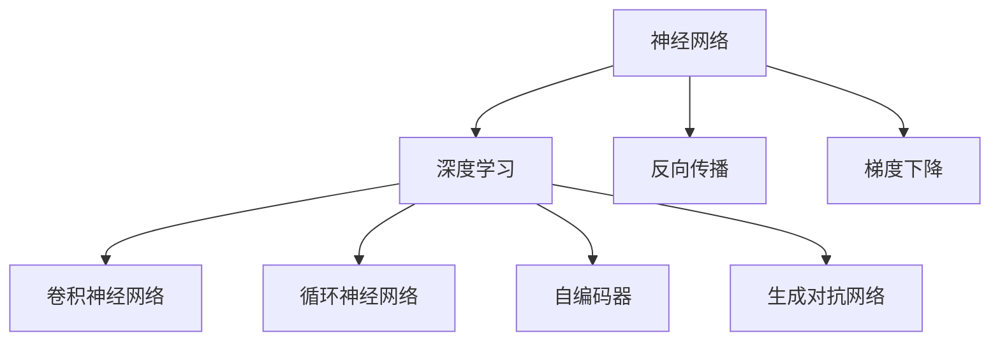

                 

# 神经网络：改变世界的技术

> 关键词：神经网络,深度学习,机器学习,人工智能,计算机视觉,自然语言处理,图像识别,语音识别,大数据,算法优化

## 1. 背景介绍

### 1.1 问题由来
人工智能(AI)技术的飞速发展，显著改变了人类社会的方方面面。其中，神经网络(Neural Network)和深度学习(Deep Learning)技术的突破，不仅推动了计算机视觉、自然语言处理、语音识别、自动驾驶等领域的革命，也为大数据分析、推荐系统、智能推荐等应用提供了强大的算法支撑。神经网络，作为当前AI领域最为关键的技术之一，正在重新定义机器学习和智能决策的边界。

### 1.2 问题核心关键点
神经网络的核心思想，是通过多层神经元建立输入到输出的映射关系，利用数据的分布特性进行特征学习，实现数据的自动分类、预测、识别等功能。其核心算法包括反向传播(Backpropagation)、梯度下降(Gradient Descent)等，通过不断调整神经元间的连接权重，使得网络能够逐步逼近理想的决策边界。

### 1.3 问题研究意义
神经网络技术的进步，对于推动AI领域的应用普及，提升数据处理的智能化水平，具有重要意义：

1. 提升数据处理能力。神经网络能够自动学习数据的复杂特征，显著提升了数据处理的精度和效率。
2. 拓展应用场景。从图像、语音、文本到自然语言处理、推荐系统等多个领域，神经网络为AI技术的落地应用提供了坚实的算法基础。
3. 驱动算法创新。神经网络的发展，带动了更多基于深度学习的算法创新，如卷积神经网络、循环神经网络等。
4. 促进跨学科融合。神经网络技术的普及，加速了AI与计算机视觉、自然语言处理、生物信息学等领域的深度融合。

## 2. 核心概念与联系

### 2.1 核心概念概述

为更好地理解神经网络的工作原理，本节将介绍几个密切相关的核心概念：

- 神经网络(Neural Network)：由输入层、隐藏层、输出层构成的多层神经元网络，通过反向传播算法进行权重更新，实现数据处理和预测任务。
- 深度学习(Deep Learning)：基于神经网络的机器学习范式，通过多层的非线性映射，学习数据的高维复杂特征。
- 反向传播(Backpropagation)：神经网络的核心算法，通过反向传播梯度，逐层更新神经元间的权重，最小化预测误差。
- 梯度下降(Gradient Descent)：一种优化算法，通过迭代调整模型参数，使得损失函数最小化。
- 卷积神经网络(Convolutional Neural Network, CNN)：针对图像处理任务，引入卷积操作和池化操作，实现平移不变性。
- 循环神经网络(Recurrent Neural Network, RNN)：针对序列数据处理任务，引入时间维度，实现动态时序建模。
- 自编码器(Autocoder)：一种无监督学习方法，通过学习数据的低维表示，实现数据压缩和降维。
- 生成对抗网络(Generative Adversarial Network, GAN)：通过两个神经网络的对抗训练，生成高质量的合成数据。

这些核心概念之间的逻辑关系可以通过以下Mermaid流程图来展示：



这个流程图展示了大语言模型的核心概念及其之间的关系：

1. 神经网络是深度学习的基础。
2. 深度学习通过多层神经网络实现复杂特征的自动学习。
3. 反向传播算法和梯度下降算法是深度学习的核心优化手段。
4. 卷积神经网络、循环神经网络等网络结构，适应不同数据类型。
5. 自编码器和生成对抗网络，则是无监督学习和生成学习的重要方法。

这些概念共同构成了深度学习的算法框架，使得神经网络技术能够广泛应用于各种复杂的数据处理和智能决策任务中。

## 3. 核心算法原理 & 具体操作步骤
### 3.1 算法原理概述

神经网络的原理，基于图灵奖获得者唐纳德·赫伯特·杜贝基(Donald Hebb)的赫伯特-西蒙学习法则(Hebb's Rule)，即“重复的刺激导致突触连接加强”。神经网络通过反向传播算法，调整网络中的连接权重，使网络的输出逐渐逼近真实标签。

神经网络的基本框架如图1所示，包括输入层、隐藏层和输出层。其中，输入层接收原始数据，输出层输出预测结果，隐藏层则通过非线性激活函数(如Sigmoid、ReLU等)，对数据进行特征提取和处理。反向传播算法通过反向传播梯度，逐层更新权重，使得损失函数最小化。


图1：神经网络结构图

### 3.2 算法步骤详解

神经网络的训练一般分为以下几个步骤：

**Step 1: 数据准备**
- 准备训练集和测试集，并将数据进行标准化或归一化处理。
- 划分数据集为训练集、验证集和测试集，一般训练集占70-80%，验证集和测试集各占10-20%。

**Step 2: 模型初始化**
- 初始化神经网络的权重和偏置。一般使用随机初始化方法，如Xavier初始化、He初始化等。

**Step 3: 前向传播**
- 将输入数据输入神经网络，逐层进行前向传播，得到网络的预测输出。

**Step 4: 计算损失函数**
- 将预测输出与真实标签进行对比，计算损失函数，如均方误差、交叉熵等。

**Step 5: 反向传播**
- 反向传播梯度，通过链式法则计算各层的梯度，并更新权重和偏置。

**Step 6: 优化**
- 使用梯度下降等优化算法，更新网络参数，使得损失函数最小化。

**Step 7: 模型评估**
- 在测试集上评估模型的性能，计算准确率、召回率、F1-score等指标，评估模型泛化能力。

### 3.3 算法优缺点

神经网络的优点包括：
1. 强非线性映射能力。通过多层非线性映射，能够学习复杂的数据特征，提升数据处理的精度。
2. 较好的泛化能力。利用反向传播算法和梯度下降算法，神经网络能够有效避免过拟合，提升模型的泛化能力。
3. 适应性强。神经网络能够适应多种数据类型，如图像、文本、语音等。

神经网络的缺点包括：
1. 训练时间较长。神经网络参数量较大，训练过程中需要较长的计算时间。
2. 可解释性不足。神经网络模型复杂，难以解释其内部工作机制和决策过程。
3. 计算资源需求高。训练神经网络需要高性能计算资源，如GPU、TPU等。
4. 过拟合风险高。神经网络参数较多，容易发生过拟合，需要引入正则化技术，如Dropout、L2正则等。

### 3.4 算法应用领域

神经网络技术已经被广泛应用于各个领域，包括：

- 计算机视觉：如图像分类、目标检测、人脸识别等任务。通过卷积神经网络(CNN)进行图像特征提取和分类。
- 自然语言处理：如机器翻译、文本分类、情感分析等任务。通过循环神经网络(RNN)、Transformer等模型进行文本处理。
- 语音识别：如语音转文本、语音情感识别等任务。通过卷积神经网络、长短时记忆网络(LSTM)等模型进行语音处理。
- 自动驾驶：如道路识别、路径规划、车辆控制等任务。通过卷积神经网络、深度强化学习等技术进行环境感知和决策。
- 推荐系统：如个性化推荐、广告推荐等任务。通过协同过滤、深度学习等技术进行用户行为分析和推荐。

## 4. 数学模型和公式 & 详细讲解  
### 4.1 数学模型构建

神经网络的数学模型可以表示为：

$$
y = \sigma(z)
$$

其中，$z$ 为输入数据的加权和，$\sigma$ 为激活函数。对于多层的神经网络，可表示为：

$$
z_1 = \sum_{i=1}^n w_{1i}x_i + b_1
$$

$$
y_1 = \sigma(z_1)
$$

$$
z_2 = \sum_{i=1}^n w_{2i}y_i + b_2
$$

$$
y_2 = \sigma(z_2)
$$

以此类推，直到输出层：

$$
y = \sum_{i=1}^n w_{mi}y_{i-1} + b_m
$$

其中，$w_{ij}$ 表示第 $i$ 层第 $j$ 个神经元与第 $i+1$ 层第 $j$ 个神经元之间的连接权重，$b_i$ 表示第 $i$ 层的偏置，$x_i$ 表示第 $i$ 层的输入，$y_i$ 表示第 $i$ 层的输出。

### 4.2 公式推导过程

以二分类任务为例，假设输入数据为 $x$，输出为 $y$，神经网络的结构如图2所示。


图2：神经网络结构图

神经网络的损失函数通常采用交叉熵损失函数，其定义为：

$$
L(y, \hat{y}) = -\frac{1}{N}\sum_{i=1}^N [y_i\log \hat{y}_i + (1-y_i)\log (1-\hat{y}_i)]
$$

其中，$y$ 为真实标签，$\hat{y}$ 为神经网络的预测输出。

神经网络的前向传播过程可表示为：

$$
z_1 = \sum_{i=1}^n w_{11}x_i + b_1
$$

$$
y_1 = \sigma(z_1)
$$

$$
z_2 = \sum_{i=1}^n w_{21}y_i + b_2
$$

$$
y_2 = \sigma(z_2)
$$

以此类推，直到输出层：

$$
z_m = \sum_{i=1}^n w_{m1}y_{i-1} + b_m
$$

$$
y = \sigma(z_m)
$$

其中，$z_i$ 表示第 $i$ 层的加权和，$y_i$ 表示第 $i$ 层的输出。

### 4.3 案例分析与讲解

以手写数字识别为例，图3展示了基于神经网络的MNIST数据集的手写数字识别任务。


图3：手写数字识别

假设神经网络的输入为 $x$，输出为 $y$，采用 sigmoid 激活函数，则神经网络的数学模型可表示为：

$$
z_1 = \sum_{i=1}^n w_{11}x_i + b_1
$$

$$
y_1 = \sigma(z_1)
$$

$$
z_2 = \sum_{i=1}^n w_{21}y_i + b_2
$$

$$
y_2 = \sigma(z_2)
$$

以此类推，直到输出层：

$$
z_m = \sum_{i=1}^n w_{m1}y_{i-1} + b_m
$$

$$
y = \sigma(z_m)
$$

其中，$w_{ij}$ 表示第 $i$ 层第 $j$ 个神经元与第 $i+1$ 层第 $j$ 个神经元之间的连接权重，$b_i$ 表示第 $i$ 层的偏置，$x_i$ 表示第 $i$ 层的输入，$y_i$ 表示第 $i$ 层的输出。

## 5. 项目实践：代码实例和详细解释说明
### 5.1 开发环境搭建

在进行神经网络项目实践前，我们需要准备好开发环境。以下是使用Python进行PyTorch开发的环境配置流程：

1. 安装Anaconda：从官网下载并安装Anaconda，用于创建独立的Python环境。

2. 创建并激活虚拟环境：
```bash
conda create -n pytorch-env python=3.8 
conda activate pytorch-env
```

3. 安装PyTorch：根据CUDA版本，从官网获取对应的安装命令。例如：
```bash
conda install pytorch torchvision torchaudio cudatoolkit=11.1 -c pytorch -c conda-forge
```

4. 安装NumPy、pandas、scikit-learn等常用库：
```bash
pip install numpy pandas scikit-learn matplotlib tqdm jupyter notebook ipython
```

5. 安装TensorFlow：安装TensorFlow，用于对比学习，建议使用GPU版本，以提高计算效率：
```bash
pip install tensorflow tensorflow-gpu
```

6. 安装TensorBoard：TensorFlow配套的可视化工具，可以实时监测模型训练状态，并提供丰富的图表呈现方式，是调试模型的得力助手。

```bash
pip install tensorboard
```

7. 安装PyTorch Lightning：用于快速构建和训练神经网络模型，简化代码开发。

```bash
pip install pytorch-lightning
```

完成上述步骤后，即可在`pytorch-env`环境中开始神经网络项目实践。

### 5.2 源代码详细实现

下面我们以手写数字识别任务为例，给出使用PyTorch进行神经网络训练的Python代码实现。

首先，导入必要的库和数据集：

```python
import torch
import torch.nn as nn
import torch.optim as optim
import torchvision
import torchvision.transforms as transforms
from torch.utils.data import DataLoader

# 加载MNIST数据集
transform = transforms.Compose([
    transforms.ToTensor(),
    transforms.Normalize((0.5,), (0.5,))
])

trainset = torchvision.datasets.MNIST(root='./data', train=True, download=True, transform=transform)
trainloader = DataLoader(trainset, batch_size=64, shuffle=True)

testset = torchvision.datasets.MNIST(root='./data', train=False, download=True, transform=transform)
testloader = DataLoader(testset, batch_size=64, shuffle=False)
```

然后，定义神经网络模型：

```python
# 定义神经网络模型
class Net(nn.Module):
    def __init__(self):
        super(Net, self).__init__()
        self.fc1 = nn.Linear(28 * 28, 128)
        self.fc2 = nn.Linear(128, 64)
        self.fc3 = nn.Linear(64, 10)

    def forward(self, x):
        x = x.view(-1, 28 * 28)
        x = torch.relu(self.fc1(x))
        x = torch.relu(self.fc2(x))
        x = self.fc3(x)
        return x

net = Net()
print(net)
```

接着，定义优化器和损失函数：

```python
# 定义优化器和损失函数
criterion = nn.CrossEntropyLoss()
optimizer = optim.Adam(net.parameters(), lr=0.001)
```

然后，进行神经网络的训练：

```python
# 神经网络训练
for epoch in range(10):  # 10轮训练
    running_loss = 0.0
    for i, data in enumerate(trainloader, 0):
        inputs, labels = data
        optimizer.zero_grad()
        outputs = net(inputs)
        loss = criterion(outputs, labels)
        loss.backward()
        optimizer.step()
        running_loss += loss.item()
        if i % 200 == 199:  # 每200步输出一次训练进度
            print('[%d, %5d] loss: %.3f' % (epoch + 1, i + 1, running_loss / 200))
            running_loss = 0.0

print('Finished Training')
```

最后，评估模型在测试集上的性能：

```python
# 神经网络评估
correct = 0
total = 0
with torch.no_grad():
    for data in testloader:
        images, labels = data
        outputs = net(images)
        _, predicted = torch.max(outputs.data, 1)
        total += labels.size(0)
        correct += (predicted == labels).sum().item()

print('Accuracy of the network on the 10000 test images: %d %%' % (
    100 * correct / total))
```

以上就是使用PyTorch进行手写数字识别任务神经网络训练的完整代码实现。可以看到，得益于PyTorch的强大封装和丰富功能，神经网络的开发变得十分便捷高效。

### 5.3 代码解读与分析

让我们再详细解读一下关键代码的实现细节：

**数据集加载函数**：
- 使用`torchvision`库加载MNIST数据集，并进行标准化处理。
- 定义了数据加载器，用于批处理数据，并设置随机化策略。

**神经网络模型定义**：
- 定义了三层全连接神经网络模型，包括输入层、隐藏层和输出层。
- 在每个隐藏层后使用ReLU激活函数，并在输出层使用softmax激活函数，用于多分类任务。
- 定义了网络的前向传播方法，将输入数据依次通过各层进行线性变换和激活操作。

**优化器和损失函数定义**：
- 定义了Adam优化器和交叉熵损失函数，用于训练和评估模型的性能。

**神经网络训练**：
- 使用`for`循环进行训练，每轮训练包含多个批次。
- 在每个批次上，前向传播计算损失函数，并反向传播更新网络参数。
- 打印每轮训练的损失值，用于监控训练进度。

**模型评估**：
- 使用测试集对训练好的模型进行评估，计算准确率和损失函数。
- 使用`torch.no_grad()`确保评估过程中不更新模型参数。

可以看到，PyTorch使得神经网络模型的开发和训练变得简洁高效。开发者可以更专注于模型的设计优化和实验验证，而不必过多关注底层实现细节。

## 6. 实际应用场景

### 6.1 智能推荐系统

基于神经网络的智能推荐系统，可以广泛应用于电商、社交媒体、新闻等平台。传统推荐系统往往只依赖用户的历史行为数据进行物品推荐，难以捕捉用户兴趣的多样性和动态性。而使用神经网络进行推荐，可以综合考虑用户行为和上下文信息，进行更精准、个性化的推荐。

在技术实现上，可以收集用户浏览、点击、评价等行为数据，并提取和用户交互的物品标题、描述、标签等文本内容。将文本内容作为模型输入，用户的行为数据作为监督信号，在此基础上训练神经网络模型。模型能够从文本内容中提取用户兴趣，并结合行为数据进行推荐。对于新的物品，可以将其标题和描述输入模型，得到推荐的相似物品列表。

### 6.2 图像处理和识别

神经网络在图像处理和识别任务上具有很强的应用潜力。传统的图像处理算法往往依赖于手工设计的特征，难以处理复杂场景和噪声数据。而神经网络可以自动学习图像特征，提升图像识别的精度和鲁棒性。

在技术实现上，可以采用卷积神经网络(CNN)进行图像特征提取和分类。CNN通过卷积操作和池化操作，提取图像的局部特征和全局特征，并通过多层非线性映射，学习图像的复杂特征。经过充分的训练，CNN能够对各种复杂的图像进行精确分类和识别。

### 6.3 自然语言处理

神经网络在自然语言处理(NLP)任务上也有着广泛的应用。传统的NLP算法往往依赖于手工设计的规则和模板，难以处理长文本和复杂语义。而神经网络可以自动学习语言的上下文关系和语义信息，提升NLP任务的性能。

在技术实现上，可以采用循环神经网络(RNN)或Transformer等模型进行NLP任务的处理。RNN通过时间维度上的序列建模，能够处理动态变化的语言信息，适用于语音识别、机器翻译等任务。Transformer通过自注意力机制，能够并行处理长文本信息，适用于文本分类、情感分析、问答系统等任务。

### 6.4 未来应用展望

随着神经网络技术的不断发展，其在各个领域的应用前景将更加广阔。未来，神经网络将继续在以下方向取得突破：

1. 深度强化学习：结合强化学习算法，训练神经网络进行自动决策，应用于自动驾驶、游戏AI等领域。
2. 跨领域迁移学习：将神经网络应用于多个领域的数据处理和任务识别，实现跨领域迁移学习，提升模型的泛化能力。
3. 多模态学习：结合视觉、听觉、文本等多模态数据，进行跨模态特征学习，提升模型的多模态感知能力。
4. 联邦学习：在分布式环境下，通过联邦学习算法，训练神经网络模型，应用于数据隐私保护和联邦数据聚合。
5. 知识增强学习：结合知识图谱和规则库，引导神经网络进行知识推理和决策，提升模型的知识表示能力。

这些方向的发展，将进一步推动神经网络技术的成熟和应用落地，为各行各业带来新的变革和机遇。

## 7. 工具和资源推荐
### 7.1 学习资源推荐

为了帮助开发者系统掌握神经网络技术的理论基础和实践技巧，这里推荐一些优质的学习资源：

1. 《深度学习》书籍：Ian Goodfellow、Yoshua Bengio和Aaron Courville合著的经典教材，系统介绍了深度学习的理论基础和算法框架。

2. 《动手学深度学习》课程：由李沐等专家录制的深度学习入门课程，提供视频教程和实践代码，适合初学者快速上手。

3. 《PyTorch官方文档》：PyTorch官方提供的文档，详细介绍了PyTorch的使用方法和应用场景，是进行神经网络开发的重要参考。

4. 《TensorFlow官方文档》：TensorFlow官方提供的文档，详细介绍了TensorFlow的使用方法和应用场景，是进行神经网络开发的重要参考。

5. 《Kaggle竞赛平台》：Kaggle提供了丰富的神经网络竞赛项目，可以参与实际项目，积累经验。

通过对这些资源的学习实践，相信你一定能够快速掌握神经网络技术的精髓，并用于解决实际的NLP问题。

### 7.2 开发工具推荐

高效的开发离不开优秀的工具支持。以下是几款用于神经网络微调开发的常用工具：

1. PyTorch：基于Python的开源深度学习框架，灵活动态的计算图，适合快速迭代研究。大部分神经网络模型都有PyTorch版本的实现。

2. TensorFlow：由Google主导开发的开源深度学习框架，生产部署方便，适合大规模工程应用。同样有丰富的神经网络模型资源。

3. TensorFlow Lite：TensorFlow的移动端优化版本，可以在移动设备上高效运行，支持多种硬件加速。

4. ONNX：开源的神经网络交换标准，可以方便地在不同的深度学习框架之间进行模型转换。

5. JAX：Google开源的高性能深度学习框架，支持自动微分、分布式训练等高级功能，适合高性能科研应用。

合理利用这些工具，可以显著提升神经网络模型的开发效率，加快创新迭代的步伐。

### 7.3 相关论文推荐

神经网络技术的快速发展，得益于学界和产业界的不断创新和实践。以下是几篇奠基性的相关论文，推荐阅读：

1. 《神经网络与深度学习》：Yann LeCun等专家合著的经典教材，系统介绍了神经网络和深度学习的理论基础和应用场景。

2. 《ImageNet Large Scale Visual Recognition Challenge》：Alex Krizhevsky等专家提出的图像分类任务，推动了深度学习在计算机视觉领域的突破。

3. 《Attention Is All You Need》：谷歌提出Transformer模型，实现了自注意力机制，推动了NLP领域的预训练大模型发展。

4. 《BERT: Pre-training of Deep Bidirectional Transformers for Language Understanding》：谷歌提出BERT模型，通过预训练和微调，实现了NLP任务的跨领域迁移学习能力。

5. 《Deep Residual Learning for Image Recognition》：Kaiming He等专家提出的残差网络模型，实现了深度神经网络的训练和优化。

6. 《Towards AI-Complete Question Answering via Textual Entailment》：Google提出用文本蕴含关系进行问答推理的方法，推动了问答系统的自然语言理解能力。

这些论文代表了大语言模型微调技术的发展脉络。通过学习这些前沿成果，可以帮助研究者把握学科前进方向，激发更多的创新灵感。

## 8. 总结：未来发展趋势与挑战

### 8.1 总结

本文对神经网络技术的原理和实践进行了全面系统的介绍。首先阐述了神经网络的核心思想和算法框架，明确了其在深度学习、计算机视觉、自然语言处理等领域的广泛应用。其次，从原理到实践，详细讲解了神经网络的数学模型和计算过程，给出了神经网络模型训练的完整代码实例。同时，本文还广泛探讨了神经网络技术在各个领域的应用场景，展示了其强大的应用潜力。

通过本文的系统梳理，可以看到，神经网络技术正在成为人工智能领域的重要基础，推动了计算机视觉、自然语言处理、智能推荐等应用的深入发展。神经网络技术的进步，为AI技术落地应用提供了强大的算法支撑，将在未来的智能社会中扮演越来越重要的角色。

### 8.2 未来发展趋势

展望未来，神经网络技术的发展将呈现以下几个趋势：

1. 神经网络模型的规模将持续增大。随着算力成本的下降和数据规模的扩张，神经网络模型的参数量还将进一步增大，增强模型的表达能力和泛化能力。

2. 神经网络的应用场景将更加多样化。随着神经网络技术的进步，将有更多领域能够受益于神经网络，如医疗、金融、城市管理等。

3. 神经网络的训练和推理将更加高效。随着硬件设备的进步和优化算法的不断改进，神经网络的训练和推理速度将进一步提升，降低资源消耗。

4. 神经网络的迁移学习和跨领域学习能力将得到提升。未来的神经网络模型将能够更好地进行跨领域迁移学习，提升模型的泛化能力。

5. 神经网络的可解释性和可控性将得到加强。未来的神经网络模型将更加注重模型的可解释性和可控性，确保模型的决策过程透明、可信。

6. 神经网络的伦理和安全将受到更多关注。随着神经网络技术的普及，如何保护数据隐私、避免算法偏见，将是重要的研究方向。

### 8.3 面临的挑战

尽管神经网络技术已经取得了显著进展，但在向更广泛的应用场景推广过程中，仍面临以下挑战：

1. 计算资源的需求高。神经网络模型的参数量较大，训练和推理需要高性能计算资源，如GPU、TPU等。如何降低资源消耗，优化模型结构，是未来重要的研究方向。

2. 模型的过拟合风险高。神经网络模型的参数较多，容易发生过拟合。如何引入正则化技术，提高模型的泛化能力，仍是重要的研究方向。

3. 模型的可解释性不足。神经网络模型的复杂性高，难以解释其内部工作机制和决策过程。如何提高模型的可解释性，增强模型的透明性和可信度，将是重要的研究方向。

4. 数据隐私和安全问题。神经网络模型往往需要大量的标注数据进行训练，如何保护数据隐私，防止模型泄露敏感信息，将是重要的研究方向。

5. 模型的伦理和法律问题。神经网络模型可能会学习到有偏见、有害的信息，如何避免模型输出有害内容，确保模型的伦理合规，将是重要的研究方向。

### 8.4 研究展望

面对神经网络技术所面临的挑战，未来的研究需要在以下几个方向寻求新的突破：

1. 探索更高效的神经网络结构。未来的神经网络模型将更加注重模型结构的优化，降低参数量，提升模型的效率和泛化能力。

2. 引入更多先验知识。将符号化的先验知识，如知识图谱、逻辑规则等，与神经网络模型进行融合，增强模型的知识表示能力。

3. 结合因果分析和博弈论工具。将因果分析方法引入神经网络模型，识别出模型决策的关键特征，增强输出解释的因果性和逻辑性。借助博弈论工具刻画人机交互过程，主动探索并规避模型的脆弱点，提高系统稳定性。

4. 纳入伦理道德约束。在模型训练目标中引入伦理导向的评估指标，过滤和惩罚有偏见、有害的输出倾向。加强人工干预和审核，建立模型行为的监管机制，确保输出符合人类价值观和伦理道德。

这些研究方向的发展，将引领神经网络技术迈向更高的台阶，为构建安全、可靠、可解释、可控的智能系统铺平道路。面向未来，神经网络技术还需要与其他人工智能技术进行更深入的融合，如知识表示、因果推理、强化学习等，多路径协同发力，共同推动智能系统的进步。只有勇于创新、敢于突破，才能不断拓展神经网络的边界，让智能技术更好地造福人类社会。

## 9. 附录：常见问题与解答

**Q1：神经网络在图像处理和识别任务上有什么优势？**

A: 神经网络在图像处理和识别任务上的优势主要体现在以下几个方面：

1. 自动特征提取：神经网络通过卷积和池化操作，自动学习图像的特征，减少了手工设计特征的工作量。
2. 鲁棒性强：神经网络能够处理复杂的图像，如光照变化、遮挡等情况，具有较强的鲁棒性。
3. 精度高：神经网络通过多层非线性映射，能够学习复杂的图像特征，提升图像识别的精度。
4. 可解释性好：神经网络的特征提取过程可视性好，便于理解和解释。

**Q2：神经网络模型的训练和推理需要高性能计算资源，如何降低资源消耗？**

A: 神经网络模型的训练和推理确实需要高性能计算资源，如GPU、TPU等。为了降低资源消耗，可以采取以下措施：

1. 模型压缩：采用模型剪枝、量化、稀疏化等技术，减小模型规模，降低计算资源消耗。
2. 分布式训练：使用多机多核进行分布式训练，提升训练效率。
3. 硬件优化：使用专门的硬件设备，如FPGA、ASIC等，加速模型计算。
4. 优化算法：采用优化算法，如AdamW、LAMB等，提升训练速度。
5. 模型融合：将多个模型进行融合，减小单个模型的参数规模。

**Q3：神经网络模型的可解释性不足，如何提高模型的可解释性？**

A: 神经网络模型的可解释性不足是一个重要的研究方向。以下是一些提高模型可解释性的方法：

1. 特征可视化：通过可视化工具，展示模型在特定输入下的特征响应，便于理解模型的决策过程。
2. 注意力机制：引入注意力机制，展示模型在预测过程中的重要特征，便于理解模型对输入数据的关注点。
3. 模型蒸馏：通过蒸馏技术，将复杂模型转化为可解释性高的模型，如决策树、线性回归等。
4. 知识图谱：结合知识图谱，增强模型的知识表示能力，提高模型的可解释性。

**Q4：如何应对神经网络模型的过拟合问题？**

A: 神经网络模型的过拟合问题可以通过以下方法应对：

1. 正则化：使用L1、L2正则、Dropout等方法，限制模型的复杂度，防止过拟合。
2. 数据增强：通过数据增强技术，扩充训练集，增加数据的多样性，提高模型的泛化能力。
3. 早停法：在验证集上监测模型性能，当性能不再提升时，停止训练，防止过拟合。
4. 模型裁剪：通过剪枝、量化等方法，减小模型的参数规模，防止过拟合。
5. 交叉验证：使用交叉验证方法，评估模型的泛化能力，防止过拟合。

**Q5：如何构建神经网络模型？**

A: 构建神经网络模型的基本步骤如下：

1. 准备数据集：收集并处理训练数据，将其划分为训练集、验证集和测试集。
2. 定义模型结构：根据任务需求，设计神经网络的结构，包括输入层、隐藏层和输出层。
3. 定义损失函数：根据任务类型，选择合适的损失函数，如均方误差、交叉熵等。
4. 定义优化器：选择合适的优化器，如Adam、SGD等，并设置学习率、批大小等参数。
5. 训练模型：使用训练集进行模型训练，每轮训练包含多个批次，反向传播更新模型参数。
6. 评估模型：在测试集上评估模型的性能，计算准确率、召回率等指标，确保模型泛化能力强。

以上是构建神经网络模型的基本步骤，通过不断迭代和优化，可以得到高性能的神经网络模型。

---

作者：禅与计算机程序设计艺术 / Zen and the Art of Computer Programming

