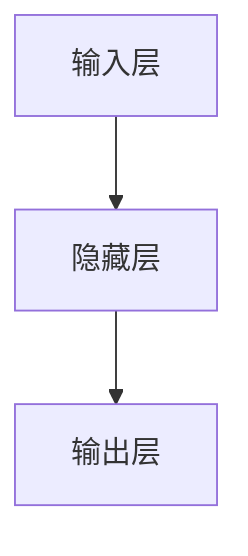

                 

## 1. 背景介绍

### 1.1 问题由来
在人工智能(AI)的发展历程中，神经网络（Neural Networks）无疑是一个标志性的里程碑。自上世纪80年代开始，神经网络技术逐步从实验室走向实际应用，并且在众多领域中展现出了强大的潜力和惊人的成果。无论是自然语言处理（NLP）、计算机视觉（CV），还是自动驾驶（AD）、机器人控制（Robotics），神经网络无处不在。它不仅推动了人工智能的边界，还深刻影响了各行各业的生产力和效率。

### 1.2 问题核心关键点
神经网络之所以如此神奇，离不开其背后复杂而精妙的理论框架。核心点包括：

- **前馈神经网络（Feedforward Neural Network, FNN）**：一种单向流动的神经网络，即信息只能向前传递，不能反向传播，形成分层结构。
- **反向传播算法（Backpropagation）**：利用链式法则，通过计算误差对网络参数进行更新，训练模型使其输出更加逼近真实值。
- **卷积神经网络（Convolutional Neural Network, CNN）**：主要应用于图像处理和视觉识别，通过卷积层提取特征，再通过全连接层分类。
- **循环神经网络（Recurrent Neural Network, RNN）**：通过循环层保持序列信息，应用于自然语言处理和语音识别等序列任务。
- **长短时记忆网络（Long Short-Term Memory, LSTM）**：一种特殊的RNN结构，可以更好地处理长时间序列的输入。
- **深度神经网络（Deep Neural Network, DNN）**：由多个隐藏层组成的神经网络，能够解决复杂的非线性问题。

这些关键点构成神经网络的基础理论框架，并不断推动其在深度学习领域的应用和发展。

### 1.3 问题研究意义
神经网络技术的重要性不容小觑，它不仅驱动了人工智能的发展，也正在改变世界。

- **科技创新**：神经网络作为一种计算模型，极大地推动了科技的边界。深度学习、强化学习、生成对抗网络等技术层出不穷。
- **产业应用**：在医疗、金融、零售、制造等行业，神经网络的应用已经从理论走向实践，成为推动行业发展的关键动力。
- **社会影响**：无人驾驶、智能客服、语音助手等技术的出现，正在改变人类的日常生活和工作方式。
- **教育发展**：神经网络研究引领了新一轮的AI教育热潮，教育机构和社会各界都在积极培养具有深度学习背景的人才。

神经网络的研究与应用，为人工智能时代的到来铺平了道路。面对未来，神经网络将如何进一步发展，如何更好地融入人类社会，将是研究者们面临的重要课题。

## 2. 核心概念与联系

### 2.1 核心概念概述
神经网络是一个复杂的计算模型，由多个节点（节点称为神经元）组成的网络。每个神经元通过输入和输出之间的权重来计算和传递信息。网络结构通常包括输入层、隐藏层和输出层。

### 2.2 核心概念原理和架构的 Mermaid 流程图



### 2.3 核心概念原理与架构的 Mermaid 流程图细节
- **输入层**：接收原始数据，将数据转换为适合神经网络处理的格式。
- **隐藏层**：进行特征提取和信息处理，决定网络的复杂性和表达能力。
- **输出层**：输出模型预测结果，通过输出层激活函数进行归一化。

## 3. 核心算法原理 & 具体操作步骤

### 3.1 算法原理概述

神经网络的工作原理可以概括为两个核心过程：前向传播（Forward Propagation）和反向传播（Backpropagation）。

前向传播是神经网络的基本计算过程，即输入数据通过网络各层处理，最终得到输出结果。反向传播则是根据输出误差，通过链式法则计算并更新网络权重，从而优化模型。

### 3.2 算法步骤详解

#### 3.2.1 前向传播

1. **输入数据**：将原始数据输入到神经网络。
2. **计算隐藏层**：将输入数据传递给第一个隐藏层，计算每个神经元的输出值。
3. **计算输出层**：将隐藏层的输出传递给输出层，计算最终的预测结果。
4. **激活函数**：对输出层结果进行非线性变换，生成最终的预测值。

#### 3.2.2 反向传播

1. **计算误差**：根据真实标签和模型预测结果，计算误差。
2. **梯度下降**：利用误差计算各层梯度，并使用梯度下降算法更新网络权重。
3. **权重更新**：根据梯度更新规则，调整网络权重，使其最小化误差。
4. **循环迭代**：重复上述过程，直至误差收敛或达到预设轮数。

### 3.3 算法优缺点

#### 3.3.1 优点

- **强大的表达能力**：神经网络可以通过隐藏层提取复杂的特征，解决非线性问题。
- **高效的多任务处理**：神经网络可以同时处理多个任务，提高计算效率。
- **广泛的应用领域**：适用于图像识别、语音处理、自然语言处理等众多领域。

#### 3.3.2 缺点

- **计算资源需求高**：神经网络需要大量的计算资源，如GPU、TPU等高性能设备。
- **难以解释**：深度神经网络作为"黑盒"模型，难以解释其内部工作机制和决策过程。
- **过拟合风险**：当训练数据不足时，神经网络容易过拟合，导致泛化能力差。

### 3.4 算法应用领域

神经网络技术在诸多领域中均有广泛应用：

- **计算机视觉**：图像分类、物体检测、人脸识别等。
- **自然语言处理**：文本分类、情感分析、机器翻译等。
- **语音识别**：语音识别、语音合成等。
- **自动驾驶**：视觉识别、环境感知、路径规划等。
- **金融领域**：风险评估、信用评分、市场预测等。
- **医疗领域**：医学影像分析、疾病诊断、个性化医疗等。

## 4. 数学模型和公式 & 详细讲解

### 4.1 数学模型构建

神经网络模型可以表示为：

$$
f(x;w)=g(\sum_{i=1}^{n}w_ix_i+b)
$$

其中，$x$为输入数据，$w$为网络权重，$b$为偏置项，$g$为激活函数。

### 4.2 公式推导过程

以最简单的全连接神经网络为例，进行推导。

- **前向传播**：输入数据$x$通过权重矩阵$W$和偏置向量$b$，计算输出$h=wx+b$，再经过激活函数$g$得到最终结果。
- **反向传播**：根据误差$\epsilon$，计算损失函数$J$，利用链式法则计算各层梯度，更新权重$w$和偏置$b$。

### 4.3 案例分析与讲解

以手写数字识别为例，分析神经网络的工作原理：

1. **数据准备**：收集MNIST数据集，将手写数字图像转换为数字矩阵。
2. **模型设计**：设计一个包含3层隐藏层的全连接神经网络，激活函数使用ReLU。
3. **训练模型**：使用反向传播算法，将样本数据输入网络，通过梯度下降更新网络参数，训练模型。
4. **测试模型**：使用测试集评估模型性能，计算准确率。

## 5. 项目实践：代码实例和详细解释说明

### 5.1 开发环境搭建

要搭建一个神经网络模型，需要以下环境：

1. Python：安装最新版本的Python。
2. TensorFlow：安装TensorFlow库。
3. Jupyter Notebook：安装Jupyter Notebook，便于可视化结果。

### 5.2 源代码详细实现

以下是一个简单的手写数字识别模型的实现代码：

```python
import tensorflow as tf
from tensorflow.keras.datasets import mnist
from tensorflow.keras.models import Sequential
from tensorflow.keras.layers import Dense, Flatten, Conv2D, MaxPooling2D

# 加载数据
(x_train, y_train), (x_test, y_test) = mnist.load_data()

# 数据预处理
x_train = x_train.reshape(-1, 28, 28, 1).astype('float32') / 255.0
x_test = x_test.reshape(-1, 28, 28, 1).astype('float32') / 255.0

# 定义模型
model = Sequential([
    Conv2D(32, (3, 3), activation='relu', input_shape=(28, 28, 1)),
    MaxPooling2D((2, 2)),
    Flatten(),
    Dense(10, activation='softmax')
])

# 编译模型
model.compile(optimizer='adam', loss='sparse_categorical_crossentropy', metrics=['accuracy'])

# 训练模型
model.fit(x_train, y_train, epochs=5, validation_data=(x_test, y_test))

# 评估模型
model.evaluate(x_test, y_test)
```

### 5.3 代码解读与分析

代码中，首先加载了MNIST数据集，并对数据进行了预处理，包括将数据转换为适合神经网络处理的格式，并进行归一化。

然后，定义了一个简单的神经网络模型，包含一个卷积层、一个池化层和一个全连接层。卷积层和池化层用于提取图像特征，全连接层用于分类。

最后，编译模型，设置优化器、损失函数和评估指标，并开始训练模型，计算模型在测试集上的性能。

## 6. 实际应用场景

### 6.1 智能医疗

神经网络在医疗领域有着广泛的应用，如医学影像分析、疾病诊断、个性化医疗等。通过训练神经网络，可以自动分析医学影像，辅助医生诊断疾病，并提供个性化治疗方案。

### 6.2 自动驾驶

神经网络在自动驾驶中发挥着关键作用。通过视觉、雷达等传感器获取环境数据，神经网络可以实时分析道路情况，预测车辆行为，辅助自动驾驶系统做出决策。

### 6.3 自然语言处理

神经网络在自然语言处理中有着广泛的应用，如文本分类、情感分析、机器翻译等。通过训练神经网络，可以自动分析文本情感，实现人机交互，提升用户体验。

### 6.4 未来应用展望

随着神经网络技术的不断进步，未来将在更多领域中发挥重要作用。

- **医疗诊断**：神经网络将广泛应用于医学影像分析、疾病诊断、个性化医疗等领域，提升医疗服务的智能化水平。
- **自动驾驶**：神经网络将辅助自动驾驶系统实现高精度地图生成、实时环境感知和智能决策等功能，推动自动驾驶技术的普及。
- **智能客服**：神经网络将应用于智能客服系统，提升客户服务质量，降低运营成本。
- **金融分析**：神经网络将用于金融市场预测、风险评估、信用评分等，提升金融行业的智能化水平。

## 7. 工具和资源推荐

### 7.1 学习资源推荐

1. **《深度学习》书籍**：Ian Goodfellow等著，深度学习领域的经典教材。
2. **Coursera深度学习课程**：由Andrew Ng教授主讲，涵盖了深度学习的基本概念和应用。
3. **Udacity深度学习纳米学位**：涵盖深度学习的理论和实践，包括神经网络、卷积神经网络、循环神经网络等内容。
4. **Kaggle竞赛平台**：参与各种深度学习竞赛，实践并提升技能。
5. **arXiv预印本库**：最新深度学习论文的发布平台，保持最新科研动态。

### 7.2 开发工具推荐

1. TensorFlow：由Google开发的深度学习框架，支持多种硬件平台。
2. PyTorch：由Facebook开发的深度学习框架，灵活易用。
3. Keras：高层次神经网络库，简单易用。
4. Jupyter Notebook：交互式编程环境，便于实验和分享。
5. Visual Studio Code：强大的编程工具，支持多种语言和库。

### 7.3 相关论文推荐

1. **《深度学习》论文**：Ian Goodfellow等著，深度学习领域的奠基性论文。
2. **《ImageNet Classification with Deep Convolutional Neural Networks》**：Alex Krizhevsky等著，提出卷积神经网络，推动计算机视觉的发展。
3. **《A Theory of Neural Computation》**：Ronald J. Williams著，深度学习领域的理论基础。
4. **《Learning Phrases, Words, and Sentences from Pixels》**：Yann LeCun等著，提出卷积神经网络在图像处理中的应用。
5. **《Long Short-Term Memory》**：Sepp Hochreiter等著，提出LSTM，推动序列数据处理。

## 8. 总结：未来发展趋势与挑战

### 8.1 研究成果总结

神经网络技术在过去几十年中取得了显著进展，推动了人工智能的发展，并在诸多领域中展现出了巨大的潜力。未来，随着计算资源、算法创新和数据规模的不断提升，神经网络将进一步拓展其应用范围，解决更复杂的实际问题。

### 8.2 未来发展趋势

1. **更大规模的神经网络**：随着计算资源和算法进步，未来神经网络将包含更多层和更多参数，解决更复杂的非线性问题。
2. **更加智能的算法**：未来算法将更加智能，能够自动优化模型结构，提升训练效率。
3. **更广泛的应用领域**：神经网络将应用于更多领域，如智能医疗、智能制造、智能城市等。
4. **更高的安全性**：未来神经网络将具备更高的安全性，避免恶意攻击和数据泄露。
5. **更好的可解释性**：未来神经网络将具备更好的可解释性，便于用户理解和调试。

### 8.3 面临的挑战

1. **计算资源瓶颈**：神经网络需要大量的计算资源，未来如何在更小的计算资源下训练更大规模的神经网络，是重要挑战。
2. **模型复杂性**：未来神经网络的模型更加复杂，如何设计更加高效、简洁的模型，避免过拟合，需要更多研究。
3. **数据隐私保护**：神经网络需要大量的数据进行训练，如何在数据隐私保护的前提下，获取高质量的数据，是重要挑战。
4. **模型鲁棒性**：未来神经网络需要具备更强的鲁棒性，避免在输入噪声、对抗样本等情况下出现误判。
5. **可解释性问题**：未来神经网络需要具备更好的可解释性，便于用户理解和调试，避免出现"黑盒"问题。

### 8.4 研究展望

未来神经网络的研究方向包括：

1. **参数高效的神经网络**：通过降低计算复杂度，减少资源消耗，同时保持模型性能。
2. **自监督学习**：利用无标签数据进行训练，提升模型的泛化能力。
3. **对抗学习**：通过对抗样本训练，提升模型的鲁棒性和安全性。
4. **分布式训练**：利用分布式计算，加速神经网络的训练过程。
5. **元学习**：通过学习如何学习，提升神经网络的适应性和灵活性。

## 9. 附录：常见问题与解答

### Q1：神经网络的基本结构是什么？

A：神经网络由输入层、隐藏层和输出层组成。输入层接收原始数据，隐藏层进行特征提取和信息处理，输出层输出最终的预测结果。

### Q2：神经网络的主要算法是什么？

A：神经网络的主要算法包括前向传播和反向传播。前向传播计算网络输出，反向传播根据误差计算梯度，并更新网络权重。

### Q3：神经网络的应用领域有哪些？

A：神经网络广泛应用于计算机视觉、自然语言处理、语音识别、自动驾驶、医疗诊断等领域。

### Q4：如何提高神经网络的性能？

A：可以通过增加网络层数、增加网络参数、优化激活函数、引入正则化等方法提高神经网络的性能。

### Q5：神经网络的主要优势是什么？

A：神经网络的主要优势包括强大的表达能力、高效的多任务处理、广泛的应用领域等。

---

作者：禅与计算机程序设计艺术 / Zen and the Art of Computer Programming

