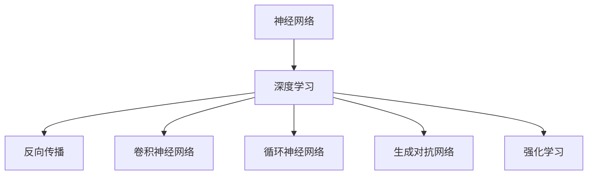

                 

# 神经网络：机器学习的新范式

> 关键词：神经网络,深度学习,机器学习,人工智能,深度学习框架

## 1. 背景介绍

### 1.1 问题由来

机器学习（Machine Learning, ML）自上世纪60年代兴起以来，经过几十年的发展，已经成为人工智能（AI）领域的重要支柱。传统机器学习主要依赖于手工设计的特征提取器和统计模型，但随着数据量的激增和计算能力的提升，这种依赖手工特征的模式变得不再适用。

深度学习（Deep Learning, DL）的诞生标志着机器学习的一次重大飞跃。以神经网络为核心的深度学习模型，能够自动从数据中提取高层次特征，并且具有较强的泛化能力，逐步成为当今人工智能的主流范式。

神经网络通过模拟人脑的神经元连接方式，构建了多层非线性映射，使得模型能够处理复杂的非线性关系。同时，深度学习模型通过数据驱动的方式，使得训练过程能够自适应地优化模型参数，提升了模型的性能和应用范围。

### 1.2 问题核心关键点

神经网络作为深度学习的核心，其核心思想是通过多层神经元的非线性组合，构建复杂的特征表示，从而实现对数据的高效建模和推理。在实际应用中，神经网络已经在图像识别、自然语言处理、语音识别、推荐系统等多个领域取得了显著的效果。

神经网络的核心组件包括输入层、隐藏层和输出层，其中隐藏层是神经网络的核心，它通过非线性激活函数（如Sigmoid、ReLU等）对输入进行变换，逐步提取高层次特征。隐藏层数和每层神经元个数是神经网络设计的重要超参数，需要通过实验调整来获得最佳性能。

神经网络的训练过程主要通过反向传播算法（Backpropagation）实现，该算法通过梯度下降等优化算法更新模型参数，使得损失函数最小化。常见的优化算法包括SGD、Adam、RMSprop等。

尽管神经网络具有诸多优势，但也面临一些挑战，如模型训练时间较长、参数较多、过拟合风险高、缺乏可解释性等。这些问题推动了神经网络及相关算法的研究发展，出现了参数高效神经网络、生成对抗网络（GANs）、强化学习（Reinforcement Learning, RL）等新型算法和框架，进一步拓展了深度学习的应用场景和性能。

## 2. 核心概念与联系

### 2.1 核心概念概述

为更好地理解神经网络及其相关算法，本节将介绍几个关键概念：

- **神经网络**：由多层神经元构成的网络结构，用于表示数据的复杂非线性关系。
- **深度学习**：基于神经网络模型的机器学习范式，通过多层次的特征提取和抽象，实现对数据的复杂建模。
- **反向传播**：用于神经网络训练的算法，通过梯度下降等优化算法更新模型参数，使得损失函数最小化。
- **卷积神经网络**：一种特殊结构的神经网络，用于图像识别、计算机视觉等任务的建模。
- **循环神经网络**：用于处理序列数据的神经网络结构，如自然语言处理中的文本建模。
- **生成对抗网络**：一种无监督学习的神经网络模型，由生成器和判别器两个子网络构成，用于生成新的数据样本。
- **强化学习**：一种基于奖励信号的学习范式，用于智能体（如机器人、游戏AI）的策略优化和决策学习。

这些核心概念之间的逻辑关系可以通过以下Mermaid流程图来展示：



这个流程图展示了大语言模型的核心概念及其之间的关系：

1. 神经网络通过多层非线性变换，构建复杂的特征表示。
2. 深度学习将神经网络应用于各种任务，提升模型的性能和泛化能力。
3. 反向传播是神经网络训练的核心算法，用于优化模型参数。
4. 卷积神经网络、循环神经网络、生成对抗网络和强化学习等特殊结构，拓展了深度学习的应用场景和性能。

这些概念共同构成了深度学习的基本框架，使其能够在各种任务中发挥强大的建模和推理能力。通过理解这些核心概念，我们可以更好地把握深度学习的学习原理和优化方向。

## 3. 核心算法原理 & 具体操作步骤
### 3.1 算法原理概述

深度学习模型通过多层神经元的组合，构建复杂非线性映射，从而实现对数据的高度抽象和建模。其中，神经网络是深度学习模型的核心组件，其训练过程主要通过反向传播算法实现。

以卷积神经网络（Convolutional Neural Network, CNN）为例，CNN通过卷积操作提取图像的局部特征，并通过池化操作降低特征维度，最终经过全连接层实现分类或回归等任务。其核心算法原理如下：

1. **前向传播**：将输入数据通过多层卷积、池化和全连接层进行变换，得到最终的输出结果。
2. **损失函数**：定义输出结果与真实标签之间的差距，如均方误差、交叉熵等。
3. **反向传播**：通过链式法则计算损失函数对每个参数的梯度，使用优化算法（如SGD、Adam等）更新模型参数。

### 3.2 算法步骤详解

深度学习模型的训练过程主要包括以下几个关键步骤：

**Step 1: 准备数据集和模型**

- 收集训练数据集 $D=\{(x_i,y_i)\}_{i=1}^N$，其中 $x_i$ 为输入数据，$y_i$ 为标签。
- 选择合适的深度学习框架（如TensorFlow、PyTorch等）和神经网络结构。

**Step 2: 定义模型结构**

- 设计神经网络的结构，包括输入层、隐藏层和输出层。
- 定义每层神经元个数、激活函数等超参数。

**Step 3: 选择优化器和损失函数**

- 选择合适的优化算法（如SGD、Adam等）和损失函数（如均方误差、交叉熵等）。
- 设置学习率、批大小等超参数。

**Step 4: 执行梯度下降**

- 将训练集数据分批次输入模型，前向传播计算损失函数。
- 反向传播计算参数梯度，根据设定的优化算法和学习率更新模型参数。
- 周期性在验证集上评估模型性能，根据性能指标决定是否触发Early Stopping。
- 重复上述步骤直到满足预设的迭代轮数或Early Stopping条件。

**Step 5: 测试和部署**

- 在测试集上评估训练后的模型性能，对比训练前后的精度提升。
- 使用训练好的模型对新样本进行推理预测，集成到实际的应用系统中。
- 持续收集新的数据，定期重新训练模型，以适应数据分布的变化。

以上是深度学习模型训练的一般流程。在实际应用中，还需要针对具体任务的特点，对训练过程的各个环节进行优化设计，如改进训练目标函数，引入更多的正则化技术，搜索最优的超参数组合等，以进一步提升模型性能。

### 3.3 算法优缺点

深度学习模型具有以下优点：

- **强大的表达能力**：通过多层非线性变换，深度学习模型能够对复杂数据进行高效建模。
- **自动特征提取**：通过训练过程自动提取数据中的高层次特征，无需手工设计特征。
- **泛化能力强**：通过大量数据训练，深度学习模型具有较好的泛化能力，能够适应新数据。
- **多样化的应用场景**：深度学习模型已经成功应用于计算机视觉、自然语言处理、语音识别、推荐系统等多个领域。

同时，深度学习模型也存在一些局限性：

- **资源消耗大**：大规模神经网络需要大量的计算资源和存储空间，训练和推理效率较低。
- **易过拟合**：深层神经网络容易过拟合训练数据，泛化性能较差。
- **可解释性不足**：深度学习模型通常是"黑盒"系统，缺乏可解释性和透明性。
- **依赖数据量**：深度学习模型的性能依赖于数据量的大小和质量，对数据依赖度高。

尽管存在这些局限性，但深度学习模型的核心思想和框架已经成为了机器学习的主流范式，推动了人工智能技术的不断进步。未来，随着计算能力的提升和数据量的增加，深度学习模型将有望进一步拓展应用范围和性能。

### 3.4 算法应用领域

深度学习模型已经在多个领域取得了显著的成果，以下是几个典型应用场景：

- **计算机视觉**：如图像分类、物体检测、图像分割等任务。通过卷积神经网络（CNN）实现高精度的视觉识别。
- **自然语言处理**：如文本分类、语言模型、机器翻译等任务。通过循环神经网络（RNN）和Transformer等模型实现自然语言理解和生成。
- **语音识别**：如自动语音识别、语音合成等任务。通过卷积神经网络（CNN）和循环神经网络（RNN）等模型实现语音信号的转换和处理。
- **推荐系统**：如协同过滤、基于内容的推荐等任务。通过深度学习模型实现个性化推荐。
- **游戏AI**：如AlphaGo等任务。通过强化学习（RL）实现智能体在复杂环境中的策略优化。

除了上述这些经典任务外，深度学习模型还在医疗影像分析、语音增强、金融风控、工业检测等众多领域得到了广泛应用，为各行各业带来了新的变革。

## 4. 数学模型和公式 & 详细讲解  
### 4.1 数学模型构建

深度学习模型的核心是神经网络，其数学模型构建基于矩阵乘法和非线性变换。以下以三层全连接神经网络为例，展示其数学模型构建过程。

假设输入数据 $x$ 为 $d$ 维向量，输出数据 $y$ 为 $k$ 维向量，神经网络由 $L$ 层全连接层组成。定义每一层的权重矩阵为 $W_l$，偏置向量为 $b_l$，激活函数为 $f_l$。则前向传播的过程可以表示为：

$$
h_0 = x
$$
$$
h_l = f_l(W_l h_{l-1} + b_l), l=1,...,L
$$
$$
y = f_L(W_L h_{L-1} + b_L)
$$

其中 $h_l$ 为第 $l$ 层的隐藏状态，$f_l$ 为激活函数。

定义损失函数为 $\mathcal{L}(\theta)$，其中 $\theta$ 为模型参数。常用的损失函数包括均方误差（Mean Squared Error, MSE）和交叉熵（Cross Entropy, CE）等。例如，对于回归任务，均方误差损失函数定义为：

$$
\mathcal{L}(\theta) = \frac{1}{N}\sum_{i=1}^N (y_i - f_L(W_L h_{L-1} + b_L))^2
$$

对于分类任务，交叉熵损失函数定义为：

$$
\mathcal{L}(\theta) = -\frac{1}{N}\sum_{i=1}^N (y_i \log f_L(W_L h_{L-1} + b_L)) + (1-y_i) \log (1-f_L(W_L h_{L-1} + b_L))
$$

通过反向传播算法，求解损失函数对每个参数的梯度，使用优化算法更新模型参数。梯度下降算法的更新公式为：

$$
\theta \leftarrow \theta - \eta \nabla_{\theta}\mathcal{L}(\theta)
$$

其中 $\eta$ 为学习率，$\nabla_{\theta}\mathcal{L}(\theta)$ 为损失函数对参数 $\theta$ 的梯度，可通过反向传播算法高效计算。

### 4.2 公式推导过程

以下我们以三层全连接神经网络为例，推导均方误差损失函数及其梯度的计算公式。

定义输入数据 $x$ 为 $d$ 维向量，输出数据 $y$ 为 $k$ 维向量。设隐藏层神经元个数为 $h$，输出层神经元个数为 $k$。定义输入层权重矩阵为 $W_0$，隐藏层权重矩阵为 $W_1$，输出层权重矩阵为 $W_2$，输入层偏置向量为 $b_0$，隐藏层偏置向量为 $b_1$，输出层偏置向量为 $b_2$。

设前向传播的输出结果为 $h_0$，$h_1$，$h_2$，$y$。则均方误差损失函数为：

$$
\mathcal{L}(\theta) = \frac{1}{N}\sum_{i=1}^N (y_i - y)^2
$$

其中 $\theta = (W_0, W_1, W_2, b_0, b_1, b_2)$，为模型参数。

根据链式法则，损失函数对各层参数的梯度计算公式为：

$$
\frac{\partial \mathcal{L}}{\partial b_2} = \frac{1}{N} \sum_{i=1}^N 2(y_i - y) \frac{\partial y}{\partial h_2}
$$
$$
\frac{\partial \mathcal{L}}{\partial W_2} = \frac{1}{N} \sum_{i=1}^N 2(y_i - y) \frac{\partial h_2}{\partial W_2} \frac{\partial y}{\partial h_2}
$$
$$
\frac{\partial \mathcal{L}}{\partial b_1} = \frac{1}{N} \sum_{i=1}^N 2(y_i - y) \frac{\partial h_2}{\partial h_1} \frac{\partial h_1}{\partial b_1}
$$
$$
\frac{\partial \mathcal{L}}{\partial W_1} = \frac{1}{N} \sum_{i=1}^N 2(y_i - y) \frac{\partial h_2}{\partial h_1} \frac{\partial h_1}{\partial W_1} \frac{\partial h_1}{\partial h_0} \frac{\partial h_0}{\partial x}
$$
$$
\frac{\partial \mathcal{L}}{\partial b_0} = \frac{1}{N} \sum_{i=1}^N 2(y_i - y) \frac{\partial h_2}{\partial h_1} \frac{\partial h_1}{\partial h_0} \frac{\partial h_0}{\partial x}
$$
$$
\frac{\partial \mathcal{L}}{\partial x} = \frac{\partial \mathcal{L}}{\partial b_0} \frac{\partial h_0}{\partial x}
$$

其中 $\frac{\partial y}{\partial h_2}$ 为输出层激活函数的导数，$\frac{\partial h_2}{\partial h_1}$，$\frac{\partial h_1}{\partial h_0}$ 为前向传播的导数。通过反向传播算法，可以高效计算出各层参数的梯度，使用梯度下降等优化算法更新模型参数。

## 5. 项目实践：代码实例和详细解释说明
### 5.1 开发环境搭建

在进行深度学习模型开发前，我们需要准备好开发环境。以下是使用Python进行TensorFlow开发的环境配置流程：

1. 安装Anaconda：从官网下载并安装Anaconda，用于创建独立的Python环境。

2. 创建并激活虚拟环境：
```bash
conda create -n tf-env python=3.8 
conda activate tf-env
```

3. 安装TensorFlow：根据CUDA版本，从官网获取对应的安装命令。例如：
```bash
conda install tensorflow tensorflow==2.6 -c tf
```

4. 安装TensorBoard：
```bash
pip install tensorboard
```

5. 安装各类工具包：
```bash
pip install numpy pandas scikit-learn matplotlib tqdm jupyter notebook ipython
```

完成上述步骤后，即可在`tf-env`环境中开始深度学习模型的开发和训练。

### 5.2 源代码详细实现

下面我们以手写数字识别为例，给出使用TensorFlow构建卷积神经网络（CNN）的代码实现。

首先，定义数据处理函数：

```python
import tensorflow as tf
from tensorflow.keras.datasets import mnist

(train_images, train_labels), (test_images, test_labels) = mnist.load_data()

train_images = train_images / 255.0
test_images = test_images / 255.0
```

然后，定义模型和优化器：

```python
from tensorflow.keras.models import Sequential
from tensorflow.keras.layers import Conv2D, MaxPooling2D, Flatten, Dense

model = Sequential([
    Conv2D(32, (3,3), activation='relu', input_shape=(28,28,1)),
    MaxPooling2D((2,2)),
    Conv2D(64, (3,3), activation='relu'),
    MaxPooling2D((2,2)),
    Flatten(),
    Dense(64, activation='relu'),
    Dense(10, activation='softmax')
])

optimizer = tf.keras.optimizers.Adam(learning_rate=0.001)
```

接着，定义训练和评估函数：

```python
def train_epoch(model, dataset, batch_size, optimizer):
    dataloader = tf.data.Dataset.from_tensor_slices((dataset.x, dataset.y)).batch(batch_size)
    model.compile(optimizer=optimizer, loss='sparse_categorical_crossentropy', metrics=['accuracy'])
    model.fit(dataloader, epochs=1, verbose=0)

def evaluate(model, dataset, batch_size):
    dataloader = tf.data.Dataset.from_tensor_slices((dataset.x, dataset.y)).batch(batch_size)
    return model.evaluate(dataloader, verbose=0)
```

最后，启动训练流程并在测试集上评估：

```python
epochs = 10
batch_size = 64

for epoch in range(epochs):
    train_epoch(model, train_dataset, batch_size, optimizer)
    
    print(f"Epoch {epoch+1}, test accuracy: {evaluate(model, test_dataset, batch_size)[1]:.2f}")
```

以上就是使用TensorFlow构建卷积神经网络进行手写数字识别的完整代码实现。可以看到，TensorFlow提供了高度抽象的API，使得模型构建和训练变得简单高效。

### 5.3 代码解读与分析

让我们再详细解读一下关键代码的实现细节：

**Sequential类**：
- 用于定义神经网络的顺序结构。

**Conv2D层**：
- 定义二维卷积层，用于提取图像的局部特征。

**MaxPooling2D层**：
- 定义最大池化层，用于降低特征维度。

**Flatten层**：
- 将高维张量展开为一维向量，为全连接层做准备。

**Dense层**：
- 定义全连接层，用于分类或回归等任务。

**Adam优化器**：
- 一种常用的优化算法，能够自适应地调整学习率。

**SparseCategoricalCrossentropy损失函数**：
- 定义多分类任务的交叉熵损失函数。

**evaluate函数**：
- 定义模型在测试集上的评估函数，返回准确率等指标。

可以看到，TensorFlow的高级API使得神经网络的构建和训练过程变得简洁高效。开发者可以将更多精力放在模型改进、数据处理等高层逻辑上，而不必过多关注底层的实现细节。

当然，工业级的系统实现还需考虑更多因素，如模型的保存和部署、超参数的自动搜索、更灵活的任务适配层等。但核心的训练范式基本与此类似。

## 6. 实际应用场景
### 6.1 智能推荐系统

智能推荐系统已经成为电商、社交、新闻等众多领域的重要应用。通过深度学习模型对用户行为和商品属性进行建模，能够实现精准的推荐服务，提升用户体验和商业价值。

在实践中，可以使用深度学习模型对用户历史行为数据和商品信息进行建模，通过训练得到用户-商品之间的相似度矩阵，实时预测用户对新商品的兴趣，实现个性化的推荐。例如，通过卷积神经网络（CNN）提取商品图像的特征，通过循环神经网络（RNN）捕捉用户的浏览历史，通过全连接层进行相似度计算，得到推荐结果。

### 6.2 自然语言处理

自然语言处理（NLP）是深度学习在人工智能领域的另一个重要应用。通过深度学习模型，可以实现文本分类、情感分析、机器翻译、问答系统等任务。

在文本分类任务中，可以使用卷积神经网络（CNN）和循环神经网络（RNN）对文本进行建模，通过全连接层进行分类。在情感分析任务中，可以使用长短时记忆网络（LSTM）或Transformer等模型对文本进行情感极性的建模。在机器翻译任务中，可以使用Transformer模型对源语言文本进行编码，对目标语言文本进行解码，实现语言的自动翻译。在问答系统中，可以使用Transformer模型对用户问题和答案进行建模，通过语言模型对问题进行匹配，生成合适的答案。

### 6.3 图像识别和生成

图像识别和生成是深度学习在计算机视觉领域的重要应用。通过深度学习模型，可以实现图像分类、目标检测、图像分割、图像生成等任务。

在图像分类任务中，可以使用卷积神经网络（CNN）对图像进行特征提取，通过全连接层进行分类。在目标检测任务中，可以使用区域卷积神经网络（R-CNN）或YOLO等模型对图像中的目标进行定位和分类。在图像分割任务中，可以使用语义分割网络（U-Net）对图像进行像素级别的分割。在图像生成任务中，可以使用生成对抗网络（GANs）生成逼真的图像。

### 6.4 未来应用展望

随着深度学习模型的不断发展，其应用范围和性能将进一步拓展。未来，深度学习模型将广泛应用于医疗影像分析、自动驾驶、工业检测、智能制造等多个领域，为各行各业带来新的变革。

在医疗影像分析中，通过深度学习模型对医学图像进行分类、分割和识别，可以实现精准的医学诊断和辅助治疗。在自动驾驶中，通过深度学习模型对感知数据进行语义理解和行为规划，可以实现智能的驾驶决策。在工业检测中，通过深度学习模型对图像进行缺陷检测和质量评估，可以实现智能的检测和维护。在智能制造中，通过深度学习模型对生产数据进行分析和预测，可以实现智能的生产和调度。

此外，深度学习模型还将与物联网、边缘计算、区块链等技术结合，构建智能化的应用生态，实现人机协同的智能化系统。随着技术的不断进步，深度学习模型必将在更多领域得到应用，为经济社会发展注入新的动力。

## 7. 工具和资源推荐
### 7.1 学习资源推荐

为了帮助开发者系统掌握深度学习模型的理论基础和实践技巧，这里推荐一些优质的学习资源：

1. 《深度学习》（Ian Goodfellow等著）：该书系统介绍了深度学习的理论基础和实践技巧，是深度学习领域的经典教材。

2. CS231n《卷积神经网络》课程：斯坦福大学开设的计算机视觉课程，有Lecture视频和配套作业，带你入门卷积神经网络。

3. CS224n《自然语言处理》课程：斯坦福大学开设的自然语言处理课程，有Lecture视频和配套作业，带你入门深度学习在NLP中的应用。

4. 《TensorFlow官方文档》：TensorFlow官方文档，提供了丰富的API和教程，是TensorFlow开发的必备资料。

5. PyTorch官方文档：PyTorch官方文档，提供了丰富的API和教程，是PyTorch开发的必备资料。

6. HuggingFace官方文档：HuggingFace官方文档，提供了丰富的预训练模型和微调样例，是深度学习在NLP任务开发的必备工具。

通过对这些资源的学习实践，相信你一定能够快速掌握深度学习模型的精髓，并用于解决实际的NLP问题。
###  7.2 开发工具推荐

高效的开发离不开优秀的工具支持。以下是几款用于深度学习模型开发的常用工具：

1. TensorFlow：由Google主导开发的开源深度学习框架，生产部署方便，适合大规模工程应用。同样有丰富的预训练模型资源。

2. PyTorch：由Facebook主导开发的开源深度学习框架，灵活度高，适合研究应用。

3. Keras：高层次API，简化深度学习模型的构建和训练过程，适合快速开发和原型设计。

4. JAX：基于JIT的深度学习框架，兼容TensorFlow和PyTorch，适合高性能计算和模型优化。

5. FastAI：高层次API，集成了多种深度学习模型和优化技术，适合快速开发和应用。

合理利用这些工具，可以显著提升深度学习模型的开发效率，加快创新迭代的步伐。

### 7.3 相关论文推荐

深度学习模型的发展源于学界的持续研究。以下是几篇奠基性的相关论文，推荐阅读：

1. Deep Neural Networks with Large Activation Delays（RNN论文）：提出循环神经网络（RNN）模型，用于处理序列数据。

2. Convolutional Neural Networks for Image Recognition（CNN论文）：提出卷积神经网络（CNN）模型，用于图像识别和计算机视觉任务。

3. AlexNet：ImageNet大规模视觉识别挑战赛（ImageNet论文）：提出AlexNet模型，用于大规模图像分类任务。

4. ImageNet Classification with Deep Convolutional Neural Networks（AlexNet论文）：提出AlexNet模型，用于大规模图像分类任务，取得了优异效果。

5. Sequence to Sequence Learning with Neural Networks：提出Transformer模型，用于机器翻译和语言模型任务。

6. Generative Adversarial Nets（GANs论文）：提出生成对抗网络（GANs）模型，用于生成新的数据样本。

这些论文代表了大语言模型微调技术的发展脉络。通过学习这些前沿成果，可以帮助研究者把握学科前进方向，激发更多的创新灵感。

## 8. 总结：未来发展趋势与挑战

### 8.1 总结

本文对深度学习模型的原理和实践进行了全面系统的介绍。首先阐述了深度学习模型的背景和意义，明确了深度学习模型在机器学习中的核心地位。其次，从原理到实践，详细讲解了深度学习模型的数学模型和训练过程，给出了深度学习模型开发的完整代码实例。同时，本文还广泛探讨了深度学习模型在智能推荐、自然语言处理、图像识别等众多领域的应用前景，展示了深度学习模型的广泛应用价值。此外，本文精选了深度学习模型的学习资源和工具，力求为读者提供全方位的技术指引。

通过本文的系统梳理，可以看到，深度学习模型已经成为机器学习的主流范式，推动了人工智能技术的不断进步。未来，随着计算能力的提升和数据量的增加，深度学习模型将有望进一步拓展应用范围和性能，成为解决复杂问题的重要工具。

### 8.2 未来发展趋势

展望未来，深度学习模型将呈现以下几个发展趋势：

1. **模型规模持续增大**：随着算力成本的下降和数据量的增加，深度学习模型的规模将持续增长。超大模型能够学习到更加丰富的语言特征，提升模型的性能和泛化能力。

2. **自动化和可解释性**：深度学习模型的自动化和可解释性将得到进一步提升。自动化的超参数调优、模型压缩和推理加速等技术，将使得深度学习模型更加高效。可解释性的增强，将使得深度学习模型更加透明和可信。

3. **跨领域融合**：深度学习模型将与其他AI技术进行更加深入的融合。与自然语言处理、计算机视觉、语音识别等技术的结合，将推动深度学习模型的多模态应用。

4. **生成和对抗**：生成对抗网络（GANs）和对抗训练等技术将进一步发展，使得深度学习模型能够生成逼真的数据样本，增强模型的鲁棒性和泛化能力。

5. **模型压缩和优化**：深度学习模型将进一步优化和压缩，使得模型在保持高性能的同时，也能够在小规模设备和移动端进行高效推理。

6. **智能计算平台**：深度学习模型将与智能计算平台结合，实现高效、低延迟的推理和计算。

这些趋势凸显了深度学习模型的广阔前景。未来的研究将在计算、数据、算法等多个维度不断探索和突破，推动深度学习技术的不断进步。

### 8.3 面临的挑战

尽管深度学习模型已经取得了显著的成果，但在迈向更加智能化、普适化应用的过程中，它仍面临诸多挑战：

1. **资源消耗大**：大规模神经网络需要大量的计算资源和存储空间，训练和推理效率较低。如何在保持高性能的同时，减少资源消耗，是一个重要的研究方向。

2. **易过拟合**：深层神经网络容易过拟合训练数据，泛化性能较差。如何在不增加过拟合风险的前提下，提升模型的泛化能力，是深度学习模型的核心挑战之一。

3. **可解释性不足**：深度学习模型通常是"黑盒"系统，缺乏可解释性和透明性。如何赋予深度学习模型更强的可解释性，增强模型的可信度和应用价值，是一个重要的研究方向。

4. **数据依赖高**：深度学习模型的性能依赖于数据量的大小和质量，对数据依赖度高。如何在数据资源有限的条件下，提升模型的性能，是深度学习模型的重要研究课题。

5. **安全性和隐私保护**：深度学习模型在应用过程中可能面临数据泄露和模型攻击的风险。如何在保证安全性的前提下，提高模型的性能和可靠性，是一个重要的研究方向。

6. **模型伦理和公平性**：深度学习模型可能学习到有偏见、有害的信息，通过微调传递到下游任务，产生误导性、歧视性的输出。如何从数据和算法层面消除模型偏见，确保输出的公平性和伦理道德，是一个重要的研究方向。

这些挑战凸显了深度学习模型的复杂性和多样性，需要多学科的交叉合作，才能克服。唯有在计算、数据、算法等多个维度协同发力，才能真正实现深度学习技术的落地应用。

### 8.4 研究展望

面对深度学习模型所面临的挑战，未来的研究需要在以下几个方面寻求新的突破：

1. **跨领域融合**：将深度学习模型与其他AI技术进行更加深入的融合，推动跨领域应用。例如，将深度学习模型与自然语言处理、计算机视觉等技术结合，实现更加智能化的应用。

2. **自动化和可解释性**：探索深度学习模型的自动化和可解释性，使得深度学习模型更加透明和可信。例如，使用自动化调参技术，优化超参数选择，减少人工干预；使用模型压缩和推理加速技术，提升模型效率。

3. **生成和对抗**：进一步发展生成对抗网络（GANs）和对抗训练等技术，使得深度学习模型能够生成逼真的数据样本，增强模型的鲁棒性和泛化能力。

4. **模型压缩和优化**：优化深度学习模型的结构和参数，实现高效的压缩和优化。例如，使用剪枝、量化、蒸馏等技术，提升模型性能和推理效率。

5. **智能计算平台**：开发智能计算平台，实现高效、低延迟的推理和计算。例如，使用GPU、TPU等高性能硬件，实现分布式计算和并行计算。

6. **模型伦理和公平性**：加强深度学习模型的伦理和公平性研究，从数据和算法层面消除模型偏见，确保输出的公平性和伦理道德。

这些研究方向的探索，必将引领深度学习技术的不断进步，为构建安全、可靠、可解释、可控的智能系统铺平道路。面向未来，深度学习技术还需要与其他AI技术进行更深入的融合，共同推动人工智能技术的全面发展。

## 9. 附录：常见问题与解答

**Q1：深度学习模型是否适用于所有机器学习任务？**

A: 深度学习模型在许多机器学习任务中取得了显著的效果，但并不是所有任务都适合使用深度学习模型。例如，对于高维稀疏数据，特征工程和传统模型可能更加适用。对于计算资源有限的环境，浅层模型和传统方法可能更为高效。

**Q2：深度学习模型在训练过程中如何进行正则化？**

A: 深度学习模型在训练过程中，可以通过L2正则、Dropout、Early Stopping等技术进行正则化，避免过拟合。例如，L2正则可以限制模型参数的大小，Dropout可以随机关闭部分神经元，Early Stopping可以在验证集性能达到一定阈值时停止训练，避免过拟合。

**Q3：深度学习模型在部署过程中需要注意哪些问题？**

A: 将深度学习模型转化为实际应用，还需要考虑以下因素：

- **模型裁剪**：去除不必要的层和参数，减小模型尺寸，加快推理速度。
- **量化加速**：将浮点模型转为定点模型，压缩存储空间，提高计算效率。
- **服务化封装**：将模型封装为标准化服务接口，便于集成调用。
- **弹性伸缩**：根据请求流量动态调整资源配置，平衡服务质量和成本。
- **监控告警**：实时采集系统指标，设置异常告警阈值，确保服务稳定性。
- **安全防护**：采用访问鉴权、数据脱敏等措施，保障数据和模型安全。

合理利用这些工具，可以显著提升深度学习模型的开发效率，加快创新迭代的步伐。

**Q4：深度学习模型在实际应用中如何避免过拟合？**

A: 深度学习模型在实际应用中，可以通过以下方法避免过拟合：

- **数据增强**：通过对训练样本进行随机裁剪、旋转、翻转等操作，扩充训练集。
- **正则化**：使用L2正则、Dropout等技术，避免模型参数过大。
- **早停策略**：在验证集上监测模型性能，一旦性能下降则停止训练。
- **模型集成**：使用多个模型进行集成，取平均或加权平均输出，抑制过拟合。
- **对抗训练**：引入对抗样本，提高模型鲁棒性。

这些方法通常需要根据具体任务和数据特点进行灵活组合，才能最大限度地避免过拟合。

**Q5：深度学习模型在实际应用中如何提升泛化能力？**

A: 深度学习模型在实际应用中，可以通过以下方法提升泛化能力：

- **增加训练数据**：收集更多的训练数据，增加模型对数据分布的覆盖。
- **数据增强**：通过对训练样本进行随机裁剪、旋转、翻转等操作，扩充训练集。
- **正则化**：使用L2正则、Dropout等技术，避免模型参数过大。
- **模型集成**：使用多个模型进行集成，取平均或加权平均输出，抑制过拟合。
- **对抗训练**：引入对抗样本，提高模型鲁棒性。

这些方法通常需要根据具体任务和数据特点进行灵活组合，才能最大限度地提升模型泛化能力。

总之，深度学习模型作为一种强大的机器学习范式，正在推动人工智能技术的不断进步。未来的研究将在计算、数据、算法等多个维度不断探索和突破，推动深度学习技术的不断进步。通过本文的系统梳理，可以看到，深度学习模型已经成为机器学习的主流范式，推动了人工智能技术的不断进步。未来，随着计算能力的提升和数据量的增加，深度学习模型将有望进一步拓展应用范围和性能，成为解决复杂问题的重要工具。

