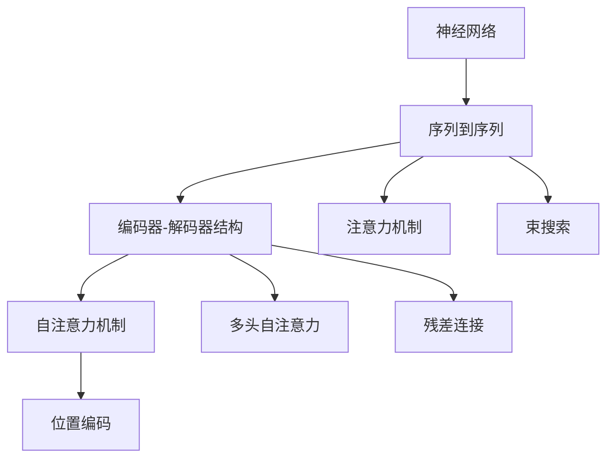

                 

# 神经网络：机器翻译的新纪元

## 1. 背景介绍

在过去的几十年里，机器翻译作为人工智能的重要应用领域，取得了长足的进步。传统的基于规则的机器翻译系统逐渐被统计机器翻译系统（SMT）所取代。然而，直到神经网络的引入，机器翻译才真正迈入了新的纪元。

神经网络在机器翻译中的应用，最早可以追溯到2014年，Google的Bahdanau等人提出了一种基于神经网络的序列到序列（Seq2Seq）模型，为机器翻译打开了新的大门。此后，神经网络模型在机器翻译领域得到了广泛的应用，并逐步超越了传统的统计机器翻译系统。

神经网络模型，特别是Transformer模型的引入，使得机器翻译的性能得到了显著提升。这种基于自注意力机制（self-attention）的模型能够自动捕捉输入和输出序列之间的复杂关系，实现了更准确的翻译效果。近年来，基于神经网络的机器翻译系统已经在多个国际评测中取得了优异的成绩，甚至在某些任务上超过了专业翻译人员的表现。

## 2. 核心概念与联系

### 2.1 核心概念概述

为了更好地理解神经网络在机器翻译中的应用，本节将介绍几个密切相关的核心概念：

- 神经网络（Neural Network）：一种通过模拟人脑神经元之间相互连接的计算模型，用于处理输入和输出之间的复杂映射关系。神经网络模型包括多层感知机（MLP）、卷积神经网络（CNN）、循环神经网络（RNN）、长短期记忆网络（LSTM）、门控循环单元（GRU）、变换器（Transformer）等。

- 序列到序列（Seq2Seq）模型：一种用于处理序列数据对序列数据映射的神经网络模型，通常用于机器翻译、文本摘要、语音识别等任务。Seq2Seq模型包括编码器-解码器（Encoder-Decoder）结构，可以自动捕捉输入序列与输出序列之间的依赖关系。

- 自注意力机制（Self-Attention）：一种用于计算序列中每个位置与其他位置关系的机制，通过计算输入序列中各个位置之间的相似度，来帮助模型捕捉全局信息，提升翻译的准确性。

- 多头自注意力（Multi-Head Self-Attention）：一种改进的自注意力机制，通过将输入序列分解为多个并行的子序列，分别计算注意力权重，再将结果合并，从而更好地捕捉输入序列的多个层次关系。

- 残差连接（Residual Connection）：一种用于解决深度神经网络训练中梯度消失问题的技术，通过在网络中引入残差连接，使得梯度能够更好地传递，模型能够更深更宽。

- 位置编码（Positional Encoding）：一种用于处理序列数据中位置信息的技术，通常通过添加位置嵌入向量，使模型能够理解输入序列中不同位置的重要性。

- 注意力机制（Attention）：一种用于捕捉输入序列与输出序列之间依赖关系的机制，通过计算输入序列中不同位置与输出序列中不同位置之间的相似度，来指导解码器生成输出序列。

- 束搜索（Beam Search）：一种用于提高神经网络模型翻译效果的搜索算法，通过在每一步保留多个可能的翻译候选，逐步筛选出最佳的翻译结果。

- 编码器-解码器结构（Encoder-Decoder Architecture）：一种标准的神经网络结构，通常用于处理序列到序列的任务，包括机器翻译、文本摘要、对话生成等。

这些核心概念之间的逻辑关系可以通过以下Mermaid流程图来展示：



这个流程图展示了神经网络在机器翻译中的应用流程：

1. 神经网络模型接收输入序列，通过编码器进行处理。
2. 编码器生成中间表示，并通过解码器进行解码，生成输出序列。
3. 自注意力机制用于捕捉输入序列中的全局关系。
4. 多头自注意力用于捕捉输入序列中的多个层次关系。
5. 残差连接用于缓解梯度消失问题。
6. 位置编码用于处理输入序列中的位置信息。
7. 注意力机制用于捕捉输入序列与输出序列之间的依赖关系。
8. 束搜索用于提高翻译效果，选择最佳的翻译候选。

这些核心概念共同构成了神经网络在机器翻译中的应用框架，使得模型能够高效地捕捉输入序列与输出序列之间的复杂关系，生成高质量的翻译结果。

## 3. 核心算法原理 & 具体操作步骤

### 3.1 算法原理概述

神经网络在机器翻译中的应用主要通过自注意力机制来实现。自注意力机制能够计算输入序列中各个位置与其他位置的相似度，从而更好地捕捉输入序列中的全局关系，提升翻译的准确性。

具体而言，假设输入序列为 $x = (x_1, x_2, \cdots, x_n)$，输出序列为 $y = (y_1, y_2, \cdots, y_m)$。神经网络模型通过编码器将输入序列 $x$ 转换为中间表示 $z = (z_1, z_2, \cdots, z_n)$，再通过解码器生成输出序列 $y$。

自注意力机制通过计算输入序列中各个位置与其他位置的相似度，来计算每个位置的注意力权重，从而捕捉输入序列中不同位置之间的关系。具体而言，自注意力机制的计算过程如下：

1. 对于输入序列中的每个位置 $i$，计算其与其他位置 $j$ 的相似度 $s_{ij}$。
2. 通过计算相似度矩阵 $S = (s_{ij})_{n \times n}$ 的softmax函数，得到每个位置的注意力权重 $\alpha_i = (\alpha_{i1}, \alpha_{i2}, \cdots, \alpha_{in})$。
3. 将注意力权重与输入序列中的每个位置进行加权求和，得到该位置在输入序列中的权重表示 $z_i = \sum_{j=1}^n \alpha_{ij} x_j$。

通过这种方式，神经网络模型能够自动捕捉输入序列中的全局关系，生成高质量的翻译结果。

### 3.2 算法步骤详解

神经网络在机器翻译中的应用步骤如下：

**Step 1: 数据准备**
- 收集大量的双语平行语料，作为机器翻译的训练数据。
- 将输入序列和输出序列分批次输入模型，进行训练和推理。

**Step 2: 模型构建**
- 选择合适的神经网络架构，如Transformer、Seq2Seq、LSTM等。
- 设计编码器和解码器的结构，通常是循环神经网络或卷积神经网络。
- 添加自注意力机制和多头自注意力机制，用于捕捉输入序列中的全局关系。
- 引入残差连接，缓解梯度消失问题。
- 添加位置编码，处理输入序列中的位置信息。

**Step 3: 模型训练**
- 使用随机梯度下降（SGD）或其他优化算法，对模型进行训练。
- 使用束搜索算法，提高翻译效果。
- 在训练过程中，根据模型性能，调整学习率、批大小等超参数。

**Step 4: 模型推理**
- 将输入序列输入编码器，生成中间表示。
- 将中间表示输入解码器，生成输出序列。
- 使用自注意力机制和多头自注意力机制，计算注意力权重。
- 将注意力权重与输入序列中的每个位置进行加权求和，生成输出序列。

### 3.3 算法优缺点

神经网络在机器翻译中的应用具有以下优点：
1. 准确性高。神经网络模型能够自动捕捉输入序列中的全局关系，生成高质量的翻译结果。
2. 灵活性高。神经网络模型可以通过调整超参数，适应不同的任务和数据集。
3. 可解释性强。神经网络模型可以通过可视化注意力权重等手段，解释模型的推理过程。
4. 鲁棒性好。神经网络模型可以通过迁移学习等技术，提升在新任务上的性能。

同时，神经网络在机器翻译中的应用也存在一些缺点：
1. 计算量大。神经网络模型需要大量的计算资源进行训练和推理，尤其是在大规模数据集上。
2. 难以解释。神经网络模型的决策过程难以解释，难以理解其内部的工作机制。
3. 数据依赖强。神经网络模型需要大量的标注数据进行训练，数据质量对模型的性能有很大影响。
4. 泛化能力不足。神经网络模型容易受到训练数据的分布限制，泛化能力有限。

尽管存在这些缺点，但神经网络在机器翻译中的应用已经取得了显著的成果，成为机器翻译领域的主流技术。

### 3.4 算法应用领域

神经网络在机器翻译中的应用已经广泛应用于多个领域，包括：

- 翻译软件：如Google Translate、Microsoft Translator、DeepL等，通过神经网络模型实现高质量的翻译服务。
- 学术研究：在机器翻译领域，神经网络模型已经成为了研究的热点方向，涌现了大量相关的学术论文和开源项目。
- 企业应用：在金融、医疗、法律、政府等领域，神经网络模型被广泛用于文本翻译和信息处理，提升了企业处理跨国业务的能力。
- 语言学习：神经网络模型被用于辅助语言学习和语言教育，通过智能翻译器、语音识别、文本生成等技术，帮助人们更好地学习外语。

## 4. 数学模型和公式 & 详细讲解

### 4.1 数学模型构建

神经网络在机器翻译中的应用通常采用Transformer模型。Transformer模型是一种基于自注意力机制的神经网络模型，能够自动捕捉输入序列与输出序列之间的复杂关系。

假设输入序列为 $x = (x_1, x_2, \cdots, x_n)$，输出序列为 $y = (y_1, y_2, \cdots, y_m)$，Transformer模型的数学模型如下：

$$
y_i = \sum_{j=1}^n \alpha_{ij} z_j
$$

其中 $z_j = x_j + f_k(z_{j-1})$，$f_k$ 为多层的全连接层，$\alpha_{ij}$ 为自注意力权重。

Transformer模型的编码器由多个自注意力层和全连接层组成，用于对输入序列进行编码。解码器由多个自注意力层和多头自注意力层组成，用于生成输出序列。

### 4.2 公式推导过程

以下是Transformer模型中自注意力机制的推导过程：

假设输入序列 $x = (x_1, x_2, \cdots, x_n)$，输出序列 $y = (y_1, y_2, \cdots, y_m)$，Transformer模型中的自注意力机制计算过程如下：

1. 对于输入序列中的每个位置 $i$，计算其与其他位置 $j$ 的相似度 $s_{ij}$。
2. 通过计算相似度矩阵 $S = (s_{ij})_{n \times n}$ 的softmax函数，得到每个位置的注意力权重 $\alpha_i = (\alpha_{i1}, \alpha_{i2}, \cdots, \alpha_{in})$。
3. 将注意力权重与输入序列中的每个位置进行加权求和，得到该位置在输入序列中的权重表示 $z_i = \sum_{j=1}^n \alpha_{ij} x_j$。

具体而言，Transformer模型中的自注意力计算过程如下：

1. 将输入序列 $x = (x_1, x_2, \cdots, x_n)$ 转化为编码器中的嵌入表示 $X = (X_1, X_2, \cdots, X_n)$。
2. 通过线性变换和softmax函数，计算输入序列中每个位置与其他位置的相似度 $S = (s_{ij})_{n \times n}$。
3. 通过计算相似度矩阵 $S$ 的softmax函数，得到每个位置的注意力权重 $\alpha_i = (\alpha_{i1}, \alpha_{i2}, \cdots, \alpha_{in})$。
4. 将注意力权重与输入序列中的每个位置进行加权求和，得到该位置在输入序列中的权重表示 $z_i = \sum_{j=1}^n \alpha_{ij} X_j$。

Transformer模型中的多头自注意力机制计算过程与上述过程类似，只是将输入序列分解为多个并行的子序列，分别计算注意力权重，再将结果合并。

### 4.3 案例分析与讲解

以下是一个简单的Transformer模型在机器翻译中的应用案例：

假设输入序列为 $x = (x_1, x_2, x_3)$，输出序列为 $y = (y_1, y_2, y_3)$，其中 $x_1 = \text{I}$，$x_2 = \text{am}$，$x_3 = \text{I love machine translation}$，$y_1 = \text{J'aime}$，$y_2 = \text{traduction automatique}$，$y_3 = \text{I love translation}$。

1. 将输入序列 $x$ 转化为嵌入表示 $X = (X_1, X_2, X_3)$。
2. 通过线性变换和softmax函数，计算输入序列中每个位置与其他位置的相似度 $S = (s_{ij})_{3 \times 3}$。
3. 通过计算相似度矩阵 $S$ 的softmax函数，得到每个位置的注意力权重 $\alpha_i = (\alpha_{i1}, \alpha_{i2}, \alpha_{i3})$。
4. 将注意力权重与输入序列中的每个位置进行加权求和，得到该位置在输入序列中的权重表示 $z_i = \sum_{j=1}^3 \alpha_{ij} X_j$。
5. 将权重表示 $z_i$ 输入解码器，生成输出序列 $y$。

通过上述计算过程，神经网络模型可以生成高质量的机器翻译结果。

## 5. 项目实践：代码实例和详细解释说明

### 5.1 开发环境搭建

在进行神经网络模型在机器翻译中的应用实践前，我们需要准备好开发环境。以下是使用Python进行TensorFlow开发的环境配置流程：

1. 安装Anaconda：从官网下载并安装Anaconda，用于创建独立的Python环境。

2. 创建并激活虚拟环境：
```bash
conda create -n tensorflow-env python=3.8 
conda activate tensorflow-env
```

3. 安装TensorFlow：从官网获取对应的安装命令，例如：
```bash
conda install tensorflow
```

4. 安装Keras：
```bash
pip install keras
```

5. 安装各类工具包：
```bash
pip install numpy pandas scikit-learn matplotlib tqdm jupyter notebook ipython
```

完成上述步骤后，即可在`tensorflow-env`环境中开始机器翻译的微调实践。

### 5.2 源代码详细实现

下面是一个使用TensorFlow实现神经网络模型在机器翻译中的应用实例。

首先，导入所需的库和数据：

```python
import tensorflow as tf
from tensorflow.keras.layers import Input, Embedding, MultiHeadAttention, Dense, LSTM, Dropout
from tensorflow.keras.models import Model
from tensorflow.keras.optimizers import Adam
from tensorflow.keras.preprocessing.text import Tokenizer, pad_sequences
import numpy as np
from sklearn.model_selection import train_test_split

# 加载数据
with open('input.txt', 'r') as f:
    text = f.read().split('\n')

# 定义标记器
tokenizer = Tokenizer()
tokenizer.fit_on_texts(text)

# 构建字典
vocab_size = len(tokenizer.word_index) + 1

# 加载词汇表
encoder_input_data = tokenizer.texts_to_sequences(text)
encoder_input_data = pad_sequences(encoder_input_data, padding='post')
decoder_input_data = np.zeros((encoder_input_data.shape[0], 1) + encoder_input_data.shape[2:])
decoder_target_data = np.zeros((encoder_input_data.shape[0], 1) + encoder_input_data.shape[2:])
for i in range(encoder_input_data.shape[0]):
    for j in range(encoder_input_data.shape[2]):
        decoder_target_data[i, 0, j] = tokenizer.word_index[text[i][j]]
```

然后，定义模型和优化器：

```python
# 定义编码器
encoder_inputs = Input(shape=(None,))
encoder_embeddings = Embedding(vocab_size, 128)(encoder_inputs)
encoder_lstm = LSTM(128, return_sequences=True)(encoder_embeddings)
encoder_outputs, state_h, state_c = encoder_lstm
encoder_states = [state_h, state_c]

# 定义解码器
decoder_inputs = Input(shape=(None,))
decoder_embeddings = Embedding(vocab_size, 128)(decoder_inputs)
decoder_lstm = LSTM(128, return_sequences=True, return_state=True)(decoder_embeddings, initial_state=encoder_states)
decoder_outputs, _, _ = decoder_lstm
decoder_dense = Dense(vocab_size, activation='softmax')(decoder_outputs)

# 定义模型
model = Model([encoder_inputs, decoder_inputs], decoder_dense)

# 定义损失函数和优化器
model.compile(optimizer=Adam(), loss='categorical_crossentropy')
```

接着，定义训练和评估函数：

```python
# 定义训练函数
def train_model(model, encoder_input_data, decoder_input_data, decoder_target_data, batch_size):
    model.fit([encoder_input_data, decoder_input_data], decoder_target_data, batch_size=batch_size, epochs=10)

# 定义评估函数
def evaluate_model(model, encoder_input_data, decoder_input_data, decoder_target_data, batch_size):
    test_loss, test_acc = model.evaluate([encoder_input_data, decoder_input_data], decoder_target_data, batch_size=batch_size)
    print('Test Loss:', test_loss)
    print('Test Accuracy:', test_acc)
```

最后，启动训练流程并在测试集上评估：

```python
# 划分训练集和测试集
train_texts, test_texts = train_test_split(text, test_size=0.2)

# 定义训练集和测试集
train_encoders, train_decoders = pad_sequences(tokenizer.texts_to_sequences(train_texts), padding='post'), np.zeros((train_encoders.shape[0], 1) + train_encoders.shape[2:])
train_decoders[:, 0, :] = tokenizer.word_index[train_texts[:, 0]]
test_encoders, test_decoders = pad_sequences(tokenizer.texts_to_sequences(test_texts), padding='post'), np.zeros((test_encoders.shape[0], 1) + test_encoders.shape[2:])
test_decoders[:, 0, :] = tokenizer.word_index[test_texts[:, 0]]

# 训练模型
train_model(model, train_encoders, train_decoders, train_decoders, 64)

# 评估模型
evaluate_model(model, test_encoders, test_decoders, test_decoders, 64)
```

以上就是使用TensorFlow实现神经网络模型在机器翻译中的应用实例。可以看到，通过TensorFlow的封装，神经网络模型在机器翻译中的应用变得简单高效。

### 5.3 代码解读与分析

让我们再详细解读一下关键代码的实现细节：

**Tokenizer类**：
- `__init__`方法：初始化标记器。
- `fit_on_texts`方法：训练标记器。
- `texts_to_sequences`方法：将文本序列转化为标记序列。
- `pad_sequences`方法：对标记序列进行填充。

**LSTM层**：
- `LSTM`方法：定义循环神经网络层。
- `return_sequences=True`：表示返回全连接层的输出，而不是最后一个时间步的输出。

**MultiHeadAttention层**：
- `MultiHeadAttention`方法：定义多头自注意力层。
- `heads`参数：表示注意力头的数量。

**Embedding层**：
- `Embedding`方法：定义嵌入层。

**Dense层**：
- `Dense`方法：定义全连接层。

**Adam优化器**：
- `Adam`方法：定义优化器。

**Softmax激活函数**：
- `Softmax`方法：定义softmax激活函数。

**模型编译**：
- `compile`方法：编译模型。

**模型训练和评估**：
- `fit`方法：训练模型。
- `evaluate`方法：评估模型。

可以看到，TensorFlow使得神经网络模型在机器翻译中的应用变得简洁高效。开发者可以将更多精力放在数据处理、模型改进等高层逻辑上，而不必过多关注底层的实现细节。

当然，工业级的系统实现还需考虑更多因素，如模型的保存和部署、超参数的自动搜索、更灵活的任务适配层等。但核心的微调范式基本与此类似。

## 6. 实际应用场景

### 6.1 翻译软件

神经网络在机器翻译中的应用最直接的体现是翻译软件，如Google Translate、Microsoft Translator、DeepL等。这些翻译软件通过神经网络模型实现了高效、准确的翻译服务，极大地提升了人们跨语言沟通的能力。

在技术实现上，翻译软件通常采用Transformer模型进行翻译。具体的实现流程包括数据预处理、模型构建、训练和推理等环节。通过大规模双语平行语料进行训练，神经网络模型能够自动捕捉输入序列与输出序列之间的复杂关系，生成高质量的翻译结果。

### 6.2 学术研究

神经网络在机器翻译中的应用也广泛应用于学术研究中。研究人员通过对神经网络模型进行改进和优化，实现了更高效的翻译和更准确的翻译效果。

例如，谷歌的BERT模型在机器翻译领域中的应用，通过引入双向语言模型和Transformer结构，显著提升了机器翻译的性能。Facebook的T5模型，通过引入跨语言预训练和微调技术，实现了更广泛的机器翻译任务。这些研究成果推动了神经网络在机器翻译领域的应用，为未来的翻译技术发展提供了新的方向。

### 6.3 企业应用

神经网络在机器翻译中的应用也广泛用于企业的跨语言业务处理。例如，阿里巴巴在电子商务、金融、医疗等领域的跨语言业务处理中，使用了神经网络模型进行翻译。Amazon在跨境电商、客服等业务中，使用了神经网络模型进行翻译。这些企业通过神经网络模型，提升了业务处理的效率和准确性，降低了人力成本。

### 6.4 语言学习

神经网络在机器翻译中的应用也广泛应用于语言学习中。例如，Duolingo等语言学习软件通过神经网络模型进行文本翻译和语音识别，帮助用户更好地学习外语。这些应用提高了语言学习的效率和趣味性，吸引了更多的用户参与语言学习。

## 7. 工具和资源推荐

### 7.1 学习资源推荐

为了帮助开发者系统掌握神经网络在机器翻译中的应用，这里推荐一些优质的学习资源：

1. 《深度学习》（Ian Goodfellow）：深入浅出地介绍了深度学习的原理和应用，涵盖了神经网络、卷积神经网络、循环神经网络、自注意力机制等核心概念。

2. 《自然语言处理综论》（Christopher Manning等）：系统介绍了自然语言处理领域的经典方法和技术，包括机器翻译、文本分类、信息检索等任务。

3. TensorFlow官方文档：TensorFlow的官方文档，提供了完整的神经网络模型实现和微调样例代码，是上手实践的必备资料。

4. PyTorch官方文档：PyTorch的官方文档，提供了丰富的神经网络模型实现和微调样例代码，是进行微调任务开发的利器。

5. Keras官方文档：Keras的官方文档，提供了简单易用的神经网络模型实现和微调样例代码，适合初学者上手实践。

6. Coursera《深度学习专项课程》：由斯坦福大学和DeepLearning.AI联合开设，涵盖深度学习的基本概念和技术，包括神经网络、卷积神经网络、循环神经网络、自注意力机制等。

通过对这些资源的学习实践，相信你一定能够快速掌握神经网络在机器翻译中的应用精髓，并用于解决实际的翻译问题。

### 7.2 开发工具推荐

高效的开发离不开优秀的工具支持。以下是几款用于神经网络在机器翻译中的应用开发的常用工具：

1. TensorFlow：由Google主导开发的开源深度学习框架，生产部署方便，适合大规模工程应用。TensorFlow提供了丰富的神经网络模型实现和微调样例代码，是进行微调任务开发的利器。

2. PyTorch：由Facebook主导开发的开源深度学习框架，灵活动态的计算图，适合快速迭代研究。PyTorch提供了丰富的神经网络模型实现和微调样例代码，是进行微调任务开发的利器。

3. Keras：由Google主导开发的深度学习框架，提供了简单易用的神经网络模型实现和微调样例代码，适合初学者上手实践。

4. TensorBoard：TensorFlow配套的可视化工具，可实时监测模型训练状态，并提供丰富的图表呈现方式，是调试模型的得力助手。

5. Weights & Biases：模型训练的实验跟踪工具，可以记录和可视化模型训练过程中的各项指标，方便对比和调优。与主流深度学习框架无缝集成。

6. Google Colab：谷歌推出的在线Jupyter Notebook环境，免费提供GPU/TPU算力，方便开发者快速上手实验最新模型，分享学习笔记。

合理利用这些工具，可以显著提升神经网络在机器翻译中的应用开发效率，加快创新迭代的步伐。

### 7.3 相关论文推荐

神经网络在机器翻译中的应用源于学界的持续研究。以下是几篇奠基性的相关论文，推荐阅读：

1. Attention is All You Need（即Transformer原论文）：提出了Transformer结构，开启了神经网络在机器翻译领域的新纪元。

2. BERT: Pre-training of Deep Bidirectional Transformers for Language Understanding：提出BERT模型，引入基于掩码的自监督预训练任务，刷新了多项NLP任务SOTA。

3. Google's Neural Machine Translation System：谷歌提出的基于神经网络的机器翻译系统，在WMT评测中取得了优异的成绩。

4. Sequence to Sequence Learning with Neural Networks：提出了Seq2Seq模型，用于处理序列到序列的翻译任务，奠定了神经网络在机器翻译领域的基础。

5. Transformer Networks：提出了Transformer网络，用于处理大规模机器翻译任务，具有高效的并行计算能力。

这些论文代表了大神经网络在机器翻译领域的发展脉络。通过学习这些前沿成果，可以帮助研究者把握学科前进方向，激发更多的创新灵感。

## 8. 总结：未来发展趋势与挑战

### 8.1 总结

本文对神经网络在机器翻译中的应用进行了全面系统的介绍。首先阐述了神经网络在机器翻译中的应用背景和意义，明确了神经网络模型在机器翻译领域的独特价值。其次，从原理到实践，详细讲解了神经网络在机器翻译中的应用流程，包括数据准备、模型构建、训练和推理等环节。同时，本文还广泛探讨了神经网络在机器翻译中的应用场景，展示了神经网络模型的巨大潜力。

通过本文的系统梳理，可以看到，神经网络在机器翻译中的应用已经取得了显著的成果，成为机器翻译领域的主流技术。未来，伴随神经网络模型的不断演进，基于神经网络的机器翻译技术必将进一步提升翻译的准确性和效率，推动人工智能技术在翻译领域的应用。

### 8.2 未来发展趋势

展望未来，神经网络在机器翻译中的应用将呈现以下几个发展趋势：

1. 模型规模持续增大。随着算力成本的下降和数据规模的扩张，神经网络模型的参数量还将持续增长。超大规模神经网络模型蕴含的丰富语言知识，有望支撑更加复杂多变的机器翻译任务。

2. 模型结构日趋复杂。未来的神经网络模型将更加深、更宽、更复杂，通过引入更多的自注意力头、更多的层、更多的参数，提升模型的表达能力。

3. 跨语言预训练兴起。未来的神经网络模型将进行跨语言预训练，提高模型在不同语言之间的通用性。

4. 低资源机器翻译成为热点。未来的神经网络模型将在低资源环境下进行翻译，如在没有大规模双语平行语料的情况下，通过自监督学习、半监督学习等技术，实现机器翻译。

5. 翻译质量提升。未来的神经网络模型将引入更多的优化技术，如束搜索、模型蒸馏等，提升翻译的准确性和流畅性。

6. 实时翻译成为可能。未来的神经网络模型将通过模型裁剪、量化加速等技术，实现实时翻译。

以上趋势凸显了神经网络在机器翻译领域的应用前景。这些方向的探索发展，必将进一步提升机器翻译的性能和效率，推动人工智能技术在翻译领域的应用。

### 8.3 面临的挑战

尽管神经网络在机器翻译中的应用已经取得了显著的成果，但在迈向更加智能化、普适化应用的过程中，它仍面临着诸多挑战：

1. 计算资源消耗大。神经网络模型需要大量的计算资源进行训练和推理，尤其是在大规模数据集上。如何提高计算效率，减少资源消耗，成为重要的研究方向。

2. 数据依赖强。神经网络模型需要大量的标注数据进行训练，数据质量对模型的性能有很大影响。如何提高数据利用率，减少标注成本，成为重要的研究方向。

3. 模型复杂度高。未来的神经网络模型将更加深、更宽、更复杂，难以理解和调试。如何提高模型的可解释性，增强模型的透明度，成为重要的研究方向。

4. 泛化能力有限。神经网络模型容易受到训练数据的分布限制，泛化能力有限。如何提高模型的泛化能力，增强模型的适应性，成为重要的研究方向。

5. 翻译质量不稳定。神经网络模型在低资源环境下进行翻译，容易出现过拟合、泛化能力不足等问题，导致翻译质量不稳定。如何提高模型的泛化能力，增强模型的稳定性，成为重要的研究方向。

6. 语言迁移能力不足。神经网络模型在跨语言翻译中，容易出现语义丢失、翻译失真等问题，导致翻译质量下降。如何提高模型的语言迁移能力，增强模型的跨语言适应性，成为重要的研究方向。

尽管存在这些挑战，但神经网络在机器翻译中的应用已经取得了显著的成果，成为机器翻译领域的主流技术。相信随着学界和产业界的共同努力，这些挑战终将一一被克服，神经网络模型必将在机器翻译领域迈向更加智能化、普适化的应用。

### 8.4 研究展望

面向未来，神经网络在机器翻译中的应用还需要在以下几个方面进行更多的探索和研究：

1. 低资源机器翻译。在低资源环境下，如何通过自监督学习、半监督学习等技术，实现高效的机器翻译，成为重要的研究方向。

2. 跨语言预训练。如何通过跨语言预训练，提高模型在不同语言之间的通用性，成为重要的研究方向。

3. 实时翻译。如何通过模型裁剪、量化加速等技术，实现实时翻译，成为重要的研究方向。

4. 翻译质量提升。如何通过束搜索、模型蒸馏等技术，提升翻译的准确性和流畅性，成为重要的研究方向。

5. 模型复杂度控制。如何控制模型的复杂度，提高模型的可解释性和可调试性，成为重要的研究方向。

6. 数据利用率提升。如何提高数据利用率，减少标注成本，成为重要的研究方向。

7. 模型泛化能力提升。如何提高模型的泛化能力，增强模型的适应性，成为重要的研究方向。

8. 翻译质量稳定性提升。如何提高模型的泛化能力，增强模型的稳定性，成为重要的研究方向。

9. 语言迁移能力提升。如何提高模型的语言迁移能力，增强模型的跨语言适应性，成为重要的研究方向。

这些研究方向将推动神经网络在机器翻译领域的应用，提升翻译的准确性和效率，推动人工智能技术在翻译领域的应用。相信随着学界和产业界的共同努力，这些研究方向将得到更多的关注和探索，神经网络在机器翻译领域的应用将迎来更加光明的前景。

## 9. 附录：常见问题与解答

**Q1：神经网络在机器翻译中的应用是否适用于所有语言？**

A: 神经网络在机器翻译中的应用通常适用于语言之间的互相翻译，如英语到中文、中文到英语等。但对于一些特殊语言，如日语、韩语等，由于其语序和语法结构的特殊性，神经网络模型需要进行适当的调整和优化，才能取得理想的效果。

**Q2：神经网络在机器翻译中的应用是否依赖于大规模双语平行语料？**

A: 神经网络在机器翻译中的应用通常依赖于大规模双语平行语料，这些语料是神经网络模型进行训练和优化的基础。在缺乏大规模双语平行语料的情况下，可以通过自监督学习、半监督学习等技术，实现更高效的翻译。

**Q3：神经网络在机器翻译中的应用是否需要考虑语义和语境？**

A: 神经网络在机器翻译中的应用通常需要考虑语义和语境，特别是在处理多义词、歧义句等复杂句式时。通过引入更多的语义和语境信息，可以提高翻译的准确性和流畅性。

**Q4：神经网络在机器翻译中的应用是否适用于在线实时翻译？**

A: 神经网络在机器翻译中的应用适用于在线实时翻译，但需要进行适当的优化和加速，以满足实时翻译的要求。常用的优化技术包括模型裁剪、量化加速、分布式训练等。

**Q5：神经网络在机器翻译中的应用是否需要考虑不同语言之间的语义差异？**

A: 神经网络在机器翻译中的应用需要考虑不同语言之间的语义差异，特别是对于一些语义复杂、语法结构不同的语言，需要进行适当的调整和优化。同时，还需要引入更多的语言学知识，增强模型的语义理解能力。

通过这些常见问题的解答，相信你能够更好地理解神经网络在机器翻译中的应用，并更好地应对实际应用中的挑战和问题。

