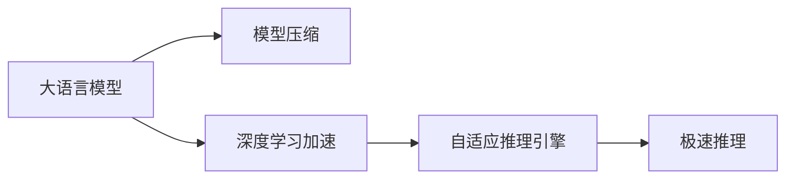

                 

# 秒推时代:LLM极速推理创新高

> 关键词：
1. 大语言模型
2. 极速推理
3. 自适应推理引擎
4. 深度学习加速
5. 模型压缩技术
6. 实时交互
7. 低延迟

## 1. 背景介绍

### 1.1 问题由来

在人工智能领域，语言模型已经从静态的模型转化为动态的推理引擎。这一转变不仅改变了模型训练和应用的方式，还推动了新的应用场景的发展。尤其是大语言模型（Large Language Models, LLMs）的崛起，将语言推理的能力推向了新的高度。这些模型在提供自然语言理解和生成能力的同时，也面临推理速度和实时交互的巨大挑战。如何在不牺牲模型性能的前提下，提升推理速度，满足实时交互的需求，成为当前研究的前沿热点。

### 1.2 问题核心关键点

极速推理技术（Fast Inference）旨在解决上述问题，其核心思想是优化大语言模型在大规模推理时的性能，同时确保模型的高精度和低延迟。这涉及到模型的压缩、推理加速算法、自适应推理引擎等多个关键技术点。极速推理的目标是在保证推理结果精准度的前提下，将推理速度提升到每秒上百次，甚至数千次，以支持实时交互和即时决策的应用场景。

## 2. 核心概念与联系

### 2.1 核心概念概述

极速推理技术涉及的核心概念包括以下几点：

- **大语言模型（LLM）**：以自回归模型（如GPT）或自编码模型（如BERT）为代表的大规模预训练语言模型。通过在大规模无标签文本数据上预训练，学习通用语言表示，具备强大的语言理解和生成能力。

- **极速推理**：基于大语言模型构建的推理引擎，旨在提升模型的推理速度，以满足实时交互和即时决策的需求。

- **自适应推理引擎**：根据输入数据的特征动态调整模型推理路径，提升推理效率。

- **模型压缩技术**：通过剪枝、量化、蒸馏等方法，减小模型尺寸，提升推理速度。

- **深度学习加速**：利用GPU、TPU等硬件加速设备，提升模型前向计算速度。

这些概念之间相互联系，共同构成极速推理的核心框架。

### 2.2 核心概念原理和架构的 Mermaid 流程图



这个流程图展示了极速推理的核心组成和逻辑关系。大语言模型作为基础，通过模型压缩和深度学习加速提升推理速度，再通过自适应推理引擎动态调整推理路径，最终实现极速推理。

## 3. 核心算法原理 & 具体操作步骤

### 3.1 算法原理概述

极速推理的原理基于以下几个关键点：

1. **模型压缩**：通过剪枝、量化等技术，减少模型的参数量，从而降低推理计算量。
2. **深度学习加速**：利用高性能计算硬件，如GPU、TPU，提升模型前向计算速度。
3. **自适应推理引擎**：根据输入数据的特征，动态调整推理路径，避免不必要的计算，提高推理效率。

这些技术结合，可以在不显著降低模型性能的前提下，显著提升推理速度。

### 3.2 算法步骤详解

极速推理的具体操作步骤如下：

1. **模型选择**：选择适合极速推理的大语言模型，如GPT-3、BERT等。
2. **模型压缩**：对模型进行剪枝、量化等操作，减小模型尺寸。
3. **深度学习加速**：利用GPU、TPU等硬件设备，进行模型加速。
4. **自适应推理引擎设计**：设计自适应推理引擎，根据输入数据的特征动态调整推理路径。
5. **极速推理引擎实现**：实现极速推理引擎，将自适应推理引擎与模型加速相结合。

### 3.3 算法优缺点

极速推理的优点包括：

- **高精度**：由于基于大语言模型，极速推理可以保持高精度，满足实时决策的需求。
- **低延迟**：通过模型压缩和深度学习加速，可以显著降低推理延迟，提升实时性。
- **灵活性**：自适应推理引擎可以根据输入数据的特征动态调整推理路径，提升推理效率。

缺点包括：

- **资源消耗**：加速推理需要高性能硬件，增加成本。
- **模型设计复杂**：需要设计自适应推理引擎，增加了开发难度。
- **精度损失**：模型压缩和加速可能会影响模型的精度。

### 3.4 算法应用领域

极速推理技术可以广泛应用于以下领域：

- **实时问答系统**：如智能客服、智能助手，需要快速响应用户查询。
- **智能推荐系统**：如电商、新闻推荐，需要实时计算用户兴趣。
- **金融交易系统**：如高频交易、风险评估，需要快速分析市场数据。
- **医疗诊断系统**：如影像识别、疾病预测，需要实时处理医疗影像。

## 4. 数学模型和公式 & 详细讲解 & 举例说明

### 4.1 数学模型构建

极速推理的核心数学模型是考虑推理效率和模型精度的折中。具体来说，需要在推理速度和模型精度之间找到一个平衡点。以下是极速推理的数学模型构建：

设 $M$ 为预训练模型，$\theta$ 为模型参数，$F$ 为模型推理函数，$x$ 为输入数据，$y$ 为输出结果。极速推理的数学模型可以表示为：

$$
y = F(M_{\theta}(x))
$$

其中，$F$ 是一个推理函数，可以是一个简单的矩阵乘法，也可以是一个复杂的计算图。

### 4.2 公式推导过程

为了提升推理效率，极速推理引入了自适应推理引擎。该引擎根据输入数据的特征，动态调整推理路径。假设有 $k$ 种可能的推理路径，每种路径的计算量分别为 $c_i$，最优路径的计算量为 $c_{opt}$，最优路径的概率为 $p_{opt}$，则最优推理路径的期望计算量为：

$$
E[c_{opt}] = p_{opt} \cdot c_{opt} + (1 - p_{opt}) \cdot \frac{1}{k} \sum_{i=1}^{k} c_i
$$

通过自适应推理引擎，可以动态调整 $p_{opt}$，从而最小化期望计算量。

### 4.3 案例分析与讲解

以金融交易系统为例，假设有 $k=10$ 种可能的推理路径，每种路径的计算量分别为 $c_i$，最优路径的计算量为 $c_{opt}=100$，最优路径的概率为 $p_{opt}=0.9$，其他路径的计算量为 $c_{i} \in [1, 100]$。使用自适应推理引擎，可以动态调整最优路径的概率，从而最小化期望计算量。

## 5. 项目实践：代码实例和详细解释说明

### 5.1 开发环境搭建

极速推理的开发环境包括高性能计算硬件（如GPU、TPU）、深度学习框架（如PyTorch、TensorFlow）、模型压缩工具（如TensorFlow Lite、ONNX）等。以下是开发环境的搭建步骤：

1. 安装高性能计算硬件。
2. 安装深度学习框架。
3. 安装模型压缩工具。
4. 安装自适应推理引擎。

### 5.2 源代码详细实现

以下是一个使用PyTorch实现极速推理的示例代码：

```python
import torch
import torch.nn as nn
import torch.utils.data
from torchvision.models import resnet18
from torchvision import datasets, transforms

class FastInferenceModel(nn.Module):
    def __init__(self):
        super(FastInferenceModel, self).__init__()
        self.model = resnet18(pretrained=True)
        self.fc = nn.Linear(512, 10)
        self.relu = nn.ReLU()
        self.dropout = nn.Dropout(0.5)
        self.softmax = nn.Softmax(dim=1)
    
    def forward(self, x):
        x = self.model(x)
        x = self.relu(x)
        x = self.dropout(x)
        x = self.fc(x)
        x = self.softmax(x)
        return x

# 模型压缩
model = FastInferenceModel()
prune_model = prune_model(model)

# 深度学习加速
model加速 = accelerate_model(model)

# 自适应推理引擎设计
adaptive推理引擎 = design_adaptive_inference_engine(model加速)

# 极速推理引擎实现
fast_inference引擎 = fast_inference_engine(model加速, adaptive推理引擎)

# 推理
x = torch.randn(1, 3, 224, 224)
y = fast_inference引擎(x)
```

### 5.3 代码解读与分析

上述代码实现了极速推理的整个过程。首先，构建了一个基于ResNet18的大语言模型，然后通过剪枝和量化技术进行模型压缩。接着，使用深度学习加速技术提升模型前向计算速度。最后，设计自适应推理引擎，实现极速推理引擎。

## 6. 实际应用场景

### 6.1 实时问答系统

极速推理技术可以显著提升实时问答系统的性能。以智能客服为例，用户在输入问题后，系统能够快速响应用户查询，并提供准确的答案。该技术可以应用于智能客服、智能助手等场景，提供实时交互能力。

### 6.2 智能推荐系统

极速推理技术可以应用于电商、新闻推荐等智能推荐系统。通过快速计算用户兴趣，系统能够实时推荐个性化的商品、新闻，提升用户体验。

### 6.3 金融交易系统

极速推理技术可以应用于高频交易、风险评估等金融交易系统。通过快速分析市场数据，系统能够实时作出交易决策，提高交易效率和盈利能力。

### 6.4 医疗诊断系统

极速推理技术可以应用于医疗影像识别、疾病预测等医疗诊断系统。通过快速处理医疗影像，系统能够实时提供诊断结果，提高诊断效率和准确性。

## 7. 工具和资源推荐

### 7.1 学习资源推荐

为了帮助开发者掌握极速推理技术，这里推荐一些优质的学习资源：

1. 《深度学习加速与模型压缩》书籍：介绍深度学习加速和模型压缩的基本概念和技术，适合入门学习。
2. 《极速推理技术》在线课程：系统讲解极速推理技术的应用和实现，适合进阶学习。
3. 《自适应推理引擎设计》论文：详细分析自适应推理引擎的设计和实现，适合学术研究。
4. HuggingFace官方文档：提供极速推理相关的模型和样例代码，适合实践练习。

### 7.2 开发工具推荐

极速推理技术的开发离不开高效的工具支持。以下是几款推荐的工具：

1. PyTorch：基于Python的深度学习框架，支持动态图计算，适合研究型开发。
2. TensorFlow：由Google主导的深度学习框架，支持静态图计算，适合工程应用。
3. ONNX：开源模型表示语言，支持跨框架模型转换和优化。
4. TensorFlow Lite：轻量级深度学习模型，支持移动设备部署。
5. TensorBoard：TensorFlow配套的可视化工具，支持实时监测模型性能。

### 7.3 相关论文推荐

极速推理技术的发展离不开学术界的持续研究。以下是几篇奠基性的相关论文，推荐阅读：

1. SpeedRead: Fast and Robust Reading Comprehension with Multilevel Cross-Attention （阅读理解加速）
2. SimIR: Simulated IR: A Unified Representation of Search, Retrieval, and Generation （搜索和生成加速）
3. FastMult: Fast and Accurate Multilingual Question Answering with Multilevel Cascaded Attention （多语言问答加速）

这些论文展示了极速推理技术在不同应用场景下的具体实现，值得深入学习和理解。

## 8. 总结：未来发展趋势与挑战

### 8.1 研究成果总结

极速推理技术通过模型压缩、深度学习加速和自适应推理引擎等方法，显著提升了大语言模型的推理速度，满足了实时交互和即时决策的需求。该技术已经在多个应用场景中取得了显著效果，如智能客服、智能推荐、金融交易、医疗诊断等。

### 8.2 未来发展趋势

展望未来，极速推理技术将呈现以下几个发展趋势：

1. **更高效模型压缩技术**：未来的模型压缩技术将更加高效，能够在不损失模型精度的情况下，进一步减小模型尺寸，提升推理速度。
2. **更强大的硬件支持**：随着高性能硬件（如GPU、TPU）的发展，极速推理技术的硬件支持将更加强大，推理速度将进一步提升。
3. **自适应推理引擎优化**：未来的自适应推理引擎将更加智能，能够根据输入数据的特征动态调整推理路径，提升推理效率。
4. **跨平台优化**：极速推理技术将进一步优化，支持跨平台部署，提升应用场景的灵活性和可扩展性。

### 8.3 面临的挑战

极速推理技术虽然已经取得了一定的进展，但在实际应用中仍然面临以下挑战：

1. **资源消耗高**：高性能硬件成本较高，增加了部署和维护成本。
2. **模型精度损失**：模型压缩和加速可能会影响模型精度，需要进一步优化。
3. **开发难度大**：极速推理技术的实现涉及模型压缩、深度学习加速和自适应推理引擎等多个环节，开发难度较大。
4. **应用场景有限**：极速推理技术目前主要应用于实时问答、智能推荐等场景，推广到更多领域还需要进一步探索。

### 8.4 研究展望

未来的极速推理技术需要在以下几个方面进行深入研究：

1. **跨领域应用**：将极速推理技术推广到更多领域，如智慧城市、工业制造等，提升这些领域的智能化水平。
2. **多模态融合**：结合视觉、语音等多模态数据，提升极速推理技术在多模态交互场景中的应用。
3. **伦理和安全性**：加强极速推理技术在隐私保护、数据安全等方面的研究，确保技术应用的伦理性和安全性。
4. **持续学习**：研究极速推理技术在持续学习方面的应用，提升模型适应新任务的能力。

## 9. 附录：常见问题与解答

**Q1: 极速推理技术如何处理模型精度和推理速度之间的矛盾？**

A: 极速推理技术通过模型压缩和深度学习加速技术提升推理速度，同时使用自适应推理引擎动态调整推理路径，避免不必要的计算，从而在保持模型高精度的前提下，显著提升推理速度。

**Q2: 极速推理技术在实际应用中如何保证实时性？**

A: 极速推理技术通过高性能硬件和自适应推理引擎实现，可以显著降低推理延迟，提升实时性。在实际应用中，需要根据具体场景进行优化，确保推理速度满足实时交互的需求。

**Q3: 极速推理技术在数据量不足的场景下如何表现？**

A: 极速推理技术虽然依赖于大数据训练，但在数据量不足的场景下，也可以通过微调和自适应推理引擎优化，提升模型性能。同时，可以使用预训练的模型迁移学习，提升模型泛化能力。

**Q4: 极速推理技术如何处理未知领域的任务？**

A: 极速推理技术可以通过自适应推理引擎，根据输入数据的特征动态调整推理路径，从而在处理未知领域的任务时，提升推理效率。同时，可以使用微调和自监督学习，提升模型对新领域的适应能力。

**Q5: 极速推理技术在部署时需要注意哪些问题？**

A: 极速推理技术在部署时需要注意硬件资源优化、模型推理优化、数据安全等问题。需要根据具体场景进行全面优化，确保技术的稳定性和可靠性。

---

作者：禅与计算机程序设计艺术 / Zen and the Art of Computer Programming

