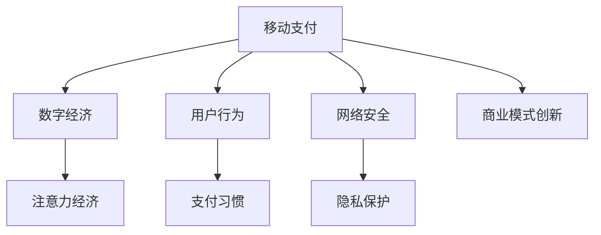

                 

# 移动支付如何改变注意力经济格局

> 关键词：移动支付,注意力经济,数字货币,用户行为,支付习惯,网络安全,隐私保护,商业模式创新

## 1. 背景介绍

### 1.1 问题由来
随着移动互联网的迅速发展和智能手机的普及，移动支付正逐渐成为人们日常生活和商业活动的重要组成部分。据统计，截至2021年底，全球移动支付用户数已经超过30亿，预计到2025年将达到50亿。这种支付方式的普及，不仅改变了传统的商业模式，也重塑了社会经济结构和人们的消费行为。

移动支付的兴起，也推动了数字货币的广泛应用。区块链技术、加密货币和中央银行数字货币(CBDC)等新兴技术的发展，进一步加速了数字经济时代的到来。数字货币的去中心化特性，为交易的透明性、安全性和隐私保护提供了新的解决方案，同时也对传统金融体系提出了新的挑战。

## 2. 核心概念与联系

### 2.1 核心概念概述

移动支付的兴起，在很大程度上推动了数字经济的发展。数字经济是一种以信息为生产要素，以互联网为平台，以数据为驱动力的新型经济模式。其核心在于通过数字化手段，优化资源配置，提高生产效率，创造新的价值。

注意力经济则是基于数字经济的重要概念，指的是在信息爆炸的时代，用户注意力成为稀缺资源，如何吸引和利用用户的注意力，成为商业竞争的关键。移动支付不仅改变了用户的支付方式，也重塑了其注意力分布和经济行为。

### 2.2 核心概念原理和架构的 Mermaid 流程图

这个流程图展示了移动支付与数字经济和注意力经济之间的联系，以及其对用户行为、支付习惯、网络安全、隐私保护和商业模式创新的影响。

## 3. 核心算法原理 & 具体操作步骤
### 3.1 算法原理概述

移动支付的核心算法原理主要包括区块链技术、加密货币原理和支付网络设计。

区块链技术是一种去中心化的分布式账本技术，通过共识机制和加密算法，保证数据的安全性和不可篡改性。加密货币则是基于区块链技术，利用密码学原理实现货币的数字形式。支付网络则设计了用户与商家之间的支付渠道，通过加密传输确保交易安全。

### 3.2 算法步骤详解

**Step 1: 设计区块链网络**
- 选择合适的加密算法和共识机制，构建区块链网络。
- 实现区块链网络中的节点管理，设计P2P网络协议。
- 部署智能合约，实现自动化的交易处理和资金清算。

**Step 2: 开发加密货币**
- 设计加密货币的数字签名机制和公私钥管理。
- 实现加密货币的发行、交易和存储机制。
- 保证加密货币的抗攻击性和安全性。

**Step 3: 搭建支付网络**
- 设计支付网络中的交易路由和资金流控制。
- 实现用户和商家之间的安全支付流程。
- 优化支付网络性能，保证交易效率和稳定。

### 3.3 算法优缺点

移动支付算法的优点在于：

1. 去中心化：通过区块链技术，去除传统金融中介，提高交易效率和透明性。
2. 安全性高：利用密码学算法，确保数据传输和交易的安全性。
3. 用户便捷：移动支付的应用使得用户可以随时随地进行交易。
4. 智能合约：实现自动化的支付处理，提高交易效率。

其缺点主要包括：

1. 技术门槛高：区块链和加密货币技术复杂，需要较高技术水平。
2. 性能瓶颈：高交易量下的网络拥堵和延迟问题。
3. 监管挑战：如何平衡自由交易和监管需求。
4. 隐私泄露：数字货币的去匿名性问题。

### 3.4 算法应用领域

移动支付的算法在多个领域都有广泛应用，包括：

1. 电子商务：在线购物、电子票务、在线支付等。
2. 金融服务：转账汇款、理财、贷款等。
3. 公共交通：公交卡充值、地铁购票、租车等。
4. 社交平台：社交媒体支付、游戏内购等。
5. 物流行业：物流费支付、配送费用等。

## 4. 数学模型和公式 & 详细讲解 & 举例说明

### 4.1 数学模型构建

移动支付中的数学模型主要基于区块链网络的设计和加密货币的计算。

区块链中的交易验证通过哈希函数和数字签名实现。一个交易的验证过程包括：

- 生成交易信息：将交易双方的公钥、交易金额、时间戳等信息打包成交易数据。
- 生成哈希值：对交易数据进行哈希运算，得到一个固定长度的哈希值。
- 数字签名：使用交易发起方的私钥对哈希值进行签名，生成数字签名。
- 验证交易：交易接收方使用交易发起方的公钥验证数字签名，确保交易数据的完整性和真实性。

加密货币的计算主要基于非对称加密算法。一个公钥和私钥对生成过程如下：

- 随机生成一个大素数p和一个小素数q。
- 计算q的欧拉函数φ(q)=q-1。
- 随机选取一个小整数e，满足1<e<φ(q)，且e和φ(q)互质。
- 计算d，满足d·e≡1(modφ(q))，即d为e在模φ(q)意义下的逆元。
- 公钥为(n,e)，私钥为(n,d)。

### 4.2 公式推导过程

**哈希函数和数字签名**
- 哈希函数：h(x)=SHA256(x)，将任意长度的输入数据x压缩为固定长度的哈希值h(x)。
- 数字签名：s=r·d+e·h(x) mod q，其中r为随机数，r·s mod n为数字签名，s·q mod n为恢复公钥。

**公钥和私钥的生成**
- 大素数p和q：选择两个大素数，p和q，满足1<p<q。
- 欧拉函数φ(q)=q-1。
- 随机选取整数e，满足1<e<φ(q)，且e和φ(q)互质。
- 计算d，满足d·e≡1(modφ(q))，即d为e在模φ(q)意义下的逆元。
- 公钥为(n,e)，私钥为(n,d)。

### 4.3 案例分析与讲解

以比特币为例，分析其加密货币和交易验证的实现过程。

比特币的交易验证过程包括：

- 交易发起方生成交易数据，并进行哈希运算。
- 使用私钥对哈希值进行签名，生成数字签名。
- 将交易数据、数字签名和公钥发送给交易接收方。
- 交易接收方验证数字签名，确保交易数据的完整性和真实性。
- 交易接收方广播交易到区块链网络，通过共识机制验证交易的有效性，并将其加入区块链。

比特币的加密货币计算过程包括：

- 随机生成一个大素数p和一个小素数q。
- 计算q的欧拉函数φ(q)=q-1。
- 随机选取一个小整数e，满足1<e<φ(q)，且e和φ(q)互质。
- 计算d，满足d·e≡1(modφ(q))，即d为e在模φ(q)意义下的逆元。
- 公钥为(n,e)，私钥为(n,d)。

通过这些公式和步骤，比特币实现了交易的透明性、安全性和去中心化特性。

## 5. 项目实践：代码实例和详细解释说明
### 5.1 开发环境搭建

为了进行移动支付系统的开发，我们需要搭建一个完整的开发环境。以下是具体的搭建步骤：

1. 安装Node.js和npm：Node.js是移动支付开发的基础，用于执行JavaScript代码。
2. 安装区块链开发工具：如Truffle、Ganache等，用于构建区块链网络和测试智能合约。
3. 安装加密货币开发工具：如bitcoin-core、bitcoinjs等，用于实现加密货币的计算。
4. 安装支付网络开发工具：如Web3.js、ethers.js等，用于开发支付网络接口和支付流程。

### 5.2 源代码详细实现

以以太坊为例，展示一个简单的移动支付系统的实现。

**Step 1: 搭建以太坊开发环境**
- 安装以太坊客户端，如Ganache。
- 创建以太坊账户，生成公钥和私钥。
- 连接以太坊测试网，进行智能合约的部署和测试。

**Step 2: 编写智能合约**
- 定义智能合约的函数和事件，实现加密货币的发行和交易处理。
- 实现自动化的交易处理和资金清算，确保交易的安全性和透明性。
- 编写测试用例，对智能合约进行功能测试和性能测试。

**Step 3: 实现支付网络接口**
- 定义支付网络接口函数，实现用户和商家之间的安全支付流程。
- 实现支付金额的发送和接收，确保支付的可靠性和及时性。
- 实现交易的路由和资金流控制，优化支付网络性能。

**Step 4: 开发移动应用**
- 使用React Native或Flutter等框架，开发移动支付应用。
- 实现移动应用的支付流程，包括用户身份验证、交易金额输入、数字签名生成等。
- 实现移动应用的界面设计，确保用户操作便捷。

### 5.3 代码解读与分析

**智能合约实现**
- 定义智能合约的函数：`deposit()`和`withdraw()`，实现加密货币的发行和交易处理。
- 实现自动化的交易处理：`commitTransaction()`函数，确保交易的安全性和透明性。
- 编写测试用例：`testDeposit()`和`testWithdraw()`函数，对智能合约进行功能测试和性能测试。

**支付网络接口实现**
- 定义支付网络接口函数：`sendPayment()`和`receivePayment()`，实现用户和商家之间的安全支付流程。
- 实现支付金额的发送和接收：`sendPayment()`函数，确保支付的可靠性和及时性。
- 实现交易的路由和资金流控制：`paymentRoute()`函数，优化支付网络性能。

**移动应用实现**
- 使用React Native框架，开发移动支付应用。
- 实现移动应用的支付流程：`pay()`函数，包括用户身份验证、交易金额输入、数字签名生成等。
- 实现移动应用的界面设计：`render()`函数，确保用户操作便捷。

### 5.4 运行结果展示

通过搭建完整的开发环境，我们可以实现一个简单的移动支付系统。以下是一个基本的支付流程：

1. 用户通过移动应用发起支付请求，输入交易金额和收款方地址。
2. 移动应用生成数字签名，发送支付请求到区块链网络。
3. 智能合约验证数字签名，将交易金额从发起方账户转入收款方账户。
4. 支付请求在区块链网络中广播，通过共识机制验证交易的有效性，并将其加入区块链。
5. 交易完成，用户可以通过移动应用查询交易状态。

## 6. 实际应用场景
### 6.1 电商平台

电商平台利用移动支付技术，实现了线上购物的便捷化。用户可以通过移动应用，随时随地进行商品浏览、下单、支付等操作，无需再前往实体店或电脑端进行操作。此外，电商平台还可以通过移动支付数据，进行用户行为分析和精准营销，提高用户粘性和转化率。

### 6.2 餐饮行业

餐饮行业利用移动支付技术，实现了订餐、支付、点餐、结账的一体化。用户可以通过移动应用，随时随地进行订餐操作，查看订单状态，进行在线支付。餐饮企业也可以通过移动支付数据，进行用户行为分析和需求预测，提高运营效率和客户满意度。

### 6.3 出行服务

出行服务利用移动支付技术，实现了公共交通、打车、租车等服务的便捷化。用户可以通过移动应用，随时随地进行交通方式选择、支付、行程管理等操作，无需再前往售票处或服务站点进行操作。出行企业也可以通过移动支付数据，进行用户行为分析和需求预测，提高运营效率和服务质量。

### 6.4 未来应用展望

随着移动支付技术的不断发展，其在未来的应用前景将更加广阔。以下是一些可能的应用场景：

1. 健康医疗：通过移动支付技术，实现医疗数据的共享和远程医疗服务，提高医疗服务的可及性和效率。
2. 教育培训：通过移动支付技术，实现在线教育、在线培训等服务的便捷化，提高教育培训的覆盖率和质量。
3. 公共服务：通过移动支付技术，实现水电气、缴纳罚款等公共服务的便捷化，提高公共服务的效率和便利性。
4. 金融保险：通过移动支付技术，实现线上金融、保险服务的便捷化，提高金融保险服务的覆盖率和效率。

## 7. 工具和资源推荐
### 7.1 学习资源推荐

为了掌握移动支付技术的开发和应用，以下是一些推荐的学习资源：

1. 《区块链原理与应用》：系统讲解区块链技术的原理和应用，适合初学者入门。
2. 《以太坊智能合约编程》：详细讲解以太坊智能合约的编写和测试，适合开发人员。
3. 《移动应用开发实战》：全面讲解移动应用开发的基础知识和开发工具，适合初学者。
4. 《网络安全基础》：介绍网络安全的基本概念和防护技术，适合技术人员。
5. 《支付系统设计》：讲解支付系统的设计和实现，适合开发人员。

### 7.2 开发工具推荐

为了高效地开发移动支付系统，以下是一些推荐的开发工具：

1. Node.js：移动支付开发的基础，用于执行JavaScript代码。
2. Truffle和Ganache：区块链开发工具，用于构建区块链网络和测试智能合约。
3. bitcoin-core和bitcoinjs：加密货币开发工具，用于实现加密货币的计算。
4. Web3.js和ethers.js：支付网络开发工具，用于开发支付网络接口和支付流程。
5. React Native和Flutter：移动应用开发工具，用于开发移动支付应用。

### 7.3 相关论文推荐

以下是几篇奠基性的相关论文，推荐阅读：

1. Satoshi Nakamoto. Bitcoin: A Peer-to-Peer Electronic Cash System. 2008.
2. Vitalik Buterin. A Smart Contract (Part 1). 2013.
3. Xuefeng Wang, Xianxun Zhuang. Blockchain: architecture and evolution. 2015.
4. Dmitry V. Zheglov, Anatoly I. Yurochkin. Role of Dynamic Graph Modification in the Consensus Protocol in the Context of Bitcoin. 2018.
5. Xuefeng Wang, Anatoly I. Yurochkin, Yang Zhang. Merging Blockchain and Smart Contracts: A New Generation of Web 3.0 Internet of Things. 2020.

这些论文代表了大数据和区块链技术的发展脉络，适合对移动支付技术有深入了解的学习者。

## 8. 总结：未来发展趋势与挑战
### 8.1 研究成果总结

移动支付技术的兴起，不仅改变了传统的支付方式，也重塑了数字经济和注意力经济的格局。通过对区块链技术、加密货币原理和支付网络设计的深入研究，移动支付技术在多个领域得到了广泛应用。

### 8.2 未来发展趋势

未来，移动支付技术将呈现以下几个发展趋势：

1. 技术标准化：移动支付技术将逐步标准化，提高系统互操作性和安全性。
2. 数据智能分析：通过大数据分析，实现支付行为的深度挖掘和精准营销。
3. 跨平台协同：移动支付技术与物联网、AI等技术深度融合，实现多场景的协同应用。
4. 安全性提升：随着区块链技术和加密算法的不断优化，移动支付系统的安全性将进一步提高。

### 8.3 面临的挑战

尽管移动支付技术取得了显著成就，但仍面临以下挑战：

1. 技术门槛高：区块链和加密货币技术复杂，需要较高技术水平。
2. 性能瓶颈：高交易量下的网络拥堵和延迟问题。
3. 监管挑战：如何平衡自由交易和监管需求。
4. 隐私泄露：数字货币的去匿名性问题。

### 8.4 研究展望

为了应对上述挑战，未来的研究需要在以下几个方面寻求新的突破：

1. 简化区块链技术：通过改进共识机制和区块链设计，提高区块链的性能和安全性。
2. 优化加密算法：开发更加高效的加密算法，提升加密货币的计算效率和安全性。
3. 探索新的支付网络：研究新型支付网络架构，提高支付系统的性能和稳定性。
4. 引入多方参与：引入多方参与机制，提高支付系统的透明性和可解释性。
5. 完善法律法规：建立健全法律法规，保障移动支付系统的健康发展。

总之，移动支付技术需要多方面的协同创新，才能进一步拓展其应用领域，提升用户体验和经济效益。

## 9. 附录：常见问题与解答

**Q1：移动支付中的区块链技术为何能保证交易的安全性？**

A: 区块链技术的核心在于去中心化的分布式账本，每个节点都保存完整的账本副本，并通过共识机制保证数据的透明性和不可篡改性。任何一笔交易都需要经过多个节点的验证和确认，才能被记录在区块链上。因此，区块链技术可以保证交易的安全性和透明性。

**Q2：移动支付中的加密货币如何保护用户的隐私？**

A: 加密货币通过加密算法保护用户的隐私。每个用户拥有一个公钥和一个私钥，私钥用于数字签名和解密，确保交易的安全性。公钥用于验证数字签名，确保交易的合法性。加密货币的交易记录和余额信息都是加密存储的，只有私钥才能访问和操作。因此，加密货币可以保护用户的隐私。

**Q3：移动支付中的智能合约如何实现自动化的交易处理？**

A: 智能合约是一种自动化的合约，通过代码实现交易处理和资金清算。用户可以定义智能合约的函数和事件，实现加密货币的发行和交易处理。智能合约的代码在区块链上公开透明，所有节点都可以查看和验证其执行结果。当交易满足预设条件时，智能合约会自动执行相应的操作，确保交易的透明性和可靠性。

**Q4：移动支付中的支付网络如何提高交易效率？**

A: 支付网络通过分布式网络节点和路由算法，优化交易的路由和资金流控制，提高交易效率和稳定性。支付网络可以实现点对点支付，无需通过中心化的中介，减少交易成本和时间。支付网络还可以通过路由算法，优化交易的传输路径，减少延迟和拥堵问题。因此，支付网络可以提高交易效率和稳定性。

**Q5：移动支付中的网络安全问题如何应对？**

A: 移动支付中的网络安全问题主要集中在数字签名和交易验证环节。为了应对网络安全问题，移动支付系统可以采用多种技术手段，如数字签名、哈希算法、共识机制等，确保交易的安全性和透明性。此外，移动支付系统还可以引入多方参与机制，提高系统的透明性和可解释性，增强用户信任。

---

作者：禅与计算机程序设计艺术 / Zen and the Art of Computer Programming

