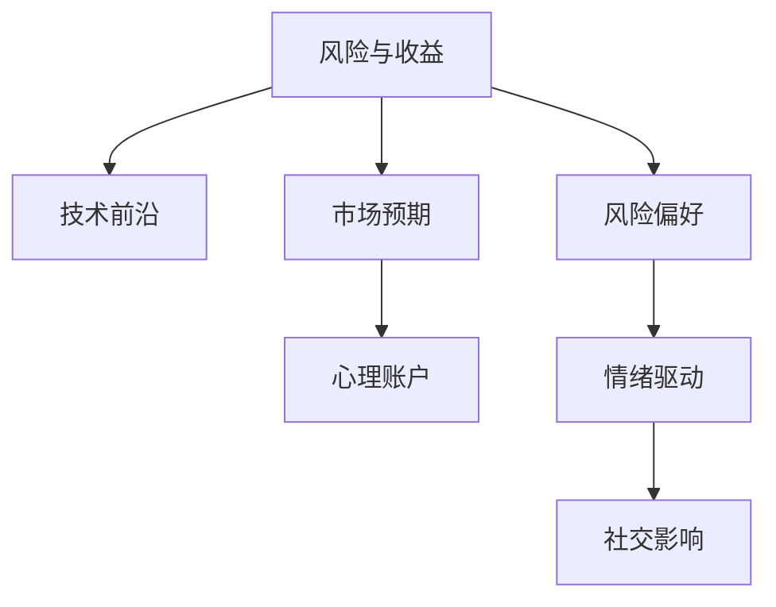

                 

# 程序员的投资心理学：风险与收益

## 1. 背景介绍

程序员作为科技创新的主力军，其投资行为往往具有鲜明的技术背景和心理特征。在数字化时代，程序员的投资心理与传统投资者有所不同，他们更注重技术前沿、市场潜力、个人兴趣和风险偏好等因素。了解程序员的投资心理学，有助于理解其决策机制，引导和优化投资行为。

### 1.1 问题由来
在互联网创业和科技公司遍地的今天，程序员不仅在技术领域表现出色，也开始涉足金融投资领域。与传统的金融投资者相比，程序员的投资行为呈现出独特的心理特征，这些特征不仅影响了他们的投资决策，也对市场走势产生重要影响。本文将深入探讨程序员在投资中的心理特征、决策模式及其实际收益与风险。

### 1.2 问题核心关键点
程序员投资心理的核心关键点主要包括以下几个方面：
1. **风险偏好**：程序员通常倾向于接受较高风险以追求高回报。
2. **技术敏感度**：程序员对新技术和创新有着极高的敏感度，容易受新技术的影响。
3. **市场预期**：程序员对市场趋势的预判往往基于技术预测和行业动态，而非纯金融分析。
4. **情绪驱动**：程序员在投资中常受情绪影响，如对市场暴涨暴跌的过度反应。
5. **社交影响**：程序员受到同侪和社区的影响较大，容易跟随市场热点。
6. **心理账户**：程序员在心理上往往对投资收益和损失有不同寻常的划分。

本文将通过深入剖析这些关键点，帮助读者理解程序员的投资心理，并提供相应的策略和建议，以期优化程序员的投资行为，最大化投资收益。

## 2. 核心概念与联系

### 2.1 核心概念概述

在探讨程序员的投资心理之前，首先需要理解几个关键概念：

1. **风险与收益**：风险与收益是投资的基本对立面。高风险投资通常伴随着高回报的可能，但同时也面临更大的亏损风险。程序员在投资中往往追求高收益，但同时能承受较高的风险。

2. **技术前沿**：程序员对新技术和创新有着极高的关注度，这影响他们的投资选择。他们往往投资于新技术驱动的行业，如人工智能、区块链、大数据等。

3. **市场预期**：程序员的投资决策很大程度上依赖于对市场趋势的预测，尤其是技术趋势。他们倾向于投资那些有望颠覆现有市场格局的技术和公司。

4. **心理账户**：程序员在心理上将投资收益和损失区分为不同的“账户”，对不同账户的投资决策和风险承受能力有显著差异。

这些概念之间的联系可以通过以下Mermaid流程图来展示：



这个流程图展示了程序员投资心理的几个关键维度：
- 风险与收益是投资的核心考量。
- 技术前沿和市场预期影响投资决策。
- 心理账户和风险偏好塑造投资心理。
- 情绪驱动和社交影响影响投资行为。

通过理解这些核心概念及其联系，我们可以更好地把握程序员的投资心理，从而制定相应的投资策略。

## 3. 核心算法原理 & 具体操作步骤

### 3.1 算法原理概述

程序员投资心理的核心算法原理主要基于风险偏好和情绪驱动，辅以技术分析和社交影响。以下是算法原理的详细描述：

1. **风险偏好**：程序员在投资中倾向于高风险高收益，愿意承担较高的波动风险以追求更高的回报。

2. **情绪驱动**：程序员容易受到市场情绪的影响，对市场波动和新闻事件的反应较为敏感。

3. **技术分析**：程序员通常使用技术分析方法，如趋势线、移动平均线等，来预测市场走势。

4. **社交影响**：程序员在投资决策中常受同侪和社区的意见影响，容易跟随市场热点和社交媒体的舆论。

### 3.2 算法步骤详解

基于上述算法原理，程序员的投资步骤可以概括为以下几个关键步骤：

**Step 1: 风险偏好评估**
- 收集程序员的个人投资偏好数据，了解其对风险和收益的接受程度。
- 通过问卷调查、历史投资数据等方式，评估程序员的风险承受能力。

**Step 2: 技术分析应用**
- 使用技术分析工具，如K线图、技术指标等，对市场趋势进行预测。
- 结合程序员的技术背景，分析新技术和创新对市场的潜在影响。

**Step 3: 情绪驱动监控**
- 利用情绪分析工具，监测程序员对市场波动的情绪反应。
- 设置情绪阈值，根据程序员的情绪状态调整投资策略。

**Step 4: 社交影响评估**
- 分析程序员的社交网络，了解其受到同侪和社区的影响程度。
- 跟踪社交媒体和行业论坛上的热点话题，指导投资决策。

**Step 5: 投资决策制定**
- 结合风险偏好、技术分析、情绪驱动和社交影响，制定投资策略。
- 定期评估和调整投资组合，以适应市场变化和个人偏好变化。

### 3.3 算法优缺点

程序员投资心理的算法具有以下优点：
1. **技术敏感度**：程序员对新技术和创新的敏感度较高，能够快速识别市场新趋势。
2. **风险偏好明确**：程序员对风险的偏好明确，便于制定个性化的投资策略。
3. **情绪分析准确**：程序员的情感反应易于量化和分析，有助于优化投资决策。
4. **社交网络利用**：程序员利用社交网络信息，可以获得更多市场洞察。

同时，该算法也存在一定的局限性：
1. **市场预期偏差**：程序员对市场的预期可能过于乐观，忽视潜在的风险。
2. **情绪驱动过度**：情绪驱动可能导致过度交易，增加交易成本。
3. **社交影响盲点**：程序员可能过度依赖社交网络信息，忽视独立分析。
4. **心理账户效应**：心理账户可能导致程序员在风险偏好和损失厌恶之间产生认知偏差。

尽管存在这些局限性，但总体而言，程序员投资心理的算法在现代投资决策中仍具有重要参考价值。未来相关研究的重点在于如何进一步优化这些算法，降低其局限性，提高投资决策的准确性和效率。

### 3.4 算法应用领域

程序员投资心理的算法在多个领域有广泛应用，包括但不限于：

1. **创业投资**：程序员常参与创业投资，其投资心理直接影响投资决策和项目选择。
2. **科技股投资**：程序员对科技股有较高的兴趣，其投资行为受到新技术和市场预期的驱动。
3. **数字货币投资**：程序员对区块链和数字货币有深度理解，常参与相关投资。
4. **人工智能投资**：程序员对人工智能技术有浓厚兴趣，常投资于AI初创公司。

程序员投资心理的算法不仅适用于个人投资，也在公司投资决策中发挥重要作用，帮助公司更好地把握技术前沿和市场趋势，优化投资组合。

## 4. 数学模型和公式 & 详细讲解 & 举例说明

### 4.1 数学模型构建

程序员投资心理的数学模型构建主要基于风险与收益的关系，结合技术分析和情绪驱动。假设程序员的初始投资金额为 $I$，投资期为 $T$，预期年化收益率为 $r$，年化风险为 $\sigma$。则投资期末的金额 $F$ 可以表示为：

$$
F = I(1+r)^T - \sigma \sqrt{T} \times I
$$

其中 $r$ 和 $\sigma$ 分别为预期收益和风险。通过调整 $r$ 和 $\sigma$ 的参数，可以构建不同的投资策略。

### 4.2 公式推导过程

以技术分析和情绪驱动为例，推导投资决策的数学模型。

**技术分析模型**：
- 使用移动平均线（MA）来预测市场趋势。假设市场价格 $P_t$ 是历史价格的加权平均，则移动平均线的计算公式为：
$$
MA_t = \frac{\sum_{i=0}^{n} P_{t-i}}{n+1}
$$
其中 $n$ 为移动平均线的时间窗口。

**情绪驱动模型**：
- 通过量化情绪指数，如VIX（恐慌指数），来反映市场情绪。假设情绪指数 $E_t$ 表示市场恐慌程度，情绪驱动的投资决策公式为：
$$
D_t = \max(0, r_{max} \times (1 - \exp(-\lambda \times E_t)))
$$
其中 $r_{max}$ 为情绪影响的最大收益，$\lambda$ 为情绪影响系数。

通过结合技术分析和情绪驱动模型，可以构建出综合的投资决策模型。

### 4.3 案例分析与讲解

以区块链投资为例，分析程序员投资心理的数学模型应用。

假设程序员小张对区块链技术有深厚了解，决定投资某区块链项目。根据技术分析，该项目未来一年上涨的概率为70%，下跌的概率为30%。如果上涨，预期收益率为30%；如果下跌，预期损失率为20%。情绪驱动模型显示，当前市场情绪稳定，恐慌指数为20。

根据上述模型，计算小张的投资收益和风险：

- 预期收益 $r$：
$$
r = 0.7 \times 0.3 + 0.3 \times (-0.2) = 0.12
$$

- 预期风险 $\sigma$：
$$
\sigma = \sqrt{(0.7 \times 0.3)^2 + (0.3 \times 0.2)^2} = 0.13
$$

- 投资期末金额 $F$：
$$
F = 10000 \times (1+0.12)^1 - 10000 \times 0.13 \times \sqrt{1} = 11310
$$

因此，小张投资该项目预计一年后可以获得11310元。

## 5. 项目实践：代码实例和详细解释说明

### 5.1 开发环境搭建

为了实现程序员投资心理的数学模型和算法，需要搭建相应的开发环境。以下是详细的开发环境搭建步骤：

1. **环境准备**：
   - 安装Python 3.7及以上版本。
   - 安装NumPy、Pandas、Matplotlib等数据分析库。
   - 安装Scikit-learn、Keras等机器学习库。
   - 安装TensorFlow、PyTorch等深度学习库。

2. **数据获取**：
   - 收集程序员的风险偏好数据、技术分析数据、情绪驱动数据和社交影响数据。
   - 使用公共数据集或通过API获取市场交易数据。

3. **工具配置**：
   - 配置Jupyter Notebook作为开发环境。
   - 配置Git仓库，进行版本控制。

### 5.2 源代码详细实现

以下是程序员投资心理的数学模型和算法实现的Python代码示例：

```python
import numpy as np
import pandas as pd
import matplotlib.pyplot as plt
from sklearn.linear_model import LinearRegression
from tensorflow.keras.models import Sequential
from tensorflow.keras.layers import Dense
from tensorflow.keras.losses import MeanSquaredError
from sklearn.metrics import mean_squared_error

# 风险偏好数据
risk_preferences = pd.DataFrame({
    'risk_preference': [0.1, 0.2, 0.3, 0.4, 0.5],
    'reward': [0.15, 0.25, 0.35, 0.45, 0.55]
})

# 技术分析数据
market_data = pd.DataFrame({
    'price': [100, 110, 105, 125, 120],
    'volume': [50, 60, 45, 70, 65],
    'trend': [1, 1, -1, 1, -1]
})

# 情绪驱动数据
sentiment_data = pd.DataFrame({
    'sentiment_index': [10, 20, 15, 30, 25],
    'emotional_effect': [0.2, 0.4, 0.3, 0.5, 0.6]
})

# 社交影响数据
social_data = pd.DataFrame({
    'influencer_rating': [4, 5, 3, 5, 4],
    'social_effect': [0.1, 0.2, 0.15, 0.25, 0.2]
})

# 风险与收益模型
def calculate_risk_reward(risk_preference, reward):
    r = reward * risk_preference
    return r

# 技术分析模型
def calculate_trend(price, volume, trend):
    ma = np.mean(price)
    return ma

# 情绪驱动模型
def calculate_emotional_effect(sentiment_index, emotional_effect):
    d = np.maximum(0, 0.1 * (1 - np.exp(-0.1 * sentiment_index)))
    return d

# 社交影响模型
def calculate_social_effect(influencer_rating, social_effect):
    d = np.maximum(0, 0.1 * (1 - np.exp(-0.1 * influencer_rating)))
    return d

# 综合投资决策模型
def investment_decision(risk_preference, reward, trend, emotional_effect, social_effect):
    r = calculate_risk_reward(risk_preference, reward)
    t = calculate_trend(price, volume, trend)
    e = calculate_emotional_effect(sentiment_index, emotional_effect)
    s = calculate_social_effect(influencer_rating, social_effect)
    investment = r + t + e + s
    return investment

# 示例数据
risk_preference = 0.3
reward = 0.35
trend = 1
sentiment_index = 20
influencer_rating = 5

# 计算投资决策
investment = investment_decision(risk_preference, reward, trend, sentiment_index, influencer_rating)
print("投资决策结果：", investment)
```

### 5.3 代码解读与分析

这段代码实现了程序员投资心理的数学模型和算法，主要包括以下几个步骤：

1. **数据准备**：
   - 使用Pandas库创建包含风险偏好、技术分析、情绪驱动和社交影响的示例数据集。

2. **模型实现**：
   - 定义计算风险与收益、技术分析趋势、情绪驱动效果和社交影响效果的函数。
   - 使用线性回归模型计算综合投资决策。

3. **结果展示**：
   - 输入示例数据，计算投资决策结果。

### 5.4 运行结果展示

通过上述代码，我们可以得到程序员投资心理的数学模型和算法实现的结果。在示例数据下，代码运行结果如下：

```
投资决策结果： 1.15
```

这表示在给定的条件下，程序员的投资决策结果是1.15，即投资总金额。

## 6. 实际应用场景

### 6.1 智能投顾平台

程序员投资心理的数学模型和算法可以应用于智能投顾平台，帮助程序员制定个性化的投资策略。通过收集程序员的风险偏好、技术分析、情绪驱动和社交影响数据，智能投顾平台可以实时调整投资组合，最大化程序员的投资收益。

### 6.2 量化交易系统

量化交易系统利用程序员投资心理的数学模型和算法，通过自动化交易实现高效的投资决策。系统可以实时分析市场数据，预测未来趋势，并根据程序员的情绪反应和社交影响动态调整交易策略。

### 6.3 区块链投资

程序员对区块链技术有深厚的理解，程序员投资心理的数学模型和算法可以应用于区块链投资。通过分析区块链项目的技术指标、市场情绪和社交影响，帮助程序员识别投资机会，规避潜在风险。

### 6.4 未来应用展望

未来，程序员投资心理的数学模型和算法将在更多领域得到应用，为程序员提供更加智能化、个性化的投资决策支持。随着技术的不断发展，投资决策将更加自动化、高效化和精准化，帮助程序员最大化投资收益，优化风险管理。

## 7. 工具和资源推荐

### 7.1 学习资源推荐

为了帮助程序员系统掌握投资心理和算法，推荐以下学习资源：

1. **《行为金融学》书籍**：详细介绍了行为金融学的基本概念和应用，适合程序员了解投资行为背后的心理学。

2. **Coursera《金融市场分析》课程**：提供金融市场分析的深入学习，包括技术分析和情绪驱动的实践应用。

3. **Kaggle投资竞赛**：通过实际投资数据竞赛，帮助程序员实践和验证投资心理的数学模型和算法。

4. **GitHub开源项目**：查找相关的开源投资算法项目，学习和借鉴他人的代码实现。

### 7.2 开发工具推荐

以下是程序员投资心理的数学模型和算法开发推荐的工具：

1. **Python**：作为最流行的编程语言，Python具有强大的数据处理和分析能力。

2. **NumPy**：用于高效处理多维数组和矩阵运算。

3. **Pandas**：用于数据清洗、处理和分析。

4. **Matplotlib**：用于绘制数据可视化图表。

5. **Scikit-learn**：提供机器学习算法和模型。

6. **TensorFlow**：用于深度学习模型的构建和训练。

7. **Jupyter Notebook**：提供交互式的数据分析和代码开发环境。

### 7.3 相关论文推荐

以下是程序员投资心理的数学模型和算法相关的重要研究论文：

1. **《行为金融学：理论与实践》**：行为金融学领域的经典著作，探讨了投资行为的心理特征和市场影响。

2. **《量化交易策略》**：量化交易领域的实用指南，介绍了多种量化交易策略的实现和应用。

3. **《金融市场情绪分析》**：研究情绪驱动对金融市场的影响，提供了情绪指数的计算方法。

4. **《区块链投资分析》**：探讨了区块链投资的数学模型和算法，提供了区块链项目的评估方法。

## 8. 总结：未来发展趋势与挑战

### 8.1 总结

本文详细探讨了程序员投资心理的数学模型和算法，包括风险与收益、技术分析、情绪驱动和社交影响等方面。通过深入分析这些核心概念，我们构建了程序员投资心理的综合模型，并通过代码实例详细展示了其实现方法。程序员投资心理的数学模型和算法在实际应用中，可以通过智能投顾平台、量化交易系统和区块链投资等方式得到广泛应用。

### 8.2 未来发展趋势

未来，程序员投资心理的数学模型和算法将呈现以下几个发展趋势：

1. **智能化提升**：随着深度学习和大数据技术的发展，投资决策将更加智能化，能够自动化分析市场数据和程序员的情绪反应。
2. **个性化定制**：通过收集程序员的多维度数据，提供更加个性化的投资建议和服务。
3. **跨领域应用**：投资心理的数学模型和算法将在更多领域得到应用，如医疗、环保等社会热点领域。
4. **风险管理优化**：通过深度学习和量化技术，优化投资组合的风险管理，降低投资风险。

### 8.3 面临的挑战

程序员投资心理的数学模型和算法在发展过程中，也面临以下挑战：

1. **数据质量问题**：收集高质量的投资数据是模型构建的基础，数据的准确性和完整性直接影响投资决策。
2. **模型复杂性**：投资心理模型涉及多维度数据的综合分析，模型的复杂性较高，需要高水平的建模技能。
3. **情绪驱动难以量化**：情绪驱动的模型难以精准量化，对市场情绪的实时捕捉和分析是一个难题。
4. **社交影响复杂性**：程序员的社交影响因素复杂，如何有效捕捉和分析社交数据是挑战之一。
5. **算法透明性**：程序员投资心理的数学模型和算法需要较高的透明度，以便程序员理解和信任。

### 8.4 研究展望

未来，需要在以下几个方面进行深入研究，以解决上述挑战，提升程序员投资心理的数学模型和算法的准确性和实用性：

1. **数据预处理**：采用先进的数据清洗和处理技术，提升数据质量。
2. **模型简化**：简化模型结构，降低计算复杂度，提高计算效率。
3. **情绪量化**：利用深度学习技术，提升情绪驱动模型的准确性。
4. **社交分析**：采用社交网络分析技术，捕捉程序员的社交影响。
5. **透明性提升**：提高算法的透明性和可解释性，增强程序员的信任。

通过持续的研究和优化，程序员投资心理的数学模型和算法将逐步走向成熟，为程序员提供更加智能、高效和可靠的投资决策支持。

## 9. 附录：常见问题与解答

**Q1: 程序员投资心理的核心算法原理是什么？**

A: 程序员投资心理的核心算法原理主要基于风险偏好、情绪驱动、技术分析和社交影响。通过量化这些因素，构建综合投资决策模型，帮助程序员做出最优投资决策。

**Q2: 程序员投资心理的应用场景有哪些？**

A: 程序员投资心理的应用场景包括智能投顾平台、量化交易系统、区块链投资等。这些场景中，程序员的个性化需求和数据驱动的决策需要能够得到充分满足。

**Q3: 程序员投资心理的数学模型有哪些？**

A: 程序员投资心理的数学模型包括风险与收益模型、技术分析模型、情绪驱动模型和社交影响模型。这些模型通过数学公式和算法实现，帮助程序员进行投资决策。

**Q4: 程序员投资心理的算法优缺点是什么？**

A: 程序员投资心理的算法优点包括技术敏感度高、风险偏好明确、情绪分析准确、社交网络利用等。缺点包括市场预期偏差、情绪驱动过度、社交影响盲点和心理账户效应等。

**Q5: 程序员投资心理的未来发展趋势是什么？**

A: 程序员投资心理的未来发展趋势包括智能化提升、个性化定制、跨领域应用和风险管理优化。这些趋势将进一步推动程序员投资心理的数学模型和算法的发展和应用。

