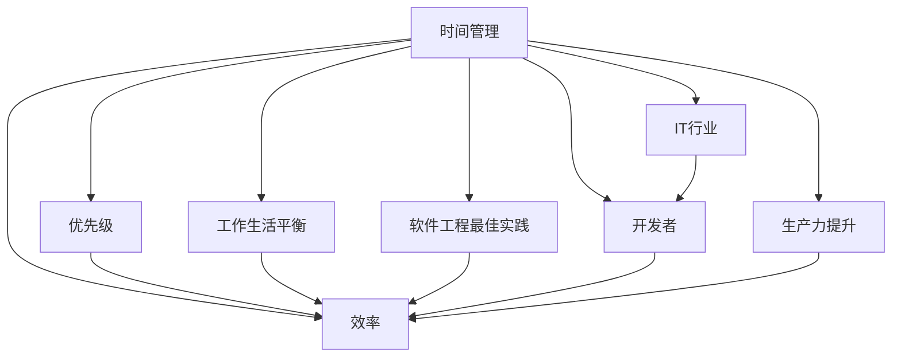

                 

# 程序员的时间管理：效率即财富

> 关键词：时间管理,效率提升,优先级管理,工作生活平衡,软件工程最佳实践,IT行业,开发者,生产力提升

## 1. 背景介绍

### 1.1 问题由来
在快节奏的IT行业中，程序员面临着前所未有的压力。项目工期紧、需求变更频繁、新技术迭代快，都要求程序员不断提升自己的效率，在有限的时间内产出更多的成果。然而，高强度的工作节奏也导致了职业倦怠、生活失衡等问题的出现。

如何在这紧张而高压的环境中，高效地管理时间，提升个人和团队的生产力，成为每个程序员必须面对和解决的重要问题。而时间管理，正是解决这一问题的关键。

### 1.2 问题核心关键点
时间管理的核心在于如何在有限的时间内，优先处理重要且紧急的任务，合理分配时间资源，提升工作效率。在IT行业中，时间管理的挑战尤为突出，程序员需要具备明确的目标导向、良好的优先级判断、高效的任务处理能力，以及持续的学习和自我调整能力。

### 1.3 问题研究意义
对程序员进行时间管理的研究，不仅能够帮助其提升工作效率，减少加班时间，还能在整体上提升项目的质量和进度，为企业的长期发展奠定坚实基础。同时，良好的时间管理也有助于改善程序员的工作生活平衡，减少职业倦怠，提升整体的心理健康水平。

## 2. 核心概念与联系

### 2.1 核心概念概述

为更好地理解时间管理在程序员日常工作中的应用，本节将介绍几个关键概念：

- **时间管理(Time Management)**：通过设定目标、优先级、计划、评估等手段，合理分配和利用时间，提升个人和团队的生产力。

- **效率(Efficiency)**：指单位时间内完成任务的数量和质量，是时间管理的直接目标。

- **优先级(Priority)**：根据任务的重要性和紧急程度，确定任务处理的先后顺序。

- **工作生活平衡(Work-Life Balance)**：合理安排工作与生活的比例，以保持身心健康和职业幸福感。

- **软件工程最佳实践(Best Practices in Software Engineering)**：一系列经过实践验证的编程、测试、部署等过程的通用规范和标准。

- **IT行业(IT Industry)**：以计算机技术为基础，涉及软件开发、硬件制造、互联网服务等领域的产业集群。

- **开发者(Developers)**：从事软件开发、系统维护、项目管理等工作的专业技术人员。

- **生产力提升(Productivity Improvement)**：通过各种手段提升个人或团队的输出成果，提升工作质量。

这些核心概念之间的逻辑关系可以通过以下Mermaid流程图来展示：



这个流程图展示出时间管理与其他关键概念之间的紧密联系。时间管理不仅直接影响效率，还与优先级、工作生活平衡、软件工程最佳实践、IT行业、开发者和生产力提升等概念相互关联，共同构建起IT行业中高效工作的基石。

## 3. 核心算法原理 & 具体操作步骤
### 3.1 算法原理概述

程序员的时间管理，本质上是通过设定和管理任务来优化时间资源配置的过程。核心算法原理包括任务设定、优先级排序、时间块分配、任务执行与评估等步骤。其目标是最大化任务完成的质量和数量，同时保持健康的工作生活平衡。

### 3.2 算法步骤详解

基于时间管理理论，程序员的时间管理过程通常包括以下几个关键步骤：

**Step 1: 设定明确的目标**
- 确定长期和短期的职业目标，如提升技术能力、完成特定项目、优化代码质量等。
- 将大目标拆分为具体的、可衡量的、可实现的小任务。

**Step 2: 评估任务的优先级**
- 根据任务的重要性和紧急程度，使用四象限法（重要-紧急矩阵）将任务划分为四类：重要且紧急、重要但不紧急、紧急但不重要、既不紧急也不重要。
- 优先处理重要且紧急的任务，合理安排重要但不紧急的任务，减少或避免紧急但不重要和既不紧急也不重要的任务。

**Step 3: 制定详细计划**
- 根据任务的优先级，合理分配每日和每周的时间块，确保重要任务得到充分处理。
- 使用日历和任务管理工具（如Google Calendar、Trello等）辅助规划和管理。

**Step 4: 执行任务并监控进度**
- 按照计划执行任务，保持专注，避免分心。
- 使用番茄工作法、Pomodoro技术等时间管理技巧，提高工作效率。
- 定期检查任务进度，调整计划以应对突发情况。

**Step 5: 定期评估和调整**
- 定期评估目标和任务的完成情况，对比实际与预期，总结经验教训。
- 根据评估结果，调整未来的时间管理策略。

### 3.3 算法优缺点

时间管理方法在提升程序员效率方面具有显著优势：
1. **提高工作效率**：通过明确的目标和优先级，合理分配时间，使得每分钟都用在高效的任务上。
2. **减少加班**：合理安排任务和休息时间，避免过度加班和职业倦怠。
3. **提升工作质量**：在重要任务上投入更多时间，确保代码质量和技术深度。
4. **促进团队协作**：统一的时间管理标准，有助于团队协作和进度控制。

然而，这种方法也存在一些局限性：
1. **难以应对突发情况**：预定的计划可能会因为突发任务打乱，需要灵活调整。
2. **需花费较多时间规划和调整**：特别是在任务变化频繁的团队项目中，时间管理需要频繁的评估和调整。
3. **需要较强的自律性**：时间和任务管理效果很大程度上依赖于个人自律性，难以完全依赖于外部工具。
4. **可能影响工作生活平衡**：过于严格的时间管理可能会导致工作与生活过度割裂，影响身心健康。

尽管存在这些局限性，时间管理方法仍然是大规模提升程序员效率和团队协作的关键手段。未来相关研究的重点在于如何进一步提高时间管理的灵活性和适应性，同时兼顾工作与生活的平衡。

### 3.4 算法应用领域

时间管理方法广泛应用于各种软件开发和IT项目管理场景，具体应用领域包括：

- **软件开发**：在代码编写、调试、测试等各个环节，合理分配时间和精力，确保高质量输出。
- **项目管理**：协调团队成员的任务分配和时间管理，确保项目按时交付。
- **敏捷开发**：通过每日站会、Sprint计划等敏捷方法，实时调整任务优先级和时间安排。
- **持续集成与持续部署(CI/CD)**：通过自动化工具和流程优化，减少人工时间消耗，提升开发效率。
- **知识管理**：合理安排学习时间和资源，不断提升个人技术能力。

除了软件开发，时间管理方法在IT行业的其他领域也得到了广泛应用，如系统维护、网络安全、数据分析等，助力企业和个人提升整体生产力。

## 4. 数学模型和公式 & 详细讲解 & 举例说明（备注：数学公式请使用latex格式，latex嵌入文中独立段落使用 $$，段落内使用 $)
### 4.1 数学模型构建

本节将使用数学语言对程序员时间管理的过程进行更加严格的刻画。

假设程序员每日工作时间为 $T$ 小时，总任务数为 $N$。根据四象限法，设四类任务的完成时间分别为 $t_1, t_2, t_3, t_4$。则总任务完成时间 $T_{total}$ 可以表示为：

$$
T_{total} = t_1 + t_2 + t_3 + t_4
$$

目标是最小化总时间 $T_{total}$，同时满足以下约束条件：
- $t_1 + t_2 + t_3 + t_4 = T$
- $t_1, t_2, t_3, t_4 \geq 0$

### 4.2 公式推导过程

为了最小化总时间 $T_{total}$，需要使用优化算法求解上述线性规划问题。这里使用简单的时间块分配策略，设每日时间块分配比例为 $a_1, a_2, a_3, a_4$，则有：

$$
a_1 = \frac{t_1}{T}, a_2 = \frac{t_2}{T}, a_3 = \frac{t_3}{T}, a_4 = \frac{t_4}{T}
$$

目标函数转化为对比例系数 $a_i$ 的优化，即最小化：

$$
\sum_{i=1}^4 a_i
$$

约束条件变为：

$$
\sum_{i=1}^4 a_i = 1, a_i \geq 0
$$

这是一个典型的线性规划问题，可以通过单纯形法、内点法等求解。以单纯形法为例，建立初始可行解 $b_0$：

$$
b_0 = (0, 0, 0, 1)
$$

计算其目标函数值：

$$
f_0 = \sum_{i=1}^4 b_{0,i}
$$

求解对应基变量 $c_i$ 的值：

$$
c_i = \frac{b_{0,i}}{a_i}
$$

计算对应检验变量 $d_i$ 的值：

$$
d_i = c_i - 1
$$

求解原问题中的松弛变量 $s$ 和增广矩阵 $A$：

$$
s = \sum_{i=1}^4 c_i
$$

$$
A = \begin{pmatrix}
1 & 0 & 0 & -1 \\
0 & 1 & 0 & -1 \\
0 & 0 & 1 & -1 \\
1 & 1 & 1 & -1
\end{pmatrix}
$$

求解最优基 $B$ 和最优解 $x$：

$$
B = \begin{pmatrix}
1 & 0 & 0 & 0 \\
0 & 1 & 0 & 0 \\
0 & 0 & 1 & 0 \\
0 & 0 & 0 & 1
\end{pmatrix}
$$

$$
x = \begin{pmatrix}
t_1 \\
t_2 \\
t_3 \\
t_4
\end{pmatrix}
$$

最终得到最优解 $x$ 和目标函数值 $f_{opt}$，其中 $f_{opt}$ 即为最小化总时间 $T_{total}$ 的值。

### 4.3 案例分析与讲解

以下我们以软件开发项目为例，展示时间管理模型的应用：

假设某软件开发项目包含以下四类任务：需求分析（A）、代码编写（B）、测试（C）和部署（D）。每个任务需要的时间分别为 30小时、40小时、10小时和20小时。

**Step 1: 设定目标**

项目目标是在 10 天内完成所有开发任务，确保代码质量和系统稳定性。

**Step 2: 评估优先级**

使用四象限法评估任务优先级：

| 任务 | 重要性 | 紧急程度 | 优先级 |
| --- | --- | --- | --- |
| 需求分析 | 高 | 高 | 重要且紧急 |
| 代码编写 | 高 | 高 | 重要且紧急 |
| 测试 | 中 | 中 | 重要但不紧急 |
| 部署 | 低 | 高 | 紧急但不重要 |

**Step 3: 制定计划**

根据优先级，安排每日和每周的时间块分配比例：

- 需求分析：$0.2, 0.2, 0.2, 0.4$
- 代码编写：$0.3, 0.3, 0.3, 0.1$
- 测试：$0.1, 0.1, 0.1, 0.7$
- 部署：$0.1, 0.1, 0.1, 0.7$

**Step 4: 执行任务**

按照计划执行任务，使用番茄工作法（Pomodoro Technique），每个番茄时间（25分钟）后休息5分钟，避免过度疲劳。

**Step 5: 定期评估**

每天结束时，总结当天任务完成情况，调整明天计划。每周结束时，总结一周进展，评估项目进度和问题，调整总体计划。

通过上述步骤，可以在确保任务按时完成的同时，合理分配时间资源，提升效率，减少加班，实现工作与生活的平衡。

## 5. 项目实践：代码实例和详细解释说明
### 5.1 开发环境搭建

在进行时间管理实践前，我们需要准备好开发环境。以下是使用Python进行时间管理开发的常见环境配置流程：

1. 安装Anaconda：从官网下载并安装Anaconda，用于创建独立的Python环境。

2. 创建并激活虚拟环境：
```bash
conda create -n time-management python=3.8 
conda activate time-management
```

3. 安装必要的Python包：
```bash
pip install numpy pandas matplotlib datetime schedule joblib jupyter notebook
```

4. 安装可视化工具：
```bash
pip install matplotlib
```

5. 搭建可视化界面：
```bash
jupyter lab
```

完成上述步骤后，即可在`time-management`环境中开始时间管理实践。

### 5.2 源代码详细实现

下面我们以一个简单的示例程序，展示如何使用Python进行时间管理：

```python
import numpy as np
import matplotlib.pyplot as plt
import pandas as pd
from datetime import datetime

# 定义任务和工作时间
tasks = {'需求分析': 30, '代码编写': 40, '测试': 10, '部署': 20}
work_hours_per_day = 8
days_per_week = 5

# 计算每日和每周任务完成比例
daily_percentage = np.zeros(len(tasks))
weekly_percentage = np.zeros(len(tasks))
for i, task in enumerate(tasks):
    daily_percentage[i] = tasks[task] / work_hours_per_day
    weekly_percentage[i] = tasks[task] / (work_hours_per_day * days_per_week)

# 可视化任务完成比例
plt.figure(figsize=(10, 5))
plt.bar(range(len(tasks)), daily_percentage, label='每日完成比例')
plt.bar(range(len(tasks)), weekly_percentage, bottom=daily_percentage, label='每周完成比例')
plt.legend()
plt.xlabel('任务')
plt.ylabel('完成比例')
plt.title('任务完成比例')
plt.show()

# 假设某天的任务完成情况
actual_hours = {'需求分析': 3, '代码编写': 4, '测试': 1, '部署': 2}

# 计算超额完成和未完成的任务
overachieved = {task: val - daily_percentage[i] for i, task in enumerate(tasks) if val > daily_percentage[i]}
underachieved = {task: daily_percentage[i] - val for i, task in enumerate(tasks) if val < daily_percentage[i]}

# 输出超额和未完成任务
print("超额完成的任务:", overachieved)
print("未完成的任务:", underachieved)
```

在上述代码中，我们首先定义了任务和每天的工作时间，然后计算了每日和每周的任务完成比例。通过可视化工具，我们可以看到每个任务在每日和每周的完成情况。最后，根据某天的实际工作情况，计算了超额完成和未完成任务，输出了具体的任务完成情况。

### 5.3 代码解读与分析

让我们再详细解读一下关键代码的实现细节：

**每日和每周任务完成比例的计算**：
- 使用Numpy库，通过循环遍历任务字典，计算每个任务的每日和每周完成比例。
- 每日完成比例为任务完成时间除以每日工作小时数。
- 每周完成比例为任务完成时间除以每日工作小时数乘以每周工作天数。

**可视化任务完成比例**：
- 使用Matplotlib库，创建条形图，将每日和每周的任务完成比例可视化。
- 通过设置bottom参数，将每日完成比例叠加在每周完成比例上。
- 使用图例、坐标轴标签和标题，增强图形的可读性。

**超额完成和未完成任务的计算**：
- 根据实际工作时间，计算超额完成和未完成任务。
- 通过字典表示法，输出具体的任务完成情况。

可以看到，Python语言在数据处理和可视化方面具有强大的能力，能够快速帮助我们理解时间管理的实际效果，并提供实时的反馈和调整建议。

## 6. 实际应用场景
### 6.1 软件开发项目管理

时间管理在软件开发项目中具有重要应用。软件开发通常涉及多个人的协作和沟通，任务复杂，周期长。合理的时间管理可以帮助团队高效协同，确保项目按时交付。

在实践中，可以使用敏捷开发方法（如Scrum）进行任务拆分和优先级排序。每天站会确保团队成员同步进展，及时调整计划。使用时间管理工具（如JIRA、Trello）进行任务跟踪和进度监控，实时调整资源配置，提升整体开发效率。

### 6.2 敏捷开发和CI/CD

敏捷开发和持续集成与持续部署（CI/CD）方法，是提升软件开发效率的重要手段。通过每日站会、Sprint计划、自动化的CI/CD流程，可以实时监控代码变更和测试结果，避免瓶颈，提升交付速度。

在敏捷开发中，时间管理用于协调团队成员的任务分配和进度调整，确保每个Sprint目标的达成。在CI/CD中，时间管理用于优化自动化测试流程和部署周期，提升系统稳定性。

### 6.3 知识管理与自我提升

时间管理不仅用于工作任务，还可以用于个人知识管理和自我提升。通过设定学习目标、分配学习时间，可以有效提升个人技能和知识储备。

在实践中，可以使用时间块划分法，将每日固定时间段用于学习新知识或复习旧知识。使用时间管理工具记录学习进度和成果，定期总结经验教训，调整学习策略，提升学习效率。

### 6.4 未来应用展望

随着时间管理理论和实践的不断发展，未来的时间管理方法将更加灵活和智能化。以下展望将引领时间管理的未来趋势：

1. **智能时间管理工具**：结合AI和大数据技术，实现个性化时间管理，动态调整任务优先级和资源分配。
2. **时间管理的自动化和智能化**：利用机器学习算法，自动分析任务复杂度和紧急程度，推荐最优的时间管理方案。
3. **跨领域时间管理方法**：结合不同领域（如金融、医疗、教育等）的特点，开发通用且高效的时间管理模型。
4. **多模态时间管理**：结合时间、空间、任务等多种维度，构建综合的时间管理模型，提升整体效率。
5. **持续学习和适应性**：通过持续学习和自我调整，适应外部环境的变化，提升时间管理的效果和灵活性。

以上趋势凸显了时间管理方法的广阔前景。这些方向的探索发展，将进一步提升IT行业的工作效率，帮助企业和个人实现更好的工作生活平衡。

## 7. 工具和资源推荐
### 7.1 学习资源推荐

为了帮助开发者系统掌握时间管理理论和技术，这里推荐一些优质的学习资源：

1. **《高效能人士的七个习惯》（Stephen R. Covey）**：经典时间管理著作，提供了一套系统的时间管理原则和实践方法，帮助读者建立高效的时间管理习惯。

2. **《Getting Things Done》（David Allen）**：提出了GTD（Getting Things Done）时间管理法，强调通过清单和任务分解，实现高效的任务处理。

3. **《番茄工作法图解》（Francesco Cirillo）**：介绍了番茄工作法（Pomodoro Technique），通过25分钟工作、5分钟休息的循环，提升专注力和工作效率。

4. **Coursera上的《时间管理与生产力课程》**：由MIT教授讲授，涵盖时间管理、任务优先级、工具选择等多个方面，适合系统学习。

5. **Udemy上的《高效工作时间管理》**：提供了一系列实用的时间管理技巧和工具，帮助学员提升工作效率。

通过对这些资源的学习实践，相信你一定能够快速掌握时间管理的方法，提升个人和团队的产出效率。

### 7.2 开发工具推荐

高效的开发离不开优秀的工具支持。以下是几款用于时间管理开发的常用工具：

1. **Trello**：强大的任务管理工具，通过看板（Kanban）方式，实时跟踪任务进展，支持多人协作。
2. **JIRA**：专业的项目管理工具，支持敏捷开发和Scrum管理，提供了丰富的报表和统计功能。
3. **Asana**：易于使用的任务管理工具，支持多任务同步和资源分配。
4. **RescueTime**：自动跟踪时间使用情况，提供详细的报表和分析，帮助用户优化时间分配。
5. **Todoist**：简单易用的任务管理工具，支持多平台同步和智能任务提示。

合理利用这些工具，可以显著提升时间管理的效果，降低手工操作的负担，提升整体工作效率。

### 7.3 相关论文推荐

时间管理理论和技术的发展源于学界的持续研究。以下是几篇经典论文，推荐阅读：

1. **《Time Management for Creative People》（Francesco Cirillo）**：介绍番茄工作法的起源和应用，强调时间管理的心理学基础。

2. **《The Eisenhower Matrix》**：提出四象限法，通过任务的重要性和紧急性，帮助用户合理分配时间和精力。

3. **《RescueTime: One Vision for Consistent Productivity Analysis》**：探讨自动化时间管理工具的应用，通过数据分析提升时间管理的效果。

4. **《Evolving from the Known to the Unknown》（Cynthia Rowley）**：讨论时间管理在敏捷开发和持续交付中的作用，强调动态调整和时间预测的重要性。

5. **《Managing Your Life: The Proceedings of the American Society for Management》**：汇总了时间管理领域的多项研究，提供了丰富的理论和方法。

这些论文代表了大时间管理技术的发展脉络。通过学习这些前沿成果，可以帮助研究者把握学科前进方向，激发更多的创新灵感。

## 8. 总结：未来发展趋势与挑战
### 8.1 总结

本文对程序员的时间管理进行了全面系统的介绍。首先阐述了时间管理的背景和意义，明确了时间管理在提升程序员效率、减少加班和职业倦怠方面的重要作用。其次，从原理到实践，详细讲解了时间管理的核心算法步骤，并提供了具体的时间管理代码实现。同时，本文还广泛探讨了时间管理方法在软件开发、敏捷开发、知识管理等多个领域的应用前景，展示了时间管理范式的广阔应用空间。此外，本文精选了时间管理技术的各类学习资源，力求为读者提供全方位的技术指引。

通过本文的系统梳理，可以看到，时间管理对于IT行业特别是程序员群体至关重要。科学合理的时间管理，不仅能够显著提升工作效率，还能在整体上提升项目的质量和进度，为企业的长期发展奠定坚实基础。同时，良好的时间管理也有助于改善程序员的工作生活平衡，减少职业倦怠，提升整体的心理健康水平。

### 8.2 未来发展趋势

展望未来，时间管理方法将呈现以下几个发展趋势：

1. **智能化和自动化**：结合AI和大数据技术，实现个性化的时间管理，动态调整任务优先级和资源分配。
2. **跨领域整合**：时间管理方法将与其他管理理论和方法（如项目管理、风险管理、质量管理等）深度整合，形成综合的管理框架。
3. **多模态管理**：结合时间、空间、任务等多种维度，构建综合的时间管理模型，提升整体效率。
4. **持续学习和适应性**：通过持续学习和自我调整，适应外部环境的变化，提升时间管理的效果和灵活性。

以上趋势凸显了时间管理方法的广阔前景。这些方向的探索发展，将进一步提升IT行业的工作效率，帮助企业和个人实现更好的工作生活平衡。

### 8.3 面临的挑战

尽管时间管理方法已经取得了显著成果，但在迈向更加智能化、普适化应用的过程中，它仍面临着诸多挑战：

1. **数据获取难度大**：时间管理需要大量的个人和工作数据，数据获取成本较高，且数据隐私保护问题需引起重视。
2. **模型泛化能力不足**：现有的时间管理模型往往依赖于特定的场景和数据，泛化能力有限，难以应对复杂多变的工作环境。
3. **模型训练成本高**：训练时间管理模型需要大量的计算资源，尤其是在实时优化和动态调整方面，计算成本较高。
4. **模型解释性不足**：时间管理模型通常难以解释其内部决策过程，用户难以理解模型的工作原理和优化机制。

尽管存在这些挑战，时间管理方法仍然是大规模提升程序员效率和团队协作的关键手段。未来相关研究的重点在于如何进一步降低时间管理的成本和复杂度，提高模型的解释性和实用性。

### 8.4 研究展望

面对时间管理面临的挑战，未来的研究需要在以下几个方面寻求新的突破：

1. **数据获取和隐私保护**：探索低成本的数据获取方法，同时保护个人和企业数据隐私。
2. **模型泛化能力的提升**：研究更加通用的时间管理模型，提升模型在多场景下的泛化能力。
3. **实时优化和动态调整**：结合实时数据和AI算法，实现高效的时间管理，动态调整任务优先级和资源配置。
4. **模型解释性增强**：引入可解释性技术，增强时间管理模型的透明性和可理解性。

这些研究方向的探索，将推动时间管理方法的不断进步，为IT行业带来更高效、智能、人性化的工作体验。面向未来，时间管理技术需要与更多先进技术融合，如AI、大数据、云计算等，共同推动自然语言理解和智能交互系统的进步。只有勇于创新、敢于突破，才能不断拓展时间管理的边界，让时间管理技术更好地服务于人类的生产和生活。

## 9. 附录：常见问题与解答
**Q1：时间管理是否适用于所有职业？**

A: 时间管理在所有职业中都具有广泛的适用性，特别是对于需要长时间工作、复杂任务和高绩效要求的工作环境。如IT行业、科学研究、医疗服务等，时间管理方法都能显著提升工作效率和产出质量。

**Q2：时间管理是否需要大量的规划和调整？**

A: 时间管理需要一定的初始规划和调整，特别是在任务变化频繁的项目中。但随着时间的积累和经验的提升，规划和调整的频率会逐渐减少。通过持续的学习和改进，时间管理方法能够逐步成为个人和团队的自动习惯。

**Q3：时间管理是否会过度限制个人自由？**

A: 时间管理并不意味着对个人自由的限制，而是通过合理的规划和优先级设置，帮助个人和团队实现更高的产出和更少的时间浪费。通过科学的时间管理，可以更好地平衡工作与生活，提升整体幸福感。

**Q4：时间管理是否需要坚持多年才能见效？**

A: 时间管理的效果往往会在短期内显现。坚持一段时间后，个人和团队的工作效率和产出质量会有显著提升。尽管时间管理的效益需要一定的坚持和调整，但通过科学的方法和工具，时间管理可以在短期内带来明显的改进。

**Q5：时间管理是否会影响团队协作？**

A: 时间管理在团队协作中具有重要意义。通过统一的时间管理标准和工具，可以提升团队的协调性和效率，减少沟通成本，确保项目按时交付。合理的时间管理能够促进团队成员的协作和同步，提升整体工作效率。

通过对这些问题的解答，可以看出时间管理方法在提升个人和团队效率方面的重要作用。只要合理应用，时间管理将为IT行业带来显著的产出效益，助力企业和个人实现更好的工作生活平衡。

