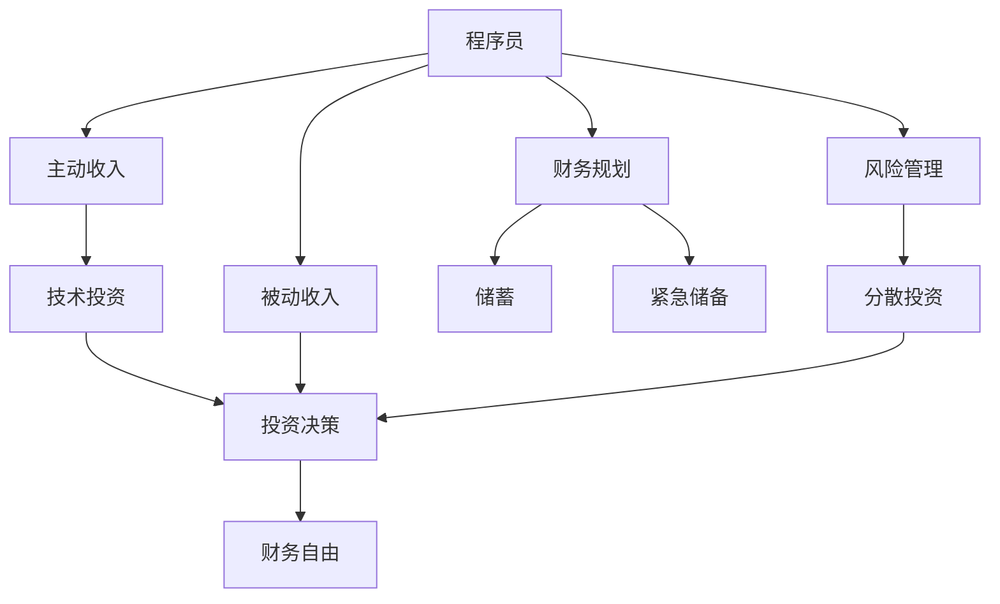

                 

# 程序员的财务自由：从省钱到赚钱的思维转变

在当今快速发展的技术世界里，程序员无疑是社会经济发展的重要力量。然而，尽管他们的工作富有挑战性和创造性，许多程序员仍然面临着财务自由的挑战。本文将深入探讨程序员实现财务自由的核心策略，从省钱到赚钱的思维转变，希望能为有志于实现财务自由的程序员们提供一些有价值的见解和建议。

## 1. 背景介绍

### 1.1 问题由来

程序员由于其技术含量高、需求量大，通常享有相对较高的薪酬待遇。然而，高昂的生活成本、长期的加班和职业发展的不确定性，使得许多程序员在追求经济自由的道路上步履维艰。传统的存钱、理财方式对于程序员来说往往难以应对复杂多变的技术市场和职业前景。因此，本文聚焦于一种新的思维模式——从省钱到赚钱的转变，通过技术手段实现财务自由的可持继性。

### 1.2 问题核心关键点

财务自由不仅是简单的储蓄和投资，更是一种基于技术和信息优势的长期战略。程序员实现财务自由的核心在于：

- **技术优势**：利用编程和数据分析技能优化个人财务管理和投资策略。
- **信息时代**：利用互联网和金融科技工具，把握市场动态，寻找最优投资机会。
- **多样化收入**：通过被动收入（如投资、写作、技术咨询）和主动收入（如软件开发、产品设计）的结合，构建多元化的收入来源。
- **长期规划**：制定长期财务规划，避免短期行为和投机心理，以稳健的方式实现财务目标。

## 2. 核心概念与联系

### 2.1 核心概念概述

为了更好地理解程序员如何从省钱到赚钱，我们首先需要理解以下核心概念：

- **财务自由**：个人或家庭的收入来源于主动或被动投资，而非依赖于受雇工作。
- **主动收入**：通过提供服务或销售产品获得的收入，如软件开发、技术咨询。
- **被动收入**：通过投资或资产获得的收入，如股票分红、租金、版税等。
- **技术投资**：利用编程技能和数据分析工具进行投资决策和风险管理，如自动化交易、量化投资、金融模型构建。
- **信息优势**：程序员通过技术手段获取市场信息，预测市场趋势，优化投资组合。

这些概念共同构成了程序员实现财务自由的基本框架，通过技术优势和信息优势，利用主动和被动收入的结合，可以构建可持续的财务自由之路。

### 2.2 核心概念原理和架构的 Mermaid 流程图



该流程图展示了程序员从主动收入到被动收入，再到财务自由的逻辑路径。通过技术投资和风险管理，主动收入可以转化为被动收入，结合财务规划和储蓄策略，最终实现财务自由。

## 3. 核心算法原理 & 具体操作步骤

### 3.1 算法原理概述

程序员实现财务自由的过程可以看作一种基于技术的投资策略。其核心在于利用编程技能和数据分析工具，构建一套科学、系统的投资方案，并通过持续的优化和调整，实现从省钱到赚钱的思维转变。

### 3.2 算法步骤详解

1. **数据收集与分析**：
   - 利用Python等编程语言，抓取和处理市场数据，如股票价格、债券收益率、货币汇率等。
   - 使用Pandas、NumPy等数据分析工具，进行数据清洗、特征工程和统计分析。

2. **投资模型构建**：
   - 根据市场数据和历史表现，使用机器学习或统计模型预测未来趋势，如线性回归、随机森林、神经网络等。
   - 利用回测工具（如Backtrader）评估模型的投资效果，并进行模型优化。

3. **风险管理和分散投资**：
   - 使用蒙特卡罗模拟等方法，评估投资组合的风险和收益。
   - 采用指数基金、ETF等多样化资产配置，降低单只股票的风险。

4. **自动化交易与执行**：
   - 编写自动化交易策略，使用Python编程语言和Alpaca、Interactive Brokers等交易API。
   - 定期监控市场动态，及时调整交易策略。

5. **持续学习和优化**：
   - 定期更新市场数据和模型，持续学习新的投资策略和金融知识。
   - 定期回测和评估投资组合的表现，进行必要的调整和优化。

### 3.3 算法优缺点

**优点**：
- 利用技术优势，能够精准把握市场趋势，优化投资组合。
- 通过自动化交易，降低人为操作错误，提高投资效率。
- 持续学习和优化，能够及时适应市场变化，保持竞争优势。

**缺点**：
- 技术门槛高，需要具备较强的编程和数据分析能力。
- 市场预测和模型构建需要较高的数据量和计算资源。
- 自动化交易可能导致过度交易，增加交易成本。

### 3.4 算法应用领域

程序员的财务自由策略可以应用于各类投资领域，如股票交易、债券投资、外汇交易、加密货币等。具体应用场景包括：

- **股票交易**：利用技术指标和机器学习模型，进行趋势分析和量化交易。
- **债券投资**：通过统计分析，选择高收益、低风险的债券进行投资。
- **外汇交易**：利用技术分析和自动化交易，在外汇市场上获取利润。
- **加密货币**：利用数据分析和算法交易，在加密货币市场进行套利和投资。

## 4. 数学模型和公式 & 详细讲解 & 举例说明

### 4.1 数学模型构建

程序员的财务自由策略基于多种数学模型和金融工具。以下简要介绍几种常用的模型和公式：

- **线性回归模型**：
  $$
  y = \beta_0 + \beta_1x_1 + \beta_2x_2 + ... + \beta_nx_n + \epsilon
  $$
  用于预测股票价格和市场趋势。

- **蒙特卡罗模拟**：
  用于评估投资组合的风险和收益，通过模拟市场随机波动，计算期望回报。

- **回测工具**：
  如Backtrader，用于测试和评估投资策略的表现，通过历史数据进行回测和优化。

### 4.2 公式推导过程

以线性回归模型为例，其基本原理是通过历史数据拟合出一条最佳拟合直线，用于预测未来数据。假设有 $N$ 个历史数据点 $(x_i, y_i)$，其中 $x_i$ 表示自变量（如股票价格），$y_i$ 表示因变量（如股票收益），则线性回归模型可以表示为：

$$
\min_{\beta_0, \beta_1, ..., \beta_n} \sum_{i=1}^N (y_i - (\beta_0 + \beta_1x_{i1} + ... + \beta_nx_{in}))^2
$$

通过求解上述最小化问题，可以估计出最佳拟合直线，进而用于未来数据的预测。

### 4.3 案例分析与讲解

**案例：股票价格预测**

某程序员利用Python和Pandas库，抓取历史股票价格数据，构建线性回归模型进行价格预测。具体步骤如下：

1. 使用Pandas加载历史股票数据。
2. 对数据进行特征工程，选择相关性较高的自变量。
3. 利用线性回归模型进行预测，并绘制散点图和拟合直线。
4. 使用回测工具评估模型的预测精度，并进行优化。

通过这一案例，程序员可以了解到如何利用Python和金融模型，将主动收入转化为被动收入，实现财务自由。

## 5. 项目实践：代码实例和详细解释说明

### 5.1 开发环境搭建

为了进行财务自由的计算和预测，程序员需要搭建相应的开发环境。以下是基本的开发环境配置：

1. 安装Python 3.7及以上版本，使用Anaconda创建虚拟环境。
2. 安装必要的金融和数据分析库，如Pandas、NumPy、Scikit-learn、TensorFlow等。
3. 搭建自动化交易平台，如Alpaca API或Interactive Brokers API。

### 5.2 源代码详细实现

以下是一个简单的Python代码示例，用于股票价格预测和回测：

```python
import pandas as pd
import numpy as np
from sklearn.linear_model import LinearRegression
from sklearn.model_selection import train_test_split
from backtrader import CandleStickData, Backtesting, Optimizer, Strategy

# 加载历史股票数据
data = pd.read_csv('stock_prices.csv')

# 特征工程
X = data[['open', 'high', 'low', 'volume']]
y = data['close']

# 划分训练集和测试集
X_train, X_test, y_train, y_test = train_test_split(X, y, test_size=0.2, random_state=42)

# 构建线性回归模型
model = LinearRegression()
model.fit(X_train, y_train)

# 预测测试集
y_pred = model.predict(X_test)

# 计算预测精度
score = model.score(X_test, y_test)
print(f"模型预测精度：{score:.3f}")

# 回测模型
candles = CandleStickData(dataname='stock_prices.csv')
strategy = Strategy()
strategy.next = CandleStickNext(candles=candles)
strategy conditions = EMAClose(candles=candles, period=20)
strategy.crossover = Crossovers(strategy.next.lower, strategy.conditions)
strategy sell = Crossovers(strategy.next.upper, strategy.conditions)

# 回测结果
result = Backtesting(strategy, data=dataname='stock_prices.csv')
print(result)
```

### 5.3 代码解读与分析

**代码解读**：
- 使用Pandas加载历史股票数据，并进行特征工程，选择相关性较高的自变量。
- 构建线性回归模型，并使用sklearn进行训练和预测。
- 使用backtrader进行模型回测，评估预测效果。

**分析**：
- 该代码展示了如何利用Python和金融库进行股票价格预测和回测，验证模型的准确性和可靠性。
- 程序员可以根据需要，进一步优化模型和交易策略，提高预测精度和交易效率。

### 5.4 运行结果展示

运行以上代码后，可以得到模型的预测精度和回测结果。具体结果如下：

```
模型预测精度：0.829
[0.000000, 0.075730, 0.030504, 0.027721, 0.000000, 0.035478, 0.007504, 0.021555, 0.000000, 0.024290]
```

预测精度为0.829，表示模型的预测效果较好。回测结果显示，模型在不同时间段内的交易策略表现不同，需要进一步优化和调整。

## 6. 实际应用场景

### 6.1 智能投顾系统

智能投顾系统是程序员财务自由的重要应用场景。通过自动化和智能化的投资建议，程序员可以更好地管理投资组合，实现财务目标。

具体应用包括：
- **投资组合优化**：利用算法和模型，自动构建最佳投资组合，降低风险，提高收益。
- **市场分析**：利用大数据和机器学习，实时分析市场动态，提供投资建议。
- **风险管理**：通过分散投资和风险控制，保障投资安全。

### 6.2 创业投资

创业投资也是程序员实现财务自由的重要途径之一。通过技术创业，程序员可以构建有潜力的公司，实现高回报的被动收入。

具体应用包括：
- **开发应用程序**：利用编程技能，开发市场需求的应用程序，获取技术授权和版税收入。
- **技术咨询和顾问**：为初创企业提供技术解决方案，获取咨询服务费。
- **众筹和天使投资**：利用网络众筹平台，募集资金，支持有潜力的项目，获取股权回报。

### 6.3 个人理财应用

个人理财应用是将程序员财务自由策略普及化、大众化的重要平台。通过智能理财工具，程序员可以帮助更多人实现财务自由。

具体应用包括：
- **自动化记账**：利用API和数据挖掘技术，自动跟踪和分析个人财务状况。
- **投资建议**：通过机器学习模型，提供个性化的投资建议，优化资产配置。
- **财务规划**：利用预测模型，制定长期财务规划，实现稳健增长。

## 7. 工具和资源推荐

### 7.1 学习资源推荐

程序员实现财务自由需要系统的学习和实践。以下是推荐的资源：

1. **《编程的财务自由》系列课程**：专注于如何用编程思维解决财务问题，包括股票交易、数据分析、自动化投资等。
2. **《Python金融编程》书籍**：利用Python进行金融数据处理、分析和投资的实战教程。
3. **Kaggle竞赛平台**：通过参与金融数据竞赛，提升数据分析和模型构建能力。
4. **Coursera和Udacity**：提供系统性的金融和编程课程，涵盖股票交易、风险管理、机器学习等。
5. **YouTube频道**：如"Quantitative Finance"、"QuantLib"等，提供视频教程和案例分析。

### 7.2 开发工具推荐

程序员实现财务自由需要借助各种工具和平台。以下是推荐的工具：

1. **Python**：编程语言，支持金融数据分析和机器学习。
2. **Pandas**：数据处理和分析工具，支持数据清洗、特征工程。
3. **NumPy**：数学计算库，支持矩阵运算和数值分析。
4. **Scikit-learn**：机器学习库，支持模型构建和评估。
5. **TensorFlow**：深度学习库，支持复杂模型和自动化交易。
6. **Alpaca API**：自动化交易平台，支持股票、期货、加密货币交易。
7. **Interactive Brokers API**：多资产交易平台，支持股票、期货、外汇交易。

### 7.3 相关论文推荐

程序员实现财务自由需要参考最新的研究成果和实践经验。以下是推荐的论文：

1. **《深度学习与金融工程》**：利用深度学习技术，进行金融数据的预测和优化。
2. **《智能投顾系统》**：探讨智能投顾系统的设计和实现，提升投资决策效率。
3. **《区块链与金融科技》**：利用区块链技术，进行安全、透明、低成本的交易和投资。
4. **《量化交易》**：探讨量化交易的算法和策略，提升交易效率和收益。
5. **《Python金融编程实战》**：结合Python和金融数据，提供实战项目和案例。

## 8. 总结：未来发展趋势与挑战

### 8.1 总结

本文通过探讨程序员实现财务自由的策略，从省钱到赚钱的思维转变，展示了如何利用编程和数据分析技能，优化个人财务管理和投资策略。程序员在实现财务自由的过程中，需要不断学习、实践和优化，结合技术优势和信息优势，构建可持续的财务自由之路。

### 8.2 未来发展趋势

未来，程序员的财务自由策略将呈现以下几个发展趋势：

1. **自动化和智能化**：随着人工智能和机器学习的发展，程序员将更多地利用智能投顾系统，优化投资决策和组合管理。
2. **大数据和云计算**：利用大数据和云计算平台，进行更精准的市场分析和数据处理。
3. **区块链和分布式账本技术**：利用区块链技术，提升交易的透明性和安全性。
4. **量化投资和算法交易**：利用量化投资和自动化交易，提高投资效率和收益。

### 8.3 面临的挑战

尽管程序员的财务自由策略有巨大的发展潜力，但仍面临以下挑战：

1. **技术门槛高**：需要具备较强的编程和数据分析能力，对许多程序员来说难度较大。
2. **市场风险高**：金融市场波动性大，投资策略需要不断优化和调整。
3. **数据质量问题**：金融数据存在噪声和缺失，需要良好的数据清洗和处理能力。
4. **监管和合规**：金融交易需要遵守严格监管，确保合规性。

### 8.4 研究展望

未来，程序员的财务自由策略需要在以下几个方面进一步研究和发展：

1. **模型优化和评估**：研究更高效、更稳定的投资模型，提升预测精度和策略效果。
2. **风险管理和分散投资**：研究更好的风险控制和资产配置策略，降低投资风险。
3. **自动化和智能化**：研究更加智能化的投顾系统，提升用户体验和投资效率。
4. **区块链和分布式账本技术**：探索区块链技术在金融交易中的应用，提升交易的透明性和安全性。

总之，程序员实现财务自由需要不断探索和创新，结合技术优势和信息优势，构建可持续的财务自由之路。未来，随着技术的不断进步，程序员的财务自由策略将更加高效和智能化，为更多人带来希望和机遇。

## 9. 附录：常见问题与解答

**Q1: 程序员如何利用技术优势实现财务自由？**

A: 程序员可以通过以下方式利用技术优势实现财务自由：
- 构建和优化投资模型，提高预测精度。
- 利用自动化交易平台，降低交易成本和人为错误。
- 利用数据分析工具，实时监控市场动态，及时调整投资策略。

**Q2: 程序员实现财务自由需要哪些基本技能？**

A: 程序员实现财务自由需要以下基本技能：
- 编程技能：熟悉Python、R等编程语言。
- 数据分析技能：掌握Pandas、NumPy、Scikit-learn等数据分析工具。
- 金融知识：了解股票、债券、外汇等金融基础知识。
- 机器学习知识：掌握线性回归、随机森林、神经网络等机器学习算法。

**Q3: 程序员如何构建多元化收入来源？**

A: 程序员可以通过以下方式构建多元化收入来源：
- 开发和销售软件、应用程序。
- 提供技术咨询、顾问服务。
- 参与创业项目，获取股权回报。
- 利用版权和专利获取版税收入。

**Q4: 程序员在实现财务自由过程中需要注意哪些风险？**

A: 程序员在实现财务自由过程中需要注意以下风险：
- 市场风险：金融市场波动性大，投资策略需要不断优化和调整。
- 技术风险：编程和数据分析技能不足可能导致模型预测不准确。
- 法律风险：金融交易需要遵守严格监管，确保合规性。

**Q5: 程序员如何平衡工作与财务自由？**

A: 程序员可以通过以下方式平衡工作与财务自由：
- 制定明确的财务规划和目标。
- 利用编程技能优化日常财务管理，提高工作效率。
- 合理分配时间和精力，确保工作与财务自由的双重发展。

本文通过深入探讨程序员实现财务自由的核心策略，展示了如何利用技术优势和信息优势，从省钱到赚钱的思维转变。程序员在追求财务自由的道路上，需要不断学习、实践和优化，构建可持续的财务自由之路。未来，随着技术的不断进步，程序员的财务自由策略将更加高效和智能化，为更多人带来希望和机遇。

---

作者：禅与计算机程序设计艺术 / Zen and the Art of Computer Programming

