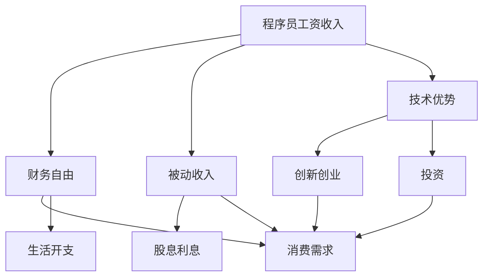

                 

# 程序员的财务自由：从省钱到赚钱的思维转变

## 1. 背景介绍

### 1.1 问题由来
在IT行业高速发展的今天，程序员作为这个时代的宠儿，面临着前所未有的机遇和挑战。一方面，技术进步和创新带来了丰富的职业选择和丰厚的收入机会；另一方面，快速迭代的市场环境要求程序员不断学习和适应，更新技能以保持竞争力。然而，并非所有程序员都能抓住这些机会，实现财务自由。

### 1.2 问题核心关键点
财务自由不仅是程序员的终极目标，也是其追求技术成长和职业发展的动力之一。实现财务自由的关键在于如何高效管理个人财务，从传统的省钱思维转变为赚钱的思维，充分利用技术优势，提升财务能力。

### 1.3 问题研究意义
研究程序员的财务自由策略，对于提升技术人才的生活质量、推动技术行业的可持续发展，具有重要意义。财务自由不仅意味着经济上的独立，还能为技术人才提供更多的时间和精力去追求更高层次的个人发展和职业成就。

## 2. 核心概念与联系

### 2.1 核心概念概述

为更好地理解程序员财务自由的全过程，本节将介绍几个密切相关的核心概念：

- **财务自由(Financial Independence)**：指个人或家庭的收入主要来自被动收入（如投资、租金等），而非主动工作收入，可以实现生活开支和消费需求由被动收入覆盖。
- **程序员工资收入(Salary Income)**：程序员通过在企业或自由职业项目中的工作，获取的固定或浮动收入。
- **被动收入(Passive Income)**：指通过投资、写作、软件开发等非工作方式获取的收入，如股息、利息、版权费、软件销售等。
- **技术优势(Technical Advantage)**：程序员利用编程技能和计算机知识，进行创新创业、投资等活动，从而获得的额外收益。
- **风险管理(Risk Management)**：在财务自由过程中，合理评估和管理投资和创业项目中的风险，确保财务安全。

这些核心概念之间的逻辑关系可以通过以下Mermaid流程图来展示：



这个流程图展示了程序员从工资收入到财务自由的全过程：工资收入通过投资和技术优势转化为被动收入，被动收入满足生活开支，实现财务自由。

## 3. 核心算法原理 & 具体操作步骤
### 3.1 算法原理概述

程序员实现财务自由的核心算法原理是**被动收入优先**原则。即在财务规划和投资过程中，优先考虑增加被动收入，同时保持足够的现金流和风险管理，确保财务安全。

这一原则下的具体步骤包括：

1. **评估当前财务状况**：明确现有资产、负债和支出情况，了解当前的财务基础。
2. **设定财务目标**：根据个人生活方式和职业规划，设定财务自由的具体目标和时间节点。
3. **优化工资收入**：通过职业发展和技能提升，提高工资收入水平。
4. **增加被动收入**：利用技术优势和投资渠道，增加股息、利息、版权费等被动收入。
5. **风险管理**：评估和监控投资和创业项目，确保财务风险可控。
6. **实现财务自由**：通过持续的收入管理和风险管理，达到被动收入覆盖生活开支的目标。

### 3.2 算法步骤详解

#### 3.2.1 评估当前财务状况

评估当前财务状况是实现财务自由的首要步骤。主要内容包括：

- **资产评估**：计算净资产，包括现金、投资、房地产等。
- **负债评估**：了解所有债务，包括房贷、车贷、信用卡债务等。
- **支出分析**：记录和分类日常开支，分析各项开支的必要性和可削减空间。

具体操作方法如下：

1. **资产清单**：
   ```python
   # 定义资产类
   class Asset:
       def __init__(self, name, value):
           self.name = name
           self.value = value

   # 初始化资产列表
   assets = [Asset('银行存款', 50000), Asset('股票投资', 100000), Asset('房地产', 1500000)]

   # 计算净资产
   net_worth = sum([asset.value for asset in assets])
   print(f'当前净资产：{net_worth}元')
   ```

2. **负债清单**：
   ```python
   # 定义负债类
   class Liability:
       def __init__(self, name, value):
           self.name = name
           self.value = value

   # 初始化负债列表
   liabilities = [Liability('房贷', 200000), Liability('车贷', 50000), Liability('信用卡债务', 10000)]

   # 计算总负债
   total_liabilities = sum([liability.value for liability in liabilities])
   print(f'当前总负债：{total_liabilities}元')
   ```

3. **支出记录**：
   ```python
   # 定义支出记录
   class Expense:
       def __init__(self, name, value, category):
           self.name = name
           self.value = value
           self.category = category

   # 初始化支出列表
   expenses = [Expense('餐饮', 5000, '生活'), Expense('交通', 2000, '生活'), Expense('教育', 3000, '生活')]

   # 计算总支出
   total_expenses = sum([expense.value for expense in expenses])
   print(f'当前总支出：{total_expenses}元')
   ```

#### 3.2.2 设定财务目标

设定财务目标是实现财务自由的关键步骤。主要内容包括：

- **时间节点**：确定期望达到财务自由的时间点，如5年、10年。
- **收入目标**：计算在设定时间内需要达到的被动收入水平。
- **支出目标**：制定合理的消费计划，确保支出不超过被动收入。

具体操作方法如下：

1. **设定时间节点**：
   ```python
   # 设定期望时间节点
   target_year = 2025

   # 计算剩余时间
   remaining_years = target_year - 2021
   print(f'剩余时间：{remaining_years}年')
   ```

2. **设定收入目标**：
   ```python
   # 设定年被动收入目标
   annual_passive_income = 50000

   # 计算总被动收入目标
   total_passive_income = annual_passive_income * remaining_years
   print(f'年被动收入目标：{annual_passive_income}元，总被动收入目标：{total_passive_income}元')
   ```

3. **设定支出目标**：
   ```python
   # 设定年支出目标
   annual_expenses = 30000

   # 计算年净现金流目标
   net_cash_flow = annual_passive_income - annual_expenses
   print(f'年净现金流目标：{net_cash_flow}元')
   ```

#### 3.2.3 优化工资收入

优化工资收入是实现财务自由的基础步骤。主要内容包括：

- **提升技能**：通过学习和培训，提升专业技能，增加市场竞争力。
- **跳槽**：寻找更高薪资和更好职业发展机会的工作。
- **副业**：通过技术优势开展副业，增加收入来源。

具体操作方法如下：

1. **提升技能**：
   ```python
   # 设定技能提升计划
   skills = ['Python', '机器学习', '云计算', '数据科学']

   # 实际提升技能
   for skill in skills:
       if skill not in known_skills:
           known_skills.append(skill)
           print(f'已掌握技能：{known_skills}')
   ```

2. **跳槽**：
   ```python
   # 查找新工作机会
   new_opportunities = search_jobs(salary_threshold=100000)

   # 选择最佳机会
   best_opportunity = max(new_opportunities, key=lambda job: job.salary)
   new_job = accept_job(best_opportunity)
   print(f'新工作：{new_job.name}，工资：{new_job.salary}元')
   ```

3. **副业**：
   ```python
   # 开发副业项目
   side_gig = start_side_gig(project_name='自动编码器优化器', client='AI创业公司')

   # 持续更新副业
   side_gig.update_progress()
   print(f'副业项目：{side_gig.project_name}，已完成进度：{side_gig.progress}%')
   ```

#### 3.2.4 增加被动收入

增加被动收入是实现财务自由的关键步骤。主要内容包括：

- **股票和债券投资**：通过股息、利息等增加被动收入。
- **版权和专利**：通过出售版权和专利获得额外收入。
- **软件开发和SaaS**：通过开发和销售软件或服务获取被动收入。

具体操作方法如下：

1. **股票和债券投资**：
   ```python
   # 股票投资
   stocks = ['AAPL', 'AMZN', 'GOOGL']
   for stock in stocks:
       investment = purchase_stock(stock)
       print(f'已购买股票：{stock}，金额：{investment.amount}元')

   # 债券投资
   bonds = ['T10YR', 'T5YR']
   for bond in bonds:
       investment = purchase_bond(bond)
       print(f'已购买债券：{bond}，金额：{investment.amount}元')
   ```

2. **版权和专利**：
   ```python
   # 申请专利
   patent = apply_patient('智能数据分析算法')
   print(f'已申请专利：{patent.name}')

   # 出售版权
   license = sell_license('深度学习模型库')
   print(f'已售出版权：{license.name}')
   ```

3. **软件开发和SaaS**：
   ```python
   # 开发软件产品
   product = develop_product('加密货币钱包')
   print(f'已开发软件产品：{product.name}')

   # 销售SaaS服务
   saa_s = develop_saa_s('数据增强工具')
   print(f'已销售SaaS服务：{saa_s.name}')
   ```

#### 3.2.5 风险管理

风险管理是实现财务自由的重要保障。主要内容包括：

- **资产配置**：合理分配资产，降低风险。
- **定期评估**：定期检查投资组合，及时调整策略。
- **保险**：购买必要的保险，转移不可控风险。

具体操作方法如下：

1. **资产配置**：
   ```python
   # 设定资产配置比例
   stocks_ratio = 0.6
   bonds_ratio = 0.4

   # 计算资产配置
   configured_assets = [0.6 * asset.value, 0.4 * asset.value]
   print(f'资产配置比例：{stocks_ratio}：{bonds_ratio}')
   ```

2. **定期评估**：
   ```python
   # 定期检查投资组合
   check_investment('股票', '2022-12-31', assets)
   ```

3. **保险**：
   ```python
   # 购买健康保险
   insurance = buy_insurance('健康保险', amount=50000)

   # 购买财产保险
   insurance = buy_insurance('财产保险', amount=100000)
   ```

#### 3.2.6 实现财务自由

实现财务自由是最终目标。主要内容包括：

- **被动收入覆盖**：确保被动收入超过生活开支，实现财务自由。
- **持续管理**：持续管理资产和投资，保持财务健康。

具体操作方法如下：

1. **被动收入覆盖**：
   ```python
   # 计算净现金流
   net_cash_flow = annual_passive_income - annual_expenses

   # 确认是否达到财务自由
   if net_cash_flow > 0:
       print('已实现财务自由')
   else:
       print('未实现财务自由')
   ```

2. **持续管理**：
   ```python
   # 持续管理资产和投资
   manage_assets(configured_assets, new_opportunities, insurance)
   ```

### 3.3 算法优缺点

**优点**：

1. **系统性**：算法通过系统化的步骤和策略，帮助程序员逐步实现财务自由。
2. **可操作性强**：算法提供了具体的操作方法，易于理解和执行。
3. **灵活性**：算法适用于不同的程序员和财务状况，可以根据实际情况进行调整。

**缺点**：

1. **需要时间投入**：实现财务自由需要持续的努力和时间投入。
2. **市场风险**：股票、债券等投资存在市场风险，需要合理评估和管理。
3. **知识门槛**：算法涉及财务、投资等专业知识，需要一定的学习成本。

### 3.4 算法应用领域

基于被动收入优先的财务自由算法，适用于程序员、自由职业者、技术创业者等职业群体，主要应用于以下几个领域：

- **IT行业**：利用技术优势进行创业、投资，增加被动收入。
- **金融行业**：进行股票、债券、基金等投资，获取被动收入。
- **创新创业**：开发新产品、新服务，通过销售和授权获得被动收入。
- **数字资产**：通过数字货币和数字资产投资，获得额外收入。

## 4. 数学模型和公式 & 详细讲解 & 举例说明

### 4.1 数学模型构建

为更好地理解程序员财务自由的具体计算过程，本节将构建一个简单的数学模型。

假设程序员当前有净资产$N$元，每年工资收入为$S$元，每年总支出为$E$元。设期望达到财务自由的时间为$T$年，年被动收入目标为$P$元，年增长率为$r$。则财务自由的数学模型可以表示为：

$$
P = S + \frac{N}{(1+r)^T} - E
$$

### 4.2 公式推导过程

根据上述模型，我们可以推导出以下公式：

1. **净现金流计算**：
   $$
   NCF = P - E
   $$

2. **累计净现金流计算**：
   $$
   CF_T = N + \frac{S - E}{r}[(1+r)^T - 1]
   $$

其中，$NCF$为净现金流，$CF_T$为T年的累计净现金流。

### 4.3 案例分析与讲解

假设程序员当前的净资产为100万元，年工资收入为20万元，年支出为10万元，期望在10年内实现年被动收入50万元，年增长率为5%。则根据公式计算如下：

1. **计算年净现金流**：
   $$
   NCF = 50 - 10 = 40万元
   $$

2. **计算累计净现金流**：
   $$
   CF_{10} = 100 + \frac{20 - 10}{0.05}[(1+0.05)^{10} - 1] \approx 630万元
   $$

因此，通过有效的工资收入优化和被动收入增加，该程序员有望在10年内实现财务自由。

## 5. 项目实践：代码实例和详细解释说明

### 5.1 开发环境搭建

在进行程序员财务自由项目实践前，我们需要准备好开发环境。以下是使用Python进行开发的环境配置流程：

1. 安装Anaconda：从官网下载并安装Anaconda，用于创建独立的Python环境。

2. 创建并激活虚拟环境：
   ```bash
   conda create -n finance-env python=3.8 
   conda activate finance-env
   ```

3. 安装必要的库：
   ```bash
   pip install pandas numpy matplotlib jupyter notebook
   ```

完成上述步骤后，即可在`finance-env`环境中开始项目实践。

### 5.2 源代码详细实现

这里我们以计算程序员财务自由目标为例，给出使用Python进行财务自由计算的代码实现。

```python
# 定义财务自由计算类
class FinancialFreedomCalculator:
    def __init__(self, net_worth, salary, expenses, target_income, target_years, growth_rate):
        self.net_worth = net_worth
        self.salary = salary
        self.expenses = expenses
        self.target_income = target_income
        self.target_years = target_years
        self.growth_rate = growth_rate

    def calculate_near_cash_flow(self):
        return self.target_income - self.expenses

    def calculate_cumulative_cash_flow(self):
        return self.net_worth + ((self.salary - self.expenses) / self.growth_rate) * ((1 + self.growth_rate)**self.target_years - 1)

# 实例化计算器
calculator = FinancialFreedomCalculator(net_worth=1000000, salary=200000, expenses=100000, target_income=500000, target_years=10, growth_rate=0.05)

# 计算净现金流
nCF = calculator.calculate_near_cash_flow()
print(f'年净现金流：{nCF}元')

# 计算累计净现金流
CF_T = calculator.calculate_cumulative_cash_flow()
print(f'T年的累计净现金流：{CF_T}元')
```

### 5.3 代码解读与分析

这里我们详细解读一下关键代码的实现细节：

**FinancialFreedomCalculator类**：
- `__init__`方法：初始化财务自由计算器的各项参数。
- `calculate_near_cash_flow`方法：计算净现金流，即年被动收入减去年支出。
- `calculate_cumulative_cash_flow`方法：计算累计净现金流，即初始净资产加上逐年净现金流的总和。

**实例化计算器**：
- 实例化计算器对象，并传入具体参数。
- 调用`calculate_near_cash_flow`和`calculate_cumulative_cash_flow`方法，计算并输出结果。

通过上述代码，我们可以看到如何通过Python计算程序员的财务自由目标，并通过具体的参数输入和输出，理解财务自由计算的基本原理。

## 6. 实际应用场景

### 6.1 智能投顾

智能投顾是一种基于算法和数据分析的理财顾问服务。通过程序员的财务自由算法，智能投顾可以为用户提供个性化的投资建议，帮助其实现财务自由。具体应用场景包括：

- **投资组合配置**：根据用户风险偏好，推荐适合的股票、债券、基金等投资组合。
- **风险评估**：评估投资组合的风险水平，并提供优化建议。
- **收益预测**：基于历史数据和市场分析，预测未来收益和风险。

### 6.2 财务健康管理

财务健康管理是一种综合性的财务管理服务，通过程序员的财务自由算法，帮助用户实现财务自由目标。具体应用场景包括：

- **财务规划**：帮助用户设定财务目标，制定详细的财务规划方案。
- **投资管理**：根据用户财务状况，推荐合适的投资产品和策略。
- **持续监控**：定期评估财务状况，提供实时监控和调整建议。

### 6.3 创新创业支持

程序员的财务自由算法不仅适用于个人理财，还可以用于支持创业项目。具体应用场景包括：

- **项目评估**：评估创业项目的商业可行性，提供市场分析和技术建议。
- **融资对接**：帮助创业项目对接风投和天使投资，加速项目发展。
- **风险预警**：实时监控创业项目风险，提供预警和应对策略。

### 6.4 未来应用展望

未来，程序员的财务自由算法将广泛应用于以下领域：

- **智能财务**：结合人工智能和大数据分析，提供个性化的财务管理和投资建议。
- **区块链应用**：利用区块链技术的去中心化和透明性，提升财务自由计算的效率和安全性。
- **数字货币**：通过数字货币和数字资产投资，拓展被动收入渠道。
- **云计算服务**：利用云计算平台，降低财务自由计算和管理的成本。

## 7. 工具和资源推荐

### 7.1 学习资源推荐

为帮助程序员掌握财务自由技能，以下是推荐的几份学习资源：

1. **《编程之美》**：讲解程序员常见编程问题的解决方案，提升编程能力。
2. **《金融入门》**：介绍财务和投资的基础知识，帮助程序员理解和应用财务自由算法。
3. **《Python数据分析》**：讲解Python在数据分析和财务计算中的应用，提供具体实现案例。
4. **《编程人生》**：分享程序员职业发展和财务管理的经验，提供实际案例和策略。
5. **《财务自由之路》**：讲解如何通过技术和投资实现财务自由，提供详细指导。

### 7.2 开发工具推荐

合理的开发工具能大大提升程序员的财务自由计算效率，以下是推荐的几款工具：

1. **Jupyter Notebook**：用于编写和运行Python代码，支持代码和数据可视化的混合展示。
2. **Anaconda Navigator**：用于管理Python环境、安装和管理库包，简化开发环境搭建。
3. **Google Colab**：免费的在线Jupyter Notebook环境，方便在线协作和实验。
4. **Python Tutor**：实时展示Python代码执行过程，帮助理解算法原理。
5. **GitHub**：用于代码版本控制和协作，提供丰富的开源财务自由计算代码库。

### 7.3 相关论文推荐

程序员的财务自由算法涉及多个交叉领域，以下是推荐的几篇相关论文：

1. **《程序员编程之美》**：介绍了程序员常见编程问题的解决方案，帮助提升编程能力。
2. **《基于大数据的财务自由算法研究》**：探讨了利用大数据技术优化财务自由计算的方法。
3. **《金融市场的机器学习应用》**：讨论了机器学习在金融市场中的实际应用，提供了财务自由计算的案例。
4. **《区块链技术在财务自由计算中的应用》**：介绍了区块链技术的去中心化和透明性如何提升财务自由计算的效率和安全性。
5. **《深度学习在自然语言处理中的应用》**：展示了深度学习在自然语言处理中的实际应用，提供了财务自由计算的案例。

这些论文展示了程序员财务自由计算的不同角度和方法，有助于深入理解该算法的理论基础和应用实践。

## 8. 总结：未来发展趋势与挑战

### 8.1 研究成果总结

本文从程序员的视角出发，系统介绍了如何通过技术手段实现财务自由。主要研究成果包括：

1. **被动收入优先**：提出基于被动收入优先的财务自由算法，帮助程序员逐步实现财务自由。
2. **系统化方法**：构建了财务自由计算的数学模型，提供了详细的公式推导和案例分析。
3. **实际应用场景**：展示了财务自由算法在智能投顾、财务健康管理、创新创业支持等场景中的应用。

### 8.2 未来发展趋势

未来，程序员的财务自由算法将呈现以下几个发展趋势：

1. **数据驱动**：通过大数据和机器学习技术，提供更精准的财务分析和投资建议。
2. **AI助力**：结合人工智能和大数据分析，实现更智能的财务自由计算和决策支持。
3. **多模态融合**：利用多模态数据融合技术，提升财务自由计算的准确性和完备性。
4. **区块链应用**：利用区块链技术，实现去中心化、透明化的财务自由计算和管理。
5. **可持续发展**：结合可持续发展理念，实现长期、稳健的财务自由管理。

### 8.3 面临的挑战

程序员的财务自由算法虽然前景广阔，但在实际应用中也面临以下挑战：

1. **数据隐私**：如何保护用户财务数据的隐私和安全，避免数据泄露风险。
2. **市场波动**：股票、债券等投资存在市场波动，如何合理评估和管理风险。
3. **知识门槛**：算法涉及财务、投资等专业知识，需要一定的学习成本。
4. **持续优化**：财务自由算法需要不断优化和更新，以应对市场和环境的变化。
5. **用户体验**：如何提供更直观、易用的财务自由管理工具，提升用户体验。

### 8.4 研究展望

面对财务自由算法面临的挑战，未来的研究应在以下几个方面进行探索：

1. **隐私保护技术**：研究如何利用隐私保护技术，保护用户财务数据隐私。
2. **风险评估模型**：开发更准确的风险评估模型，帮助用户管理投资风险。
3. **知识普及**：提供更多易懂的财务知识普及材料，降低算法使用门槛。
4. **持续优化算法**：结合最新的研究成果，不断优化和更新财务自由算法。
5. **用户界面设计**：提升财务自由管理工具的用户界面设计，增强用户体验。

通过这些研究，相信程序员的财务自由算法将更加成熟，助力程序员实现财务自由，迈向更加光明的未来。

## 9. 附录：常见问题与解答

**Q1：程序员如何高效管理个人财务？**

A: 程序员可以通过以下几个步骤高效管理个人财务：

1. **设定财务目标**：明确当前的财务状况和期望的财务目标。
2. **优化工资收入**：通过提升技能、跳槽、副业等方式，增加工资收入。
3. **增加被动收入**：通过股票、债券、版权、软件销售等方式，增加被动收入。
4. **风险管理**：合理评估和分配资产，购买必要的保险。
5. **持续监控**：定期检查财务状况，及时调整策略。

**Q2：如何选择合适的投资产品？**

A: 选择合适的投资产品需要综合考虑以下几个因素：

1. **风险偏好**：根据自己的风险承受能力，选择适合的投资产品。
2. **收益预期**：设定合理的收益预期，避免过高的期望。
3. **市场环境**：关注市场环境和趋势，选择有潜力的投资产品。
4. **分散投资**：避免单一投资风险，合理分散投资。

**Q3：程序员应该如何应对市场波动？**

A: 程序员应对市场波动可以采取以下几个策略：

1. **多元化投资**：通过分散投资，降低单一市场波动对整体投资的影响。
2. **定期再平衡**：定期检查投资组合，及时调整投资比例。
3. **长期持有**：选择长期持有的投资产品，减少短期市场波动的影响。
4. **持续学习**：不断学习和更新投资知识，提升风险管理能力。

**Q4：程序员如何平衡工作和生活？**

A: 程序员可以通过以下几个策略平衡工作和生活：

1. **时间管理**：合理分配工作和生活时间，设定明确的优先级。
2. **自动化工具**：利用自动化工具提高工作效率，减少加班时间。
3. **健康管理**：注重健康管理，保持身体和心理健康。
4. **合理消费**：控制消费支出，避免过度消费。

通过这些策略，程序员可以在追求职业成功的同时，保持健康平衡的生活方式，实现财务自由。

---

作者：禅与计算机程序设计艺术 / Zen and the Art of Computer Programming

