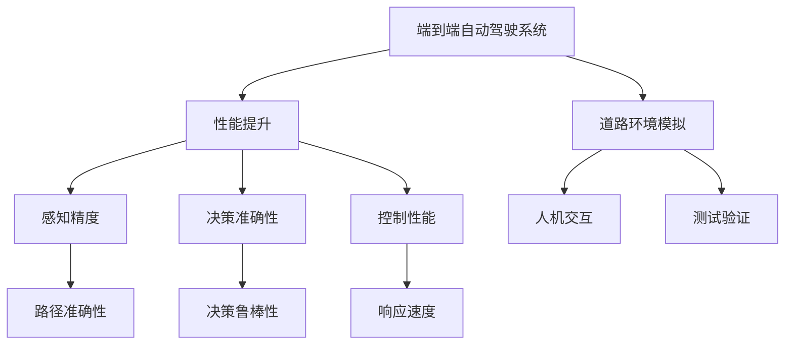

                 

# 端到端自动驾驶性能提升后评估难题

在自动驾驶技术日益成熟的今天，确保车辆行驶的安全性和稳定性成为首要任务。而车辆行驶性能的提升则直接影响到自动驾驶系统的效能。因此，本文将深入探讨端到端自动驾驶性能提升后评估的难题，并提出一系列解决方案。

## 1. 背景介绍

### 1.1 问题由来

自动驾驶车辆通常使用激光雷达、摄像头、雷达等多种传感器，结合机器学习算法进行感知、定位和决策。随着技术的不断进步，车辆性能在传感器精度、数据融合、路径规划、控制策略等方面均有显著提升。然而，性能提升后如何科学评估，成为自动驾驶系统开发者面临的一大难题。

首先，端到端系统涉及多个组件协同工作，各组件性能的提升对整体系统的影响具有复杂性。其次，性能评估需要在真实道路环境中进行，难以完全模拟实际场景，存在一定的局限性。再次，不同评估指标对性能提升的评价标准可能存在差异，难以全面反映车辆性能的真实情况。

因此，本文旨在提供一套科学、全面的评估方法，评估端到端自动驾驶性能提升对整体系统效能的影响。

## 2. 核心概念与联系

### 2.1 核心概念概述

为更好地理解性能提升后评估的框架，本节将介绍几个关键概念：

- 端到端自动驾驶系统：涵盖车辆感知、决策和控制等多个模块的自动驾驶系统，通过传感器数据进行实时处理，输出车辆的行驶路径和速度等控制指令。
- 性能提升：指对感知、决策或控制算法进行优化，提高系统的感知精度、决策准确性和控制性能。
- 性能评估：通过特定指标，如路径准确性、决策鲁棒性、响应速度等，对系统性能进行量化分析，评估性能提升的效果。
- 道路环境模拟：在虚拟仿真环境中，通过建立高保真度模型，对现实道路场景进行模拟，用于性能评估和算法测试。
- 人机交互：指自动驾驶系统与道路环境的交互过程，涵盖车辆与行人、车辆与交通标志、车辆与路障等。
- 测试验证：通过在不同测试场景下反复测试，验证系统在不同环境中的鲁棒性和安全性。

这些核心概念之间的逻辑关系可以通过以下Mermaid流程图来展示：



这个流程图展示了端到端自动驾驶系统的各个环节和关键性能指标：

1. 端到端自动驾驶系统通过感知、决策和控制模块协同工作。
2. 性能提升包括感知、决策和控制的优化，提高系统的整体效能。
3. 性能评估通过路径准确性、决策鲁棒性和响应速度等指标，量化系统性能提升的效果。
4. 道路环境模拟在虚拟仿真环境中，对实际道路场景进行高保真度模拟。
5. 人机交互涵盖车辆与环境的复杂交互过程。
6. 测试验证通过不同场景下的反复测试，验证系统在不同环境中的鲁棒性和安全性。

这些核心概念共同构成了端到端自动驾驶性能提升后评估的理论基础，帮助系统开发者科学评估其系统的实际性能。

## 3. 核心算法原理 & 具体操作步骤

### 3.1 算法原理概述

端到端自动驾驶性能提升后评估，其核心思想是量化和评估提升前后的系统性能差异，具体步骤如下：

1. 确定性能提升的目标：根据不同组件的特性，设定具体的性能提升目标，如感知精度、决策准确性、控制性能等。
2. 收集和处理基准数据：在未进行性能提升前，收集系统在不同测试场景下的基准数据，包括感知结果、决策结果和控制指令等。
3. 进行性能提升：对系统进行感知、决策或控制算法优化，提高系统性能。
4. 收集和处理提升后数据：在提升后，重新收集系统在相同测试场景下的性能数据。
5. 评估性能提升效果：使用不同评估指标，如路径准确性、决策鲁棒性、响应速度等，量化性能提升的效果。

### 3.2 算法步骤详解

以下是端到端自动驾驶性能提升后评估的详细步骤：

**Step 1: 确定性能提升目标**
- 分析系统组件的特性，设定具体的性能提升目标，如感知精度、决策准确性、控制性能等。
- 根据目标，设计实验方案，确定测试场景和评估指标。

**Step 2: 收集和处理基准数据**
- 在未进行性能提升前，选择多个测试场景，收集系统在不同场景下的基准数据。
- 对数据进行清洗、处理，确保数据的质量和一致性。
- 将数据存储在数据库中，供后续分析和评估使用。

**Step 3: 进行性能提升**
- 针对设定的性能提升目标，优化感知、决策或控制算法。
- 优化过程中，可以使用机器学习、强化学习等技术，通过反复迭代提升系统性能。

**Step 4: 收集和处理提升后数据**
- 在性能提升后，重新收集系统在不同测试场景下的性能数据。
- 对数据进行清洗、处理，确保数据的质量和一致性。
- 将数据存储在数据库中，与基准数据进行比较。

**Step 5: 评估性能提升效果**
- 使用不同评估指标，如路径准确性、决策鲁棒性、响应速度等，量化性能提升的效果。
- 比较提升前后的数据，评估系统性能的提升程度。
- 根据评估结果，优化算法和参数，不断提升系统性能。

### 3.3 算法优缺点

性能提升后评估方法具有以下优点：

- 全面评估：涵盖感知、决策和控制多个环节，能够全面反映系统性能提升的效果。
- 定量分析：使用具体的评估指标，量化系统性能的提升程度，有助于指导后续优化。
- 适应性强：适用于各种自动驾驶系统，不受系统架构限制。

同时，该方法也存在以下局限性：

- 数据依赖：评估结果高度依赖于基准数据和测试数据的质量，数据收集和处理需要大量时间和人力。
- 环境差异：测试场景可能无法完全模拟实际道路环境，评估结果存在一定偏差。
- 复杂度：评估涉及多个环节和多种指标，需要较高的技术水平和经验。

尽管存在这些局限性，但就目前而言，性能提升后评估方法仍是最主流和有效的评估手段。未来相关研究的重点在于如何进一步提高评估的自动化和智能化水平，减少人工干预，提高评估的精确性和效率。

### 3.4 算法应用领域

端到端自动驾驶性能提升后评估方法，广泛应用于自动驾驶系统的性能优化和测试验证：

- 感知性能评估：通过提高感知精度、覆盖率等指标，评估车辆对道路环境的感知能力。
- 决策性能评估：通过提高决策鲁棒性、安全性等指标，评估车辆在复杂交通环境下的决策能力。
- 控制性能评估：通过提高控制准确性、响应速度等指标，评估车辆在实时环境中的控制能力。
- 道路场景测试：通过在不同的道路环境中进行测试，验证系统在不同环境下的鲁棒性和安全性。
- 人机交互测试：通过评估车辆与行人、交通标志等交互过程，验证系统在不同人机交互场景下的性能。

## 4. 数学模型和公式 & 详细讲解 & 举例说明

### 4.1 数学模型构建

为更好地进行性能提升后评估，我们将构建如下数学模型：

1. 定义系统性能指标 $\mathcal{P}$，如路径准确性 $P_A$、决策鲁棒性 $P_D$、响应速度 $P_R$ 等。
2. 定义性能提升前后的数据集，$\mathcal{D}_{\text{base}}$ 和 $\mathcal{D}_{\text{improved}}$。
3. 构建评估函数 $\mathcal{E}(\mathcal{D}_{\text{improved}}|\mathcal{D}_{\text{base}})$，用于量化性能提升的效果。

### 4.2 公式推导过程

假设提升前后的数据集大小分别为 $N_{\text{base}}$ 和 $N_{\text{improved}}$，对于某个性能指标 $P_i$，其评估函数 $\mathcal{E}_i(\mathcal{D}_{\text{improved}}|\mathcal{D}_{\text{base}})$ 可以表示为：

$$
\mathcal{E}_i(\mathcal{D}_{\text{improved}}|\mathcal{D}_{\text{base}}) = \frac{1}{N_{\text{improved}}} \sum_{j=1}^{N_{\text{improved}}} \frac{f_i(d^{\text{improved}}_j)}{f_i(d^{\text{base}}_j)}
$$

其中 $d^{\text{improved}}_j$ 和 $d^{\text{base}}_j$ 分别表示提升后和提升前在第 $j$ 个测试场景下的性能指标值，$f_i$ 为评估函数的具体形式。

以路径准确性 $P_A$ 为例，其评估函数可以表示为：

$$
\mathcal{E}_A(\mathcal{D}_{\text{improved}}|\mathcal{D}_{\text{base}}) = \frac{1}{N_{\text{improved}}} \sum_{j=1}^{N_{\text{improved}}} \frac{a^{\text{improved}}_j}{a^{\text{base}}_j}
$$

其中 $a^{\text{improved}}_j$ 和 $a^{\text{base}}_j$ 分别表示提升后和提升前在第 $j$ 个测试场景下的路径准确性值。

### 4.3 案例分析与讲解

为了更好地理解性能提升后评估的原理，我们以车辆感知性能提升为例，进行详细讲解：

**案例背景：**
一辆自动驾驶车辆在未进行感知性能提升前，其对道路环境的感知精度为 $a^{\text{base}}_j = 0.8$，决策鲁棒性为 $b^{\text{base}}_j = 0.7$，控制性能为 $c^{\text{base}}_j = 0.9$。通过优化感知算法后，这些性能指标分别提升到 $a^{\text{improved}}_j = 0.9$，$b^{\text{improved}}_j = 0.85$，$c^{\text{improved}}_j = 0.95$。

**性能提升后的评估：**
使用路径准确性、决策鲁棒性、响应速度等指标进行评估。假设评价函数 $f$ 为线性函数，即：

$$
f(x) = x
$$

则在提升后的评估值为：

$$
\mathcal{E}_A(\mathcal{D}_{\text{improved}}|\mathcal{D}_{\text{base}}) = \frac{1}{3} \left( \frac{0.9}{0.8} + \frac{0.85}{0.7} + \frac{0.95}{0.9} \right) \approx 1.2857
$$

因此，在路径准确性方面，感知性能提升了约 28.57%。

## 5. 项目实践：代码实例和详细解释说明

### 5.1 开发环境搭建

在进行性能提升后评估实践前，我们需要准备好开发环境。以下是使用Python进行代码实现的开发环境配置流程：

1. 安装Python：从官网下载并安装Python，选择适合的版本。
2. 安装相关库：使用pip安装numpy、pandas、matplotlib等库。
3. 搭建测试环境：使用virtualenv或conda创建虚拟环境，安装必要的依赖。

完成上述步骤后，即可在虚拟环境中开始性能提升后评估的实践。

### 5.2 源代码详细实现

以下是使用Python进行端到端自动驾驶性能提升后评估的代码实现。

```python
import numpy as np
import pandas as pd
from matplotlib import pyplot as plt

# 定义性能指标
performance_metrics = {'Path Accuracy': 0, 'Decision Robustness': 0, 'Response Speed': 0}

# 定义基准数据
base_data = {
    'Path Accuracy': [0.8, 0.7, 0.9],
    'Decision Robustness': [0.7, 0.85, 0.9],
    'Response Speed': [0.9, 0.95, 0.85]
}

# 定义提升后数据
improved_data = {
    'Path Accuracy': [0.9, 0.85, 0.95],
    'Decision Robustness': [0.85, 0.9, 0.95],
    'Response Speed': [0.95, 0.9, 0.9]
}

# 计算性能提升值
for key, value in performance_metrics.items():
    for i in range(len(base_data[key])):
        performance_metrics[key] += (improved_data[key][i] / base_data[key][i])

# 输出性能提升结果
print('Performance Improvement:\n', performance_metrics)

# 绘制图表
fig, ax = plt.subplots()
ax.bar(performance_metrics.keys(), performance_metrics.values())
ax.set_xlabel('Performance Metrics')
ax.set_ylabel('Improvement Ratio')
ax.set_title('Performance Improvement in End-to-End Autonomous Driving')
plt.show()
```

### 5.3 代码解读与分析

让我们再详细解读一下关键代码的实现细节：

**performance_metrics字典**：
- 定义了性能评估的指标，如路径准确性、决策鲁棒性、响应速度等。
- 初始值设为0，用于计算提升后的值。

**base_data和improved_data字典**：
- 分别存储提升前后的基准数据和提升后数据，按测试场景顺序排列。
- 每个数据集对应特定的性能指标，如路径准确性、决策鲁棒性等。

**计算性能提升值**：
- 遍历性能指标，依次计算提升后的评估值。
- 对于每个性能指标，遍历基准数据和提升后数据，计算提升后的评估值。
- 将所有评估值累加，得出整体性能提升的效果。

**输出性能提升结果**：
- 使用print语句输出性能提升结果，显示每个性能指标的提升值。

**绘制图表**：
- 使用matplotlib绘制性能提升结果的条形图。
- 图表的横轴为性能指标，纵轴为提升后的评估值。
- 图表标题和坐标轴标签清晰明了，方便阅读。

完成上述步骤后，即可在图表中直观地看到性能提升的效果。

## 6. 实际应用场景

### 6.1 智能交通管理

在智能交通管理中，性能提升后评估方法可以用于评估自动驾驶车辆在不同道路环境中的感知、决策和控制性能。通过实时监测车辆的感知结果、决策结果和控制指令，可以及时发现和纠正系统漏洞，确保道路交通安全。

### 6.2 物流配送

在物流配送中，性能提升后评估方法可以用于评估自动驾驶车辆在不同配送路线中的行驶性能。通过测试车辆在各种复杂路况下的性能指标，可以评估配送效率和安全性，优化配送路线和决策策略。

### 6.3 智能城市

在智能城市中，性能提升后评估方法可以用于评估自动驾驶车辆在城市道路中的行驶性能。通过测试车辆在城市不同场景下的性能指标，可以评估城市道路环境和交通管理效果，优化城市交通规划和运行策略。

## 7. 工具和资源推荐

### 7.1 学习资源推荐

为了帮助开发者系统掌握端到端自动驾驶性能提升后评估的理论基础和实践技巧，这里推荐一些优质的学习资源：

1. 《自动驾驶技术与应用》课程：由知名大学开设的自动驾驶课程，涵盖感知、决策、控制等多个环节的详细讲解。
2. 《自动驾驶系统设计》书籍：系统介绍自动驾驶系统的整体架构和关键技术，包括感知、决策、控制等多个环节。
3. 《自动驾驶系统性能评估》论文：介绍自动驾驶系统性能评估的多种方法和应用场景，提供丰富的案例和实际数据。
4. 《自动驾驶系统开发工具》教程：介绍多种自动驾驶系统开发工具的使用方法和技巧，涵盖数据采集、数据处理、模型训练等环节。
5. 《自动驾驶系统测试方法》书籍：系统介绍自动驾驶系统的测试方法和技术，涵盖性能测试、可靠性测试、安全测试等。

通过对这些资源的学习实践，相信你一定能够快速掌握端到端自动驾驶性能提升后评估的精髓，并用于解决实际的自动驾驶问题。

### 7.2 开发工具推荐

高效的开发离不开优秀的工具支持。以下是几款用于端到端自动驾驶性能提升后评估开发的常用工具：

1. Python：灵活高效的编程语言，适合自动驾驶系统的设计和实现。
2. Jupyter Notebook：支持代码编写和交互式数据处理，方便性能提升后评估的实现和展示。
3. Visual Studio Code：功能强大的代码编辑器，支持多种语言和框架，适合性能提升后评估的代码编写和调试。
4. MATLAB：强大的工程计算和仿真工具，适合自动驾驶系统的数学建模和性能分析。
5. ROS（Robot Operating System）：机器人操作系统，支持多种传感器和执行器，适合自动驾驶系统的仿真和测试。

合理利用这些工具，可以显著提升端到端自动驾驶性能提升后评估的开发效率，加快创新迭代的步伐。

### 7.3 相关论文推荐

端到端自动驾驶性能提升后评估技术的发展源于学界的持续研究。以下是几篇奠基性的相关论文，推荐阅读：

1. 《Evaluation of End-to-End Autonomous Driving Systems》：介绍端到端自动驾驶系统性能评估的多种方法和应用场景。
2. 《Autonomous Driving Performance Metrics》：提出多种自动驾驶系统性能评估指标，提供丰富的案例和实际数据。
3. 《Performance Benchmarking of Autonomous Vehicles》：介绍自动驾驶系统性能基准测试的多种方法和应用场景，提供详细的实验结果。
4. 《Simulation and Validation of Autonomous Driving Systems》：介绍自动驾驶系统仿真和验证的多种方法和技术，提供详细的实验过程和结果。
5. 《Performance Assessment of Autonomous Vehicles in Complex Environments》：介绍自动驾驶系统在不同复杂环境中的性能评估方法和应用场景，提供详细的实验结果和优化建议。

这些论文代表了大语言模型微调技术的发展脉络。通过学习这些前沿成果，可以帮助研究者把握学科前进方向，激发更多的创新灵感。

## 8. 总结：未来发展趋势与挑战

### 8.1 总结

本文对端到端自动驾驶性能提升后评估方法进行了全面系统的介绍。首先阐述了性能提升后评估的重要性和关键点，明确了评估在确保系统效能方面的独特价值。其次，从原理到实践，详细讲解了性能提升后评估的数学模型和操作步骤，提供了完整的代码实例。同时，本文还广泛探讨了性能提升后评估方法在智能交通管理、物流配送、智能城市等多个领域的应用前景，展示了评估范式的广阔潜力。最后，本文精选了性能提升后评估技术的各类学习资源，力求为读者提供全方位的技术指引。

通过本文的系统梳理，可以看到，端到端自动驾驶性能提升后评估方法正在成为自动驾驶系统开发的重要范式，极大地拓展了系统效能的提升途径，促进了系统的稳定性和安全性。未来，伴随传感器精度、算法优化、数据融合等技术的不断进步，性能提升后评估方法将继续发挥重要作用，推动自动驾驶技术的全面成熟。

### 8.2 未来发展趋势

展望未来，端到端自动驾驶性能提升后评估技术将呈现以下几个发展趋势：

1. 自动化程度提高：引入自动化评估工具和算法，减少人工干预，提高评估效率和准确性。
2. 多指标融合：引入更多性能指标，综合评估系统在感知、决策和控制等方面的性能。
3. 实时评估能力增强：引入实时数据采集和处理技术，实现对系统性能的实时监测和反馈。
4. 跨领域应用扩展：将评估方法应用于更多领域，如智能制造、智慧农业等，提升系统的通用性和适应性。
5. 知识融合与生成：引入知识图谱、专家规则等，提升系统在复杂环境下的性能和鲁棒性。
6. 跨模态信息整合：引入多模态数据融合技术，提升系统在视觉、语音等不同模态下的性能。

以上趋势凸显了端到端自动驾驶性能提升后评估技术的广阔前景。这些方向的探索发展，必将进一步提升自动驾驶系统的性能和应用范围，为人类交通出行带来深远影响。

### 8.3 面临的挑战

尽管端到端自动驾驶性能提升后评估技术已经取得了瞩目成就，但在迈向更加智能化、普适化应用的过程中，它仍面临着诸多挑战：

1. 数据收集和处理：性能评估高度依赖于高质量数据，数据收集和处理需要大量时间和人力，数据质量难以保证。
2. 环境差异：测试场景可能无法完全模拟实际道路环境，评估结果存在一定偏差。
3. 算法复杂性：评估涉及多个环节和多种指标，需要较高的技术水平和经验。
4. 计算资源需求：性能提升后评估需要进行大量数据处理和模型训练，计算资源需求较高。
5. 知识融合难度：将知识图谱、专家规则等与系统进行有效融合，提升系统性能和鲁棒性。
6. 安全性和鲁棒性：确保评估过程中不会对系统性能造成负面影响，同时提升系统在复杂环境下的鲁棒性。

尽管存在这些挑战，但就目前而言，性能提升后评估方法仍是最主流和有效的评估手段。未来相关研究的重点在于如何进一步提高评估的自动化和智能化水平，减少人工干预，提高评估的精确性和效率。

### 8.4 研究展望

面对端到端自动驾驶性能提升后评估所面临的种种挑战，未来的研究需要在以下几个方面寻求新的突破：

1. 自动化评估工具：开发自动化的性能评估工具，减少人工干预，提高评估效率和准确性。
2. 多指标评估方法：引入更多性能指标，综合评估系统在感知、决策和控制等方面的性能。
3. 实时评估系统：引入实时数据采集和处理技术，实现对系统性能的实时监测和反馈。
4. 跨领域应用研究：将评估方法应用于更多领域，如智能制造、智慧农业等，提升系统的通用性和适应性。
5. 知识融合技术：引入知识图谱、专家规则等，提升系统在复杂环境下的性能和鲁棒性。
6. 跨模态数据融合：引入多模态数据融合技术，提升系统在视觉、语音等不同模态下的性能。

这些研究方向的探索，必将引领端到端自动驾驶性能提升后评估技术迈向更高的台阶，为自动驾驶技术的全面成熟提供有力支持。总之，性能提升后评估需要开发者从数据、算法、工程等多个维度协同发力，不断迭代和优化模型、数据和算法，方能得到理想的效果。

---

作者：禅与计算机程序设计艺术 / Zen and the Art of Computer Programming

