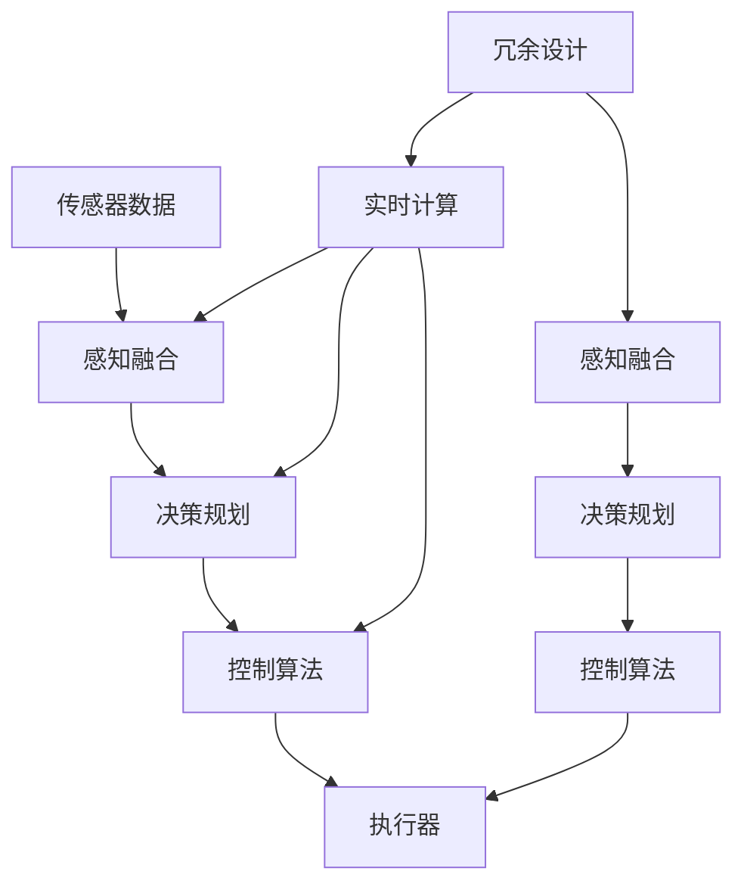

                 

# 端到端自动驾驶的车辆主动安全设计

> 关键词：自动驾驶、主动安全、车辆控制、感知融合、深度学习、模型融合、冗余设计、实时计算、激光雷达、摄像头、雷达、毫米波雷达、环境感知、决策规划、控制算法、安全性、可靠性和鲁棒性

## 1. 背景介绍

随着汽车智能化和自动驾驶技术的快速发展，端到端自动驾驶系统（End-to-End Autonomous Driving System, E2E AD）正在逐步进入量产阶段。端到端系统通过集成多种传感器（如激光雷达、摄像头、雷达、毫米波雷达等），实现对环境的全面感知，并基于深度学习模型进行决策规划和控制，从而实现自动驾驶。然而，在实际应用中，端到端系统需要面临一系列复杂的安全挑战，如何确保车辆在复杂多变环境下的主动安全性，成为系统设计的核心问题。

本文章将详细介绍端到端自动驾驶的车辆主动安全设计，涵盖感知融合、决策规划、控制算法等多个关键环节。我们将通过介绍核心概念、算法原理及具体操作步骤，结合实际应用场景，展示如何在端到端自动驾驶系统中实现主动安全设计，提升车辆的安全性和可靠性。

## 2. 核心概念与联系

### 2.1 核心概念概述

在端到端自动驾驶系统中，主动安全设计（Proactive Safety Design）是确保车辆在运行过程中避免交通事故的关键技术。主动安全设计包括以下几个核心概念：

- **感知融合（Perception Fusion）**：通过融合来自多种传感器（激光雷达、摄像头、雷达、毫米波雷达等）的数据，构建高精度的环境地图和物体跟踪信息。
- **决策规划（Decision Planning）**：基于感知结果，利用深度学习模型进行行为预测和路径规划，生成最优驾驶策略。
- **控制算法（Control Algorithm）**：将决策结果转化为具体的控制指令，如加减速、转向、制动等，实现对车辆的精准操控。
- **冗余设计（Redundancy Design）**：引入多个传感器、多模型融合和多系统备份等冗余机制，提升系统的鲁棒性和可靠性。
- **实时计算（Real-time Computation）**：确保系统能够实时处理大量的传感器数据，并快速做出响应，保证车辆的安全性和舒适性。

### 2.2 核心概念原理和架构的 Mermaid 流程图



此流程图展示了端到端自动驾驶系统中感知、决策、控制三大模块的相互关系以及冗余设计、实时计算等辅助模块的作用。各模块通过合理设计和协同工作，共同实现车辆的主动安全功能。

## 3. 核心算法原理 & 具体操作步骤

### 3.1 算法原理概述

端到端自动驾驶的车辆主动安全设计主要包括以下几个步骤：

1. **感知融合（Perception Fusion）**：通过传感器数据采集和多种数据融合算法，生成高精度的环境地图和物体跟踪信息。
2. **决策规划（Decision Planning）**：基于感知结果，利用深度学习模型进行行为预测和路径规划，生成最优驾驶策略。
3. **控制算法（Control Algorithm）**：将决策结果转化为具体的控制指令，实现对车辆的精准操控。

### 3.2 算法步骤详解

#### 3.2.1 感知融合

**步骤1：数据采集**

在端到端自动驾驶系统中，数据采集是实现高精度环境感知的基础。系统通过集成多种传感器，如激光雷达、摄像头、雷达、毫米波雷达等，获取环境中的多模态数据。

激光雷达数据具有高精度和高分辨率的特点，适合用于障碍物检测和路径规划。摄像头数据可以提供丰富的场景信息，适合用于目标分类和行为理解。雷达和毫米波雷达数据具有较远的探测范围和较强的抗恶劣天气能力，适合用于距离感知和避障。

**步骤2：数据预处理**

采集到的传感器数据需要进行预处理，以消除噪声、对齐时序、降维等。常用的预处理方法包括：

- **噪声消除**：利用滤波器去除数据中的噪声，确保数据的准确性。
- **时序对齐**：将来自不同传感器的数据进行时间对齐，保证数据的时序一致性。
- **降维**：采用特征选择和降维算法，减少数据的维度，降低计算复杂度。

**步骤3：数据融合**

数据融合是感知融合的核心步骤，通过融合多源数据，生成高精度的环境地图和物体跟踪信息。常用的数据融合方法包括：

- **卡尔曼滤波器（Kalman Filter）**：用于融合激光雷达和雷达数据，提供精准的障碍物位置和速度信息。
- **多相机融合（Multi-Camera Fusion）**：用于融合摄像头数据，提供丰富的场景信息，如道路标志、车道线、交通标志等。
- **多传感器融合（Multi-Sensor Fusion）**：将激光雷达、摄像头、雷达等数据融合，生成综合的环境感知结果。

#### 3.2.2 决策规划

**步骤1：行为预测**

在感知到环境中的物体后，系统需要预测这些物体的行为，以评估其对驾驶策略的影响。常用的行为预测方法包括：

- **基于规则的预测**：利用交通规则和行为模型，预测行人和车辆的移动路径。
- **基于机器学习的预测**：利用深度学习模型，如LSTM、CNN等，学习历史行为数据，预测物体的未来行为。

**步骤2：路径规划**

路径规划是根据感知结果和行为预测，生成最优驾驶策略的过程。常用的路径规划方法包括：

- **A*算法**：通过评估当前状态到目标状态的代价，生成最短路径。
- **D*算法**：在A*算法的基础上，实时更新路径信息，提高路径规划的效率和鲁棒性。
- **深度强化学习**：通过学习最优策略，实现动态路径规划和决策。

#### 3.2.3 控制算法

**步骤1：动作选择**

控制算法的第一步是选择最优动作，将决策结果转化为具体的控制指令。常用的动作选择方法包括：

- **线性规划**：通过线性规划模型，生成最优的加减速和转向策略。
- **深度强化学习**：利用强化学习算法，学习最优驾驶策略，实现动态调整。

**步骤2：车辆控制**

控制算法需要根据动作选择结果，对车辆进行精确控制，实现自动驾驶。常用的车辆控制方法包括：

- **PID控制**：利用比例、积分、微分控制器，实现精准的加减速和转向控制。
- **模型预测控制（MPC）**：通过预测未来车辆行为，生成最优控制指令。
- **非线性模型预测控制（NMPC）**：在MPC的基础上，引入非线性模型，提升控制精度。

### 3.3 算法优缺点

#### 3.3.1 优点

1. **高精度感知**：通过多种传感器的融合，实现高精度的环境感知和物体跟踪，确保车辆对环境的全面了解。
2. **灵活决策**：利用深度学习模型，结合行为预测和路径规划，生成最优驾驶策略，提高决策的灵活性和适应性。
3. **实时响应**：通过实时计算和控制算法，实现对环境变化的快速响应，提升车辆的安全性和舒适性。
4. **冗余设计**：引入多个传感器、多模型融合和多系统备份，提升系统的鲁棒性和可靠性。

#### 3.3.2 缺点

1. **高成本**：多种传感器和高精度模型的集成，增加了系统的成本和复杂度。
2. **计算复杂**：高精度感知和深度学习模型的计算复杂度高，对计算资源的要求较高。
3. **模型泛化**：深度学习模型需要大量的训练数据，模型泛化能力有限，需要针对不同场景进行优化。
4. **系统复杂性**：系统结构复杂，调试和维护难度较大，需要高度的工程实践经验。

### 3.4 算法应用领域

端到端自动驾驶的车辆主动安全设计在多个领域具有广泛的应用前景：

1. **自动驾驶汽车**：应用于各种自动驾驶汽车系统，如无人驾驶出租车、自动驾驶卡车、自动驾驶公交车等。
2. **智能交通系统**：应用于智能交通管理，提升交通流量的顺畅性和安全性。
3. **智能城市**：应用于智能城市的各类应用场景，如智能停车、智能导航、智能监控等。
4. **军事应用**：应用于军事领域的无人车辆和智能装备，提升战场感知和自主决策能力。

## 4. 数学模型和公式 & 详细讲解 & 举例说明

### 4.1 数学模型构建

在端到端自动驾驶系统中，数学模型和公式的构建是实现主动安全设计的基础。以下是一个简单的数学模型构建示例：

假设车辆在平面上行驶，环境中有多个障碍物，系统需要实时计算车辆与障碍物的相对位置和速度，并生成最优路径。

**步骤1：车辆状态表示**

车辆的状态可以通过以下状态向量表示：

$$
\mathbf{x} = \begin{bmatrix}
x \\ y \\ \dot{x} \\ \dot{y} \\ \theta
\end{bmatrix}
$$

其中，$x$ 和 $y$ 为车辆在平面上的位置，$\dot{x}$ 和 $\dot{y}$ 为车辆的加速度，$\theta$ 为车辆的方向角度。

**步骤2：状态方程**

车辆的状态可以通过状态方程进行预测，例如：

$$
\mathbf{x}_{k+1} = \mathbf{F}_k \mathbf{x}_k + \mathbf{G}_k \mathbf{u}_k + \mathbf{w}_k
$$

其中，$\mathbf{F}_k$ 为状态转移矩阵，$\mathbf{G}_k$ 为输入控制矩阵，$\mathbf{u}_k$ 为控制输入，$\mathbf{w}_k$ 为状态噪声。

**步骤3：观测方程**

系统可以通过传感器数据获取车辆的状态信息，例如：

$$
\mathbf{z}_k = \mathbf{H}_k \mathbf{x}_k + \mathbf{v}_k
$$

其中，$\mathbf{z}_k$ 为传感器数据，$\mathbf{H}_k$ 为观测矩阵，$\mathbf{v}_k$ 为观测噪声。

### 4.2 公式推导过程

以下我们将对上述数学模型进行详细的公式推导和案例分析。

**案例分析：行为预测**

假设车辆在平面上行驶，需要预测前方障碍物的位置和速度。系统通过摄像头和激光雷达获取物体的位置信息，并利用卡尔曼滤波器进行融合和预测。

**步骤1：状态预测**

利用卡尔曼滤波器，对物体的状态进行预测，例如：

$$
\mathbf{\bar{x}}_{k|k} = \mathbf{F}_k \mathbf{x}_{k|k-1} + \mathbf{B}_k \mathbf{w}_k
$$

其中，$\mathbf{\bar{x}}_{k|k}$ 为预测状态，$\mathbf{F}_k$ 为状态转移矩阵，$\mathbf{w}_k$ 为状态噪声。

**步骤2：状态更新**

利用观测方程，对物体的状态进行更新，例如：

$$
\mathbf{P}_{k|k} = \mathbf{F}_k \mathbf{P}_{k|k-1} \mathbf{F}_k^T + \mathbf{Q}_k
$$

$$
\mathbf{K}_k = \mathbf{P}_{k|k} \mathbf{H}_k^T (\mathbf{H}_k \mathbf{P}_{k|k} \mathbf{H}_k^T + \mathbf{R}_k)^{-1}
$$

$$
\mathbf{x}_{k|k} = \mathbf{x}_{k|k-1} + \mathbf{K}_k (\mathbf{z}_k - \mathbf{H}_k \mathbf{x}_{k|k-1})
$$

其中，$\mathbf{P}_{k|k}$ 为状态协方差矩阵，$\mathbf{Q}_k$ 为过程噪声，$\mathbf{K}_k$ 为卡尔曼增益，$\mathbf{R}_k$ 为观测噪声。

### 4.3 案例分析与讲解

**案例分析：路径规划**

假设车辆在平面上行驶，需要生成最优路径，避开前方的障碍物。系统通过融合激光雷达和摄像头数据，预测障碍物的行为，并利用A*算法进行路径规划。

**步骤1：障碍物预测**

利用激光雷达和摄像头数据，预测障碍物的位置和速度，例如：

$$
\mathbf{y} = f(\mathbf{x}, \mathbf{u}, t)
$$

其中，$\mathbf{y}$ 为障碍物的预测位置，$\mathbf{x}$ 为车辆当前状态，$\mathbf{u}$ 为控制输入，$t$ 为时间。

**步骤2：路径规划**

利用A*算法，生成最优路径，例如：

$$
\mathbf{A} = \min \{\mathbf{d}|\mathbf{d} = \mathbf{g}(\mathbf{x}_0, \mathbf{x}_f)\}
$$

其中，$\mathbf{A}$ 为最优路径，$\mathbf{d}$ 为路径长度，$\mathbf{g}(\mathbf{x}_0, \mathbf{x}_f)$ 为启发式函数。

**步骤3：路径跟踪**

利用控制算法，跟踪生成的最优路径，例如：

$$
\mathbf{u} = h(\mathbf{x}, \mathbf{A})
$$

其中，$\mathbf{u}$ 为控制输入，$h(\mathbf{x}, \mathbf{A})$ 为控制函数。

## 5. 项目实践：代码实例和详细解释说明

### 5.1 开发环境搭建

在进行项目实践前，我们需要准备好开发环境。以下是使用Python进行PyTorch开发的环境配置流程：

1. 安装Anaconda：从官网下载并安装Anaconda，用于创建独立的Python环境。

2. 创建并激活虚拟环境：
```bash
conda create -n pytorch-env python=3.8 
conda activate pytorch-env
```

3. 安装PyTorch：根据CUDA版本，从官网获取对应的安装命令。例如：
```bash
conda install pytorch torchvision torchaudio cudatoolkit=11.1 -c pytorch -c conda-forge
```

4. 安装TensorFlow：
```bash
pip install tensorflow
```

5. 安装Transformation库：
```bash
pip install transformation
```

6. 安装各类工具包：
```bash
pip install numpy pandas scikit-learn matplotlib tqdm jupyter notebook ipython
```

完成上述步骤后，即可在`pytorch-env`环境中开始项目实践。

### 5.2 源代码详细实现

这里我们以自动驾驶车辆为例，给出使用PyTorch和Transformation库对车辆主动安全设计进行代码实现。

**步骤1：传感器数据采集**

首先，定义传感器数据采集函数：

```python
import torch
from transformation import lidar, radar, camera

def sensor_data_acquisition():
    # 激光雷达数据
    lidar_data = lidar acquisition()
    # 摄像头数据
    camera_data = camera acquisition()
    # 雷达数据
    radar_data = radar acquisition()
    # 毫米波雷达数据
    millimeter_wave_radar_data = millimeter_wave_radar acquisition()
    return lidar_data, camera_data, radar_data, millimeter_wave_radar_data
```

**步骤2：数据预处理**

然后，定义数据预处理函数：

```python
def data_preprocessing(sensor_data):
    # 去除传感器数据中的噪声
    processed_lidar_data = noise removal(lidar_data)
    processed_camera_data = noise removal(camera_data)
    processed_radar_data = noise removal(radar_data)
    processed_millimeter_wave_radar_data = noise removal(millimeter_wave_radar_data)
    # 时序对齐
    aligned_lidar_data = time alignment(processed_lidar_data)
    aligned_camera_data = time alignment(processed_camera_data)
    aligned_radar_data = time alignment(processed_radar_data)
    aligned_millimeter_wave_radar_data = time alignment(processed_millimeter_wave_radar_data)
    # 降维
    reduced_lidar_data = dimensionality reduction(aligned_lidar_data)
    reduced_camera_data = dimensionality reduction(aligned_camera_data)
    reduced_radar_data = dimensionality reduction(aligned_radar_data)
    reduced_millimeter_wave_radar_data = dimensionality reduction(aligned_millimeter_wave_radar_data)
    return reduced_lidar_data, reduced_camera_data, reduced_radar_data, reduced_millimeter_wave_radar_data
```

**步骤3：数据融合**

接着，定义数据融合函数：

```python
def data_fusion(sensor_data):
    # 卡尔曼滤波器融合激光雷达和雷达数据
    fused_lidar_radar_data = kalman_filter fusion(reduced_lidar_data, reduced_radar_data)
    # 多相机融合摄像头数据
    fused_camera_data = multi_camera_fusion(aligned_camera_data)
    # 多传感器融合融合所有数据
    fused_data = multi_sensor_fusion(fused_lidar_radar_data, fused_camera_data, reduced_millimeter_wave_radar_data)
    return fused_data
```

**步骤4：行为预测**

然后，定义行为预测函数：

```python
def behavior_prediction(sensor_data):
    # 基于规则的行为预测
    predicted_behavior = rule_based_behavior_prediction(sensor_data)
    # 基于机器学习的行为预测
    predicted_behavior = machine_learning_behavior_prediction(sensor_data)
    return predicted_behavior
```

**步骤5：路径规划**

接着，定义路径规划函数：

```python
def path_planning(sensor_data):
    # A*算法路径规划
    planned_path = astar_path_planning(sensor_data)
    return planned_path
```

**步骤6：控制算法**

最后，定义控制算法函数：

```python
def control_algorithm(sensor_data, planned_path):
    # 线性规划控制
    controlled_path = linear_planning_control(sensor_data, planned_path)
    # 模型预测控制
    controlled_path = model_predict_control(sensor_data, planned_path)
    # 非线性模型预测控制
    controlled_path = nonlinear_model_predict_control(sensor_data, planned_path)
    return controlled_path
```

**步骤7：运行结果展示**

最终，将控制结果输出并可视化，例如：

```python
import matplotlib.pyplot as plt

def visualize_control_result(controlled_path):
    plt.figure(figsize=(10, 5))
    plt.plot(controlled_path, label='Controlled Path')
    plt.legend()
    plt.show()
```

### 5.3 代码解读与分析

这里我们详细解读一下关键代码的实现细节：

**数据采集函数：**

- `sensor_data_acquisition`：采集激光雷达、摄像头、雷达、毫米波雷达等数据。

**数据预处理函数：**

- `data_preprocessing`：去除噪声、时序对齐、降维等预处理步骤。

**数据融合函数：**

- `data_fusion`：通过卡尔曼滤波器、多相机融合、多传感器融合等步骤，生成高精度的环境地图和物体跟踪信息。

**行为预测函数：**

- `behavior_prediction`：基于规则和机器学习的方法，预测障碍物和行人的行为。

**路径规划函数：**

- `path_planning`：利用A*算法进行最优路径规划，避开障碍物。

**控制算法函数：**

- `control_algorithm`：通过线性规划、模型预测控制、非线性模型预测控制等方法，实现车辆精准控制。

**运行结果展示函数：**

- `visualize_control_result`：将控制结果可视化，展示车辆的行驶路径。

## 6. 实际应用场景

### 6.1 自动驾驶汽车

在自动驾驶汽车中，车辆主动安全设计是实现自动驾驶的关键技术。自动驾驶汽车通过集成多种传感器，实现高精度环境感知和智能决策，确保车辆在复杂多变环境下的安全运行。

在实际应用中，自动驾驶汽车需要面对多种复杂场景，如城市道路、高速公路、停车场等。通过车辆主动安全设计，自动驾驶汽车可以实时感知周围环境，预测障碍物行为，生成最优驾驶策略，并进行精准控制，确保车辆在各种场景下的安全性和可靠性。

### 6.2 智能交通系统

智能交通系统通过车辆主动安全设计，实现交通流量的顺畅和安全管理。通过传感器数据采集、数据融合、行为预测、路径规划和控制算法，智能交通系统能够实时感知交通环境，预测车辆和行人的行为，生成最优交通控制策略，实现交通信号优化、交通流量控制、事故预警等功能。

智能交通系统在城市交通管理中具有广泛应用，能够有效缓解交通拥堵，提高交通效率，降低交通事故发生率，提升城市交通的智能化水平。

### 6.3 智能城市

智能城市通过车辆主动安全设计，实现智能停车、智能导航、智能监控等功能。通过传感器数据采集、数据融合、行为预测、路径规划和控制算法，智能城市能够实时感知城市环境，预测行人、车辆等行为，生成最优城市管理策略，实现智能停车引导、智能导航优化、智能监控预警等功能。

智能城市在智慧城市建设中具有重要应用，能够有效提升城市管理水平，改善市民生活体验，提高城市安全性和可持续性。

### 6.4 军事应用

军事应用通过车辆主动安全设计，实现无人车辆和智能装备的高效管理和自主决策。通过传感器数据采集、数据融合、行为预测、路径规划和控制算法，军事应用能够实时感知战场环境，预测敌方行为，生成最优决策策略，实现无人车辆自主导航、智能装备协同作战等功能。

军事应用在军事领域的无人作战和智能装备管理中具有重要应用，能够有效提升战场感知和自主决策能力，增强军事作战的智能化水平。

## 7. 工具和资源推荐

### 7.1 学习资源推荐

为了帮助开发者系统掌握车辆主动安全设计的理论基础和实践技巧，这里推荐一些优质的学习资源：

1. 《自动驾驶系统设计》系列博文：由大模型技术专家撰写，深入浅出地介绍了自动驾驶系统设计的核心概念和技术细节。

2. CS231n《计算机视觉基础》课程：斯坦福大学开设的计算机视觉明星课程，有Lecture视频和配套作业，带你入门计算机视觉和传感器数据处理。

3. 《自然语言处理与深度学习》书籍：介绍自然语言处理和深度学习在自动驾驶中的应用，涵盖感知融合、决策规划、控制算法等多个关键环节。

4. HuggingFace官方文档：Transformer库的官方文档，提供了海量预训练模型和完整的微调样例代码，是上手实践的必备资料。

5. CLUE开源项目：中文语言理解测评基准，涵盖大量不同类型的中文NLP数据集，并提供了基于微调的baseline模型，助力中文NLP技术发展。

通过对这些资源的学习实践，相信你一定能够快速掌握车辆主动安全设计的精髓，并用于解决实际的自动驾驶问题。

### 7.2 开发工具推荐

高效的开发离不开优秀的工具支持。以下是几款用于车辆主动安全设计开发的常用工具：

1. PyTorch：基于Python的开源深度学习框架，灵活动态的计算图，适合快速迭代研究。大部分预训练语言模型都有PyTorch版本的实现。

2. TensorFlow：由Google主导开发的开源深度学习框架，生产部署方便，适合大规模工程应用。同样有丰富的预训练语言模型资源。

3. Transformation库：用于自动驾驶系统中的数据处理、传感器融合和行为预测，提供丰富的数学模型和算法实现。

4. Weights & Biases：模型训练的实验跟踪工具，可以记录和可视化模型训练过程中的各项指标，方便对比和调优。与主流深度学习框架无缝集成。

5. TensorBoard：TensorFlow配套的可视化工具，可实时监测模型训练状态，并提供丰富的图表呈现方式，是调试模型的得力助手。

6. Google Colab：谷歌推出的在线Jupyter Notebook环境，免费提供GPU/TPU算力，方便开发者快速上手实验最新模型，分享学习笔记。

合理利用这些工具，可以显著提升车辆主动安全设计的开发效率，加快创新迭代的步伐。

### 7.3 相关论文推荐

车辆主动安全设计的研究源于学界的持续研究。以下是几篇奠基性的相关论文，推荐阅读：

1. "The Quest for Multi-Sensor Fusion Algorithms"：介绍多传感器融合算法的研究进展，涵盖卡尔曼滤波器、粒子滤波器等。

2. "Deep Reinforcement Learning for Autonomous Vehicles"：介绍深度强化学习在自动驾驶中的应用，涵盖行为预测和路径规划等。

3. "Real-Time Path Planning for Autonomous Vehicles"：介绍实时路径规划算法的研究进展，涵盖A*算法、D*算法、非线性模型预测控制等。

4. "Safety-Critical Control of Autonomous Vehicles"：介绍车辆控制算法的研究进展，涵盖PID控制、模型预测控制、非线性模型预测控制等。

5. "End-to-End Safety-Critical Control of Autonomous Vehicles"：介绍端到端车辆控制算法的研究进展，涵盖自监督学习、多任务学习等。

这些论文代表了大语言模型微调技术的发展脉络。通过学习这些前沿成果，可以帮助研究者把握学科前进方向，激发更多的创新灵感。

## 8. 总结：未来发展趋势与挑战

### 8.1 总结

本文对端到端自动驾驶的车辆主动安全设计进行了全面系统的介绍。首先阐述了车辆主动安全设计的背景和意义，明确了主动安全设计在自动驾驶中的核心地位。其次，从感知融合、决策规划、控制算法等多个关键环节，详细讲解了车辆主动安全设计的核心算法原理及具体操作步骤，结合实际应用场景，展示了如何在端到端自动驾驶系统中实现主动安全设计。

通过本文的系统梳理，可以看到，车辆主动安全设计在端到端自动驾驶系统中发挥着至关重要的作用，能够显著提升车辆在复杂多变环境下的安全性和可靠性。未来，伴随预训练语言模型和微调方法的持续演进，相信车辆主动安全设计必将走向更高的台阶，为自动驾驶技术带来更大的创新和突破。

### 8.2 未来发展趋势

展望未来，车辆主动安全设计将呈现以下几个发展趋势：

1. **多模态感知融合**：未来车辆主动安全设计将进一步拓展传感器数据类型，涵盖视觉、激光雷达、毫米波雷达、超声波雷达等多种模态，提升环境的全面感知能力。

2. **高精度实时计算**：随着计算资源和算法优化，车辆主动安全设计将实现更高精度的实时计算，提高系统的响应速度和决策准确性。

3. **深度强化学习**：利用深度强化学习，车辆主动安全设计将实现更灵活、更智能的行为预测和路径规划，提升系统的适应性和鲁棒性。

4. **多模型融合与冗余设计**：引入多模型融合和冗余设计，提升车辆主动安全设计的鲁棒性和可靠性，避免单一模型失效带来的风险。

5. **智能驾驶辅助系统（ADAS）**：未来车辆主动安全设计将进一步与智能驾驶辅助系统结合，实现更智能、更安全的驾驶体验。

### 8.3 面临的挑战

尽管车辆主动安全设计已经取得了瞩目成就，但在迈向更加智能化、普适化应用的过程中，它仍面临着诸多挑战：

1. **高成本与复杂性**：传感器、计算资源和算法模型的集成，增加了系统的成本和复杂度，需要进一步优化。

2. **计算资源需求高**：高精度感知和深度学习模型的计算复杂度高，对计算资源的要求较高，需要进一步降低计算成本。

3. **数据隐私和安全**：车辆主动安全设计需要大量的传感器数据和用户行为数据，如何保护数据隐私和安全，是一个亟待解决的问题。

4. **法规和标准**：车辆主动安全设计需要符合国家和地区的法规和标准，需要进一步完善相关法规和标准体系。

5. **数据标注成本高**：高质量数据标注的获取成本较高，需要进一步降低数据标注成本。

6. **系统集成与调试**：车辆主动安全设计涉及多个系统和模块的集成，如何确保系统的高效集成和调试，是一个重要的挑战。

### 8.4 研究展望

面对车辆主动安全设计所面临的挑战，未来的研究需要在以下几个方面寻求新的突破：

1. **数据增强与泛化**：通过数据增强技术，提升模型的泛化能力和鲁棒性，降低对标注数据的依赖。

2. **计算优化与资源利用**：进一步优化计算资源利用，降低计算成本，实现高效的实时计算。

3. **隐私保护与安全**：引入隐私保护技术，确保数据隐私和安全，避免数据泄露和滥用。

4. **法规与标准**：进一步完善法规和标准体系，确保系统符合国家和地区的法规要求。

5. **多模态融合与冗余设计**：进一步优化多模态融合和冗余设计，提升系统的鲁棒性和可靠性。

6. **智能驾驶辅助系统（ADAS）**：进一步探索智能驾驶辅助系统与车辆主动安全设计的结合方式，提升驾驶体验和安全性。

这些研究方向的探索，必将引领车辆主动安全设计技术迈向更高的台阶，为自动驾驶技术带来更大的创新和突破。面向未来，车辆主动安全设计还需要与其他人工智能技术进行更深入的融合，如知识表示、因果推理、强化学习等，多路径协同发力，共同推动自动驾驶技术的发展。只有勇于创新、敢于突破，才能不断拓展车辆主动安全设计的边界，让智能技术更好地造福人类社会。

## 9. 附录：常见问题与解答

**Q1：车辆主动安全设计的核心是什么？**

A: 车辆主动安全设计的核心是实时感知和智能决策，通过融合多源传感器数据，利用深度学习模型进行行为预测和路径规划，生成最优驾驶策略，并通过控制算法实现车辆精准控制。

**Q2：车辆主动安全设计的主要挑战是什么？**

A: 车辆主动安全设计的主要挑战包括高成本、高计算复杂度、数据隐私和安全、法规和标准、数据标注成本等。如何降低成本、提升计算效率、保护数据隐私和安全、符合法规和标准、降低数据标注成本，是未来的研究方向。

**Q3：车辆主动安全设计在实际应用中需要注意哪些问题？**

A: 车辆主动安全设计在实际应用中需要注意的问题包括系统的鲁棒性和可靠性、传感器的准确性和稳定性、决策的透明性和可解释性、系统的集成和调试等。如何提升系统的鲁棒性、确保传感器的准确性、增强决策的透明性、实现系统的集成和调试，是实际应用中的关键问题。

**Q4：如何提升车辆主动安全设计的鲁棒性？**

A: 提升车辆主动安全设计的鲁棒性，可以通过引入多模态融合和冗余设计、优化传感器数据预处理和融合算法、增强决策模型的泛化能力等方法。

**Q5：车辆主动安全设计在自动驾驶中的重要性是什么？**

A: 车辆主动安全设计在自动驾驶中的重要性在于其能够确保车辆在复杂多变环境下的安全性和可靠性，提升自动驾驶系统的智能化水平，实现更加安全、便捷、高效的驾驶体验。

通过本文的系统梳理，可以看到，车辆主动安全设计在端到端自动驾驶系统中发挥着至关重要的作用，能够显著提升车辆在复杂多变环境下的安全性和可靠性。未来，伴随预训练语言模型和微调方法的持续演进，相信车辆主动安全设计必将走向更高的台阶，为自动驾驶技术带来更大的创新和突破。

---

作者：禅与计算机程序设计艺术 / Zen and the Art of Computer Programming

