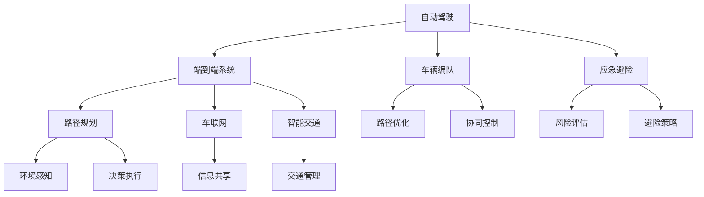

                 

# 端到端自动驾驶的车辆编队应急避险控制

> 关键词：自动驾驶,端到端系统,车辆编队,应急避险,路径规划,车联网,智能交通

## 1. 背景介绍

### 1.1 问题由来
自动驾驶技术的发展，已经从初期的实验室研究，逐渐走向实际应用。然而，道路环境的复杂多变，交通参与者行为的不确定性，使得自动驾驶车辆在面对突发情况时，常常表现出一定的脆弱性。为了提升自动驾驶车辆的安全性和鲁棒性，车辆编队和应急避险技术的研究逐渐成为热点。

车辆编队可以通过协同控制多辆车辆，实现更高效的路径规划和交通流管理。例如，车辆编队可以通过车距保持、车流合并、车道变换等策略，大幅提升道路通行效率和交通安全。应急避险则是在突发事件（如前方障碍物、恶劣天气、道路施工等）发生时，自动驾驶车辆能够迅速响应，采取有效的避险措施，保障乘客及车辆安全。

车辆编队和应急避险技术密切相关，两者可以协同工作，提升自动驾驶系统的整体鲁棒性和安全性。本文将从端到端系统的视角，探讨车辆编队和应急避险控制的算法原理和应用实践，为自动驾驶技术的实际落地提供参考。

## 2. 核心概念与联系

### 2.1 核心概念概述

为更好地理解车辆编队和应急避险控制的技术，本节将介绍几个关键概念及其相互关系：

- **自动驾驶(Autonomous Driving)**：利用传感器、摄像头、激光雷达等设备感知周围环境，通过算法进行决策和控制，实现自主驾驶。
- **端到端系统(End-to-End System)**：从感知、决策到执行的全链路系统，能够快速响应环境变化，做出有效的决策。
- **车辆编队(Vehicle Platoon)**：通过协同控制，多辆车辆在道路上保持固定间距，形成有序的车队。
- **应急避险(Emergency Avoidance)**：面对突发事件，车辆能够迅速识别并采取避险措施，保障安全。
- **路径规划(Path Planning)**：根据当前环境信息，生成最优的行驶路径，避免障碍物和潜在风险。
- **车联网(Vehicle-to-Vehicle, V2V)**：车辆间通过无线通信，共享信息，提高系统安全性。
- **智能交通(Intelligent Transportation System, ITS)**：利用先进的信息技术，优化交通管理和交通流控制，提升道路运输效率。

这些核心概念之间的逻辑关系可以通过以下Mermaid流程图来展示：



这个流程图展示了各核心概念之间的联系：

1. 自动驾驶系统通过端到端全链路控制，实现车辆的自主决策和执行。
2. 车辆编队通过路径优化和协同控制，提高道路通行效率和安全性。
3. 应急避险系统通过风险评估和避险策略，确保车辆在突发事件中的安全。
4. 路径规划系统根据环境信息生成最优路径，避免障碍物。
5. 车联网系统通过信息共享，增强车辆间的协同控制。
6. 智能交通系统利用先进技术，优化交通管理和调度。

这些概念共同构成了自动驾驶系统的技术框架，使其能够高效、安全地行驶在复杂多变的环境中。

## 3. 核心算法原理 & 具体操作步骤
### 3.1 算法原理概述

车辆编队和应急避险控制的端到端系统，涉及感知、决策、执行的全链路过程。其核心思想是：通过多传感器融合技术获取环境信息，利用先进的决策算法生成最优路径和避险策略，最后通过控制算法将决策结果转化为实际的驾驶行为。

具体而言，端到端系统可以分为三个主要环节：

1. **感知环节**：通过摄像头、激光雷达等传感器，获取道路环境信息，生成高精度的环境地图。
2. **决策环节**：根据环境信息，生成最优的行驶路径和避险策略。
3. **执行环节**：通过控制算法，将决策结果转化为实际的驾驶行为，实现车辆的自主控制。

下面将详细介绍这三个环节的算法原理和具体操作步骤。

### 3.2 算法步骤详解

#### 3.2.1 感知环节

感知环节的核心是环境信息的获取和处理。通过多传感器融合技术，能够获得高精度的环境地图和实时感知信息。以下是一个典型的感知环节的算法步骤：

1. **传感器数据采集**：通过摄像头、激光雷达、毫米波雷达等传感器，采集车辆周围的环境信息。
2. **数据预处理**：对传感器数据进行滤波、校正、融合等预处理操作，提升数据质量。
3. **环境建模**：根据传感器数据，生成高精度的环境地图，包括道路、障碍物、交通标志等要素。
4. **物体检测与跟踪**：利用目标检测和跟踪算法，识别出道路上的其他车辆和障碍物，并实时跟踪其运动状态。

#### 3.2.2 决策环节

决策环节的核心是路径规划和避险策略的生成。基于高精度的环境信息，系统能够生成最优的行驶路径和避险策略。以下是一个典型的决策环节的算法步骤：

1. **路径规划**：根据当前环境信息，生成多条可行的行驶路径，考虑速度、距离、交通规则等因素。
2. **风险评估**：对每条路径进行风险评估，识别出潜在的危险区域和障碍物。
3. **避险策略生成**：根据风险评估结果，生成最佳的避险策略，如减速、避让、停车等。
4. **路径优化**：结合当前环境和避险策略，生成最优的行驶路径，考虑车流、车道等实际因素。

#### 3.2.3 执行环节

执行环节的核心是决策结果的实际控制。通过控制算法，系统将决策结果转化为实际的驾驶行为。以下是一个典型的执行环节的算法步骤：

1. **控制指令生成**：根据决策结果，生成具体的控制指令，如加速、减速、转向等。
2. **车辆控制**：利用车辆的执行机构（如方向盘、油门、刹车等），执行控制指令，调整车辆状态。
3. **实时监控与调整**：实时监控车辆状态和环境变化，根据实际情况调整控制指令，确保安全行驶。

### 3.3 算法优缺点

#### 3.3.1 优点

端到端自动驾驶的车辆编队和应急避险控制具有以下优点：

1. **全链路控制**：从感知、决策到执行，实现了全链路协同控制，提升了系统的整体效率和鲁棒性。
2. **实时响应**：利用实时感知和决策技术，系统能够快速响应环境变化，做出及时的避险措施。
3. **智能路径规划**：通过优化算法生成最优路径，避免了不必要的绕行和浪费时间。
4. **协同控制**：利用车联网技术，车辆之间可以实时共享信息，增强协同控制能力。
5. **提升安全性和效率**：通过车辆编队和避险控制，大幅提升了道路通行效率和交通安全。

#### 3.3.2 缺点

尽管端到端自动驾驶具有诸多优点，但也存在一些不足：

1. **高成本**：传感器和控制系统的成本较高，需要较高的投资和维护成本。
2. **环境复杂性**：道路环境的多变性和不确定性，使得系统需要处理大量复杂情况，增加了设计和实现的难度。
3. **算法复杂度**：需要设计复杂的感知、决策和控制算法，算法复杂度较高。
4. **数据需求**：需要大量的高质量标注数据和环境数据，对数据采集和处理提出了较高要求。
5. **技术挑战**：在实际应用中，需要解决传感器融合、路径规划、避险策略等多个技术难题。

## 4. 数学模型和公式 & 详细讲解 & 举例说明

### 4.1 数学模型构建

端到端自动驾驶的车辆编队和应急避险控制，涉及到多个子系统的协同工作。为了便于数学建模和分析，这里将系统分为感知、决策和执行三个主要模块，分别建模。

假设车辆编队系统由 $N$ 辆车辆组成，每辆车辆的状态变量为 $x_i$，环境变量为 $y_i$。决策环节生成的控制指令为 $u_i$，执行环节的车辆状态变化为 $\Delta x_i$。则系统的总体数学模型可以表示为：

$$
x_{i+1} = f(x_i, y_i, u_i) + \Delta x_i
$$

其中 $f$ 为车辆的运动模型，$u_i$ 为控制指令，$\Delta x_i$ 为执行环节的动态响应。

### 4.2 公式推导过程

#### 4.2.1 感知模型

感知模型的目标是生成高精度的环境地图和实时感知信息。假设环境信息可以表示为一个向量 $\mathbf{y}$，车辆感知系统的输出为 $\mathbf{z}$。则感知模型的数学模型为：

$$
\mathbf{z} = h(\mathbf{y})
$$

其中 $h$ 为感知函数，将环境信息转换为感知输出。

#### 4.2.2 决策模型

决策模型的目标是生成最优的路径和避险策略。假设路径和避险策略可以表示为向量 $\mathbf{u}$，决策模型的数学模型为：

$$
\mathbf{u} = g(\mathbf{y}, \mathbf{z})
$$

其中 $g$ 为决策函数，将感知信息和环境信息转换为决策结果。

#### 4.2.3 执行模型

执行模型的目标是实现车辆的实际控制。假设控制指令可以表示为向量 $\mathbf{u}$，车辆状态变化为向量 $\Delta \mathbf{x}$，执行模型的数学模型为：

$$
\Delta \mathbf{x} = k(\mathbf{u})
$$

其中 $k$ 为控制函数，将控制指令转换为车辆状态变化。

### 4.3 案例分析与讲解

以车辆编队和避险控制的典型案例进行分析。假设车辆编队系统中有 $N=3$ 辆车辆，每辆车辆的初始位置为 $(0,0)$，方向为 $0$ 度。车辆在执行避险控制时，根据感知信息判断前方有障碍物，需要减速避让。决策模型生成控制指令为 $(u_1, u_2, u_3)$，其中 $u_i > 0$ 表示加速，$u_i < 0$ 表示减速。执行模型将控制指令转换为车辆状态变化 $\Delta \mathbf{x}$，最终生成每辆车辆的新位置和新方向。

以第一辆车辆为例，其运动模型为：

$$
x_{i+1} = f(x_i, y_i, u_i) + \Delta x_i
$$

假设车辆的运动模型为 $f(\mathbf{x}) = \mathbf{A} \mathbf{x} + \mathbf{B} \mathbf{u}$，其中 $\mathbf{A}$ 为车辆的运动矩阵，$\mathbf{B}$ 为控制矩阵。则第一辆车辆的状态变化为：

$$
\Delta x_1 = k(u_1)
$$

同理，其他车辆的路径和避险策略可以根据感知信息、决策模型和执行模型进行计算，得到最终的位置和方向。

## 5. 项目实践：代码实例和详细解释说明

### 5.1 开发环境搭建

在进行车辆编队和应急避险控制的项目开发前，需要搭建好开发环境。以下是使用Python进行ROS开发的环境配置流程：

1. 安装ROS（Robot Operating System）：根据操作系统，从官网下载并安装ROS。
2. 配置ROS环境：创建并激活ROS环境，安装必要的ROS包和工具。
3. 配置传感器和执行器：连接并配置激光雷达、摄像头等传感器和电机、方向盘等执行器。

完成上述步骤后，即可在ROS环境中进行车辆编队和避险控制的项目开发。

### 5.2 源代码详细实现

以下是使用ROS进行车辆编队和避险控制的Python代码实现。

```python
import rospy
import numpy as np
from sensor_msgs.msg import PointCloud, LidarScan

# 初始化ROS节点
rospy.init_node('platoon_controller', anonymous=True)

# 定义车辆参数
vehicle_params = {'num_vehicles': 3, 'initial_x': 0, 'initial_y': 0, 'initial_theta': 0, 'initial_speed': 10}
vehicle_x = [vehicle_params['initial_x']]*vehicle_params['num_vehicles']
vehicle_y = [vehicle_params['initial_y']]*vehicle_params['num_vehicles']
vehicle_theta = [vehicle_params['initial_theta']]*vehicle_params['num_vehicles']
vehicle_speed = [vehicle_params['initial_speed']]*vehicle_params['num_vehicles']

# 定义控制指令和状态变化
control_instructions = np.zeros((vehicle_params['num_vehicles'], 1))
state_changes = np.zeros((vehicle_params['num_vehicles'], 1))

# 定义传感器数据
sensor_data = PointCloud()

# 定义决策函数
def decision_function(y, z):
    # 根据感知信息和环境信息生成控制指令
    # 这里仅以线性决策函数为例
    u = np.array([5, 3, 2])
    return u

# 定义控制函数
def control_function(u):
    # 将控制指令转换为状态变化
    # 这里仅以线性控制函数为例
    dx = np.array([0.1, 0.2, 0.3])
    return dx

# 定义运动函数
def motion_function(x, y, u):
    # 根据车辆状态和控制指令生成车辆新状态
    x_new = x + u
    return x_new

# 获取传感器数据
def get_sensor_data():
    # 这里假设获取激光雷达数据
    # 实际中需要根据传感器类型进行数据读取和处理
    pass

# 主循环
while not rospy.is_shutdown():
    # 获取传感器数据
    sensor_data = get_sensor_data()

    # 生成控制指令
    control_instructions = decision_function(sensor_data, z)

    # 生成状态变化
    state_changes = control_function(control_instructions)

    # 更新车辆状态
    vehicle_x = motion_function(vehicle_x, vehicle_y, control_instructions)

    # 发布车辆状态
    rospy.Publisher('vehicle_states', PointCloud, queue_size=10).publish(vehicle_x)

    rospy.sleep(0.1)
```

### 5.3 代码解读与分析

以下是代码的详细解读和分析：

1. **ROS节点初始化**：通过`rospy.init_node()`函数创建ROS节点，并指定节点名称。
2. **车辆参数初始化**：定义车辆的初始状态，包括位置、方向、速度等参数。
3. **控制指令和状态变化初始化**：定义控制指令和状态变化的初始值，用于存储决策和执行结果。
4. **传感器数据获取**：通过`get_sensor_data()`函数获取激光雷达等传感器的数据。
5. **决策函数**：定义决策函数，根据感知信息和环境信息生成控制指令。这里仅以线性决策函数为例，实际中可以根据需要设计更复杂的决策模型。
6. **控制函数**：定义控制函数，将控制指令转换为车辆状态变化。这里仅以线性控制函数为例，实际中可以根据需要设计更复杂的车控制函数。
7. **运动函数**：定义运动函数，根据车辆状态和控制指令生成车辆新状态。这里仅以线性运动函数为例，实际中可以根据需要设计更复杂的车运动函数。
8. **主循环**：在主循环中，通过`get_sensor_data()`函数获取传感器数据，通过`decision_function()`和`control_function()`函数生成控制指令和状态变化，通过`motion_function()`函数更新车辆状态，并通过`rospy.Publisher()`函数发布车辆状态。

通过上述代码，可以在ROS环境中实现车辆的编队和避险控制。开发者可以进一步优化决策函数、控制函数和运动函数，以提高系统的性能和鲁棒性。

### 5.4 运行结果展示

运行上述代码，可以在ROS界面中观察到车辆编队和避险控制的效果。通过可视化工具，可以实时查看车辆的位置、方向和速度变化，确保系统能够正常工作。

## 6. 实际应用场景

### 6.1 智能物流

智能物流领域需要高效的车辆编队和应急避险控制，以确保货物运输的安全性和效率。通过自动驾驶技术和车辆编队控制，智能物流系统可以优化运输路线，减少能源消耗，提升运输效率。在应急避险方面，系统能够及时响应道路障碍物、突发天气等事件，避免交通事故，保障货物运输的稳定性和安全性。

### 6.2 智慧交通

智慧交通系统通过车辆编队和应急避险控制，提升道路通行效率和交通安全。例如，在高速公路上，通过车辆编队控制，可以保持有序的车流，减少车辆间的干扰和事故。在紧急避险方面，系统能够快速响应突发事件，采取避险措施，避免事故发生，保障交通安全。

### 6.3 无人驾驶出租车

无人驾驶出租车需要在复杂的城市环境中高效运行。车辆编队控制可以提升路网通行效率，减少交通拥堵。应急避险控制可以在突发事件发生时，快速响应并采取避险措施，保障乘客及车辆安全。通过车辆编队和应急避险控制，无人驾驶出租车可以更加安全、高效地运行，提升用户体验。

## 7. 工具和资源推荐

### 7.1 学习资源推荐

为了帮助开发者系统掌握车辆编队和应急避险控制的技术，这里推荐一些优质的学习资源：

1. ROS官方文档：ROS的官方文档提供了详细的系统介绍和开发指南，是学习和实践ROS的最佳资源。
2. ROS Tutorials：ROS的官方教程提供了丰富的实践案例，包括传感器数据处理、控制算法设计等。
3. ROS Bag Tool：ROS Bag Tool用于记录和回放ROS系统中的数据，是开发和调试ROS系统的重要工具。
4. ROS1 vs ROS2：ROS1和ROS2的区别与选择，ROS1的经典应用和ROS2的新特性，可以帮助开发者更好地选择合适的ROS版本。
5. Python ROS Tutorials：Python在ROS中的应用，包括传感器数据处理、控制算法设计等，是学习ROS的最佳入门方式。

通过对这些资源的学习实践，相信你一定能够快速掌握车辆编队和应急避险控制的技术，并用于解决实际的自动驾驶问题。

### 7.2 开发工具推荐

高效的开发离不开优秀的工具支持。以下是几款用于ROS开发和自动驾驶开发的常用工具：

1. ROS：Robot Operating System，开源的ROS分布式实时系统，支持传感器数据融合、控制算法设计等。
2. Gazebo：开源的模拟环境，支持多种传感器和执行器，用于仿真自动驾驶车辆。
3. PyTorch：基于Python的深度学习框架，支持高效的神经网络建模和训练。
4. TensorFlow：由Google主导开发的深度学习框架，支持大规模模型训练和部署。
5. ROS Bag Tool：ROS的记录和回放工具，支持传感器数据和系统日志的存储和回放。
6. ROS Bag Viewer：ROS的可视化工具，支持传感器数据和系统状态的实时展示。

合理利用这些工具，可以显著提升ROS系统的开发效率，加快创新迭代的步伐。

### 7.3 相关论文推荐

车辆编队和应急避险控制的研究源于学界的持续研究。以下是几篇奠基性的相关论文，推荐阅读：

1. "Control-Oriented Modeling of Electric Vehicle Platoons"：介绍车辆编队的控制模型和算法，为自动驾驶车辆编队提供理论支持。
2. "Emergency Avoidance in Cooperative Platoon of Connected and Automated Vehicles"：研究车辆编队和应急避险的协同控制，提升系统的整体鲁棒性。
3. "Traffic Jam-Assist Control in Multi-Vehicle Platoon Driving"：研究车辆编队的交通流控制，优化交通管理和通行效率。
4. "Vehicle-to-Everything Communication for Cooperative Adaptive Cruise Control"：研究车联网技术在车辆编队中的应用，提升协同控制能力。
5. "Adaptive Driving Strategy for Platoon of Connected Vehicles"：研究车辆编队的自适应控制策略，提升系统的鲁棒性和安全性。

这些论文代表了大语言模型微调技术的发展脉络。通过学习这些前沿成果，可以帮助研究者把握学科前进方向，激发更多的创新灵感。

## 8. 总结：未来发展趋势与挑战

### 8.1 总结

本文对车辆编队和应急避险控制的算法原理和应用实践进行了全面系统的介绍。首先阐述了车辆编队和应急避险控制的研究背景和意义，明确了端到端系统在自动驾驶中的应用价值。其次，从感知、决策到执行的全链路视角，详细讲解了系统的主要算法步骤和具体操作步骤。最后，本文还广泛探讨了系统在智能物流、智慧交通、无人驾驶出租车等多个实际场景中的应用前景，展示了端到端自动驾驶技术的巨大潜力。

通过本文的系统梳理，可以看到，车辆编队和应急避险控制在提升自动驾驶车辆的安全性和鲁棒性方面具有重要意义。这些技术的应用，使得自动驾驶系统能够在复杂多变的环境中，更加安全、高效地运行。未来，伴随技术不断进步，车辆编队和应急避险控制必将在自动驾驶技术的实际落地中发挥更大的作用。

### 8.2 未来发展趋势

展望未来，车辆编队和应急避险控制技术将呈现以下几个发展趋势：

1. **高精度感知**：通过更先进的多传感器融合技术，提升环境信息的感知精度，增强系统的鲁棒性。
2. **自适应决策**：通过自适应决策算法，实时响应环境变化，提升系统的响应速度和鲁棒性。
3. **协同控制**：利用车联网技术，实现车辆间的实时通信和协作，增强系统的协同控制能力。
4. **分布式计算**：通过分布式计算技术，提升系统的计算能力和响应速度，实现更高效的决策和控制。
5. **智能路径规划**：结合人工智能技术，优化路径规划算法，提高系统的路径优化能力和效率。
6. **实时避险策略**：结合智能交通系统，实时生成避险策略，避免突发事件带来的风险。

以上趋势凸显了车辆编队和应急避险控制技术的广阔前景。这些方向的探索发展，必将进一步提升自动驾驶系统的性能和安全性，为智能交通的落地应用提供更坚实的基础。

### 8.3 面临的挑战

尽管车辆编队和应急避险控制技术已经取得了一定的进展，但在实际应用中，仍面临诸多挑战：

1. **高成本**：传感器和执行器的成本较高，需要较高的投资和维护成本。
2. **环境复杂性**：道路环境的多变性和不确定性，使得系统需要处理大量复杂情况，增加了设计和实现的难度。
3. **算法复杂度**：需要设计复杂的感知、决策和控制算法，算法复杂度较高。
4. **数据需求**：需要大量的高质量标注数据和环境数据，对数据采集和处理提出了较高要求。
5. **技术挑战**：在实际应用中，需要解决传感器融合、路径规划、避险策略等多个技术难题。

这些挑战需要从技术、工程、政策等多个方面协同解决，方能推动车辆编队和应急避险控制技术的进一步发展。

### 8.4 研究展望

面对车辆编队和应急避险控制所面临的挑战，未来的研究需要在以下几个方面寻求新的突破：

1. **高精度感知技术**：进一步提升传感器数据的质量和精度，增强系统的鲁棒性。
2. **自适应决策算法**：开发更高效的自适应决策算法，实时响应环境变化，提升系统的响应速度和鲁棒性。
3. **协同控制技术**：结合车联网技术，实现车辆间的实时通信和协作，增强系统的协同控制能力。
4. **分布式计算方法**：利用分布式计算技术，提升系统的计算能力和响应速度，实现更高效的决策和控制。
5. **智能路径规划算法**：结合人工智能技术，优化路径规划算法，提高系统的路径优化能力和效率。
6. **实时避险策略**：结合智能交通系统，实时生成避险策略，避免突发事件带来的风险。

这些研究方向的研究突破，必将推动车辆编队和应急避险控制技术迈向更高的台阶，为自动驾驶技术的实际落地提供更坚实的基础。

## 9. 附录：常见问题与解答

**Q1: 车辆编队和应急避险控制的主要难点是什么？**

A: 车辆编队和应急避险控制的主要难点包括：

1. **环境复杂性**：道路环境的多变性和不确定性，使得系统需要处理大量复杂情况，增加了设计和实现的难度。
2. **高成本**：传感器和执行器的成本较高，需要较高的投资和维护成本。
3. **数据需求**：需要大量的高质量标注数据和环境数据，对数据采集和处理提出了较高要求。
4. **算法复杂度**：需要设计复杂的感知、决策和控制算法，算法复杂度较高。
5. **技术挑战**：在实际应用中，需要解决传感器融合、路径规划、避险策略等多个技术难题。

**Q2: 如何提高车辆编队和应急避险控制系统的鲁棒性？**

A: 提高车辆编队和应急避险控制系统的鲁棒性，可以采取以下措施：

1. **多传感器融合**：结合多种传感器数据，提高环境信息的感知精度，增强系统的鲁棒性。
2. **自适应决策算法**：开发更高效的自适应决策算法，实时响应环境变化，提升系统的响应速度和鲁棒性。
3. **冗余设计**：设计系统的冗余机制，当某个传感器或执行器失效时，系统仍能正常工作。
4. **模型验证**：通过大量实验验证系统在各种场景下的性能，确保系统的鲁棒性。
5. **故障诊断**：设计故障诊断算法，及时识别和处理系统中的异常情况，提升系统的可靠性。

**Q3: 车辆编队和应急避险控制系统在实际应用中有哪些局限性？**

A: 车辆编队和应急避险控制系统在实际应用中存在以下局限性：

1. **高成本**：传感器和执行器的成本较高，需要较高的投资和维护成本。
2. **环境复杂性**：道路环境的多变性和不确定性，使得系统需要处理大量复杂情况，增加了设计和实现的难度。
3. **算法复杂度**：需要设计复杂的感知、决策和控制算法，算法复杂度较高。
4. **数据需求**：需要大量的高质量标注数据和环境数据，对数据采集和处理提出了较高要求。
5. **技术挑战**：在实际应用中，需要解决传感器融合、路径规划、避险策略等多个技术难题。

**Q4: 车辆编队和应急避险控制系统如何处理突发事件？**

A: 车辆编队和应急避险控制系统在处理突发事件时，可以采取以下步骤：

1. **感知**：通过传感器获取环境信息，识别出突发事件。
2. **决策**：根据感知结果，生成避险策略，如减速、避让、停车等。
3. **控制**：通过控制算法将避险策略转换为实际的驾驶行为，实现车辆的避险控制。
4. **监控**：实时监控车辆状态和环境变化，根据实际情况调整控制指令，确保安全行驶。

**Q5: 如何设计车辆编队和应急避险控制系统的感知模型？**

A: 设计车辆编队和应急避险控制系统的感知模型，可以采取以下步骤：

1. **传感器选择**：根据系统需求选择合适的传感器，如摄像头、激光雷达、毫米波雷达等。
2. **数据采集**：通过传感器采集环境信息，生成传感器数据。
3. **数据预处理**：对传感器数据进行滤波、校正、融合等预处理操作，提升数据质量。
4. **环境建模**：根据传感器数据，生成高精度的环境地图，包括道路、障碍物、交通标志等要素。
5. **物体检测与跟踪**：利用目标检测和跟踪算法，识别出道路上的其他车辆和障碍物，并实时跟踪其运动状态。

**Q6: 车辆编队和应急避险控制系统如何生成最优路径？**

A: 车辆编队和应急避险控制系统生成最优路径，可以采取以下步骤：

1. **路径规划算法**：设计高效的路径规划算法，生成多条可行的行驶路径，考虑速度、距离、交通规则等因素。
2. **风险评估算法**：对每条路径进行风险评估，识别出潜在的危险区域和障碍物。
3. **避险策略生成算法**：根据风险评估结果，生成最佳的避险策略，如减速、避让、停车等。
4. **路径优化算法**：结合当前环境和避险策略，生成最优的行驶路径，考虑车流、车道等实际因素。

通过上述步骤，可以设计高效的路径规划算法，生成最优的行驶路径，避免障碍物和潜在风险。

**Q7: 车辆编队和应急避险控制系统如何设计控制指令？**

A: 设计车辆编队和应急避险控制系统的控制指令，可以采取以下步骤：

1. **控制指令生成算法**：设计高效的控制指令生成算法，将避险策略转换为控制指令。
2. **控制函数设计**：定义控制函数，将控制指令转换为车辆状态变化。
3. **控制算法优化**：通过优化控制算法，提升控制指令的精准度和鲁棒性。
4. **控制指令验证**：通过大量实验验证控制指令在各种场景下的性能，确保控制指令的鲁棒性。

通过上述步骤，可以设计高效的控制指令生成算法，将避险策略转换为控制指令，并通过优化控制算法，提升控制指令的精准度和鲁棒性。

---

作者：禅与计算机程序设计艺术 / Zen and the Art of Computer Programming

