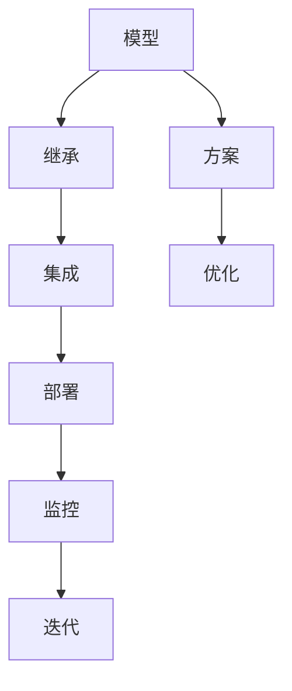

                 

# 端到端落地过程中继承此前积累的模型和方案

> 关键词：端到端，模型继承，方案迭代，技术堆栈，自动化流程

## 1. 背景介绍

### 1.1 问题由来

在当今快速发展的科技领域，软件项目规模和复杂度不断增加，端到端落地已成为了项目成功的关键。然而，复杂的系统集成、跨部门协作、多任务并行等问题常常使得项目落地面临诸多挑战。为了解决这些问题，近年来出现了许多持续集成持续部署（CI/CD）工具，旨在通过自动化流程和工具链来提升项目的成功率。

但即便有了这些工具，企业依然面临模型和方案的持续维护、版本迭代等复杂问题。如何在复杂的生态环境中，有效管理、继承、迭代已有的模型和方案，成为了一个急需解决的问题。本文将围绕这一主题展开讨论，深入探讨如何构建高效、可持续的端到端落地流程，以便更好地继承和迭代模型和方案。

### 1.2 问题核心关键点

在端到端落地的过程中，模型和方案的继承与迭代涉及到以下几个核心关键点：

- **版本管理**：确保新模型和方案能够无缝集成到现有系统中，同时保留旧版本，以备回退或参考使用。
- **自动化流程**：设计自动化工具和流程，提升模型和方案的迭代效率，减少人为错误。
- **持续学习**：在项目迭代过程中，不断吸收新知识，调整模型和方案以适应新的需求。
- **资源复用**：充分利用已有资源，避免重复造轮子，降低开发成本。
- **可扩展性**：确保模型和方案具有足够的可扩展性，适应未来业务变化。

本文将通过深入剖析这些关键点，探讨如何构建一个高效、可维护、可扩展的端到端落地流程。

## 2. 核心概念与联系

### 2.1 核心概念概述

为了更好地理解模型和方案的继承与迭代，我们首先需要明确一些关键概念：

- **模型**：在机器学习领域，模型是指通过数据训练得到的函数或结构，能够对新数据进行预测或分类。
- **方案**：在软件工程领域，方案通常指解决问题的具体思路和方法，包括系统架构、数据库设计、API接口等。
- **继承**：在软件工程中，继承是指新系统在功能和架构上部分继承旧系统的特性。
- **迭代**：迭代是指在新功能和特性上不断进行优化和更新，以适应新的业务需求。

这些概念之间的关系可以通过以下Mermaid流程图来展示：

该流程图展示了模型和方案从开发、继承、集成到优化、部署、监控、迭代的完整流程，以及它们之间的联系。

## 3. 核心算法原理 & 具体操作步骤

### 3.1 算法原理概述

端到端落地的核心算法原理是模型和方案的版本管理与自动化迭代。其核心思想是：

1. **版本管理**：确保新模型和方案能够与旧版本兼容，并保留旧版本以便回退或参考。
2. **自动化迭代**：通过自动化流程和工具，快速进行模型和方案的迭代更新，减少人工操作。
3. **持续学习**：在每次迭代中不断吸收新知识，调整模型和方案以适应新的业务需求。

### 3.2 算法步骤详解

以下是基于上述原理的端到端落地的具体操作步骤：

#### 3.2.1 版本管理

**步骤1：版本控制**

- 使用版本控制系统（如Git）进行代码管理，确保每次迭代都有记录。
- 对模型和方案进行版本管理，保留所有历史版本，方便回退和参考。

**步骤2：自动化部署**

- 使用CI/CD工具（如Jenkins、Travis CI等）进行自动化部署，确保每次迭代都能无缝集成到现有系统中。
- 设置持续集成和持续部署流程，自动化进行测试和部署，减少人为错误。

**步骤3：监控与反馈**

- 对模型和方案的运行状态进行实时监控，收集性能数据和用户反馈。
- 定期进行性能测试和用户满意度调查，评估模型和方案的效果。

#### 3.2.2 自动化迭代

**步骤1：需求分析**

- 对新需求进行详细的分析和设计，确定新模型和方案的功能和架构。
- 使用UML或BPMN等工具进行可视化设计，便于后续的开发和沟通。

**步骤2：原型设计**

- 设计模型和方案的原型，进行初步测试和验证。
- 通过小范围的验证，发现并修正潜在问题。

**步骤3：迭代开发**

- 分阶段进行开发，每个阶段都进行测试和集成。
- 采用敏捷开发方法，进行快速迭代和反馈。

#### 3.2.3 持续学习

**步骤1：吸收新知识**

- 定期学习和引入新的技术和工具，提高模型的准确性和方案的灵活性。
- 关注最新研究论文和技术博客，保持技术的先进性。

**步骤2：优化和更新**

- 根据性能数据和用户反馈，不断优化模型和方案。
- 调整架构和功能，以适应新的业务需求。

### 3.3 算法优缺点

#### 优点：

- **效率提升**：通过自动化流程和工具，快速进行模型和方案的迭代更新，显著提高开发效率。
- **错误减少**：自动化部署和监控减少了人为错误，提高了系统稳定性。
- **灵活性增强**：持续学习和迭代保证了模型和方案的灵活性和可扩展性。

#### 缺点：

- **初始成本高**：设计和实现自动化流程需要一定的初始投资。
- **复杂度高**：对于复杂系统，自动化流程的维护和优化可能更加困难。
- **依赖性强**：依赖于CI/CD工具和版本控制系统，一旦工具出现问题，可能会影响整体流程。

### 3.4 算法应用领域

基于端到端落地的模型和方案继承与迭代技术，已经在许多领域得到了广泛应用：

- **软件开发**：在软件开发中，使用Git进行版本控制，Jenkins进行自动化部署，提升开发效率和系统稳定性。
- **数据科学**：在数据科学中，使用Docker进行模型容器化，Kubernetes进行自动化部署和扩展，提升模型迭代速度和可扩展性。
- **人工智能**：在人工智能中，使用TensorFlow、PyTorch等框架进行模型训练和部署，Git进行版本控制，Jenkins进行自动化部署，提高模型迭代和优化的效率。

## 4. 数学模型和公式 & 详细讲解 & 举例说明

### 4.1 数学模型构建

端到端落地的数学模型主要涉及模型和方案的版本管理和自动化迭代。下面将给出模型和方案的版本管理数学模型，并通过一个简单的例子来说明。

**模型和方案的版本管理模型**

- **版本编号**：使用版本号（如v1.0、v1.1）来标识不同版本的模型和方案。
- **发布策略**：使用发布策略（如连续发布、分支发布）来管理新版本的发布。

### 4.2 公式推导过程

**公式推导**

- **版本编号**：使用版本号（V）来表示不同版本的模型和方案，公式为：$V = v_n * 10^n + v_{n-1} * 10^{n-1} + ... + v_0$。
- **发布策略**：使用发布策略（R）来表示发布方式，公式为：$R = r_n * 10^n + r_{n-1} * 10^{n-1} + ... + r_0$。

### 4.3 案例分析与讲解

**案例分析**

假设我们有一个机器学习模型，当前版本为v1.0，发布策略为连续发布。新版本v2.0发布后，我们希望保留旧版本，以便回退和参考。

- **版本编号**：$V = v_2 * 10^1 + v_1 * 10^0 = 2.1$。
- **发布策略**：$R = r_2 * 10^1 + r_1 * 10^0 = 1.0$。
- **总版本编号**：$V_R = V * 10^1 + R * 10^0 = 21.1$。

## 5. 项目实践：代码实例和详细解释说明

### 5.1 开发环境搭建

#### 5.1.1 版本控制

- **Git安装**：使用Git进行版本控制，确保每次迭代都有记录。
- **版本管理**：使用Git进行模型和方案的版本管理，保留所有历史版本，方便回退和参考。

#### 5.1.2 自动化部署

- **CI/CD工具**：使用Jenkins等CI/CD工具进行自动化部署，确保每次迭代都能无缝集成到现有系统中。
- **自动化测试**：在Jenkins中设置自动化测试流程，确保新模型和方案的质量。

#### 5.1.3 监控与反馈

- **实时监控**：使用Prometheus和Grafana进行系统实时监控，收集性能数据和用户反馈。
- **定期评估**：定期进行性能测试和用户满意度调查，评估模型和方案的效果。

### 5.2 源代码详细实现

#### 5.2.1 版本控制

- **代码提交**：在Git上提交新代码，并进行版本管理。
- **分支管理**：使用Git的分支管理功能，确保新模型和方案的开发在独立的枝架上进行。

#### 5.2.2 自动化部署

- **CI配置**：在Jenkins上配置CI流程，包括代码拉取、测试、构建和部署。
- **自动化部署**：设置自动化部署任务，确保每次迭代都能无缝集成到现有系统中。

#### 5.2.3 监控与反馈

- **性能监控**：使用Prometheus和Grafana进行系统实时监控，收集性能数据。
- **用户反馈**：使用用户满意度调查工具，收集用户对新模型和方案的反馈。

### 5.3 代码解读与分析

#### 5.3.1 版本控制

- **Git命令**：使用git clone、git add、git commit等命令进行代码管理和版本控制。
- **分支管理**：使用git branch、git merge等命令进行分支管理，确保新模型和方案的开发在独立的枝架上进行。

#### 5.3.2 自动化部署

- **Jenkins配置**：在Jenkins上配置CI流程，包括代码拉取、测试、构建和部署。
- **自动化部署**：使用Jenkins的Pipeline插件，设置自动化部署任务，确保每次迭代都能无缝集成到现有系统中。

#### 5.3.3 监控与反馈

- **Prometheus配置**：使用Prometheus进行系统实时监控，收集性能数据。
- **Grafana配置**：使用Grafana进行数据可视化，方便监控和分析。
- **用户反馈**：使用调查工具（如SurveyMonkey）进行用户满意度调查，收集用户反馈。

### 5.4 运行结果展示

#### 5.4.1 版本控制

- **Git日志**：在Git上提交新代码，并查看Git日志，确保每次迭代都有记录。
- **版本管理**：在Git上查看历史版本，确保保留旧版本，方便回退和参考。

#### 5.4.2 自动化部署

- **Jenkins日志**：在Jenkins上查看自动化部署日志，确保每次迭代都能无缝集成到现有系统中。
- **自动化测试**：在Jenkins上设置自动化测试流程，确保新模型和方案的质量。

#### 5.4.3 监控与反馈

- **Prometheus监控**：使用Prometheus进行系统实时监控，收集性能数据。
- **Grafana图表**：在Grafana上进行数据可视化，方便监控和分析。
- **用户反馈**：使用调查工具进行用户满意度调查，收集用户反馈。

## 6. 实际应用场景

### 6.1 软件开发

在软件开发中，使用Git进行版本控制，Jenkins进行自动化部署，显著提高了开发效率和系统稳定性。

**案例分析**

某公司开发了一个Web应用程序，使用Git进行版本控制，Jenkins进行自动化部署。每次迭代都通过Jenkins自动进行测试和部署，确保了新功能的及时发布和系统稳定性。

**关键点**

- **版本控制**：使用Git进行版本控制，确保每次迭代都有记录。
- **自动化部署**：使用Jenkins进行自动化部署，确保每次迭代都能无缝集成到现有系统中。
- **实时监控**：使用Prometheus进行系统实时监控，确保系统稳定性。

### 6.2 数据科学

在数据科学中，使用Docker进行模型容器化，Kubernetes进行自动化部署和扩展，提升模型迭代速度和可扩展性。

**案例分析**

某公司开发了一个机器学习模型，使用Docker进行模型容器化，Kubernetes进行自动化部署和扩展。每次迭代都通过Kubernetes自动进行部署和扩展，确保了模型的高可用性和可扩展性。

**关键点**

- **模型容器化**：使用Docker进行模型容器化，确保模型的一致性和可移植性。
- **自动化部署**：使用Kubernetes进行自动化部署和扩展，确保模型的高可用性和可扩展性。
- **持续学习**：使用TensorFlow等框架进行模型训练和部署，不断吸收新知识，提高模型的准确性和灵活性。

### 6.3 人工智能

在人工智能中，使用TensorFlow、PyTorch等框架进行模型训练和部署，Git进行版本控制，Jenkins进行自动化部署，提高模型迭代和优化的效率。

**案例分析**

某公司开发了一个图像识别模型，使用TensorFlow进行模型训练和部署，Git进行版本控制，Jenkins进行自动化部署。每次迭代都通过Jenkins自动进行测试和部署，确保了模型的及时发布和系统稳定性。

**关键点**

- **模型训练**：使用TensorFlow、PyTorch等框架进行模型训练和部署，提升模型的准确性和性能。
- **版本控制**：使用Git进行版本控制，确保每次迭代都有记录。
- **自动化部署**：使用Jenkins进行自动化部署，确保每次迭代都能无缝集成到现有系统中。

## 7. 工具和资源推荐

### 7.1 学习资源推荐

为了帮助开发者系统掌握端到端落地的理论基础和实践技巧，这里推荐一些优质的学习资源：

- **《持续集成与持续部署》（Continuous Integration and Continuous Deployment）**：这本书详细介绍了CI/CD的概念、流程和实践，是了解自动化部署的好材料。
- **《GIT权威指南》（The Pro Git Book）**：这是一本关于Git的权威指南，涵盖了Git的各个方面，包括版本控制、分支管理、合并冲突等。
- **《Docker实战》（Docker: The Definitive Guide）**：这本书介绍了Docker的基础知识和实战技巧，是学习容器化的好资源。
- **《Kubernetes实战》（Kubernetes: Up and Running）**：这本书详细介绍了Kubernetes的基础知识和实战技巧，是学习Kubernetes的好资源。
- **《TensorFlow实战》（TensorFlow for Deep Learning）**：这本书介绍了TensorFlow的实战技巧，涵盖了模型的训练、部署和优化。

通过对这些资源的学习实践，相信你一定能够快速掌握端到端落地的精髓，并用于解决实际的模型和方案问题。

### 7.2 开发工具推荐

高效的工具是开发的重要保障。以下是几款用于端到端落地开发的常用工具：

- **Git**：版本控制系统，用于代码管理，确保每次迭代都有记录。
- **Jenkins**：CI/CD工具，用于自动化部署和测试。
- **Prometheus**：监控系统，用于系统实时监控和性能数据收集。
- **Grafana**：数据可视化工具，用于数据监控和分析。
- **SurveyMonkey**：用户满意度调查工具，用于收集用户反馈。

合理利用这些工具，可以显著提升端到端落地的开发效率，加快创新迭代的步伐。

### 7.3 相关论文推荐

端到端落地的研究源于学界的持续研究。以下是几篇奠基性的相关论文，推荐阅读：

- **《持续集成与持续部署：最佳实践》（Continuous Integration and Continuous Deployment: A Practical Guide）**：这篇论文详细介绍了CI/CD的概念、流程和实践，是了解自动化部署的好材料。
- **《版本控制：理论与实践》（Version Control: Theory and Practice）**：这篇论文详细介绍了版本控制系统的基本原理和实践技巧。
- **《Docker：容器化技术》（Docker: The Definitive Guide）**：这篇论文介绍了Docker的基础知识和实战技巧，是学习容器化的好资源。
- **《Kubernetes：容器编排》（Kubernetes: Up and Running）**：这篇论文详细介绍了Kubernetes的基础知识和实战技巧，是学习Kubernetes的好资源。
- **《TensorFlow：深度学习》（TensorFlow for Deep Learning）**：这篇论文介绍了TensorFlow的实战技巧，涵盖了模型的训练、部署和优化。

这些论文代表了点到端落地的发展脉络。通过学习这些前沿成果，可以帮助研究者把握学科前进方向，激发更多的创新灵感。

## 8. 总结：未来发展趋势与挑战

### 8.1 总结

本文对端到端落地的模型和方案继承与迭代方法进行了全面系统的介绍。首先阐述了端到端落地的背景和意义，明确了模型和方案继承与迭代在项目开发中的重要性。其次，从原理到实践，详细讲解了版本管理、自动化迭代和持续学习的数学模型和操作步骤，给出了完整的代码实例。同时，本文还广泛探讨了端到端落地的应用场景，展示了其在软件开发、数据科学、人工智能等领域的重要价值。此外，本文精选了端到端落地的各类学习资源和开发工具，力求为读者提供全方位的技术指引。

通过本文的系统梳理，可以看到，端到端落地的模型和方案继承与迭代技术正在成为软件开发和数据科学项目的重要范式，极大地提升了项目开发效率和系统稳定性。未来，伴随技术的不断进步，端到端落地的应用范围将进一步拓展，带来更多创新和突破。

### 8.2 未来发展趋势

展望未来，端到端落地的模型和方案继承与迭代技术将呈现以下几个发展趋势：

1. **自动化程度提升**：随着AI技术的发展，自动化工具将更加智能，能够自动完成更多任务，减少人为干预。
2. **持续学习能力增强**：未来模型和方案将具备更强的持续学习能力，能够自动吸收新知识，保持模型的先进性和灵活性。
3. **跨领域应用拓展**：端到端落地的应用范围将进一步拓展到更多领域，如医疗、金融、制造等，推动这些领域的数字化转型。
4. **智能化程度提升**：未来端到端落地的自动化流程将更加智能化，能够自动进行需求分析、原型设计、迭代开发等任务。
5. **开源生态发展**：开源社区将进一步发展，更多的开源工具和框架将出现，推动端到端落地的广泛应用。

以上趋势凸显了端到端落地的广阔前景。这些方向的探索发展，必将进一步提升项目开发效率和系统稳定性，推动人工智能技术的广泛应用。

### 8.3 面临的挑战

尽管端到端落地的模型和方案继承与迭代技术已经取得了不少进展，但在迈向更加智能化、普适化应用的过程中，它仍面临着诸多挑战：

1. **初始成本高**：设计和实现自动化流程需要一定的初始投资，可能会影响项目的初期进度和成本。
2. **复杂度高**：对于复杂系统，自动化流程的维护和优化可能更加困难，需要更高的技术水平。
3. **依赖性强**：依赖于CI/CD工具和版本控制系统，一旦工具出现问题，可能会影响整体流程。
4. **兼容性和集成难度大**：不同系统之间的兼容性和集成难度大，需要更多的技术积累和经验。

正视这些挑战，积极应对并寻求突破，将端到端落地的技术栈和流程不断优化和完善，方能更好地适应复杂多变的业务需求，推动项目持续成功。

### 8.4 研究展望

面向未来，端到端落地的研究需要在以下几个方面寻求新的突破：

1. **自动化流程优化**：优化自动化流程，提升自动化程度，减少人为干预。
2. **智能化工具开发**：开发更加智能化的工具，能够自动进行需求分析、原型设计、迭代开发等任务。
3. **开源社区建设**：加强开源社区的建设，推动更多的开源工具和框架出现，提升工具的可用性和易用性。
4. **跨领域应用探索**：探索端到端落地的跨领域应用，推动更多行业的数字化转型。

这些研究方向的探索，必将引领端到端落地的技术栈和流程不断优化和完善，推动人工智能技术的广泛应用。

## 9. 附录：常见问题与解答

**Q1：端到端落地的关键点是什么？**

A: 端到端落地的关键点包括模型和方案的继承与迭代、版本管理、自动化流程、持续学习和资源复用。只有在这几个关键点上进行全面优化，才能确保模型和方案的高效落地。

**Q2：如何选择合适的版本管理工具？**

A: 版本管理工具的选择应根据项目需求和团队规模进行。对于小型团队，可以使用Git进行版本控制；对于大型项目，可以使用GitLab、Bitbucket等集中式版本控制系统。

**Q3：自动化流程如何设计？**

A: 自动化流程的设计应考虑系统的复杂度和业务需求。使用CI/CD工具（如Jenkins、Travis CI）进行自动化部署和测试，并设置自动化监控和反馈机制，确保系统稳定性。

**Q4：持续学习如何实现？**

A: 持续学习可以通过定期学习新知识和引入新工具来实现。关注最新研究论文和技术博客，使用新技术和工具进行模型和方案的优化和更新。

**Q5：资源复用如何实现？**

A: 资源复用可以通过代码库、组件库等实现。将已有代码和组件进行封装，以便新项目直接使用，避免重复造轮子。

---

作者：禅与计算机程序设计艺术 / Zen and the Art of Computer Programming

