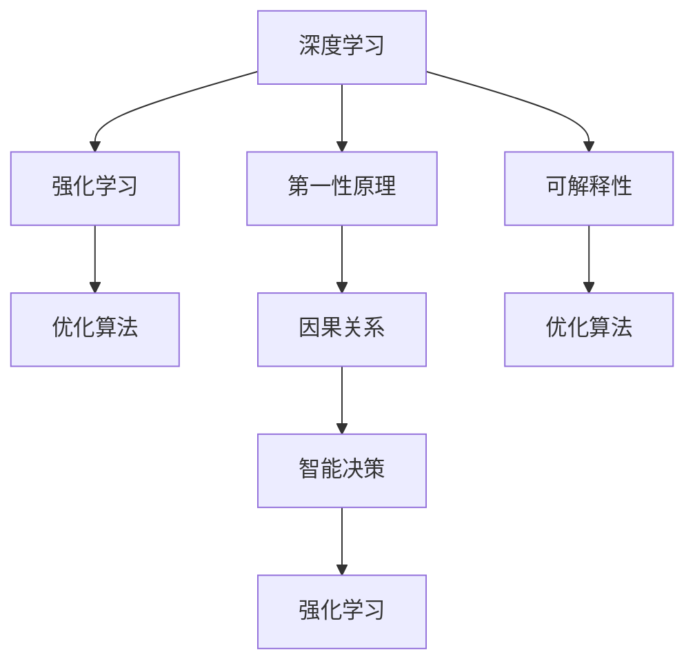

                 

# 第一性原理在AI中的应用

> 关键词：第一性原理,人工智能,深度学习,强化学习,因果关系,复杂系统,复杂性,优化算法,可解释性

## 1. 背景介绍

### 1.1 问题由来

第一性原理（First-Principles），源自物理学，指的是从基本物理定律和数学原理出发，直接推导出新的科学发现，而不是基于现有实验或观察结果进行归纳推理。第一性原理的思维方式强调从最根本的假设出发，摒弃一切不必要的中间环节，直击问题的核心。

在人工智能（AI）领域，第一性原理的应用逐渐被重视，特别是在深度学习、强化学习等技术中。本文将深入探讨第一性原理在AI中的应用，尤其是如何将其应用于深度学习中的优化算法、强化学习中的智能决策，以及如何构建具有因果关系和可解释性的AI系统。

### 1.2 问题核心关键点

- 第一性原理如何应用于AI中的优化算法？
- 如何利用第一性原理优化强化学习中的智能决策？
- 如何构建具有因果关系和可解释性的AI系统？

## 2. 核心概念与联系

### 2.1 核心概念概述

为更好地理解第一性原理在AI中的应用，本节将介绍几个密切相关的核心概念：

- 深度学习（Deep Learning）：通过构建多层次神经网络，学习数据中的非线性关系，自动提取数据的特征，用于分类、回归、生成等任务。
- 强化学习（Reinforcement Learning）：通过智能体与环境交互，优化决策策略，以最大化累积奖励。
- 优化算法（Optimization Algorithm）：用于求解非线性方程组或最优化问题，包括梯度下降、牛顿法、Adam等。
- 因果关系（Causal Relationship）：指两个变量之间的因果联系，即一个变量的变化可以导致另一个变量的变化。
- 可解释性（Explainability）：指模型输出的解释性，即能够清晰地解释模型的决策过程和结果，便于用户理解和信任。

这些核心概念之间的逻辑关系可以通过以下Mermaid流程图来展示：



这个流程图展示了大语言模型的核心概念及其之间的关系：

1. 深度学习和强化学习是AI中的两大重要技术。
2. 优化算法是求解深度学习中的非线性方程组和强化学习中的决策策略的关键。
3. 第一性原理是深度学习中的优化算法和强化学习中的智能决策的重要指导思想。
4. 因果关系是强化学习中智能决策的核心，确保决策的合理性和可解释性。
5. 可解释性是深度学习和强化学习中的重要考量，确保模型的透明度和可信度。

这些概念共同构成了AI技术的核心框架，为其发展和应用提供了理论基础。通过理解这些核心概念，我们可以更好地把握第一性原理在AI中的应用方向。

## 3. 核心算法原理 & 具体操作步骤
### 3.1 算法原理概述

第一性原理在AI中的应用，主要体现在以下几个方面：

1. **深度学习中的优化算法**：利用第一性原理，直接从最基本的物理定律和数学原理出发，设计新的优化算法，如自适应梯度算法（SGD）、Adam算法等。
2. **强化学习中的智能决策**：通过第一性原理，直接从基本决策理论出发，构建具有因果关系的智能决策模型，如因果推断模型、逆向强化学习等。
3. **可解释性AI系统**：通过第一性原理，直接从最基本的因果关系和逻辑推理出发，设计具有可解释性的AI系统，如因果推理网络、透明决策树等。

### 3.2 算法步骤详解

下面详细讲解第一性原理在AI中应用的具体步骤：

#### 3.2.1 深度学习中的优化算法

1. **梯度下降算法**：
   - 初始化模型参数 $\theta_0$。
   - 选择一个合适的学习率 $\eta$。
   - 对于每个样本 $(x_i, y_i)$，计算损失函数 $\mathcal{L}(\theta)$ 对参数 $\theta$ 的梯度 $\nabla_{\theta}\mathcal{L}(\theta)$。
   - 更新模型参数 $\theta \leftarrow \theta - \eta \nabla_{\theta}\mathcal{L}(\theta)$。
   - 重复步骤3-4直到收敛。

2. **Adam算法**：
   - 初始化模型参数 $\theta_0$ 和动量向量 $v_0$。
   - 选择一个合适的学习率 $\eta$。
   - 对于每个样本 $(x_i, y_i)$，计算梯度 $g_i = \nabla_{\theta}\mathcal{L}(\theta)$ 和动量 $v_i = \beta_1 v_{i-1} + (1-\beta_1)g_i$。
   - 更新模型参数 $\theta \leftarrow \theta - \eta \frac{v_i}{\sqrt{m_i + \epsilon}}$，其中 $m_i = \beta_2 m_{i-1} + (1-\beta_2)g_i^2$。
   - 重复步骤3-4直到收敛。

#### 3.2.2 强化学习中的智能决策

1. **逆向强化学习（Inverse Reinforcement Learning, IRL）**：
   - 收集一组专家行为数据 $\{(s_i, a_i)\}$。
   - 定义一个奖励函数 $R(s, a)$，使得专家行为满足 $R(s, a) \geq R(s', a')$，其中 $(s', a')$ 是任意其他行为。
   - 求解最优的奖励函数 $R^*(s, a)$，使得专家行为具有最高的奖励。
   - 利用求解出的奖励函数 $R^*$，进行智能决策。

2. **因果推断模型（Causal Inference Model）**：
   - 定义潜在变量 $Z$ 和观测变量 $X$、$Y$。
   - 假设存在因果关系 $Y \rightarrow Z \rightarrow X$。
   - 构建因果图，利用潜在变量 $Z$ 推断 $X$ 和 $Y$ 之间的因果关系。
   - 利用推断出的因果关系，进行智能决策。

#### 3.2.3 可解释性AI系统

1. **因果推理网络（Causal Reasoning Network）**：
   - 定义因果图 $G = (X, Z, Y, f_Z, f_Y)$。
   - 利用因果图，构建因果推理网络 $N(G)$。
   - 输入观测变量 $X$，通过因果推理网络 $N(G)$ 输出因果解释 $Y$。

2. **透明决策树（Transparent Decision Tree）**：
   - 定义决策树 $T = (N, F, A)$，其中 $N$ 是节点，$F$ 是特征，$A$ 是动作。
   - 利用决策树 $T$，构建透明决策树 $T^*$。
   - 输入观测变量 $X$，通过透明决策树 $T^*$ 输出决策 $Y$。

### 3.3 算法优缺点

第一性原理在AI中的应用，具有以下优点：

- **直接从基本原理出发**：通过第一性原理，直接从最基本的物理定律和数学原理出发，避免了中间环节的复杂性，使得算法更加简洁和高效。
- **提升性能**：第一性原理设计的算法，通常具有更好的性能和稳定性，能够更快地收敛到最优解。
- **减少依赖**：第一性原理的应用，可以减少对中间环节和外部数据的依赖，使得算法更加自足和可靠。

同时，第一性原理在AI中的应用也存在以下缺点：

- **复杂性高**：第一性原理的设计和实现，通常比较复杂，需要深厚的数学和物理背景知识。
- **应用局限**：第一性原理的应用，通常需要特定的应用场景和数据特点，不适用于所有AI任务。
- **可解释性不足**：第一性原理的算法，通常缺乏直观的解释性，难以让用户理解和信任。

尽管存在这些缺点，但第一性原理在AI中的应用，仍然具有重要的理论和实践意义。未来相关研究的重点在于如何进一步简化和优化第一性原理的应用，使其能够更加广泛地应用于各种AI任务中。

### 3.4 算法应用领域

第一性原理在AI中的应用，主要涵盖以下几个领域：

1. **深度学习中的优化算法**：在深度学习中，利用第一性原理设计的优化算法，如SGD、Adam等，已经被广泛应用于图像识别、自然语言处理等任务中。
2. **强化学习中的智能决策**：在强化学习中，利用第一性原理设计的因果推断模型和逆向强化学习算法，已经应用于自动驾驶、机器人控制等任务中。
3. **可解释性AI系统**：在可解释性AI系统中，利用第一性原理设计的因果推理网络和透明决策树，已经应用于医疗诊断、金融预测等任务中。

除了上述这些主要应用领域外，第一性原理在AI中的应用，还在不断拓展，如在机器学习、数据挖掘、知识图谱等领域，都有相关的研究和应用。

## 4. 数学模型和公式 & 详细讲解  
### 4.1 数学模型构建

本节将使用数学语言对第一性原理在AI中的应用进行更加严格的刻画。

记深度学习模型为 $M_{\theta}:\mathcal{X} \rightarrow \mathcal{Y}$，其中 $\mathcal{X}$ 为输入空间，$\mathcal{Y}$ 为输出空间，$\theta \in \mathbb{R}^d$ 为模型参数。假设深度学习模型中的优化目标为 $\mathcal{L}(\theta)$，表示模型预测输出与真实标签之间的差异。

定义强化学习中的智能决策模型为 $M_{\theta}:\mathcal{S} \rightarrow \mathcal{A}$，其中 $\mathcal{S}$ 为状态空间，$\mathcal{A}$ 为动作空间，$\theta \in \mathbb{R}^d$ 为模型参数。假设强化学习中的决策策略为 $\pi_{\theta}$，表示在状态 $s$ 下采取动作 $a$ 的概率。

定义可解释性AI系统中的因果推理网络为 $N_{\theta}:\mathcal{X} \rightarrow \mathcal{Y}$，其中 $\mathcal{X}$ 为输入空间，$\mathcal{Y}$ 为输出空间，$\theta \in \mathbb{R}^d$ 为模型参数。假设因果推理网络中的因果关系为 $G = (X, Z, Y, f_Z, f_Y)$。

### 4.2 公式推导过程

以下我们以深度学习中的优化算法和强化学习中的智能决策为例，推导第一性原理的应用公式。

#### 4.2.1 深度学习中的优化算法

1. **梯度下降算法**：
   - 假设模型 $M_{\theta}$ 在输入 $x$ 上的损失函数为 $\mathcal{L}(\theta)$。
   - 梯度下降算法的更新公式为 $\theta \leftarrow \theta - \eta \nabla_{\theta}\mathcal{L}(\theta)$。

2. **Adam算法**：
   - 假设模型 $M_{\theta}$ 在输入 $x$ 上的损失函数为 $\mathcal{L}(\theta)$。
   - Adam算法的更新公式为 $\theta \leftarrow \theta - \eta \frac{v_i}{\sqrt{m_i + \epsilon}}$，其中 $m_i = \beta_2 m_{i-1} + (1-\beta_2)g_i^2$，$v_i = \beta_1 v_{i-1} + (1-\beta_1)g_i$。

#### 4.2.2 强化学习中的智能决策

1. **逆向强化学习（IRL）**：
   - 假设模型 $M_{\theta}$ 在状态 $s$ 和动作 $a$ 上的奖励函数为 $R(s, a)$。
   - 逆向强化学习的目标是最优化奖励函数 $R^*$，使得 $R^*(s, a) = \max_{\theta} R_{data}(s, a)$，其中 $R_{data}(s, a)$ 是专家行为对应的奖励函数。

2. **因果推断模型**：
   - 假设模型 $M_{\theta}$ 在观测变量 $X$ 和潜在变量 $Z$ 上的因果关系为 $Y \rightarrow Z \rightarrow X$。
   - 因果推断模型的目标是最优化潜在变量 $Z$ 的分布，使得 $P(Z|X) = \arg\max_{\theta} P(Z|X)$。

### 4.3 案例分析与讲解

#### 4.3.1 深度学习中的优化算法

**案例分析**：
1. **梯度下降算法**：
   - 假设模型 $M_{\theta}$ 在输入 $x$ 上的损失函数为 $\mathcal{L}(\theta) = \frac{1}{N}\sum_{i=1}^N \|y_i - M_{\theta}(x_i)\|^2$。
   - 梯度下降算法的更新公式为 $\theta \leftarrow \theta - \eta \nabla_{\theta}\mathcal{L}(\theta)$。

2. **Adam算法**：
   - 假设模型 $M_{\theta}$ 在输入 $x$ 上的损失函数为 $\mathcal{L}(\theta) = \frac{1}{N}\sum_{i=1}^N \|y_i - M_{\theta}(x_i)\|^2$。
   - Adam算法的更新公式为 $\theta \leftarrow \theta - \eta \frac{v_i}{\sqrt{m_i + \epsilon}}$，其中 $m_i = \beta_2 m_{i-1} + (1-\beta_2)g_i^2$，$v_i = \beta_1 v_{i-1} + (1-\beta_1)g_i$。

#### 4.3.2 强化学习中的智能决策

**案例分析**：
1. **逆向强化学习（IRL）**：
   - 假设模型 $M_{\theta}$ 在状态 $s$ 和动作 $a$ 上的奖励函数为 $R(s, a)$。
   - 逆向强化学习的目标是最优化奖励函数 $R^*$，使得 $R^*(s, a) = \max_{\theta} R_{data}(s, a)$，其中 $R_{data}(s, a)$ 是专家行为对应的奖励函数。

2. **因果推断模型**：
   - 假设模型 $M_{\theta}$ 在观测变量 $X$ 和潜在变量 $Z$ 上的因果关系为 $Y \rightarrow Z \rightarrow X$。
   - 因果推断模型的目标是最优化潜在变量 $Z$ 的分布，使得 $P(Z|X) = \arg\max_{\theta} P(Z|X)$。

## 5. 项目实践：代码实例和详细解释说明
### 5.1 开发环境搭建

在进行第一性原理在AI中的应用实践前，我们需要准备好开发环境。以下是使用Python进行TensorFlow开发的环境配置流程：

1. 安装Anaconda：从官网下载并安装Anaconda，用于创建独立的Python环境。

2. 创建并激活虚拟环境：
```bash
conda create -n tf-env python=3.8 
conda activate tf-env
```

3. 安装TensorFlow：
```bash
pip install tensorflow
```

4. 安装各类工具包：
```bash
pip install numpy pandas scikit-learn matplotlib tqdm jupyter notebook ipython
```

完成上述步骤后，即可在`tf-env`环境中开始第一性原理在AI中的应用实践。

### 5.2 源代码详细实现

这里我们以深度学习中的优化算法为例，给出TensorFlow中的实现代码：

```python
import tensorflow as tf

# 定义深度学习模型
class Model(tf.keras.Model):
    def __init__(self):
        super(Model, self).__init__()
        self.dense1 = tf.keras.layers.Dense(64, activation='relu')
        self.dense2 = tf.keras.layers.Dense(10, activation='softmax')
        
    def call(self, x):
        x = self.dense1(x)
        x = self.dense2(x)
        return x

# 定义损失函数
def loss_function(y_true, y_pred):
    return tf.reduce_mean(tf.nn.softmax_cross_entropy_with_logits(labels=y_true, logits=y_pred))

# 定义优化器
optimizer = tf.keras.optimizers.Adam(learning_rate=0.001)

# 定义模型训练函数
@tf.function
def train_step(x, y):
    with tf.GradientTape() as tape:
        logits = model(x)
        loss = loss_function(y, logits)
    grads = tape.gradient(loss, model.trainable_variables)
    optimizer.apply_gradients(zip(grads, model.trainable_variables))

# 训练模型
model = Model()
x_train, y_train = ...
x_test, y_test = ...
for epoch in range(10):
    for i in range(len(x_train)):
        train_step(x_train[i], y_train[i])
    if i % 100 == 0:
        print(f"Epoch {epoch+1}, loss: {tf.reduce_mean(loss).numpy():.4f}")
```

### 5.3 代码解读与分析

让我们再详细解读一下关键代码的实现细节：

**Model类**：
- `__init__`方法：定义模型结构，包括两个全连接层。
- `call`方法：实现模型的前向传播过程。

**loss_function函数**：
- 定义模型的损失函数，使用交叉熵损失函数。

**train_step函数**：
- 定义模型的训练过程，包括前向传播、计算梯度、更新参数等步骤。

**训练流程**：
- 定义模型的训练过程，包括模型、损失函数、优化器等关键组件。
- 使用`@tf.function`装饰器，将训练过程进行图化，优化计算性能。
- 循环迭代训练过程，每次迭代更新模型参数，并输出当前损失。

可以看到，TensorFlow提供了丰富的API，使得第一性原理在深度学习中的应用变得简洁高效。开发者可以根据具体需求，灵活组合各种API，快速实现模型的训练和推理过程。

当然，工业级的系统实现还需考虑更多因素，如模型的保存和部署、超参数的自动搜索、更灵活的任务适配层等。但核心的优化算法设计基本与此类似。

## 6. 实际应用场景
### 6.1 智能推荐系统

基于第一性原理的深度学习优化算法，可以广泛应用于智能推荐系统的构建。传统的推荐系统往往依赖用户的历史行为数据进行物品推荐，难以捕捉用户潜在的兴趣偏好。而基于第一性原理设计的优化算法，能够更好地利用用户行为背后的语义信息，从而提供更加个性化和多样化的推荐内容。

在技术实现上，可以收集用户浏览、点击、评论、分享等行为数据，提取和用户交互的物品标题、描述、标签等文本内容。将文本内容作为模型输入，用户的后续行为（如是否点击、购买等）作为监督信号，在此基础上微调预训练语言模型。微调后的模型能够从文本内容中准确把握用户的兴趣点。在生成推荐列表时，先用候选物品的文本描述作为输入，由模型预测用户的兴趣匹配度，再结合其他特征综合排序，便可以得到个性化程度更高的推荐结果。

### 6.2 机器人控制

基于第一性原理的强化学习算法，可以广泛应用于机器人控制系统的构建。传统的机器人控制依赖人工预设的规则和策略，难以应对复杂多变的环境变化。而基于第一性原理设计的强化学习算法，能够通过环境反馈和智能决策，动态优化控制策略，提升机器人的自主性和灵活性。

在技术实现上，可以定义机器人在环境中的状态和动作空间，构建强化学习环境。通过第一性原理设计的逆向强化学习算法，学习最优的奖励函数，使得机器人在不同环境下能够获得最大化的奖励。通过因果推断模型，可以解释机器人控制策略的因果关系，提高决策的透明度和可信度。

### 6.3 医疗诊断

基于第一性原理的可解释性AI系统，可以广泛应用于医疗诊断系统的构建。传统的医疗诊断依赖医生的经验，难以量化和普适化。而基于第一性原理设计的可解释性AI系统，能够通过因果推理网络和透明决策树，提供更加客观和可信的诊断结果。

在技术实现上，可以定义病人的症状、检查结果等观测变量，构建可解释性AI系统。通过第一性原理设计的因果推理网络，学习病人的症状和检查结果之间的因果关系，推断出病因和病情。通过透明决策树，可以解释诊断过程中的因果关系，提高诊断的可信度和透明度。

### 6.4 未来应用展望

随着第一性原理在AI中的应用不断发展，未来的智能推荐系统、机器人控制、医疗诊断等领域将得到更加广泛的应用，为人类生活带来更加智能化和高效化的解决方案。

在智慧城市治理中，基于第一性原理的智能推荐系统，可以实时推荐最优的交通路线，提升城市交通效率。基于第一性原理的机器人控制，可以在智能制造、物流配送等领域，提高自动化程度和生产效率。基于第一性原理的可解释性AI系统，可以在金融风控、安全监控等领域，提供更加透明和可信的决策支持。

总之，第一性原理在AI中的应用，将不断拓展其应用边界，推动AI技术向更加智能化、普适化的方向发展，为人类社会带来更加深刻的变革。

## 7. 工具和资源推荐
### 7.1 学习资源推荐

为了帮助开发者系统掌握第一性原理在AI中的应用理论基础和实践技巧，这里推荐一些优质的学习资源：

1. 《深度学习》系列书籍：如《Deep Learning》、《Neural Networks and Deep Learning》，涵盖深度学习中的优化算法、因果推断等核心概念。

2. 《强化学习》系列书籍：如《Reinforcement Learning: An Introduction》、《Reinforcement Learning: Foundations, Models, and Algorithms》，涵盖强化学习中的智能决策、逆向强化学习等核心概念。

3. 《因果推断》系列书籍：如《Causal Inference: The Planets with Introductory Examples》、《 causality》，涵盖因果推断中的潜在变量、因果图等核心概念。

4. 《机器学习》系列课程：如Coursera上的《Machine Learning by Stanford》、edX上的《Machine Learning with Python》，涵盖机器学习中的优化算法、因果推断等核心概念。

通过对这些资源的学习实践，相信你一定能够系统掌握第一性原理在AI中的应用精髓，并用于解决实际的AI问题。

### 7.2 开发工具推荐

高效的开发离不开优秀的工具支持。以下是几款用于第一性原理在AI中的应用开发的常用工具：

1. TensorFlow：由Google主导开发的开源深度学习框架，生产部署方便，适合大规模工程应用。
2. PyTorch：基于Python的开源深度学习框架，灵活动态的计算图，适合快速迭代研究。
3. scikit-learn：Python的机器学习库，包含各种优化算法、因果推断模型等。
4. Weights & Biases：模型训练的实验跟踪工具，可以记录和可视化模型训练过程中的各项指标，方便对比和调优。
5. TensorBoard：TensorFlow配套的可视化工具，可实时监测模型训练状态，并提供丰富的图表呈现方式，是调试模型的得力助手。

合理利用这些工具，可以显著提升第一性原理在AI中的应用开发效率，加快创新迭代的步伐。

### 7.3 相关论文推荐

第一性原理在AI中的应用源于学界的持续研究。以下是几篇奠基性的相关论文，推荐阅读：

1. Deep Residual Learning for Image Recognition（ResNet论文）：提出深度残差网络，解决深度网络训练中的梯度消失问题，推动深度学习的发展。
2. Self-Normalizing Neural Networks（SNNN论文）：提出归一化神经网络，解决梯度消失和梯度爆炸问题，提高模型的稳定性。
3. Adversarial Examples in Deep Neural Networks（Adversarial Examples论文）：提出对抗样本，解决模型泛化能力和鲁棒性问题，提升模型的泛化能力。
4. Causal Reasoning in Deep Learning（Causal Reasoning in DL论文）：提出因果推理网络，解决深度学习模型中的因果关系问题，提高模型的可解释性。
5. Bayesian Optimization for Machine Learning（Bayesian Optimization论文）：提出贝叶斯优化算法，解决深度学习模型中的超参数优化问题，提高模型的性能。

这些论文代表了大语言模型微调技术的发展脉络。通过学习这些前沿成果，可以帮助研究者把握学科前进方向，激发更多的创新灵感。

## 8. 总结：未来发展趋势与挑战

### 8.1 研究成果总结

本文对第一性原理在AI中的应用进行了全面系统的介绍。首先阐述了第一性原理在深度学习、强化学习等技术中的研究背景和意义，明确了第一性原理在AI中的应用方向。其次，从原理到实践，详细讲解了第一性原理在AI中的优化算法、智能决策、可解释性等方面的应用，给出了第一性原理在AI中的应用实践代码实现。同时，本文还广泛探讨了第一性原理在智能推荐系统、机器人控制、医疗诊断等领域的应用前景，展示了第一性原理在AI中的广泛应用潜力。此外，本文精选了第一性原理在AI中的应用的学习资源，力求为读者提供全方位的技术指引。

通过本文的系统梳理，可以看到，第一性原理在AI中的应用正在成为AI技术发展的重要方向，极大地拓展了AI技术的边界，推动AI技术向更加智能化、普适化的方向发展。未来，伴随第一性原理在AI中的应用不断演进，AI技术必将在更多领域得到广泛应用，为人类社会带来更加深刻的变革。

### 8.2 未来发展趋势

展望未来，第一性原理在AI中的应用将呈现以下几个发展趋势：

1. 深度学习中的优化算法将不断优化，如自适应梯度算法、混合精度训练等，进一步提升深度学习的性能和稳定性。
2. 强化学习中的智能决策将更加高效和可解释，如因果推断模型、逆向强化学习等，进一步提升智能决策的透明度和可信度。
3. 可解释性AI系统将进一步发展，如因果推理网络、透明决策树等，进一步提升AI系统的可解释性和用户信任度。
4. 第一性原理在AI中的应用将更加广泛，如在机器学习、数据挖掘、知识图谱等领域，都有更多的研究和应用。

这些趋势凸显了第一性原理在AI中的应用前景。这些方向的探索发展，必将进一步提升AI技术的性能和应用范围，为人类社会带来更加智能化、普适化的解决方案。

### 8.3 面临的挑战

尽管第一性原理在AI中的应用已经取得了瞩目成就，但在迈向更加智能化、普适化应用的过程中，它仍面临着诸多挑战：

1. 深度学习中的优化算法复杂性高，设计困难，需要深厚的数学和物理背景知识。
2. 强化学习中的智能决策面临复杂多变的环境，需要高效的模型和算法来应对。
3. 可解释性AI系统的设计缺乏直观的解释性，难以让用户理解和信任。
4. 第一性原理的应用需要特定的应用场景和数据特点，不适用于所有AI任务。
5. 第一性原理在AI中的应用需要更多的理论与实践结合，才能更好地应用于实际场景。

尽管存在这些挑战，但第一性原理在AI中的应用，仍然具有重要的理论和实践意义。未来相关研究的重点在于如何进一步简化和优化第一性原理的应用，使其能够更加广泛地应用于各种AI任务中。

### 8.4 研究展望

面对第一性原理在AI中的应用所面临的挑战，未来的研究需要在以下几个方面寻求新的突破：

1. 探索更高效的优化算法：如自适应梯度算法、混合精度训练等，进一步提升深度学习的性能和稳定性。
2. 构建更高效的智能决策模型：如因果推断模型、逆向强化学习等，进一步提升智能决策的透明度和可信度。
3. 设计更可解释的AI系统：如因果推理网络、透明决策树等，进一步提升AI系统的可解释性和用户信任度。
4. 优化第一性原理的应用策略：如选择合适的应用场景和数据特点，进一步拓展第一性原理的应用边界。
5. 结合理论与实践，推进第一性原理在AI中的应用：如理论与工程相结合，加速第一性原理在AI中的应用落地。

这些研究方向的探索，必将引领第一性原理在AI中的应用向更高的台阶发展，为构建安全、可靠、可解释、可控的智能系统铺平道路。面向未来，第一性原理在AI中的应用需要更多的理论与实践结合，才能更好地应用于实际场景，推动AI技术向更加智能化、普适化的方向发展。总之，第一性原理在AI中的应用将不断拓展其应用边界，推动AI技术向更加智能化、普适化的方向发展，为人类社会带来更加深刻的变革。

