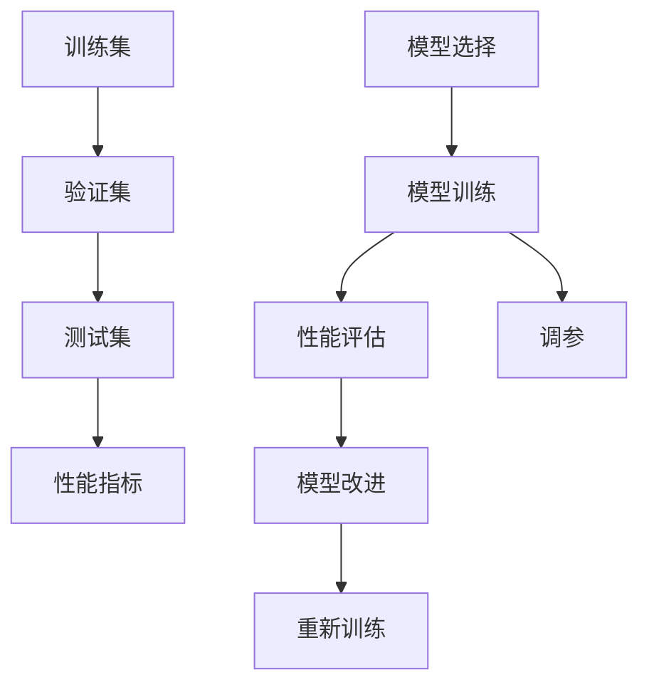

                 

# 第十三章：评估和衡量性能

> 关键词：模型评估, 模型比较, 模型调优, 性能指标, 量化评估

## 1. 背景介绍

### 1.1 问题由来

在人工智能的各个领域，尤其是机器学习和深度学习中，模型评估和性能衡量是一个至关重要的环节。无论是传统机器学习算法的线性回归、逻辑回归、决策树，还是现代深度学习模型的神经网络、卷积神经网络、循环神经网络，都需要通过科学的评估方法来衡量模型的表现，并指导模型的调优和改进。特别是在深度学习领域，模型规模庞大、结构复杂，评估过程更是充满了挑战。

### 1.2 问题核心关键点

模型评估的核心关键点在于如何准确衡量模型的预测能力，即在训练集和测试集上，模型输出的预测结果与真实标签的接近程度。一般来说，评估过程涉及以下几个关键步骤：

1. **数据准备**：准备训练集、验证集和测试集，确保数据的多样性和代表性。
2. **模型选择**：选择合适的评估指标，如准确率、召回率、F1分数等，根据任务特点选择合适的指标。
3. **模型训练**：在训练集上训练模型，并使用验证集进行调参，以防止过拟合。
4. **性能评估**：在测试集上对模型进行评估，获取性能指标。
5. **模型改进**：根据评估结果，优化模型结构和超参数，提高模型性能。

在实际应用中，模型的评估方法多种多样，每个步骤都需要仔细考量，以确保评估结果的准确性和可靠性。本文将重点介绍模型的评估方法和常用的性能指标，并结合代码实例进行详细讲解。

## 2. 核心概念与联系

### 2.1 核心概念概述

为了更好地理解模型评估的方法和原理，我们先简要介绍几个核心概念：

- **训练集、验证集、测试集**：数据集分为训练集、验证集和测试集，训练集用于模型训练，验证集用于调参，测试集用于性能评估。
- **模型评估指标**：常见的模型评估指标包括准确率、召回率、精确率、F1分数、AUC等，不同任务选择合适的指标。
- **过拟合与欠拟合**：过拟合指模型在训练集上表现良好，但在测试集上表现差；欠拟合则指模型在训练集和测试集上表现都差。
- **交叉验证**：将数据集分为多个子集，每次使用其中一个子集作为验证集，其余子集作为训练集和测试集，重复多次，取平均结果。

这些概念之间的逻辑关系可以通过以下Mermaid流程图来展示：



这个流程图展示了模型评估的基本流程：首先准备数据集，然后根据任务特点选择评估指标，接着进行模型训练和调参，最后使用测试集进行性能评估和模型改进。

## 3. 核心算法原理 & 具体操作步骤
### 3.1 算法原理概述

模型评估的根本原理是利用统计学和概率论的知识，衡量模型在训练集和测试集上的性能，并对比不同模型的预测能力。评估方法主要包括交叉验证、网格搜索、随机搜索、贝叶斯优化等。

常用的性能指标包括：

- **准确率**：模型预测正确的样本数占总样本数的比例。
- **召回率**：模型正确预测为正例的样本数占实际正例样本数的比例。
- **精确率**：模型预测为正例且实际为正例的样本数占预测为正例样本数的比例。
- **F1分数**：精确率和召回率的调和平均数。
- **AUC**：ROC曲线下的面积，衡量模型在不同阈值下的性能。

### 3.2 算法步骤详解

基于上述原理，模型评估和衡量性能的步骤如下：

1. **数据准备**：将数据集分为训练集、验证集和测试集，确保数据的多样性和代表性。
2. **模型选择**：选择合适的模型和评估指标，如逻辑回归、决策树、神经网络等，选择准确率、召回率、F1分数等指标。
3. **模型训练**：在训练集上训练模型，并使用验证集进行调参，以防止过拟合。
4. **性能评估**：在测试集上对模型进行评估，获取性能指标。
5. **模型改进**：根据评估结果，优化模型结构和超参数，提高模型性能。

### 3.3 算法优缺点

模型评估和性能衡量的主要优点包括：

- **量化模型性能**：通过科学的量化指标，可以直观地比较不同模型的性能。
- **指导模型调优**：通过性能评估，可以指导模型的调优和改进，提高模型预测能力。

然而，模型评估也存在一些局限性：

- **数据依赖**：评估结果高度依赖于数据集的质量和数量，数据偏差可能导致评估结果不准确。
- **计算成本高**：复杂的模型评估需要大量的计算资源，训练和验证过程耗时较长。
- **过度拟合风险**：评估指标的选择和设置可能存在主观性，过度依赖特定指标可能导致模型过拟合。

### 3.4 算法应用领域

模型评估和性能衡量的方法广泛应用于机器学习、深度学习、自然语言处理、计算机视觉等多个领域。以下是几个典型应用场景：

1. **自然语言处理**：用于评估文本分类、情感分析、命名实体识别等任务的模型性能。
2. **计算机视觉**：用于评估图像分类、目标检测、语义分割等任务的模型性能。
3. **推荐系统**：用于评估协同过滤、深度学习推荐模型的推荐准确性和多样性。
4. **金融风控**：用于评估风险评估模型的预测能力和鲁棒性。

在实际应用中，模型评估和性能衡量的方法需要根据具体任务进行调整和优化，以确保评估结果的准确性和可靠性。

## 4. 数学模型和公式 & 详细讲解  
### 4.1 数学模型构建

在模型评估中，我们通常使用混淆矩阵来衡量模型的性能。混淆矩阵是一个$n \times n$的矩阵，其中$n$为类别数。矩阵的对角线上的元素表示模型正确预测的样本数，非对角线上的元素表示模型预测错误的样本数。

假设模型有$k$个类别，则混淆矩阵M可以表示为：

$$
M = \begin{bmatrix}
P_1 & R_1 & \ldots & R_{k-1} & R_k \\
F_1 & P_2 & \ldots & P_{k-1} & P_k
\end{bmatrix}
$$

其中：
- $P_i$：模型正确预测为第$i$类的样本数。
- $R_i$：实际为第$i$类的样本数。

### 4.2 公式推导过程

常用的评估指标可以基于混淆矩阵进行计算，以下是几个常见指标的推导过程：

1. **准确率**：

$$
\text{Accuracy} = \frac{\sum_{i=1}^k P_i}{\sum_{i=1}^k R_i}
$$

2. **召回率**：

$$
\text{Recall} = \frac{\sum_{i=1}^k P_i}{\sum_{i=1}^k R_i}
$$

3. **精确率**：

$$
\text{Precision} = \frac{\sum_{i=1}^k P_i}{\sum_{i=1}^k P_i + \sum_{i=1}^k F_i}
$$

4. **F1分数**：

$$
\text{F1-score} = 2 \cdot \frac{\text{Precision} \cdot \text{Recall}}{\text{Precision} + \text{Recall}}
$$

5. **AUC**：

$$
\text{AUC} = \frac{1}{k} \sum_{i=1}^k \text{AUC}_i
$$

其中，$\text{AUC}_i$表示第$i$个类别的AUC值，可以通过ROC曲线下的面积计算得到。

### 4.3 案例分析与讲解

下面以一个简单的二分类任务为例，解释如何使用混淆矩阵和上述公式计算评估指标。

假设我们有一个二分类模型，测试集上有1000个样本，其中正例700个，负例300个。模型预测结果如下：

| 真实标签 | 预测标签 | 正确预测数 |
| --------- | -------- | ---------- |
| 正例      | 正例      | 500        |
| 正例      | 负例      | 100        |
| 负例      | 正例      | 50         |
| 负例      | 负例      | 250        |

根据混淆矩阵，我们可以计算得到以下评估指标：

- 准确率：$\text{Accuracy} = \frac{500 + 250}{1000} = 0.75$
- 召回率：$\text{Recall} = \frac{500 + 100}{700} = 0.88$
- 精确率：$\text{Precision} = \frac{500 + 50}{500 + 50 + 100} = 0.85$
- F1分数：$\text{F1-score} = 2 \cdot \frac{0.85 \cdot 0.88}{0.85 + 0.88} = 0.84$
- AUC：$\text{AUC} = \frac{1}{2} \cdot \text{AUC}_i = \frac{1}{2} \cdot \left(0.5 + 0.3\right) = 0.425$

通过这些指标，我们可以直观地比较不同模型的性能，指导模型的调优和改进。

## 5. 项目实践：代码实例和详细解释说明
### 5.1 开发环境搭建

在进行模型评估实践前，我们需要准备好开发环境。以下是使用Python进行Scikit-learn开发的环境配置流程：

1. 安装Anaconda：从官网下载并安装Anaconda，用于创建独立的Python环境。

2. 创建并激活虚拟环境：
```bash
conda create -n sklearn-env python=3.8 
conda activate sklearn-env
```

3. 安装Scikit-learn：
```bash
conda install scikit-learn
```

4. 安装各类工具包：
```bash
pip install numpy pandas scikit-learn matplotlib tqdm jupyter notebook ipython
```

完成上述步骤后，即可在`sklearn-env`环境中开始模型评估实践。

### 5.2 源代码详细实现

下面是一个使用Scikit-learn进行二分类模型评估的代码示例：

```python
from sklearn.datasets import load_iris
from sklearn.model_selection import train_test_split
from sklearn.tree import DecisionTreeClassifier
from sklearn.metrics import accuracy_score, recall_score, precision_score, f1_score, roc_auc_score

# 加载数据集
iris = load_iris()
X = iris.data
y = iris.target

# 划分训练集和测试集
X_train, X_test, y_train, y_test = train_test_split(X, y, test_size=0.2, random_state=42)

# 训练模型
clf = DecisionTreeClassifier()
clf.fit(X_train, y_train)

# 预测结果
y_pred = clf.predict(X_test)

# 评估指标
accuracy = accuracy_score(y_test, y_pred)
recall = recall_score(y_test, y_pred, average='macro')
precision = precision_score(y_test, y_pred, average='macro')
f1 = f1_score(y_test, y_pred, average='macro')
auc = roc_auc_score(y_test, clf.predict_proba(X_test)[:, 1])

print("Accuracy:", accuracy)
print("Recall:", recall)
print("Precision:", precision)
print("F1-score:", f1)
print("AUC:", auc)
```

在上述代码中，我们使用Scikit-learn中的决策树分类器对Iris数据集进行二分类评估。首先加载数据集，并划分为训练集和测试集。接着训练决策树模型，并使用测试集进行预测。最后计算准确率、召回率、精确率、F1分数和AUC值，并输出结果。

### 5.3 代码解读与分析

让我们再详细解读一下关键代码的实现细节：

- `load_iris()`函数：从Scikit-learn库中加载Iris数据集，包含150个样本，每个样本有4个特征和1个标签。
- `train_test_split()`函数：将数据集划分为训练集和测试集，比例为80%和20%。
- `DecisionTreeClassifier()`类：Scikit-learn中提供的决策树分类器，用于二分类任务。
- `accuracy_score()`、`recall_score()`、`precision_score()`和`f1_score()`函数：Scikit-learn中提供的评估指标计算函数，分别计算准确率、召回率、精确率和F1分数。
- `roc_auc_score()`函数：Scikit-learn中提供的AUC计算函数，用于评估二分类模型的性能。

这些函数和类可以方便地计算出模型的各项评估指标，帮助我们全面评估模型的性能。

## 6. 实际应用场景
### 6.1 自然语言处理

在自然语言处理领域，模型评估和性能衡量是不可或缺的环节。以情感分析为例，我们可以使用F1分数、AUC等指标评估模型的情感分类能力。在实际应用中，我们需要准备包含标注情感的文本数据，并将其分为训练集和测试集。接着训练模型，并使用测试集进行评估。根据评估结果，我们可以调整模型结构、调参或引入更复杂的模型，以提高情感分析的准确性和鲁棒性。

### 6.2 计算机视觉

在计算机视觉领域，模型评估和性能衡量同样重要。以图像分类为例，我们可以使用准确率、召回率、F1分数等指标评估模型的图像分类能力。在实际应用中，我们需要准备包含标注标签的图像数据，并将其分为训练集和测试集。接着训练模型，并使用测试集进行评估。根据评估结果，我们可以调整模型结构、调参或引入更复杂的模型，以提高图像分类的准确性和鲁棒性。

### 6.3 推荐系统

在推荐系统中，模型评估和性能衡量也是关键环节。以协同过滤为例，我们可以使用准确率、召回率、F1分数等指标评估模型的推荐能力。在实际应用中，我们需要准备包含用户行为和物品特征的数据，并将其分为训练集和测试集。接着训练模型，并使用测试集进行评估。根据评估结果，我们可以调整模型参数、引入更复杂的模型或结合外部数据，以提高推荐系统的性能。

### 6.4 未来应用展望

随着深度学习技术的发展，模型评估和性能衡量方法也在不断演进。未来，评估方法将更加自动化、智能化，评估指标将更加全面、精细。同时，评估方法将更多地结合实际应用场景，以更好地衡量模型在实际应用中的表现。

在实际应用中，评估方法和评估指标的选择将更加多样化和灵活，以适应不同任务和数据集的特点。例如，在金融风控领域，我们需要评估模型的预测能力和鲁棒性，以确保模型的稳定性和可靠性。在医疗诊断领域，我们需要评估模型的精确率和召回率，以确保模型的准确性和安全性。

## 7. 工具和资源推荐
### 7.1 学习资源推荐

为了帮助开发者系统掌握模型评估和性能衡量的方法，这里推荐一些优质的学习资源：

1. 《Python数据科学手册》：详细介绍了Python中的Scikit-learn库，以及如何使用该库进行模型评估和性能衡量。
2. 《机器学习实战》：提供了大量的实例和代码，帮助读者理解机器学习算法的评估方法和优化策略。
3. 《深度学习》：由Ian Goodfellow等人编写，涵盖了深度学习的基本概念和前沿技术，包括模型评估和性能衡量。
4. Kaggle竞赛：Kaggle是数据科学竞赛平台，提供了大量真实数据集和竞赛任务，读者可以通过参与竞赛学习和提高模型评估能力。

通过对这些资源的学习实践，相信你一定能够快速掌握模型评估和性能衡量的精髓，并用于解决实际的机器学习问题。

### 7.2 开发工具推荐

高效的开发离不开优秀的工具支持。以下是几款用于模型评估开发的常用工具：

1. Scikit-learn：Python中广泛使用的机器学习库，提供了多种评估指标和评估函数，简单易用。
2. TensorFlow：由Google主导开发的深度学习框架，提供了多种模型评估工具和可视化功能。
3. PyTorch：由Facebook主导开发的深度学习框架，提供了多种模型评估工具和可视化功能。
4. Jupyter Notebook：Python的交互式开发环境，可以方便地进行代码编写和模型评估。

合理利用这些工具，可以显著提升模型评估的开发效率，加快创新迭代的步伐。

### 7.3 相关论文推荐

模型评估和性能衡量方法的持续发展离不开学界的持续研究。以下是几篇奠基性的相关论文，推荐阅读：

1. "A Survey on Machine Learning in Healthcare"：介绍了机器学习在医疗领域的应用和评估方法。
2. "Evaluating Recommendation Algorithms"：介绍了推荐系统的评估方法和指标。
3. "A Systematic Review of Multi-objective Optimization Techniques for Hyperparameter Tuning of Machine Learning Algorithms"：介绍了超参数调优的评估方法和优化策略。
4. "Performance Metrics for Predictive Models"：介绍了常用的评估指标和评估方法。

这些论文代表了大语言模型微调技术的发展脉络。通过学习这些前沿成果，可以帮助研究者把握学科前进方向，激发更多的创新灵感。

## 8. 总结：未来发展趋势与挑战

### 8.1 总结

本文对模型评估和性能衡量的方法进行了全面系统的介绍。首先阐述了模型评估的背景和意义，明确了模型评估在模型调优和改进中的重要性。其次，从原理到实践，详细讲解了模型评估的数学模型和常见指标，给出了评估任务开发的完整代码实例。同时，本文还广泛探讨了模型评估方法在自然语言处理、计算机视觉、推荐系统等多个领域的应用前景，展示了模型评估范式的巨大潜力。

通过本文的系统梳理，可以看到，模型评估和性能衡量在机器学习和深度学习领域中占据重要地位，是模型开发和优化的关键环节。未来，伴随模型评估方法的发展，模型的调优和改进将更加自动化、智能化，模型的性能也将得到显著提升。

### 8.2 未来发展趋势

展望未来，模型评估和性能衡量方法将呈现以下几个发展趋势：

1. 自动化评估：评估过程将更加自动化、智能化，评估指标将更加全面、精细。
2. 深度学习融合：评估方法将更多地结合实际应用场景，以更好地衡量模型在实际应用中的表现。
3. 集成学习：结合多个模型的评估结果，提高模型的鲁棒性和泛化能力。
4. 实时评估：评估过程将更加实时化，可以快速反馈模型性能，进行模型调优。
5. 可视化评估：通过可视化工具展示模型评估结果，帮助开发者更好地理解模型性能。

以上趋势凸显了模型评估和性能衡量方法的广阔前景。这些方向的探索发展，必将进一步提升模型的调优和改进效果，为构建安全、可靠、高效的智能系统铺平道路。

### 8.3 面临的挑战

尽管模型评估和性能衡量方法已经取得了瞩目成就，但在迈向更加智能化、普适化应用的过程中，它仍面临着诸多挑战：

1. 数据依赖：评估结果高度依赖于数据集的质量和数量，数据偏差可能导致评估结果不准确。
2. 计算成本高：复杂的模型评估需要大量的计算资源，训练和验证过程耗时较长。
3. 过度拟合风险：评估指标的选择和设置可能存在主观性，过度依赖特定指标可能导致模型过拟合。

### 8.4 研究展望

面对模型评估和性能衡量所面临的种种挑战，未来的研究需要在以下几个方面寻求新的突破：

1. 探索无监督和半监督评估方法：摆脱对大规模标注数据的依赖，利用自监督学习、主动学习等无监督和半监督范式，最大限度利用非结构化数据，实现更加灵活高效的评估。
2. 研究自动化和智能化评估方法：开发更加自动化、智能化的评估工具，减少人工干预，提高评估效率和准确性。
3. 引入更多先验知识：将符号化的先验知识，如知识图谱、逻辑规则等，与神经网络模型进行巧妙融合，引导评估过程学习更准确、合理的模型性能。
4. 结合因果分析和博弈论工具：将因果分析方法引入评估模型，识别出模型决策的关键特征，增强输出解释的因果性和逻辑性。借助博弈论工具刻画人机交互过程，主动探索并规避模型的脆弱点，提高系统稳定性。
5. 纳入伦理道德约束：在模型评估目标中引入伦理导向的评估指标，过滤和惩罚有偏见、有害的输出倾向。加强人工干预和审核，建立模型行为的监管机制，确保输出符合人类价值观和伦理道德。

这些研究方向的探索，必将引领模型评估和性能衡量技术迈向更高的台阶，为构建安全、可靠、可解释、可控的智能系统铺平道路。面向未来，模型评估和性能衡量技术还需要与其他人工智能技术进行更深入的融合，如知识表示、因果推理、强化学习等，多路径协同发力，共同推动自然语言理解和智能交互系统的进步。只有勇于创新、敢于突破，才能不断拓展语言模型的边界，让智能技术更好地造福人类社会。

## 9. 附录：常见问题与解答

**Q1：如何选择合适的模型评估指标？**

A: 选择合适的模型评估指标需要考虑任务特点和实际需求。例如，对于分类任务，准确率、召回率、F1分数等指标都是常用的选择。对于回归任务，均方误差、平均绝对误差等指标更为合适。在选择评估指标时，还需要考虑评估结果的可解释性和可操作性，以便更好地指导模型的调优和改进。

**Q2：模型评估过程中如何处理数据偏差？**

A: 数据偏差是模型评估中常见的问题，可以通过以下几种方法处理：
1. 数据增强：通过数据增强技术扩充训练集，减少数据偏差的影响。
2. 数据清洗：对训练集和测试集进行数据清洗，去除异常值和噪声数据。
3. 模型集成：结合多个模型的评估结果，综合不同模型的预测，降低单个模型可能存在的偏差。
4. 交叉验证：通过交叉验证技术，多次评估模型的性能，取平均结果，减少单个评估结果的偏差。

**Q3：模型评估过程中如何处理过拟合？**

A: 过拟合是模型评估中的常见问题，可以通过以下几种方法处理：
1. 正则化：通过L1、L2正则化等方法，减少模型复杂度，降低过拟合风险。
2. 交叉验证：通过交叉验证技术，多次评估模型的性能，取平均结果，减少单个评估结果的偏差。
3. 集成学习：结合多个模型的评估结果，综合不同模型的预测，降低单个模型可能存在的偏差。
4. 提前停止：在验证集上监测模型性能，一旦性能不再提升，提前停止训练，防止过拟合。

**Q4：模型评估过程中如何进行超参数调优？**

A: 超参数调优是模型评估中的重要环节，可以通过以下几种方法进行：
1. 网格搜索：通过遍历超参数空间，搜索最优参数组合。
2. 随机搜索：通过随机采样超参数，搜索最优参数组合。
3. 贝叶斯优化：利用贝叶斯算法，优化超参数搜索策略，提高搜索效率。
4. 模型融合：结合多个模型的评估结果，综合不同模型的预测，降低单个模型可能存在的偏差。

**Q5：模型评估过程中如何进行可视化？**

A: 可视化是模型评估中不可或缺的一环，可以通过以下几种方法进行：
1. 混淆矩阵：使用混淆矩阵可视化模型的分类结果，直观展示模型性能。
2. ROC曲线：使用ROC曲线可视化模型的预测性能，展示模型在不同阈值下的表现。
3. 学习曲线：使用学习曲线可视化模型的训练和验证性能，观察模型性能随训练轮数的变化。
4. 特征重要性：使用特征重要性可视化模型学习到的特征，帮助理解模型内部机制。

这些可视化方法可以帮助开发者更好地理解模型性能，指导模型调优和改进。

---

作者：禅与计算机程序设计艺术 / Zen and the Art of Computer Programming

