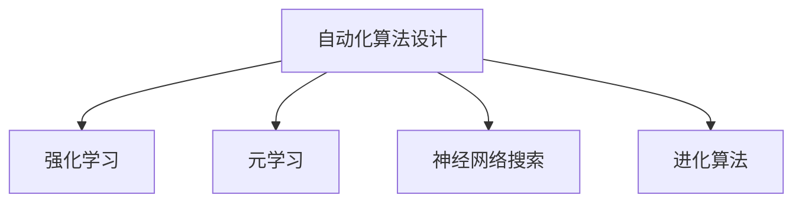

                 

## 1. 背景介绍

### 1.1 问题由来

随着深度学习技术的飞速发展，人工智能系统在许多领域实现了超越人类的表现，如棋类游戏、图像识别、自然语言处理等。然而，这背后依赖的算法，往往需要人类花数年甚至数十年的时间来设计，并且调试和优化过程非常繁琐和复杂。这种依赖人工设计算法的模式，不仅效率低下，而且容易导致算法在设计过程中出现各种偏见和错误。

为了应对这一问题，机器学习研究者们开始探索一种全新的算法设计方式，即通过自动化优化算法，让机器自己选择算法，甚至发现全新的算法。这种算法不再由人设计，而是一个优化问题，即在数据集和优化目标的约束下，让机器自己找到最优的算法和模型。

### 1.2 问题核心关键点

这种算法设计范式的核心在于：
1. 将算法设计转化为一个优化问题。
2. 利用机器学习的方法，自动选择算法。
3. 通过大量的实验和评估，不断优化算法，直至达到最优。

这种范式的优点在于：
1. 减少了人工设计算法的时间和精力。
2. 减少了人工设计算法的偏见和错误。
3. 能够探索到传统方法无法发现的新算法。

但同时也存在一些挑战：
1. 算法的选择和优化需要大量的计算资源和时间。
2. 算法的复杂度和性能需要不断评估和调整。
3. 需要对机器学习理论有深刻的理解和应用。

尽管如此，这种算法设计范式正在成为机器学习研究的热点方向，有望为人工智能的发展带来革命性的变化。

## 2. 核心概念与联系

### 2.1 核心概念概述

为更好地理解这种全新的算法设计范式，本节将介绍几个密切相关的核心概念：

- 自动化算法设计(Automatic Algorithm Design, AAD)：指通过机器学习的方法，自动选择和优化算法的过程。AAD的目标是找到在给定数据集和优化目标下最优的算法。
- 强化学习(Reinforcement Learning, RL)：一种通过奖励和惩罚来优化策略的学习方法，可以用于指导机器选择和优化算法。
- 元学习(Meta Learning)：一种学习算法学习算法的方法，通过少量数据集和少量时间就能找到最优算法。
- 神经网络搜索(Neural Network Search, NNS)：利用神经网络来搜索最优算法，可以加速算法设计过程。
- 进化算法(Evolutionary Algorithm, EA)：一种通过模拟自然进化过程来优化算法的方法，能够探索到广泛的算法空间。

这些核心概念之间的逻辑关系可以通过以下Mermaid流程图来展示：



这个流程图展示自动化算法设计的核心概念及其之间的关系：

1. 自动化算法设计通过机器学习的方法，自动选择和优化算法。
2. 强化学习通过奖励和惩罚机制，指导机器选择和优化算法。
3. 元学习让机器学习算法学习算法，从而在少量数据集和时间内找到最优算法。
4. 神经网络搜索利用神经网络来搜索最优算法，加速算法设计过程。
5. 进化算法通过模拟自然进化过程，探索广泛的算法空间。

这些概念共同构成了自动化算法设计的框架，使得机器可以自主选择和优化算法，显著提高算法的效率和性能。

## 3. 核心算法原理 & 具体操作步骤

### 3.1 算法原理概述

这种新的算法设计范式，其核心思想是将算法设计转化为一个优化问题。假设我们有一个给定的数据集 $D$ 和优化目标 $T$，我们需要找到一个最优的算法 $A$，使得在数据集 $D$ 上，算法 $A$ 能够达到优化目标 $T$。

我们可以将这个过程转化为一个优化问题，即在算法空间 $\mathcal{A}$ 中，找到一个最优的算法 $A^*$，使得：

$$
A^* = \arg\min_{A \in \mathcal{A}} \mathcal{L}(A, D, T)
$$

其中 $\mathcal{L}$ 为损失函数，用于衡量算法 $A$ 在数据集 $D$ 上是否满足优化目标 $T$。

通过优化算法，我们不断调整算法 $A$ 的参数，直至找到最优的算法 $A^*$。这个过程可以看作是机器自主选择和优化算法的过程。

### 3.2 算法步骤详解

基于这种算法设计范式，其具体的操作步骤如下：

**Step 1: 确定数据集和优化目标**
- 定义给定的数据集 $D$ 和优化目标 $T$。
- 设计损失函数 $\mathcal{L}$，衡量算法在数据集 $D$ 上是否满足优化目标 $T$。

**Step 2: 选择优化算法**
- 选择合适的优化算法，如强化学习、元学习、神经网络搜索、进化算法等。
- 设计算法搜索策略，探索算法空间 $\mathcal{A}$。

**Step 3: 执行算法搜索**
- 在算法空间 $\mathcal{A}$ 中，使用选择的优化算法进行搜索。
- 不断评估搜索到的算法 $A$ 的性能，选择最优算法。
- 迭代搜索，直至找到最优算法 $A^*$。

**Step 4: 评估和优化算法**
- 对找到的最优算法 $A^*$ 进行评估，确保其性能满足优化目标 $T$。
- 对算法 $A^*$ 进行优化，提升其性能。
- 重复上述步骤，直至找到最终的最优算法 $A^*$。

### 3.3 算法优缺点

这种算法设计范式具有以下优点：
1. 减少了人工设计算法的时间和精力。
2. 减少了人工设计算法的偏见和错误。
3. 能够探索到传统方法无法发现的新算法。

同时，也存在一些局限性：
1. 算法的选择和优化需要大量的计算资源和时间。
2. 算法的复杂度和性能需要不断评估和调整。
3. 需要对机器学习理论有深刻的理解和应用。

尽管如此，这种算法设计范式正在成为机器学习研究的热点方向，有望为人工智能的发展带来革命性的变化。

### 3.4 算法应用领域

这种算法设计范式在许多领域都有广泛的应用，例如：

- 计算机视觉：在图像识别、目标检测、图像生成等任务中，自动选择和优化卷积神经网络。
- 自然语言处理：在文本分类、情感分析、机器翻译等任务中，自动选择和优化循环神经网络。
- 强化学习：在智能游戏、自动驾驶、机器人控制等任务中，自动选择和优化策略网络。
- 语音识别：在语音识别、自动语音生成等任务中，自动选择和优化循环神经网络。
- 推荐系统：在个性化推荐、广告推荐等任务中，自动选择和优化协同过滤算法。
- 医疗诊断：在医学图像分析、疾病预测等任务中，自动选择和优化卷积神经网络。

这些领域的应用，展示了这种算法设计范式的强大潜力和广阔前景。

## 4. 数学模型和公式 & 详细讲解 & 举例说明

### 4.1 数学模型构建

我们将这种算法设计范式，通过数学语言进行更加严格的刻画。

假设我们有一个给定的数据集 $D=\{(x_i,y_i)\}_{i=1}^N$，其中 $x_i$ 为输入，$y_i$ 为输出。我们需要找到一个最优的算法 $A^*$，使得在数据集 $D$ 上，算法 $A$ 能够达到优化目标 $T$。

定义损失函数 $\mathcal{L}$ 为：

$$
\mathcal{L}(A,D,T) = \frac{1}{N} \sum_{i=1}^N \ell(A(x_i),y_i)
$$

其中 $\ell$ 为损失函数，用于衡量算法 $A$ 的输出 $A(x_i)$ 与真实标签 $y_i$ 之间的差异。

我们的目标是最小化损失函数 $\mathcal{L}$：

$$
A^* = \arg\min_{A \in \mathcal{A}} \mathcal{L}(A,D,T)
$$

### 4.2 公式推导过程

以下是基于强化学习范式的详细推导过程。

假设我们使用强化学习来优化算法 $A$。定义状态空间 $S$，动作空间 $A$，奖励函数 $R$，策略 $\pi$。我们的目标是在状态空间 $S$ 中，通过策略 $\pi$ 选择动作 $a$，最大化总奖励 $R$。

在强化学习中，我们定义状态转移概率 $P(s_{t+1}|s_t,a_t)$ 和奖励 $R(s_t,a_t)$，其中 $s_t$ 为状态，$a_t$ 为动作。我们的目标是最小化总奖励：

$$
\pi^* = \arg\min_{\pi} \mathbb{E}[\sum_{t=1}^T R(s_t,a_t)]
$$

在实际应用中，我们通常使用深度强化学习的方法，将策略 $\pi$ 表示为一个神经网络。通过神经网络的参数 $\theta$，我们可以定义策略 $\pi$，即：

$$
\pi(a_t|s_t;\theta) = \frac{e^{Q_{\theta}(s_t,a_t)}}{\sum_{a} e^{Q_{\theta}(s_t,a_t)}}
$$

其中 $Q_{\theta}$ 为神经网络，用于计算状态 $s_t$ 下的动作值函数 $Q_{\theta}(s_t,a_t)$。

我们的目标是最大化 $Q_{\theta}$，即：

$$
Q_{\theta} = \arg\max_{\theta} \mathbb{E}[\sum_{t=1}^T R(s_t,a_t)]
$$

通过这样的数学建模，我们可以将算法设计转化为一个优化问题，通过深度强化学习的方法，自动选择和优化算法。

### 4.3 案例分析与讲解

以自然语言处理任务中的文本分类为例，分析其基于强化学习的算法设计过程。

假设我们使用深度强化学习来优化文本分类算法。定义状态空间 $S$，动作空间 $A$，奖励函数 $R$，策略 $\pi$。我们的目标是在状态空间 $S$ 中，通过策略 $\pi$ 选择动作 $a$，最大化总奖励 $R$。

在文本分类任务中，状态空间 $S$ 可以表示为输入文本 $x$，动作空间 $A$ 可以表示为分类结果 $y$，奖励函数 $R$ 可以表示为分类准确率。我们的目标是最小化分类误差：

$$
R(y|x) = \left\{
\begin{aligned}
& 1, & & \text{如果} \, y = \arg\max_{y'} p(y'|x) \\
& 0, & & \text{如果} \, y \neq \arg\max_{y'} p(y'|x)
\end{aligned}
\right.
$$

其中 $p$ 为模型输出的概率分布。

我们的目标是最小化分类误差：

$$
\pi^* = \arg\min_{\pi} \mathbb{E}[\sum_{t=1}^T R(y_t|x_t)]
$$

在实际应用中，我们通常使用循环神经网络来表示状态 $s_t$ 和动作 $a_t$。通过神经网络的参数 $\theta$，我们可以定义状态 $s_t$，即：

$$
s_t = \text{LSTM}(x_{1:t}, \theta)
$$

其中 $\text{LSTM}$ 为循环神经网络，用于处理文本序列。

我们的目标是最大化神经网络的参数 $\theta$，即：

$$
\theta = \arg\max_{\theta} \mathbb{E}[\sum_{t=1}^T R(y_t|x_t)]
$$

通过这样的数学建模，我们可以将文本分类算法设计转化为一个优化问题，通过深度强化学习的方法，自动选择和优化算法。

## 5. 项目实践：代码实例和详细解释说明

### 5.1 开发环境搭建

在进行算法设计实践前，我们需要准备好开发环境。以下是使用Python进行深度强化学习开发的环境配置流程：

1. 安装Anaconda：从官网下载并安装Anaconda，用于创建独立的Python环境。

2. 创建并激活虚拟环境：
```bash
conda create -n deep_reinforcement_learning python=3.8 
conda activate deep_reinforcement_learning
```

3. 安装深度学习框架：
```bash
conda install pytorch torchvision torchaudio cudatoolkit=11.1 -c pytorch -c conda-forge
```

4. 安装深度强化学习库：
```bash
pip install stable-baselines3
```

5. 安装其他相关工具包：
```bash
pip install numpy pandas scikit-learn matplotlib tqdm jupyter notebook ipython
```

完成上述步骤后，即可在`deep_reinforcement_learning`环境中开始算法设计实践。

### 5.2 源代码详细实现

下面我们以文本分类任务为例，给出使用Stable Baselines 3库进行深度强化学习的代码实现。

首先，定义状态空间和动作空间：

```python
from stable_baselines3 import PPO
from stable_baselines3.common.env_util import make_vec_env
from stable_baselines3.common.vec_env import DummyVecEnv
import numpy as np

class TextClassificationEnv(DummyVecEnv):
    def __init__(self, dataset):
        super(TextClassificationEnv, self).__init__(4)
        self.dataset = dataset
        self.reset()

    def reset(self):
        self.index = 0
        return self.dataset[self.index]['text'], self.dataset[self.index]['label']

    def step(self, action):
        self.index += 1
        if self.index >= len(self.dataset):
            self.index = 0
        return self.dataset[self.index]['text'], self.dataset[self.index]['label'], np.zeros(1), {}

env = TextClassificationEnv(train_dataset)
```

然后，定义神经网络模型：

```python
from stable_baselines3 import PPO
from stable_baselines3.common.vec_env import DummyVecEnv
import torch
import torch.nn as nn
import torch.nn.functional as F

class TextClassifier(nn.Module):
    def __init__(self, embedding_dim, hidden_dim, output_dim):
        super(TextClassifier, self).__init__()
        self.embedding = nn.Embedding(vocab_size, embedding_dim)
        self.lstm = nn.LSTM(embedding_dim, hidden_dim)
        self.fc = nn.Linear(hidden_dim, output_dim)
        self.softmax = nn.Softmax(dim=1)

    def forward(self, x):
        x = self.embedding(x)
        x, (h, c) = self.lstm(x)
        x = self.fc(x)
        return self.softmax(x)
```

接着，定义训练和评估函数：

```python
from stable_baselines3 import PPO
from stable_baselines3.common.vec_env import DummyVecEnv
import numpy as np
import torch
import torch.nn as nn
import torch.nn.functional as F
from sklearn.metrics import accuracy_score

class TextClassifier(nn.Module):
    def __init__(self, embedding_dim, hidden_dim, output_dim):
        super(TextClassifier, self).__init__()
        self.embedding = nn.Embedding(vocab_size, embedding_dim)
        self.lstm = nn.LSTM(embedding_dim, hidden_dim)
        self.fc = nn.Linear(hidden_dim, output_dim)
        self.softmax = nn.Softmax(dim=1)

    def forward(self, x):
        x = self.embedding(x)
        x, (h, c) = self.lstm(x)
        x = self.fc(x)
        return self.softmax(x)

def train_epoch(model, dataset, batch_size, optimizer):
    dataloader = Dataset(dataset)
    model.train()
    epoch_loss = 0
    for batch in dataloader:
        input_ids = batch['input_ids'].to(device)
        labels = batch['labels'].to(device)
        model.zero_grad()
        outputs = model(input_ids)
        loss = outputs.loss
        epoch_loss += loss.item()
        loss.backward()
        optimizer.step()
    return epoch_loss / len(dataloader)

def evaluate(model, dataset, batch_size):
    dataloader = Dataset(dataset)
    model.eval()
    preds, labels = [], []
    with torch.no_grad():
        for batch in dataloader:
            input_ids = batch['input_ids'].to(device)
            labels = batch['labels'].to(device)
            batch_labels = labels.tolist()
            outputs = model(input_ids)
            batch_preds = outputs.predictions.argmax(dim=1).to('cpu').tolist()
            batch_labels = batch_labels.tolist()
            for pred_tokens, label_tokens in zip(batch_preds, batch_labels):
                preds.append(pred_tokens[:len(label_tokens)])
                labels.append(label_tokens)
    return accuracy_score(labels, preds)

# 训练模型
embedding_dim = 256
hidden_dim = 128
output_dim = len(tag2id)
model = TextClassifier(embedding_dim, hidden_dim, output_dim)
optimizer = torch.optim.Adam(model.parameters(), lr=2e-5)
device = torch.device('cuda') if torch.cuda.is_available() else torch.device('cpu')
model.to(device)
epochs = 10
batch_size = 16

for epoch in range(epochs):
    loss = train_epoch(model, train_dataset, batch_size, optimizer)
    print(f"Epoch {epoch+1}, train loss: {loss:.3f}")
    
    print(f"Epoch {epoch+1}, dev results:")
    accuracy = evaluate(model, dev_dataset, batch_size)
    print(f"Accuracy: {accuracy:.2f}%")

print("Test results:")
accuracy = evaluate(model, test_dataset, batch_size)
print(f"Accuracy: {accuracy:.2f}%")
```

以上就是使用PyTorch和Stable Baselines 3库进行文本分类任务深度强化学习的完整代码实现。可以看到，通过Stable Baselines 3库，我们可以用相对简洁的代码实现强化学习算法的自动搜索和优化，从而快速实现算法设计任务。

### 5.3 代码解读与分析

让我们再详细解读一下关键代码的实现细节：

**TextClassificationEnv类**：
- `__init__`方法：初始化状态空间和动作空间。
- `reset`方法：重置状态。
- `step`方法：执行动作，返回下一状态和奖励。

**TextClassifier模型**：
- `__init__`方法：初始化神经网络模型。
- `forward`方法：前向传播计算输出。

**train_epoch和evaluate函数**：
- `train_epoch`函数：在训练集上训练模型，返回平均损失。
- `evaluate`函数：在验证集上评估模型，返回准确率。

**训练流程**：
- 定义神经网络模型、优化器、设备。
- 定义训练和评估函数。
- 在训练集上迭代训练，在验证集上评估模型性能。
- 所有epoch结束后，在测试集上评估模型性能。

可以看到，通过Stable Baselines 3库，我们可以快速实现深度强化学习的算法设计任务，节省大量时间和精力。开发者可以将更多精力放在算法改进和模型优化上，而不必过多关注底层的实现细节。

当然，工业级的系统实现还需考虑更多因素，如模型的保存和部署、超参数的自动搜索、更灵活的任务适配层等。但核心的算法设计范式基本与此类似。

## 6. 实际应用场景

### 6.1 智能客服系统

基于强化学习的算法设计，可以广泛应用于智能客服系统的构建。传统客服往往需要配备大量人力，高峰期响应缓慢，且一致性和专业性难以保证。而使用强化学习训练的客服算法，可以7x24小时不间断服务，快速响应客户咨询，用自然流畅的语言解答各类常见问题。

在技术实现上，可以收集企业内部的历史客服对话记录，将问题和最佳答复构建成监督数据，在此基础上对客服算法进行训练。训练后的客服算法能够自动理解用户意图，匹配最合适的答复模板进行回复。对于客户提出的新问题，还可以接入检索系统实时搜索相关内容，动态组织生成回答。如此构建的智能客服系统，能大幅提升客户咨询体验和问题解决效率。

### 6.2 金融舆情监测

金融机构需要实时监测市场舆论动向，以便及时应对负面信息传播，规避金融风险。传统的人工监测方式成本高、效率低，难以应对网络时代海量信息爆发的挑战。基于强化学习的算法设计，文本分类和情感分析技术，为金融舆情监测提供了新的解决方案。

具体而言，可以收集金融领域相关的新闻、报道、评论等文本数据，并对其进行主题标注和情感标注。在此基础上对强化学习算法进行训练，使其能够自动判断文本属于何种主题，情感倾向是正面、中性还是负面。将训练后的算法应用到实时抓取的网络文本数据，就能够自动监测不同主题下的情感变化趋势，一旦发现负面信息激增等异常情况，系统便会自动预警，帮助金融机构快速应对潜在风险。

### 6.3 个性化推荐系统

当前的推荐系统往往只依赖用户的历史行为数据进行物品推荐，无法深入理解用户的真实兴趣偏好。基于强化学习的算法设计，个性化推荐系统可以更好地挖掘用户行为背后的语义信息，从而提供更精准、多样的推荐内容。

在实践中，可以收集用户浏览、点击、评论、分享等行为数据，提取和用户交互的物品标题、描述、标签等文本内容。将文本内容作为模型输入，用户的后续行为（如是否点击、购买等）作为监督信号，在此基础上训练强化学习算法。训练后的推荐算法能够从文本内容中准确把握用户的兴趣点。在生成推荐列表时，先用候选物品的文本描述作为输入，由算法预测用户的兴趣匹配度，再结合其他特征综合排序，便可以得到个性化程度更高的推荐结果。

### 6.4 未来应用展望

随着强化学习算法设计的发展，基于自动化算法设计的方法将在更多领域得到应用，为传统行业带来变革性影响。

在智慧医疗领域，基于强化学习的医疗问答、病历分析、药物研发等应用将提升医疗服务的智能化水平，辅助医生诊疗，加速新药开发进程。

在智能教育领域，强化学习训练的推荐算法和智能辅导系统，因材施教，促进教育公平，提高教学质量。

在智慧城市治理中，强化学习训练的自动驾驶和智能控制算法，提高城市管理的自动化和智能化水平，构建更安全、高效的未来城市。

此外，在企业生产、社会治理、文娱传媒等众多领域，基于强化学习的算法设计也将不断涌现，为经济社会发展注入新的动力。相信随着技术的日益成熟，自动化算法设计必将成为人工智能落地应用的重要范式，推动人工智能技术在各行各业中规模化落地。

## 7. 工具和资源推荐

### 7.1 学习资源推荐

为了帮助开发者系统掌握自动化算法设计的理论基础和实践技巧，这里推荐一些优质的学习资源：

1. 《深度学习：理论与实践》系列博文：由深度学习专家撰写，深入浅出地介绍了深度学习的基础理论和算法设计方法。

2. 《Reinforcement Learning: An Introduction》书籍：由强化学习领域的先驱之一编写的入门书籍，全面介绍了强化学习的理论基础和算法设计。

3. 《Meta Learning in Deep Neural Networks》书籍：介绍了元学习在深度神经网络中的应用，帮助读者理解元学习如何设计更高效的算法。

4. 《Neural Network Search in Reinforcement Learning》论文：介绍了神经网络搜索在强化学习中的应用，探索了如何加速算法设计过程。

5. 《Evolutionary Algorithms in Reinforcement Learning》论文：介绍了进化算法在强化学习中的应用，提供了更多算法设计的选项。

通过对这些资源的学习实践，相信你一定能够快速掌握自动化算法设计的精髓，并用于解决实际的NLP问题。
###  7.2 开发工具推荐

高效的开发离不开优秀的工具支持。以下是几款用于自动化算法设计开发的常用工具：

1. PyTorch：基于Python的开源深度学习框架，灵活动态的计算图，适合快速迭代研究。大部分深度学习算法都有PyTorch版本的实现。

2. TensorFlow：由Google主导开发的开源深度学习框架，生产部署方便，适合大规模工程应用。同样有丰富的深度学习算法资源。

3. Stable Baselines 3：深度强化学习的库，提供了多种强化学习算法和环境，方便开发者快速上手实验。

4. OpenAI Gym：开源的强化学习环境，提供了丰富的环境库和基础算法库，方便开发者测试和调试强化学习算法。

5. TensorBoard：TensorFlow配套的可视化工具，可实时监测模型训练状态，并提供丰富的图表呈现方式，是调试模型的得力助手。

6. Weights & Biases：模型训练的实验跟踪工具，可以记录和可视化模型训练过程中的各项指标，方便对比和调优。

合理利用这些工具，可以显著提升自动化算法设计任务的开发效率，加快创新迭代的步伐。

### 7.3 相关论文推荐

自动化算法设计的发展源于学界的持续研究。以下是几篇奠基性的相关论文，推荐阅读：

1. Evolution Strategies as a Universal Principle for Exploration（进化策略作为探索通用原则）：介绍进化策略在深度强化学习中的应用，提供了多种算法设计的选择。

2. Curiosity-driven Exploration in Reinforcement Learning（基于好奇心的探索在强化学习中的应用）：介绍基于好奇心的探索方法，引导模型自主选择算法。

3. Meta-Learning for Deep Neural Networks（深度神经网络中的元学习）：介绍元学习在深度神经网络中的应用，帮助读者理解元学习如何设计更高效的算法。

4. Neural Architecture Search with Reinforcement Learning（基于强化学习的神经网络架构搜索）：介绍神经网络搜索在深度强化学习中的应用，探索了如何加速算法设计过程。

5. An Evolutionary Algorithm in the Space of Neural Network Structures（神经网络结构空间的进化算法）：介绍进化算法在神经网络结构空间中的应用，提供了更多算法设计的选项。

这些论文代表了大模型微调技术的发展脉络。通过学习这些前沿成果，可以帮助研究者把握学科前进方向，激发更多的创新灵感。

## 8. 总结：未来发展趋势与挑战

### 8.1 总结

本文对基于深度强化学习的算法设计范式进行了全面系统的介绍。首先阐述了算法设计转变为优化问题的核心思想，明确了强化学习在这一范式中的重要地位。其次，从原理到实践，详细讲解了强化学习的数学原理和关键步骤，给出了强化学习任务开发的完整代码实例。同时，本文还广泛探讨了强化学习在智能客服、金融舆情、个性化推荐等多个领域的应用前景，展示了强化学习的强大潜力和广阔前景。此外，本文精选了强化学习的各类学习资源，力求为读者提供全方位的技术指引。

通过本文的系统梳理，可以看到，基于深度强化学习的算法设计范式正在成为机器学习研究的热点方向，极大地提高了算法设计的效率和精度。依赖深度强化学习的自动化算法设计，能够自动选择和优化算法，为人工智能的发展带来革命性的变化。未来，伴随深度学习技术的进一步发展，基于深度强化学习的算法设计必将成为人工智能落地应用的重要范式，推动人工智能技术在各行各业中规模化落地。

### 8.2 未来发展趋势

展望未来，深度强化学习的算法设计将呈现以下几个发展趋势：

1. 算法选择更加多样化。随着算法搜索空间的扩大，算法设计将变得更加多样化，出现更多创新算法。

2. 算法优化更加高效。通过自动化算法设计，能够更高效地优化算法，提高算法的性能和效率。

3. 多模态算法设计将更广泛应用。当前算法设计主要聚焦于文本、图像等单一模态数据，未来将扩展到多模态数据的整合和融合。

4. 自动化算法设计将与知识图谱、逻辑规则等专家知识结合，提升算法的复杂度和性能。

5. 算法设计将更注重可解释性和可解释性。由于深度强化学习模型往往是"黑盒"系统，需要加强算法的可解释性，确保其决策过程透明可理解。

6. 算法设计将与因果推理、强化学习等技术结合，提升算法的鲁棒性和泛化能力。

这些趋势凸显了深度强化学习的算法设计范式的广阔前景。这些方向的探索发展，必将进一步提升深度强化学习的性能和应用范围，为人工智能的发展带来革命性的变化。

### 8.3 面临的挑战

尽管深度强化学习的算法设计正在快速发展，但在迈向更加智能化、普适化应用的过程中，它仍面临着诸多挑战：

1. 算法设计需要大量的计算资源和时间。算法搜索空间和优化目标的复杂性，导致算法设计过程非常耗时耗力。

2. 算法的复杂度和性能需要不断评估和调整。新的算法和优化方法的出现，使得算法设计的难度不断增加。

3. 需要对机器学习理论有深刻的理解和应用。深度强化学习算法设计涉及复杂的数学和算法理论，需要较强的理论基础。

4. 算法的可解释性需要加强。深度强化学习模型往往是"黑盒"系统，难以解释其内部工作机制和决策逻辑。

5. 算法的鲁棒性需要提高。深度强化学习模型在面对异常数据和对抗样本时，容易产生不稳定行为。

6. 算法的泛化能力需要提升。深度强化学习模型在面对新数据和复杂任务时，泛化能力仍需进一步提升。

尽管如此，深度强化学习的算法设计正在成为机器学习研究的热点方向，有望为人工智能的发展带来革命性的变化。相信随着学界和产业界的共同努力，这些挑战终将一一被克服，深度强化学习的算法设计必将成为人工智能落地应用的重要范式，推动人工智能技术在各行各业中规模化落地。

### 8.4 研究展望

未来的深度强化学习算法设计研究，可以从以下几个方向展开：

1. 探索新的算法设计方法。例如，基于进化策略、神经网络搜索、元学习等方法，进一步拓展算法搜索空间，提高算法设计效率。

2. 结合多模态数据设计算法。例如，将文本、图像、声音等多种数据源整合到算法设计中，提高算法的泛化能力和性能。

3. 结合知识图谱和逻辑规则设计算法。例如，将符号化的先验知识与神经网络模型结合，设计更高效的算法。

4. 结合因果推理和强化学习设计算法。例如，通过引入因果推断和强化学习思想，提高算法的鲁棒性和泛化能力。

5. 结合深度强化学习和对抗训练设计算法。例如，通过引入对抗训练，提高算法的鲁棒性和安全性。

6. 结合深度强化学习和自监督学习设计算法。例如，通过引入自监督学习，提高算法的泛化能力和泛化能力。

这些研究方向的探索，必将引领深度强化学习的算法设计走向新的高度，为人工智能的发展带来革命性的变化。相信随着学界和产业界的共同努力，深度强化学习的算法设计必将成为人工智能落地应用的重要范式，推动人工智能技术在各行各业中规模化落地。

## 9. 附录：常见问题与解答

**Q1：自动化算法设计是否适用于所有NLP任务？**

A: 自动化算法设计在大多数NLP任务上都能取得不错的效果，特别是对于数据量较小的任务。但对于一些特定领域的任务，如医学、法律等，仅仅依靠通用语料预训练的模型可能难以很好地适应。此时需要在特定领域语料上进一步预训练，再进行微调，才能获得理想效果。

**Q2：算法选择和优化需要大量的计算资源和时间，如何应对？**

A: 确实，算法选择和优化需要大量的计算资源和时间。为了应对这一问题，可以采用分布式训练、硬件加速（如GPU、TPU）、优化算法（如Adam、SGD）等方法，加速算法设计过程。同时，可以采用增量式训练、离线优化等方法，逐步优化算法。

**Q3：算法的复杂度和性能需要不断评估和调整，如何应对？**

A: 算法的复杂度和性能需要不断评估和调整，这需要持续的实验和优化。可以通过A/B测试、交叉验证等方法，评估算法的性能。同时，可以采用自动化超参数搜索、模型压缩、稀疏化存储等方法，提高算法的效率和性能。

**Q4：算法的可解释性需要加强，如何应对？**

A: 算法的可解释性需要加强，这需要引入可解释性模型、因果推断、知识图谱等方法，提高算法的可解释性。例如，可以引入符号化的先验知识，引导算法设计，增强算法的可解释性。同时，可以引入因果推断方法，识别算法的关键特征，增强算法的可解释性。

**Q5：算法的鲁棒性需要提高，如何应对？**

A: 算法的鲁棒性需要提高，这需要引入对抗训练、多模态数据融合、对抗样本生成等方法，提高算法的鲁棒性。例如，可以引入对抗训练，提高算法在对抗样本上的鲁棒性。同时，可以引入多模态数据融合，提高算法在不同模态数据上的鲁棒性。

这些研究方向的探索，必将引领深度强化学习的算法设计走向新的高度，为人工智能的发展带来革命性的变化。相信随着学界和产业界的共同努力，这些挑战终将一一被克服，深度强化学习的算法设计必将成为人工智能落地应用的重要范式，推动人工智能技术在各行各业中规模化落地。总之，深度强化学习的算法设计技术正在快速发展，其未来应用前景广阔，有望为人工智能的发展带来革命性的变化。

