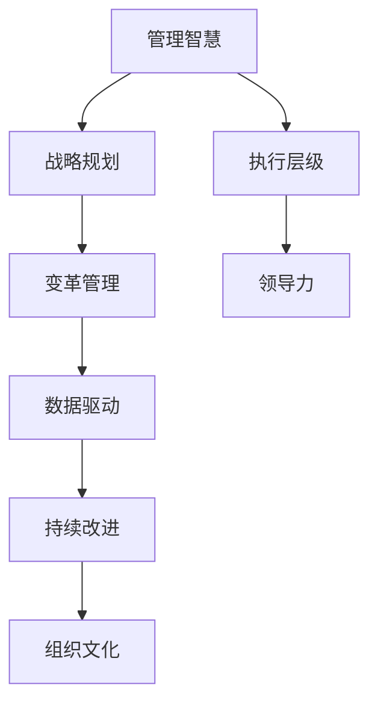

                 

# 管理的智慧：从策略到执行

> 关键词：管理智慧,战略规划,执行层级,变革管理,数据驱动,持续改进,领导力,组织文化

## 1. 背景介绍

### 1.1 问题由来
在日新月异的商业环境中，企业面临着复杂多变的挑战，如何有效地制定和执行管理策略，成为每一位管理者必须面对的重要问题。传统的管理模式往往缺乏系统性和科学性，难以应对快速变化的市场需求。而随着数字化转型的加速，数据驱动的管理方法逐渐成为主流，帮助企业在竞争中赢得先机。本文将从管理智慧、战略规划、执行层级等多个维度，深入探讨如何在复杂的商业环境中制定和执行有效的管理策略。

### 1.2 问题核心关键点
1. **管理智慧**：理解并应用管理智慧，帮助管理者在复杂环境中做出明智的决策。
2. **战略规划**：制定符合企业目标和市场需求的战略规划，确保资源配置的合理性。
3. **执行层级**：明确各层级的职责和任务，确保战略目标的顺利实现。
4. **变革管理**：有效管理组织变革，确保变革顺利进行。
5. **数据驱动**：利用数据支持管理决策，提升管理效率。
6. **持续改进**：建立持续改进机制，不断优化管理流程和策略。
7. **领导力**：提升领导者的管理能力和决策水平，引领组织向目标前进。
8. **组织文化**：营造积极向上的组织文化，增强员工的凝聚力和归属感。

## 2. 核心概念与联系

### 2.1 核心概念概述

为更好地理解管理的智慧和执行过程，本节将介绍几个关键概念：

- **管理智慧**：指管理者在管理实践中所展现的智慧和经验，包括对战略、组织、人力的深刻理解和运用。
- **战略规划**：指通过系统分析，制定符合企业发展目标和市场需求的长期战略计划。
- **执行层级**：指企业内部不同层级在战略执行过程中所承担的任务和职责。
- **变革管理**：指对组织进行战略性调整时，如何有效管理组织变革，确保变革顺利实施。
- **数据驱动**：指利用数据进行管理决策，提升决策的科学性和准确性。
- **持续改进**：指建立持续改进机制，不断优化管理流程和策略，以适应外部环境的变化。
- **领导力**：指领导者在团队管理中展现的影响力和决策能力。
- **组织文化**：指组织成员共同认可和遵守的行为规范和价值观。

这些核心概念之间的逻辑关系可以通过以下Mermaid流程图来展示：



这个流程图展示了大管理系统的核心概念及其之间的关系：

1. 管理智慧是管理实践的基础，指导战略规划的制定和执行层级的安排。
2. 战略规划是战略执行的蓝图，决定了组织的目标和方向。
3. 执行层级明确了各层级的职责，确保战略目标的实现。
4. 变革管理指导了组织在战略调整时的平稳过渡。
5. 数据驱动提供了科学的决策依据，提升了管理效率。
6. 持续改进保证了管理的动态性和适应性。
7. 领导力是战略执行的引擎，驱动组织前进。
8. 组织文化构建了团队共同的价值观和行为规范。

这些概念共同构成了管理系统的完整框架，帮助企业实现高效的管理和战略目标。

## 3. 核心算法原理 & 具体操作步骤
### 3.1 算法原理概述

管理智慧的实现和执行过程，本质上是一个复杂的多维度优化问题。其核心在于：

1. **战略规划**：通过系统化的分析和建模，制定符合企业目标的长期战略。
2. **执行层级**：明确各层级的职责和任务，确保战略目标的顺利实现。
3. **数据驱动**：利用数据支持决策，提升决策的科学性和准确性。
4. **持续改进**：建立持续改进机制，不断优化管理流程和策略。
5. **变革管理**：有效管理组织变革，确保变革顺利进行。

### 3.2 算法步骤详解

以下是管理智慧实现和执行的具体步骤：

**Step 1: 数据收集与分析**
- 收集企业内外部的各类数据，包括市场环境、财务数据、员工反馈等。
- 通过数据分析工具，如数据仓库、BI系统等，对数据进行整理和分析，挖掘有价值的信息。

**Step 2: 战略规划与目标设定**
- 利用数据分析结果，制定符合企业长期发展目标的战略规划。
- 设定具体的执行目标，明确各阶段的关键任务和指标。

**Step 3: 执行层级与资源配置**
- 根据战略规划，明确各层级在执行过程中的职责和任务。
- 合理配置资源，确保各项任务顺利进行。

**Step 4: 变革管理与风险控制**
- 评估变革对组织的影响，制定应对策略，减少变革阻力。
- 通过持续监测和评估，及时调整变革策略，规避风险。

**Step 5: 数据驱动与决策优化**
- 利用数据驱动的决策支持系统，优化管理决策。
- 建立数据反馈机制，持续监控决策效果，及时进行调整。

**Step 6: 持续改进与优化**
- 建立持续改进机制，定期评估和优化管理流程。
- 鼓励员工提出改进建议，提升管理效率。

**Step 7: 领导力提升与团队建设**
- 提升领导者的管理能力和决策水平。
- 构建积极的组织文化，增强团队凝聚力和归属感。

### 3.3 算法优缺点

管理智慧的实现和执行过程，具有以下优点和缺点：

**优点**：
1. **系统化管理**：通过系统分析和建模，确保管理过程的科学性和合理性。
2. **数据驱动决策**：利用数据支持管理决策，提高决策的准确性和科学性。
3. **持续改进机制**：通过持续优化管理流程，提升管理效率和效果。
4. **风险控制**：有效管理组织变革，减少变革阻力，规避风险。
5. **提升领导力**：通过培训和实践，提升领导者的管理能力和决策水平。
6. **营造积极文化**：构建积极的组织文化，增强团队的凝聚力和归属感。

**缺点**：
1. **数据收集成本高**：大规模数据收集和分析需要较高的成本和资源投入。
2. **变革管理难度大**：组织变革往往伴随着阻力，需要系统性管理和有效沟通。
3. **持续改进复杂**：持续改进机制的建立和优化需要较长的时间和资源投入。
4. **领导力要求高**：领导者需要在管理过程中展现出良好的领导力和决策能力。

### 3.4 算法应用领域

管理智慧的实现和执行过程，在多个领域得到了广泛应用，例如：

- **企业战略管理**：通过系统分析和建模，制定企业长期发展战略。
- **项目管理**：明确项目各层级的职责和任务，确保项目目标的实现。
- **人力资源管理**：通过数据驱动的决策支持系统，优化人才招聘和绩效管理。
- **供应链管理**：建立持续改进机制，提升供应链的效率和可靠性。
- **数字化转型**：利用数据驱动的变革管理，实现组织的数字化转型。

除了上述这些经典应用外，管理智慧在金融、医疗、教育等众多领域也得到了广泛应用，为各类组织的管理实践带来了新的思路和工具。随着数据驱动和管理智慧的不断演进，相信管理方法将变得更加科学和高效，帮助企业实现更高的管理目标和绩效。

## 4. 数学模型和公式 & 详细讲解  
### 4.1 数学模型构建

管理智慧的实现和执行过程，涉及多方面的数据和决策，可以建立数学模型进行分析和优化。

假设管理过程涉及n个层级，每个层级有m个任务，每个任务有k个关键指标，则管理过程可以表示为一个多维决策矩阵：

$$
A = [a_{ij}]
$$

其中 $a_{ij}$ 表示第i层级第j任务的第k个关键指标值。

通过数据分析，得到每个指标的权重 $w_{ik}$，则管理目标可以表示为：

$$
\text{目标} = \sum_{i=1}^n \sum_{j=1}^m \sum_{k=1}^K a_{ij}w_{ik}
$$

### 4.2 公式推导过程

以企业战略管理为例，利用系统动力学（System Dynamics, SD）建立数学模型：

- **战略规划阶段**：利用SD模型，建立组织内部的反馈机制，模拟不同战略方案的效果，选择最优方案。
- **执行层级阶段**：根据最优战略方案，分配任务和资源，建立SD模型，模拟执行效果。
- **持续改进阶段**：建立SD模型，持续监测和评估执行效果，优化管理流程。

### 4.3 案例分析与讲解

某制造企业在数字化转型过程中，通过系统动力学模型对战略规划和执行过程进行了优化：

- **战略规划阶段**：利用SD模型，模拟了数字化转型的不同路径，选择最优方案，确保资源配置合理。
- **执行层级阶段**：根据最优方案，明确了各层级的职责和任务，确保执行效果。
- **持续改进阶段**：建立了SD模型，持续监测执行效果，及时调整策略，提升管理效率。

通过SD模型的应用，该企业实现了数字化转型的顺利进行，显著提升了管理效果和企业绩效。

## 5. 项目实践：代码实例和详细解释说明
### 5.1 开发环境搭建

在进行管理智慧实现和执行的项目实践前，我们需要准备好开发环境。以下是使用Python进行系统动力学建模的开发环境配置流程：

1. 安装Anaconda：从官网下载并安装Anaconda，用于创建独立的Python环境。

2. 创建并激活虚拟环境：
```bash
conda create -n management-env python=3.8 
conda activate management-env
```

3. 安装相关工具包：
```bash
pip install pyviz bpython
```

4. 安装Python可视化库：
```bash
pip install matplotlib seaborn pandas plotly
```

5. 安装Python系统动力学库：
```bash
pip install pyviz
```

完成上述步骤后，即可在`management-env`环境中开始系统动力学建模的实践。

### 5.2 源代码详细实现

这里我们以企业战略管理为例，给出使用PyViz进行系统动力学建模的Python代码实现。

首先，定义企业战略管理的数据：

```python
import pyviz as pv
from pyviz.data import dataloader

# 加载企业战略管理数据
strategy_data = dataloader.load('strategy_data')
```

然后，构建系统动力学模型：

```python
# 创建系统动力学图
strategy_model = pv.Dviz(strategy_data, engine='pydag')

# 添加反馈回路
strategy_model.add_feedback('revenue', 'cost', 0.8)
strategy_model.add_feedback('revenue', 'investment', 0.6)

# 设定目标函数
strategy_model.set_objective('revenue', 'maximize')

# 运行模拟
strategy_model.run()
```

最后，查看系统动力学模型的输出结果：

```python
# 可视化输出结果
strategy_model.plot()
```

以上就是使用PyViz进行系统动力学建模的完整代码实现。可以看到，通过系统动力学模型，我们可以对企业的战略规划和执行过程进行量化和优化，帮助企业实现高效的管理和决策。

### 5.3 代码解读与分析

让我们再详细解读一下关键代码的实现细节：

**PyViz库**：
- `pyviz`：一个用于可视化系统动力学模型的Python库，支持多种绘图方式和模型构建。
- `pydag`：用于构建系统动力学模型的核心引擎，提供了丰富的反馈机制和目标函数设定功能。

**数据准备**：
- 使用`pyviz.data`模块加载企业战略管理数据，包含了关键指标和反馈回路的信息。
- 数据处理过程中，需要注意数据的时序性和完整性，确保模型的准确性和可靠性。

**模型构建**：
- 通过`pv.Dviz`类创建系统动力学图，指定模型的输入数据。
- 使用`add_feedback`方法添加反馈回路，模拟不同指标之间的相互影响。
- 使用`set_objective`方法设定目标函数，确保模型能够向最优解收敛。
- 运行模拟并获取输出结果，使用`plot`方法进行可视化展示。

**结果展示**：
- 通过`plot`方法可视化输出结果，直观展示模型运行效果和优化路径。

通过以上代码，我们可以看出，系统动力学模型为管理智慧的实现和执行提供了科学的方法和工具，帮助企业在复杂环境中做出明智的决策。

## 6. 实际应用场景
### 6.1 企业战略管理

系统动力学模型在企业战略管理中的应用，可以帮助企业制定科学合理的战略规划，确保资源配置的合理性和执行的效率。

在实践中，企业可以通过系统动力学模型：
- 对不同战略方案进行模拟和评估，选择最优方案。
- 明确各层级的职责和任务，确保战略目标的实现。
- 持续监测和评估执行效果，优化管理流程。

例如，某科技公司通过系统动力学模型，对数字化转型的不同路径进行了模拟和评估，选择了最优方案，并在执行过程中，通过持续监测和评估，及时调整策略，实现了数字化转型的顺利进行。

### 6.2 项目管理和绩效评估

系统动力学模型在项目管理中的应用，可以帮助项目管理者制定科学的项目计划，确保项目按时按质完成。

在实践中，项目管理团队可以通过系统动力学模型：
- 对项目各层级的职责和任务进行建模，确保项目目标的实现。
- 建立绩效评估模型，监测项目执行效果，及时发现和解决问题。
- 持续优化项目管理流程，提升项目管理效率和效果。

例如，某大型软件公司通过系统动力学模型，对重要项目的执行过程进行了建模和优化，确保了项目的按时按质完成，显著提升了项目管理的效率和效果。

### 6.3 供应链管理

系统动力学模型在供应链管理中的应用，可以帮助企业优化供应链的各个环节，提升供应链的效率和可靠性。

在实践中，企业可以通过系统动力学模型：
- 对供应链各环节进行建模，模拟不同策略的效果。
- 明确各层级的职责和任务，确保供应链目标的实现。
- 持续监测和评估供应链执行效果，优化供应链流程。

例如，某电商公司通过系统动力学模型，对供应链的各环节进行了建模和优化，提升了供应链的效率和可靠性，显著降低了运营成本。

### 6.4 未来应用展望

随着系统动力学模型的不断演进，其在管理智慧的实现和执行过程中将有更广泛的应用前景：

1. **多层次管理优化**：系统动力学模型可以进一步细化到各层级管理，实现多层次、多维度的优化。
2. **智能决策支持**：结合AI和数据挖掘技术，系统动力学模型可以提供智能决策支持，提升决策的科学性和准确性。
3. **动态优化机制**：通过引入动态优化算法，系统动力学模型可以实现对管理过程的动态优化，提升管理效率和效果。
4. **集成化平台**：系统动力学模型可以与其他管理工具集成，形成一个完整的管理智慧平台，支持多领域的智能管理。

## 7. 工具和资源推荐
### 7.1 学习资源推荐

为了帮助开发者系统掌握系统动力学建模的理论基础和实践技巧，这里推荐一些优质的学习资源：

1. 《系统动力学基础与应用》：详细介绍系统动力学模型的原理和应用，是系统动力学学习的不二之选。
2. 《系统动力学模型与仿真》：深入探讨系统动力学模型的建模方法和仿真技术，适合进阶学习。
3. 《系统动力学模型在企业管理中的应用》：结合企业管理案例，讲解系统动力学模型的应用方法和技巧。
4. 系统动力学建模的在线课程：如Coursera上的《System Dynamics in a Data Driven World》课程，提供系统动力学建模的实战演练。

通过对这些资源的学习实践，相信你一定能够快速掌握系统动力学模型的精髓，并用于解决实际的管理问题。

### 7.2 开发工具推荐

高效的开发离不开优秀的工具支持。以下是几款用于系统动力学建模开发的常用工具：

1. Python系统动力学库：如`pyviz`、`pydag`，提供了丰富的建模功能和可视化工具。
2. MATLAB系统动力学工具箱：提供了强大的建模和仿真功能，适合科学研究和实际应用。
3. Vensim：一款流行的系统动力学建模软件，支持多种输入输出格式和建模语言。
4. AnyLogic：一款全功能的系统动力学建模软件，支持多领域建模和仿真。

合理利用这些工具，可以显著提升系统动力学模型的开发效率，加快创新迭代的步伐。

### 7.3 相关论文推荐

系统动力学模型的发展源于学界的持续研究。以下是几篇奠基性的相关论文，推荐阅读：

1. J.D. Sterman. 《System Dynamics: Modeling for Organizations》：系统动力学模型的经典教材，深入讲解了系统动力学模型的原理和应用。
2. L. Yoon & H. Hyon. 《Management of Project Management: Management and Operations Management》：结合项目管理案例，探讨了系统动力学模型在项目管理中的应用。
3. H. D. Lasley & J. D. Sterman. 《Thinking Strategically with System Dynamics》：系统动力学模型的应用实践，强调了系统思维的重要性。
4. J.D. Sterman & M.L. Jevons. 《Building Organizational Models: A System Dynamics Approach to Strategy Formulation》：系统动力学模型在组织战略规划中的应用。
5. P.J. Daniel. 《System Dynamics Modeling with Python: A Practical Guide》：结合Python编程语言，讲解了系统动力学模型的建模和仿真。

这些论文代表了大管理系统的理论基础和实践方法，为系统动力学模型的发展提供了丰富的理论支持。

## 8. 总结：未来发展趋势与挑战
### 8.1 总结

本文对基于系统动力学模型的大管理智慧实现和执行过程进行了全面系统的介绍。首先阐述了大管理系统的核心概念和关键点，明确了系统动力学模型在管理实践中的重要地位。其次，从原理到实践，详细讲解了系统动力学模型的构建和应用，给出了系统动力学建模的完整代码实例。同时，本文还广泛探讨了系统动力学模型在企业战略管理、项目管理、供应链管理等多个领域的应用前景，展示了系统动力学模型的巨大潜力。此外，本文精选了系统动力学建模的学习资源和工具，力求为读者提供全方位的技术指引。

通过本文的系统梳理，可以看到，系统动力学模型在复杂环境中的管理智慧实现和执行过程，为企业提供了一套系统化、科学化的管理方案。利用系统动力学模型，企业可以更好地应对市场变化，提升管理效率和效果，实现更高的管理目标和绩效。

### 8.2 未来发展趋势

展望未来，系统动力学模型将呈现以下几个发展趋势：

1. **多层次管理优化**：系统动力学模型可以进一步细化到各层级管理，实现多层次、多维度的优化。
2. **智能决策支持**：结合AI和数据挖掘技术，系统动力学模型可以提供智能决策支持，提升决策的科学性和准确性。
3. **动态优化机制**：通过引入动态优化算法，系统动力学模型可以实现对管理过程的动态优化，提升管理效率和效果。
4. **集成化平台**：系统动力学模型可以与其他管理工具集成，形成一个完整的管理智慧平台，支持多领域的智能管理。
5. **跨领域应用**：系统动力学模型不仅限于企业管理，可以在医疗、教育、金融等领域广泛应用，提升各领域的智能化水平。

这些趋势凸显了系统动力学模型在管理智慧实现和执行过程中的广阔前景，为企业提供了更多科学管理和决策的工具和方法。

### 8.3 面临的挑战

尽管系统动力学模型在管理智慧的实现和执行过程中具有显著优势，但在实际应用中仍面临一些挑战：

1. **数据质量问题**：系统动力学模型的准确性和可靠性依赖于高质量的数据输入，数据质量不足可能导致模型偏差。
2. **模型复杂度**：系统动力学模型的构建和调试需要较高的专业知识和技能，模型过于复杂可能导致理解和使用困难。
3. **实施成本高**：系统动力学模型的实施需要较高的技术投入和资源支持，对于一些中小企业可能存在成本压力。
4. **模型维护难度大**：系统动力学模型需要持续维护和更新，模型维护难度大可能导致模型效果下降。
5. **应用场景限制**：系统动力学模型在某些特殊场景下可能无法适用，需要结合其他管理方法进行综合应用。

### 8.4 研究展望

面对系统动力学模型所面临的挑战，未来的研究需要在以下几个方面寻求新的突破：

1. **数据质量提升**：通过数据清洗和预处理技术，提升数据质量和准确性，确保模型可靠性和有效性。
2. **模型简化和优化**：通过简化模型结构和优化算法，提升模型的可解释性和易用性，降低实施成本和维护难度。
3. **跨领域应用探索**：在企业管理的基础上，拓展系统动力学模型在其他领域的应用，提升各领域的智能化水平。
4. **混合管理方法**：结合其他管理方法，如敏捷管理、精益管理等，形成综合管理方案，提升管理效果和效果。
5. **智能决策支持**：结合AI和数据挖掘技术，提供智能决策支持，提升决策的科学性和准确性。

这些研究方向将进一步推动系统动力学模型的发展，帮助企业实现更高水平的管理智慧和决策效果。

## 9. 附录：常见问题与解答

**Q1：系统动力学模型是否适用于所有管理场景？**

A: 系统动力学模型适用于具有复杂反馈关系和动态变化的管理场景，但对于简单线性关系和静态环境，可能过于复杂。因此需要根据具体场景，选择适合的模型和方法。

**Q2：系统动力学模型如何处理不确定性？**

A: 系统动力学模型通过建立反馈机制，模拟不确定性和变化的影响，帮助企业应对复杂的动态环境。但在实践中，需要通过多次模拟和迭代，不断优化模型参数，提升模型的稳健性和可靠性。

**Q3：系统动力学模型的实施成本高吗？**

A: 系统动力学模型的实施成本相对较高，需要较高的技术投入和资源支持。但对于大型企业和管理复杂场景，可以通过共享平台和资源，降低实施成本。

**Q4：系统动力学模型如何确保模型效果？**

A: 通过数据清洗和预处理，提升数据质量和准确性，确保模型可靠性和有效性。同时，需要持续监测和评估模型效果，根据实际情况及时调整和优化模型。

**Q5：系统动力学模型是否容易理解和使用？**

A: 系统动力学模型具有一定的复杂性，需要较高的专业知识和技能，但对于具备相应知识背景的管理者，可以通过系统学习和实践，逐步掌握模型的使用方法。

---

作者：禅与计算机程序设计艺术 / Zen and the Art of Computer Programming

