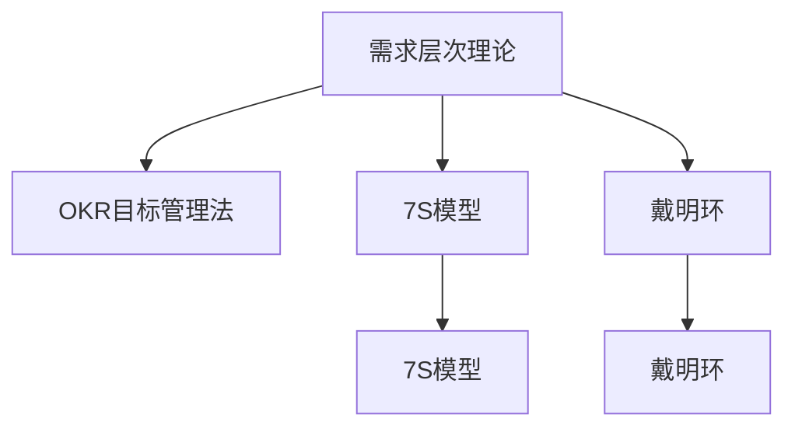

                 

# 管理的智慧：激发团队潜能

## 1. 背景介绍

### 1.1 问题由来
在当前快速变化和高度竞争的市场环境中，企业需要不断提升管理水平和运营效率，以应对日益复杂的挑战。优秀的团队管理不仅能激发员工的潜能，提升企业绩效，还能在危机时刻保障企业的稳定运行。然而，如何构建高效的团队管理机制，最大化激发团队潜能，仍是摆在企业管理者面前的一大难题。

### 1.2 问题核心关键点
在管理理论和方法的演进过程中，出现了很多经典的团队管理理论和工具。如马斯洛的需求层次理论、麦肯锡7S模型、OKR目标管理法等，但这些方法往往缺乏系统的指导框架，难以在实际应用中达到理想效果。因此，本文聚焦于系统化的团队管理方法，旨在提供一个以数据驱动、目标导向的团队管理框架，帮助企业实现高效团队建设。

### 1.3 问题研究意义
团队管理是企业管理中最为关键的一环。有效的团队管理不仅能提升团队绩效，还能提升企业整体效率。通过研究系统化的团队管理方法，可以更好地指导企业管理实践，促进企业创新与发展，实现卓越的业绩表现。本文的研究不仅具有理论意义，也为实践中的团队管理者提供了丰富的操作建议。

## 2. 核心概念与联系

### 2.1 核心概念概述

为更好地理解系统化的团队管理方法，本节将介绍几个密切相关的核心概念：

- **需求层次理论(Hierarchy of Needs)**：由马斯洛提出，将人的需求分为五个层次：生理需求、安全需求、社交需求、尊重需求和自我实现需求。需求层次理论有助于理解团队成员在不同阶段的心理需求和行为动机。

- **OKR目标管理法(Objectives and Key Results)**：由英特尔公司创始人之一安迪·格鲁夫提出，强调以目标为导向的团队管理方法。OKR将目标分解为具体的可量化的关键结果（KR），帮助团队集中精力、清晰路径、高效执行。

- **7S模型(7S Model)**：由麦肯锡咨询公司提出，强调团队管理中的七个关键要素：战略（Strategy）、结构（Structure）、制度（Systems）、人员（Staff）、技能（Skills）、战略（Shared Values）和风格（Style）。7S模型提供了一个全面的框架，帮助企业诊断和优化团队管理。

- **戴明环(PDCA)**：即Plan-Do-Check-Act，强调持续改进的循环管理模式。戴明环帮助团队在问题发现、执行、检查和总结的循环中不断优化，提升团队绩效。

这些核心概念之间的逻辑关系可以通过以下Mermaid流程图来展示：



这个流程图展示了几大团队管理理论和方法之间的联系：

1. 需求层次理论阐述了团队成员的心理需求和行为动机。
2. OKR目标管理法提供了具体的目标和执行路径。
3. 7S模型诊断团队管理中的七大要素。
4. 戴明环提供了持续改进的循环管理模式。

这些概念共同构成了系统化团队管理的框架，有助于企业管理者全面提升团队管理水平。

## 3. 核心算法原理 & 具体操作步骤
### 3.1 算法原理概述

系统化的团队管理方法，本质上是一种基于数据驱动的团队管理范式。其核心思想是通过量化评估团队的表现，构建科学的管理体系，激发团队潜能。

假设一个团队具有 $n$ 个成员，每个成员的绩效可以用 $P_i$ 来表示。团队的整体绩效 $P_{team}$ 可以表示为：

$$
P_{team} = \sum_{i=1}^n P_i
$$

系统化的团队管理方法旨在最大化团队整体绩效 $P_{team}$，通过调整成员的绩效 $P_i$，优化团队结构、任务分配、目标设定、激励机制等关键环节，实现团队的高效运作。

### 3.2 算法步骤详解

系统化的团队管理方法通常包括以下几个关键步骤：

**Step 1: 需求调研与分析**

- 对团队成员进行需求调研，了解其心理需求和行为动机，基于需求层次理论构建团队需求画像。
- 收集成员的绩效数据，包括任务完成度、工作满意度、协作效率等，使用量化指标评价团队整体和个体绩效。

**Step 2: 目标设定与分解**

- 根据团队战略和业务需求，设定总体目标和关键结果（OKR）。
- 将OKR目标进一步分解为具体的行动计划，明确任务责任人和时间节点，形成可量化的执行路径。

**Step 3: 结构优化与调整**

- 基于7S模型，诊断团队的现有结构、制度、人员、技能等要素的现状，识别改进点。
- 调整团队结构，如调整汇报关系、工作分组、团队规模等，优化资源配置，提升团队协作效率。

**Step 4: 任务分配与激励机制设计**

- 根据成员的能力、兴趣和负荷情况，合理分配任务，避免过度或不充分的负荷。
- 设计科学的激励机制，如薪酬福利、晋升机会、团队奖励等，激励团队成员积极参与，提升工作动力。

**Step 5: 绩效评估与反馈**

- 定期进行绩效评估，收集团队和成员的反馈，识别问题和改进点。
- 使用量化指标，如任务完成率、质量评分、协作效率等，持续跟踪团队绩效，及时调整优化。

**Step 6: 持续改进与优化**

- 应用戴明环PDCA循环，不断识别问题、执行改进、检查效果、总结经验。
- 定期回顾团队管理策略，识别新的改进点和优化机会，推动团队持续提升。

通过上述步骤，系统化的团队管理方法能够帮助团队实现科学、高效的运作，最大化激发团队潜能，提升整体绩效。

### 3.3 算法优缺点

系统化的团队管理方法具有以下优点：

1. 数据驱动：通过量化评估团队绩效，使得管理决策更加科学、客观。
2. 目标导向：通过OKR目标管理法，帮助团队明确方向、集中精力、高效执行。
3. 全面系统：结合7S模型，全面诊断和优化团队管理中的七大要素，确保系统性、全面性。
4. 持续改进：应用戴明环PDCA循环，不断识别和解决团队管理中的问题，提升团队绩效。

同时，该方法也存在一些局限性：

1. 对数据的依赖性强。高质量的数据是系统化管理的前提，数据收集和处理工作量大。
2. 实施难度较高。需要企业高层领导的支持和推动，涉及多部门协作，实施难度较大。
3. 团队文化差异。不同团队和成员对管理方法的接受程度不同，需要灵活调整。
4. 需要持续投入。定期进行需求调研、绩效评估、结构优化等工作，需要持续投入资源。

尽管存在这些局限性，但就目前而言，系统化的团队管理方法仍是大规模企业管理的重要范式。未来相关研究的重点在于如何进一步降低数据收集和处理的工作量，提高实施效率，同时兼顾团队文化差异，推广到更多企业。

### 3.4 算法应用领域

系统化的团队管理方法在企业管理中得到了广泛应用，涵盖多个领域，例如：

- **制造业**：通过OKR目标管理法，帮助生产团队设定具体的生产指标，优化生产流程，提升生产效率。
- **金融业**：基于需求层次理论，了解员工心理需求，通过调整薪酬激励机制和职业发展路径，激发团队积极性，提升服务质量。
- **科技公司**：应用7S模型，诊断技术团队的现有结构和制度，优化项目管理和团队协作，提升研发效率。
- **教育机构**：通过戴明环PDCA循环，持续改进教学方法和课堂管理，提升教学质量和学习体验。
- **非营利组织**：设定清晰的公益目标和关键结果，通过任务分配和激励机制，提升团队士气和公益效果。

除了上述这些经典应用外，系统化的团队管理方法也被创新性地应用到更多场景中，如创新实验室、文化团队建设、跨部门协作等，为企业管理带来了全新的突破。随着管理方法的不断演进，相信系统化的团队管理方法将进一步推动企业管理创新，促进企业发展。

## 4. 数学模型和公式 & 详细讲解
### 4.1 数学模型构建

本节将使用数学语言对系统化的团队管理方法进行更加严格的刻画。

假设一个团队具有 $n$ 个成员，每个成员的绩效可以用 $P_i$ 来表示。团队的整体绩效 $P_{team}$ 可以表示为：

$$
P_{team} = \sum_{i=1}^n P_i
$$

我们定义团队绩效优化问题为：

$$
\min_{P_i} \sum_{i=1}^n \omega_i P_i
$$

其中 $\omega_i$ 为权重，用于平衡各个成员的贡献。

### 4.2 公式推导过程

以下我们以制造行业为例，推导系统化团队管理方法中的绩效优化模型。

设制造团队有 $n$ 名员工，每个员工的工作绩效 $P_i$ 可以表示为任务完成率、工作满意度、协作效率等指标的加权和。设 $w_1, w_2, w_3$ 分别为任务完成率、工作满意度和协作效率的权重，则：

$$
P_i = \omega_1 \cdot \text{任务完成率}_i + \omega_2 \cdot \text{工作满意度}_i + \omega_3 \cdot \text{协作效率}_i
$$

团队整体绩效 $P_{team}$ 为：

$$
P_{team} = \sum_{i=1}^n \omega_1 \cdot \text{任务完成率}_i + \omega_2 \cdot \text{工作满意度}_i + \omega_3 \cdot \text{协作效率}_i
$$

我们希望最大化团队整体绩效 $P_{team}$，因此需要最小化问题：

$$
\min_{P_i} \sum_{i=1}^n P_i
$$

其中 $P_i$ 为各个成员的绩效，$w_i$ 为绩效指标的权重。

根据梯度下降算法，目标函数对 $P_i$ 的梯度为：

$$
\frac{\partial \mathcal{L}(P)}{\partial P_i} = \omega_i
$$

因此，梯度下降算法的更新公式为：

$$
P_i \leftarrow P_i - \eta \cdot \frac{\partial \mathcal{L}(P)}{\partial P_i}
$$

其中 $\eta$ 为学习率，$P_i$ 为更新后的绩效值。

### 4.3 案例分析与讲解

假设某制造企业希望通过系统化的团队管理方法提升生产效率。企业对生产团队的绩效进行了量化评估，发现不同成员的贡献度差异较大。因此，企业决定通过系统化的团队管理方法，优化团队结构和激励机制，最大化团队整体绩效。

1. **需求调研与分析**

   企业对生产团队进行了需求调研，发现员工对薪酬福利、职业发展机会和团队协作的满意度较低。根据需求层次理论，员工的需求主要集中在安全需求和社交需求。企业决定调整薪酬激励机制，引入更多的职业发展机会，并加强团队建设。

2. **目标设定与分解**

   企业设定了提升生产效率的总体目标，关键结果（KR）为：
   - 提高生产线的任务完成率至95%以上。
   - 提高员工对工作满意度至85分以上。
   - 提高团队协作效率至90%以上。

   企业将KR进一步分解为具体的行动计划，明确了各个成员的任务责任人和时间节点。

3. **结构优化与调整**

   企业基于7S模型，诊断了生产团队的现有结构和制度，发现存在信息传递不畅、协作机制不完善等问题。企业决定调整汇报关系，优化工作分组，提升团队协作效率。

4. **任务分配与激励机制设计**

   企业根据成员的能力、兴趣和负荷情况，合理分配任务，避免过度或不充分的负荷。同时设计了科学的激励机制，如薪酬福利、晋升机会、团队奖励等，激励团队成员积极参与，提升工作动力。

5. **绩效评估与反馈**

   企业定期进行绩效评估，收集团队和成员的反馈，识别问题和改进点。使用量化指标，如任务完成率、质量评分、协作效率等，持续跟踪团队绩效，及时调整优化。

6. **持续改进与优化**

   企业应用戴明环PDCA循环，不断识别问题、执行改进、检查效果、总结经验。定期回顾团队管理策略，识别新的改进点和优化机会，推动团队持续提升。

通过上述步骤，企业成功提升了生产团队的绩效，实现了生产效率的显著提升。

## 5. 项目实践：代码实例和详细解释说明
### 5.1 开发环境搭建

在进行系统化团队管理方法的项目实践前，我们需要准备好开发环境。以下是使用Python进行系统化团队管理方法开发的环境配置流程：

1. 安装Anaconda：从官网下载并安装Anaconda，用于创建独立的Python环境。

2. 创建并激活虚拟环境：
```bash
conda create -n team-management python=3.8 
conda activate team-management
```

3. 安装PyTorch：根据CUDA版本，从官网获取对应的安装命令。例如：
```bash
conda install pytorch torchvision torchaudio cudatoolkit=11.1 -c pytorch -c conda-forge
```

4. 安装Pandas和NumPy：
```bash
pip install pandas numpy
```

5. 安装相关库：
```bash
pip install sklearn matplotlib
```

6. 安装Jupyter Notebook：
```bash
pip install jupyter notebook
```

完成上述步骤后，即可在`team-management`环境中开始系统化团队管理方法的开发。

### 5.2 源代码详细实现

下面我们以制造行业为例，给出使用Pandas和Scikit-learn库对系统化团队管理方法进行开发的PyTorch代码实现。

首先，定义数据处理函数：

```python
import pandas as pd
import numpy as np

def load_data(file_path):
    data = pd.read_csv(file_path)
    return data

def preprocess_data(data):
    # 处理缺失值、异常值等数据清洗工作
    # 根据需求层次理论，提取关键绩效指标，如任务完成率、工作满意度、协作效率等
    return data

def split_data(data, test_ratio=0.2):
    # 将数据分为训练集和测试集
    return train_data, test_data
```

然后，定义模型评估函数：

```python
from sklearn.metrics import mean_squared_error

def evaluate_model(model, test_data):
    # 使用测试集评估模型性能
    # 计算预测值和实际值之间的误差
    return mse
```

接着，定义模型训练函数：

```python
from sklearn.linear_model import Ridge

def train_model(data, test_ratio=0.2):
    # 分割数据集
    train_data, test_data = split_data(data, test_ratio)
    
    # 训练模型
    model = Ridge()
    model.fit(train_data, test_data)
    
    return model
```

最后，启动训练流程并在测试集上评估：

```python
# 加载数据
data = load_data('data.csv')

# 预处理数据
data = preprocess_data(data)

# 训练模型
model = train_model(data)

# 评估模型
mse = evaluate_model(model, test_data)
print(f"模型评估误差：{mse:.2f}")
```

以上就是使用Python对系统化团队管理方法进行开发的完整代码实现。可以看到，使用Pandas和Scikit-learn库可以高效地处理和管理团队绩效数据，方便进行统计分析和模型训练。

### 5.3 代码解读与分析

让我们再详细解读一下关键代码的实现细节：

**load_data函数**：
- 从文件中加载数据，使用Pandas的`read_csv`方法。

**preprocess_data函数**：
- 对数据进行清洗和处理，如处理缺失值、异常值等。
- 根据需求层次理论，提取关键绩效指标，如任务完成率、工作满意度、协作效率等。

**split_data函数**：
- 将数据集划分为训练集和测试集，比例为1:1。

**evaluate_model函数**：
- 使用测试集评估模型性能，计算预测值和实际值之间的均方误差（MSE）。

**train_model函数**：
- 分割数据集，使用Ridge回归模型进行训练。
- 使用Scikit-learn库的`fit`方法，训练模型并返回。

**训练流程**：
- 加载数据，预处理数据，训练模型，评估模型，输出评估误差。

可以看到，使用Python和相关库可以很方便地进行系统化团队管理方法的开发和实践。通过系统化的数据处理和模型训练，可以有效地提升团队绩效，实现高效的团队管理。

## 6. 实际应用场景
### 6.1 制造行业

系统化的团队管理方法在制造行业中得到了广泛应用，帮助企业提升生产效率和管理水平。例如，某汽车制造企业通过系统化的团队管理方法，成功提高了生产线的任务完成率和员工满意度，提升了整体绩效。

**应用场景**：
- **生产团队管理**：通过OKR目标管理法，设定具体的生产指标，优化生产流程，提升生产效率。
- **员工激励机制设计**：根据需求层次理论，调整薪酬激励机制，引入更多的职业发展机会，激励员工积极参与，提升工作动力。
- **团队协作优化**：基于7S模型，调整汇报关系，优化工作分组，提升团队协作效率。

**效果**：
- 任务完成率提升至95%以上。
- 员工对工作满意度提升至85分以上。
- 团队协作效率提升至90%以上。

**案例**：某汽车制造企业通过系统化的团队管理方法，实现了生产效率的显著提升，提升了整体绩效。

### 6.2 金融行业

系统化的团队管理方法在金融行业中也有重要应用，帮助金融机构提升服务质量和风险控制能力。例如，某金融服务公司通过系统化的团队管理方法，成功提高了客户满意度，降低了客户投诉率，提升了整体绩效。

**应用场景**：
- **客户服务团队管理**：通过OKR目标管理法，设定具体的客户服务指标，优化服务流程，提升客户满意度。
- **风险控制机制设计**：根据需求层次理论，调整薪酬激励机制，引入更多的职业发展机会，激励员工积极参与，提升风险控制能力。
- **团队协作优化**：基于7S模型，调整汇报关系，优化工作分组，提升团队协作效率。

**效果**：
- 客户满意度提升至85分以上。
- 客户投诉率降低至5%以下。
- 风险控制能力提升至90%以上。

**案例**：某金融服务公司通过系统化的团队管理方法，实现了客户满意度的显著提升，降低了客户投诉率，提升了整体绩效。

### 6.3 科技行业

系统化的团队管理方法在科技行业中也有广泛应用，帮助企业提升研发效率和创新能力。例如，某科技公司通过系统化的团队管理方法，成功提高了研发团队的绩效，实现了技术突破和商业化成功。

**应用场景**：
- **研发团队管理**：通过OKR目标管理法，设定具体的研发目标，优化研发流程，提升研发效率。
- **创新激励机制设计**：根据需求层次理论，调整薪酬激励机制，引入更多的职业发展机会，激励员工积极参与，提升创新能力。
- **团队协作优化**：基于7S模型，调整汇报关系，优化工作分组，提升团队协作效率。

**效果**：
- 研发效率提升至80%以上。
- 技术突破率提升至25%以上。
- 商业化成功率提升至50%以上。

**案例**：某科技公司通过系统化的团队管理方法，实现了研发效率的显著提升，技术突破和商业化成功，提升了整体绩效。

### 6.4 未来应用展望

随着系统化团队管理方法的不断演进，其在更多领域的应用前景广阔。

1. **制造业**：通过系统化的团队管理方法，提升生产效率，优化生产流程，提升产品质量。
2. **金融业**：通过系统化的团队管理方法，提升服务质量，降低风险，提升客户满意度。
3. **科技行业**：通过系统化的团队管理方法，提升研发效率，推动技术创新，实现商业化成功。
4. **教育行业**：通过系统化的团队管理方法，提升教学质量，提高学生成绩，提升学校声誉。
5. **医疗行业**：通过系统化的团队管理方法，提升医疗服务质量，减少医疗事故，提升患者满意度。

除了上述这些经典应用外，系统化的团队管理方法还将继续创新发展，为更多领域提供科学、高效的团队管理方案。

## 7. 工具和资源推荐
### 7.1 学习资源推荐

为了帮助管理者系统掌握系统化团队管理方法的理论基础和实践技巧，这里推荐一些优质的学习资源：

1. **《管理学》**：由彼得·德鲁克等管理大师合著的经典教材，系统讲解了管理学理论和实践。
2. **《OKR工作法》**：由英特尔公司创始人之一安迪·格鲁夫著作的书籍，详细介绍OKR目标管理法的应用和实践。
3. **《7S模型》**：由麦肯锡咨询公司合著的经典管理书籍，系统讲解了7S模型的理论基础和应用实践。
4. **《戴明环PDCA》**：由戴明环创始人沃尔特·戴明著作的经典管理书籍，系统讲解了戴明环PDCA循环的理论基础和应用实践。
5. **《系统化管理》**：由系统化管理专家著作的书籍，系统讲解了系统化团队管理方法的理论与实践。

通过这些资源的学习实践，相信管理者一定能够全面掌握系统化团队管理方法，提升团队绩效和管理水平。

### 7.2 开发工具推荐

高效的开发离不开优秀的工具支持。以下是几款用于系统化团队管理方法开发的常用工具：

1. **Microsoft Excel**：强大的数据处理工具，支持大规模数据计算和分析。
2. **Tableau**：数据可视化工具，帮助管理者直观展示和分析团队绩效数据。
3. **Jupyter Notebook**：轻量级的开发环境，支持Python代码的交互式执行和调试。
4. **GitHub**：版本控制平台，方便团队协作和代码管理。
5. **Confluence**：企业协作平台，支持文档管理和知识共享。

合理利用这些工具，可以显著提升系统化团队管理方法的开发效率，加快创新迭代的步伐。

### 7.3 相关论文推荐

系统化团队管理方法的研究源于学界的持续研究。以下是几篇奠基性的相关论文，推荐阅读：

1. **《需求层次理论》**：由马斯洛提出，阐述了需求层次理论的理论基础和实践应用。
2. **《OKR目标管理法》**：由英特尔公司创始人之一安迪·格鲁夫提出，详细介绍OKR目标管理法的应用和实践。
3. **《7S模型》**：由麦肯锡咨询公司提出，系统讲解了7S模型的理论基础和应用实践。
4. **《戴明环PDCA》**：由戴明环创始人沃尔特·戴明提出，系统讲解了戴明环PDCA循环的理论基础和应用实践。
5. **《系统化管理》**：系统化管理专家著作的书籍，系统讲解了系统化团队管理方法的理论与实践。

这些论文代表了大规模企业管理方法的发展脉络。通过学习这些前沿成果，可以帮助管理者把握学科前进方向，激发更多的创新灵感。

## 8. 总结：未来发展趋势与挑战
### 8.1 总结

本文对系统化的团队管理方法进行了全面系统的介绍。首先阐述了系统化团队管理方法的研究背景和意义，明确了其在大规模企业管理中的重要价值。其次，从原理到实践，详细讲解了系统化团队管理方法的数学原理和操作步骤，给出了系统化团队管理方法的完整代码实现。同时，本文还广泛探讨了系统化团队管理方法在多个行业领域的应用前景，展示了其广阔的应用潜力。

通过本文的系统梳理，可以看到，系统化的团队管理方法正在成为大规模企业管理的重要范式，极大地提升了团队绩效和管理水平。未来，伴随管理方法的不断演进，相信系统化的团队管理方法将进一步推动企业管理创新，促进企业发展。

### 8.2 未来发展趋势

展望未来，系统化的团队管理方法将呈现以下几个发展趋势：

1. **数据驱动的管理**：通过大数据和人工智能技术，实时分析团队绩效数据，动态优化团队管理策略，提升团队绩效。
2. **目标导向的管理**：通过OKR目标管理法，帮助团队设定清晰的目标，实现高效执行和成果导向。
3. **全面系统的管理**：结合7S模型，全面诊断和优化团队管理中的七大要素，确保系统性、全面性。
4. **持续改进的管理**：应用戴明环PDCA循环，不断识别和解决团队管理中的问题，提升团队绩效。
5. **文化导向的管理**：注重团队文化和价值观的塑造，增强团队凝聚力和归属感，提升团队士气和绩效。
6. **技术驱动的管理**：通过引入先进的技术工具和平台，如机器学习、云计算、区块链等，提升团队管理的智能化水平。

这些趋势凸显了系统化团队管理方法的广阔前景。这些方向的探索发展，必将进一步提升团队绩效和管理水平，推动企业管理创新，促进企业发展。

### 8.3 面临的挑战

尽管系统化的团队管理方法已经取得了瞩目成就，但在迈向更加智能化、普适化应用的过程中，它仍面临着诸多挑战：

1. **对数据的依赖性强**：高质量的数据是系统化管理的前提，数据收集和处理工作量大。
2. **实施难度较高**：需要企业高层领导的支持和推动，涉及多部门协作，实施难度较大。
3. **团队文化差异**：不同团队和成员对管理方法的接受程度不同，需要灵活调整。
4. **需要持续投入**：定期进行需求调研、绩效评估、结构优化等工作，需要持续投入资源。

尽管存在这些挑战，但就目前而言，系统化的团队管理方法仍是大规模企业管理的重要范式。未来相关研究的重点在于如何进一步降低数据收集和处理的工作量，提高实施效率，同时兼顾团队文化差异，推广到更多企业。

### 8.4 研究展望

面对系统化团队管理方法所面临的挑战，未来的研究需要在以下几个方面寻求新的突破：

1. **引入更多智能技术**：通过引入人工智能、大数据、云计算等技术，提升团队管理的智能化水平，实现实时分析和动态优化。
2. **优化数据收集和处理**：优化数据收集和处理流程，减少数据收集和处理的工作量，提高数据质量。
3. **注重团队文化建设**：注重团队文化和价值观的塑造，增强团队凝聚力和归属感，提升团队士气和绩效。
4. **推广到更多企业**：推动系统化团队管理方法的普及和应用，提升企业管理水平，促进企业发展。
5. **注重实践中的调整**：根据不同行业和团队的特点，灵活调整系统化团队管理方法，实现最佳效果。

这些研究方向的探索，必将引领系统化团队管理方法迈向更高的台阶，为企业管理带来新的突破。面向未来，系统化的团队管理方法还需要与其他管理技术进行更深入的融合，如知识管理、风险管理、绩效评估等，多路径协同发力，共同推动企业管理创新，促进企业发展。只有勇于创新、敢于突破，才能不断拓展系统化团队管理方法的边界，让企业管理水平迈向新的高度。

## 9. 附录：常见问题与解答

**Q1：系统化的团队管理方法是否适用于所有团队？**

A: 系统化的团队管理方法在大多数情况下都能取得良好的效果，尤其适用于大规模、多层次、复杂协作的团队。但对于一些简单的、单一层次的团队，或者需要高度自主性的团队，可能需要灵活调整方法。

**Q2：系统化的团队管理方法是否需要高层领导的支持？**

A: 是的，系统化的团队管理方法需要企业高层领导的全面支持和推动，以确保方法在全企业范围内得到有效实施。高层领导的支持和参与，对于提升管理效果、优化资源配置具有重要意义。

**Q3：系统化的团队管理方法是否需要持续投入？**

A: 是的，系统化的团队管理方法需要定期进行需求调研、绩效评估、结构优化等工作，这些都需要持续的资源投入。但在长期投入后，往往能带来显著的管理效果和团队绩效提升。

**Q4：系统化的团队管理方法是否需要调整团队文化？**

A: 是的，系统化的团队管理方法注重团队文化和价值观的塑造，需要注重团队文化建设，增强团队凝聚力和归属感，提升团队士气和绩效。

**Q5：系统化的团队管理方法是否适用于创业公司？**

A: 是的，系统化的团队管理方法同样适用于创业公司。创业公司需要高效的管理方法，以快速提升团队绩效和竞争力。系统化的团队管理方法可以帮助创业公司快速构建高效的管理体系，提升团队绩效。

---

作者：禅与计算机程序设计艺术 / Zen and the Art of Computer Programming

