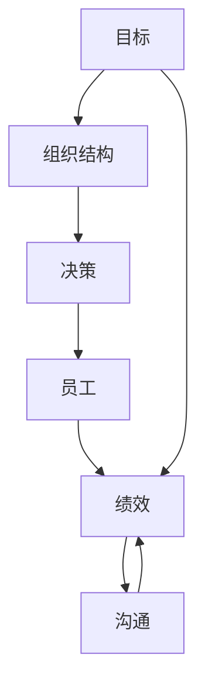

                 

# 管理的艺术：德鲁克的洞见

> 关键词：管理哲学,组织设计,决策制定,企业文化,领导力,创新驱动,企业绩效,人力资源管理

## 1. 背景介绍

彼得·德鲁克，被誉为“现代管理学之父”，是管理思想界的一位巨擘，其经典著作《管理的艺术》深刻揭示了管理的内涵与精髓。德鲁克的洞见不仅适用于企业，也对个人与组织的发展具有重要的指导意义。本文章将围绕德鲁克的管理艺术，探讨其核心概念与实践方法，为读者提供一套系统的管理理论框架。

## 2. 核心概念与联系

### 2.1 核心概念概述

德鲁克的管理艺术主要包括六个核心概念：目标、组织结构、决策、员工、绩效、沟通。这些概念相互联系，共同构成了他的管理哲学。

**目标**：明确企业目标，即公司存在的理由和追求。目标不仅是战略方向，更是激励员工的重要力量。

**组织结构**：如何通过组织结构设计来支持目标的实现。有效的组织结构应能快速反应市场变化，同时确保各部门间的协同运作。

**决策**：决策是管理活动中最重要的环节，德鲁克强调了基于事实和分析的决策方法。决策需要权衡利弊，平衡短期与长期利益。

**员工**：人是企业最重要的资源，德鲁克主张通过“员工为王”的管理理念，提升员工满意度和创造力。

**绩效**：如何衡量和管理企业绩效，确保资源的最优配置和业务的高效运营。

**沟通**：沟通是组织内部和外部的桥梁，通过有效的沟通，实现信息的共享与理解。

### 2.2 核心概念原理和架构的 Mermaid 流程图



## 3. 核心算法原理 & 具体操作步骤

### 3.1 算法原理概述

德鲁克的管理艺术结合了理论分析与实际操作的实践。其核心算法原理主要围绕目标设定、组织结构设计、决策制定、绩效评估等关键环节展开。每个环节的算法原理都是基于数据驱动、系统思考和人性关怀的深度融合。

### 3.2 算法步骤详解

#### 3.2.1 目标设定

**步骤1：** 明确公司使命和目标。
- 分析公司内外环境，确定关键战略方向。
- 通过SWOT分析评估公司的优势、劣势、机会和威胁。
- 设定短期和长期的明确目标，确保目标的SMART性（具体、可衡量、可达成、相关、时限性）。

**步骤2：** 分解目标，设定各层级目标。
- 从公司级目标分解到部门级、团队级和个人级目标。
- 确保各级目标的一致性和可执行性。

#### 3.2.2 组织结构设计

**步骤1：** 确定组织结构类型。
- 根据目标和业务特点选择合适的组织结构（如职能型、项目型、矩阵型等）。
- 评估不同结构类型对目标实现的支撑度和资源需求。

**步骤2：** 设计组织层级和职责。
- 确定各层级的职责和权限，确保各层级间的职责划分清晰。
- 设计跨职能团队，促进信息共享和协作。

#### 3.2.3 决策制定

**步骤1：** 收集信息和分析数据。
- 通过数据收集和分析，形成决策依据。
- 利用数据可视化工具展示数据趋势和关键指标。

**步骤2：** 制定决策方案。
- 根据数据结果，制定备选方案，并进行优劣对比。
- 引入多角度的分析和预测模型，提高决策的科学性和前瞻性。

**步骤3：** 实施和调整。
- 选择最佳方案，并制定详细的实施计划。
- 跟踪实施效果，根据反馈调整决策。

#### 3.2.4 绩效评估

**步骤1：** 设定绩效指标。
- 根据目标和战略，设定关键绩效指标（KPI）。
- 确保指标的全面性和可衡量性。

**步骤2：** 数据收集与分析。
- 收集与绩效指标相关的数据，如财务报表、业务数据等。
- 分析数据，评估绩效表现。

**步骤3：** 反馈与改进。
- 通过绩效评估反馈结果，指导改进措施。
- 建立持续改进机制，提升整体绩效。

### 3.3 算法优缺点

**优点：**
- 理论结合实践，系统性强，易于操作。
- 强调目标驱动，提升组织执行力。
- 科学决策，减少主观偏差。
- 强调员工价值，提升组织凝聚力。

**缺点：**
- 对数据依赖度高，数据质量直接影响决策效果。
- 流程复杂，需要大量时间和资源投入。
- 对管理者的素质要求高，执行难度较大。

### 3.4 算法应用领域

德鲁克的管理艺术不仅适用于企业，也广泛应用于各种组织和个人的管理实践。

- **企业管理**：在大型跨国公司和中小型企业中，通过目标设定、组织设计、决策制定等环节，提高企业竞争力。
- **政府管理**：通过明确政策目标、优化政府结构和决策机制，提升政府效能和服务水平。
- **非营利组织管理**：通过设定使命和目标，优化资源配置和人员管理，实现组织目标。
- **个人发展**：通过明确个人目标，优化时间管理和资源配置，实现个人职业和生活发展。

## 4. 数学模型和公式 & 详细讲解

### 4.1 数学模型构建

德鲁克的管理艺术虽然以实践为主，但也包含一些数学模型和方法。以下以目标设定和绩效评估为例，构建数学模型。

#### 目标设定模型
设公司总目标为 $T_{total}$，分解后的部门目标为 $T_i$，个人目标为 $T_p$。

目标分解的数学模型为：
$$ T_{total} = \sum_i T_i + \sum_p T_p $$

其中 $T_i$ 和 $T_p$ 应满足如下条件：
- $T_i \leq T_{total}$
- $T_p \leq T_{total}$
- $T_i + T_p \leq T_{total}$

#### 绩效评估模型
设关键绩效指标（KPI）为 $KPI_j$，历史绩效数据为 $P_{j,h}$，当前绩效数据为 $P_{j,c}$。

绩效评估模型为：
$$ KPI_j = \frac{\sum_i P_{j,c} - \sum_i P_{j,h}}{\sum_i P_{j,h}} $$

### 4.2 公式推导过程

**目标设定模型推导**：
目标分解模型基于总目标与子目标的关系，通过数学表达式表示目标的层次结构和关联性。

**绩效评估模型推导**：
绩效评估模型通过计算绩效指标的改进百分比，量化绩效的提升和下降，为改进措施提供依据。

### 4.3 案例分析与讲解

假设某公司总目标为提升市场份额，分解后的销售部门目标为增加销售额，生产部门目标为提升生产效率。假设销售部门的历史销售额为 $100,000$，当前销售额为 $120,000$；生产部门的历史生产效率为 $80$，当前生产效率为 $90$。

根据目标设定模型，总目标可以表示为：
$$ T_{total} = 0.6T_i + 0.4T_p $$

根据绩效评估模型，销售部门的绩效提升百分比为：
$$ \frac{120,000 - 100,000}{100,000} = 0.2 $$

生产部门的绩效提升百分比为：
$$ \frac{90 - 80}{80} = 0.125 $$

结合两部门绩效，公司的整体市场份额提升百分比为：
$$ 0.6 \times 0.2 + 0.4 \times 0.125 = 0.175 $$

通过目标设定和绩效评估，公司可以全面了解各个部门的贡献和改进空间，优化资源配置，提升整体绩效。

## 5. 项目实践：代码实例和详细解释说明

### 5.1 开发环境搭建

为了实践德鲁克的管理艺术，可以使用Python语言，结合相关开源库进行建模和分析。

- 安装Python 3.x
- 安装Pandas、NumPy、Matplotlib等数据处理和可视化库

### 5.2 源代码详细实现

以下是一个简单的Python代码实现，用于目标设定和绩效评估的演示：

```python
import pandas as pd
import numpy as np

# 目标设定
def target_decomposition(total_target, department_targets, personal_targets):
    total = total_target
    decomposed = []
    for i in range(len(department_targets)):
        if department_targets[i] > total:
            return "Error: Department target exceeds total target"
        decomposed.append(department_targets[i])
    for i in range(len(personal_targets)):
        if personal_targets[i] > total:
            return "Error: Personal target exceeds total target"
        decomposed.append(personal_targets[i])
    if sum(decomposed) > total:
        return "Error: Total targets exceed total target"
    return decomposed

# 绩效评估
def performance_evaluation(kpi, historical_performance, current_performance):
    improvement = []
    for i in range(len(kpi)):
        improvement.append((current_performance[i] - historical_performance[i]) / historical_performance[i])
    return improvement

# 案例演示
total_target = 1000000
department_targets = [400000, 300000, 200000, 100000]
personal_targets = [20000, 10000, 5000, 2000]
decomposed_targets = target_decomposition(total_target, department_targets, personal_targets)
kpi = [40000, 60000, 80000, 100000]
historical_performance = [100000, 200000, 300000, 400000]
current_performance = [120000, 220000, 310000, 5000]
performance_improvement = performance_evaluation(kpi, historical_performance, current_performance)
print("目标分解结果：", decomposed_targets)
print("绩效改进百分比：", performance_improvement)
```

### 5.3 代码解读与分析

**目标设定代码解释**：
- `target_decomposition` 函数接受总目标和各部门及个人目标，通过条件判断，确保所有目标之和不超过总目标。
- 如果目标设定不合理，函数将返回错误提示。

**绩效评估代码解释**：
- `performance_evaluation` 函数接受关键绩效指标和历史、当前绩效数据，计算各指标的改进百分比。
- 改进百分比用于评估部门和个人的绩效表现。

**案例演示**：
- 定义总目标、部门目标和个人目标。
- 调用 `target_decomposition` 函数进行目标分解。
- 定义关键绩效指标和历史、当前绩效数据。
- 调用 `performance_evaluation` 函数计算绩效改进百分比。
- 输出目标分解和绩效评估结果。

## 6. 实际应用场景

### 6.1 企业管理

德鲁克的管理艺术在企业管理中的应用非常广泛。例如：

- **战略规划**：通过设定明确的战略目标，结合组织结构和决策制定，制定科学的战略规划。
- **人力资源管理**：通过绩效评估和员工激励，提升员工满意度和创造力。
- **企业文化建设**：通过建立沟通机制和员工参与机制，塑造积极的企业文化。

### 6.2 政府管理

在政府管理中，德鲁克的管理艺术也起到了重要作用。例如：

- **政策制定**：通过设定明确的政策目标，优化政府结构和决策机制，提高政策制定和执行的效率。
- **公共服务**：通过绩效评估和持续改进，提升公共服务质量和效能。
- **危机管理**：通过目标设定和危机应对机制，快速响应和处理突发事件。

### 6.3 非营利组织管理

非营利组织同样可以通过德鲁克的管理艺术实现高效管理。例如：

- **使命和目标设定**：通过明确组织的使命和目标，指导资源配置和战略决策。
- **项目管理和评估**：通过目标分解和绩效评估，优化项目管理流程，提升项目绩效。
- **人力资源管理**：通过员工激励和绩效管理，提升组织凝聚力和执行力。

## 7. 工具和资源推荐

### 7.1 学习资源推荐

1. **《管理的艺术》**：彼得·德鲁克的经典著作，系统介绍管理艺术的基本原理和方法。
2. **《目标设定与绩效管理》**：德鲁克关于目标设定和绩效管理的详细论述。
3. **《领导力21法则》**：德鲁克关于领导力的重要原则和实践方法。

### 7.2 开发工具推荐

1. **Python**：德鲁克管理艺术的编程实践，可以使用Python进行数据处理和分析。
2. **Jupyter Notebook**：交互式编程环境，方便代码调试和数据可视化。
3. **Matplotlib**：数据可视化工具，可以直观展示管理指标的变化趋势。

### 7.3 相关论文推荐

1. **《组织中的目标管理》**：德鲁克关于目标管理的深入研究。
2. **《创新与企业家精神》**：德鲁克关于创新的重要理论和实践方法。
3. **《卓有成效的管理者》**：德鲁克关于管理者有效工作的基本原则。

## 8. 总结：未来发展趋势与挑战

### 8.1 研究成果总结

德鲁克的管理艺术在管理实践中的应用，已经被众多企业和管理者验证和采纳。其核心思想包括目标驱动、组织设计、决策科学、员工激励、绩效管理、有效沟通等，这些思想至今仍然具有重要的指导意义。

### 8.2 未来发展趋势

未来，德鲁克的管理艺术将进一步与数字化、智能化技术融合，推动管理实践的创新和发展。例如：

- **数字化转型**：通过大数据、人工智能等技术，优化目标设定和绩效评估，提升管理效率。
- **智能化管理**：结合机器学习、自然语言处理等技术，实现智能化的目标分解和决策支持。
- **敏捷管理**：通过敏捷管理方法，提高组织响应速度和灵活性。

### 8.3 面临的挑战

德鲁克的管理艺术在实际应用中也面临一些挑战：

- **数据质量**：数据质量直接影响目标设定和绩效评估的准确性，如何获取高质量的数据是一个重要问题。
- **复杂度**：管理实践的复杂度较高，需要耗费大量时间和资源进行设计和实施。
- **人员素质**：管理者的素质直接影响管理实践的效果，如何提升管理者的管理能力和执行力是一个挑战。

### 8.4 研究展望

未来，德鲁克的管理艺术需要在以下几个方面进行深入研究：

- **数据驱动管理**：利用大数据和人工智能技术，优化目标设定和绩效评估，提升管理的科学性和精准性。
- **数字化转型**：结合数字化技术，实现管理的智能化和自动化，提升管理效率和质量。
- **跨界融合**：将管理艺术与前沿技术（如区块链、物联网等）进行跨界融合，探索新的管理模式和应用场景。

## 9. 附录：常见问题与解答

**Q1：德鲁克的管理艺术是否适用于非营利组织？**

A: 德鲁克的管理艺术同样适用于非营利组织。目标设定、组织设计、绩效评估等基本管理原理，对各类组织都有普遍指导意义。

**Q2：如何提高数据质量？**

A: 提高数据质量需要从数据收集、清洗和分析三个环节入手。数据收集时应确保数据的准确性和全面性；数据清洗时应去除噪声和异常值；数据分析时应选择科学的分析方法和工具，确保分析结果的可靠性。

**Q3：如何提升管理者的素质？**

A: 提升管理者的素质需要从培训、考核和激励三个方面入手。通过系统的培训和职业发展计划，提升管理者的管理知识和技能；通过定期的考核和反馈，帮助管理者改进不足；通过合理的激励机制，激发管理者的工作热情和创造力。

---

作者：禅与计算机程序设计艺术 / Zen and the Art of Computer Programming

