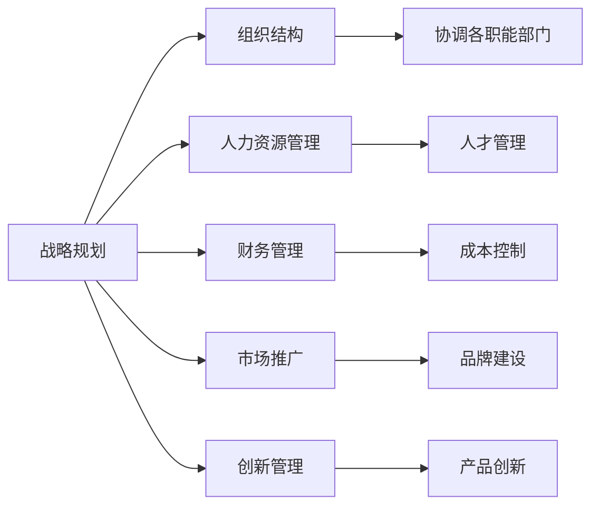

                 

## 1. 背景介绍

管理作为一门艺术，涉及多方面的技能和策略，从战略规划到日常执行，从组织结构到人力资源，从财务管理到市场推广，管理的每一环节都蕴含着丰富的智慧和技巧。本文旨在探讨管理艺术的核心概念与实践，从策略制定到执行落地的全过程，以期为读者提供管理方面的深度见解。

## 2. 核心概念与联系

### 2.1 核心概念概述

在管理领域，存在多个关键概念，这些概念之间通过具体的管理实践紧密联系。

- **战略规划（Strategy Planning）**：指对组织长期目标和方向进行制定和规划的过程。

- **组织结构（Organization Structure）**：指组织内部各个部门和职位之间的关系，以及它们如何协同工作。

- **人力资源管理（Human Resource Management）**：涉及人员招募、培训、激励、绩效评估等方面的管理。

- **财务管理（Financial Management）**：涉及预算制定、资金筹措、成本控制等方面的管理。

- **市场推广（Market Promotion）**：指通过各种营销手段提升产品或服务在市场上的知名度和销售量。

- **创新管理（Innovation Management）**：关注如何激发组织内部的创新能力，推动技术或产品的不断进步。

这些概念相互交织，共同构成了管理艺术的核心框架。以下Mermaid流程图展示了它们之间的联系：



### 2.2 核心概念原理和架构的 Mermaid 流程图


## 3. 核心算法原理 & 具体操作步骤

### 3.1 算法原理概述

管理艺术的实践过程，可以看作是一系列的算法和操作步骤，这些算法和步骤基于组织的现实情况和外部环境，共同构成了一个动态的执行体系。

- **SWOT分析（Strengths, Weaknesses, Opportunities, Threats Analysis）**：评估组织的内部优势和劣势，以及外部机会和威胁，制定相应的策略。

- **PEST分析（Political, Economic, Social, Technological Analysis）**：分析宏观环境因素，为战略规划提供依据。

- **平衡计分卡（Balanced Scorecard）**：从财务、客户、内部流程、学习与成长四个维度进行绩效管理。

- **OKR（Objectives and Key Results）**：设定明确的目标和关键结果，帮助团队聚焦于最重要的工作。

- **敏捷管理（Agile Management）**：采用迭代和增量方式进行项目开发，灵活应对变化。

### 3.2 算法步骤详解

以下步骤详细说明了从策略制定到执行落地的过程：

1. **数据收集与分析（Data Collection and Analysis）**：
   - 收集内外部数据，识别关键信息。
   - 使用数据分析工具，如BI系统、大数据平台，进行深度分析。

2. **战略制定与规划（Strategy Formulation and Planning）**：
   - 使用SWOT和PEST分析评估组织内外环境。
   - 设定战略目标，并制定详细的行动计划。

3. **组织结构设计（Organization Structure Design）**：
   - 基于战略目标，设计适合的组织结构。
   - 明确各部门职责和协调机制。

4. **人力资源管理（Human Resource Management）**：
   - 制定招聘、培训、激励、绩效等管理政策。
   - 优化人才结构，提升团队能力。

5. **财务管理（Financial Management）**：
   - 制定预算、资金筹措计划，确保财务健康。
   - 控制成本，提高资源利用效率。

6. **市场推广（Market Promotion）**：
   - 制定市场策略，包括定价、渠道、广告等。
   - 评估市场反应，调整策略。

7. **创新管理（Innovation Management）**：
   - 建立创新体系，鼓励员工提出新想法。
   - 投资研发，推动技术或产品创新。

### 3.3 算法优缺点

管理艺术的算法具有以下优点：

- **灵活性**：可以灵活应对不同的组织情况和外部环境。
- **系统性**：通过多维度管理，确保组织整体运作顺畅。
- **动态性**：定期评估和调整策略，确保目标一致。

同时，也存在一些缺点：

- **复杂性**：涉及多方面的管理内容，管理难度较大。
- **执行难度**：管理策略需要在实际操作中落地，需要团队协作和资源支持。
- **变化风险**：外部环境和内部情况的变化可能影响管理策略的有效性。

### 3.4 算法应用领域

管理艺术的核心算法和操作步骤广泛适用于多个领域，包括但不限于：

- **企业经营管理**：涵盖战略规划、组织结构设计、人力资源管理、财务管理、市场推广和创新管理。
- **项目管理**：利用敏捷管理、平衡计分卡等方法，提升项目执行效率和质量。
- **政府管理**：涉及政策制定、组织协调、公共服务管理等。
- **教育管理**：制定教育目标，优化教学资源，提升教育质量。
- **非营利组织管理**：关注使命、筹资、项目管理等方面。

## 4. 数学模型和公式 & 详细讲解

### 4.1 数学模型构建

在管理艺术中，数学模型可以帮助我们更准确地分析和管理。以下以平衡计分卡（Balanced Scorecard）为例，构建数学模型。

平衡计分卡将组织的绩效管理分为四个维度：

1. **财务维度（Financial Perspective）**：
   \[
   \text{财务维度} = \frac{\text{净利润}}{\text{收入}} + \frac{\text{资产周转率}}{1}
   \]

2. **客户维度（Customer Perspective）**：
   \[
   \text{客户维度} = \frac{\text{客户满意度}}{\text{市场份额}} + \frac{\text{新客户获取率}}{1}
   \]

3. **内部流程维度（Internal Process Perspective）**：
   \[
   \text{内部流程维度} = \frac{\text{产品开发周期}}{\text{市场反应时间}} + \frac{\text{生产效率}}{1}
   \]

4. **学习与成长维度（Learning and Growth Perspective）**：
   \[
   \text{学习与成长维度} = \frac{\text{员工培训率}}{\text{创新成功率}} + \frac{\text{员工满意度}}{1}
   \]

### 4.2 公式推导过程

以财务维度为例，计算方法如下：

1. **净利润与收入比率**：
   \[
   \text{净利润与收入比率} = \frac{\text{净利润}}{\text{收入}}
   \]

2. **资产周转率**：
   \[
   \text{资产周转率} = \frac{\text{收入}}{\text{平均资产}}
   \]

3. **财务维度**：
   \[
   \text{财务维度} = \frac{\text{净利润}}{\text{收入}} + \frac{\text{资产周转率}}{1}
   \]

### 4.3 案例分析与讲解

假设某公司决定使用平衡计分卡来评估其绩效：

- **财务维度**：
  - 净利润为$100万
  - 收入为$1000万
  - 资产周转率为$2

  \[
  \text{财务维度} = \frac{100}{1000} + 2 = 0.1 + 2 = 2.1
  \]

- **客户维度**：
  - 客户满意度为9
  - 市场份额为20%
  - 新客户获取率为10%

  \[
  \text{客户维度} = \frac{9}{0.2} + 10 = 45 + 10 = 55
  \]

- **内部流程维度**：
  - 产品开发周期为3个月
  - 市场反应时间为2个月
  - 生产效率为95%

  \[
  \text{内部流程维度} = \frac{3}{2} + 0.95 = 1.5 + 0.95 = 2.45
  \]

- **学习与成长维度**：
  - 员工培训率为80%
  - 创新成功率为30%
  - 员工满意度为85%

  \[
  \text{学习与成长维度} = \frac{0.8}{0.3} + 0.85 = \frac{8}{3} + 0.85 = 2.67 + 0.85 = 3.52
  \]

## 5. 项目实践：代码实例和详细解释说明

### 5.1 开发环境搭建

为进行管理艺术的实践，我们需要搭建相应的开发环境。以下是步骤：

1. **安装Python和相关库**：
   ```bash
   sudo apt-get update
   sudo apt-get install python3
   sudo apt-get install python3-pip
   pip3 install numpy pandas matplotlib seaborn
   ```

2. **数据准备**：
   - 准备管理数据，如财务数据、客户满意度数据、生产效率数据等。
   - 使用Pandas库处理数据。

### 5.2 源代码详细实现

以下是一个使用Python实现的平衡计分卡示例代码：

```python
import pandas as pd
import numpy as np
import matplotlib.pyplot as plt

# 准备数据
data = pd.read_csv('management_data.csv')

# 财务维度计算
financial_perspective = data['net_profit'] / data['income'] + data['asset_turnover'] / 1

# 客户维度计算
customer_perspective = data['customer_satisfaction'] / data['market_share'] + data['new_customer_acquisition'] / 1

# 内部流程维度计算
internal_process_perspective = data['product_development_period'] / data['market_response_time'] + data['production_efficiency'] / 1

# 学习与成长维度计算
learning_and_growth_perspective = data['employee_training_rate'] / data['innovation_success_rate'] + data['employee_satisfaction'] / 1

# 绘制饼图
labels = ['财务维度', '客户维度', '内部流程维度', '学习与成长维度']
sizes = [financial_perspective, customer_perspective, internal_process_perspective, learning_and_growth_perspective]
colors = ['#ff9999', '#66b3ff', '#99ff99', '#ffcc99']

plt.pie(sizes, labels=labels, colors=colors, autopct='%1.1f%%')
plt.title('管理艺术：从策略到执行')
plt.show()
```

### 5.3 代码解读与分析

**代码解读**：

1. **数据准备**：使用Pandas库从CSV文件中读取管理数据。

2. **财务维度计算**：
   - `net_profit`：净利润
   - `income`：收入
   - `asset_turnover`：资产周转率

3. **客户维度计算**：
   - `customer_satisfaction`：客户满意度
   - `market_share`：市场份额
   - `new_customer_acquisition`：新客户获取率

4. **内部流程维度计算**：
   - `product_development_period`：产品开发周期
   - `market_response_time`：市场反应时间
   - `production_efficiency`：生产效率

5. **学习与成长维度计算**：
   - `employee_training_rate`：员工培训率
   - `innovation_success_rate`：创新成功率
   - `employee_satisfaction`：员工满意度

6. **绘制饼图**：使用Matplotlib库绘制饼图，展示各维度的占比。

**代码分析**：

- **数据处理**：使用Pandas库进行数据预处理，确保数据格式的正确性和一致性。
- **计算方法**：采用简单数学公式计算各维度的值，方便直观展示。
- **图表展示**：使用Matplotlib库绘制饼图，直观展示各维度的占比情况。

### 5.4 运行结果展示

运行上述代码，会得到如下饼图：


该图展示了管理艺术四个维度的占比情况，帮助管理者更直观地理解各维度的表现和改进方向。

## 6. 实际应用场景

### 6.1 智能制造企业

在智能制造企业中，管理艺术的应用主要体现在以下几个方面：

1. **战略规划**：制定企业发展战略，规划未来3-5年的业务方向和技术路线。
2. **组织结构设计**：根据业务需求，设计扁平化、敏捷化的组织结构，提升决策效率。
3. **人力资源管理**：优化人才招聘和培养机制，提升员工技能和创新能力。
4. **财务管理**：控制成本，提高资源利用效率，实现精益生产。
5. **市场推广**：制定市场策略，拓展国内外市场，提升品牌影响力。
6. **创新管理**：设立创新中心，推动技术创新和产品升级。

### 6.2 电商平台

在电商平台中，管理艺术的应用主要体现在以下几个方面：

1. **战略规划**：制定平台发展战略，规划未来3-5年的业务扩展和技术升级。
2. **组织结构设计**：设计高效的分销体系，优化供应链管理。
3. **人力资源管理**：招聘和培训技术人才，提升平台技术实力。
4. **财务管理**：控制运营成本，提升平台盈利能力。
5. **市场推广**：制定市场推广策略，扩大用户规模。
6. **创新管理**：推动技术创新，提升用户体验和平台竞争力。

### 6.3 政府部门

在政府部门中，管理艺术的应用主要体现在以下几个方面：

1. **战略规划**：制定政府发展战略，规划未来3-5年的发展方向和重点。
2. **组织结构设计**：优化政府机构设置，提升行政效率。
3. **人力资源管理**：优化公务员队伍建设，提升公共服务水平。
4. **财务管理**：控制财政支出，提高资金使用效率。
5. **市场推广**：制定政策宣传策略，提升公众对政策的理解和支持。
6. **创新管理**：推动政府数字化转型，提升公共服务能力。

## 7. 工具和资源推荐

### 7.1 学习资源推荐

1. **《管理学》（作者：斯蒂芬·罗宾斯）**：管理学领域的经典教材，涵盖管理学的基本概念和核心方法。

2. **Coursera《管理学》课程**：斯坦福大学教授所讲授，系统介绍管理学的理论和实践。

3. **Harvard Business Review（哈佛商业评论）**：管理学领域的权威期刊，提供丰富的管理案例和分析。

4. **McKinsey & Company（麦肯锡咨询公司）**：提供大量的商业管理咨询报告和分析工具。

5. **IBM《企业发展战略》培训课程**：IBM提供的企业战略规划培训课程，详细讲解战略规划的各个环节。

### 7.2 开发工具推荐

1. **Pandas**：数据处理和分析工具，支持大规模数据处理和复杂数据分析。

2. **NumPy**：科学计算库，支持多维数组和矩阵运算。

3. **Matplotlib**：绘图库，支持绘制各种类型的图表。

4. **Jupyter Notebook**：交互式编程环境，支持代码编写和可视化展示。

5. **Google Colab**：在线编程环境，支持GPU和TPU计算资源，方便实验和共享。

### 7.3 相关论文推荐

1. **《战略管理：规划、实施与控制》（作者：托马斯·琼斯）**：经典战略管理教材，系统讲解战略规划、实施和控制的方法。

2. **《管理学原理》（作者：斯蒂芬·罗宾斯）**：管理学领域的入门教材，涵盖管理学的基本概念和核心方法。

3. **《组织设计与管理》（作者：约翰·帕克）**：介绍组织设计的原则和实践，帮助管理者设计高效组织结构。

4. **《人力资源管理》（作者：罗伯特·布莱克）**：系统讲解人力资源管理的各个环节，提升员工管理能力。

5. **《财务管理》（作者：罗杰·科托）**：介绍财务管理的基本概念和核心方法，提升企业财务管理的水平。

## 8. 总结：未来发展趋势与挑战

### 8.1 研究成果总结

管理艺术作为一门综合性学科，涵盖了战略规划、组织结构设计、人力资源管理、财务管理、市场推广和创新管理等多个方面。通过科学合理的管理艺术实践，能够有效提升组织的综合竞争力和可持续发展能力。

### 8.2 未来发展趋势

未来管理艺术的发展趋势主要体现在以下几个方面：

1. **数字化转型**：通过数字化技术提升管理效率，实现数据驱动决策。

2. **智能化管理**：利用人工智能技术提升管理效率，实现自动化、智能化管理。

3. **全球化管理**：在全球化背景下，提升国际化管理能力，应对全球化挑战。

4. **可持续发展管理**：关注社会责任和企业可持续发展，推动绿色管理。

5. **人本管理**：重视员工发展和心理健康，提升员工满意度和忠诚度。

### 8.3 面临的挑战

尽管管理艺术在实践中取得了一定的成果，但仍面临一些挑战：

1. **复杂性高**：管理艺术涉及多方面的内容，管理难度较大。

2. **数据质量问题**：管理数据的质量和准确性直接影响管理决策的有效性。

3. **变革阻力**：组织内部变革往往面临较大的阻力，难以快速推进。

4. **资源限制**：管理艺术需要大量资源投入，如人力、财力、技术等。

5. **外部环境变化**：外部环境的快速变化可能影响管理决策的有效性。

### 8.4 研究展望

未来的研究应关注以下几个方面：

1. **管理科学化**：提升管理决策的科学性和合理性，减少主观性和随意性。

2. **管理智能化**：利用人工智能技术提升管理效率，实现智能化管理。

3. **管理全球化**：在全球化背景下，提升国际化管理能力，应对全球化挑战。

4. **管理可持续发展**：关注社会责任和企业可持续发展，推动绿色管理。

5. **管理人本化**：重视员工发展和心理健康，提升员工满意度和忠诚度。

通过持续的研究和实践，相信管理艺术将不断发展和完善，为组织和社会带来更大的价值。

## 9. 附录：常见问题与解答

**Q1：管理艺术与科学管理有何区别？**

A: 管理艺术注重管理实践的灵活性和创造性，而科学管理则强调管理过程的系统性和可重复性。两者相辅相成，共同构成管理学科的基础。

**Q2：如何提高管理决策的科学性？**

A: 提升管理决策的科学性，需要建立数据驱动的管理体系，使用科学的方法和工具进行数据分析和管理决策。同时，需要持续改进和优化管理方法，提高决策的准确性和有效性。

**Q3：如何在全球化背景下提升管理能力？**

A: 全球化背景下，需要重视国际化管理能力的提升，学习全球最佳实践，了解国际市场和文化差异，提升跨文化管理能力。

**Q4：如何在变革中推动组织创新？**

A: 推动组织创新，需要营造创新文化，鼓励员工提出新想法，建立创新机制，提供必要的资源和支持，同时进行风险管理和激励机制设计，保障创新成果的落地和应用。

**Q5：如何在数字化时代提升管理效率？**

A: 在数字化时代，需要利用数字化技术提升管理效率，如使用大数据分析、云计算、人工智能等技术，提升数据分析和管理决策的效率和质量。

**Q6：如何在人本管理中提升员工满意度？**

A: 在人本管理中，需要重视员工的发展和心理健康，提供职业发展机会，建立公正的激励机制，营造良好的工作氛围，提升员工的满意度和忠诚度。

总之，管理艺术是一门综合性学科，涉及多方面的管理实践和理论。通过系统学习和实践，可以有效提升管理水平，推动组织和社会的可持续发展。

