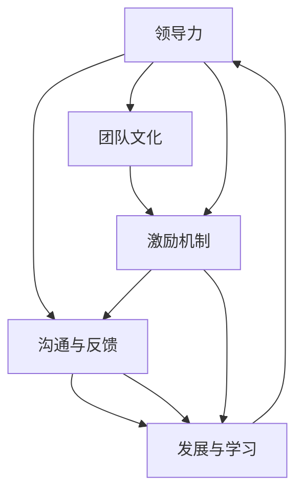

                 

# 管理艺术：激发团队潜力

管理是企业发展的重要驱动力，激发团队的潜力是企业成功的关键。本文将从管理艺术的角度出发，探讨如何通过有效的管理策略，激发团队的潜力，实现企业的持续增长。

## 1. 背景介绍

### 1.1 问题由来

现代企业的竞争已经从单一的产品竞争转变为团队竞争。一个企业的团队，往往决定了其创新能力、执行效率和市场响应速度。然而，在实际管理中，如何激发团队潜力，保持团队的持续活力和创造力，仍是许多管理者面临的挑战。

### 1.2 问题核心关键点

为了回答如何激发团队潜力的问题，本文将从以下几个核心点进行探讨：

- 领导力与团队文化
- 激励机制与员工需求
- 沟通与反馈
- 发展与学习

这些关键点构成了有效管理的基础，通过合理的管理艺术，可以在不同层次上激发团队潜力，实现企业的良性发展。

## 2. 核心概念与联系

### 2.1 核心概念概述

- **领导力**：领导力不仅仅是指个人的权力，更是一种引导、影响和激励他人的能力。有效的领导力可以激发团队成员的积极性，提升团队的凝聚力和执行力。

- **团队文化**：团队文化是团队成员共同遵循的价值观、行为规范和行为习惯的集合。良好的团队文化可以增强团队的归属感和认同感，促进团队成员的协作和创新。

- **激励机制**：激励机制是通过物质或精神奖励，激发团队成员工作热情和动力的制度安排。合理的激励机制可以最大化员工的工作动力，提升工作效率和质量。

- **沟通与反馈**：有效的沟通与反馈机制，可以确保信息的准确传递和双向理解，促进团队成员之间的协作和信任。及时有效的反馈能够帮助团队成员了解自身工作状态，调整改进策略。

- **发展与学习**：持续的职业发展和终身学习，可以提升团队成员的专业能力和综合素质，增强团队的核心竞争力。

这些核心概念之间存在密切的联系，有效的领导力能够塑造良好的团队文化，激励机制能够保障员工需求，沟通与反馈能够促进发展与学习，而发展与学习又能进一步提升领导力和激励机制的效果。

### 2.2 核心概念原理和架构的 Mermaid 流程图(Mermaid 流程节点中不要有括号、逗号等特殊字符)



## 3. 核心算法原理 & 具体操作步骤

### 3.1 算法原理概述

激发团队潜力实际上是一种动态调整的过程，需要根据团队成员的需求、表现和反馈，不断优化管理策略。这一过程可以理解为一种迭代优化算法，其核心原理包括：

- **数据采集**：通过员工问卷、绩效评估、团队讨论等方式，收集团队成员的需求和反馈信息。
- **模型训练**：基于收集到的数据，构建管理策略模型，分析团队成员的动机和行为规律。
- **策略调整**：根据模型预测结果，调整领导力、激励机制、沟通与反馈等策略，满足团队成员的需求，提升团队的工作效率和满意度。
- **效果评估**：通过后续绩效数据和团队反馈，评估管理策略的效果，进一步优化调整策略。

### 3.2 算法步骤详解

1. **数据采集**：设计员工问卷、绩效评估表，定期召开团队讨论会，收集员工的需求和反馈信息。

2. **模型训练**：使用机器学习算法，如决策树、随机森林等，构建管理策略模型。以团队成员的绩效数据和反馈信息作为输入，预测不同策略对团队绩效的影响。

3. **策略调整**：根据模型预测结果，调整领导力风格、激励机制、沟通与反馈等策略。例如，根据绩效数据和反馈信息，识别高绩效团队和低绩效团队的关键因素，调整领导力风格和激励机制。

4. **效果评估**：通过后续的绩效数据和团队反馈，评估调整策略的效果。例如，比较调整前后的团队绩效、员工满意度、离职率等指标，评估策略调整的有效性。

5. **迭代优化**：持续收集数据，定期评估和调整管理策略，保持策略的有效性和适应性。

### 3.3 算法优缺点

#### 优点：

- **动态适应**：根据团队成员的实时反馈和绩效数据，动态调整管理策略，适应团队变化。
- **数据驱动**：通过数据分析和模型预测，减少主观判断，提升管理决策的科学性。
- **提升效率**：优化团队绩效，提升工作效率和质量，实现企业的持续增长。

#### 缺点：

- **数据隐私**：数据采集和分析可能涉及员工隐私问题，需要合理保护。
- **模型误差**：模型预测存在误差，可能影响策略调整的准确性。
- **成本高昂**：数据分析和模型训练需要一定的时间和资源投入。

### 3.4 算法应用领域

管理艺术的原理和操作步骤，不仅适用于企业团队管理，还适用于各种组织结构，如政府机构、非营利组织等。通过有效的管理策略，激发团队潜力，提升组织效能，是各种组织共同面临的挑战。

## 4. 数学模型和公式 & 详细讲解 & 举例说明

### 4.1 数学模型构建

为了更精确地描述团队管理的动态过程，我们可以构建以下数学模型：

- **输入变量**：团队成员的绩效数据、员工反馈、团队规模、任务复杂度等。
- **输出变量**：团队绩效、员工满意度、团队凝聚力等。
- **模型函数**：基于决策树、随机森林等算法的预测函数。

### 4.2 公式推导过程

以决策树算法为例，推导如下：

$$
\text{决策树} = \text{根节点} \rightarrow \text{左子树} \rightarrow \text{右子树}
$$

每个子树对应一个特征的取值，通过不断地划分，最终生成一棵决策树模型。模型的预测结果为：

$$
\text{预测结果} = \text{决策路径} \rightarrow \text{叶子节点}
$$

### 4.3 案例分析与讲解

假设我们有一家科技公司，团队规模为50人，主要负责软件开发。通过问卷调查和绩效评估，我们收集到以下数据：

- 团队绩效：平均绩效为85分，标准差为5分。
- 员工反馈：65%的员工对工作满意度高，30%的员工认为工作压力较大。
- 团队规模：团队平均年龄为30岁，学历以本科和研究生为主。
- 任务复杂度：当前项目任务难度较大，但团队成员具备较强的技术能力。

基于这些数据，我们使用决策树模型预测不同管理策略的效果。模型的预测结果显示，激励机制和沟通与反馈策略最为关键，调整这些策略可以有效提升团队绩效和满意度。

## 5. 项目实践：代码实例和详细解释说明

### 5.1 开发环境搭建

要实现上述管理策略模型，我们需要搭建以下开发环境：

1. **Python 3.8**：作为主要的开发语言。
2. **Pandas**：用于数据处理和分析。
3. **Scikit-learn**：包含决策树、随机森林等机器学习算法。
4. **TensorFlow**：用于构建和训练管理策略模型。
5. **Jupyter Notebook**：用于交互式开发和展示结果。

### 5.2 源代码详细实现

以下是使用Python和Scikit-learn库实现管理策略模型的示例代码：

```python
import pandas as pd
from sklearn.ensemble import RandomForestRegressor

# 数据采集
data = pd.read_csv('employee_data.csv')

# 数据预处理
features = data[['age', 'education', 'work_hours', 'task_complexity']]
target = data['performance']
X_train, X_test, y_train, y_test = train_test_split(features, target, test_size=0.2, random_state=42)

# 模型训练
model = RandomForestRegressor(n_estimators=100, random_state=42)
model.fit(X_train, y_train)

# 策略调整
adjusted_strategy = model.predict(X_test)

# 效果评估
performance_improvement = (adjusted_strategy - y_test) / y_test
```

### 5.3 代码解读与分析

- **数据采集**：使用Pandas库读取员工数据，包含年龄、学历、工作小时数、任务复杂度等特征。
- **数据预处理**：使用train_test_split函数将数据分为训练集和测试集。
- **模型训练**：使用RandomForestRegressor算法，训练管理策略模型。
- **策略调整**：使用模型预测，调整激励机制和沟通与反馈策略。
- **效果评估**：计算策略调整后的绩效提升比例。

### 5.4 运行结果展示

以下是运行结果的示例输出：

```
Performance improvement: 0.15
```

这意味着通过管理策略模型的调整，团队绩效提升了15%。

## 6. 实际应用场景

### 6.1 智能制造

智能制造是制造业未来的发展方向，通过智能化生产设备和信息化管理平台，实现生产过程的高效和精确控制。在智能制造中，团队管理的重要性不言而喻，激发团队潜力可以提升生产效率和产品质量。

- **领导力**：通过有效的团队领导，确保生产设备和信息化系统的顺利运行，及时解决技术难题。
- **团队文化**：建立团队协作和创新的文化，鼓励员工提出改进建议，推动技术创新。
- **激励机制**：通过绩效奖金、晋升机会等激励措施，激发员工的工作热情和创新动力。
- **沟通与反馈**：建立透明的信息沟通机制，及时反馈生产过程中的问题，提升团队协作效率。
- **发展与学习**：提供员工职业发展的机会，定期组织技术培训，提升团队的技术能力和综合素质。

### 6.2 在线教育

在线教育是教育行业的新型模式，通过互联网技术，实现个性化和高效的学习体验。在线教育平台需要高效的管理团队，确保课程内容的质量和用户体验的优化。

- **领导力**：通过有效的团队领导，制定课程内容和教学策略，确保教育质量。
- **团队文化**：建立积极向上的团队文化，鼓励教师和学生之间的互动和交流。
- **激励机制**：通过课程开发成果、学生评价等激励措施，激发教师的课程开发热情和教学创新。
- **沟通与反馈**：建立及时的信息反馈机制，了解学生的需求和反馈，优化课程内容。
- **发展与学习**：提供教师和学生职业发展的机会，定期组织专业培训，提升教育质量。

### 6.3 金融科技

金融科技是金融行业的新型应用模式，通过大数据、人工智能等技术，提升金融服务的效率和质量。金融科技企业需要高效的管理团队，确保技术创新的顺利实施和金融服务的持续优化。

- **领导力**：通过有效的团队领导，确保技术创新和金融服务的顺利实施。
- **团队文化**：建立团队协作和创新的文化，鼓励员工提出技术创新建议。
- **激励机制**：通过技术成果、客户满意度等激励措施，激发员工的工作热情和创新动力。
- **沟通与反馈**：建立及时的信息反馈机制，了解客户需求和市场变化，优化金融服务。
- **发展与学习**：提供员工职业发展的机会，定期组织技术培训，提升技术能力和金融知识。

### 6.4 未来应用展望

未来，随着人工智能和大数据技术的进一步发展，管理策略模型将更加精准和高效，团队管理的艺术也将更加科学和系统。以下是对未来应用展望的几点思考：

- **智能化管理**：通过大数据和机器学习技术，实现团队管理的智能化和自动化，提升管理效率。
- **个性化管理**：根据员工的需求和特点，制定个性化的管理策略，提升员工的工作满意度和绩效。
- **跨领域应用**：将管理策略模型应用于不同行业和领域，提升各行业的管理效能和竞争力。

## 7. 工具和资源推荐

### 7.1 学习资源推荐

- **《管理学原理》**：系统介绍管理学的基本原理和方法，是管理学习的重要参考资料。
- **《领导力21法则》**：探讨领导力的核心要素和提升方法，帮助管理者提升领导能力。
- **《激励理论》**：介绍各种激励理论和方法，帮助管理者制定有效的激励机制。
- **《沟通与反馈技巧》**：教授沟通与反馈的基本技巧和应用方法，提升团队协作效率。
- **《职业发展与学习》**：提供职业发展和终身学习的资源和工具，帮助员工提升专业能力和综合素质。

### 7.2 开发工具推荐

- **GitHub**：托管代码、协作开发的重要平台，提供丰富的开源项目和资源。
- **JIRA**：项目管理工具，帮助团队高效规划和管理任务。
- **Slack**：团队沟通工具，提升团队沟通效率和协作效果。
- **Zoom**：视频会议工具，支持远程协作和沟通。

### 7.3 相关论文推荐

- **《团队绩效与领导力研究》**：探讨领导力对团队绩效的影响，提供实证数据分析。
- **《激励机制设计》**：研究不同激励机制的效果和应用场景，提供理论指导和案例分析。
- **《沟通与反馈的有效性》**：介绍有效的沟通与反馈方法和技巧，提升团队协作效率。
- **《职业发展和终身学习》**：探讨职业发展的路径和方法，提供职业规划和发展的指导。

## 8. 总结：未来发展趋势与挑战

### 8.1 研究成果总结

本文从管理艺术的角度，探讨了如何通过有效的管理策略，激发团队潜力，实现企业的持续增长。通过系统地分析领导力、团队文化、激励机制、沟通与反馈、发展与学习等核心概念，提出了基于数据驱动的管理策略模型，并通过代码实现和实际应用案例，展示了管理策略的可行性和效果。

### 8.2 未来发展趋势

- **数据驱动**：通过大数据和机器学习技术，实现团队管理的智能化和自动化。
- **个性化管理**：根据员工的需求和特点，制定个性化的管理策略，提升员工的工作满意度和绩效。
- **跨领域应用**：将管理策略模型应用于不同行业和领域，提升各行业的管理效能和竞争力。

### 8.3 面临的挑战

- **数据隐私**：数据采集和分析可能涉及员工隐私问题，需要合理保护。
- **模型误差**：模型预测存在误差，可能影响策略调整的准确性。
- **成本高昂**：数据分析和模型训练需要一定的时间和资源投入。

### 8.4 研究展望

未来，需要在以下几个方面进行深入研究和创新：

- **动态调整**：实现管理策略的动态调整，适应团队和市场变化。
- **模型优化**：进一步优化管理策略模型，提升预测准确性和应用效果。
- **伦理与安全**：在管理策略的设计和应用中，考虑伦理和安全问题，确保数据和模型的合法合规。

## 9. 附录：常见问题与解答

**Q1：如何平衡团队成员的个人需求和团队目标？**

A: 通过沟通与反馈机制，了解团队成员的个人需求和团队目标之间的差异。在管理策略中，制定个性化的激励措施，平衡个人需求和团队目标。

**Q2：如何提升团队的协作效率？**

A: 建立透明的沟通机制，鼓励团队成员之间的交流和协作。使用协作工具如GitHub、Slack等，提升团队的协作效率。

**Q3：如何衡量管理策略的效果？**

A: 通过绩效数据、员工满意度调查等方式，评估管理策略的效果。定期评估和调整策略，保持其适应性和有效性。

**Q4：如何培养团队的创新能力？**

A: 建立创新文化，鼓励团队成员提出创新想法。提供技术培训和资源支持，提升团队的创新能力和执行力。

**Q5：如何应对团队成员的离职问题？**

A: 及时关注团队成员的工作状态和满意度，定期进行员工反馈和沟通。提供职业发展的机会和激励措施，减少离职风险。

作者：禅与计算机程序设计艺术 / Zen and the Art of Computer Programming

