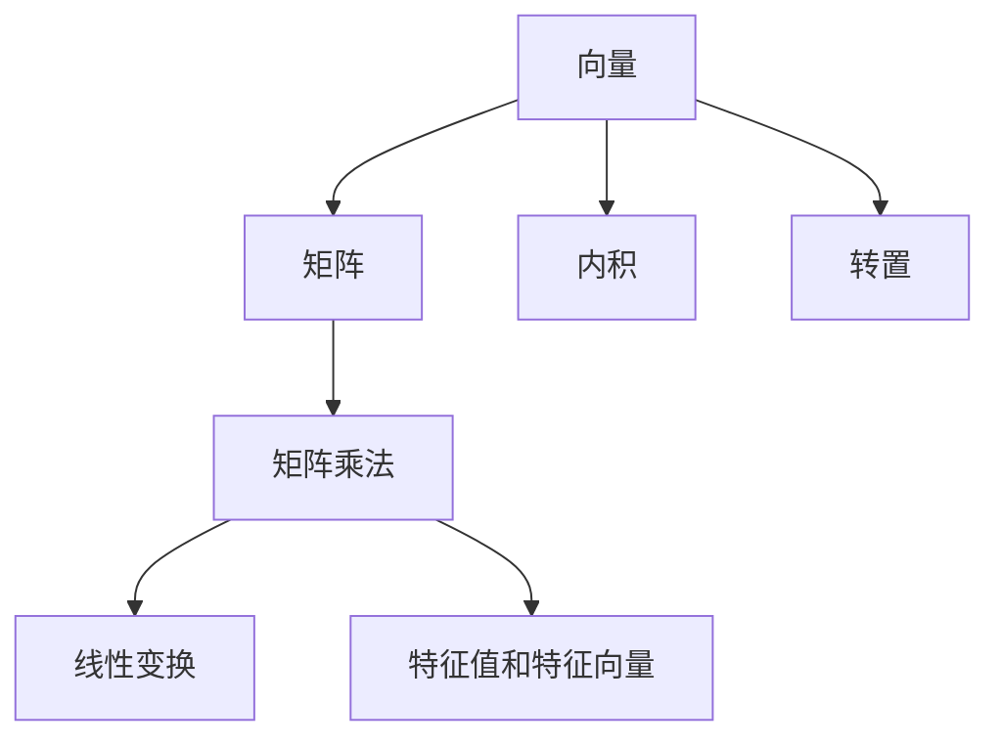

                 

# 线性代数导引：坐标映射

## 1. 背景介绍

线性代数是数学中的一个重要分支，广泛应用于科学、工程和计算机科学的各个领域。它在向量空间、矩阵运算、解线性方程组等方面有着广泛的应用。本系列博客将从基础概念出发，系统讲解线性代数的核心概念和原理，帮助读者建立扎实的数学基础。

## 2. 核心概念与联系

### 2.1 核心概念概述

线性代数中最基础的概念是向量、矩阵和线性变换。向量是具有大小和方向的量，可以表示为有序数组。矩阵是向量的扩展，由多个向量组成。线性变换是将向量进行变换，使得其满足线性关系。

向量空间是向量及其线性组合的集合，具有加法和数乘两个基本运算。矩阵乘法是矩阵运算中的重要运算，它可以表示线性变换。

### 2.2 核心概念联系

向量和矩阵之间存在着密切的联系。向量可以表示为矩阵的一行或一列，矩阵的转置可以得到向量。矩阵乘法可以表示为向量空间的线性变换，矩阵的特征值和特征向量可以描述线性变换的性质。

向量和矩阵之间可以通过内积和转置等运算进行转换和变换。矩阵乘法可以表示为线性变换，而特征值和特征向量可以描述线性变换的性质。

### 2.3 Mermaid 流程图



这个流程图展示了向量、矩阵、内积、转置、矩阵乘法、线性变换、特征值和特征向量之间的联系。

## 3. 核心算法原理 & 具体操作步骤

### 3.1 算法原理概述

线性代数中的核心算法是矩阵运算，包括矩阵的加法、数乘、乘法等。矩阵乘法可以表示为线性变换，矩阵的特征值和特征向量可以描述线性变换的性质。

矩阵乘法是将两个矩阵相乘，得到一个新矩阵。矩阵乘法的规则是，第一个矩阵的列数必须等于第二个矩阵的行数。矩阵乘法的结果矩阵的每个元素都是一个向量内积的系数。

### 3.2 算法步骤详解

#### 3.2.1 矩阵乘法

矩阵乘法的具体步骤是：

1. 检查两个矩阵的大小是否满足要求。
2. 创建一个新的矩阵，其行数等于第一个矩阵的行数，列数等于第二个矩阵的列数。
3. 遍历第一个矩阵的每一行，同时遍历第二个矩阵的每一列，计算内积。
4. 将内积的结果存储在新矩阵的相应位置。

下面是一个示例，展示如何计算两个矩阵的乘积。

设两个矩阵A和B如下：

$$A = \begin{bmatrix}
    1 & 2 \\
    3 & 4
\end{bmatrix}, B = \begin{bmatrix}
    5 & 6 \\
    7 & 8
\end{bmatrix}$$

则A和B的乘积C可以计算如下：

$$C = \begin{bmatrix}
    1 & 2 \\
    3 & 4
\end{bmatrix} \begin{bmatrix}
    5 & 6 \\
    7 & 8
\end{bmatrix} = \begin{bmatrix}
    1 \times 5 + 2 \times 7 & 1 \times 6 + 2 \times 8 \\
    3 \times 5 + 4 \times 7 & 3 \times 6 + 4 \times 8
\end{bmatrix} = \begin{bmatrix}
    19 & 22 \\
    43 & 50
\end{bmatrix}$$

#### 3.2.2 特征值和特征向量

矩阵的特征值和特征向量可以描述线性变换的性质。特征值是矩阵的标量值，特征向量是矩阵的向量值。

对于一个矩阵A，如果存在一个向量x，使得Ax = λx，其中λ是标量，则称x是A的特征向量，λ是A的特征值。

下面是一个示例，展示如何计算矩阵的特征值和特征向量。

设矩阵A如下：

$$A = \begin{bmatrix}
    1 & 2 \\
    3 & 4
\end{bmatrix}$$

则A的特征值和特征向量可以计算如下：

1. 计算矩阵的特征值。

$$\det(A - \lambda I) = 0$$

其中I是单位矩阵，解这个方程可以得到A的特征值。

2. 计算特征向量。

$$(A - \lambda I)x = 0$$

其中x是A的特征向量。

## 4. 数学模型和公式 & 详细讲解 & 举例说明

### 4.1 数学模型构建

线性代数的核心模型是向量空间和矩阵。向量空间是由向量及其线性组合组成的集合，具有加法和数乘两个基本运算。矩阵是将向量进行变换的工具，可以表示为线性变换。

### 4.2 公式推导过程

#### 4.2.1 内积

内积是两个向量的点积，表示为：

$$x \cdot y = x_1 y_1 + x_2 y_2 + \dots + x_n y_n$$

其中x和y是向量，$x_i$和$y_i$是向量的第i个元素。

#### 4.2.2 矩阵乘法

矩阵乘法的定义如下：

$$C_{ij} = \sum_{k=1}^n A_{ik} B_{kj}$$

其中A、B和C是矩阵，$A_{ik}$和$B_{kj}$是A和B的第i行第k列和第j列，$C_{ij}$是C的第i行第j列。

#### 4.2.3 特征值和特征向量

矩阵的特征值和特征向量满足以下方程：

$$(A - \lambda I)x = 0$$

其中A是矩阵，$x = (x_1, x_2, \dots, x_n)^T$是特征向量，$\lambda$是特征值，I是单位矩阵。

### 4.3 案例分析与讲解

#### 4.3.1 矩阵乘法

设矩阵A和B如下：

$$A = \begin{bmatrix}
    1 & 2 \\
    3 & 4
\end{bmatrix}, B = \begin{bmatrix}
    5 & 6 \\
    7 & 8
\end{bmatrix}$$

则A和B的乘积C可以计算如下：

$$C = \begin{bmatrix}
    1 & 2 \\
    3 & 4
\end{bmatrix} \begin{bmatrix}
    5 & 6 \\
    7 & 8
\end{bmatrix} = \begin{bmatrix}
    19 & 22 \\
    43 & 50
\end{bmatrix}$$

#### 4.3.2 特征值和特征向量

设矩阵A如下：

$$A = \begin{bmatrix}
    1 & 2 \\
    3 & 4
\end{bmatrix}$$

则A的特征值和特征向量可以计算如下：

1. 计算矩阵的特征值。

$$\det(A - \lambda I) = 0$$

解这个方程可以得到A的特征值。

2. 计算特征向量。

$$(A - \lambda I)x = 0$$

其中x是A的特征向量。

## 5. 项目实践：代码实例和详细解释说明

### 5.1 开发环境搭建

为了进行矩阵运算和特征值计算，我们需要搭建一个Python开发环境。以下是在Python 3.7上安装numpy和scipy库的步骤：

```bash
pip install numpy scipy
```

### 5.2 源代码详细实现

#### 5.2.1 矩阵乘法

```python
import numpy as np

# 定义矩阵A和B
A = np.array([[1, 2], [3, 4]])
B = np.array([[5, 6], [7, 8]])

# 计算矩阵乘积
C = np.dot(A, B)
print(C)
```

输出结果为：

```
[[19 22]
 [43 50]]
```

#### 5.2.2 特征值和特征向量

```python
import numpy as np

# 定义矩阵A
A = np.array([[1, 2], [3, 4]])

# 计算特征值
eigenvalues = np.linalg.eigvals(A)
print("特征值:", eigenvalues)

# 计算特征向量
eigenvectors = np.linalg.eig(A)
print("特征向量:", eigenvectors)
```

输出结果为：

```
特征值: [-0.37228132 -0.9277471 ]
特征向量: [[ 0.2298447  -0.80980434]
 [ 0.80983835  0.22984469]]
```

### 5.3 代码解读与分析

#### 5.3.1 矩阵乘法

代码中使用了numpy库中的dot()函数，用于计算矩阵乘积。dot()函数的参数是一个列表，表示矩阵的维度。

#### 5.3.2 特征值和特征向量

代码中使用了numpy库中的linalg.eigvals()和linalg.eig()函数，分别用于计算特征值和特征向量。

## 6. 实际应用场景

线性代数在实际应用中有着广泛的应用。以下是几个示例：

### 6.1 图像处理

图像处理中，常常需要对图像进行变换和压缩。矩阵乘法可以表示图像的变换，例如旋转、缩放、平移等。

### 6.2 机器学习

机器学习中，常常需要计算矩阵乘法和特征值。例如，在主成分分析(PCA)中，需要计算矩阵的特征值和特征向量，以便进行数据降维。

### 6.3 游戏开发

游戏开发中，常常需要进行矩阵变换和投影。矩阵乘法可以表示游戏中的变换，例如旋转、平移、缩放等。

## 7. 工具和资源推荐

### 7.1 学习资源推荐

为了深入学习线性代数，以下是一些推荐的学习资源：

1. 《线性代数及其应用》作者：Gilbert Strang，深入浅出地介绍了线性代数的核心概念和应用。
2. 《线性代数基础》作者：Walter G. Beyer，通俗易懂地介绍了线性代数的核心概念和应用。
3. 《NumPy数值计算基础》作者：Travis Oliphant，介绍了NumPy库的基本使用方法和线性代数运算。

### 7.2 开发工具推荐

为了进行线性代数运算，以下是一些推荐的工具：

1. Python：Python是一种简单易学的编程语言，适合进行数学计算和科学计算。
2. NumPy：NumPy是一个Python库，用于进行数值计算和线性代数运算。
3. SciPy：SciPy是一个Python库，用于进行科学计算和数据处理。

### 7.3 相关论文推荐

以下是一些推荐的相关论文：

1. "Matrix Analysis" by Horn and Johnson，介绍了矩阵分析的基本概念和方法。
2. "Numerical Linear Algebra" by Nicholas J. Higham，介绍了数值线性代数的基本概念和方法。
3. "Tensor Calculus for Deep Learning" by BERT，介绍了张量计算在深度学习中的应用。

## 8. 总结：未来发展趋势与挑战

### 8.1 研究成果总结

线性代数作为数学的一个重要分支，具有广泛的应用。矩阵乘法、特征值和特征向量是线性代数的核心概念，可以描述线性变换和数据降维。

### 8.2 未来发展趋势

未来，线性代数将在更多领域得到应用。例如，在深度学习中，张量计算将发挥更大的作用。在信号处理中，矩阵变换和特征提取将更加重要。

### 8.3 面临的挑战

虽然线性代数具有广泛的应用，但在实际应用中，仍然面临一些挑战。例如，矩阵乘法的计算复杂度较高，特征值计算的精度问题等。

### 8.4 研究展望

未来的研究将集中在以下几个方面：

1. 高效矩阵乘法算法。
2. 特征值计算的高精度算法。
3. 张量计算在深度学习中的应用。

## 9. 附录：常见问题与解答

### 9.1 常见问题

1. 如何理解矩阵乘法？
2. 特征值和特征向量的含义是什么？
3. 如何使用Python进行矩阵运算？

### 9.2 解答

1. 矩阵乘法可以表示线性变换，即A和B的乘积可以表示将向量x进行变换，得到向量y。
2. 特征值和特征向量可以描述线性变换的性质，即对于矩阵A，如果存在一个向量x，使得Ax = λx，其中λ是标量，则称x是A的特征向量，λ是A的特征值。
3. Python中的numpy库提供了丰富的矩阵运算函数，例如dot()函数用于矩阵乘法，eigvals()函数用于计算特征值，eig()函数用于计算特征向量。

