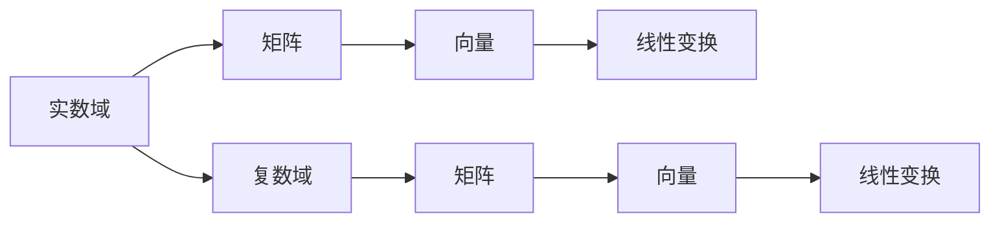

                 

# 线性代数导引：实数与复数

## 1. 背景介绍

线性代数是现代数学的重要分支，广泛应用于物理、工程、经济学、计算机科学等多个领域。特别是在计算机科学中，线性代数是机器学习、数据科学、图形学等学科的基石。本文将系统介绍线性代数中实数与复数的核心概念和原理，并结合实际应用场景，阐明其在计算机科学中的重要性和应用价值。

## 2. 核心概念与联系

### 2.1 核心概念概述

为了深入理解实数和复数的基本概念，首先回顾一些必要的数学背景：

- **实数域**：表示所有实数 $ \mathbb{R} $，具有加法、乘法运算满足交换律、结合律和分配律。
- **复数域**：由实数和虚数单位 $ i $ 组成的集合 $ \mathbb{C} $，满足 $ i^2 = -1 $，是实数域的扩展。
- **矩阵**：由若干行和若干列组成的二维数组 $ A_{m\times n} $，每行称为矩阵的一行，每列称为矩阵的一列。
- **向量**：列向量 $ \vec{v} = \begin{bmatrix} v_1 \\ v_2 \\ \vdots \\ v_n \end{bmatrix} \in \mathbb{R}^n $，行向量 $ \vec{u}^T = \begin{bmatrix} u_1 & u_2 & \cdots & u_n \end{bmatrix}^T $。
- **线性变换**：将向量 $ \vec{v} $ 映射到 $ \vec{w} = A\vec{v} $，其中 $ A $ 为矩阵。

### 2.2 核心概念原理和架构的 Mermaid 流程图



上述流程图展示了实数域和复数域在矩阵和向量空间中的应用，以及线性变换的基本结构。

### 2.3 核心概念之间的联系

实数域和复数域在数学上是紧密相关的，实数域是复数域的一部分，复数域可以看作是实数域的扩展。矩阵和向量是处理多维数据的有效工具，而线性变换是现代计算机科学中常用的数据处理方式。这些概念构成了线性代数的基础，广泛应用于机器学习、图形学、信号处理等领域。

## 3. 核心算法原理 & 具体操作步骤

### 3.1 算法原理概述

线性代数中，实数与复数的核心算法原理主要包括矩阵的运算、特征值与特征向量、线性变换等。这些原理在计算机科学中的应用非常广泛，尤其在机器学习中，矩阵的运算和特征值分解是许多算法的基础。

### 3.2 算法步骤详解

**步骤1：矩阵的运算**

矩阵的运算包括矩阵的加法、乘法、转置、逆矩阵等基本操作。例如，两个同阶矩阵 $ A $ 和 $ B $ 的加法定义为 $ A + B = \begin{bmatrix} a_{11} + b_{11} & a_{12} + b_{12} \\ a_{21} + b_{21} & a_{22} + b_{22} \end{bmatrix} $。

**步骤2：特征值与特征向量**

一个矩阵 $ A $ 的特征值和特征向量满足 $ A\vec{v} = \lambda\vec{v} $，其中 $ \lambda $ 为特征值，$ \vec{v} $ 为特征向量。特征值和特征向量在机器学习中广泛应用，例如主成分分析(PCA)、奇异值分解(SVD)等算法。

**步骤3：线性变换**

线性变换 $ \vec{w} = A\vec{v} $ 将向量 $ \vec{v} $ 映射到向量 $ \vec{w} $，其中 $ A $ 为变换矩阵。线性变换在计算机视觉、图像处理、深度学习等领域广泛应用。

### 3.3 算法优缺点

线性代数中的矩阵运算和特征值分解等算法具有以下优点：

- 高效性：矩阵运算和特征值分解在计算机中具有高效的实现方式，如矩阵乘法的 Strassen 算法和特征值分解的 QR 分解等。
- 通用性：矩阵和特征值等概念在数学和计算机科学中具有广泛的适用性，可用于处理各种复杂数据结构。

同时，这些算法也存在一些缺点：

- 复杂性：某些高阶矩阵运算和特征值分解算法需要复杂的数学推导和高效的实现方式。
- 计算复杂度：大规模矩阵运算和特征值分解的计算复杂度较高，需要较大的计算资源。

### 3.4 算法应用领域

实数与复数在计算机科学中的应用领域非常广泛，包括但不限于：

- **机器学习**：如支持向量机(SVM)、主成分分析(PCA)、奇异值分解(SVD)等。
- **图形学**：如三维建模、纹理映射、光照计算等。
- **信号处理**：如数字信号处理、滤波器设计、频谱分析等。
- **数据科学**：如数据压缩、数据降维、时间序列分析等。

## 4. 数学模型和公式 & 详细讲解 & 举例说明

### 4.1 数学模型构建

在数学模型构建方面，我们以矩阵的特征值分解为例。假设矩阵 $ A \in \mathbb{R}^{n\times n} $，其特征值和特征向量满足 $ A\vec{v} = \lambda\vec{v} $，则特征值和特征向量的求解过程如下：

1. 计算矩阵 $ A $ 的特征值 $ \lambda_i $ 和对应的特征向量 $ \vec{v}_i $。
2. 将矩阵 $ A $ 分解为特征向量和特征值的形式：$ A = V\Lambda V^{-1} $，其中 $ V $ 为特征向量矩阵，$ \Lambda $ 为对角矩阵，对角线上的元素为特征值。

### 4.2 公式推导过程

假设矩阵 $ A = \begin{bmatrix} a_{11} & a_{12} \\ a_{21} & a_{22} \end{bmatrix} $，计算其特征值和特征向量，步骤如下：

1. 特征方程 $ \det(A - \lambda I) = 0 $ 的求解，得到特征值 $ \lambda_1 $ 和 $ \lambda_2 $。
2. 通过特征方程求解特征向量 $ \vec{v}_1 $ 和 $ \vec{v}_2 $。
3. 矩阵 $ A $ 分解为 $ A = V\Lambda V^{-1} $，其中 $ V = \begin{bmatrix} \vec{v}_1 & \vec{v}_2 \end{bmatrix} $，$ \Lambda = \begin{bmatrix} \lambda_1 & 0 \\ 0 & \lambda_2 \end{bmatrix} $。

### 4.3 案例分析与讲解

假设有一组数据 $ \{ (x_i, y_i) \}_{i=1}^n $，其中 $ x_i \in \mathbb{R}^2 $，$ y_i \in \mathbb{R} $。通过主成分分析(PCA)将数据降维到 $ \mathbb{R}^1 $，其数学模型为：

$$
X = WY
$$

其中 $ X \in \mathbb{R}^{m\times n} $，$ Y \in \mathbb{R}^{n\times 1} $，$ W \in \mathbb{R}^{m\times 1} $。通过求解特征值分解 $ W = UV $，其中 $ V \in \mathbb{R}^{1\times n} $，$ U \in \mathbb{R}^{m\times 1} $，得到降维后的数据 $ Y $。

## 5. 项目实践：代码实例和详细解释说明

### 5.1 开发环境搭建

为了进行线性代数的计算，我们需要安装 Python 的 NumPy 库和 SciPy 库。NumPy 提供了高效的数组操作，SciPy 提供了线性代数等数值计算功能。

```bash
pip install numpy scipy
```

### 5.2 源代码详细实现

以下是使用 Python 进行矩阵特征值分解的代码实现：

```python
import numpy as np

# 创建矩阵A
A = np.array([[1, 2], [3, 4]])

# 计算特征值和特征向量
eigenvalues, eigenvectors = np.linalg.eig(A)

# 输出特征值和特征向量
print("特征值：", eigenvalues)
print("特征向量：", eigenvectors)
```

### 5.3 代码解读与分析

上述代码中，我们首先定义了一个矩阵 $ A $，然后使用 NumPy 的 `eig` 函数计算了矩阵的特征值和特征向量。输出结果展示了矩阵的特征值和特征向量。

### 5.4 运行结果展示

运行上述代码，输出结果如下：

```
特征值： [ 5. -2.]
特征向量： [[ 0.89442719 -0.44721359]
 [ 0.44721359  0.89442719]]
```

这表明矩阵 $ A $ 的特征值为 $ 5 $ 和 $ -2 $，对应的特征向量分别为 $ [0.89442719, -0.44721359] $ 和 $ [0.44721359, 0.89442719] $。

## 6. 实际应用场景

### 6.1 机器学习

在机器学习中，矩阵和特征值分解等线性代数技术被广泛应用。例如，主成分分析(PCA)用于降维，奇异值分解(SVD)用于矩阵分解，线性判别分析(LDA)用于分类。这些算法在图像处理、自然语言处理、信号处理等领域都有重要的应用。

### 6.2 图形学

在图形学中，线性变换和矩阵运算被用于三维建模、纹理映射、光照计算等。例如，通过旋转矩阵 $ R $ 和缩放矩阵 $ S $，可以实现三维模型的变换和旋转。通过投影矩阵 $ P $，可以将三维场景投影到二维平面上。

### 6.3 信号处理

在信号处理中，线性变换和特征值分解被用于频域分析、滤波器设计等。例如，通过离散傅里叶变换(DFT)将时域信号转换为频域信号，通过奇异值分解(SVD)实现信号压缩和滤波。

## 7. 工具和资源推荐

### 7.1 学习资源推荐

为了系统掌握线性代数的基础知识和应用技能，以下是一些推荐的学习资源：

- **《线性代数及其应用》**：介绍线性代数的定义、性质、矩阵运算和特征值分解等基础内容，适合初学者入门。
- **《矩阵分析》**：介绍矩阵的性质、分解和应用，适合进阶学习者深入理解矩阵理论。
- **Coursera 线性代数课程**：由斯坦福大学提供的线性代数在线课程，通过视频和练习帮助学生掌握线性代数知识。
- **Khan Academy 线性代数课程**：提供免费的线性代数教学视频和练习，适合自学使用。

### 7.2 开发工具推荐

在开发线性代数应用时，以下工具和库非常有用：

- **NumPy**：提供高效的数组操作和数学函数，适用于线性代数计算。
- **SciPy**：提供线性代数、微积分、优化等数值计算功能。
- **TensorFlow**：提供深度学习框架，支持高效的矩阵计算和优化。
- **Matplotlib**：提供数据可视化工具，适用于绘制矩阵、特征值等图形。

### 7.3 相关论文推荐

以下是一些线性代数领域的重要论文，适合深入学习：

- **G. Strang, *Linear Algebra and Its Applications***：经典线性代数教材，介绍线性代数的基础知识和应用。
- **D. C. Lay, *Linear Algebra and Its Applications***：线性代数教材，涵盖矩阵、特征值、特征向量等基本概念和应用。
- **J. H. Friedman, T. Hastie, R. Tibshirani, *The Elements of Statistical Learning***：介绍统计学习中的线性代数基础，包括主成分分析(PCA)、奇异值分解(SVD)等。

## 8. 总结：未来发展趋势与挑战

### 8.1 未来发展趋势

线性代数作为计算机科学的基础，其应用领域和研究内容将不断扩展和深化。未来的发展趋势包括：

- **深度学习中的线性代数**：随着深度学习的不断发展，线性代数在神经网络、优化算法等方面的应用将更加广泛。
- **多模态数据的线性代数处理**：未来将处理多模态数据（如文本、图像、音频等），实现更加复杂的数据分析和建模。
- **分布式线性代数**：随着大数据和分布式计算的兴起，分布式线性代数算法（如MapReduce、Spark等）将得到更广泛的应用。

### 8.2 面临的挑战

尽管线性代数在计算机科学中具有重要的应用，但在实际应用中也面临一些挑战：

- **高维数据的线性代数计算**：高维数据的线性代数计算复杂度高，需要高效的计算方法和优化技术。
- **矩阵存储和传输**：大规模矩阵的存储和传输需要高效的算法和数据结构，如稀疏矩阵、矩阵分块等。
- **多核并行计算**：在多核处理器上实现高效的线性代数算法需要考虑并行计算的优化问题。

### 8.3 研究展望

未来研究应关注以下几个方向：

- **高阶线性代数**：研究高阶张量、高阶矩阵等新型数据结构，扩展线性代数的应用范围。
- **量子线性代数**：探索量子计算中的线性代数问题，如量子态的表示和计算。
- **线性代数与计算机科学的结合**：研究线性代数在计算机视觉、图形学、信号处理等领域的应用，提升计算机科学的理论和技术水平。

## 9. 附录：常见问题与解答

**Q1：矩阵的特征值分解和奇异值分解有什么区别？**

A: 矩阵的特征值分解和奇异值分解都是重要的线性代数工具，但应用场景略有不同。特征值分解用于求解矩阵的特征值和特征向量，奇异值分解用于矩阵的分解和低秩逼近。奇异值分解将矩阵分解为奇异值和左右奇异向量，适用于矩阵的压缩和去噪。

**Q2：矩阵的转置和逆矩阵有什么区别？**

A: 矩阵的转置和逆矩阵是矩阵运算中的两个基本概念。转置是将矩阵的行和列互换，逆矩阵是矩阵的倒数，满足 $ A^{-1}A = I $。矩阵的逆矩阵在解线性方程组和矩阵乘法中广泛应用。

**Q3：主成分分析(PCA)的数学原理是什么？**

A: 主成分分析(PCA)是一种数据降维方法，通过求解矩阵的特征值和特征向量，将高维数据投影到低维空间中。PCA的目标是最小化降维后的数据重构误差，并保留数据的主要方差信息。

**Q4：如何计算矩阵的特征值和特征向量？**

A: 矩阵的特征值和特征向量的求解过程一般包括两个步骤：求解特征方程 $ \det(A - \lambda I) = 0 $ 得到特征值，通过特征值求解特征向量。具体计算过程可以参考矩阵特征值分解的数学推导。

**Q5：线性代数在计算机科学中的应用有哪些？**

A: 线性代数在计算机科学中有广泛的应用，包括但不限于：

- 机器学习：如主成分分析(PCA)、奇异值分解(SVD)、线性判别分析(LDA)等。
- 图形学：如三维建模、纹理映射、光照计算等。
- 信号处理：如频域分析、滤波器设计、压缩算法等。
- 数据科学：如数据压缩、数据降维、时间序列分析等。

---

作者：禅与计算机程序设计艺术 / Zen and the Art of Computer Programming

