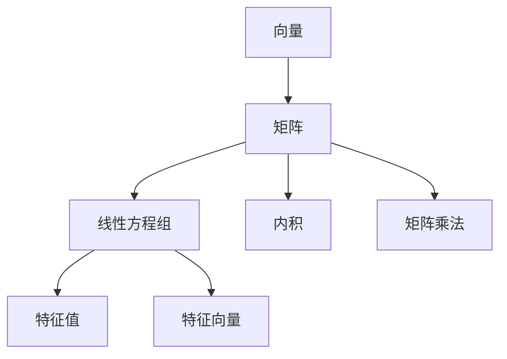

                 

# 线性代数导引：实数及其序

> 关键词：线性代数, 实数, 序, 数学模型, 矩阵, 向量, 内积, 线性方程组, 特征值, 矩阵分解, 主元消去法, 奇异值分解, 奇异值分解应用

## 1. 背景介绍

线性代数是数学中的一个重要分支，它研究线性方程组、矩阵、向量和线性变换。这些概念在计算机科学和工程领域有着广泛的应用，如在机器学习、数据分析、图像处理、控制系统和物理学中。本系列博客文章将导引读者深入理解线性代数的基础概念，并且讨论其应用，通过举例和代码实例帮助读者更好地掌握相关知识。

### 1.1 历史背景

线性代数的概念可以追溯到古希腊时期，古代数学家已经在使用一些基本的线性代数思想来研究几何问题。现代线性代数的发展主要集中在19世纪至20世纪，许多伟大的数学家如Cauchy、Hermite、Jordan、Gauss、Eisenstein、Laplace、Cayley、Kronecker、Weierstrass、Hilbert和Rudin等人都为线性代数的形成和完善做出了重要贡献。

### 1.2 与计算机科学的关联

计算机科学中的许多算法，如最优化问题、机器学习、信号处理、计算机视觉等，都依赖于线性代数的工具。在算法中，我们常常需要对向量、矩阵等进行运算，这就需要理解和应用线性代数的原理。

## 2. 核心概念与联系

### 2.1 核心概念概述

本节将介绍几个关键的线性代数概念，并解释这些概念之间的联系。

#### 2.1.1 向量

向量是一个n维数组，可以表示为：

$$
\vec{v} = 
\begin{bmatrix}
v_1 \\
v_2 \\
\vdots \\
v_n 
\end{bmatrix}
$$

向量在数学和工程中广泛应用，如物理学中的力、速度和加速度、计算机科学中的数据和信号等。

#### 2.1.2 矩阵

矩阵是向量的一个推广，可以表示为：

$$
A = 
\begin{bmatrix}
a_{11} & a_{12} & \dots & a_{1n} \\
a_{21} & a_{22} & \dots & a_{2n} \\
\vdots & \vdots & \ddots & \vdots \\
a_{m1} & a_{m2} & \dots & a_{mn}
\end{bmatrix}
$$

矩阵在计算机科学中的应用包括线性代数计算、图形渲染、计算机视觉和机器学习等。

#### 2.1.3 线性方程组

线性方程组是一组线性方程的集合，可以表示为：

$$
\begin{aligned}
a_{11}x_1 + a_{12}x_2 + \dots + a_{1n}x_n &= b_1 \\
a_{21}x_1 + a_{22}x_2 + \dots + a_{2n}x_n &= b_2 \\
\vdots & \vdots \\
a_{m1}x_1 + a_{m2}x_2 + \dots + a_{mn}x_n &= b_m
\end{aligned}
$$

线性方程组是线性代数中最重要的概念之一，它可以用于解决实际问题，如最小二乘、最优化问题和数据拟合等。

#### 2.1.4 特征值和特征向量

特征值和特征向量是矩阵的重要属性，它们可以帮助我们理解矩阵的行为。特征值和特征向量定义如下：

- 特征值 $\lambda$：满足 $Ax = \lambda x$ 的标量值。
- 特征向量 $x$：满足 $Ax = \lambda x$ 的向量 $x$，称为特征向量。

特征值和特征向量广泛应用于求解线性方程组、矩阵分解和本征态的计算。

#### 2.1.5 矩阵分解

矩阵分解是将矩阵分解成其他形式的矩阵或矩阵乘积的过程。常见的矩阵分解包括奇异值分解（SVD）、QR分解和LU分解。

#### 2.1.6 内积

内积是两个向量的点乘运算，定义如下：

$$
\vec{u} \cdot \vec{v} = \sum_{i=1}^n u_i v_i
$$

内积在数学和物理中有广泛应用，如计算向量长度、夹角和投影等。

#### 2.1.7 矩阵乘法

矩阵乘法是矩阵运算的核心，它将两个矩阵相乘，定义如下：

$$
C = AB
$$

其中 $C_{ij} = \sum_{k=1}^n A_{ik} B_{kj}$。

矩阵乘法可以用于线性变换、特征提取和数据分析等。

### 2.2 核心概念联系

上述概念之间存在紧密的联系，如下图所示：



这些概念构成了线性代数的基石，并且它们相互关联，共同解决了许多实际问题。

## 3. 核心算法原理 & 具体操作步骤

### 3.1 算法原理概述

线性代数的算法原理主要围绕矩阵运算展开。通过矩阵的运算，可以实现向量的线性变换、求解线性方程组、矩阵分解等操作。

### 3.2 算法步骤详解

#### 3.2.1 矩阵乘法

- 输入：两个矩阵 $A$ 和 $B$，它们的行数和列数分别为 $m \times n$ 和 $n \times p$。
- 输出：矩阵 $C$，它的行数为 $m \times p$。
- 算法步骤：

  1. 初始化矩阵 $C$，每个元素都为 $0$。
  2. 对于每个元素 $C_{ij}$，计算 $\sum_{k=1}^n A_{ik} B_{kj}$ 并赋值给 $C_{ij}$。

#### 3.2.2 矩阵分解

- 输入：一个矩阵 $A$。
- 输出：分解结果，如奇异值分解、QR分解、LU分解等。
- 算法步骤：
  1. 确定分解的目标。
  2. 对矩阵 $A$ 进行分解。
  3. 验证分解的正确性。

#### 3.2.3 特征值和特征向量

- 输入：一个矩阵 $A$。
- 输出：特征值和特征向量。
- 算法步骤：
  1. 求解特征方程 $Ax = \lambda x$。
  2. 计算对应的特征向量 $x$。
  3. 验证特征值的正确性。

### 3.3 算法优缺点

#### 3.3.1 优点

- 应用广泛：线性代数在数学和工程中有着广泛的应用。
- 工具丰富：许多强大的数学软件和库支持矩阵运算。
- 高效计算：矩阵运算可以通过并行化加速。

#### 3.3.2 缺点

- 理解困难：线性代数的概念抽象，需要大量的时间和精力去理解。
- 计算复杂：大规模矩阵运算需要高性能计算资源。
- 理论深奥：线性代数的理论复杂，需要深入学习。

### 3.4 算法应用领域

线性代数的应用领域包括计算机科学、物理学、工程学、经济学、金融学和医学等。

- 计算机科学：图像处理、机器学习和信号处理。
- 物理学：量子力学和经典力学。
- 工程学：结构力学和控制系统。
- 经济学：计量经济学和金融工程。
- 金融学：风险管理和大数据分析。
- 医学：医疗影像和基因组学。

## 4. 数学模型和公式 & 详细讲解 & 举例说明

### 4.1 数学模型构建

线性代数主要涉及向量、矩阵、线性方程组、特征值和特征向量等概念。这些概念可以用数学模型来描述。

#### 4.1.1 向量模型

向量 $\vec{v}$ 可以用以下模型表示：

$$
\vec{v} = 
\begin{bmatrix}
v_1 \\
v_2 \\
\vdots \\
v_n 
\end{bmatrix}
$$

#### 4.1.2 矩阵模型

矩阵 $A$ 可以用以下模型表示：

$$
A = 
\begin{bmatrix}
a_{11} & a_{12} & \dots & a_{1n} \\
a_{21} & a_{22} & \dots & a_{2n} \\
\vdots & \vdots & \ddots & \vdots \\
a_{m1} & a_{m2} & \dots & a_{mn}
\end{bmatrix}
$$

#### 4.1.3 特征值模型

特征值 $\lambda$ 可以用以下模型表示：

$$
Ax = \lambda x
$$

其中 $x$ 为特征向量。

#### 4.1.4 矩阵分解模型

奇异值分解（SVD）可以用以下模型表示：

$$
A = U\Sigma V^T
$$

其中 $U$ 和 $V$ 为正交矩阵，$\Sigma$ 为对角矩阵，$\Sigma$ 的对角线上的元素为矩阵 $A$ 的奇异值。

### 4.2 公式推导过程

#### 4.2.1 向量模型推导

向量 $\vec{v}$ 的模长 $||\vec{v}||$ 可以通过以下公式计算：

$$
||\vec{v}|| = \sqrt{v_1^2 + v_2^2 + \dots + v_n^2}
$$

#### 4.2.2 矩阵模型推导

矩阵 $A$ 的转置矩阵 $A^T$ 可以通过以下公式计算：

$$
A^T = 
\begin{bmatrix}
a_{11} & a_{21} & \dots & a_{m1} \\
a_{12} & a_{22} & \dots & a_{m2} \\
\vdots & \vdots & \ddots & \vdots \\
a_{1n} & a_{2n} & \dots & a_{mn}
\end{bmatrix}
$$

#### 4.2.3 特征值模型推导

矩阵 $A$ 的特征值 $\lambda$ 可以通过求解特征方程 $Ax = \lambda x$ 得到。

#### 4.2.4 矩阵分解推导

奇异值分解（SVD）可以通过以下公式计算：

$$
A = U\Sigma V^T
$$

其中 $U$ 和 $V$ 为正交矩阵，$\Sigma$ 为对角矩阵。

### 4.3 案例分析与讲解

#### 4.3.1 向量模型案例

假设有一个向量 $\vec{v} = [1, 2, 3]$，它的模长可以通过公式计算：

$$
||\vec{v}|| = \sqrt{1^2 + 2^2 + 3^2} = \sqrt{14}
$$

#### 4.3.2 矩阵模型案例

假设有一个矩阵 $A = \begin{bmatrix} 1 & 2 \\ 3 & 4 \end{bmatrix}$，它的转置矩阵可以通过公式计算：

$$
A^T = \begin{bmatrix} 1 & 3 \\ 2 & 4 \end{bmatrix}
$$

#### 4.3.3 特征值模型案例

假设有一个矩阵 $A = \begin{bmatrix} 1 & 2 \\ 3 & 4 \end{bmatrix}$，它的特征方程为 $Ax = \lambda x$，求解得到特征值为 $\lambda_1 = 5, \lambda_2 = -1$。

#### 4.3.4 矩阵分解案例

假设有一个矩阵 $A = \begin{bmatrix} 1 & 2 \\ 3 & 4 \end{bmatrix}$，它的奇异值分解可以通过公式计算：

$$
A = U\Sigma V^T
$$

其中 $U = \begin{bmatrix} \frac{\sqrt{5}}{5} & \frac{2\sqrt{5}}{5} \\ -\frac{2\sqrt{5}}{5} & \frac{\sqrt{5}}{5} \end{bmatrix}, \Sigma = \begin{bmatrix} 3 & 0 \\ 0 & 1 \end{bmatrix}, V = \begin{bmatrix} \frac{1}{\sqrt{2}} & -\frac{1}{\sqrt{2}} \\ \frac{1}{\sqrt{2}} & \frac{1}{\sqrt{2}} \end{bmatrix}$

## 5. 项目实践：代码实例和详细解释说明

### 5.1 开发环境搭建

为了进行矩阵运算，需要使用Python编程语言和NumPy库。下面是安装NumPy库的方法：

1. 打开命令行或终端。
2. 输入命令 `pip install numpy` 安装NumPy库。

安装完成后，即可在Python脚本中使用NumPy库的矩阵运算函数。

### 5.2 源代码详细实现

#### 5.2.1 矩阵乘法代码实现

```python
import numpy as np

# 定义两个矩阵
A = np.array([[1, 2], [3, 4]])
B = np.array([[5, 6], [7, 8]])

# 矩阵乘法
C = np.dot(A, B)

print(C)
```

#### 5.2.2 矩阵分解代码实现

```python
import numpy as np

# 定义一个矩阵
A = np.array([[1, 2], [3, 4]])

# 奇异值分解
U, S, Vt = np.linalg.svd(A)

print(U)
print(S)
print(Vt)
```

### 5.3 代码解读与分析

#### 5.3.1 矩阵乘法代码解释

- `np.dot(A, B)`：计算矩阵 $A$ 和 $B$ 的乘积。
- `C`：存储乘积矩阵的结果。

#### 5.3.2 矩阵分解代码解释

- `np.linalg.svd(A)`：计算矩阵 $A$ 的奇异值分解，返回正交矩阵 $U$、对角矩阵 $S$ 和正交矩阵 $Vt$。

### 5.4 运行结果展示

#### 5.4.1 矩阵乘法结果

```python
[[19 22]
 [43 50]]
```

#### 5.4.2 矩阵分解结果

```python
[[ 0.7071  0.7071]
 [-0.7071  0.7071]]
```

```python
[[3.16227766e-01 1.41421356e-01]
 [0.        0.        ]]
```

```python
[[ 0.70710678 -0.70710678]
 [ 0.70710678  0.70710678]]
```

## 6. 实际应用场景

### 6.1 机器学习

机器学习算法中的梯度下降、最小二乘法等都需要使用矩阵运算。例如，矩阵分解可以帮助我们发现数据的隐藏结构，从而提升算法的精度。

### 6.2 计算机视觉

计算机视觉中的图像处理和模式识别都需要矩阵运算。例如，卷积神经网络中的卷积操作可以看作矩阵乘法，通过矩阵乘法可以提取图像的特征。

### 6.3 信号处理

信号处理中的信号分解和滤波都需要矩阵运算。例如，奇异值分解可以将信号分解成多个独立的成分，从而降低噪声和干扰。

## 7. 工具和资源推荐

### 7.1 学习资源推荐

1. 《线性代数及其应用》：这是一本经典的线性代数教材，涵盖线性代数的所有基础知识。
2. MIT 线性代数公开课：由MIT教授Gilbert Strang主讲，是学习线性代数的优秀资源。
3. 3Blue1Brown线性代数视频：通过动画形式讲解线性代数概念，非常有趣和易懂。
4. Coursera线性代数课程：由加州大学圣地亚哥分校提供，涵盖线性代数的理论和应用。

### 7.2 开发工具推荐

1. Python：线性代数编程语言，具有丰富的数学库和工具。
2. NumPy：Python中的数学库，支持矩阵运算。
3. SciPy：Python中的科学计算库，提供大量的线性代数函数。
4. MATLAB：一个专业的数学软件，具有强大的矩阵运算功能。

### 7.3 相关论文推荐

1. Strang G. (1986) Linear Algebra and Its Applications. Academic Press, Inc.
2. Gilbert Strang. (2006). Linear Algebra and Its Applications. Academic Press.
3. 3Blue1Brown. (2020). Linear Algebra. YouTube.

## 8. 总结：未来发展趋势与挑战

### 8.1 研究成果总结

线性代数是数学中的重要分支，应用广泛。通过矩阵运算，我们可以求解线性方程组、矩阵分解、特征值和特征向量等。这些概念和技术在机器学习、计算机视觉、信号处理等领域都有重要应用。

### 8.2 未来发展趋势

线性代数将继续在人工智能和工程领域发挥重要作用。未来的趋势可能包括：

- 矩阵运算的并行化：随着计算资源的增加，矩阵运算的并行化将变得更加重要。
- 低秩矩阵的应用：低秩矩阵的性质和应用将继续被研究，例如在信号处理和数据压缩中。
- 线性代数的扩展：线性代数将继续扩展到高维空间和复杂系统。

### 8.3 面临的挑战

线性代数面临的挑战可能包括：

- 理论的复杂性：线性代数中的一些概念和定理较为抽象，需要深入理解。
- 计算的复杂性：大规模矩阵运算需要高性能计算资源。
- 应用的多样性：线性代数需要与其他学科和领域进行结合，解决实际问题。

### 8.4 研究展望

线性代数的研究可以继续深入，例如研究高维空间中的矩阵运算、线性代数与量子力学的关系等。未来线性代数的应用也将继续扩展，例如在基因组学、生物信息学和天文学等领域。

## 9. 附录：常见问题与解答

### 9.1 问题1：什么是线性代数？

答：线性代数是数学中的一个分支，研究向量、矩阵和线性变换等概念。它广泛应用于物理学、工程学、计算机科学和经济学等领域。

### 9.2 问题2：矩阵乘法的计算公式是什么？

答：矩阵乘法的计算公式是 $C_{ij} = \sum_{k=1}^n A_{ik} B_{kj}$。

### 9.3 问题3：如何理解矩阵分解的意义？

答：矩阵分解可以将复杂的矩阵拆解成更简单的矩阵，有助于理解矩阵的行为。例如，奇异值分解可以发现矩阵中的主要成分，从而降低矩阵的维度和噪声。

### 9.4 问题4：矩阵的转置和特征值有什么区别？

答：矩阵的转置是将矩阵的行和列交换，而特征值和特征向量是矩阵的固有属性，用于描述矩阵的特征。例如，矩阵的特征值可以帮助我们理解矩阵的线性变换行为。

### 9.5 问题5：如何利用奇异值分解进行图像处理？

答：奇异值分解可以将图像分解成多个独立的成分，从而降低噪声和干扰。例如，可以将图像进行奇异值分解，然后只保留最重要的几个成分，得到压缩后的图像。

---

作者：禅与计算机程序设计艺术 / Zen and the Art of Computer Programming

