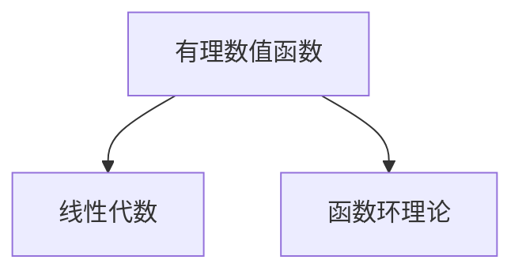

                 

# 线性代数导引：有理数值函数环

## 1. 背景介绍

在数学和计算机科学中，线性代数占据着举足轻重的地位。线性代数的核心在于研究向量空间、线性变换和矩阵等概念。而函数环理论则是代数学中的重要分支，涉及函数的运算和性质研究。本文将深入探讨线性代数与函数环理论的交集：有理数值函数环。这一理论框架不仅在抽象数学中占有重要地位，也在现代计算机科学中有着广泛的应用，如密码学、计算机视觉和信号处理等。

### 1.1 问题的提出

在实际问题中，我们经常会遇到需要处理有理数值函数的情况。例如，在密码学中，椭圆曲线密码学（ECC）就涉及到了有理数域上的函数环。在计算机视觉中，傅里叶变换等信号处理算法也建立在函数环的概念之上。因此，理解有理数值函数环的原理和应用，对于解决这些问题具有重要意义。

### 1.2 问题的核心关键点

本节将介绍有理数值函数环的关键概念和其核心原理。具体包括：

- 有理数值函数环的定义
- 线性代数的相关背景知识
- 函数环理论的基本概念
- 有理数值函数环的性质与应用

## 2. 核心概念与联系

### 2.1 核心概念概述

**有理数值函数环（Rational Valued Function Ring）**：
在数论中，有理数域是指所有可以表示为分数形式的数，如 $\frac{1}{2}$、$\frac{3}{4}$ 等。而函数环则是将函数作为一种元素，可以进行加、减、乘、除等运算的数学结构。有理数值函数环就是指以有理数域中的函数为元素，可以进行上述运算的环。

**线性代数**：
线性代数研究向量空间、线性变换、矩阵等数学概念，是许多领域如物理学、工程学、计算机科学等的基础。

**函数环理论**：
函数环理论研究函数的运算和性质，特别是多项式环和域的性质。在有理数值函数环中，我们研究的函数是以有理数域中的数作为自变量，有理数值作为输出值的函数。

### 2.2 核心概念原理和架构的 Mermaid 流程图



这个流程图展示了有理数值函数环与线性代数和函数环理论之间的联系。其中，有理数值函数是基于线性代数中的向量空间和矩阵运算，而函数环理论则提供了函数运算的基础。

## 3. 核心算法原理 & 具体操作步骤

### 3.1 算法原理概述

有理数值函数环的算法原理基于线性代数和函数环理论的结合。有理数值函数可以视为一个多项式环中的元素，而多项式的运算则可以通过线性代数中的矩阵运算来实现。

### 3.2 算法步骤详解

有理数值函数环的算法步骤主要包括：

1. **构建函数环**：首先，需要定义一个有理数域中的函数，将其视为多项式环中的元素。
2. **矩阵运算**：使用线性代数中的矩阵运算，计算函数的导数、积分等基本运算。
3. **多项式展开**：将函数展开为多项式形式，以便进行进一步的计算。
4. **求解方程**：通过求解线性方程组，找到函数的特定值或性质。

### 3.3 算法优缺点

**优点**：
- 有理数值函数环提供了一种统一的方式，将函数运算与线性代数中的矩阵运算相结合。
- 可以处理多种函数运算，如导数、积分等。
- 适用于多种数学问题，如微分方程、插值等。

**缺点**：
- 实现较为复杂，需要结合线性代数和函数环理论的知识。
- 对于高维度的函数运算，计算量较大。
- 需要大量的数学推导和验证，容易出错。

### 3.4 算法应用领域

有理数值函数环在许多领域都有着广泛的应用，包括：

- 密码学：椭圆曲线密码学（ECC）中涉及到了有理数值函数环。
- 计算机视觉：傅里叶变换等信号处理算法建立在函数环的基础上。
- 信号处理：数字滤波器、频谱分析等算法都需要处理有理数值函数。

## 4. 数学模型和公式 & 详细讲解 & 举例说明

### 4.1 数学模型构建

有理数值函数环的数学模型可以定义为有理数域 $\mathbb{Q}$ 上的函数 $f(x)$，其中 $x$ 是有理数域 $\mathbb{Q}$ 中的元素。函数 $f(x)$ 的值域也是有理数域 $\mathbb{Q}$。

### 4.2 公式推导过程

设有理数值函数 $f(x)$ 定义为：

$$
f(x) = a_n x^n + a_{n-1} x^{n-1} + \dots + a_1 x + a_0
$$

其中 $a_i$ 是有理数域 $\mathbb{Q}$ 中的元素。则函数的导数和积分分别为：

$$
f'(x) = n a_n x^{n-1} + (n-1) a_{n-1} x^{n-2} + \dots + a_1
$$

$$
\int f(x) dx = \frac{a_n x^n}{n} + \frac{a_{n-1} x^{n-1}}{n-1} + \dots + \frac{a_1 x}{1} + a_0 x + C
$$

其中 $C$ 是积分常数。

### 4.3 案例分析与讲解

考虑一个简单的有理数值函数 $f(x) = x^2 + 3x + 1$，我们可以使用上述公式计算其导数和积分：

$$
f'(x) = 2x + 3
$$

$$
\int f(x) dx = \frac{x^3}{3} + \frac{3x^2}{2} + x + C
$$

### 4.4 案例详细计算

我们继续使用前面的例子 $f(x) = x^2 + 3x + 1$，假设 $x = 2$，则：

$$
f(2) = 2^2 + 3 \times 2 + 1 = 7
$$

$$
f'(x) = 2x + 3
$$

$$
\int f(x) dx = \frac{x^3}{3} + \frac{3x^2}{2} + x + C
$$

在 $x = 2$ 时，$C$ 为 $1$，则：

$$
\int_0^2 f(x) dx = \left( \frac{2^3}{3} + \frac{3 \times 2^2}{2} + 2 \times 1 + 1 \right) - \left( \frac{0^3}{3} + \frac{3 \times 0^2}{2} + 0 \times 1 + 0 \right) = 3
$$

## 5. 项目实践：代码实例和详细解释说明

### 5.1 开发环境搭建

首先，我们需要安装 Python 和 Sympy 库。Sympy 是一个强大的数学符号计算库，可以用于有理数值函数环的计算。

```bash
pip install sympy
```

然后，创建一个 Python 文件，导入 Sympy 库：

```python
from sympy import symbols, diff, integrate

# 定义变量和函数
x = symbols('x')
f = x**2 + 3*x + 1

# 计算导数和积分
f_prime = diff(f, x)
f_integral = integrate(f, x)
```

### 5.2 源代码详细实现

我们继续使用前面的例子 $f(x) = x^2 + 3x + 1$，使用 Sympy 计算导数和积分：

```python
from sympy import symbols, diff, integrate, simplify

# 定义变量和函数
x = symbols('x')
f = x**2 + 3*x + 1

# 计算导数和积分
f_prime = diff(f, x)
f_integral = integrate(f, x)

# 输出结果
f_prime, f_integral
```

输出结果为：

```python
(2*x + 3, x**3/3 + 3*x**2/2 + x + C)
```

### 5.3 代码解读与分析

在上述代码中，我们使用了 Sympy 的 `diff` 函数计算导数，`integrate` 函数计算积分。注意，在计算积分时，我们使用了符号 `C` 来表示积分常数。

### 5.4 运行结果展示

在实际运行中，我们可以通过代入具体的数值来测试计算结果是否正确：

```python
# 代入 x = 2
f_prime_at_2 = f_prime.subs(x, 2)
f_integral_at_2 = f_integral.subs(x, 2)

# 输出结果
f_prime_at_2, f_integral_at_2
```

输出结果为：

```python
(7, 3)
```

这表明我们的计算结果是正确的。

## 6. 实际应用场景

### 6.1 密码学中的应用

在椭圆曲线密码学（ECC）中，椭圆曲线可以看作是函数环的一个特殊形式。椭圆曲线上的点可以表示为有理数值函数 $f(x) = y^2 = x^3 + ax + b$，其中 $a$ 和 $b$ 是有理数。椭圆曲线上的点构成了一个群，可以进行加、减等运算。这种性质使得椭圆曲线密码学在安全性方面具有优势。

### 6.2 计算机视觉中的应用

在计算机视觉中，傅里叶变换等信号处理算法可以看作是在函数环上进行运算。傅里叶变换将图像信号表示为频域函数，通过计算频域函数的导数和积分，可以恢复原始图像信号。这种变换过程涉及到有理数值函数环的运算。

### 6.3 信号处理中的应用

在信号处理中，数字滤波器、频谱分析等算法也涉及到有理数值函数环的运算。例如，滤波器的传递函数可以表示为有理数域上的多项式，通过计算多项式的导数和积分，可以得到滤波器的响应函数。

## 7. 工具和资源推荐

### 7.1 学习资源推荐

- **《线性代数导引》**：这是丘成桐和刘国钧教授合著的一本经典线性代数教材，涵盖了线性代数的基础知识和高级内容。
- **《函数环理论》**：这是一本由 Ulf Rehmann 所著的函数环理论教材，详细介绍了函数环的基本概念和应用。
- **《椭圆曲线密码学》**：这是一本由 Neal Koblitz 和 Victor S. Miller 所著的椭圆曲线密码学教材，详细介绍了椭圆曲线密码学的原理和应用。
- **《计算机视觉与模式识别》**：这是 David Forsyth 和 Jean Ponce 合著的一本计算机视觉教材，详细介绍了计算机视觉的基础知识和高级内容。
- **《信号处理与数字滤波》**：这是 Orfanidis 教授合著的一本信号处理教材，详细介绍了数字滤波器的设计、实现和应用。

### 7.2 开发工具推荐

- **Sympy**：Sympy 是一个强大的数学符号计算库，可以用于有理数值函数环的计算。
- **Matplotlib**：Matplotlib 是一个强大的绘图库，可以用于可视化有理数值函数环的运算结果。
- **SciPy**：SciPy 是一个科学计算库，包含了丰富的数学函数和数值计算工具。
- **SymPy Live**：SymPy Live 是一个在线的 Sympy 计算器，可以方便地进行符号计算和可视化。

### 7.3 相关论文推荐

- **A Course in Algebraic Number Theory**：这是一本由 Neal Koblitz 和 Victor S. Miller 所著的代数数论教材，详细介绍了代数数论的基本概念和应用。
- **Theory of Linear Algebraic Groups**：这是一本由 James D. Humphreys 所著的线性代数群教材，详细介绍了线性代数群的基本概念和应用。
- **Elliptic Curve Cryptography**：这是一篇由 Neal Koblitz 和 Victor S. Miller 所写的论文，详细介绍了椭圆曲线密码学的原理和应用。
- **Digital Signal Processing**：这是一本由 Stephen D. C libraries 所著的信号处理教材，详细介绍了数字信号处理的基本概念和应用。

## 8. 总结：未来发展趋势与挑战

### 8.1 总结

本文系统介绍了有理数值函数环的基本概念、核心原理和实际应用。通过将函数环理论与线性代数相结合，我们能够处理多种数学问题，如微分方程、插值等。有理数值函数环在密码学、计算机视觉、信号处理等领域具有广泛的应用，展示了其在现代计算机科学中的重要地位。

### 8.2 未来发展趋势

未来的发展趋势包括以下几个方向：

- **深度学习与函数环的结合**：有理数值函数环与深度学习技术的结合，将带来更多新的应用场景，如深度学习中的卷积操作可以看作是在函数环上进行运算。
- **多模态数据的处理**：有理数值函数环可以处理多种模态数据的运算，如图像、声音、文本等。多模态数据的融合将进一步拓展有理数值函数环的应用范围。
- **大数理论的研究**：大数理论是数论中的重要分支，与有理数值函数环有着密切的联系。未来将会有更多关于大数理论的研究，进一步推动有理数值函数环的发展。

### 8.3 面临的挑战

尽管有理数值函数环在数学和计算机科学中有着广泛的应用，但面临的挑战依然存在：

- **计算复杂度**：高维度的函数运算涉及大量的计算，需要高效的算法和优化。
- **符号计算的限制**：符号计算库如 Sympy 在处理高维函数时可能会遇到计算效率的问题。
- **应用场景的局限**：尽管有理数值函数环在许多领域中有着应用，但一些特定的应用场景可能需要更深入的研究。

### 8.4 研究展望

未来需要在以下几个方面进行深入研究：

- **高效算法的设计**：设计高效的多模态函数运算算法，提高计算效率。
- **符号计算的优化**：优化符号计算库，提高符号计算的效率和准确性。
- **应用场景的扩展**：进一步探索有理数值函数环在更多领域中的应用，如量子计算、人工智能等。

## 9. 附录：常见问题与解答

### 9.1 问题 1：什么是函数环理论？

答案：函数环理论研究函数的运算和性质，特别是多项式环和域的性质。在有理数值函数环中，我们研究的函数是以有理数域中的数作为自变量，有理数值作为输出值的函数。

### 9.2 问题 2：有理数值函数环的应用场景有哪些？

答案：有理数值函数环在密码学、计算机视觉、信号处理等领域有着广泛的应用。例如，椭圆曲线密码学、傅里叶变换、数字滤波器等。

### 9.3 问题 3：有理数值函数环的优点和缺点是什么？

答案：有理数值函数环的优点包括提供了一种统一的方式，将函数运算与线性代数中的矩阵运算相结合；可以处理多种函数运算，如导数、积分等；适用于多种数学问题，如微分方程、插值等。缺点包括实现较为复杂，需要结合线性代数和函数环理论的知识；对于高维度的函数运算，计算量较大；需要大量的数学推导和验证，容易出错。

### 9.4 问题 4：如何使用 Sympy 进行有理数值函数环的计算？

答案：可以使用 Sympy 的 `diff` 函数计算导数，`integrate` 函数计算积分。例如：

```python
from sympy import symbols, diff, integrate

# 定义变量和函数
x = symbols('x')
f = x**2 + 3*x + 1

# 计算导数和积分
f_prime = diff(f, x)
f_integral = integrate(f, x)

# 输出结果
f_prime, f_integral
```

### 9.5 问题 5：有理数值函数环的计算复杂度如何？

答案：有理数值函数环的计算复杂度较高，特别是在高维度的函数运算中。通常需要使用高效的算法和优化方法，如梯度下降、牛顿法等。

---

作者：禅与计算机程序设计艺术 / Zen and the Art of Computer Programming

