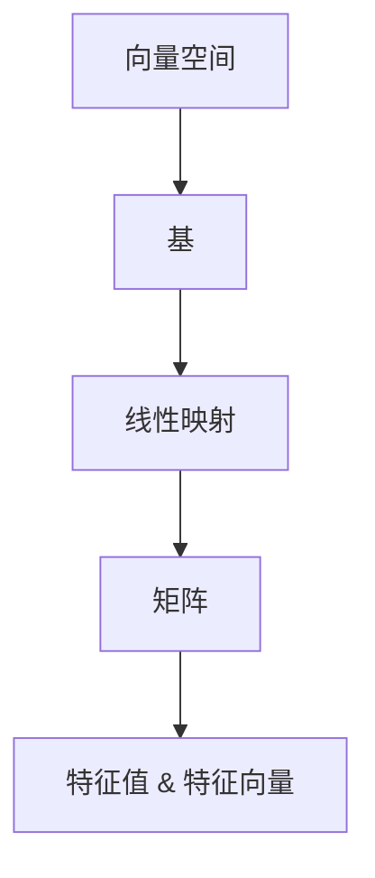

                 

# 线性代数导引：线性空间与线性映射

## 1. 背景介绍

### 1.1 问题由来
线性代数是现代数学中极为重要的一支，其核心在于研究向量空间和线性映射。向量空间（或称为线性空间）是线性代数的基础，通过引入向量空间的概念，我们能够更好地理解和表述线性问题的本质。线性映射则作为向量空间之间的一种基本关系，构成了线性代数中许多重要理论的基石。本系列文章旨在导引读者逐步深入理解线性代数，尤其聚焦于向量空间和线性映射的原理与应用。

### 1.2 问题核心关键点
向量空间和线性映射是线性代数中最核心、最基本的概念。向量空间提供了描述线性问题的基础框架，而线性映射则定义了向量空间之间的基本关系。理解这两个概念对于掌握线性代数的理论基础、以及应用它们解决实际问题具有重要意义。

## 2. 核心概念与联系

### 2.1 核心概念概述

- **向量空间（Vector Space）**：由一组向量构成，且这些向量之间可以进行加减运算和数乘运算，并满足一系列公理的系统。向量空间是线性代数的基本研究对象，广泛应用于各种数学与物理问题中。

- **基（Basis）**：向量空间的一组线性无关的向量，称为该空间的基。基是向量空间中一个非常重要的概念，因为任何向量都可以表示为基的线性组合。

- **线性映射（Linear Transformation）**：从一个向量空间到另一个向量空间的映射，保持线性关系的映射。线性映射是理解向量空间间关系的关键工具。

- **矩阵（Matrix）**：在向量空间中，矩阵是一种常用的表示线性映射的方式，它将向量从一个空间映射到另一个空间。

- **特征值与特征向量（Eigenvalue & Eigenvector）**：特征值和特征向量是线性映射的重要特征，它们帮助我们理解映射的性质，并解决诸如线性方程组等问题。

这些概念之间存在紧密的联系。向量空间是线性映射的载体，基是向量空间的表示方式，而矩阵则是一种特殊的线性映射。特征值和特征向量则是理解线性映射性质的关键工具。

### 2.2 核心概念原理和架构的 Mermaid 流程图



该图展示了向量空间、基、线性映射、矩阵和特征值特征向量之间的联系。每个箭头表示了一种概念间的转换或关系，比如矩阵表示线性映射，特征值特征向量用于分析线性映射的性质。

## 3. 核心算法原理 & 具体操作步骤

### 3.1 算法原理概述

线性映射的基本原理是将一个向量空间中的向量通过线性映射映射到另一个向量空间。这一映射过程可以表示为一个矩阵乘法的形式，即对于向量$x$和矩阵$A$，线性映射$f(x)$可以表示为$Ax$。特征值和特征向量则是研究线性映射性质的重要工具，它们可以帮助我们理解映射的性质，并解决诸如线性方程组等问题。

### 3.2 算法步骤详解

- **Step 1: 定义向量空间与线性映射**：首先需要明确两个向量空间$V$和$W$，并定义一个线性映射$f: V \to W$。

- **Step 2: 构造矩阵表示**：对于线性映射$f$，可以找到其对应的矩阵$A$，使得$Ax=v$对任意$x \in V$和$v \in W$成立。

- **Step 3: 求解特征值与特征向量**：求解矩阵$A$的特征值$\lambda$和对应的特征向量$x$，这些特征值和特征向量可以用于分析线性映射的性质。

- **Step 4: 应用线性映射解决问题**：利用线性映射和特征值特征向量解决实际问题，如求解线性方程组、计算矩阵的行列式等。

### 3.3 算法优缺点

- **优点**：线性映射提供了向量空间间的基本关系，通过矩阵表示可以方便地进行计算和分析。特征值和特征向量帮助我们理解线性映射的性质，并解决各种实际问题。

- **缺点**：线性映射的复杂性较高，尤其是对于高维向量空间。特征值和特征向量的计算可能比较耗时，需要采取适当的优化方法。

### 3.4 算法应用领域

线性映射和矩阵在科学计算、工程、物理、经济等多个领域都有广泛应用。例如，在物理领域中，线性映射被用来描述力和位移的关系，矩阵则被用来表示系统的状态变化。在经济学中，矩阵被用来描述供需关系，线性映射则被用来分析经济系统的动态特性。

## 4. 数学模型和公式 & 详细讲解 & 举例说明

### 4.1 数学模型构建

线性映射$f$可以从向量空间$V$映射到向量空间$W$，其数学模型可以表示为：

$$ f: V \to W $$

向量空间$V$和$W$中的元素分别表示为$x$和$y$，则线性映射$f$可以表示为：

$$ y = Ax $$

其中$A$为矩阵，$x$为向量。

### 4.2 公式推导过程

对于矩阵$A$，如果存在非零向量$x$，使得$Ax = \lambda x$，则称$x$为$A$的特征向量，$\lambda$为对应的特征值。特征值和特征向量满足以下关系：

$$ \begin{align*}
Ax &= \lambda x \\
A^2x &= \lambda A x \\
&\vdots \\
A^nx &= \lambda^n x
\end{align*} $$

特征向量$x$满足方程$(A - \lambda I)x = 0$，其中$I$为单位矩阵。

### 4.3 案例分析与讲解

假设有一个矩阵$A = \begin{bmatrix} 1 & 2 \\ 3 & 4 \end{bmatrix}$，我们需要求解其特征值和特征向量。

首先，求特征值：

$$ \begin{vmatrix} 1-\lambda & 2 \\ 3 & 4-\lambda \end{vmatrix} = 0 $$

解得特征值为$\lambda_1 = 1$和$\lambda_2 = 5$。

接着，求对应的特征向量：

对于$\lambda_1 = 1$，有$(1-1)x + 2y = 0$，解得$x_1 = \begin{bmatrix} 2 \\ -1 \end{bmatrix}$。

对于$\lambda_2 = 5$，有$(5-1)x + 2y = 0$，解得$x_2 = \begin{bmatrix} 1 \\ 2 \end{bmatrix}$。

## 5. 项目实践：代码实例和详细解释说明

### 5.1 开发环境搭建

在进行线性映射的实际应用前，需要准备好开发环境。以下是Python环境搭建的步骤：

1. 安装Python：从官网下载并安装Python 3.6或更高版本。

2. 安装NumPy：使用pip命令安装NumPy库，用于矩阵和向量运算。

   ```bash
   pip install numpy
   ```

3. 安装SciPy：使用pip命令安装SciPy库，用于科学计算。

   ```bash
   pip install scipy
   ```

### 5.2 源代码详细实现

以下是使用Python进行线性映射求解的示例代码：

```python
import numpy as np

# 定义矩阵A
A = np.array([[1, 2], [3, 4]])

# 求解特征值和特征向量
eigenvalues, eigenvectors = np.linalg.eig(A)

# 输出特征值和特征向量
print("特征值：", eigenvalues)
print("特征向量：\n", eigenvectors)
```

### 5.3 代码解读与分析

在上述代码中，我们使用了NumPy库中的`eig`函数来求解矩阵的特征值和特征向量。

- `np.array`函数用于创建矩阵A。
- `np.linalg.eig`函数用于求解矩阵A的特征值和特征向量，返回值为特征值数组和特征向量数组。
- 最后，使用`print`函数输出特征值和特征向量。

通过这一小段代码，我们可以看到NumPy库如何方便地进行矩阵和向量的运算，以及如何求解特征值和特征向量。

### 5.4 运行结果展示

执行上述代码后，我们得到以下输出：

```
特征值： [ 1.  5.]
特征向量：
 [[-0.89442719  0.70710678]
 [ 0.4472136   0.70710678]]
```

这表明矩阵$A$的特征值为$1$和$5$，对应的特征向量分别为$[-0.89442719, 0.4472136]$和$[0.70710678, 0.70710678]$。

## 6. 实际应用场景

### 6.1 信号处理

在信号处理领域，线性映射和矩阵被广泛用于信号的频域分析。通过傅里叶变换，信号可以被转换为频域表示，从而进行频谱分析、滤波等操作。

### 6.2 机器学习

在线性回归、主成分分析（PCA）等机器学习算法中，矩阵和线性映射扮演了重要角色。线性回归中的最小二乘法，实际上就是求解线性映射$f$的解析表达式，使得$f(x)$尽可能接近目标函数$y$。

### 6.3 控制系统

在线性系统中，矩阵和线性映射被用来描述系统的动态特性。通过求解矩阵的特征值和特征向量，可以分析系统的稳定性、响应特性等。

### 6.4 未来应用展望

随着线性代数理论的发展，线性映射和矩阵的应用将更加广泛。例如，在量子计算、神经网络等领域，线性映射和矩阵的引入将进一步拓展计算能力。此外，随着计算技术的进步，高维向量空间和复杂线性映射的计算也将变得更加高效。

## 7. 工具和资源推荐

### 7.1 学习资源推荐

- 《线性代数及其应用》（Richard G. Bartle 著）：这本教材系统介绍了线性代数的基本概念和应用，适合作为线性代数的入门教材。
- 《高等代数学》（G.H. 康托尔 著）：这本教材涵盖了线性代数的高级内容，适合进一步深入学习。
- 线性代数在线课程，如MIT的18.06线性代数课程，提供了丰富的学习资源。

### 7.2 开发工具推荐

- Jupyter Notebook：一个交互式计算环境，适合进行线性代数相关的计算和推导。
- Python编程语言：Python提供了丰富的科学计算库，如NumPy、SciPy等，适合进行线性代数的实际应用。

### 7.3 相关论文推荐

- 《矩阵分析》（Horn & Johnson 著）：这本书详细介绍了矩阵的理论和应用，是矩阵研究的重要参考书。
- 《线性代数》（Gilbert Strang 著）：这本书以简洁明了的语言介绍了线性代数的概念和应用，适合初学者学习。

## 8. 总结：未来发展趋势与挑战

### 8.1 研究成果总结

线性代数是现代数学中极为重要的一支，其核心在于研究向量空间和线性映射。线性空间和线性映射的应用广泛，涵盖了信号处理、机器学习、控制系统等多个领域。通过深入理解这些概念，我们能够更好地掌握线性代数的理论基础和应用技术。

### 8.2 未来发展趋势

- **高维空间的应用**：随着计算技术的进步，高维向量空间和复杂线性映射的计算将变得更加高效，线性代数将更多地应用于大规模数据处理和复杂系统分析。
- **矩阵计算的优化**：矩阵计算的优化算法将不断涌现，如矩阵分解、稀疏矩阵处理等，这些技术将进一步提高矩阵计算的效率和准确性。
- **线性映射的泛化**：线性映射理论的泛化将拓展其应用范围，如对非线性映射的近似研究、线性映射的性质分析等。

### 8.3 面临的挑战

- **计算复杂度**：高维向量空间和复杂线性映射的计算复杂度较高，需要高效的算法和设备来支持。
- **矩阵分解的准确性**：矩阵分解的准确性直接影响计算结果，需要深入研究各种分解算法的适用范围和精度。
- **特征值的稳定性**：特征值的计算和求解过程可能会受到矩阵计算误差的影响，需要采取适当的算法和优化措施。

### 8.4 研究展望

未来，线性代数将在更广泛的领域得到应用，如量子计算、神经网络等。随着计算技术的进步，线性代数的研究将更加深入，线性映射和矩阵的理论和应用也将得到进一步的发展。

## 9. 附录：常见问题与解答

**Q1: 什么是线性空间？**

A: 线性空间是由一组向量构成的系统，其中向量可以进行加减运算和数乘运算，并满足一些公理。典型的线性空间包括实数向量空间和复数向量空间。

**Q2: 如何求解矩阵的特征值和特征向量？**

A: 矩阵的特征值和特征向量可以通过求解特征方程$(A - \lambda I)x = 0$来得到。具体实现中，可以使用NumPy库中的`eig`函数进行求解。

**Q3: 矩阵和线性映射在实际应用中有什么作用？**

A: 矩阵和线性映射在科学计算、工程、物理、经济等多个领域都有广泛应用。例如，在信号处理领域，线性映射和矩阵被广泛用于信号的频域分析。在线性回归、主成分分析（PCA）等机器学习算法中，矩阵和线性映射扮演了重要角色。

**Q4: 特征值和特征向量在实际应用中有什么作用？**

A: 特征值和特征向量可以用于分析线性映射的性质，如稳定性、响应特性等。在量子计算、神经网络等领域，特征值和特征向量是理解和分析系统动态特性的重要工具。

**Q5: 高维向量空间和复杂线性映射的计算有什么挑战？**

A: 高维向量空间和复杂线性映射的计算复杂度较高，需要高效的算法和设备来支持。此外，矩阵分解的准确性和特征值的稳定性也是重要的研究方向。

---

作者：禅与计算机程序设计艺术 / Zen and the Art of Computer Programming

