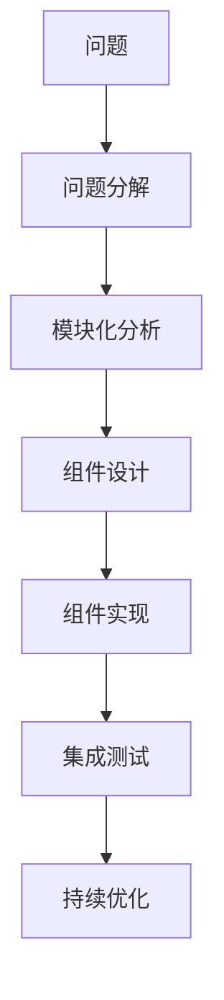
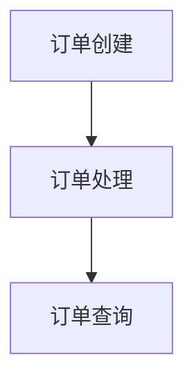

                 

# 结构化思维的应用：从理论到实践

> 关键词：结构化思维, 数据结构, 算法分析, 软件工程, 复杂性管理, 问题解决, 软件开发, 编程实践

## 1. 背景介绍

### 1.1 问题由来

随着信息技术的快速发展，软件系统变得越来越复杂，尤其是对于大型企业级系统而言，如金融、医疗、电子商务等。复杂性不仅体现在代码规模的庞大，更体现在系统架构的复杂、技术栈的多样、数据处理的繁琐等诸多方面。如何在这些复杂环境中高效、可靠地构建和维护软件系统，成为了现代软件开发中的一大挑战。

结构化思维（Structured Thinking）是一种系统化、逻辑化的思考和解决问题的方法，通过将复杂问题拆解为可管理的小模块，利用逻辑框架逐步分析和解决，能够有效应对软件工程中的诸多复杂挑战。本文将围绕结构化思维的核心概念、原理与实践方法，系统介绍其在软件开发中的应用。

### 1.2 问题核心关键点

结构化思维的应用核心在于以下几个关键点：

- **问题分解**：将复杂问题拆解为可管理的小问题，逐个分析解决。
- **逻辑框架**：建立清晰的问题解决逻辑框架，引导分析思路。
- **可复用性**：尽量采用可复用的组件和方法，避免重复劳动。
- **自动化工具**：利用各种自动化工具，提高开发效率。
- **持续优化**：在软件开发的各个环节不断优化，提升系统质量。

## 2. 核心概念与联系

### 2.1 核心概念概述

结构化思维是软件开发中一种基于逻辑和系统的思考方式，强调将复杂问题分解、分类、归纳、抽象为可管理的小模块，并通过合理的逻辑框架逐个分析和解决。

### 2.2 核心概念原理和架构的 Mermaid 流程图



这个流程图展示了结构化思维的基本流程：

1. **问题分解**：将复杂问题拆解为可管理的小模块。
2. **模块化分析**：对每个模块进行详细分析，确定其功能和依赖关系。
3. **组件设计**：设计模块的抽象接口和实现方式，确保组件的可复用性。
4. **组件实现**：根据设计文档实现具体的组件代码。
5. **集成测试**：对各个模块进行集成测试，确保系统整体功能正确。
6. **持续优化**：不断优化组件和系统，提升性能和稳定性。

## 3. 核心算法原理 & 具体操作步骤

### 3.1 算法原理概述

结构化思维的算法原理主要体现在以下几个方面：

- **递归分解**：通过递归的方式将问题不断拆解，直至达到可管理的小模块。
- **逻辑框架**：建立问题解决的逻辑框架，如模块化分析、组件设计等。
- **可复用性**：强调组件的可复用性，减少重复劳动，提升开发效率。
- **自动化工具**：利用自动化工具，如代码生成器、集成测试框架等，提升开发效率和系统质量。
- **持续优化**：在开发、测试、部署等各个环节不断优化，提升系统性能和稳定性。

### 3.2 算法步骤详解

#### 3.2.1 问题分解

问题分解是将复杂问题拆解为可管理的小模块的过程。这一步骤的目的是使问题变得简单、明确，便于后续分析和解决。问题分解可以采用如下方法：

1. **任务分解法**：将问题分解为具体的任务，每项任务独立完成，如需求分析、设计、编码、测试等。
2. **层次分解法**：将问题按层次结构进行分解，从宏观到微观，逐层深入。
3. **子问题分解法**：将问题分解为多个子问题，每个子问题相对独立，可单独解决。

#### 3.2.2 模块化分析

模块化分析是将分解后的子问题进一步细化，设计为具体的组件模块的过程。这一步骤的目的是构建系统的模块化架构，使系统易于管理和维护。模块化分析可以采用如下方法：

1. **组件接口设计**：定义组件的接口和功能，确保组件之间的相互独立和可复用。
2. **组件实现设计**：确定组件的具体实现方式，包括数据结构、算法、代码等。
3. **组件依赖分析**：分析组件之间的依赖关系，确保系统整体的稳定性和可扩展性。

#### 3.2.3 组件实现

组件实现是将模块化分析的结果转化为具体代码的过程。这一步骤的目的是实现系统功能，满足业务需求。组件实现可以采用如下方法：

1. **代码生成器**：利用代码生成器自动生成代码，减少手动编写代码的工作量。
2. **自动化测试**：利用自动化测试工具，如Junit、TestNG等，快速检测组件功能是否符合预期。
3. **版本控制**：使用版本控制工具，如Git、SVN等，管理代码变更，确保代码的历史可追溯。

#### 3.2.4 集成测试

集成测试是将各个模块进行集成测试，验证系统整体功能是否正确的过程。这一步骤的目的是发现和修复系统中的集成问题，确保系统稳定运行。集成测试可以采用如下方法：

1. **单元测试**：对每个模块进行单元测试，验证其功能是否符合预期。
2. **集成测试框架**：使用集成测试框架，如Spring Boot、Django等，管理模块之间的集成关系。
3. **系统测试**：对整个系统进行全面测试，验证系统的完整性和可靠性。

#### 3.2.5 持续优化

持续优化是不断改进系统性能和稳定性的过程。这一步骤的目的是提升系统质量，确保系统长期稳定运行。持续优化可以采用如下方法：

1. **代码审查**：定期进行代码审查，发现和修复潜在问题。
2. **性能调优**：对系统进行性能调优，提升系统响应速度和资源利用率。
3. **系统监控**：使用系统监控工具，如Prometheus、Grafana等，实时监控系统运行状态，及时发现和解决故障。

### 3.3 算法优缺点

#### 3.3.1 算法优点

结构化思维的优点主要体现在以下几个方面：

1. **问题明确化**：将复杂问题拆解为可管理的小模块，使问题变得明确、可操作。
2. **逻辑清晰化**：建立清晰的逻辑框架，引导分析思路，避免混乱和错误。
3. **可复用性高**：通过模块化分析，设计可复用的组件，减少重复劳动。
4. **自动化程度高**：利用自动化工具，提升开发效率和系统质量。
5. **持续优化好**：在各个环节不断优化，确保系统性能和稳定性。

#### 3.3.2 算法缺点

结构化思维的缺点主要体现在以下几个方面：

1. **分解粒度过细**：问题分解过细可能导致细节繁多，管理困难。
2. **过度设计**：过度设计可能导致系统复杂性增加，影响开发进度。
3. **静态管理**：模块化分析和管理方式过于静态，缺乏灵活性。
4. **不够灵活**：在应对变化和创新时，结构化思维可能不够灵活。

## 4. 数学模型和公式 & 详细讲解 & 举例说明

### 4.1 数学模型构建

结构化思维的数学模型主要体现在问题分解和逻辑框架的设计上。这里通过一个简单的例子来说明：

假设要开发一个电商系统的订单管理功能，包括以下几个模块：

- **订单创建**：用户下单、订单创建、订单状态更新等。
- **订单处理**：订单状态检查、订单发货、订单支付等。
- **订单查询**：订单信息查询、订单状态查询等。

可以将其分解为如下逻辑框架：



每个模块的接口和功能设计如下：

- **订单创建模块**：
  - 接口：订单创建、状态更新。
  - 功能：用户下单、订单创建、订单状态更新。
  
- **订单处理模块**：
  - 接口：订单状态检查、订单发货、订单支付。
  - 功能：订单状态检查、订单发货、订单支付。

- **订单查询模块**：
  - 接口：订单信息查询、订单状态查询。
  - 功能：订单信息查询、订单状态查询。

### 4.2 公式推导过程

以订单创建模块为例，其核心功能是接收订单信息、创建订单记录。假设订单信息包括订单编号、商品ID、用户ID等，可以设计如下数据结构：

```python
class Order:
    def __init__(self, order_id, product_id, user_id):
        self.order_id = order_id
        self.product_id = product_id
        self.user_id = user_id
```

订单创建过程可以分为以下几个步骤：

1. **接收订单信息**：
   - 接口：`create_order(order_info)`
   - 功能：接收订单信息，创建订单记录。

2. **订单状态更新**：
   - 接口：`update_order_state(order_id, new_state)`
   - 功能：更新订单状态。

3. **订单信息查询**：
   - 接口：`get_order_info(order_id)`
   - 功能：查询订单信息。

推导公式如下：

```python
def create_order(order_info):
    order = Order(order_info['order_id'], order_info['product_id'], order_info['user_id'])
    order_info['status'] = '待发货'
    return order
```

```python
def update_order_state(order_id, new_state):
    order = get_order(order_id)
    order.status = new_state
    save_order(order)
```

```python
def get_order_info(order_id):
    order = get_order(order_id)
    return order.to_dict()
```

### 4.3 案例分析与讲解

以电商系统的订单管理功能为例，可以进一步分析其设计和实现细节：

1. **订单创建模块**：
   - **接口设计**：
     - `create_order(order_info)`
     - `update_order_state(order_id, new_state)`
     - `get_order_info(order_id)`
   - **功能实现**：
     - 创建订单记录。
     - 更新订单状态。
     - 查询订单信息。

2. **订单处理模块**：
   - **接口设计**：
     - `place_order(product_id, user_id)`
     - `get_order_status(order_id)`
   - **功能实现**：
     - 检查订单状态。
     - 处理订单支付。
     - 处理订单发货。

3. **订单查询模块**：
   - **接口设计**：
     - `get_order_status(order_id)`
     - `get_order_info(order_id)`
   - **功能实现**：
     - 查询订单状态。
     - 查询订单信息。

## 5. 项目实践：代码实例和详细解释说明

### 5.1 开发环境搭建

在项目实践中，首先需要搭建开发环境。以下是一个简单的开发环境搭建步骤：

1. **安装Python**：
   - 安装Python 3.x版本。
   - 安装Python的开发工具，如PyCharm、Eclipse等。

2. **安装Django框架**：
   - 安装Django框架，使用`pip install django`命令进行安装。
   - 创建Django项目，使用`django-admin startproject project_name`命令进行创建。
   - 创建Django应用，使用`python manage.py startapp app_name`命令进行创建。

3. **安装Django REST框架**：
   - 安装Django REST框架，使用`pip install djangorestframework`命令进行安装。
   - 在Django项目中配置REST框架，使用`INSTALLED_APPS = ('rest_framework',)`进行配置。

### 5.2 源代码详细实现

以下是一个简单的订单管理系统代码实现，主要包含订单创建、订单处理、订单查询等功能模块：

```python
from django.http import JsonResponse
from rest_framework.decorators import api_view
from rest_framework.response import Response
from .models import Order

@api_view(['GET'])
def get_order_info(request, order_id):
    order = Order.objects.get(id=order_id)
    return JsonResponse(order.serialize())

@api_view(['POST'])
def create_order(request):
    order = Order(
        order_id=request.POST['order_id'],
        product_id=request.POST['product_id'],
        user_id=request.POST['user_id']
    )
    order.save()
    return JsonResponse({'message': 'Order created successfully'})

@api_view(['PUT'])
def update_order_state(request, order_id):
    order = Order.objects.get(id=order_id)
    order.status = request.POST['status']
    order.save()
    return JsonResponse({'message': 'Order status updated successfully'})
```

### 5.3 代码解读与分析

#### 5.3.1 订单信息模型设计

```python
class Order(models.Model):
    order_id = models.CharField(max_length=50, unique=True)
    product_id = models.CharField(max_length=50)
    user_id = models.CharField(max_length=50)
    status = models.CharField(max_length=50, default='待发货')
    
    def __str__(self):
        return self.order_id
    
    def serialize(self):
        return {
            'order_id': self.order_id,
            'product_id': self.product_id,
            'user_id': self.user_id,
            'status': self.status
        }
```

该模型包含订单编号、商品ID、用户ID、订单状态等字段，并定义了序列化方法，用于将模型对象转换为JSON格式。

#### 5.3.2 订单创建接口实现

```python
@api_view(['POST'])
def create_order(request):
    order = Order(
        order_id=request.POST['order_id'],
        product_id=request.POST['product_id'],
        user_id=request.POST['user_id']
    )
    order.save()
    return JsonResponse({'message': 'Order created successfully'})
```

该接口接收订单信息，创建订单记录，并返回JSON格式响应。

#### 5.3.3 订单状态更新接口实现

```python
@api_view(['PUT'])
def update_order_state(request, order_id):
    order = Order.objects.get(id=order_id)
    order.status = request.POST['status']
    order.save()
    return JsonResponse({'message': 'Order status updated successfully'})
```

该接口接收订单ID和新的订单状态，更新订单记录，并返回JSON格式响应。

#### 5.3.4 订单信息查询接口实现

```python
@api_view(['GET'])
def get_order_info(request, order_id):
    order = Order.objects.get(id=order_id)
    return JsonResponse(order.serialize())
```

该接口接收订单ID，查询订单信息，并返回JSON格式响应。

### 5.4 运行结果展示

运行上述代码后，可以通过访问API接口进行订单管理。例如，访问`http://localhost:8000/api/orders/1`查询ID为1的订单信息，访问`http://localhost:8000/api/orders/1/state`更新ID为1的订单状态。

## 6. 实际应用场景

### 6.1 智能客服系统

智能客服系统是结构化思维在NLP领域的一个重要应用场景。系统通过自然语言处理技术，理解用户意图，提供自动化回答和问题解决。

智能客服系统的实现可以分为以下几个模块：

- **意图识别模块**：
  - 接口：`identify_intent(user_query)`
  - 功能：识别用户意图。

- **回答生成模块**：
  - 接口：`generate_answer(intent, context)`
  - 功能：根据用户意图生成回答。

- **对话管理模块**：
  - 接口：`manage_dialogue(user_query, previous_messages)`
  - 功能：管理对话流程。

通过结构化思维，将智能客服系统拆解为多个模块，每个模块独立完成特定功能，提升系统可复用性和可维护性。

### 6.2 金融风险管理系统

金融风险管理系统是结构化思维在金融领域的重要应用场景。系统通过大数据分析技术，实时监测市场动向，预测风险。

金融风险管理系统的实现可以分为以下几个模块：

- **数据采集模块**：
  - 接口：`acquire_data(source)`
  - 功能：采集市场数据。

- **数据处理模块**：
  - 接口：`process_data(data)`
  - 功能：处理市场数据。

- **风险预测模块**：
  - 接口：`predict_risk(data)`
  - 功能：预测市场风险。

通过结构化思维，将金融风险管理系统拆解为多个模块，每个模块独立完成特定功能，提升系统可复用性和可维护性。

### 6.3 电商平台推荐系统

电商平台推荐系统是结构化思维在电商领域的重要应用场景。系统通过用户行为数据和商品信息，推荐用户可能感兴趣的商品。

电商平台推荐系统的实现可以分为以下几个模块：

- **用户行为分析模块**：
  - 接口：`analyze_user_behavior(user_id)`
  - 功能：分析用户行为。

- **商品推荐模块**：
  - 接口：`recommend_products(user_behavior)`
  - 功能：推荐商品。

- **商品信息管理模块**：
  - 接口：`manage_product_info(product_id)`
  - 功能：管理商品信息。

通过结构化思维，将电商平台推荐系统拆解为多个模块，每个模块独立完成特定功能，提升系统可复用性和可维护性。

## 7. 工具和资源推荐

### 7.1 学习资源推荐

为了帮助开发者系统掌握结构化思维的核心概念和实践方法，这里推荐一些优质的学习资源：

1. 《软件工程：原理与实践》（原书第9版）：深入讲解了结构化思维在软件工程中的应用，系统介绍了软件生命周期、软件架构设计、软件测试等方面的知识。
2. 《结构化系统分析与设计》（原书第2版）：详细介绍了系统分析和设计的结构化方法，帮助开发者掌握系统分析、需求获取、系统设计等方面的知识。
3. 《软件架构模式》：介绍了常见的软件架构模式，如分层架构、模块化架构、微服务架构等，帮助开发者选择合适的架构模式。
4. 《代码大全》：全面介绍了代码编写、代码优化、代码评审等方面的最佳实践，帮助开发者提升代码质量。

### 7.2 开发工具推荐

高效的开发离不开优秀的工具支持。以下是几款用于结构化思维实践的常用工具：

1. PyCharm：功能强大的Python开发工具，支持代码生成、版本控制、测试等功能。
2. Git：流行的版本控制系统，支持代码仓库管理、代码合并、代码审查等功能。
3. Docker：轻量级容器化平台，支持容器打包、部署、管理等功能。
4. Jenkins：开源的自动化持续集成和持续部署平台，支持CI/CD流程自动化。
5. Kubernetes：流行的容器编排平台，支持容器集群管理、自动扩展、自动伸缩等功能。

### 7.3 相关论文推荐

结构化思维的研究源于学界的持续研究。以下是几篇奠基性的相关论文，推荐阅读：

1. Structured Programming and the I/O Processor Model：Gerry Sussman和Quinlan Sussman提出的结构化编程方法，是结构化思维的奠基之作。
2. Object-Oriented Software Development：Sandi Metz和Kathy Sierra提出的面向对象编程方法，是结构化思维的重要补充。
3. Design Patterns：Erich Gamma等人提出的设计模式，是结构化思维在软件架构设计中的应用。
4. Test-Driven Development by Example：Kent Beck提出的测试驱动开发方法，是结构化思维在软件开发过程中的实践。

这些论文代表了大语言模型微调技术的发展脉络。通过学习这些前沿成果，可以帮助研究者把握学科前进方向，激发更多的创新灵感。

## 8. 总结：未来发展趋势与挑战

### 8.1 研究成果总结

结构化思维在软件工程中的应用，已经成为现代软件开发的重要范式。通过结构化思维，可以将复杂问题分解为可管理的小模块，利用逻辑框架逐个分析和解决，提升了系统的可复用性、可维护性和可扩展性。

### 8.2 未来发展趋势

展望未来，结构化思维将呈现以下几个发展趋势：

1. **智能化提升**：结构化思维将与人工智能技术深度融合，提升系统智能化水平。如智能客服系统、金融风险管理系统等。
2. **云计算普及**：结构化思维将更多地应用于云计算平台，如云存储、云服务、云管理等。
3. **大数据分析**：结构化思维将更多地应用于大数据分析领域，如金融风险分析、电商平台推荐等。
4. **分布式系统**：结构化思维将更多地应用于分布式系统设计，如微服务架构、分布式存储等。
5. **实时系统**：结构化思维将更多地应用于实时系统设计，如实时数据处理、实时监控等。

### 8.3 面临的挑战

尽管结构化思维在软件工程中已经取得了瞩目成就，但在迈向更加智能化、普适化应用的过程中，它仍面临着诸多挑战：

1. **数据依赖性**：结构化思维在设计和实现过程中，需要大量的数据支持，数据的获取和处理是关键挑战。
2. **复杂性管理**：结构化思维在处理复杂问题时，需要不断优化和调整，管理复杂性是重要挑战。
3. **技术演进**：随着技术的发展，结构化思维需要不断更新和改进，适应新的技术趋势。
4. **开发成本**：结构化思维在设计和实现过程中，需要投入大量人力和时间，开发成本较高。

### 8.4 研究展望

面对结构化思维面临的挑战，未来的研究需要在以下几个方面寻求新的突破：

1. **数据治理**：建立数据治理机制，提高数据的可用性和可靠性，支持结构化思维在设计和实现过程中的数据需求。
2. **智能化设计**：将智能化技术引入结构化思维，提升系统的智能化水平，如智能客服系统、金融风险管理系统等。
3. **云计算优化**：优化结构化思维在云计算平台的应用，提高系统的可扩展性和可维护性。
4. **大数据分析**：引入大数据分析技术，提升结构化思维在数据处理和分析方面的能力。
5. **分布式系统优化**：优化结构化思维在分布式系统设计中的应用，提高系统的性能和稳定性。

## 9. 附录：常见问题与解答

**Q1: 结构化思维与面向对象编程的区别是什么？**

A: 结构化思维和面向对象编程（OOP）都是软件设计的重要方法。面向对象编程强调对象之间的相互作用和数据封装，而结构化思维则更侧重于将复杂问题分解为可管理的小模块，通过逻辑框架逐个分析和解决。

**Q2: 结构化思维如何应对复杂问题？**

A: 结构化思维通过问题分解和逻辑框架，将复杂问题拆解为可管理的小模块，逐步分析和解决。每个小模块独立完成特定功能，最终整合形成整体解决方案。

**Q3: 结构化思维的优缺点有哪些？**

A: 结构化思维的优点包括问题明确化、逻辑清晰化、可复用性高、自动化程度高和持续优化好。缺点包括分解粒度过细、过度设计和静态管理。

**Q4: 结构化思维在实际应用中需要注意哪些问题？**

A: 结构化思维在实际应用中需要注意问题分解、逻辑框架、可复用性、自动化工具和持续优化等方面的问题。通过合理应用，可以提升系统的开发效率和系统质量。

**Q5: 结构化思维的未来发展方向是什么？**

A: 结构化思维的未来发展方向包括智能化提升、云计算普及、大数据分析、分布式系统和实时系统。这些方向将推动结构化思维在更多领域的应用，提升系统的智能化水平和可扩展性。

