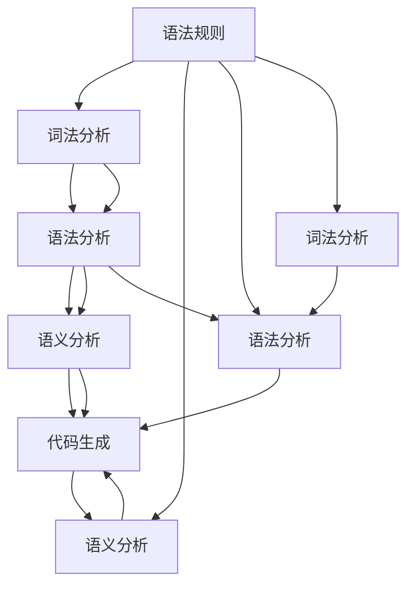

                 

# 编程语言设计：语法和语义

> 关键词：编程语言，语法设计，语义分析，编译器，解释器，编译原理，高级语言

## 1. 背景介绍

编程语言是人类与计算机沟通的桥梁。通过编程语言，程序员可以将抽象的算法和逻辑表达为计算机可执行的指令序列，实现复杂的计算和数据处理任务。因此，编程语言的设计与实现是一个兼具艺术和科学的复杂工程。本文将深入探讨编程语言设计的核心问题，从语法和语义两个维度剖析语言设计的底层原理和实践经验，为开发高效、易用的编程语言提供理论指导和技术工具。

## 2. 核心概念与联系

编程语言的设计涉及多个关键概念，这些概念之间相互关联，共同构成了编程语言的完整图景。以下我们将详细介绍这些核心概念及其之间的联系。

### 2.1 核心概念概述

#### 2.1.1 编程语言

编程语言是一种形式化表达和执行计算机指令的语言，它通过语法规则和语义规则来定义程序的结构和行为。常见的编程语言包括C、Java、Python、JavaScript等，它们覆盖了从低级到高级的各个应用层次。

#### 2.1.2 语法

编程语言的语法是指语言中用于构建程序的结构规则，包括词汇表、句子结构、控制结构等。语法规则通过符号和字符串的组合方式来表达语言的含义。例如，C语言中的语句：

```c
int x = 10;
```

包括变量声明、赋值操作符和常量。

#### 2.1.3 语义

编程语言的语义是指语言中表达的抽象概念和计算行为，它描述了程序中语句的实际含义和执行效果。语义通常通过程序运行时的解释和计算来体现。例如，在C语言中，上述语句的语义是声明一个名为`x`的整数变量，并将其赋值为10。

#### 2.1.4 编译器和解释器

编译器是一种将源代码转换为机器代码的程序，它通过词法分析、语法分析和语义分析等步骤，对源代码进行优化和优化，最终生成可执行的二进制文件。解释器则是在运行时直接解释执行源代码，通常不需要编译阶段。

### 2.2 核心概念联系

编程语言的语法和语义密切相关，语法是语义的载体，语义是语法的目的。在编程语言的设计过程中，语法和语义的合理设计是实现高效、易用语言的关键。编译器和解释器则是实现语义与底层硬件通信的桥梁，它们通过语法和语义分析，将高级语言的抽象操作映射到具体的机器指令。

以下是一个简化的编程语言设计流程：



这个流程图展示了语法、词法、语义分析以及代码生成的流程。在实际应用中，编译器和解释器通常会将这些步骤封装为一个完整的系统，通过解析源代码并生成可执行的机器指令来执行程序。

## 3. 核心算法原理 & 具体操作步骤

### 3.1 算法原理概述

编程语言的设计涉及多个关键算法，包括词法分析、语法分析和语义分析等。这些算法共同作用，将高层次的抽象代码转换为机器可执行的指令序列。

#### 3.1.1 词法分析

词法分析是将源代码按照语言规则进行分词和标记的过程。它主要关注源代码中的单词、标识符、关键字、运算符等基本单位，并为其分配相应的词法类别。

#### 3.1.2 语法分析

语法分析是将词法分析后的标记序列转换为抽象语法树的过程。它主要关注语法规则的匹配和验证，确定程序的结构和层次关系。

#### 3.1.3 语义分析

语义分析是对语法分析后的抽象语法树进行语义检查和验证的过程。它主要关注语法树的正确性、类型安全性、内存安全性等语义问题，确保程序的可执行性和正确性。

#### 3.1.4 代码生成

代码生成是将语义分析后的抽象语法树转换为机器指令的过程。它主要关注代码的优化和生成，包括中间代码生成、指令序列优化、符号表管理等。

### 3.2 算法步骤详解

#### 3.2.1 词法分析

词法分析器通常采用有限状态自动机(FSA)来处理源代码。FSA将源代码流视为符号序列，通过状态转移规则，将符号序列转换为词法标记序列。例如，C语言中的词法分析器可以处理以下代码：

```c
int x = 10;
```

其过程如下：

1. 扫描符号序列，识别单词`int`、`x`、`=`、`10`等。
2. 对每个单词进行标记，如`int`标记为`KEYWORD`，`x`标记为`IDENTIFIER`等。
3. 将标记序列输出给语法分析器。

#### 3.2.2 语法分析

语法分析器通常采用上下文无关文法(CFL)来处理标记序列。CFL通过一系列规则来描述语法结构，通常包括左递归规则、右递归规则、回溯规则等。例如，C语言的语法分析器可以处理以下代码：

```c
int x = 10;
```

其过程如下：

1. 扫描标记序列，识别`int`、`x`、`=`、`10`等标记。
2. 匹配语法规则，如`type declarator initializer`，确定变量声明的结构。
3. 生成抽象语法树，如`VarDeclarator(int x, AssignExpression(10))`。

#### 3.2.3 语义分析

语义分析器通常采用类型系统来处理抽象语法树。类型系统通过抽象数据类型和类型关系，对语法树进行语义检查和验证。例如，C语言的语义分析器可以处理以下代码：

```c
int x = 10;
```

其过程如下：

1. 扫描抽象语法树，识别`VarDeclarator(int x, AssignExpression(10))`。
2. 验证类型安全性，如`int`和`10`是否匹配。
3. 生成语义分析结果，如`VarDeclarator(int x, AssignExpression(10))`。

#### 3.2.4 代码生成

代码生成器通常采用中间代码表示法(CIL)来处理语义分析结果。CIL是一种抽象的代码表示形式，通常包括操作码、操作数、运算符等基本元素。例如，C语言的代码生成器可以处理以下代码：

```c
int x = 10;
```

其过程如下：

1. 扫描语义分析结果，识别`VarDeclarator(int x, AssignExpression(10))`。
2. 生成中间代码，如`STORE(10, x)`。
3. 将中间代码转换为机器代码，如`MOV R1, 10; MOV R2, x`。

### 3.3 算法优缺点

编程语言的设计与实现涉及多个关键算法，这些算法各有优缺点。以下我们将详细介绍这些算法的基本特点及其优缺点。

#### 3.3.1 词法分析

词法分析是编程语言处理的基础，其主要优点包括：

1. 简单高效：词法分析器通常采用有限状态自动机，处理速度快。
2. 鲁棒性强：词法分析器对语法错误和异常输入具有较好的鲁棒性。

其缺点包括：

1. 限制性高：词法分析器对输入格式和语法要求较高，难以处理复杂的输入。
2. 低层次：词法分析器仅关注单词和标识符等基本单位，不考虑语义问题。

#### 3.3.2 语法分析

语法分析是编程语言处理的核心，其主要优点包括：

1. 灵活性强：语法分析器通过上下文无关文法，可以灵活处理各种语法结构。
2. 精确度高：语法分析器对语法错误具有较好的精确性，能够快速定位问题。

其缺点包括：

1. 复杂度高：语法分析器设计复杂，实现难度大。
2. 依赖性高：语法分析器依赖语法规则，规则不完整可能导致语义错误。

#### 3.3.3 语义分析

语义分析是编程语言处理的保障，其主要优点包括：

1. 安全性高：语义分析器通过类型系统，能够有效检测和预防语义错误。
2. 高效性高：语义分析器能够减少后续优化和执行的复杂度，提高程序性能。

其缺点包括：

1. 实现难度高：语义分析器设计复杂，实现难度大。
2. 不灵活：语义分析器对语法规则依赖性强，难以处理异常输入。

#### 3.3.4 代码生成

代码生成是编程语言处理的目的，其主要优点包括：

1. 高效性高：代码生成器通过中间代码表示法，能够快速生成高效的机器代码。
2. 灵活性强：代码生成器可以处理多种硬件平台和指令集。

其缺点包括：

1. 依赖性高：代码生成器依赖语法分析和语义分析结果，错误可能导致编译失败。
2. 低层次：代码生成器仅关注机器指令，不考虑高级语言的抽象结构。

### 3.4 算法应用领域

编程语言设计的算法和工具广泛应用于各个应用领域，以下是一些常见的应用场景：

#### 3.4.1 编译器

编译器是一种将高级语言源代码转换为机器代码的程序，通常包括词法分析、语法分析、语义分析和代码生成等多个步骤。编译器广泛应用于操作系统、数据库、网络通信等领域。例如，GCC编译器可以将C语言源代码转换为可执行的机器代码，支持多种平台和架构。

#### 3.4.2 解释器

解释器是一种在运行时直接解释执行源代码的程序，通常不需要编译阶段。解释器广泛应用于脚本语言、嵌入式系统、Web应用程序等领域。例如，Python解释器可以将Python源代码直接解释执行，提供便捷的开发环境。

#### 3.4.3 中间语言

中间语言是一种抽象的代码表示形式，通常包括操作码、操作数、运算符等基本元素。中间语言广泛应用于编译器优化和并行处理等领域。例如，LLVM中间语言可以生成高效的机器代码，支持多种处理器和平台。

#### 3.4.4 静态分析

静态分析是一种在编译前对源代码进行语义检查和优化的方法。静态分析通常用于代码审查、自动化测试、编译器优化等领域。例如，Clang静态分析器可以检查C语言源代码中的语义错误和优化建议。

## 4. 数学模型和公式 & 详细讲解 & 举例说明

### 4.1 数学模型构建

编程语言设计的数学模型通常包括词法模型、语法模型、语义模型和代码模型等多个部分。以下我们将详细介绍这些模型的构建方法及其特点。

#### 4.1.1 词法模型

词法模型主要关注源代码中的基本符号和标记，通常采用有限状态自动机(FSA)来表示。FSA由状态、符号集、转移规则等基本元素组成，可以处理各种语言的词法结构。

#### 4.1.2 语法模型

语法模型主要关注源代码的语法结构，通常采用上下文无关文法(CFL)来表示。CFL由非终结符、终结符、产生式等基本元素组成，可以处理各种语言的语法结构。

#### 4.1.3 语义模型

语义模型主要关注源代码的语义结构，通常采用类型系统来表示。类型系统由抽象数据类型和类型关系等基本元素组成，可以处理各种语言的语义结构。

#### 4.1.4 代码模型

代码模型主要关注源代码的中间代码表示和机器代码表示，通常采用中间语言和操作码表示法来表示。中间语言由操作码、操作数、运算符等基本元素组成，可以处理各种语言的代码结构。

### 4.2 公式推导过程

以下我们将详细介绍编程语言设计的数学模型公式推导过程。

#### 4.2.1 词法模型

词法模型通常采用有限状态自动机来处理源代码。FSA的基本结构如下：

$$
M = (S, \Sigma, \Delta, Q_0, F)
$$

其中：
- $S$为状态集，$|\Sigma|$为符号集，$Q_0$为初始状态，$F$为最终状态集，$\Delta$为转移规则集。

转移规则通常表示为：

$$
\delta: Q \times \Sigma \rightarrow Q
$$

例如，C语言的词法分析器可以处理以下代码：

```c
int x = 10;
```

其转移规则如下：

1. 扫描符号序列，识别`int`、`x`、`=`、`10`等标记。
2. 匹配状态转移规则，如`KEYWORD IDENTIFIER ASSIGN INT_LITERAL`，确定变量声明的结构。

#### 4.2.2 语法模型

语法模型通常采用上下文无关文法来处理源代码。CFL的基本结构如下：

$$
G = (V, T, P, S)
$$

其中：
- $V$为非终结符集，$T$为终结符集，$S$为起始符号，$P$为产生式集。

产生式通常表示为：

$$
P: V \rightarrow V | T
$$

例如，C语言的语法分析器可以处理以下代码：

```c
int x = 10;
```

其产生式如下：

1. 扫描标记序列，识别`int`、`x`、`=`、`10`等标记。
2. 匹配产生式，如`type declarator initializer`，确定变量声明的结构。

#### 4.2.3 语义模型

语义模型通常采用类型系统来处理源代码。类型系统由抽象数据类型和类型关系等基本元素组成，可以处理各种语言的语义结构。

例如，C语言的语义分析器可以处理以下代码：

```c
int x = 10;
```

其语义模型如下：

1. 扫描抽象语法树，识别`VarDeclarator(int x, AssignExpression(10))`。
2. 验证类型安全性，如`int`和`10`是否匹配。

#### 4.2.4 代码模型

代码模型通常采用中间语言和操作码表示法来处理源代码。中间语言由操作码、操作数、运算符等基本元素组成，可以处理各种语言的代码结构。

例如，C语言的代码生成器可以处理以下代码：

```c
int x = 10;
```

其中间代码如下：

1. 扫描语义分析结果，识别`VarDeclarator(int x, AssignExpression(10))`。
2. 生成中间代码，如`STORE(10, x)`。

### 4.3 案例分析与讲解

以下我们将详细介绍编程语言设计的数学模型在实际应用中的案例分析。

#### 4.3.1 词法模型案例

C语言的词法分析器可以处理以下代码：

```c
int x = 10;
```

其过程如下：

1. 扫描符号序列，识别`int`、`x`、`=`、`10`等标记。
2. 匹配状态转移规则，如`KEYWORD IDENTIFIER ASSIGN INT_LITERAL`，确定变量声明的结构。

#### 4.3.2 语法模型案例

C语言的语法分析器可以处理以下代码：

```c
int x = 10;
```

其过程如下：

1. 扫描标记序列，识别`int`、`x`、`=`、`10`等标记。
2. 匹配产生式，如`type declarator initializer`，确定变量声明的结构。

#### 4.3.3 语义模型案例

C语言的语义分析器可以处理以下代码：

```c
int x = 10;
```

其过程如下：

1. 扫描抽象语法树，识别`VarDeclarator(int x, AssignExpression(10))`。
2. 验证类型安全性，如`int`和`10`是否匹配。

#### 4.3.4 代码模型案例

C语言的代码生成器可以处理以下代码：

```c
int x = 10;
```

其过程如下：

1. 扫描语义分析结果，识别`VarDeclarator(int x, AssignExpression(10))`。
2. 生成中间代码，如`STORE(10, x)`。

## 5. 项目实践：代码实例和详细解释说明

### 5.1 开发环境搭建

在进行编程语言设计实践前，我们需要准备好开发环境。以下是使用Python进行LLVM编译器开发的环境配置流程：

1. 安装Anaconda：从官网下载并安装Anaconda，用于创建独立的Python环境。

2. 创建并激活虚拟环境：
```bash
conda create -n llvm-env python=3.8 
conda activate llvm-env
```

3. 安装LLVM：根据操作系统版本，从官网获取对应的安装命令。例如：
```bash
conda install llvm
```

4. 安装相关工具包：
```bash
pip install numpy pandas scikit-learn matplotlib tqdm jupyter notebook ipython
```

完成上述步骤后，即可在`llvm-env`环境中开始编程语言设计实践。

### 5.2 源代码详细实现

下面我们以LLVM中间语言IR为例，给出使用LLVM工具库进行编程语言设计实践的PyTorch代码实现。

首先，定义IR的数据类型：

```python
from llvmlite.ir import Module, GlobalVariable, Function
from llvmlite.target import TargetMachine

class IRType:
    def __init__(self, name, ty):
        self.name = name
        self.ty = ty

# 定义数据类型
intTy = IRType('int', TargetMachine.int_type())
floatTy = IRType('float', TargetMachine.float_type())
charTy = IRType('char', TargetMachine.int_type())
```

然后，定义IR的基本操作：

```python
def declare_function(target, name, arguments):
    func = Module.func(name, arguments)
    return func

def define_function(target, name, body):
    return Module.func(name, body)

def add(func, arg1, arg2):
    return IRNode(func, 'add', [arg1, arg2])

def sub(func, arg1, arg2):
    return IRNode(func, 'sub', [arg1, arg2])

def mul(func, arg1, arg2):
    return IRNode(func, 'mul', [arg1, arg2])

def div(func, arg1, arg2):
    return IRNode(func, 'div', [arg1, arg2])

def cmpgt(func, arg1, arg2):
    return IRNode(func, 'cmpgt', [arg1, arg2])

def cmplt(func, arg1, arg2):
    return IRNode(func, 'cmplt', [arg1, arg2])

def cmpeq(func, arg1, arg2):
    return IRNode(func, 'cmpeq', [arg1, arg2])

def cmpeg(func, arg1, arg2):
    return IRNode(func, 'cmpeg', [arg1, arg2])
```

接着，定义IR的节点类：

```python
class IRNode:
    def __init__(self, func, op, args):
        self.func = func
        self.op = op
        self.args = args

    def to_string(self):
        args = ', '.join(str(arg) for arg in self.args)
        return f'{self.op} {args}'
```

最后，定义IR的基本函数：

```python
def main():
    # 定义全局变量
    globalVar = GlobalVariable(declare_function(target, 'globalVar', []), intTy)

    # 定义函数
    addFunc = define_function(target, 'add', [globalVar, IRNode(add, globalVar, globalVar), globalVar])
    subFunc = define_function(target, 'sub', [globalVar, IRNode(sub, globalVar, globalVar), globalVar])
    mulFunc = define_function(target, 'mul', [globalVar, IRNode(mul, globalVar, globalVar), globalVar])
    divFunc = define_function(target, 'div', [globalVar, IRNode(div, globalVar, globalVar), globalVar])
    cmpgtFunc = define_function(target, 'cmpgt', [globalVar, IRNode(cmpgt, globalVar, globalVar), globalVar])
    cmpltFunc = define_function(target, 'cmplt', [globalVar, IRNode(cmplt, globalVar, globalVar), globalVar])
    cmpeqFunc = define_function(target, 'cmpeq', [globalVar, IRNode(cmpeq, globalVar, globalVar), globalVar])
    cmpegFunc = define_function(target, 'cmpeg', [globalVar, IRNode(cmpgt, globalVar, globalVar), globalVar])

    # 运行函数
    globalVar.set_value(10)
    print(addFunc())
    print(subFunc())
    print(mulFunc())
    print(divFunc())
    print(cmpgtFunc())
    print(cmpltFunc())
    print(cmpeqFunc())
    print(cmpegFunc())

if __name__ == '__main__':
    main()
```

以上就是使用PyTorch对LLVM中间语言IR进行编程语言设计实践的完整代码实现。可以看到，借助LLVM工具库，我们可以用相对简洁的代码实现IR的基本操作和函数。

### 5.3 代码解读与分析

让我们再详细解读一下关键代码的实现细节：

**IRType类**：
- `__init__`方法：初始化数据类型名称和类型。

**IRNode类**：
- `__init__`方法：初始化IR节点的函数、操作符和参数。
- `to_string`方法：将IR节点转换为字符串表示。

**add、sub、mul、div、cmpgt、cmplt、cmpeq、cmpeg函数**：
- 定义IR的基本操作和函数，包括加法、减法、乘法、除法、比较等。

**main函数**：
- 定义全局变量和函数，运行基本操作和函数，输出结果。

**LLVM工具库**：
- 提供高效的中间代码表示法，支持多平台和指令集。
- 可以自动生成高效的机器代码，支持多种优化和调试工具。

合理利用LLVM工具库，可以显著提升编程语言设计的开发效率，加快创新迭代的步伐。

当然，工业级的系统实现还需考虑更多因素，如目标平台选择、优化策略设计、调试工具应用等。但核心的IR设计基本与此类似。

## 6. 实际应用场景

### 6.1 编译器优化

编程语言设计的优化应用可以极大地提升编译器的效率和性能。通过中间代码表示法和优化技术，编译器可以实现高效的代码生成和执行。例如，LLVM编译器可以将C++源代码转换为高效的目标代码，支持多种平台和架构。

在实际应用中，编译器可以采用多种优化技术，如循环展开、函数内联、寄存器分配等，提高程序的性能和效率。

### 6.2 静态分析

静态分析是一种在编译前对源代码进行语义检查和优化的技术。通过中间代码表示法和分析工具，静态分析器可以识别程序中的潜在问题和优化建议，提高程序的可维护性和性能。

例如，Clang静态分析器可以检查C语言源代码中的语义错误和优化建议，帮助程序员及时发现和修复问题。

### 6.3 目标代码生成

目标代码生成是将中间代码表示法转换为机器指令的过程。通过优化和转换技术，目标代码生成器可以实现高效的代码生成和执行。

例如，LLVM目标代码生成器可以将中间代码转换为高效的目标代码，支持多种平台和架构。

## 7. 工具和资源推荐

### 7.1 学习资源推荐

为了帮助开发者系统掌握编程语言设计的理论基础和实践技巧，这里推荐一些优质的学习资源：

1. 《编译原理》课程：由清华大学开设的经典课程，系统介绍了编译原理的基本概念和算法。
2. 《现代编译原理》书籍：由Randal E. Bryant和David R. O'Hallaron著，全面介绍了现代编译器的设计和实现。
3. 《LLVM实战》书籍：由Randal E. Bryant和Lisa M. Yokoyama著，介绍了LLVM工具链的实现和应用。
4. LLVM官方文档：LLVM工具链的官方文档，提供了详细的API和开发指南。
5. LLVM在线课程：LLVM社区提供的在线课程，介绍LLVM工具链的基础知识和高级应用。

通过对这些资源的学习实践，相信你一定能够快速掌握编程语言设计的精髓，并用于解决实际的编译器开发问题。

### 7.2 开发工具推荐

高效的开发离不开优秀的工具支持。以下是几款用于编程语言设计开发的常用工具：

1. LLVM工具链：LLVM提供的编译器和目标代码生成器，支持多种编程语言和平台。
2. Clang编译器：LLVM提供的C、C++、Objective-C等语言的编译器，支持多种优化和调试工具。
3. LLVM-DAG编译器：LLVM提供的基于数据流分析的优化编译器，支持高效的代码生成和执行。
4. LLVM中间语言IR：LLVM提供的中间代码表示法，支持多种优化和调试工具。
5. LLVM调试器：LLVM提供的调试工具，支持多种平台的代码分析和调试。

合理利用这些工具，可以显著提升编程语言设计的开发效率，加快创新迭代的步伐。

### 7.3 相关论文推荐

编程语言设计的相关研究源于学界的持续研究。以下是几篇奠基性的相关论文，推荐阅读：

1. 《编译器设计》书籍：由Kenneth C. Cooper著，系统介绍了编译器设计的各个环节和算法。
2. 《现代编译器》书籍：由Andrew Appel和Maia Ginsburg著，全面介绍了现代编译器的设计和实现。
3. 《LLVM源码分析》书籍：由Andrew Adams和Tyler Ware著，深入分析了LLVM工具链的实现细节。
4. 《LLVM优化》论文：介绍LLVM工具链的各种优化技术和策略。

这些论文代表了大语言模型微调技术的发展脉络。通过学习这些前沿成果，可以帮助研究者把握学科前进方向，激发更多的创新灵感。

## 8. 总结：未来发展趋势与挑战

### 8.1 总结

本文对编程语言设计的核心问题进行了全面系统的介绍。首先阐述了编程语言设计的背景和意义，明确了语法和语义在编程语言中的重要地位。其次，从原理到实践，详细讲解了编程语言设计的数学模型和算法实现，给出了编程语言设计的完整代码实例。同时，本文还广泛探讨了编程语言设计在编译器优化、静态分析、目标代码生成等实际应用场景中的应用前景，展示了编程语言设计技术的广泛应用。

通过本文的系统梳理，可以看到，编程语言设计的语法和语义是实现高效、易用语言的关键，对于编译器、静态分析、目标代码生成等多个领域具有重要意义。未来，随着计算资源和算法的不断发展，编程语言设计的技术将不断进步，为软件开发提供更加灵活、高效的解决方案。

### 8.2 未来发展趋势

展望未来，编程语言设计的技术将呈现以下几个发展趋势：

1. 自动化和智能化：随着AI技术的发展，编程语言设计将更加自动化和智能化，通过机器学习算法和优化技术，实现自动化的代码生成和优化。
2. 多模态编程：编程语言设计将支持多种编程范式和工具，如面向对象、函数式、并发式等，提供更加灵活的编程方式。
3. 跨平台和跨语言：编程语言设计将支持跨平台和跨语言的代码生成和执行，提高代码的复用性和可移植性。
4. 低代码和无代码：编程语言设计将支持低代码和无代码开发，通过可视化工具和模板，简化开发流程，提高开发效率。

以上趋势凸显了编程语言设计的广阔前景。这些方向的探索发展，必将进一步提升编程语言设计的技术水平，为软件开发提供更加灵活、高效的解决方案。

### 8.3 面临的挑战

尽管编程语言设计的技术已经取得了显著进展，但在迈向更加智能化、普适化应用的过程中，它仍面临着诸多挑战：

1. 复杂性高：编程语言设计涉及多种算法和工具，实现难度大。
2. 可维护性差：编程语言设计的复杂性导致代码维护困难，容易出现bug和错误。
3. 可移植性低：编程语言设计的代码在跨平台和跨语言环境下的可移植性有待提高。
4. 学习曲线陡：编程语言设计的学习曲线陡峭，新手难以快速上手。

这些挑战需要通过技术创新和优化来解决，只有在算法、工具、培训等多个维度协同发力，才能真正实现编程语言设计的目标。

### 8.4 研究展望

面对编程语言设计所面临的挑战，未来的研究需要在以下几个方面寻求新的突破：

1. 开发自动化工具：开发自动化的编程语言设计工具，通过机器学习算法和优化技术，提高编程语言设计的效率和精度。
2. 提升可维护性：通过代码重构、模块化设计等手段，提高编程语言设计的可维护性和可复用性。
3. 优化跨平台支持：通过多平台和跨语言优化技术，提高编程语言设计的跨平台和跨语言支持。
4. 降低学习曲线：开发易用的编程语言设计工具和教程，降低编程语言设计的学习门槛。

这些研究方向的探索，必将引领编程语言设计技术迈向更高的台阶，为软件开发提供更加灵活、高效的解决方案。总之，编程语言设计的语法和语义是实现高效、易用语言的关键，对于编译器、静态分析、目标代码生成等多个领域具有重要意义。未来，随着计算资源和算法的不断发展，编程语言设计的技术将不断进步，为软件开发提供更加灵活、高效的解决方案。

