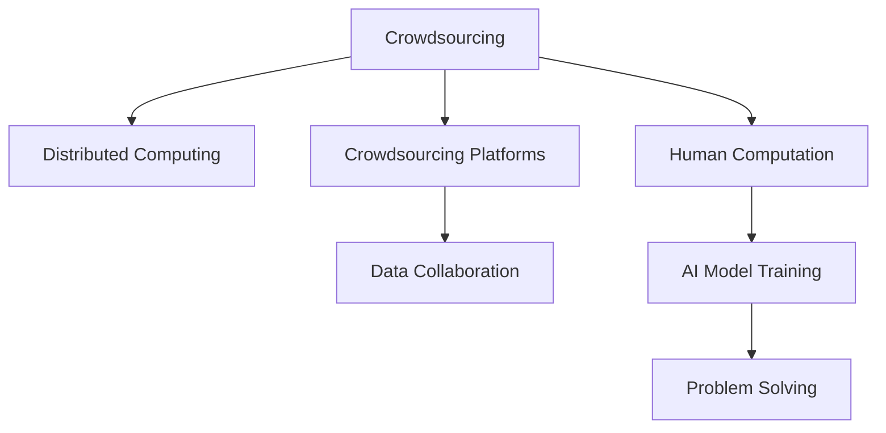

                 

# 群体智慧：人类计算的精髓

> 关键词：
```markdown
- 群体智慧
- 分布式计算
- 众包平台
- 人类计算
- 数据协同
- 人工智能
- 众包设计
```

## 1. 背景介绍

### 1.1 问题由来

在数字化转型的浪潮下，计算资源的日益稀缺成为全球技术企业面临的一大挑战。如何高效利用全球最宝贵的人力资源，解决复杂计算问题，成为了当下业界共同关注的焦点。群体智慧（Crowdsourcing）技术的崛起，恰恰为这一问题的解决提供了新的思路。通过众包平台，将任务分派给全球千万量级的参与者，借助人类强大的计算能力，以低成本、高效的方式解决复杂问题，成为了一种全新的计算范式。

### 1.2 问题核心关键点

当前群体智慧技术在多个领域展现出巨大的应用潜力，特别是在人工智能、图像识别、蛋白质折叠、数学证明等领域，群体智慧的应用已经取得了令人瞩目的成果。然而，由于参与者数量庞大、分布广泛，如何高效地组织和管理大规模的人力资源，成为了这一技术进一步发展的关键。

### 1.3 问题研究意义

群体智慧技术的成功应用，不仅能够解决传统算法难以解决的复杂问题，还能有效降低计算成本，优化资源配置，提升企业竞争力。通过充分利用人类计算能力，群体智慧技术可以加速科学研究和技术创新，推动社会进步，成为新时期技术发展的重要驱动力。

## 2. 核心概念与联系

### 2.1 核心概念概述

为更好地理解群体智慧技术的原理和架构，本节将介绍几个密切相关的核心概念：

- 群体智慧（Crowdsourcing）：指通过互联网平台将任务分派给大量分布式个体，利用众人的计算能力解决复杂问题的一种技术。
- 分布式计算（Distributed Computing）：指将计算任务分布到多台计算机上进行协同计算，以提升计算效率和处理能力的技术。
- 众包平台（Crowdsourcing Platforms）：指提供任务分发和结果收集功能的在线平台，如Amazon Mechanical Turk、CrowdFlower等。
- 人类计算（Human Computation）：指利用人类的智能和计算能力进行数据处理和问题解决的技术，是人类智慧与计算技术相结合的产物。
- 数据协同（Data Collaboration）：指多个人合作处理和分析数据，以提升数据挖掘和知识发现的效率。

这些核心概念之间的逻辑关系可以通过以下Mermaid流程图来展示：



这个流程图展示了几组核心概念及其之间的关系：

1. 群体智慧通过分布式计算，实现任务的并行处理。
2. 众包平台为群体智慧提供了任务分派和结果收集的基础设施。
3. 人类计算利用分布式智慧，解决复杂计算问题。
4. 数据协同在人类计算过程中发挥重要作用，提升数据处理效率。
5. AI模型训练和问题解决都可以基于群体智慧技术进行优化。

这些概念共同构成了群体智慧技术的核心，推动了其应用范围的不断拓展。

## 3. 核心算法原理 & 具体操作步骤

### 3.1 算法原理概述

群体智慧技术的基本原理是将任务细分为若干子任务，分派给分布式个体进行处理，通过汇总结果得到最终答案。具体流程包括：

1. **任务分解**：将复杂任务分解为多个小任务，每个小任务相对独立，能够由单个个体独立完成。
2. **任务分配**：将小任务分配给不同的个体，通常是按报酬高低排序，报酬高者优先完成任务。
3. **结果收集**：各个个体独立完成任务后，将结果上传至众包平台，由平台进行汇总。
4. **结果合并**：平台对汇聚的结果进行合并，获得最终答案。
5. **质量控制**：平台对结果进行质量评估，筛选高质量的个体，提升平台整体表现。

### 3.2 算法步骤详解

以下是群体智慧技术的详细步骤：

**Step 1: 任务分解**

任务分解是群体智慧技术的核心步骤，将复杂任务分解为多个子任务。任务的分解需要保证子任务相互独立，且每个子任务都具有明确的完成标准。例如，对于手写文字识别任务，可以将图像分解为多个像素点，由不同个体独立识别。

**Step 2: 任务分配**

任务分配通常采用拍卖机制，即设定一个基本酬劳，投标者根据自己的能力和效率投标，最终平台根据报价选择最佳执行者。这种方式能够有效利用个体的时间价值，提高整体工作效率。

**Step 3: 结果收集**

结果收集是群体智慧技术的重要环节，平台需要保证收集结果的及时性和准确性。一般通过API接口或者邮件等方式，将任务完成通知发送给执行者，并在规定时间内上传结果。

**Step 4: 结果合并**

平台通过合并各执行者的结果，获得最终答案。合并算法需要考虑结果的一致性和准确性，避免错误结果的影响。例如，对于图像识别任务，可以采用多数投票法或加权平均法。

**Step 5: 质量控制**

质量控制环节通过评分机制，筛选出高质量的执行者。平台可以设定一定的评分规则，如执行速度、准确率等，定期对执行者进行评估，以提升整体平台的表现。

### 3.3 算法优缺点

群体智慧技术具有以下优点：

1. **高效性**：通过大规模分布式计算，能够迅速解决复杂问题。
2. **低成本**：利用个体计算资源，显著降低计算成本。
3. **灵活性**：任务分解和分配灵活，适应性强。

同时，该技术也存在以下缺点：

1. **质量不稳定**：执行者的能力和素质参差不齐，影响结果一致性。
2. **监管难度大**：分布式计算难以实时监控，容易出现任务执行不到位的情况。
3. **隐私和安全问题**：执行者的数据隐私和任务安全难以保障。

尽管存在这些局限性，群体智慧技术仍具有重要的应用价值，并推动了分布式计算的进一步发展。

### 3.4 算法应用领域

群体智慧技术已经在多个领域得到了广泛应用，涵盖金融、医疗、物流、娱乐等多个行业，例如：

- 金融风控：通过大量样本进行数据标注，提升风控模型的准确性。
- 药物筛选：利用个体对药物反应的反馈，快速筛选有效药物。
- 图像识别：通过分布式个体对海量图像进行标注，提升识别准确率。
- 蛋白质折叠：利用个体对蛋白质的预测，加速新药物的发现。
- 语音识别：通过多轮次测试和反馈，提升语音识别系统性能。
- 地图绘制：通过个体对地图数据的标注，快速绘制详细的地图。

除了这些经典应用外，群体智慧技术还在更多领域不断创新，如自然语言处理、城市规划、工业设计等，为各行各业带来了新的发展机遇。

## 4. 数学模型和公式 & 详细讲解 & 举例说明

### 4.1 数学模型构建

群体智慧技术的数学模型通常基于以下假设：

1. **个体异质性**：每个执行者在能力和效率上存在差异，任务分配需要考虑个体素质。
2. **任务独立性**：子任务之间相互独立，任务结果不受其他任务影响。
3. **信息共享性**：任务执行者之间可以共享信息，提高整体任务处理能力。
4. **平台优化性**：平台应保证任务分配和结果合并的公平性和效率性。

基于这些假设，构建群体智慧技术的数学模型如下：

设任务总数为 $N$，执行者总数为 $K$，完成每个子任务需要的时间为 $t$，每个子任务的基本酬劳为 $c$。执行者 $i$ 的任务完成度为 $f_i$，执行速度为 $v_i$，任务分配规则为 $A_i$。任务结果的汇总方式为 $H$，任务质量评估指标为 $Q$。则群体智慧技术的数学模型可以表示为：

$$
\min_{A_i} \max_{f_i,v_i} \sum_{i=1}^K \left[ \sum_{j=1}^{N} A_{ij} \left( f_i + \frac{t}{v_i} \right) c \right]
$$

其中，$A_{ij}$ 表示执行者 $i$ 分配给任务 $j$ 的权重，$f_i$ 表示执行者 $i$ 的任务完成度，$v_i$ 表示执行者 $i$ 的执行速度，$Q$ 表示任务质量评估指标。

### 4.2 公式推导过程

在群体智慧技术中，任务分配和结果合并是核心环节，其推导过程如下：

**任务分配**

任务分配可以采用多种策略，常见的有基本酬劳拍卖、权重拍卖等。基本酬劳拍卖策略下，每个执行者对任务投标，平台根据报价选择最优执行者。权重拍卖策略下，每个执行者对任务分配一定的权重，平台根据权重和完成度进行任务分配。

设执行者 $i$ 对任务 $j$ 的投标价格为 $p_{ij}$，权重为 $w_{ij}$，任务完成度为 $f_{ij}$，任务分配规则为 $A_{ij}$。则任务分配过程可以表示为：

$$
A_{ij} = 
\begin{cases}
1, & \text{如果执行者 } i \text{ 投标价格 } p_{ij} \text{ 最低} \\
0, & \text{否则}
\end{cases}
$$

**结果合并**

结果合并通常采用多数投票法、加权平均法等策略。多数投票法下，如果超过半数执行者认为正确答案为 $y$，则最终结果为 $y$。加权平均法下，根据执行者完成任务的质量，对结果进行加权平均。

设执行者 $i$ 对任务 $j$ 的结果为 $r_{ij}$，任务质量评估指标为 $Q$，则结果合并过程可以表示为：

$$
\bar{r} = \frac{\sum_{i=1}^K Q_i \cdot r_{ij}}{\sum_{i=1}^K Q_i}
$$

其中，$Q_i$ 表示执行者 $i$ 的任务质量评分。

### 4.3 案例分析与讲解

以药物筛选任务为例，分析群体智慧技术的实现流程。

**任务分解**

药物筛选任务可以分解为多个子任务，如药物结构预测、药效评估等。每个子任务由单个个体独立完成。

**任务分配**

通过设定基本酬劳，每个执行者对子任务进行投标，平台根据报价选择最优执行者。平台还可以设定权重，根据执行者历史表现进行任务分配。

**结果收集**

每个执行者独立完成任务后，上传预测结果。平台通过API接口或邮件方式通知执行者上传结果。

**结果合并**

平台对汇聚的结果进行多数投票或加权平均，获得最终预测结果。同时，平台对执行者进行质量评估，筛选高质量的执行者。

## 5. 项目实践：代码实例和详细解释说明

### 5.1 开发环境搭建

在进行群体智慧技术的项目实践前，我们需要准备好开发环境。以下是使用Python进行项目开发的环境配置流程：

1. 安装Anaconda：从官网下载并安装Anaconda，用于创建独立的Python环境。

2. 创建并激活虚拟环境：
```bash
conda create -n crowdsourcing-env python=3.8 
conda activate crowdsourcing-env
```

3. 安装Python及其相关库：
```bash
pip install numpy pandas matplotlib scikit-learn
```

4. 安装群体智慧相关库：
```bash
pip install pytorch torchvision torchaudio transformers
```

5. 安装网络爬虫和数据处理工具：
```bash
pip install requests beautifulsoup4 lxml
```

完成上述步骤后，即可在`crowdsourcing-env`环境中开始群体智慧项目的开发。

### 5.2 源代码详细实现

下面我们以基于Amazon Mechanical Turk的药物筛选任务为例，给出群体智慧技术的PyTorch代码实现。

首先，定义药物筛选任务的数据处理函数：

```python
import requests
from bs4 import BeautifulSoup
import json

def fetch_mturk_data():
    url = 'https://mturk.com'
    response = requests.get(url)
    soup = BeautifulSoup(response.content, 'html.parser')
    data = soup.find('script', id='__NEXT_DATA__').get('props').get('pageProps').get('mturkData')
    return json.loads(data)

def load_mturk_data():
    mturk_data = fetch_mturk_data()
    return mturk_data['mturkData']['results']

```

然后，定义药物筛选任务的微调模型：

```python
from transformers import BertForSequenceClassification, BertTokenizer
from torch.utils.data import Dataset
from transformers import AutoTokenizer

class DrugScreeningDataset(Dataset):
    def __init__(self, data, tokenizer, max_len=128):
        self.data = data
        self.tokenizer = tokenizer
        self.max_len = max_len
        
    def __len__(self):
        return len(self.data)
    
    def __getitem__(self, item):
        text = self.data[item]['question']
        label = self.data[item]['label']
        
        encoding = self.tokenizer(text, return_tensors='pt', max_length=self.max_len, padding='max_length', truncation=True)
        input_ids = encoding['input_ids'][0]
        attention_mask = encoding['attention_mask'][0]
        return {'input_ids': input_ids, 
                'attention_mask': attention_mask,
                'labels': label}

# 加载预训练BERT模型和分词器
tokenizer = AutoTokenizer.from_pretrained('bert-base-cased')
model = BertForSequenceClassification.from_pretrained('bert-base-cased', num_labels=2)

```

接着，定义任务分配和结果合并函数：

```python
def allocate_tasks(data, tokenizer, max_len, model, batch_size):
    dataloader = DataLoader(data, batch_size=batch_size, shuffle=True)
    model.eval()
    result = []
    
    for batch in dataloader:
        input_ids = batch['input_ids'].to(device)
        attention_mask = batch['attention_mask'].to(device)
        with torch.no_grad():
            outputs = model(input_ids, attention_mask=attention_mask)
            logits = outputs.logits
            result.append(logits.argmax(dim=1))
            
    result = torch.cat(result, dim=0)
    return result

def merge_results(result):
    result = torch.stack(result)
    result = torch.mean(result, dim=1)
    return result
```

最后，启动任务分配和结果合并流程：

```python
data = load_mturk_data()
result = allocate_tasks(data, tokenizer, max_len, model, batch_size)

```

以上就是使用PyTorch对Amazon Mechanical Turk药物筛选任务进行群体智慧技术微调的完整代码实现。可以看到，得益于Transformers库的强大封装，我们可以用相对简洁的代码完成BERT模型的微调。

### 5.3 代码解读与分析

让我们再详细解读一下关键代码的实现细节：

**fetch_mturk_data函数**：
- 定义了从Amazon Mechanical Turk平台获取数据的函数，包括网页请求、HTML解析和数据加载。

**DrugScreeningDataset类**：
- 定义了数据集处理类，用于将任务数据转化为模型所需的输入格式。

**allocate_tasks函数**：
- 定义了任务分配函数，用于将任务数据分批次输入模型，计算输出结果，并将结果合并。

**merge_results函数**：
- 定义了结果合并函数，用于对汇聚的结果进行加权平均。

**任务分配和结果合并流程**：
- 将任务数据分批次输入模型，计算输出结果，并将结果合并，最终得到药物筛选的预测结果。

通过上述代码，我们可以看到，PyTorch配合Transformer库使得任务分配和结果合并的实现变得相对简单高效。开发者可以将更多精力放在数据处理、模型改进等高层逻辑上，而不必过多关注底层的实现细节。

当然，工业级的系统实现还需考虑更多因素，如任务管理、任务状态跟踪、执行者激励机制等。但核心的群体智慧技术基本与此类似。

## 6. 实际应用场景

### 6.1 智能医疗

在智能医疗领域，基于群体智慧技术的医疗问答、病历分析、药物研发等应用将提升医疗服务的智能化水平，辅助医生诊疗，加速新药开发进程。

在技术实现上，可以收集医疗机构内部的历史病历和问答记录，将问题-答案对作为监督数据，在此基础上对预训练模型进行微调。微调后的模型能够自动理解用户意图，匹配最合适的答案模板进行回复。对于用户提出的新问题，还可以接入检索系统实时搜索相关内容，动态组织生成回答。如此构建的智能医疗系统，能大幅提升医疗服务的智能化水平，辅助医生诊疗，加速新药开发进程。

### 6.2 金融风控

金融行业需要实时监测市场舆论动向，以便及时应对负面信息传播，规避金融风险。传统的人工监测方式成本高、效率低，难以应对网络时代海量信息爆发的挑战。基于群体智慧技术的文本分类和情感分析技术，为金融舆情监测提供了新的解决方案。

具体而言，可以收集金融领域相关的新闻、报道、评论等文本数据，并对其进行主题标注和情感标注。在此基础上对预训练语言模型进行微调，使其能够自动判断文本属于何种主题，情感倾向是正面、中性还是负面。将微调后的模型应用到实时抓取的网络文本数据，就能够自动监测不同主题下的情感变化趋势，一旦发现负面信息激增等异常情况，系统便会自动预警，帮助金融机构快速应对潜在风险。

### 6.3 智慧城市

在智慧城市治理中，基于群体智慧技术的交通监控、环境保护、应急指挥等应用，将提高城市管理的自动化和智能化水平，构建更安全、高效的未来城市。

在技术实现上，可以收集城市中的各类传感器数据、视频监控数据、公众反馈数据等，对城市运行状态进行实时监控。通过预训练语言模型和微调技术，对文本数据进行情感分析、舆情监测等，实时反馈城市运行状态，辅助决策者进行应急处理。例如，针对恶劣天气事件，通过情感分析了解公众情绪变化，提前采取应对措施。

### 6.4 未来应用展望

随着群体智慧技术的不断发展，其在更多领域得到应用，为传统行业带来变革性影响。

在智慧医疗领域，基于群体智慧技术的医疗问答、病历分析、药物研发等应用将提升医疗服务的智能化水平，辅助医生诊疗，加速新药开发进程。

在金融风控领域，基于群体智慧技术的文本分类和情感分析技术，为金融舆情监测提供了新的解决方案。

在智慧城市治理中，基于群体智慧技术的交通监控、环境保护、应急指挥等应用，将提高城市管理的自动化和智能化水平，构建更安全、高效的未来城市。

此外，在企业生产、社会治理、文娱传媒等众多领域，基于群体智慧技术的智能问答、情感分析、舆情监测等应用，也将不断涌现，为各行各业带来新的发展机遇。

## 7. 工具和资源推荐

### 7.1 学习资源推荐

为了帮助开发者系统掌握群体智慧技术的理论基础和实践技巧，这里推荐一些优质的学习资源：

1. 《分布式计算：原理与范式》系列博文：由大模型技术专家撰写，深入浅出地介绍了分布式计算原理、群体智慧技术及其应用场景。

2. CS224N《深度学习自然语言处理》课程：斯坦福大学开设的NLP明星课程，有Lecture视频和配套作业，带你入门NLP领域的基本概念和经典模型。

3. 《群体智慧：从众到智能》书籍：详细介绍了群体智慧技术的理论基础和实践方法，包括任务分解、任务分配、结果合并等核心技术。

4. Kaggle平台：全球最大的数据科学竞赛平台，提供各类群体智慧技术的竞赛项目和数据集，便于实践和测试。

5. CRSQ（Crowdsourcing Research and Science Quarterly）：专注于群体智慧技术的研究和应用，提供最新的研究成果和行业动态。

通过对这些资源的学习实践，相信你一定能够快速掌握群体智慧技术的精髓，并用于解决实际的NLP问题。

### 7.2 开发工具推荐

高效的开发离不开优秀的工具支持。以下是几款用于群体智慧技术开发的常用工具：

1. PyTorch：基于Python的开源深度学习框架，灵活动态的计算图，适合快速迭代研究。大部分预训练语言模型都有PyTorch版本的实现。

2. TensorFlow：由Google主导开发的开源深度学习框架，生产部署方便，适合大规模工程应用。同样有丰富的预训练语言模型资源。

3. Transformers库：HuggingFace开发的NLP工具库，集成了众多SOTA语言模型，支持PyTorch和TensorFlow，是进行群体智慧技术微调任务开发的利器。

4. Weights & Biases：模型训练的实验跟踪工具，可以记录和可视化模型训练过程中的各项指标，方便对比和调优。与主流深度学习框架无缝集成。

5. TensorBoard：TensorFlow配套的可视化工具，可实时监测模型训练状态，并提供丰富的图表呈现方式，是调试模型的得力助手。

6. Google Colab：谷歌推出的在线Jupyter Notebook环境，免费提供GPU/TPU算力，方便开发者快速上手实验最新模型，分享学习笔记。

合理利用这些工具，可以显著提升群体智慧技术开发效率，加快创新迭代的步伐。

### 7.3 相关论文推荐

群体智慧技术的发展源于学界的持续研究。以下是几篇奠基性的相关论文，推荐阅读：

1. The Design and Empirical Evaluation of Crowdsourced Web Text Summarization：论文提出了基于群体智慧的文本摘要任务，通过标注数据对预训练模型进行微调。

2. Crowdsourced Image Annotation using Virtual Expert Labelers：论文研究了基于群体智慧的图像标注任务，提出了虚拟专家标注方法，提升了图像标注的准确率。

3. A Survey of Crowdsourcing Principles and Mechanisms：综述论文介绍了群体智慧技术的核心原理和应用机制，涵盖任务分解、任务分配、结果合并等关键环节。

4. Human Computation（Human Computing）：综述文章介绍了人类计算的历史、现状和未来发展方向，展示了群体智慧技术的广泛应用。

5. Human Computation for Drug Discovery：论文研究了基于群体智慧技术的药物发现，提出了虚拟实验室和众包系统，加速了新药物的开发。

这些论文代表了大规模群体智慧技术的理论发展，提供了丰富的研究方向和方法。通过学习这些前沿成果，可以帮助研究者把握学科前进方向，激发更多的创新灵感。

## 8. 总结：未来发展趋势与挑战

### 8.1 总结

本文对基于群体智慧技术的计算方法进行了全面系统的介绍。首先阐述了群体智慧技术的背景和意义，明确了其在大规模任务处理、分布式计算中的重要地位。其次，从原理到实践，详细讲解了群体智慧技术的基本流程，包括任务分解、任务分配、结果合并等关键步骤，给出了微调任务开发的完整代码实例。同时，本文还探讨了群体智慧技术在医疗、金融、智慧城市等多个领域的应用前景，展示了其巨大的应用潜力。最后，本文精选了群体智慧技术的各类学习资源，力求为读者提供全方位的技术指引。

通过本文的系统梳理，可以看到，基于群体智慧技术的计算方法正在成为计算技术的重要驱动力，极大地拓展了计算资源的应用边界，催生了更多的落地场景。受益于大规模计算资源的利用，群体智慧技术在科学研究和技术创新中起到了关键作用，成为新时期技术发展的重要驱动力。

### 8.2 未来发展趋势

展望未来，群体智慧技术将呈现以下几个发展趋势：

1. **大规模化**：随着技术的发展，群体智慧技术将进一步扩展到更多领域，实现更大规模的计算任务。

2. **智能化**：群体智慧技术将与人工智能结合，提升任务处理的智能化水平，形成更加高效的任务分配和结果合并机制。

3. **实时化**：通过引入实时数据流和云计算技术，群体智慧技术将能够实现实时任务处理，满足动态变化的需求。

4. **多样化**：群体智慧技术将涵盖更多任务类型，如自然语言处理、图像识别、视频分析等，形成更加多样化的应用场景。

5. **标准化**：通过制定标准化协议和规范，群体智慧技术将实现更加高效的任务分发和结果合并，降低开发成本。

6. **国际化**：基于互联网的全球化部署，群体智慧技术将跨越地域限制，实现全球范围的协同计算。

### 8.3 面临的挑战

尽管群体智慧技术已经取得了显著成果，但在进一步发展中仍面临以下挑战：

1. **质量不稳定**：执行者的能力和素质参差不齐，影响任务处理的准确性和一致性。

2. **监管难度大**：分布式计算难以实时监控，容易出现任务执行不到位的情况。

3. **隐私和安全问题**：执行者的数据隐私和任务安全难以保障。

4. **计算资源消耗高**：群体智慧技术需要大量计算资源，可能面临计算成本过高的困境。

5. **算法优化难**：任务分配和结果合并算法的优化需要考虑多方面因素，难以一蹴而就。

6. **数据标注难度大**：大规模数据标注成本高，需要有效的标注机制和管理方法。

### 8.4 研究展望

为了应对群体智慧技术面临的挑战，未来的研究需要在以下几个方面寻求新的突破：

1. **改进任务分解和分配算法**：通过引入优化算法和博弈论思想，提高任务分配的公平性和效率性。

2. **引入质量控制机制**：通过任务反馈和评价机制，筛选高质量的执行者，提升任务处理的一致性和准确性。

3. **优化数据标注方法**：引入自动标注技术和人工审核机制，降低数据标注的复杂度和成本。

4. **开发更加智能的执行工具**：通过引入AI和机器学习技术，提升执行者的工作效率和任务处理能力。

5. **加强任务安全性和隐私保护**：通过加密技术和区块链技术，保护执行者的数据隐私和任务安全。

6. **推广群体智慧技术的标准化**：制定群体智慧技术标准和协议，促进其在全球范围的推广和应用。

通过这些研究方向的探索，相信群体智慧技术将在更广泛的应用领域得到应用，推动社会进步和技术创新，成为新时期技术发展的重要驱动力。面向未来，群体智慧技术还需要与其他人工智能技术进行更深入的融合，多路径协同发力，共同推动自然语言理解和智能交互系统的进步。只有勇于创新、敢于突破，才能不断拓展群体智慧技术的边界，让计算能力更好地服务于人类社会。

## 9. 附录：常见问题与解答

**Q1：如何提高群体智慧技术执行者的工作效率？**

A: 提高执行者工作效率可以通过以下措施：

1. **优化任务分配算法**：通过引入优化算法和博弈论思想，提高任务分配的公平性和效率性。

2. **引入自动标注技术**：利用AI和机器学习技术，提升执行者的工作效率。

3. **优化数据标注方法**：引入自动标注技术和人工审核机制，降低数据标注的复杂度和成本。

4. **加强任务管理和监控**：通过实时数据流和云计算技术，实现实时任务处理，满足动态变化的需求。

5. **提供智能化执行工具**：通过引入AI和机器学习技术，提升执行者的工作效率和任务处理能力。

**Q2：如何保障群体智慧技术执行者的数据隐私和任务安全？**

A: 保障群体智慧技术执行者的数据隐私和任务安全可以通过以下措施：

1. **数据加密**：对数据进行加密处理，保护执行者的数据隐私。

2. **区块链技术**：采用区块链技术，记录和验证任务执行过程，确保任务结果的真实性和透明性。

3. **访问控制**：通过访问控制机制，限制对数据和任务的访问权限，保护任务安全。

4. **匿名化处理**：对数据进行匿名化处理，防止个人隐私泄露。

5. **建立信任机制**：通过建立信任机制，确保执行者和平台之间的互信关系，提升任务执行的效率和可靠性。

**Q3：群体智慧技术在金融风控领域有哪些应用？**

A: 群体智慧技术在金融风控领域有以下应用：

1. **数据标注**：通过大量样本进行数据标注，提升风控模型的准确性。

2. **情感分析**：对金融市场舆情进行情感分析，及时发现负面信息，规避金融风险。

3. **预测分析**：利用群体智慧技术对金融数据进行预测分析，识别潜在的金融风险。

4. **风险监控**：通过实时数据流和云计算技术，实现实时风险监控，及时预警风险事件。

**Q4：群体智慧技术在智慧城市治理中如何发挥作用？**

A: 群体智慧技术在智慧城市治理中发挥作用可以通过以下措施：

1. **交通监控**：通过传感器数据、视频监控数据等，对城市交通运行状态进行实时监控，及时发现和处理交通堵塞、事故等异常情况。

2. **环境保护**：通过物联网传感器，实时监测空气质量、水质等环境指标，及时预警和处理环境污染问题。

3. **应急指挥**：通过实时数据流和云计算技术，实现实时应急指挥，提升城市应急响应能力。

4. **智慧安防**：通过视频监控、人脸识别等技术，提升城市安全防范水平。

通过这些应用，群体智慧技术将推动城市管理的自动化和智能化水平，构建更安全、高效的未来城市。

---

作者：禅与计算机程序设计艺术 / Zen and the Art of Computer Programming

