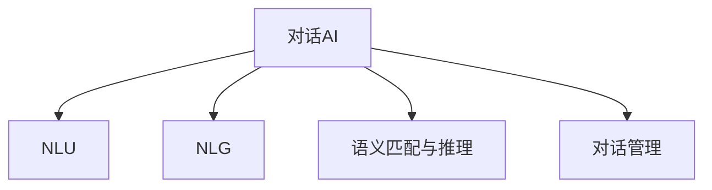

                 

## 1. 背景介绍

### 1.1 问题由来
随着人工智能技术的迅猛发展，对话AI（Chatbot）成为了人们日常生活和工作中不可或缺的智能助手。从简单的FAQ问答系统，到复杂的自然语言处理（NLP）模型，对话AI逐渐涵盖了从自动客服、智能助理到游戏对话机器人等广泛应用场景。然而，构建一个能够真正理解人类语言的智能聊天机器人，依然是一大挑战。

### 1.2 问题核心关键点
对话AI的开发涉及多种技术，包括自然语言理解（NLU）、自然语言生成（NLG）、语义匹配和推理等。其中，NLU技术尤其关键，决定了聊天机器人是否能准确理解和回应用户。传统的基于规则的对话系统和基于统计机器学习的对话系统各有优劣，但都存在难以解决的自然语言复杂性和上下文理解的难题。

### 1.3 问题研究意义
开发一个能够进行自然对话的聊天机器人，对于提升用户体验、提高工作效率、减少人工成本等方面具有重要意义。聊天机器人的应用范围覆盖了客户服务、技术支持、娱乐互动等多个领域，具有广阔的市场前景。此外，对话AI的开发也能推动NLP技术的发展，为更多的AI应用场景提供借鉴和参考。

## 2. 核心概念与联系

### 2.1 核心概念概述

为更好地理解对话AI的开发过程，本节将介绍几个密切相关的核心概念：

- 对话AI（Chatbot）：一种能够与用户进行自然语言交互的人工智能系统，通常基于NLP技术实现。
- 自然语言理解（NLU）：指计算机理解自然语言文本的过程，包括分词、词性标注、命名实体识别、语义分析等任务。
- 自然语言生成（NLG）：指计算机生成自然语言文本的过程，包括文本摘要、自动问答、对话生成等任务。
- 语义匹配与推理：指识别文本之间的语义关系，进行逻辑推理和知识图谱嵌入，以增强对话上下文理解。
- 对话管理（Dialogue Management）：决定聊天机器人如何根据用户输入生成应答，是对话AI的核心算法之一。

这些核心概念之间的逻辑关系可以通过以下Mermaid流程图来展示：



这个流程图展示了大语言模型的核心概念及其之间的关系：

1. 对话AI通过NLU技术理解用户输入，进而生成应答。
2. NLG技术将应答转换为自然语言输出。
3. 语义匹配与推理技术提升对话上下文理解。
4. 对话管理技术决定生成应答的策略。

## 3. 核心算法原理 & 具体操作步骤

### 3.1 算法原理概述

对话AI的核心算法是对话管理（Dialogue Management），它决定了聊天机器人如何根据用户输入生成应答。对话管理算法通常包括状态转移和意图识别两个核心模块。

**状态转移（State Transition）**：基于对话上下文，决定下一步的对话状态。例如，根据用户输入和当前对话状态，决定是继续提供信息、询问用户信息、结束对话等。

**意图识别（Intent Recognition）**：识别用户的意图，决定如何生成应答。意图通常包括询问信息、进行确认、发起操作等。

对话管理算法可以基于规则、基于统计机器学习、基于深度学习等方法实现。其中，深度学习方法能够学习复杂的对话模式，但在初期训练和调整上需要大量标注数据和计算资源。

### 3.2 算法步骤详解

基于深度学习的对话管理算法通常包括以下几个关键步骤：

**Step 1: 准备训练数据**
- 收集对话数据集，标注用户的意图和上下文状态。
- 数据集应包含各种不同的对话场景和意图，覆盖用户常见的对话需求。

**Step 2: 定义对话状态**
- 定义对话状态的表示方法，如状态空间、状态转移规则等。
- 状态空间应尽可能细粒度，以确保模型能够准确捕捉对话的微妙变化。

**Step 3: 设计对话模型**
- 选择合适的深度学习框架，如TensorFlow、PyTorch等。
- 定义模型架构，通常包括编码器和解码器两部分。
- 编码器用于将对话历史转换为向量表示，解码器用于生成应答。

**Step 4: 训练对话模型**
- 使用训练数据集对模型进行训练，最小化预测意图和实际意图之间的差距。
- 使用交叉熵等损失函数计算模型预测与真实意图之间的差异。
- 使用优化算法（如Adam、SGD等）更新模型参数。

**Step 5: 测试和评估**
- 在测试集上评估模型性能，计算准确率、召回率、F1值等指标。
- 对模型进行调试，调整超参数（如学习率、批大小、训练轮数等）。

### 3.3 算法优缺点

基于深度学习的对话管理算法具有以下优点：
1. 灵活高效。能够处理复杂的对话场景，适应不同用户需求。
2. 鲁棒性强。在多轮对话和实时交互中表现稳定。
3. 泛化能力强。能够学习新对话模式，适应多样化的对话场景。

但同时，这些算法也存在一些局限性：
1. 训练成本高。需要大量标注数据和计算资源，初期训练成本较高。
2. 模型复杂。模型结构和参数量较大，推理速度较慢。
3. 可解释性差。模型内部工作机制难以理解，缺乏透明性。
4. 数据依赖性强。对标注数据的依赖性较大，数据质量和多样性影响模型性能。

尽管存在这些局限性，基于深度学习的对话管理算法仍然是当前对话AI开发的主流技术之一。未来，研究者将致力于改进模型的可解释性、降低训练成本、提升推理速度等方向，以进一步优化对话AI的开发过程。

### 3.4 算法应用领域

对话AI的核心算法在多个领域得到了广泛应用，包括但不限于：

- 智能客服：用于自动处理用户查询和反馈，提高客服效率和满意度。
- 虚拟助手：如Apple的Siri、Amazon的Alexa，用于执行语音指令，提供日常信息服务。
- 虚拟导游：用于旅游景点信息查询和导航，提升旅游体验。
- 在线教育：用于自动答疑、课程推荐、学习进度跟踪等。
- 游戏对话：用于提供NPC角色对话和任务指引，提升游戏沉浸感。

这些应用场景展示了对话AI的广泛潜力和强大功能，未来随着技术不断进步，对话AI将在更多领域得到应用。

## 4. 数学模型和公式 & 详细讲解

### 4.1 数学模型构建

本节将使用数学语言对基于深度学习的对话管理算法进行更加严格的刻画。

假设对话数据集为 $D=\{(x_i, y_i)\}_{i=1}^N$，其中 $x_i$ 为对话历史，$y_i$ 为用户的意图。对话管理模型 $M$ 将对话历史映射到意图空间 $Y$，即 $M(x_i) \in Y$。模型 $M$ 由编码器 $E$ 和解码器 $D$ 两部分组成：

$$
M(x_i) = D(E(x_i))
$$

其中 $E(x_i)$ 将对话历史编码成固定维度的向量，$D$ 将向量映射到意图空间 $Y$。

假设模型的输出为 $\hat{y}_i$，则模型的预测误差为：

$$
\ell(M(x_i),y_i) = -\log M(y_i \mid x_i)
$$

对话管理模型的训练目标是最小化预测误差，即：

$$
\theta^* = \mathop{\arg\min}_{\theta} \sum_{i=1}^N \ell(M(x_i),y_i)
$$

其中 $\theta$ 为模型的可训练参数，$\theta^*$ 为最优参数。

### 4.2 公式推导过程

在实际应用中，对话管理模型通常采用深度学习的方法实现。以RNN（递归神经网络）为例，其数学模型为：

$$
h_t = f(W_E x_t + U_E h_{t-1} + b_E), \quad x_t \in \mathbb{R}^d, h_t \in \mathbb{R}^h
$$

其中 $h_t$ 为第 $t$ 时刻的状态表示，$x_t$ 为第 $t$ 时刻的输入向量，$W_E$ 和 $U_E$ 为模型参数，$f$ 为激活函数，$d$ 为输入向量维度，$h$ 为状态表示维度。

模型的预测输出为：

$$
\hat{y}_t = g(V_O h_t + b_O), \quad h_t \in \mathbb{R}^h
$$

其中 $\hat{y}_t$ 为第 $t$ 时刻的预测意图，$V_O$ 和 $b_O$ 为模型参数，$g$ 为激活函数。

在训练过程中，使用交叉熵损失函数计算预测与实际意图之间的差距：

$$
\ell(M(x),y) = -\frac{1}{N} \sum_{i=1}^N \sum_{t=1}^T \log M(y_t \mid x_t)
$$

其中 $T$ 为对话长度，$y_t$ 为第 $t$ 时刻的真实意图。

通过优化算法（如Adam、SGD等）更新模型参数 $\theta$，最小化损失函数：

$$
\theta \leftarrow \theta - \eta \nabla_{\theta}\ell(M(x),y)
$$

其中 $\eta$ 为学习率，$\nabla_{\theta}\ell$ 为损失函数对参数 $\theta$ 的梯度。

### 4.3 案例分析与讲解

下面以一个简单的对话场景为例，详细讲解基于深度学习的对话管理算法的实现过程。

假设对话数据集 $D$ 包含以下对话对：

| 对话历史 | 意图 |
|----------|------|
| "你好，我想查询一下天气" | "查询天气" |
| "明天上海的天气怎么样" | "查询天气" |
| "我需要借阅一本书" | "借阅图书" |
| "你能推荐几本关于机器学习的书吗" | "推荐图书" |

定义对话管理模型的参数为 $\theta$，包括编码器和解码器的权重 $W_E, U_E, V_O$ 和偏置 $b_E, b_O$。

1. 首先，将对话历史 $x_t$ 编码成向量 $h_t$：

$$
h_t = f(W_E x_t + U_E h_{t-1} + b_E)
$$

2. 使用编码器 $E$ 将对话历史转换为固定维度的向量 $h_T$：

$$
h_T = f(W_E x_T + U_E h_{T-1} + b_E)
$$

3. 将向量 $h_T$ 输入解码器 $D$ 生成预测意图 $\hat{y}_T$：

$$
\hat{y}_T = g(V_O h_T + b_O)
$$

4. 计算预测意图 $\hat{y}_T$ 与真实意图 $y_T$ 之间的交叉熵损失：

$$
\ell(M(x),y) = -\frac{1}{N} \sum_{i=1}^N \log M(y_T \mid x_T)
$$

5. 使用优化算法（如Adam）最小化损失函数，更新模型参数：

$$
\theta \leftarrow \theta - \eta \nabla_{\theta}\ell(M(x),y)
$$

通过上述步骤，对话管理模型能够学习到对话历史与意图之间的映射关系，从而进行准确意图预测。

## 5. 项目实践：代码实例和详细解释说明

### 5.1 开发环境搭建

在进行对话AI开发前，我们需要准备好开发环境。以下是使用Python进行PyTorch开发的环境配置流程：

1. 安装Anaconda：从官网下载并安装Anaconda，用于创建独立的Python环境。

2. 创建并激活虚拟环境：
```bash
conda create -n pytorch-env python=3.8 
conda activate pytorch-env
```

3. 安装PyTorch：根据CUDA版本，从官网获取对应的安装命令。例如：
```bash
conda install pytorch torchvision torchaudio cudatoolkit=11.1 -c pytorch -c conda-forge
```

4. 安装Tensorflow：
```bash
pip install tensorflow
```

5. 安装TensorBoard：
```bash
pip install tensorboard
```

6. 安装transformers：
```bash
pip install transformers
```

7. 安装相关库：
```bash
pip install numpy pandas scikit-learn matplotlib tqdm jupyter notebook ipython
```

完成上述步骤后，即可在`pytorch-env`环境中开始开发。

### 5.2 源代码详细实现

下面我们以一个基于RNN的对话管理模型为例，给出使用PyTorch进行对话AI开发的具体代码实现。

```python
import torch
import torch.nn as nn
import torch.optim as optim

class RNNModel(nn.Module):
    def __init__(self, input_size, hidden_size, output_size):
        super(RNNModel, self).__init__()
        self.hidden_size = hidden_size
        self.rnn = nn.RNN(input_size, hidden_size, batch_first=True)
        self.fc = nn.Linear(hidden_size, output_size)
        
    def forward(self, x, hidden):
        output, hidden = self.rnn(x, hidden)
        output = self.fc(output)
        return output, hidden

class DialogueModel(nn.Module):
    def __init__(self, input_size, hidden_size, output_size):
        super(DialogueModel, self).__init__()
        self.encoder = RNNModel(input_size, hidden_size, hidden_size)
        self.decoder = RNNModel(hidden_size, hidden_size, output_size)
        
    def forward(self, x, hidden):
        encoder_output, encoder_hidden = self.encoder(x, hidden)
        decoder_output, decoder_hidden = self.decoder(encoder_output, encoder_hidden)
        return decoder_output

# 定义模型参数和损失函数
input_size = 100
hidden_size = 256
output_size = 10
model = DialogueModel(input_size, hidden_size, output_size)
criterion = nn.CrossEntropyLoss()

# 定义优化器
optimizer = optim.Adam(model.parameters(), lr=0.001)

# 定义训练数据集
train_data = ...
train_labels = ...

# 训练模型
for epoch in range(num_epochs):
    for i, (x, y) in enumerate(train_data):
        x = x.view(-1, x.size(1), x.size(2))
        y = y.view(-1)
        output = model(x, hidden)
        loss = criterion(output, y)
        optimizer.zero_grad()
        loss.backward()
        optimizer.step()
```

以上就是使用PyTorch进行对话管理模型开发的完整代码实现。可以看到，对话管理模型通过RNN实现，能够处理动态的对话历史。

### 5.3 代码解读与分析

让我们再详细解读一下关键代码的实现细节：

**DialogueModel类**：
- `__init__`方法：初始化对话管理模型，包括编码器和解码器的参数。
- `forward`方法：实现模型的前向传播过程，输入对话历史和当前隐藏状态，返回预测意图。

**训练过程**：
- 首先定义训练数据集和标签。
- 使用优化器（如Adam）对模型进行训练，最小化损失函数。
- 在训练过程中，逐步迭代训练数据，计算损失函数并反向传播更新模型参数。

通过上述步骤，对话管理模型能够在训练过程中逐步学习对话历史与意图之间的映射关系，从而实现准确意图预测。

## 6. 实际应用场景

### 6.1 智能客服系统

基于对话AI的智能客服系统，可以显著提升客服效率和用户体验。传统的客服系统依赖于人工客服，成本高、效率低，难以应对大规模并发请求。而智能客服系统能够自动处理常见问题，提高响应速度和准确性。

在技术实现上，可以收集企业内部客服对话记录，标注用户意图和上下文状态，在此基础上训练对话管理模型。模型能够自动理解用户问题，匹配最合适的应答模板进行回复。对于用户提出的新问题，还可以接入检索系统实时搜索相关内容，动态组织生成回答。如此构建的智能客服系统，能大幅提升客户咨询体验和问题解决效率。

### 6.2 虚拟助手

虚拟助手如Apple的Siri、Amazon的Alexa等，能够执行语音指令，提供日常信息服务。对话AI技术使得虚拟助手能够进行自然对话，具备更强的交互性和智能性。

在实际应用中，可以收集用户的语音指令和交互记录，标注用户的意图和上下文状态，训练对话管理模型。模型能够根据用户的语音指令生成自然语言应答，从而实现语音交互功能。此外，对话AI还可以与其他AI技术如语音识别、语音合成等结合，提供更加丰富的服务体验。

### 6.3 虚拟导游

虚拟导游用于旅游景点信息查询和导航，提升旅游体验。对话AI技术使得虚拟导游能够与用户进行自然对话，提供个性化旅游建议和服务。

在技术实现上，可以收集旅游景点的信息资料和用户查询记录，标注用户的意图和上下文状态，训练对话管理模型。模型能够根据用户需求提供景点介绍、导航路线、天气预报等信息，提高旅游体验。

### 6.4 在线教育

在线教育领域，对话AI可以用于自动答疑、课程推荐、学习进度跟踪等。通过对话AI，学生可以与智能导师进行自然对话，获取学习帮助和指导。

在技术实现上，可以收集学生的学习行为数据和问题反馈，标注用户的意图和上下文状态，训练对话管理模型。模型能够根据学生的学习需求，推荐适合的课程和资源，提供个性化的学习建议，提高学习效果。

### 6.5 游戏对话

游戏对话AI用于提供NPC角色对话和任务指引，提升游戏沉浸感。对话AI技术使得游戏对话更加自然流畅，玩家能够与NPC进行互动，提高游戏体验。

在技术实现上，可以收集游戏对话数据，标注NPC的意图和上下文状态，训练对话管理模型。模型能够根据玩家的选择和行为，生成自然语言对话，提供任务指引和故事情节，提高游戏沉浸感。

## 7. 工具和资源推荐

### 7.1 学习资源推荐

为了帮助开发者系统掌握对话AI的理论基础和实践技巧，这里推荐一些优质的学习资源：

1. 《深度学习中的自然语言处理》系列书籍：由自然语言处理领域的专家撰写，全面介绍了NLP技术在对话AI中的应用。

2. 《TensorFlow实战深度学习》：讲解了TensorFlow的基本用法和深度学习模型的构建与训练。

3. 《自然语言处理综述》课程：斯坦福大学开设的NLP课程，涵盖了NLP技术的核心概念和前沿技术。

4. DialogueAI官方博客：DialogueAI的官方博客，提供丰富的技术文章和案例，有助于快速上手对话AI开发。

5. Kaggle对话AI竞赛：Kaggle上定期举行的对话AI竞赛，提供了大量的数据集和模型，适合学习实践。

通过对这些资源的学习实践，相信你一定能够快速掌握对话AI的精髓，并用于解决实际的NLP问题。

### 7.2 开发工具推荐

高效的开发离不开优秀的工具支持。以下是几款用于对话AI开发的常用工具：

1. TensorFlow：由Google主导开发的开源深度学习框架，适合大规模工程应用。

2. PyTorch：基于Python的开源深度学习框架，灵活方便，适合快速迭代研究。

3. Weights & Biases：模型训练的实验跟踪工具，可以记录和可视化模型训练过程中的各项指标。

4. TensorBoard：TensorFlow配套的可视化工具，可实时监测模型训练状态，并提供丰富的图表呈现方式。

5. Colab：谷歌推出的在线Jupyter Notebook环境，免费提供GPU/TPU算力，方便开发者快速上手实验最新模型。

合理利用这些工具，可以显著提升对话AI的开发效率，加快创新迭代的步伐。

### 7.3 相关论文推荐

对话AI的核心技术在许多前沿论文中得到了详细阐述。以下是几篇代表性的论文，推荐阅读：

1. "Dialogue Management with Recurrent Neural Networks"：提出使用RNN进行对话管理，开启了基于深度学习的对话AI研究。

2. "Sequence to Sequence Learning with Neural Networks"：提出使用序列到序列模型进行对话生成，为对话AI提供了新的方法。

3. "Attention is All You Need"：提出Transformer结构，提高了对话AI模型的表达能力。

4. "GPT-3: Language Models are Unsupervised Multitask Learners"：提出GPT-3模型，展示了大模型在对话AI中的应用潜力。

5. "Learning Phrase Representations using RNN Encoder-Decoder for Statistical Machine Translation"：提出使用RNN进行语言翻译，为对话AI提供了新的灵感。

这些论文代表了对话AI技术的发展脉络。通过学习这些前沿成果，可以帮助研究者把握学科前进方向，激发更多的创新灵感。

## 8. 总结：未来发展趋势与挑战

### 8.1 总结

本文对基于深度学习的对话AI进行了全面系统的介绍。首先阐述了对话AI开发的重要性，明确了对话管理算法在对话AI中的核心作用。其次，从原理到实践，详细讲解了对话管理算法的数学原理和关键步骤，给出了对话AI任务开发的完整代码实例。同时，本文还广泛探讨了对话AI在智能客服、虚拟助手、虚拟导游等众多领域的应用前景，展示了对话AI的广泛潜力和强大功能。

通过本文的系统梳理，可以看到，基于深度学习的对话AI技术正在不断成熟，为人类与机器之间的自然对话提供了新的可能性。对话AI的应用范围不断扩大，从简单的FAQ问答系统到复杂的智能客服、虚拟助手，未来有望在更多领域得到应用。

### 8.2 未来发展趋势

展望未来，对话AI技术将呈现以下几个发展趋势：

1. 技术融合：对话AI将与其他AI技术如语音识别、图像识别、增强现实等融合，提供更丰富的交互方式和应用场景。

2. 多轮对话：未来的对话AI能够处理多轮对话，具备更强的上下文理解和交互能力。

3. 个性化推荐：对话AI将结合用户行为数据，提供个性化的信息推荐和服务。

4. 实时交互：对话AI能够实现实时交互，提高用户响应速度和服务效率。

5. 自然语言生成：未来的对话AI将能够生成更流畅、自然的对话内容，提高用户体验。

6. 跨语言支持：对话AI将支持多种语言，拓展应用范围。

以上趋势凸显了对话AI技术的广阔前景。这些方向的探索发展，将进一步提升对话AI的系统性能和应用范围，为人类认知智能的进化带来深远影响。

### 8.3 面临的挑战

尽管对话AI技术已经取得了显著进展，但在迈向更加智能化、普适化应用的过程中，仍面临诸多挑战：

1. 数据稀缺：高质量的对话数据获取难度大，尤其是在多轮对话和实时交互场景中。如何获取和标注更多的对话数据，是一大难题。

2. 模型复杂：对话AI模型复杂，需要处理动态的对话历史和上下文，推理计算量大。如何简化模型结构，提升推理速度，是重要的优化方向。

3. 可解释性差：对话AI模型缺乏透明性，难以解释其内部工作机制和决策逻辑。如何赋予模型更强的可解释性，将是重要的研究课题。

4. 鲁棒性不足：对话AI模型在面对噪声、中断等情况时，容易发生误判和错误。如何提高模型的鲁棒性，增强系统稳定性，是未来的重要研究方向。

5. 数据隐私和安全：对话AI涉及大量的用户隐私数据，如何保护数据隐私和安全，是重要的伦理问题。

6. 交互体验：对话AI需要与用户进行自然的交互，如何提升交互体验，减少用户疲劳，也是未来的研究方向。

正视对话AI面临的这些挑战，积极应对并寻求突破，将是大语言模型微调走向成熟的必由之路。相信随着学界和产业界的共同努力，这些挑战终将一一被克服，对话AI必将在构建人机协同的智能时代中扮演越来越重要的角色。

### 8.4 研究展望

面对对话AI所面临的种种挑战，未来的研究需要在以下几个方面寻求新的突破：

1. 探索无监督和半监督对话管理方法。摆脱对大规模标注数据的依赖，利用自监督学习、主动学习等方法，最大化利用非结构化数据，实现更加灵活高效的对话管理。

2. 研究多轮对话和上下文推理算法。开发更加灵活和高效的对话管理模型，能够处理多轮对话和动态上下文。

3. 引入因果推断和对抗学习技术。增强对话管理模型的因果关系和鲁棒性，提升系统稳定性和抗干扰能力。

4. 结合知识图谱和语义推理。将符号化的知识图谱和语义推理技术引入对话管理，提升模型的上下文理解和推理能力。

5. 引入更多先验知识。将符号化的先验知识，如知识图谱、逻辑规则等，与神经网络模型进行巧妙融合，引导对话管理过程学习更准确、合理的语言模型。

6. 纳入伦理道德约束。在模型训练目标中引入伦理导向的评估指标，过滤和惩罚有偏见、有害的输出倾向，确保对话AI系统的公平性和伦理性。

这些研究方向的探索，必将引领对话AI技术迈向更高的台阶，为构建安全、可靠、可解释、可控的智能系统铺平道路。面向未来，对话AI技术还需要与其他人工智能技术进行更深入的融合，如知识表示、因果推理、强化学习等，多路径协同发力，共同推动自然语言理解和智能交互系统的进步。只有勇于创新、敢于突破，才能不断拓展语言模型的边界，让智能技术更好地造福人类社会。

## 9. 附录：常见问题与解答

**Q1：对话AI开发是否需要大量标注数据？**

A: 对话AI开发确实需要大量标注数据，尤其是对于多轮对话和实时交互场景。标注数据的数量和质量直接影响模型的训练效果。然而，通过数据增强技术如回译、改写等，可以在一定程度上缓解数据稀缺问题。此外，近年来也有研究探索利用无监督和半监督学习方法，在少量标注数据的情况下进行对话AI开发。

**Q2：对话AI的推理速度是否满足实际需求？**

A: 当前对话AI的推理速度仍面临较大挑战。传统的基于深度学习的模型在推理过程中计算量大，推理速度较慢。未来，随着模型结构和算法的优化，以及推理硬件的发展，对话AI的推理速度有望得到显著提升。

**Q3：对话AI的模型复杂度是否可以降低？**

A: 对话AI的模型复杂度可以通过多种方式进行优化。例如，使用轻量级的模型结构，如LSTM、GRU等，可以在保证效果的前提下，降低计算复杂度。此外，引入知识图谱和语义推理技术，可以减少模型对语料数据的依赖，提高推理效率。

**Q4：对话AI的可解释性如何提升？**

A: 对话AI的可解释性可以通过多种方式提升。例如，引入可解释的对话管理模型，如基于规则的对话管理，可以增强模型的透明性。此外，利用可视化工具对模型内部工作机制进行展示，也可以提升对话AI的可解释性。

**Q5：对话AI的交互体验如何提升？**

A: 对话AI的交互体验可以通过多种方式提升。例如，引入多轮对话管理技术，可以提升系统对上下文的理解和记忆能力。此外，结合自然语言生成技术，可以生成更加自然流畅的对话内容，提高用户体验。

通过回答这些常见问题，相信你能够更全面地了解对话AI的开发过程和面临的挑战，更好地应对未来的技术发展。

