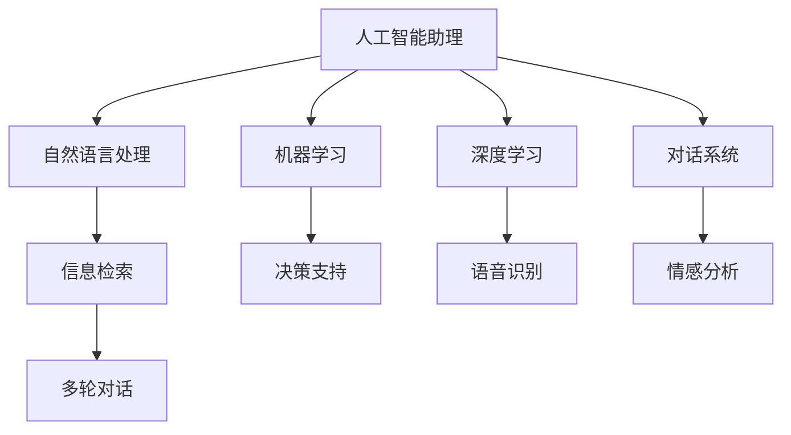

                 

# 聊天机器人未来：人工智能助理和顾问

> 关键词：人工智能助理, 聊天机器人, 自然语言处理(NLP), 机器学习(ML), 深度学习(Deep Learning), 对话系统, 情感分析, 个性化推荐

## 1. 背景介绍

### 1.1 问题由来

在过去十年中，人工智能技术取得了迅猛发展，尤其是在自然语言处理(NLP)和深度学习(Deep Learning)领域。其中，聊天机器人作为人工智能技术的典型应用，通过与人类进行自然语言交流，为人们提供信息咨询、情感支持、生活帮助等多种服务，逐渐成为人们日常生活和工作中不可或缺的一部分。然而，尽管聊天机器人在某些场景下表现出色，但整体而言，其智能化程度仍与人类存在较大差距。如何提升聊天机器人的智能化水平，使其能够更好地服务于人类，成为了当前人工智能领域的一个重要研究方向。

### 1.2 问题核心关键点

当前聊天机器人存在的主要问题包括：

1. **理解能力不足**：尽管现有的聊天机器人能够进行简单的文本处理和对话交流，但在处理复杂的语境、隐含语义和语用逻辑方面仍然存在困难。
2. **情感智能缺乏**：聊天机器人普遍缺乏情感理解和情感表达能力，无法对用户的情感需求进行有效响应。
3. **个性化推荐不足**：现有的聊天机器人往往缺乏对用户偏好的理解，无法提供个性化和定制化的服务。
4. **知识库更新慢**：聊天机器人通常依赖于静态知识库，更新速度较慢，无法及时获取最新信息。
5. **多轮对话支持不足**：现有聊天机器人多数只能进行单轮对话，缺乏长期记忆和上下文理解能力。

针对这些问题，人工智能助理和顾问技术应运而生。通过将传统的聊天机器人和人工智能助理相结合，可以有效提升聊天机器人的智能化水平，使其能够更好地理解用户需求、处理复杂语境、进行情感响应和提供个性化服务。本文将深入探讨人工智能助理和顾问技术的原理、实现方法及未来应用展望。

## 2. 核心概念与联系

### 2.1 核心概念概述

为更好地理解人工智能助理和顾问技术，本节将介绍几个密切相关的核心概念：

- **人工智能助理**：基于自然语言处理和机器学习技术，能够理解和处理人类语言，执行特定任务，如信息检索、日程安排、日程提醒等，并提供决策支持的技术。
- **聊天机器人**：通过模拟人类对话，能够理解和响应用户的输入，进行简单到复杂的对话交流。
- **自然语言处理(NLP)**：涉及计算机和人类语言之间的信息交换，旨在使计算机能够理解、处理和生成自然语言。
- **机器学习(ML)**：通过算法和数据训练，使计算机能够从数据中学习规律，进行预测和决策。
- **深度学习(Deep Learning)**：利用多层神经网络进行数据处理和模式识别，广泛应用于图像、语音、文本等领域的智能应用。
- **对话系统**：能够进行多轮对话的技术，能够理解和响应用户的复杂需求，并提供相关信息和解决方案。

这些核心概念之间的逻辑关系可以通过以下Mermaid流程图来展示：



这个流程图展示了几类核心技术及其之间的关系：

1. 人工智能助理通过自然语言处理、机器学习和深度学习技术，实现信息检索、决策支持和语音识别等功能。
2. 对话系统则使助理能够理解和响应多轮对话，进行复杂的交流。
3. 情感分析则帮助助理理解和处理用户的情感需求。

这些概念共同构成了人工智能助理和顾问技术的框架，使其能够更好地服务于用户。

## 3. 核心算法原理 & 具体操作步骤
### 3.1 算法原理概述

人工智能助理和顾问技术通过将聊天机器人和人工智能助理进行深度融合，结合自然语言处理、机器学习和深度学习等技术，实现智能化对话和决策支持。其核心思想是：利用人工智能助理的强大计算能力和知识库，提升聊天机器人的理解能力、情感智能和个性化推荐能力，从而使其能够更自然、更智能地与用户交流。

形式化地，假设聊天机器人为 $C$，人工智能助理为 $A$，用户输入为 $U$，输出为 $O$。则人工智能助理和顾问技术的目标是：

$$
\max_{A} \sum_{i=1}^{N} \log P_{A}(O_i|U_i)
$$

其中 $N$ 表示对话轮数，$P_{A}$ 为人工智能助理对用户输入 $U_i$ 的响应概率模型，$O_i$ 为聊天机器人的输出。

### 3.2 算法步骤详解

人工智能助理和顾问技术的实现过程包括以下几个关键步骤：

**Step 1: 构建知识库和语料库**

- 收集相关领域的知识和信息，构建知识库。
- 收集大量的对话数据和对话日志，构建语料库。

**Step 2: 预训练语言模型**

- 使用大规模无标签数据对语言模型进行预训练，使其能够学习到语言的通用表示。
- 常见的预训练模型包括BERT、GPT等。

**Step 3: 设计任务适配层**

- 根据特定任务，设计适合的任务适配层。
- 如对于问答任务，设计问答适配器。

**Step 4: 微调模型**

- 在预训练模型的基础上，使用少量标注数据进行微调。
- 微调模型以适应特定任务，提升对话和决策支持能力。

**Step 5: 多轮对话支持**

- 利用上下文管理器，记录对话历史信息。
- 设计记忆网络，处理多轮对话。

**Step 6: 情感智能增强**

- 使用情感分析模型，识别用户情感状态。
- 根据情感状态调整对话策略。

**Step 7: 个性化推荐**

- 利用推荐算法，结合用户偏好和知识库，提供个性化服务。

**Step 8: 部署和评估**

- 将微调后的模型部署到实际应用环境中。
- 定期评估模型性能，进行模型更新和优化。

### 3.3 算法优缺点

人工智能助理和顾问技术具有以下优点：

1. **智能化程度高**：通过将聊天机器人和人工智能助理相结合，聊天机器人能够理解和处理复杂的语境和隐含语义。
2. **情感智能丰富**：能够进行情感分析，理解并响应用户的情感需求。
3. **个性化服务能力强**：结合用户的偏好和知识库，提供定制化的服务和推荐。
4. **知识更新迅速**：知识库能够快速更新，获取最新信息。
5. **多轮对话支持**：能够处理多轮对话，保持上下文理解能力。

同时，该技术也存在一些局限性：

1. **数据依赖度高**：构建知识库和语料库需要大量高质量数据，数据获取成本高。
2. **模型复杂度高**：多轮对话、情感分析和个性化推荐等功能的实现需要复杂模型和算法，计算资源消耗大。
3. **易受攻击**：由于依赖于知识库和模型，存在被恶意攻击的风险。
4. **可解释性不足**：聊天机器人的决策过程往往缺乏可解释性，难以调试和优化。

尽管存在这些局限性，但就目前而言，人工智能助理和顾问技术仍是大语言模型应用的重要方向之一。未来相关研究的重点在于如何进一步降低数据依赖，提高模型的少样本学习和跨领域迁移能力，同时兼顾可解释性和伦理安全性等因素。

### 3.4 算法应用领域

人工智能助理和顾问技术已经在多个领域得到了广泛应用，例如：

- **客户服务**：帮助企业构建智能客服系统，提升客户服务体验。
- **医疗健康**：提供健康咨询和建议，辅助医生诊断和治疗。
- **金融理财**：提供财务规划和投资建议，帮助用户进行财务管理。
- **教育培训**：提供个性化学习计划和辅导，辅助学习者提升学习效果。
- **旅游出行**：提供旅行建议和预订服务，提升旅游体验。

除了上述这些经典应用外，人工智能助理和顾问技术还被创新性地应用到更多场景中，如智能家居、智能交通、智能办公等，为人们的生活和工作带来更多便利。随着预训练模型和相关技术的不断进步，相信人工智能助理和顾问技术将在更广阔的应用领域大放异彩。

## 4. 数学模型和公式 & 详细讲解  
### 4.1 数学模型构建

本节将使用数学语言对人工智能助理和顾问技术的实现过程进行更加严格的刻画。

假设聊天机器人为 $C$，人工智能助理为 $A$，用户输入为 $U$，输出为 $O$。则聊天机器人 $C$ 和人工智能助理 $A$ 的交互过程可以表示为：

$$
P(O|U) = \sum_{A \in \mathcal{A}} P(A|U)P(O|A)
$$

其中，$P(A|U)$ 为给定用户输入 $U$，人工智能助理 $A$ 选择的概率，$P(O|A)$ 为给定人工智能助理 $A$，聊天机器人 $C$ 响应的概率。

人工智能助理 $A$ 的决策过程可以表示为：

$$
P(A|U) = \frac{P(A)}{\sum_{A' \in \mathcal{A}} P(A')}
$$

其中 $P(A)$ 为给定用户输入 $U$，人工智能助理 $A$ 选择的概率，$P(A')$ 为给定用户输入 $U$，所有可能的人工智能助理 $A'$ 选择的概率。

### 4.2 公式推导过程

以下我们以问答系统为例，推导基于人工智能助理和顾问技术的问答概率模型及其梯度计算公式。

假设模型 $C_{\theta}$ 和 $A_{\phi}$ 在输入 $U$ 上的输出分别为 $O_C$ 和 $O_A$，则问答系统在用户输入 $U$ 上的总输出概率可以表示为：

$$
P(O_C|U) = \sum_{A \in \mathcal{A}} P(A|U)P(O_C|A)
$$

根据链式法则，对模型 $C_{\theta}$ 和 $A_{\phi}$ 的参数 $\theta$ 和 $\phi$ 进行联合优化，即最小化损失函数：

$$
\mathcal{L}(\theta, \phi) = -\log P(O_C|U)
$$

其中 $P(O_C|U)$ 为给定用户输入 $U$，聊天机器人 $C$ 响应的概率。

通过反向传播算法计算模型 $C_{\theta}$ 和 $A_{\phi}$ 的梯度，并使用优化算法（如AdamW）更新模型参数。具体而言，对聊天机器人 $C_{\theta}$ 的梯度更新公式为：

$$
\theta \leftarrow \theta - \eta \nabla_{\theta}\mathcal{L}(\theta, \phi)
$$

其中 $\eta$ 为学习率，$\nabla_{\theta}\mathcal{L}(\theta, \phi)$ 为损失函数对聊天机器人 $C_{\theta}$ 的参数 $\theta$ 的梯度。

同理，对人工智能助理 $A_{\phi}$ 的梯度更新公式为：

$$
\phi \leftarrow \phi - \eta \nabla_{\phi}\mathcal{L}(\theta, \phi)
$$

其中 $\nabla_{\phi}\mathcal{L}(\theta, \phi)$ 为损失函数对人工智能助理 $A_{\phi}$ 的参数 $\phi$ 的梯度。

在得到损失函数的梯度后，即可带入模型更新公式，完成模型的迭代优化。重复上述过程直至收敛，最终得到适应问答任务的最优模型参数 $\theta$ 和 $\phi$。

## 5. 项目实践：代码实例和详细解释说明
### 5.1 开发环境搭建

在进行人工智能助理和顾问技术的开发实践前，我们需要准备好开发环境。以下是使用Python进行PyTorch开发的环境配置流程：

1. 安装Anaconda：从官网下载并安装Anaconda，用于创建独立的Python环境。

2. 创建并激活虚拟环境：
```bash
conda create -n assistant-env python=3.8 
conda activate assistant-env
```

3. 安装PyTorch：根据CUDA版本，从官网获取对应的安装命令。例如：
```bash
conda install pytorch torchvision torchaudio cudatoolkit=11.1 -c pytorch -c conda-forge
```

4. 安装Transformers库：
```bash
pip install transformers
```

5. 安装各类工具包：
```bash
pip install numpy pandas scikit-learn matplotlib tqdm jupyter notebook ipython
```

完成上述步骤后，即可在`assistant-env`环境中开始开发实践。

### 5.2 源代码详细实现

下面我们以问答系统为例，给出使用Transformers库对BERT模型进行微调的PyTorch代码实现。

首先，定义问答任务的数据处理函数：

```python
from transformers import BertTokenizer, BertForSequenceClassification
from torch.utils.data import Dataset
import torch

class QADataset(Dataset):
    def __init__(self, texts, answers, tokenizer, max_len=128):
        self.texts = texts
        self.answers = answers
        self.tokenizer = tokenizer
        self.max_len = max_len
        
    def __len__(self):
        return len(self.texts)
    
    def __getitem__(self, item):
        text = self.texts[item]
        answer = self.answers[item]
        
        encoding = self.tokenizer(text, return_tensors='pt', max_length=self.max_len, padding='max_length', truncation=True)
        input_ids = encoding['input_ids'][0]
        attention_mask = encoding['attention_mask'][0]
        
        # 对答案进行编码
        answer_encoded = [self.tokenizer.token_to_id(answer)] * self.max_len
        labels = torch.tensor(answer_encoded, dtype=torch.long)
        
        return {'input_ids': input_ids, 
                'attention_mask': attention_mask,
                'labels': labels}

# 加载预训练模型和分词器
tokenizer = BertTokenizer.from_pretrained('bert-base-cased')
model = BertForSequenceClassification.from_pretrained('bert-base-cased', num_labels=1)

# 准备问答数据集
train_dataset = QADataset(train_texts, train_answers, tokenizer)
dev_dataset = QADataset(dev_texts, dev_answers, tokenizer)
test_dataset = QADataset(test_texts, test_answers, tokenizer)
```

然后，定义训练和评估函数：

```python
from torch.utils.data import DataLoader
from tqdm import tqdm
from sklearn.metrics import accuracy_score

device = torch.device('cuda') if torch.cuda.is_available() else torch.device('cpu')
model.to(device)

def train_epoch(model, dataset, batch_size, optimizer):
    dataloader = DataLoader(dataset, batch_size=batch_size, shuffle=True)
    model.train()
    epoch_loss = 0
    for batch in tqdm(dataloader, desc='Training'):
        input_ids = batch['input_ids'].to(device)
        attention_mask = batch['attention_mask'].to(device)
        labels = batch['labels'].to(device)
        model.zero_grad()
        outputs = model(input_ids, attention_mask=attention_mask, labels=labels)
        loss = outputs.loss
        epoch_loss += loss.item()
        loss.backward()
        optimizer.step()
    return epoch_loss / len(dataloader)

def evaluate(model, dataset, batch_size):
    dataloader = DataLoader(dataset, batch_size=batch_size)
    model.eval()
    correct = 0
    total = 0
    with torch.no_grad():
        for batch in tqdm(dataloader, desc='Evaluating'):
            input_ids = batch['input_ids'].to(device)
            attention_mask = batch['attention_mask'].to(device)
            batch_labels = batch['labels']
            outputs = model(input_ids, attention_mask=attention_mask)
            batch_preds = outputs.logits.argmax(dim=1).to('cpu').tolist()
            batch_labels = batch_labels.to('cpu').tolist()
            for pred, label in zip(batch_preds, batch_labels):
                correct += int(pred == label)
                total += 1
                
    print(f"Accuracy: {correct/total:.3f}")
```

最后，启动训练流程并在测试集上评估：

```python
epochs = 5
batch_size = 16

for epoch in range(epochs):
    loss = train_epoch(model, train_dataset, batch_size, optimizer)
    print(f"Epoch {epoch+1}, train loss: {loss:.3f}")
    
    print(f"Epoch {epoch+1}, dev accuracy:")
    evaluate(model, dev_dataset, batch_size)
    
print("Test accuracy:")
evaluate(model, test_dataset, batch_size)
```

以上就是使用PyTorch对BERT进行问答系统任务微调的完整代码实现。可以看到，得益于Transformers库的强大封装，我们可以用相对简洁的代码完成BERT模型的加载和微调。

### 5.3 代码解读与分析

让我们再详细解读一下关键代码的实现细节：

**QADataset类**：
- `__init__`方法：初始化文本、答案、分词器等关键组件。
- `__len__`方法：返回数据集的样本数量。
- `__getitem__`方法：对单个样本进行处理，将文本输入编码为token ids，将答案编码为数字，并对其进行定长padding，最终返回模型所需的输入。

**tokenizer和model变量**：
- `tokenizer`：用于将文本转换为token ids，这里使用BertTokenizer。
- `model`：预训练模型BERT，用于问答系统的微调。

**训练和评估函数**：
- 使用PyTorch的DataLoader对数据集进行批次化加载，供模型训练和推理使用。
- 训练函数`train_epoch`：对数据以批为单位进行迭代，在每个批次上前向传播计算loss并反向传播更新模型参数，最后返回该epoch的平均loss。
- 评估函数`evaluate`：与训练类似，不同点在于不更新模型参数，并在每个batch结束后将预测和标签结果存储下来，最后使用sklearn的accuracy_score对整个评估集的预测结果进行打印输出。

**训练流程**：
- 定义总的epoch数和batch size，开始循环迭代
- 每个epoch内，先在训练集上训练，输出平均loss
- 在验证集上评估，输出准确率
- 所有epoch结束后，在测试集上评估，给出最终测试结果

可以看到，PyTorch配合Transformers库使得BERT微调的代码实现变得简洁高效。开发者可以将更多精力放在数据处理、模型改进等高层逻辑上，而不必过多关注底层的实现细节。

当然，工业级的系统实现还需考虑更多因素，如模型的保存和部署、超参数的自动搜索、更灵活的任务适配层等。但核心的微调范式基本与此类似。

## 6. 实际应用场景
### 6.1 智能客服系统

基于人工智能助理和顾问技术的智能客服系统，可以广泛应用于企业的客户服务部门。传统的客服往往需要配备大量人力，高峰期响应缓慢，且一致性和专业性难以保证。而使用人工智能助理和顾问技术的智能客服系统，能够7x24小时不间断服务，快速响应客户咨询，用自然流畅的语言解答各类常见问题。

在技术实现上，可以收集企业内部的历史客服对话记录，将问题和最佳答复构建成监督数据，在此基础上对预训练模型进行微调。微调后的模型能够自动理解用户意图，匹配最合适的答案模板进行回复。对于客户提出的新问题，还可以接入检索系统实时搜索相关内容，动态组织生成回答。如此构建的智能客服系统，能大幅提升客户咨询体验和问题解决效率。

### 6.2 医疗健康

人工智能助理和顾问技术在医疗健康领域的应用潜力巨大。医疗机构需要实时监测患者的健康状况，及时进行诊断和治疗。传统的医疗系统往往依赖于人工操作，耗时长、效率低，且误诊风险高。而利用人工智能助理和顾问技术，能够实时分析患者的健康数据，提供智能诊断和建议，辅助医生进行精准治疗。

具体而言，可以收集医生的病历、诊断记录、治疗方案等信息，构建知识库。同时，将患者的健康数据输入模型，通过微调得到诊断结果和建议。此外，还可以引入情感分析技术，根据患者的情感状态调整回答策略，提升用户体验。

### 6.3 金融理财

在金融理财领域，人工智能助理和顾问技术可以提供个性化的投资建议和财务规划，帮助用户进行财务管理。传统的金融顾问往往需要高昂的咨询费用和复杂的流程，无法满足用户的个性化需求。而利用人工智能助理和顾问技术，能够根据用户的历史交易数据和风险偏好，提供定制化的投资策略和财务建议，提升用户投资回报。

具体而言，可以收集用户的交易记录、风险偏好等信息，构建知识库。同时，将用户的交易数据输入模型，通过微调得到个性化的投资建议和财务规划。此外，还可以引入情感分析技术，根据用户的情感状态调整回答策略，提升用户体验。

### 6.4 教育培训

人工智能助理和顾问技术在教育培训领域的应用也非常广泛。传统的教育往往依赖于老师的讲授和作业批改，效率低、互动性差。而利用人工智能助理和顾问技术，能够根据学生的学习进度和理解程度，提供个性化的学习计划和辅导，提升学习效果。

具体而言，可以收集学生的学习数据和测试成绩等信息，构建知识库。同时，将学生的学习数据输入模型，通过微调得到个性化的学习计划和辅导。此外，还可以引入情感分析技术，根据学生的情感状态调整回答策略，提升学习体验。

### 6.5 旅游出行

在旅游出行领域，人工智能助理和顾问技术可以提供个性化的旅游建议和行程安排，提升旅游体验。传统的旅游规划往往依赖于人工操作，耗时长、效率低，且难以满足用户的个性化需求。而利用人工智能助理和顾问技术，能够根据用户的兴趣和预算，提供个性化的旅游建议和行程安排，提升旅游体验。

具体而言，可以收集用户的旅游偏好、预算等信息，构建知识库。同时，将用户的兴趣和预算输入模型，通过微调得到个性化的旅游建议和行程安排。此外，还可以引入情感分析技术，根据用户的情感状态调整回答策略，提升旅游体验。

### 6.6 其他应用

除了上述这些经典应用外，人工智能助理和顾问技术还被创新性地应用到更多场景中，如智能家居、智能交通、智能办公等，为人们的生活和工作带来更多便利。

随着预训练模型和相关技术的不断进步，相信人工智能助理和顾问技术将在更广阔的应用领域大放异彩。未来，伴随技术的日益成熟，将会有更多新的应用场景涌现出来，进一步提升人们的生活和工作质量。

## 7. 工具和资源推荐
### 7.1 学习资源推荐

为了帮助开发者系统掌握人工智能助理和顾问技术的原理和实践技巧，这里推荐一些优质的学习资源：

1. 《Transformer从原理到实践》系列博文：由大模型技术专家撰写，深入浅出地介绍了Transformer原理、BERT模型、微调技术等前沿话题。

2. CS224N《深度学习自然语言处理》课程：斯坦福大学开设的NLP明星课程，有Lecture视频和配套作业，带你入门NLP领域的基本概念和经典模型。

3. 《Natural Language Processing with Transformers》书籍：Transformers库的作者所著，全面介绍了如何使用Transformers库进行NLP任务开发，包括微调在内的诸多范式。

4. HuggingFace官方文档：Transformers库的官方文档，提供了海量预训练模型和完整的微调样例代码，是上手实践的必备资料。

5. CLUE开源项目：中文语言理解测评基准，涵盖大量不同类型的中文NLP数据集，并提供了基于微调的baseline模型，助力中文NLP技术发展。

通过对这些资源的学习实践，相信你一定能够快速掌握人工智能助理和顾问技术的精髓，并用于解决实际的NLP问题。
### 7.2 开发工具推荐

高效的开发离不开优秀的工具支持。以下是几款用于人工智能助理和顾问技术开发的常用工具：

1. PyTorch：基于Python的开源深度学习框架，灵活动态的计算图，适合快速迭代研究。大部分预训练语言模型都有PyTorch版本的实现。

2. TensorFlow：由Google主导开发的开源深度学习框架，生产部署方便，适合大规模工程应用。同样有丰富的预训练语言模型资源。

3. Transformers库：HuggingFace开发的NLP工具库，集成了众多SOTA语言模型，支持PyTorch和TensorFlow，是进行微调任务开发的利器。

4. Weights & Biases：模型训练的实验跟踪工具，可以记录和可视化模型训练过程中的各项指标，方便对比和调优。与主流深度学习框架无缝集成。

5. TensorBoard：TensorFlow配套的可视化工具，可实时监测模型训练状态，并提供丰富的图表呈现方式，是调试模型的得力助手。

6. Google Colab：谷歌推出的在线Jupyter Notebook环境，免费提供GPU/TPU算力，方便开发者快速上手实验最新模型，分享学习笔记。

合理利用这些工具，可以显著提升人工智能助理和顾问技术的开发效率，加快创新迭代的步伐。

### 7.3 相关论文推荐

人工智能助理和顾问技术的发展源于学界的持续研究。以下是几篇奠基性的相关论文，推荐阅读：

1. Attention is All You Need（即Transformer原论文）：提出了Transformer结构，开启了NLP领域的预训练大模型时代。

2. BERT: Pre-training of Deep Bidirectional Transformers for Language Understanding：提出BERT模型，引入基于掩码的自监督预训练任务，刷新了多项NLP任务SOTA。

3. Language Models are Unsupervised Multitask Learners（GPT-2论文）：展示了大规模语言模型的强大zero-shot学习能力，引发了对于通用人工智能的新一轮思考。

4. Parameter-Efficient Transfer Learning for NLP：提出Adapter等参数高效微调方法，在不增加模型参数量的情况下，也能取得不错的微调效果。

5. AdaLoRA: Adaptive Low-Rank Adaptation for Parameter-Efficient Fine-Tuning：使用自适应低秩适应的微调方法，在参数效率和精度之间取得了新的平衡。

6. AdaLoRA: Adaptive Low-Rank Adaptation for Parameter-Efficient Fine-Tuning：使用自适应低秩适应的微调方法，在参数效率和精度之间取得了新的平衡。

这些论文代表了大语言模型微调技术的发展脉络。通过学习这些前沿成果，可以帮助研究者把握学科前进方向，激发更多的创新灵感。

## 8. 总结：未来发展趋势与挑战

### 8.1 总结

本文对人工智能助理和顾问技术的原理、实现方法及未来应用展望进行了全面系统的介绍。首先阐述了人工智能助理和顾问技术的背景和意义，明确了其在提升聊天机器人智能化水平方面的独特价值。其次，从原理到实践，详细讲解了基于人工智能助理和顾问技术的微调方法及其具体步骤，给出了微调任务开发的完整代码实例。同时，本文还广泛探讨了人工智能助理和顾问技术在智能客服、医疗健康、金融理财、教育培训等诸多领域的应用前景，展示了该技术的大规模应用潜力。此外，本文精选了人工智能助理和顾问技术的各类学习资源，力求为读者提供全方位的技术指引。

通过本文的系统梳理，可以看到，基于人工智能助理和顾问技术的聊天机器人未来将具有强大的智能化能力，能够更好地理解用户需求、处理复杂语境、进行情感响应和提供个性化服务。这种技术的广泛应用，将显著提升各类服务场景的效率和用户体验，推动人工智能技术的产业化进程。未来，伴随预训练语言模型和相关技术的不断进步，人工智能助理和顾问技术必将在更多领域得到应用，为人类生产生活带来更多便利和创新。

### 8.2 未来发展趋势

展望未来，人工智能助理和顾问技术将呈现以下几个发展趋势：

1. **智能化水平提升**：随着预训练模型和微调技术的不断进步，聊天机器人将能够更好地理解自然语言，处理复杂的语境和隐含语义。
2. **情感智能增强**：能够进行更准确的情感分析，理解并响应用户的情感需求。
3. **个性化服务提升**：结合用户偏好和知识库，提供更加精准和个性化的服务。
4. **知识库更新迅速**：知识库能够快速更新，获取最新信息。
5. **多轮对话支持**：能够处理多轮对话，保持上下文理解能力。
6. **跨领域迁移能力提升**：能够适应更多领域和任务，具备更强的泛化能力。

以上趋势凸显了人工智能助理和顾问技术的广阔前景。这些方向的探索发展，必将进一步提升聊天机器人的智能化水平，使其能够更好地服务于人类，推动人工智能技术的产业化进程。

### 8.3 面临的挑战

尽管人工智能助理和顾问技术已经取得了瞩目成就，但在迈向更加智能化、普适化应用的过程中，仍面临诸多挑战：

1. **数据依赖度高**：构建知识库和语料库需要大量高质量数据，数据获取成本高。
2. **模型复杂度高**：多轮对话、情感分析和个性化推荐等功能的实现需要复杂模型和算法，计算资源消耗大。
3. **易受攻击**：由于依赖于知识库和模型，存在被恶意攻击的风险。
4. **可解释性不足**：聊天机器人的决策过程往往缺乏可解释性，难以调试和优化。
5. **安全性和伦理问题**：预训练模型难免会学习到有偏见、有害的信息，通过微调传递到下游任务，可能造成负面影响。
6. **实时性问题**：大规模模型的推理速度较慢，可能影响实时性。

尽管存在这些局限性，但就目前而言，人工智能助理和顾问技术仍是大语言模型应用的重要方向之一。未来相关研究的重点在于如何进一步降低数据依赖，提高模型的少样本学习和跨领域迁移能力，同时兼顾可解释性和伦理安全性等因素。

### 8.4 未来突破

面对人工智能助理和顾问技术所面临的挑战，未来的研究需要在以下几个方面寻求新的突破：

1. **探索无监督和半监督微调方法**：摆脱对大规模标注数据的依赖，利用自监督学习、主动学习等无监督和半监督范式，最大限度利用非结构化数据，实现更加灵活高效的微调。
2. **研究参数高效和计算高效的微调范式**：开发更加参数高效的微调方法，在固定大部分预训练参数的同时，只更新极少量的任务相关参数。同时优化微调模型的计算图，减少前向传播和反向传播的资源消耗，实现更加轻量级、实时性的部署。
3. **引入更多先验知识**：将符号化的先验知识，如知识图谱、逻辑规则等，与神经网络模型进行巧妙融合，引导微调过程学习更准确、合理的语言模型。同时加强不同模态数据的整合，实现视觉、语音等多模态信息与文本信息的协同建模。
4. **结合因果分析和博弈论工具**：将因果分析方法引入微调模型，识别出模型决策的关键特征，增强输出解释的因果性和逻辑性。借助博弈论工具刻画人机交互过程，主动探索并规避模型的脆弱点，提高系统稳定性。
5. **纳入伦理道德约束**：在模型训练目标中引入伦理导向的评估指标，过滤和惩罚有偏见、有害的输出倾向。同时加强人工干预和审核，建立模型行为的监管机制，确保输出符合人类价值观和伦理道德。

这些研究方向的探索，必将引领人工智能助理和顾问技术迈向更高的台阶，为构建安全、可靠、可解释、可控的智能系统铺平道路。面向未来，人工智能助理和顾问技术还需要与其他人工智能技术进行更深入的融合，如知识表示、因果推理、强化学习等，多路径协同发力，共同推动自然语言理解和智能交互系统的进步。只有勇于创新、敢于突破，才能不断拓展人工智能助理和顾问技术的边界，让智能技术更好地造福人类社会。

## 9. 附录：常见问题与解答

**Q1：人工智能助理和顾问技术是否适用于所有NLP任务？**

A: 人工智能助理和顾问技术在大多数NLP任务上都能取得不错的效果，特别是对于数据量较小的任务。但对于一些特定领域的任务，如医学、法律等，仅仅依靠通用语料预训练的模型可能难以很好地适应。此时需要在特定领域语料上进一步预训练，再进行微调，才能获得理想效果。此外，对于一些需要时效性、个性化很强的任务，如对话、推荐等，人工智能助理和顾问技术也需要针对性的改进优化。

**Q2：微调过程中如何选择合适的学习率？**

A: 微调的学习率一般要比预训练时小1-2个数量级，如果使用过大的学习率，容易破坏预训练权重，导致过拟合。一般建议从1e-5开始调参，逐步减小学习率，直至收敛。也可以使用warmup策略，在开始阶段使用较小的学习率，再逐渐过渡到预设值。需要注意的是，不同的优化器(如AdamW、Adafactor等)以及不同的学习率调度策略，可能需要设置不同的学习率阈值。

**Q3：采用人工智能助理和顾问技术时会面临哪些资源瓶颈？**

A: 目前主流的预训练大模型动辄以亿计的参数规模，对算力、内存、存储都提出了很高的要求。GPU/TPU等高性能设备是必不可少的，但即便如此，超大批次的训练和推理也可能遇到显存不足的问题。因此需要采用一些资源优化技术，如梯度积累、混合精度训练、模型并行等，来突破硬件瓶颈。同时，模型的存储和读取也可能占用大量时间和空间，需要采用模型压缩、稀疏化存储等方法进行优化。

**Q4：如何缓解微调过程中的过拟合问题？**

A: 过拟合是微调面临的主要挑战，尤其是在标注数据不足的情况下。常见的缓解策略包括：
1. 数据增强：通过回译、近义替换等方式扩充训练集
2. 正则化：使用L2正则、Dropout、Early Stopping等避免过拟合
3. 对抗训练：引入对抗样本，提高模型鲁棒性
4. 参数高效微调：只调整少量参数(如Adapter、Prefix等)，减小过拟合风险
5. 多模型集成：训练多个微调模型，取平均输出，抑制过拟合

这些策略往往需要根据具体任务和数据特点进行灵活组合。只有在数据、模型、训练、推理等各环节进行全面优化，才能最大限度地发挥人工智能助理和顾问技术的威力。

**Q5：人工智能助理和顾问技术在落地部署时需要注意哪些问题？**

A: 将人工智能助理和顾问技术转化为实际应用，还需要考虑以下因素：
1. 模型裁剪：去除不必要的层和参数，减小模型尺寸，加快推理速度
2. 量化加速：将浮点模型转为定点模型，压缩存储空间，提高计算效率
3. 服务化封装：将模型封装为标准化服务接口，便于集成调用
4. 弹性伸缩：根据请求流量动态调整资源配置，平衡服务质量和成本
5. 监控告警：实时采集系统指标，设置异常告警阈值，确保服务稳定性
6. 安全防护：采用访问鉴权、数据脱敏等措施，保障数据和模型安全

人工智能助理和顾问技术为NLP应用开启了广阔的想象空间，但如何将强大的性能转化为稳定、高效、安全的业务价值，还需要工程实践的不断打磨。唯有从数据、算法、工程、业务等多个维度协同发力，才能真正实现人工智能助理和顾问技术在垂直行业的规模化落地。总之，微调需要开发者根据具体任务，不断迭代和优化模型、数据和算法，方能得到理想的效果。

---

作者：禅与计算机程序设计艺术 / Zen and the Art of Computer Programming

