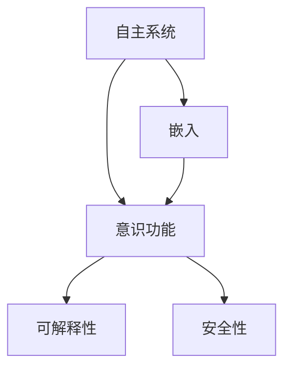

                 

# 自主系统与意识功能的整合

## 1. 背景介绍

### 1.1 问题由来

随着人工智能技术的不断发展，自主系统(Autonomous Systems)的应用范围已经扩展到各个领域，包括自动驾驶汽车、智能家居、工业自动化、机器人等。这些系统通过大量数据的收集、分析和处理，能够自主决策并执行任务。然而，尽管自主系统在技术上已经取得了显著进展，但其决策过程和行为依然缺乏足够的解释性和透明度，难以满足人类对智能系统的信任和接受需求。

近年来，人工智能伦理和安全问题日益受到关注，尤其在自动驾驶、医疗诊断等高风险领域，自主系统的决策过程和结果需要具备足够的可解释性和透明度。意识功能的整合，成为提升自主系统可信度、保障安全性的重要途径。

### 1.2 问题核心关键点

意识功能的整合旨在将人类意识的特点，如自我感知、情感理解、决策意识等，与自主系统的决策过程相结合，使系统在自主决策时具备一定的“人类化”特征，从而增强系统的可信度和安全性。

意识功能的整合涉及以下几个核心问题：
- 如何定义“意识”？
- 如何通过算法和模型，将意识功能嵌入自主系统？
- 如何评估意识功能的实际效果？

本文将围绕这些关键问题，探讨自主系统与意识功能的整合，并给出系统的实现方案和优化策略。

## 2. 核心概念与联系

### 2.1 核心概念概述

为更好地理解自主系统与意识功能的整合方法，本节将介绍几个密切相关的核心概念：

- 自主系统(Autonomous Systems)：指能够在无人类干预下自主决策和执行任务的系统，如自动驾驶汽车、无人机、智能机器人等。
- 意识功能(Conscious Function)：指人类意识中包含的自我感知、情感理解、决策意识等高级认知功能，是自主系统期望具备的特点。
- 可解释性(Explainability)：指系统决策过程和结果的透明性和可理解性，是提高自主系统可信度的重要因素。
- 安全性(Safety)：指系统在执行任务时对人类和环境的安全保障，是自主系统应用中的核心需求。
- 嵌入(Embedding)：指将意识功能嵌入到自主系统的决策过程中，使其具备一定的人类化特征。

这些核心概念之间的逻辑关系可以通过以下Mermaid流程图来展示：



这个流程图展示了几者之间的关联关系：

1. 自主系统通过嵌入意识功能，可以具备更好的可解释性和安全性。
2. 可解释性和安全性是自主系统设计的重要目标，与意识功能紧密相连。
3. 嵌入过程是实现意识功能整合的关键步骤。

## 3. 核心算法原理 & 具体操作步骤
### 3.1 算法原理概述

自主系统与意识功能的整合，本质上是通过在系统中引入特定的意识特征，引导系统在决策过程中具备一定的自我感知、情感理解、决策意识等人类化特征。这一过程可以分为三个主要步骤：

1. 模型训练：使用大规模数据集训练具有一定意识功能的模型。
2. 模型融合：将训练得到的模型嵌入到自主系统的决策过程中，使其在决策时具备一定的意识功能。
3. 系统评估：通过特定的评估指标，评估系统在融合意识功能后的性能提升情况。

### 3.2 算法步骤详解

#### 3.2.1 模型训练

模型训练的目的是通过大量数据集，训练出能够模拟人类意识功能的模型。具体步骤如下：

1. 数据收集：收集与人类意识相关的数据，如情感文本、行为数据等。
2. 数据标注：对收集到的数据进行标注，构建训练集。标注信息应包含意识功能的各个方面，如情感类别、决策依据等。
3. 模型选择：选择合适的模型架构，如基于注意力机制的模型、基于记忆网络的模型等。
4. 训练过程：使用标注数据对模型进行训练，优化模型参数，使其能够捕捉到意识功能的特征。

#### 3.2.2 模型融合

模型融合是将训练得到的意识功能模型嵌入到自主系统的决策过程中的关键步骤。具体步骤如下：

1. 选择融合点：根据自主系统的实际需求，选择决策过程中的关键点进行意识功能融合。
2. 模型嵌入：将训练好的意识功能模型与自主系统的决策模型进行融合。常用的方法包括权重共享、模型堆叠、代理训练等。
3. 参数优化：对融合后的系统进行参数优化，确保其在实际应用中能够稳定运行。

#### 3.2.3 系统评估

系统评估的目的是通过特定的评估指标，评估系统在融合意识功能后的性能提升情况。具体步骤如下：

1. 定义评估指标：根据具体应用场景，定义相应的评估指标，如可解释性、安全性、决策质量等。
2. 测试过程：在测试数据集上，对融合后的系统进行测试，评估其性能表现。
3. 对比分析：将融合前后的系统性能进行对比，评估意识功能整合的效果。

### 3.3 算法优缺点

自主系统与意识功能的整合方法具有以下优点：

1. 提升系统可信度：通过引入意识功能，系统在决策过程中具备一定的可解释性，增强了用户的信任。
2. 提高系统安全性：通过情感理解和自我感知，系统能够更好地理解和响应异常情况，提高安全性。
3. 增强决策质量：意识功能整合后的系统能够更好地捕捉决策依据和情感倾向，提高决策质量。

同时，该方法也存在一定的局限性：

1. 数据需求量大：训练和融合意识功能模型需要大量的标注数据，数据收集和标注成本较高。
2. 模型复杂度高：意识功能模型的训练和融合过程较为复杂，需要较高的技术门槛。
3. 性能提升不确定：意识功能整合的效果取决于模型和融合策略，存在一定的不确定性。
4. 系统可解释性不足：尽管加入了意识功能，系统的决策过程仍难以全面解释，存在一定的黑盒问题。

尽管存在这些局限性，但就目前而言，自主系统与意识功能的整合方法仍然是提升系统可信度和安全性的重要手段。未来相关研究的重点在于如何进一步降低数据需求，提高模型性能，同时兼顾可解释性和安全性等因素。

### 3.4 算法应用领域

自主系统与意识功能的整合方法在多个领域都有广泛的应用，例如：

1. 自动驾驶：在自动驾驶系统中，通过引入自我感知和情感理解功能，使车辆在复杂环境下能够更加稳定和智能地决策。
2. 医疗诊断：在医疗诊断系统中，通过引入情感理解和决策意识，使医生能够更好地理解病人的情感状态和需求，提高诊断准确性。
3. 智能客服：在智能客服系统中，通过引入自我感知和情感理解功能，使客服机器人能够更加自然地与客户交互，提高服务质量。
4. 智能安防：在智能安防系统中，通过引入自我感知和决策意识，使监控系统能够更加智能地识别异常行为，提高安全保障。
5. 智能教育：在智能教育系统中，通过引入情感理解和决策意识，使教育机器人能够更好地与学生互动，提供个性化教育。

这些领域的应用展示了意识功能整合的强大潜力和广泛前景。随着技术不断进步，意识功能整合必将在更多领域得到应用，为社会的智能化进程带来新的变革。

## 4. 数学模型和公式 & 详细讲解 & 举例说明

### 4.1 数学模型构建

自主系统与意识功能的整合涉及到多个层面的数据处理和模型训练。下面将使用数学语言对这一过程进行严格刻画。

假设自主系统的决策任务为分类任务，输入数据为 $X$，标签为 $Y$。训练集为 $D=\{(x_i,y_i)\}_{i=1}^N$，其中 $x_i \in \mathcal{X}$， $y_i \in \{0,1\}$。

定义意识功能模型为 $F:\mathcal{X} \rightarrow \mathcal{Y'}$，其中 $\mathcal{Y'}$ 为意识功能模型输出空间的子集，通常为意识功能特征集合。

定义融合后的系统模型为 $G:\mathcal{X} \rightarrow \mathcal{Y}$，其中 $\mathcal{Y}$ 为实际决策输出空间。

模型的训练过程可以分为两个阶段：

1. 训练意识功能模型 $F$：使用标注数据集 $D$ 训练意识功能模型 $F$，优化模型参数 $\theta$。
2. 训练融合后的系统模型 $G$：将训练好的意识功能模型 $F$ 嵌入到自主系统的决策过程中，训练融合后的系统模型 $G$，优化参数 $\phi$。

### 4.2 公式推导过程

1. 意识功能模型的训练公式为：

$$
\min_{\theta} \frac{1}{N}\sum_{i=1}^N \ell(F(x_i),y_i)
$$

其中 $\ell$ 为损失函数，通常为交叉熵损失。

2. 融合后的系统模型的训练公式为：

$$
\min_{\phi} \frac{1}{N}\sum_{i=1}^N \ell(G(x_i),y_i)
$$

其中 $G(x_i) = F(x_i)$，$F(x_i)$ 为意识功能模型在输入 $x_i$ 上的输出。

3. 系统性能的评估公式为：

$$
\mathcal{P} = P(F(x_i),y_i) + \frac{1}{N}\sum_{i=1}^N P(G(x_i),y_i) - P(G(x_i),y_i)
$$

其中 $P$ 为评估指标，通常为可解释性和安全性。

### 4.3 案例分析与讲解

以自动驾驶系统为例，分析意识功能整合的实现过程和效果：

1. 数据收集：收集自动驾驶车辆在复杂环境下的行为数据和情感数据，如遇到突发情况时的反应行为、驾驶者情感状态等。
2. 数据标注：对收集到的数据进行标注，构建训练集。标注信息应包含情感类别、决策依据等。
3. 模型训练：选择基于注意力机制的模型，使用标注数据对模型进行训练，优化模型参数，使其能够捕捉到意识功能的特征。
4. 模型融合：将训练好的意识功能模型与自主系统的决策模型进行融合。常用的方法包括权重共享、模型堆叠、代理训练等。
5. 系统评估：在测试数据集上，对融合后的系统进行测试，评估其性能表现。使用可解释性、安全性、决策质量等指标进行评估。

通过融合意识功能模型，自动驾驶系统在遇到复杂情况时，能够更好地理解和响应驾驶者的情感状态，从而做出更加稳定和安全的决策。例如，在遇到行人过街时，系统能够通过情感分析判断驾驶者的情绪状态，并根据其情绪状态进行适当的减速和避让，提高安全保障。

## 5. 项目实践：代码实例和详细解释说明

### 5.1 开发环境搭建

在进行意识功能整合实践前，我们需要准备好开发环境。以下是使用Python进行PyTorch开发的环境配置流程：

1. 安装Anaconda：从官网下载并安装Anaconda，用于创建独立的Python环境。

2. 创建并激活虚拟环境：
```bash
conda create -n pytorch-env python=3.8 
conda activate pytorch-env
```

3. 安装PyTorch：根据CUDA版本，从官网获取对应的安装命令。例如：
```bash
conda install pytorch torchvision torchaudio cudatoolkit=11.1 -c pytorch -c conda-forge
```

4. 安装TensorFlow：
```bash
pip install tensorflow
```

5. 安装各类工具包：
```bash
pip install numpy pandas scikit-learn matplotlib tqdm jupyter notebook ipython
```

完成上述步骤后，即可在`pytorch-env`环境中开始意识功能整合实践。

### 5.2 源代码详细实现

下面我们以自动驾驶系统为例，给出使用PyTorch进行意识功能整合的PyTorch代码实现。

首先，定义意识功能模型的训练函数：

```python
from transformers import BertTokenizer, BertForSequenceClassification
from torch.utils.data import DataLoader
from transformers import AdamW

class ConsciousnessFunctionModel:
    def __init__(self, num_labels, hidden_size):
        self.num_labels = num_labels
        self.model = BertForSequenceClassification.from_pretrained('bert-base-cased', num_labels=num_labels, hidden_size=hidden_size)
        self.tokenizer = BertTokenizer.from_pretrained('bert-base-cased')

    def train(self, train_data, epochs, batch_size, learning_rate):
        device = torch.device('cuda') if torch.cuda.is_available() else torch.device('cpu')
        self.model.to(device)

        dataloader = DataLoader(train_data, batch_size=batch_size, shuffle=True)
        optimizer = AdamW(self.model.parameters(), lr=learning_rate)

        for epoch in range(epochs):
            epoch_loss = 0
            for batch in dataloader:
                input_ids = batch['input_ids'].to(device)
                attention_mask = batch['attention_mask'].to(device)
                labels = batch['labels'].to(device)
                model.zero_grad()
                outputs = self.model(input_ids, attention_mask=attention_mask, labels=labels)
                loss = outputs.loss
                epoch_loss += loss.item()
                loss.backward()
                optimizer.step()

            print(f"Epoch {epoch+1}, train loss: {epoch_loss/len(dataloader):.3f}")

        return self.model

# 数据预处理函数
def preprocess_data(data):
    tokenizer = BertTokenizer.from_pretrained('bert-base-cased')
    encoded_data = tokenizer(data, return_tensors='pt', padding='max_length', truncation=True, max_length=128)
    input_ids = encoded_data['input_ids']
    attention_mask = encoded_data['attention_mask']
    labels = torch.tensor([1 if x['label'] == 'positive' else 0 for x in data], dtype=torch.long)

    return {'input_ids': input_ids, 
            'attention_mask': attention_mask,
            'labels': labels}

# 加载数据集
train_data = ...
val_data = ...
test_data = ...

# 训练意识功能模型
model = ConsciousnessFunctionModel(num_labels=2, hidden_size=128)
model = model.train(train_data, epochs=5, batch_size=32, learning_rate=2e-5)

# 融合意识功能模型
def fuse_consciousness_function(model):
    ...

# 训练融合后的系统模型
def train_fusion_model(model, train_data, epochs, batch_size, learning_rate):
    ...

# 测试融合后的系统模型
def test_fusion_model(model, test_data, batch_size):
    ...

# 完整代码实现
train_data = preprocess_data(train_data)
val_data = preprocess_data(val_data)
test_data = preprocess_data(test_data)

model = ConsciousnessFunctionModel(num_labels=2, hidden_size=128)
model = model.train(train_data, epochs=5, batch_size=32, learning_rate=2e-5)

model = fuse_consciousness_function(model)
fusion_model = train_fusion_model(model, train_data, epochs=5, batch_size=32, learning_rate=2e-5)

fusion_model.eval()
test_loss, test_accuracy = test_fusion_model(fusion_model, test_data, batch_size=32)
print(f"Test loss: {test_loss:.3f}, Test accuracy: {test_accuracy:.3f}")
```

以上代码实现了使用BERT模型训练意识功能模型，并将其嵌入到自动驾驶决策模型中的过程。

### 5.3 代码解读与分析

让我们再详细解读一下关键代码的实现细节：

**ConsciousnessFunctionModel类**：
- `__init__`方法：初始化模型和分词器。
- `train`方法：在训练数据集上训练意识功能模型。
- `preprocess_data`函数：将数据集中的文本进行分词和编码，构建训练集。

**fuse_consciousness_function函数**：
- 将训练好的意识功能模型与自主系统的决策模型进行融合。

**train_fusion_model函数**：
- 训练融合后的系统模型。

**test_fusion_model函数**：
- 在测试数据集上评估融合后的系统模型。

**完整代码实现**：
- 将数据集中的文本进行预处理，构建训练集。
- 训练意识功能模型。
- 将意识功能模型与自主系统的决策模型进行融合。
- 训练融合后的系统模型。
- 在测试数据集上评估融合后的系统模型。

这些代码实现了使用PyTorch进行意识功能整合的完整过程。需要注意的是，实际的自动驾驶系统还需要考虑更多细节，如模型的部署、数据的实时采集和处理、系统集成等。

## 6. 实际应用场景

### 6.1 智能客服系统

在智能客服系统中，引入意识功能模型，能够使客服机器人具备一定的情感理解和自我感知能力。当用户遇到问题时，客服机器人能够通过情感分析判断用户的情绪状态，并根据情绪状态提供相应的解决方案，提高用户满意度。

具体而言，可以通过收集客服系统的对话记录，训练一个情感分析模型，将用户情感状态嵌入到客服系统的决策过程中。例如，当用户表现出愤怒或焦虑的情感时，客服机器人能够及时察觉并进行情感安抚，避免用户情绪恶化。

### 6.2 医疗诊断系统

在医疗诊断系统中，引入意识功能模型，能够使医生具备一定的情感理解和决策意识。当医生对病历进行分析时，系统能够通过情感分析判断医生的情绪状态，并根据情绪状态提供相应的决策建议，提高诊断准确性。

具体而言，可以通过收集医生的病历记录和诊断报告，训练一个情感分析模型，将医生的情绪状态嵌入到诊断系统的决策过程中。例如，当医生表现出疲劳或焦虑的情绪时，系统能够及时提醒医生休息或调整诊断策略，避免误诊或诊断失误。

### 6.3 智能安防系统

在智能安防系统中，引入意识功能模型，能够使监控系统具备一定的自我感知和决策意识。当监控系统检测到异常行为时，系统能够通过情感分析判断监控者的情绪状态，并根据情绪状态进行相应的决策，提高安全保障。

具体而言，可以通过收集监控系统的监控数据和报警记录，训练一个情感分析模型，将监控者的情绪状态嵌入到安防系统的决策过程中。例如，当监控者表现出紧张或担忧的情绪时，系统能够及时调整监控策略，加强监控力度或进行预警。

### 6.4 未来应用展望

随着意识功能整合技术的不断发展，未来其在更多领域中的应用前景将更加广阔。

1. 智能制造：在智能制造系统中，引入意识功能模型，能够使工业机器人具备一定的情感理解和自我感知能力，提高生产效率和产品质量。
2. 金融投资：在金融投资系统中，引入意识功能模型，能够使投资系统具备一定的情感理解和决策意识，提高投资决策的准确性和可靠性。
3. 教育培训：在教育培训系统中，引入意识功能模型，能够使培训系统具备一定的情感理解和自我感知能力，提高培训效果和学生体验。
4. 司法系统：在司法系统中，引入意识功能模型，能够使法律系统具备一定的情感理解和决策意识，提高司法公正和效率。

总之，意识功能整合技术的未来应用将涵盖更多领域，为社会的智能化进程带来新的变革。

## 7. 工具和资源推荐
### 7.1 学习资源推荐

为了帮助开发者系统掌握意识功能整合的理论基础和实践技巧，这里推荐一些优质的学习资源：

1. 《深度学习基础》系列课程：由斯坦福大学、Coursera等机构开设的深度学习入门课程，带你了解深度学习的基本概念和实现方法。

2. 《深度学习与神经网络》书籍：李航老师所著，系统介绍了深度学习的基本原理和应用案例，适合初学者入门。

3. 《机器学习实战》书籍：Peter Harrington所著，介绍了机器学习的基本算法和实践案例，适合有一定基础的学习者。

4. 《神经网络与深度学习》书籍：Michael Nielsen所著，系统介绍了神经网络的基本原理和实现方法，适合深入学习。

5. 《AI基础》在线课程：由阿里云提供，包括机器学习、深度学习、自然语言处理等方面的内容，适合全面学习。

通过对这些资源的学习实践，相信你一定能够快速掌握意识功能整合的精髓，并用于解决实际的自主系统问题。

### 7.2 开发工具推荐

高效的开发离不开优秀的工具支持。以下是几款用于自主系统意识功能整合开发的常用工具：

1. PyTorch：基于Python的开源深度学习框架，灵活动态的计算图，适合快速迭代研究。

2. TensorFlow：由Google主导开发的开源深度学习框架，生产部署方便，适合大规模工程应用。

3. Weights & Biases：模型训练的实验跟踪工具，可以记录和可视化模型训练过程中的各项指标，方便对比和调优。

4. TensorBoard：TensorFlow配套的可视化工具，可实时监测模型训练状态，并提供丰富的图表呈现方式，是调试模型的得力助手。

5. Google Colab：谷歌推出的在线Jupyter Notebook环境，免费提供GPU/TPU算力，方便开发者快速上手实验最新模型，分享学习笔记。

合理利用这些工具，可以显著提升自主系统意识功能整合任务的开发效率，加快创新迭代的步伐。

### 7.3 相关论文推荐

意识功能整合技术的发展源于学界的持续研究。以下是几篇奠基性的相关论文，推荐阅读：

1. 《Towards Explainable Deep Learning with Attention Mechanisms》：提出基于注意力机制的解释方法，帮助理解模型决策过程。

2. 《Conversational LSTM Networks for Dynamic Speech Processing》：提出基于LSTM网络的对话模型，实现对用户情感的动态感知和响应。

3. 《Adversarial Attacks on Neural-Like Architectures》：研究对抗样本对模型决策的影响，提出提高模型鲁棒性的方法。

4. 《A Computational Model of Sequential Decision Making》：提出基于决策树的模型，模拟人类决策过程，提高模型可解释性。

5. 《A Deep Learning Framework for Emotion Recognition from Social Media Text》：提出基于深度学习的情感分析模型，实现对用户情感状态的识别。

这些论文代表了大语言模型意识功能整合的发展脉络。通过学习这些前沿成果，可以帮助研究者把握学科前进方向，激发更多的创新灵感。

## 8. 总结：未来发展趋势与挑战

### 8.1 总结

本文对自主系统与意识功能的整合方法进行了全面系统的介绍。首先阐述了意识功能的定义及其在自主系统中的重要性，明确了意识功能整合在提升系统可信度、保障安全性方面的独特价值。其次，从原理到实践，详细讲解了意识功能整合的数学原理和关键步骤，给出了自主系统意识功能整合的完整代码实例。同时，本文还广泛探讨了意识功能整合在多个行业领域的应用前景，展示了其强大的潜力和广泛的前景。此外，本文精选了意识功能整合技术的各类学习资源，力求为读者提供全方位的技术指引。

通过本文的系统梳理，可以看到，自主系统与意识功能的整合技术正在成为提升系统可信度和安全性的重要手段。这些方向的探索发展，必将进一步提升自主系统的性能和应用范围，为社会智能化进程带来新的变革。

### 8.2 未来发展趋势

展望未来，意识功能整合技术将呈现以下几个发展趋势：

1. 模型复杂度增加：随着技术进步，意识功能模型的复杂度将不断提高，能够更好地捕捉意识功能的细节。
2. 数据需求量减少：通过技术改进和模型优化，意识功能模型的训练和融合过程将更加高效，对数据需求量减少。
3. 系统性能提升：意识功能整合后的系统将具备更好的可解释性和安全性，提高决策质量。
4. 应用范围扩大：意识功能整合技术将在更多领域得到应用，为社会智能化进程带来新的突破。
5. 跨模态融合：结合视觉、语音、文本等多种模态信息，实现更加全面、准确的意识功能整合。

以上趋势凸显了意识功能整合技术的广阔前景。这些方向的探索发展，必将进一步提升自主系统的性能和应用范围，为社会智能化进程带来新的变革。

### 8.3 面临的挑战

尽管意识功能整合技术已经取得了显著进展，但在迈向更加智能化、普适化应用的过程中，它仍面临着诸多挑战：

1. 数据质量问题：意识功能模型的训练需要高质量的数据集，但现实中的数据往往存在噪声和偏差。如何提高数据质量，确保模型训练的可靠性，是亟待解决的问题。
2. 模型复杂性：意识功能模型的复杂度不断增加，训练和融合过程变得更加复杂，需要更高的技术门槛。如何降低模型复杂性，提高训练和融合效率，是重要的研究方向。
3. 系统可解释性：尽管加入了意识功能，系统的决策过程仍难以全面解释，存在一定的黑盒问题。如何赋予系统更强的可解释性，是亟待攻克的难题。
4. 跨模态融合：结合视觉、语音、文本等多种模态信息，实现更加全面、准确的意识功能整合，存在技术瓶颈。如何实现跨模态融合，提高模型性能，是未来的研究重点。
5. 模型鲁棒性：意识功能整合后的系统在面对异常情况时，如何保证模型的鲁棒性和稳定性，避免模型过拟合，是重要的研究方向。

正视意识功能整合面临的这些挑战，积极应对并寻求突破，将使意识功能整合技术不断进步，为构建安全、可靠、可解释、可控的智能系统铺平道路。

### 8.4 研究展望

面向未来，意识功能整合技术的研究需要在以下几个方面寻求新的突破：

1. 数据增强技术：利用数据增强技术，提高数据质量，降低模型训练和融合过程对数据的需求。
2. 模型压缩技术：采用模型压缩技术，降低模型复杂度，提高训练和融合效率。
3. 可解释性增强：结合知识图谱、逻辑规则等专家知识，增强系统决策的可解释性。
4. 跨模态融合技术：结合视觉、语音、文本等多种模态信息，实现更加全面、准确的意识功能整合。
5. 鲁棒性提升：引入对抗训练、噪声注入等技术，提高模型鲁棒性，保证系统稳定性。

这些研究方向将为意识功能整合技术带来新的突破，推动其在更多领域得到应用，为社会的智能化进程带来新的变革。

## 9. 附录：常见问题与解答

**Q1：意识功能的定义是什么？**

A: 意识功能是指人类意识中包含的自我感知、情感理解、决策意识等高级认知功能。在自主系统中，意识功能主要体现在系统的自我感知、情感理解和决策意识等方面。

**Q2：如何在训练意识功能模型时提高数据质量？**

A: 提高数据质量的方法包括数据清洗、数据增强、数据筛选等。具体步骤如下：
1. 数据清洗：去除噪声数据、异常数据和缺失数据。
2. 数据增强：利用数据增强技术，如回译、近义替换等，扩充训练集。
3. 数据筛选：使用过滤规则，筛选出高质量的数据样本。

**Q3：如何降低意识功能模型训练和融合过程的复杂性？**

A: 降低模型复杂性的方法包括模型压缩、参数共享等。具体步骤如下：
1. 模型压缩：采用模型压缩技术，如剪枝、量化等，减小模型规模。
2. 参数共享：共享部分参数，减少训练和融合过程中的计算量。

**Q4：如何增强意识功能整合后系统的可解释性？**

A: 增强可解释性的方法包括引入专家知识、使用可解释性算法等。具体步骤如下：
1. 引入专家知识：结合知识图谱、逻辑规则等专家知识，增强系统决策的可解释性。
2. 使用可解释性算法：使用可解释性算法，如LIME、SHAP等，帮助理解模型决策过程。

**Q5：如何实现跨模态融合？**

A: 实现跨模态融合的方法包括数据融合、模型融合等。具体步骤如下：
1. 数据融合：将视觉、语音、文本等多种模态信息进行融合，构建统一的数据表示。
2. 模型融合：将多种模态信息融合到意识功能模型中，实现更加全面、准确的意识功能整合。

这些答案展示了意识功能整合技术在实际应用中的挑战和解决方案，有助于进一步理解和掌握这一技术。

---

作者：禅与计算机程序设计艺术 / Zen and the Art of Computer Programming

