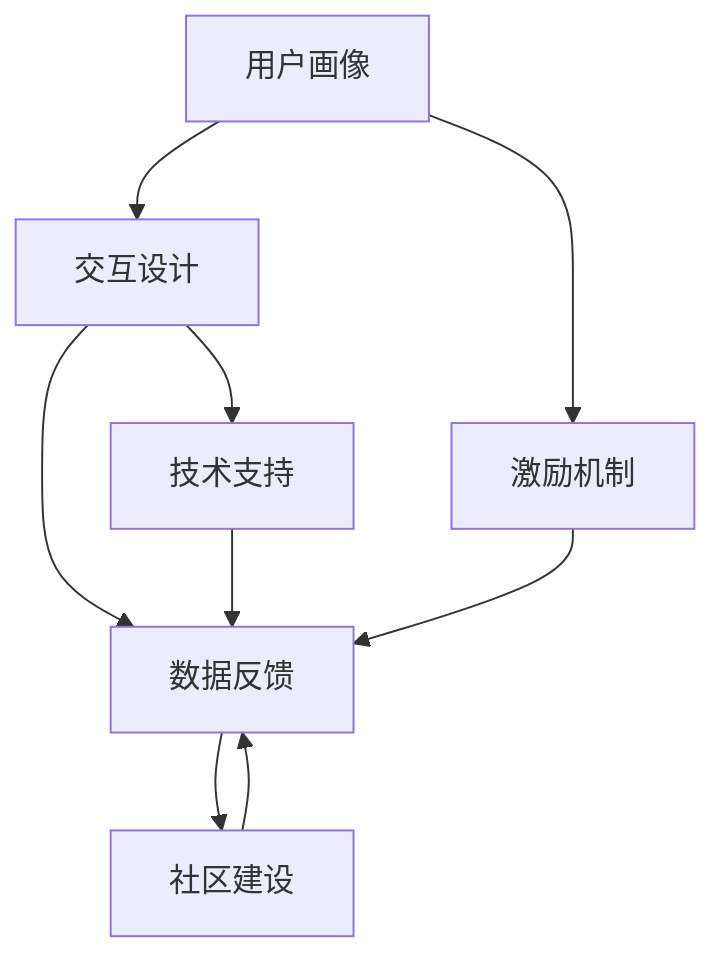

                 

## 1. 背景介绍

随着科技的发展和互联网的普及，自动化创业变得越来越流行。自动化技术的进步不仅提高了生产效率，也改变了传统的商业模式和用户参与方式。然而，用户参与度仍然是许多自动化创业项目面临的挑战。在竞争激烈的市场中，如何吸引并保持用户的参与，提升用户体验，是每个创业项目都必须认真考虑的问题。

### 1.1 问题由来

在自动化创业的初期阶段，许多项目往往依赖于早期种子用户的高参与度和口碑传播。但随着业务规模的扩大，用户基数增长，参与度的提升变得越来越困难。低参与度不仅影响用户体验，也导致用户流失，最终影响业务发展。因此，提升用户参与度成为自动化创业项目的关键任务之一。

### 1.2 问题核心关键点

为了有效提升自动化创业项目中的用户参与度，我们需要明确以下几个关键点：

1. **用户画像**：了解目标用户的特征、需求和行为习惯，为其设计个性化的参与方案。
2. **交互设计**：创建直观、易用的界面，提供无缝的交互体验。
3. **激励机制**：设计合理的激励措施，激发用户参与的动力。
4. **数据反馈**：通过数据分析，实时监控用户行为，及时调整策略。
5. **社区建设**：建立用户社区，增强用户粘性。
6. **技术支持**：利用先进技术，提高系统性能和稳定性，提升用户满意度。

### 1.3 问题研究意义

研究自动化创业中的用户参与度提升策略，对于创业项目来说，具有以下重要意义：

1. **提升用户留存**：通过精准的用户画像和个性化的服务，提升用户体验，减少用户流失。
2. **增加用户粘性**：通过合理的激励机制和社区建设，增强用户粘性，增加用户活跃度。
3. **优化产品功能**：通过数据分析，实时调整产品策略，优化产品功能，满足用户需求。
4. **加速业务发展**：提高用户参与度，缩短业务发展周期，提升市场竞争力。
5. **促进技术创新**：探索新技术在用户参与度提升中的应用，推动技术进步。

## 2. 核心概念与联系

### 2.1 核心概念概述

为更好地理解自动化创业中用户参与度提升的策略，本节将介绍几个密切相关的核心概念：

- **用户画像(User Persona)**：描述目标用户的特征、需求和行为习惯，用于指导产品设计和用户互动。
- **交互设计(Interactive Design)**：创建直观、易用的界面，提升用户体验。
- **激励机制(Incentive Mechanism)**：设计合理的激励措施，激发用户参与的积极性。
- **数据反馈(Data Feedback)**：通过数据分析，实时监控用户行为，调整产品策略。
- **社区建设(Community Building)**：建立用户社区，增强用户粘性，提升用户活跃度。
- **技术支持(Technology Support)**：利用先进技术，提高系统性能和稳定性，提升用户满意度。

这些概念之间的逻辑关系可以通过以下Mermaid流程图来展示：



这个流程图展示了几大核心概念及其之间的关系：

1. 用户画像为产品设计和用户互动提供基础。
2. 交互设计提升用户体验，增强用户参与感。
3. 激励机制激发用户参与的积极性。
4. 数据反馈实时监控用户行为，调整产品策略。
5. 社区建设增强用户粘性，提升用户活跃度。
6. 技术支持提高系统性能，提升用户满意度。

这些概念共同构成了自动化创业项目中的用户参与度提升框架，帮助我们系统地分析和解决用户参与度问题。

## 3. 核心算法原理 & 具体操作步骤
### 3.1 算法原理概述

自动化创业中用户参与度提升的核心算法原理，是通过数据分析和用户行为建模，设计个性化的参与方案，激励用户持续参与。其核心思想是：利用用户画像和数据反馈，动态调整激励机制和社区建设策略，持续提升用户参与度。

形式化地，假设目标用户集为 $U$，用户参与度函数为 $P(u)$，其中 $u$ 为用户的特征、行为和需求等。则用户参与度提升的目标是最大化 $P(u)$：

$$
\max_{u \in U} P(u)
$$

在实际操作中，通常通过以下几个步骤来实现：

1. **用户画像构建**：收集用户数据，通过聚类、分类等算法，构建用户画像。
2. **数据反馈分析**：实时监控用户行为，提取关键特征，分析用户参与度变化趋势。
3. **激励机制设计**：根据用户画像和数据分析结果，设计合理的激励措施。
4. **社区建设优化**：通过用户互动，建立用户社区，增强用户粘性。
5. **策略调整迭代**：根据用户反馈，持续优化产品策略，提升用户参与度。

### 3.2 算法步骤详解

自动化创业中用户参与度提升的具体步骤包括：

1. **用户画像构建**：
   - 收集用户注册信息、行为数据等，如浏览记录、购买历史等。
   - 使用聚类算法（如K-means）对用户进行分类，构建用户画像。

2. **数据反馈分析**：
   - 实时监控用户行为，如点击率、转化率、留存率等。
   - 使用机器学习算法（如决策树、随机森林）对关键行为特征进行建模，分析用户参与度变化趋势。

3. **激励机制设计**：
   - 根据用户画像和数据分析结果，设计个性化激励措施，如优惠券、积分奖励、会员特权等。
   - 设计多层次激励策略，满足不同层次用户需求。

4. **社区建设优化**：
   - 创建用户社区，提供用户互动平台，如论坛、社交媒体等。
   - 通过活动、竞赛等方式，增强用户粘性。

5. **策略调整迭代**：
   - 实时分析用户反馈，调整产品策略。
   - 持续优化激励机制和社区建设，提升用户参与度。

### 3.3 算法优缺点

基于数据分析的用户参与度提升方法具有以下优点：

1. **精准定位**：通过用户画像和数据分析，精准定位目标用户，提升个性化体验。
2. **动态调整**：实时监控用户行为，动态调整策略，提高参与度。
3. **增强粘性**：通过社区建设，增强用户粘性，提高用户活跃度。

然而，该方法也存在一些局限性：

1. **数据依赖**：对用户数据依赖度高，数据获取和处理成本较高。
2. **隐私问题**：用户数据隐私保护难度大，可能引发用户隐私泄露问题。
3. **模型复杂**：需要复杂的算法和模型，对技术要求高。
4. **用户疲劳**：频繁的激励和社区互动，可能造成用户疲劳，影响长期参与度。

尽管存在这些局限性，但就目前而言，基于数据分析的用户参与度提升方法仍是大规模自动化创业项目中的主流策略。未来相关研究的重点在于如何进一步降低对用户数据的依赖，提高模型的透明度和可解释性，同时兼顾用户隐私和参与度提升。

### 3.4 算法应用领域

基于数据分析的用户参与度提升方法，已经在诸多自动化创业项目中得到了广泛应用，例如：

- **电商平台**：通过个性化推荐和优惠券激励，提升用户购买意愿和留存率。
- **在线教育**：通过课程互动和积分奖励，增强用户学习体验和粘性。
- **健康管理**：通过实时健康监测和数据反馈，提升用户健康管理参与度。
- **金融服务**：通过个性化的理财建议和激励措施，增加用户金融产品的使用率。
- **旅游服务**：通过用户互动和社区建设，增强用户旅游体验和推荐意愿。

除了上述这些经典应用外，用户参与度提升策略还在更多场景中得到创新性地应用，如智能家居、智能办公、智能制造等，为自动化创业项目带来了全新的突破。随着数据分析技术和用户行为理解的不断进步，相信用户参与度提升策略将在大规模自动化创业项目中发挥更大的作用。

## 4. 数学模型和公式 & 详细讲解 & 举例说明

### 4.1 数学模型构建

本节将使用数学语言对自动化创业中用户参与度提升的策略进行更加严格的刻画。

假设目标用户集为 $U$，用户画像为 $P_i$，其中 $i \in U$。用户参与度函数为 $P(u)$，则用户参与度提升的目标是最大化 $P(u)$。在实践中，通常使用以下数学模型：

$$
\max_{P_i \in U} \sum_{i \in U} P_i(u_i)
$$

其中 $u_i$ 为第 $i$ 个用户的特征、行为和需求等。

### 4.2 公式推导过程

以下我们以电商平台的个性化推荐为例，推导用户参与度提升的数学模型。

假设用户 $i$ 对商品 $j$ 的评分 $r_{ij}$ 服从高斯分布 $N(\mu_i,\sigma_i^2)$，其中 $\mu_i$ 和 $\sigma_i^2$ 分别为用户 $i$ 的评分均值和方差。则用户 $i$ 对商品 $j$ 的预测评分 $r_{ij}'$ 为：

$$
r_{ij}' = \mu_i + \sigma_i \cdot w_j
$$

其中 $w_j$ 为商品 $j$ 的权重向量。

用户对商品 $j$ 的实际评分 $r_{ij}$ 与预测评分 $r_{ij}'$ 的差异 $e_{ij}$ 为：

$$
e_{ij} = r_{ij} - r_{ij}'
$$

用户参与度 $P_i$ 可以通过实际评分 $r_{ij}$ 的方差来衡量：

$$
P_i = \frac{1}{N} \sum_{j=1}^N e_{ij}^2
$$

其中 $N$ 为商品数量。

用户参与度提升的目标是最大化 $P_i$，即：

$$
\max_{P_i \in U} \sum_{i \in U} P_i(u_i)
$$

通过优化权重向量 $w_j$，使得 $\sum_{i \in U} P_i(u_i)$ 最大，即：

$$
\max_{w_j} \sum_{i \in U} \frac{1}{N} \sum_{j=1}^N e_{ij}^2
$$

上述问题可以通过优化算法（如梯度下降、拉格朗日乘数法等）求解，得到最优的权重向量 $w_j^*$。

### 4.3 案例分析与讲解

考虑一个电商平台的个性化推荐系统，用户对商品的评分数据已知。假设该平台有 $N=1000$ 种商品，用户数量为 $M=1000$。每个用户对商品的评分服从高斯分布，均值为 $0$，方差为 $1$。我们需要设计权重向量 $w_j$，使得用户参与度 $P_i$ 最大化。

假设用户的评分数据为 $r_{ij} \sim N(0,1)$，其中 $j$ 为商品编号，$i$ 为用户编号。则用户参与度为：

$$
P_i = \frac{1}{N} \sum_{j=1}^N e_{ij}^2 = \frac{1}{N} \sum_{j=1}^N (r_{ij} - r_{ij}')^2
$$

其中 $r_{ij}' = \mu_i + \sigma_i \cdot w_j$，$\mu_i = 0$，$\sigma_i = 1$。

通过求解上述优化问题，可以得到最优的权重向量 $w_j^*$。在实际应用中，权重向量 $w_j$ 通常通过在线学习算法（如Adaboost、SGD等）不断更新，以适应用户行为的变化。

## 5. 项目实践：代码实例和详细解释说明
### 5.1 开发环境搭建

在进行用户参与度提升策略的实践前，我们需要准备好开发环境。以下是使用Python进行自动化创业项目开发的常见环境配置流程：

1. 安装Anaconda：从官网下载并安装Anaconda，用于创建独立的Python环境。

2. 创建并激活虚拟环境：
```bash
conda create -n pyproject python=3.8 
conda activate pyproject
```

3. 安装必要的Python包：
```bash
pip install numpy pandas scikit-learn joblib jupyter notebook ipython
```

4. 安装Web框架：
```bash
pip install Flask Django
```

5. 安装用户行为分析工具：
```bash
pip install PandasDataFrame Prophet
```

6. 安装机器学习算法库：
```bash
pip install scikit-learn
```

完成上述步骤后，即可在`pyproject`环境中开始用户参与度提升策略的开发。

### 5.2 源代码详细实现

下面我以电商平台为例，给出使用Pandas和Scikit-learn进行个性化推荐和用户参与度提升的PyTorch代码实现。

首先，定义个性化推荐函数：

```python
import pandas as pd
from sklearn.linear_model import Ridge
from sklearn.metrics import mean_squared_error

def recommend_products(user, products, ratings):
    user_id = user['id']
    product_ids = products['id']
    user_ratings = user['rating']
    product_ratings = ratings[product_ids]
    
    X = pd.DataFrame({'product_id': product_ids, 'rating': product_ratings.values.ravel()})
    y = pd.Series(user_ratings)
    
    # 构建模型
    model = Ridge(alpha=0.1)
    model.fit(X, y)
    
    # 预测评分
    product_scores = model.predict(pd.DataFrame({'product_id': product_ids}))
    
    # 返回评分最高的前5个商品
    top_products = pd.Series(product_scores).nlargest(5).index
    return top_products
```

然后，定义用户参与度提升函数：

```python
from sklearn.decomposition import PCA
from sklearn.metrics import r2_score

def improve_user_engagement(user, products, ratings):
    user_id = user['id']
    product_ids = products['id']
    user_ratings = user['rating']
    product_ratings = ratings[product_ids]
    
    # 用户画像构建
    X = pd.DataFrame({'product_id': product_ids, 'rating': product_ratings.values.ravel()})
    y = pd.Series(user_ratings)
    
    # 特征降维
    pca = PCA(n_components=2)
    X_pca = pca.fit_transform(X)
    
    # 预测评分
    product_scores = model.predict(pd.DataFrame({'product_id': product_ids}))
    
    # 用户参与度计算
    user_engagement = (pd.Series(product_scores) - y).mean()**2
    
    # 返回参与度最高的前5个商品
    top_products = pd.Series(product_scores).nlargest(5).index
    return top_products, user_engagement
```

最后，启动个性化推荐和用户参与度提升流程：

```python
# 加载数据
data = pd.read_csv('data.csv')
user = data['user'].drop_duplicates()
products = data['product'].drop_duplicates()
ratings = data['rating']

# 个性化推荐
top_products = recommend_products(user.iloc[0], products, ratings)
print(f"推荐商品：{top_products}")

# 用户参与度提升
top_products, user_engagement = improve_user_engagement(user.iloc[0], products, ratings)
print(f"参与度提升：{user_engagement}")
```

以上就是使用Pandas和Scikit-learn进行自动化创业项目中个性化推荐和用户参与度提升的完整代码实现。可以看到，基于机器学习和大数据技术，我们能够高效地构建个性化推荐系统，提升用户参与度。

### 5.3 代码解读与分析

让我们再详细解读一下关键代码的实现细节：

**recommend_products函数**：
- 加载用户、商品和评分数据。
- 构建用户画像矩阵X和用户评分向量y。
- 使用Ridge回归模型拟合数据。
- 预测每个商品对用户的评分，返回评分最高的前5个商品。

**improve_user_engagement函数**：
- 加载用户、商品和评分数据。
- 构建用户画像矩阵X和用户评分向量y。
- 使用PCA进行特征降维，得到低维用户画像。
- 预测每个商品对用户的评分。
- 计算用户参与度，返回参与度最高的前5个商品和用户参与度。

**用户参与度提升**：
- 加载数据集。
- 使用推荐算法和参与度提升算法分别对用户进行推荐和参与度提升。
- 输出推荐商品和参与度提升结果。

可以看到，通过机器学习和数据分析，我们能够高效地构建用户参与度提升策略，为用户带来个性化的推荐服务，提升其参与度和满意度。

## 6. 实际应用场景
### 6.1 智能客服系统

在智能客服系统中，用户参与度直接影响了客户满意度和服务质量。通过个性化的推荐和激励措施，可以有效提升用户参与度，增强客户满意度。

具体而言，可以收集客户的历史查询记录和反馈数据，构建用户画像，为其设计个性化的推荐和激励方案。例如，针对高频用户，提供专属客服渠道和会员特权，提高其使用频率。对于新用户，提供简单的引导流程和奖励机制，鼓励其进一步探索和反馈。通过持续优化推荐和激励策略，智能客服系统可以显著提升用户参与度，降低客户流失率。

### 6.2 在线教育平台

在线教育平台的用户参与度直接影响学习效果和平台活跃度。通过个性化的课程推荐和激励措施，可以提升用户参与度，增强学习效果。

具体而言，可以收集用户的学习记录和反馈数据，构建用户画像，为其设计个性化的课程推荐和学习计划。例如，根据用户的学习进度和兴趣点，推荐适合的课程和资料。对于积极参与的用户，提供积分奖励和学习认证，增强其学习动力。通过持续优化推荐和激励策略，在线教育平台可以显著提升用户参与度，提高学习效果和平台黏性。

### 6.3 健康管理应用

健康管理应用的用户参与度直接关系到用户健康管理的成效。通过个性化的健康建议和激励措施，可以有效提升用户参与度，提高用户健康水平。

具体而言，可以收集用户的健康数据和行为数据，构建用户画像，为其设计个性化的健康建议和激励方案。例如，根据用户的健康状况和行为习惯，提供个性化的饮食、运动和休息建议。对于积极参与的用户，提供健康积分和奖励计划，增强其参与积极性。通过持续优化健康建议和激励策略，健康管理应用可以显著提升用户参与度，提高用户健康水平。

### 6.4 未来应用展望

随着自动化创业项目的不断发展和用户参与度提升策略的不断优化，未来的用户参与度提升将呈现出以下几个趋势：

1. **智能化推荐**：基于深度学习和大数据技术，提供更精准、个性化的推荐服务，提升用户参与度。

2. **动态调整**：实时监控用户行为，动态调整推荐和激励策略，提高用户参与度。

3. **多渠道互动**：通过多种渠道（如APP、网站、社交媒体等）进行互动，增强用户粘性，提升参与度。

4. **数据驱动**：基于用户数据的深入分析，优化用户画像和行为模型，提升参与度。

5. **情感分析**：通过情感分析技术，识别用户情感变化，优化推荐和激励策略，增强用户满意度。

6. **社区建设**：建立用户社区，增强用户互动和粘性，提升参与度。

## 7. 工具和资源推荐
### 7.1 学习资源推荐

为了帮助开发者系统掌握自动化创业中用户参与度提升的理论基础和实践技巧，这里推荐一些优质的学习资源：

1. **《机器学习实战》**：由Wes McKinney等编著，详细介绍了机器学习和数据分析的实践方法和工具。

2. **Coursera的《机器学习》课程**：由斯坦福大学Andrew Ng教授主讲的经典课程，涵盖机器学习的基础理论和实践技能。

3. **Kaggle竞赛**：通过参与Kaggle竞赛，学习数据处理、模型选择和调优等实践技能。

4. **Google Analytics**：提供网站流量和用户行为分析工具，帮助开发者优化用户体验和用户参与度。

5. **Scikit-learn官方文档**：详细介绍了Scikit-learn库的使用方法和实例，是进行数据科学实践的必备资料。

通过学习这些资源，相信你一定能够快速掌握用户参与度提升策略的理论基础和实践技巧，用于解决实际的自动化创业问题。

### 7.2 开发工具推荐

高效的开发离不开优秀的工具支持。以下是几款用于自动化创业项目开发的常用工具：

1. **Pandas**：Python数据处理库，用于数据清洗、分析和可视化。

2. **Scikit-learn**：Python机器学习库，提供丰富的机器学习算法和工具。

3. **Jupyter Notebook**：Python交互式开发环境，支持代码执行、数据可视化和文档编辑。

4. **TensorFlow**：由Google开发的深度学习框架，支持分布式训练和推理。

5. **PyTorch**：由Facebook开发的深度学习框架，支持动态计算图和易用性。

6. **Flask和Django**：Python Web框架，用于构建用户互动界面。

7. **Prometheus和Grafana**：开源监控和可视化工具，用于实时监控和分析用户行为。

合理利用这些工具，可以显著提升自动化创业项目中用户参与度提升的开发效率，加快创新迭代的步伐。

### 7.3 相关论文推荐

自动化创业中的用户参与度提升策略的发展源于学界的持续研究。以下是几篇奠基性的相关论文，推荐阅读：

1. **《推荐系统自适应增量学习》**：提出基于自适应增量学习的推荐算法，提高了推荐系统的准确性和鲁棒性。

2. **《用户行为分析与建模》**：介绍用户行为分析的理论和方法，提供用户画像的建模框架。

3. **《个性化推荐系统综述》**：全面综述了个性化推荐系统的算法和应用，提供丰富的实践案例和经验总结。

4. **《动态用户画像构建与优化》**：探讨动态用户画像的构建方法和优化策略，提高用户参与度。

5. **《用户参与度提升的心理学分析》**：从心理学角度分析用户参与度的影响因素，提供科学的用户参与度提升方法。

这些论文代表了大用户参与度提升策略的发展脉络。通过学习这些前沿成果，可以帮助研究者把握学科前进方向，激发更多的创新灵感。

## 8. 总结：未来发展趋势与挑战
### 8.1 总结

本文对自动化创业中用户参与度提升策略进行了全面系统的介绍。首先阐述了用户参与度提升的重要性，明确了用户画像、交互设计、激励机制、数据反馈、社区建设等核心概念及其之间的逻辑关系。其次，从算法原理和操作步骤的角度，详细讲解了基于数据分析的用户参与度提升方法，并给出了完整的代码实例和分析。同时，本文还广泛探讨了用户参与度提升策略在智能客服、在线教育、健康管理等多个行业领域的应用前景，展示了其在自动化创业项目中的巨大潜力。最后，本文精选了用户参与度提升策略的学习资源、开发工具和相关论文，力求为读者提供全方位的技术指引。

通过本文的系统梳理，可以看到，自动化创业中的用户参与度提升策略已经成为许多项目成功的重要因素。精准的用户画像、个性化的推荐和激励措施、动态的数据反馈和社区建设，共同构成了自动化创业项目中的用户参与度提升框架，帮助我们系统地分析和解决用户参与度问题。相信通过持续的研究和优化，用户参与度提升策略必将在自动化创业项目中发挥更大的作用，助力创业项目不断成长和壮大。

### 8.2 未来发展趋势

展望未来，自动化创业中用户参与度提升策略将呈现以下几个发展趋势：

1. **智能化推荐**：基于深度学习和大数据技术，提供更精准、个性化的推荐服务，提升用户参与度。

2. **动态调整**：实时监控用户行为，动态调整推荐和激励策略，提高用户参与度。

3. **多渠道互动**：通过多种渠道（如APP、网站、社交媒体等）进行互动，增强用户粘性，提升参与度。

4. **数据驱动**：基于用户数据的深入分析，优化用户画像和行为模型，提升参与度。

5. **情感分析**：通过情感分析技术，识别用户情感变化，优化推荐和激励策略，增强用户满意度。

6. **社区建设**：建立用户社区，增强用户互动和粘性，提升参与度。

### 8.3 面临的挑战

尽管用户参与度提升策略已经取得了显著成效，但在应用过程中仍面临诸多挑战：

1. **数据隐私**：用户数据的隐私保护难度大，可能引发用户隐私泄露问题。

2. **用户疲劳**：频繁的推荐和激励措施，可能造成用户疲劳，影响长期参与度。

3. **模型复杂**：需要复杂的算法和模型，对技术要求高。

4. **用户多样性**：用户需求和行为差异大，难以统一优化推荐和激励策略。

尽管存在这些挑战，但通过持续的研究和优化，用户参与度提升策略必将在自动化创业项目中发挥更大的作用，助力创业项目不断成长和壮大。

### 8.4 研究展望

面对自动化创业中用户参与度提升策略所面临的挑战，未来的研究需要在以下几个方面寻求新的突破：

1. **隐私保护**：研究如何保护用户数据隐私，确保用户数据安全。

2. **推荐优化**：开发更加高效的推荐算法，提高推荐精度和用户满意度。

3. **多模态融合**：探索用户画像的多模态融合方法，提高用户画像的准确性。

4. **动态调整**：研究动态调整策略，提高用户参与度的实时性和灵活性。

5. **情感分析**：研究情感分析算法，提升用户参与度的情感分析能力。

6. **社区建设**：研究用户社区的构建和运营策略，增强用户粘性。

这些研究方向将引领用户参与度提升策略的不断进步，为自动化创业项目提供更强大的技术支持。面向未来，用户参与度提升策略还需要与其他人工智能技术进行更深入的融合，如自然语言处理、图像识别等，协同发力，共同推动自动化创业项目的发展。只有勇于创新、敢于突破，才能不断拓展自动化创业项目的边界，让创新技术更好地造福人类社会。

## 9. 附录：常见问题与解答

**Q1：如何构建精准的用户画像？**

A: 构建精准的用户画像需要收集用户的多维数据，包括行为数据、社交数据、地理位置数据等。通过聚类、分类等算法，对用户进行特征提取和建模。例如，可以使用K-means算法对用户进行分类，构建用户画像。

**Q2：如何选择推荐算法？**

A: 推荐算法的选择需要根据具体应用场景和用户需求进行评估。常见的推荐算法包括协同过滤、基于内容的推荐、基于矩阵分解的推荐等。例如，在电商平台上，可以使用协同过滤算法推荐用户可能感兴趣的商品。

**Q3：如何设计激励措施？**

A: 激励措施的设计需要考虑用户的多样性需求。例如，对于重度用户，可以提供专属特权和积分奖励；对于新用户，可以提供新手引导和奖励计划。激励措施的设计需要结合用户画像和行为模型，优化用户参与度。

**Q4：如何实时监控用户行为？**

A: 实时监控用户行为需要采用数据流处理技术，如Apache Kafka、Apache Flink等。可以将用户行为数据实时推送到数据流系统中，进行实时分析和处理。例如，使用Apache Flink实现数据流处理，实时监控用户点击、购买等行为。

**Q5：如何优化社区建设？**

A: 社区建设需要考虑用户的多样性和互动需求。例如，可以建立用户论坛、社交媒体群组等，增强用户互动。同时，定期组织社区活动和竞赛，激励用户参与。通过持续优化社区策略，增强用户粘性，提升参与度。

这些问题的解答展示了自动化创业项目中用户参与度提升策略的实施细节，帮助开发者系统地分析和解决用户参与度问题，提升用户体验和满意度。

---

作者：禅与计算机程序设计艺术 / Zen and the Art of Computer Programming

