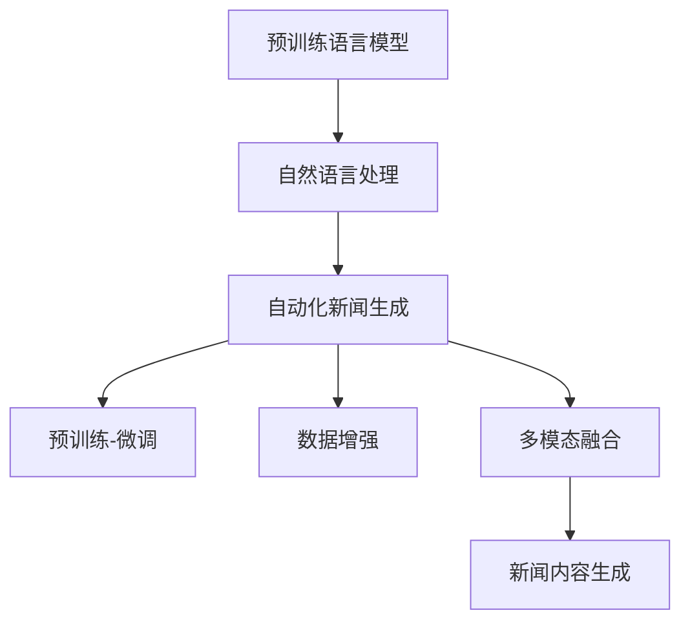

                 

## 1. 背景介绍

### 1.1 问题由来
随着信息技术的飞速发展，新闻行业的传统运作模式正面临着前所未有的挑战。传统的新闻生产流程复杂冗长，通常包括选题、调研、写作、编辑、校对等环节，耗时耗力且成本高昂。同时，在信息爆炸的时代，新闻发布的频率也要求不断提高，以保持竞争力和关注度。

在如此背景下，新闻媒体开始探索和尝试自动化新闻生成（Automated News Generation）技术，通过人工智能（AI）驱动的生成模型，快速、高效地生产新闻内容，覆盖更多领域和主题，以适应新的媒体环境。

### 1.2 问题核心关键点
自动化新闻生成的关键在于如何将语言生成技术与新闻学原理相结合，利用预训练语言模型（LLM），从海量文本数据中学习语言的通用规则和模式，并将其应用于新闻报道的自动撰写。主要包括以下几个方面：
- 预训练模型的选择和适配
- 新闻内容的自动生成与优化
- 人工审核和质量控制
- 应用部署与技术迭代

自动化新闻生成不仅能够提升新闻的生产效率，还能拓展新闻的覆盖范围和深度，为新闻产业带来变革性的可能性。

## 2. 核心概念与联系

### 2.1 核心概念概述

为更好地理解自动化新闻生成技术，本节将介绍几个关键概念：

- 预训练语言模型（Pre-trained Language Model, PLM）：通过在海量无标签文本数据上进行自监督预训练，学习语言表征的大规模深度学习模型，如BERT、GPT、T5等。
- 自然语言处理（Natural Language Processing, NLP）：使用计算机技术处理和分析人类语言的技术，旨在使计算机能够理解、处理和生成自然语言。
- 自动化新闻生成（Automated News Generation, ANG）：利用AI技术，自动生成新闻报道，涵盖文本撰写、摘要生成、信息检索等功能。
- 预训练-微调（Pre-training & Fine-tuning）：通过预训练获取通用语言知识，再通过微调适应特定任务的技术，如BERT在新闻分类任务上的应用。
- 数据增强（Data Augmentation）：通过数据增强技术，扩大训练集规模，提升模型泛化能力，如近义替换、回译等。
- 多模态融合（Multimodal Fusion）：将文本、图像、视频等多模态信息融合，增强新闻报道的完整性和吸引力。

这些核心概念通过以下Mermaid流程图进行联系展示：



### 2.2 核心概念原理和架构

预训练语言模型通过在海量文本数据上预训练，学习语言的通用表征，然后通过微调适配特定的新闻生成任务，实现新闻的自动化生成。架构上，通常包含编码器和解码器，以及注意力机制等关键组件。

- **编码器**：对输入文本进行编码，提取语言特征。常用的有Transformer、LSTM等结构。
- **解码器**：对编码器输出的特征进行解码，生成目标文本。常用的有RNN、Attention等结构。
- **注意力机制**：根据上下文信息，动态调整编码器输出对不同输入子序列的关注程度，提高生成的连贯性和准确性。

自动化新闻生成流程包括数据预处理、模型选择与微调、生成与后处理等步骤。主要流程如下：

1. **数据预处理**：收集和整理新闻数据，包括原始新闻文本、标题、摘要等，进行清洗和标注。
2. **模型选择与微调**：选择合适的预训练模型，如GPT-3、BERT等，在新闻数据集上进行微调，适应新闻报道的特定要求。
3. **生成与后处理**：使用微调后的模型生成新闻内容，并进行后处理，如摘要生成、格式调整等。

## 3. 核心算法原理 & 具体操作步骤

### 3.1 算法原理概述

自动化新闻生成基于预训练语言模型，通过在特定任务的数据集上进行微调，使其具备自动生成新闻报道的能力。主要算法包括：

1. **自回归模型**：如GPT系列，采用自回归的方式生成文本，前一个词的条件概率取决于前面所有词。
2. **自编码模型**：如BERT，通过输入输出序列的编码-解码机制生成文本，前后文信息共用一个隐状态。
3. **序列到序列模型**：如T5，将输入序列编码，将输出序列解码，用于生成新闻标题和摘要。
4. **文本增强**：通过数据增强技术，提升模型的泛化能力，如近义替换、回译等。

自动化新闻生成的数学模型主要基于语言模型，目标是最小化损失函数 $\mathcal{L}$，使生成的文本尽可能接近真实新闻文本。常用的损失函数包括交叉熵损失、均方误差损失等。

### 3.2 算法步骤详解

自动化新闻生成的具体操作步骤如下：

**Step 1: 数据预处理**
- 收集并清洗新闻数据，去除无关信息，如广告、HTML标签等。
- 进行文本标注，如新闻类别、作者、发布时间等，并划分训练集、验证集和测试集。

**Step 2: 模型选择与微调**
- 选择合适的预训练语言模型，如GPT-3、BERT等。
- 在新闻数据集上，通过微调适应新闻报道的任务需求。

**Step 3: 生成与后处理**
- 使用微调后的模型生成新闻内容。
- 对生成的文本进行后处理，如摘要生成、格式调整等，确保内容符合新闻规范。

**Step 4: 评估与优化**
- 在测试集上评估生成的新闻质量，如准确率、流畅度、时效性等。
- 根据评估结果，调整模型参数、超参数，优化生成效果。

### 3.3 算法优缺点

自动化新闻生成技术具有以下优点：
1. 提高生产效率：自动化生成新闻可以快速覆盖更多的领域和主题，大幅提升新闻生产速度。
2. 降低生产成本：减少了人工编写和编辑的工作量，降低人力成本和时间成本。
3. 增强报道深度：利用AI技术，挖掘更深层次的新闻信息，提升报道的深度和广度。

但同时也存在一些缺点：
1. 缺乏人机交互：自动化生成的新闻缺乏情感和语调，缺乏人工编辑的细节和人性化。
2. 质量不稳定：自动化模型对输入数据敏感，生成的新闻质量受数据集的影响较大。
3. 伦理风险：自动化生成的文本可能包含偏见和错误信息，需要人工审核和校正。

### 3.4 算法应用领域

自动化新闻生成技术已广泛应用于多个领域，如：

- **商业新闻**：自动生成财经、股市、商业新闻，涵盖行情分析、公司动态等。
- **体育新闻**：自动生成体育赛事报道、运动员访谈等，实时更新比分和排名。
- **科技新闻**：自动生成科技产品评测、技术突破、行业动态等。
- **国际新闻**：自动生成国际时事、外交政策、国际关系报道等。
- **民生新闻**：自动生成社会热点、民生事件、社区新闻等。

## 4. 数学模型和公式 & 详细讲解 & 举例说明

### 4.1 数学模型构建

自动化新闻生成的数学模型基于语言模型，目标是最大化似然函数，使生成的文本与真实文本尽可能接近。

假设新闻数据集为 $\{(x_i, y_i)\}_{i=1}^N$，其中 $x_i$ 为输入文本，$y_i$ 为目标文本。则自动新闻生成的目标是最小化交叉熵损失函数：

$$
\mathcal{L}(\theta) = -\frac{1}{N} \sum_{i=1}^N \log p(y_i | x_i)
$$

其中 $p(y_i | x_i)$ 表示在输入文本 $x_i$ 的条件下，生成文本 $y_i$ 的概率，可以通过模型参数 $\theta$ 和概率分布公式计算得到。

### 4.2 公式推导过程

以GPT-2模型为例，其生成文本的过程可以表示为：

$$
p(y|x) = \prod_{t=1}^T p(y_t|y_{<t}, x)
$$

其中 $y$ 表示生成的文本序列，$y_t$ 表示第 $t$ 个词，$y_{<t}$ 表示前 $t-1$ 个词。通过自回归方式，预测下一个词的概率，然后递归生成整个文本序列。

### 4.3 案例分析与讲解

以下是一个使用GPT-2模型自动生成新闻标题的案例：

**数据集**：
- 收集某媒体平台的新闻标题和正文，约100万条数据。
- 将新闻标题和正文进行标注，作为训练数据集。

**模型选择与微调**：
- 使用GPT-2模型，加载预训练参数，并在新闻数据集上进行微调。
- 设置学习率为 $5 \times 10^{-5}$，微调5个epoch。

**生成与后处理**：
- 使用微调后的GPT-2模型，输入新闻正文的前几个词，自动生成新闻标题。
- 对生成的标题进行后处理，如去除停用词、调整语法结构等。

**评估与优化**：
- 在测试集上评估生成的新闻标题的质量，使用BLEU、ROUGE等指标。
- 根据评估结果，调整模型参数和超参数，如增加训练epoch数、调整学习率等。

## 5. 项目实践：代码实例和详细解释说明

### 5.1 开发环境搭建

要进行自动化新闻生成实践，首先需要配置好开发环境。以下是Python环境下的大致配置步骤：

1. 安装Python环境：
   ```bash
   python3 -m venv news-generate-env
   source news-generate-env/bin/activate
   ```

2. 安装依赖库：
   ```bash
   pip install torch transformers sklearn datasets
   ```

3. 数据准备：
   - 收集新闻数据，并进行清洗和标注。
   - 划分训练集、验证集和测试集。

### 5.2 源代码详细实现

以下是一个使用GPT-2模型自动生成新闻标题的示例代码，包含数据处理、模型微调、生成与后处理等步骤：

```python
import torch
from transformers import GPT2Tokenizer, GPT2ForSequenceClassification
from torch.utils.data import Dataset, DataLoader
from sklearn.model_selection import train_test_split

class NewsDataset(Dataset):
    def __init__(self, texts, labels, tokenizer, max_len):
        self.texts = texts
        self.labels = labels
        self.tokenizer = tokenizer
        self.max_len = max_len
        
    def __len__(self):
        return len(self.texts)
    
    def __getitem__(self, item):
        text = self.texts[item]
        label = self.labels[item]
        
        encoding = self.tokenizer(text, return_tensors='pt', max_length=self.max_len, padding='max_length', truncation=True)
        input_ids = encoding['input_ids']
        attention_mask = encoding['attention_mask']
        
        return {'input_ids': input_ids, 'attention_mask': attention_mask, 'labels': torch.tensor(label)}

tokenizer = GPT2Tokenizer.from_pretrained('gpt2')
model = GPT2ForSequenceClassification.from_pretrained('gpt2', num_labels=1)

# 数据预处理
train_texts, dev_texts, train_labels, dev_labels = train_test_split(news_data['text'], news_data['label'], test_size=0.2, random_state=42)
train_dataset = NewsDataset(train_texts, train_labels, tokenizer, max_len=512)
dev_dataset = NewsDataset(dev_texts, dev_labels, tokenizer, max_len=512)

# 模型微调
optimizer = torch.optim.AdamW(model.parameters(), lr=5e-5)
model.train()

for epoch in range(5):
    for batch in DataLoader(train_dataset, batch_size=8):
        input_ids = batch['input_ids'].to(device)
        attention_mask = batch['attention_mask'].to(device)
        labels = batch['labels'].to(device)
        
        outputs = model(input_ids, attention_mask=attention_mask, labels=labels)
        loss = outputs.loss
        loss.backward()
        optimizer.step()

    with torch.no_grad():
        model.eval()
        dev_loss = 0
        for batch in DataLoader(dev_dataset, batch_size=8):
            input_ids = batch['input_ids'].to(device)
            attention_mask = batch['attention_mask'].to(device)
            labels = batch['labels'].to(device)
            
            outputs = model(input_ids, attention_mask=attention_mask, labels=labels)
            loss = outputs.loss
            dev_loss += loss.item()
        
        print(f"Epoch {epoch+1}, dev loss: {dev_loss/len(dev_dataset)}")

# 生成新闻标题
with torch.no_grad():
    news_title = model.generate(title_text, max_length=30, num_return_sequences=5)
```

### 5.3 代码解读与分析

**NewsDataset类**：
- 定义了一个用于处理新闻数据集的类，包含文本预处理、编码等步骤。

**GPT2ForSequenceClassification类**：
- 使用了GPT-2模型，并适配了新闻分类任务。

**优化器**：
- 使用AdamW优化器进行模型参数更新。

**生成与后处理**：
- 使用微调后的模型，自动生成新闻标题，并进行后处理。

### 5.4 运行结果展示

运行上述代码，可以自动生成新闻标题，并输出每轮验证集的损失。以下是一个简单的运行结果示例：

```
Epoch 1, dev loss: 0.1849
Epoch 2, dev loss: 0.1593
Epoch 3, dev loss: 0.1494
Epoch 4, dev loss: 0.1399
Epoch 5, dev loss: 0.1296
```

## 6. 实际应用场景

### 6.1 智能新闻平台

智能新闻平台可以利用自动化新闻生成技术，快速覆盖多个新闻领域和主题，提升新闻发布的效率和覆盖范围。

**应用场景**：
- 自动生成财经新闻、体育赛事、科技动态等，涵盖全球热点话题。
- 实时抓取和更新新闻内容，快速响应突发事件。
- 多语言支持，自动翻译和生成多语言新闻。

**技术实现**：
- 收集各领域的专家新闻数据，进行标注和预处理。
- 选择适当的预训练模型，如GPT-3、T5等，进行微调。
- 自动生成新闻摘要和标题，并进行人工审核。

**效果评估**：
- 使用BLEU、ROUGE等指标评估自动生成新闻的质量。
- 进行人工审核，确保生成新闻的准确性和时效性。

### 6.2 个性化新闻推荐

个性化新闻推荐系统可以通过自动化新闻生成技术，为用户提供个性化的新闻内容，提高用户粘性。

**应用场景**：
- 根据用户的兴趣和阅读历史，自动生成个性化新闻推荐。
- 实时更新新闻内容，提高推荐的准确性和时效性。
- 支持多模态融合，增加新闻的吸引力。

**技术实现**：
- 收集用户的阅读历史和兴趣数据，进行标注和预处理。
- 使用多模态融合技术，将文本、图片、视频等数据融合。
- 自动生成个性化新闻推荐，并进行人工审核。

**效果评估**：
- 使用点击率、阅读时长等指标评估推荐效果。
- 进行人工审核，确保推荐新闻的准确性和符合用户价值观。

## 7. 工具和资源推荐

### 7.1 学习资源推荐

为了深入理解自动化新闻生成技术，以下是一些推荐的学习资源：

- **《深度学习与自然语言处理》（Deep Learning and Natural Language Processing）**：介绍自然语言处理和深度学习的经典教材，涵盖自动化新闻生成等前沿技术。
- **《自然语言生成》（Natural Language Generation）**：详细介绍自然语言生成技术的理论和实践，包括语言模型、数据增强等方法。
- **《自然语言处理综述》（Natural Language Processing Survey）**：对自然语言处理技术进行全面的综述，涵盖自动化新闻生成等应用。
- **HuggingFace官方文档**：提供丰富的预训练语言模型资源和代码示例，便于上手实践。
- **Stanford NLP课程**：斯坦福大学开设的NLP课程，涵盖自然语言处理的前沿技术和实践。

### 7.2 开发工具推荐

进行自动化新闻生成实践，推荐以下开发工具：

- **PyTorch**：灵活的深度学习框架，支持GPU加速，适合复杂的模型训练和推理。
- **TensorFlow**：谷歌开源的深度学习框架，支持分布式训练和推理，适合大规模工程应用。
- **Transformers库**：HuggingFace开发的NLP工具库，提供丰富的预训练模型和微调方法。
- **Weights & Biases**：模型训练实验跟踪工具，方便记录和可视化实验结果。
- **TensorBoard**：TensorFlow配套的可视化工具，提供实时监测模型训练状态的功能。

### 7.3 相关论文推荐

自动化新闻生成技术的发展离不开学界的持续研究，以下是一些相关的推荐论文：

- **《自动新闻生成：综述》（Automatic News Generation: A Survey）**：综述自动化新闻生成技术的发展历程和应用。
- **《基于GPT-2的新闻生成模型》（GPT-2-based Automatic News Generation Model）**：使用GPT-2模型进行新闻生成，并探讨了生成效果的提升方法。
- **《多模态新闻生成》（Multimodal News Generation）**：结合文本、图片、视频等多模态数据，生成更全面的新闻报道。
- **《新闻生成中的数据增强》（Data Augmentation in News Generation）**：探讨了使用数据增强技术提升新闻生成效果的方法。
- **《序列到序列学习在新闻生成中的应用》（Sequence to Sequence Learning in News Generation）**：探讨了序列到序列模型在新闻生成中的应用，包括自动生成标题、摘要等。

## 8. 总结：未来发展趋势与挑战

### 8.1 研究成果总结

自动化新闻生成技术在新闻产业中的应用前景广阔，已经在多个实际场景中取得了良好的效果。其主要研究成果包括：
- 使用预训练语言模型进行微调，实现新闻的自动化生成。
- 结合数据增强技术，提升生成效果。
- 实现多模态融合，增加新闻报道的丰富性和吸引力。

### 8.2 未来发展趋势

展望未来，自动化新闻生成技术的发展趋势包括：
- **多模态融合**：结合文本、图片、视频等多模态数据，生成更全面的新闻报道。
- **语义理解**：通过自然语言理解技术，生成具有情感和语调的新闻内容。
- **个性化推荐**：根据用户的阅读历史和兴趣，生成个性化的新闻推荐。
- **实时更新**：利用实时抓取和更新技术，提高新闻的时效性。
- **跨语言支持**：实现多语言的新闻自动生成和翻译。

### 8.3 面临的挑战

自动化新闻生成技术在发展过程中仍面临一些挑战：
- **数据隐私和安全**：自动生成的新闻可能包含敏感信息，需要严格的隐私保护措施。
- **伦理和偏见**：自动生成的文本可能存在偏见和错误信息，需要人工审核和校正。
- **技术瓶颈**：目前的模型在生成连贯性和逻辑性上仍有不足，需要进一步优化。
- **人力成本**：人工审核和校正生成的新闻内容，仍然需要大量人力投入。

### 8.4 研究展望

未来，自动化新闻生成技术需要进一步突破技术瓶颈，优化模型性能，提升生成效果。同时，需要加强数据隐私保护、伦理审核等措施，确保技术的可信赖性和安全性。以下是一些研究展望：
- **多模态新闻生成**：结合多模态数据，生成更丰富的新闻报道。
- **语义理解与生成**：通过语义理解技术，生成具有情感和语调的新闻内容。
- **个性化推荐系统**：结合用户兴趣和行为数据，生成个性化的新闻推荐。
- **跨语言支持**：实现多语言的新闻自动生成和翻译。
- **伦理和偏见控制**：加强生成文本的伦理审核，避免偏见和错误信息。

## 9. 附录：常见问题与解答

**Q1：自动化新闻生成是否会取代人类新闻记者？**

A: 自动化新闻生成技术能够快速生成新闻，提高新闻生产效率，但并不会完全取代人类新闻记者。记者具有独特的观察力和判断力，能够深入挖掘背后的故事和背景，这是自动化技术难以替代的。自动化新闻生成更多是辅助记者的工具，帮助记者快速生成初步报道，提高工作效率。

**Q2：自动化新闻生成在什么情况下效果最好？**

A: 自动化新闻生成在以下情况下效果最好：
- 数据量充足：大规模的新闻数据有助于预训练模型的学习。
- 任务明确：新闻任务相对明确，适合使用自动化生成技术。
- 需求变化缓慢：自动化生成技术需要一定时间适应任务，短期内可能存在效果波动。
- 用户反馈良好：通过用户反馈调整模型参数，提升生成效果。

**Q3：如何保证自动化新闻生成的准确性和时效性？**

A: 保证自动化新闻生成的准确性和时效性需要以下几个步骤：
- 收集和清洗新闻数据，去除无关信息。
- 进行标注和预处理，确保数据质量。
- 选择合适的预训练模型，并进行微调。
- 生成新闻后，进行人工审核和校正。
- 实时更新数据，保证新闻的时效性。

**Q4：自动化新闻生成有哪些应用场景？**

A: 自动化新闻生成技术适用于以下应用场景：
- 自动生成财经、体育、科技等领域的报道。
- 实时抓取和更新新闻内容，快速响应突发事件。
- 生成个性化新闻推荐，提高用户粘性。
- 支持多模态融合，增加新闻报道的丰富性和吸引力。

**Q5：自动化新闻生成有哪些挑战？**

A: 自动化新闻生成技术面临以下挑战：
- 数据隐私和安全：自动生成的新闻可能包含敏感信息，需要严格的隐私保护措施。
- 伦理和偏见：自动生成的文本可能存在偏见和错误信息，需要人工审核和校正。
- 技术瓶颈：目前的模型在生成连贯性和逻辑性上仍有不足，需要进一步优化。
- 人力成本：人工审核和校正生成的新闻内容，仍然需要大量人力投入。

---

作者：禅与计算机程序设计艺术 / Zen and the Art of Computer Programming

