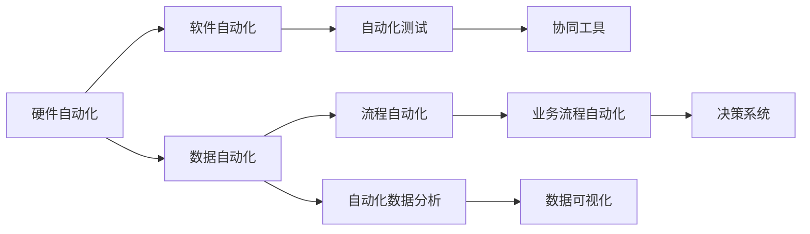

                 

## 1. 背景介绍

在数字化、信息化时代，自动化技术逐步渗透到各个领域，从制造业到服务业，从医疗到教育，自动化无处不在。随着人工智能、大数据、物联网等技术的兴起，自动化领域进入了智能化、自动化、高效化发展的快车道。本文将从自动化领域的最新发展趋势入手，介绍其核心概念与联系、核心算法原理与操作步骤，并提供相关学习资源和工具推荐，以期为从事自动化技术开发和应用的读者提供参考。

## 2. 核心概念与联系

### 2.1 核心概念概述

自动化技术是利用各种工具和设备，通过预先设定的规则或算法，自动完成重复性、可预测性任务的过程。它包括硬件自动化、软件自动化、数据自动化和流程自动化等多个方面。

- **硬件自动化**：利用机器人、传感器、自动化设备等硬件设备，完成自动装配、自动化生产线等任务。
- **软件自动化**：通过自动化脚本、自动化测试工具、自动化流程管理系统等软件工具，完成自动测试、自动部署、自动运维等任务。
- **数据自动化**：通过自动化数据处理工具、自动化数据分析工具、自动化数据可视化工具等，完成数据采集、数据清洗、数据分析等任务。
- **流程自动化**：利用业务流程自动化软件、自动化决策系统、自动化协同工具等，完成业务流程自动化、决策自动化、协作自动化等任务。

这些自动化技术之间互相联系，共同构成了自动化领域的核心内容。通过整合各种自动化技术，可以构建出更加高效、智能、灵活的自动化解决方案。

### 2.2 核心概念原理和架构的 Mermaid 流程图



该流程图展示了自动化技术之间的联系与整合，硬件自动化为软件自动化提供了基础，数据自动化为流程自动化提供了支撑，软件自动化和流程自动化进一步推动了自动化应用的发展。

## 3. 核心算法原理 & 具体操作步骤

### 3.1 算法原理概述

自动化领域的技术发展离不开算法的支持。算法是自动化解决方案的核心，其原理通常基于数学模型和计算机算法，通过解决特定问题，实现自动化功能。

自动化算法主要包括以下几个方向：

- **机器学习算法**：如监督学习、非监督学习、强化学习等，用于处理数据、识别模式、预测结果等。
- **优化算法**：如线性规划、非线性规划、遗传算法等，用于优化决策变量、提升系统效率等。
- **控制算法**：如PID控制、自适应控制、模糊控制等，用于实现自动控制系统，保证系统的稳定性和可靠性。
- **自然语言处理算法**：如文本分类、命名实体识别、情感分析等，用于处理文本数据、提取信息等。

### 3.2 算法步骤详解

以机器学习算法为例，其操作步骤如下：

**Step 1: 数据预处理**

- 收集数据集，并进行数据清洗、归一化等预处理操作。
- 使用特征提取技术，将原始数据转换为算法可以处理的特征向量。

**Step 2: 模型训练**

- 选择合适的机器学习算法，如决策树、神经网络、支持向量机等。
- 将预处理后的数据分为训练集和测试集，使用训练集训练模型，优化模型参数。
- 使用测试集评估模型性能，选择合适的模型进行部署。

**Step 3: 模型部署与优化**

- 将训练好的模型部署到实际系统中，完成自动化任务。
- 使用监控工具实时监测模型性能，根据需求进行模型调优。

### 3.3 算法优缺点

机器学习算法在自动化领域的应用广泛，但同样存在一些缺点：

- **数据依赖性高**：模型效果依赖于数据的质量和数量，数据质量不佳可能导致模型泛化能力差。
- **计算资源消耗大**：大规模数据集和高维度特征的训练，需要大量的计算资源和时间。
- **模型复杂度高**：复杂的模型结构可能导致模型过拟合，降低模型的泛化能力。

### 3.4 算法应用领域

机器学习算法在自动化领域的应用非常广泛，主要包括以下几个方面：

- **智能制造**：利用机器学习算法优化生产流程、预测设备故障、提高生产效率等。
- **智能客服**：利用机器学习算法处理客户咨询、自动回答、提高服务质量等。
- **智能交通**：利用机器学习算法进行交通流量预测、智能交通控制、提升交通效率等。
- **智能物流**：利用机器学习算法优化配送路线、预测货物到达时间、提升配送效率等。

## 4. 数学模型和公式 & 详细讲解 & 举例说明

### 4.1 数学模型构建

自动化领域中的许多算法都建立在数学模型的基础上。以线性回归模型为例，其数学模型为：

$$ y = \beta_0 + \beta_1 x_1 + \beta_2 x_2 + \ldots + \beta_n x_n + \epsilon $$

其中 $y$ 为预测结果，$x_i$ 为输入特征，$\beta_i$ 为模型参数，$\epsilon$ 为误差项。

### 4.2 公式推导过程

以线性回归模型的最小二乘法为例，其公式推导过程如下：

$$ \min_{\beta} \sum_{i=1}^n (y_i - (\beta_0 + \beta_1 x_{i1} + \ldots + \beta_n x_{in}))^2 $$

通过求解该最小值问题，可以求得最优参数 $\beta$，进而得到预测结果 $y$。

### 4.3 案例分析与讲解

以智能交通中的交通流量预测为例，使用机器学习算法进行建模。

**数据预处理**：收集交通流量数据，进行数据清洗和归一化处理。

**模型训练**：选择线性回归模型，使用训练集数据训练模型，优化模型参数。

**模型部署与优化**：将训练好的模型部署到交通管理系统中，实时预测交通流量，优化交通控制策略。

## 5. 项目实践：代码实例和详细解释说明

### 5.1 开发环境搭建

以下是使用Python进行机器学习模型开发的开发环境配置流程：

1. 安装Anaconda：从官网下载并安装Anaconda，用于创建独立的Python环境。

2. 创建并激活虚拟环境：
```bash
conda create -n py3k python=3.8 
conda activate py3k
```

3. 安装PyTorch：根据CUDA版本，从官网获取对应的安装命令。例如：
```bash
conda install pytorch torchvision torchaudio cudatoolkit=11.1 -c pytorch -c conda-forge
```

4. 安装TensorFlow：
```bash
pip install tensorflow
```

5. 安装Scikit-learn、Pandas、Numpy等常用库：
```bash
pip install scikit-learn pandas numpy matplotlib
```

完成上述步骤后，即可在`py3k`环境中开始模型开发。

### 5.2 源代码详细实现

以线性回归模型为例，使用Scikit-learn进行建模。

```python
from sklearn.linear_model import LinearRegression
import pandas as pd
import numpy as np

# 读取数据集
data = pd.read_csv('traffic_flow.csv')

# 数据预处理
X = data[['temp', 'humidity', 'pressure']].values
y = data['flow'].values

# 分割训练集和测试集
X_train, X_test, y_train, y_test = train_test_split(X, y, test_size=0.2)

# 训练模型
model = LinearRegression()
model.fit(X_train, y_train)

# 模型预测
y_pred = model.predict(X_test)

# 评估模型
print('R-squared:', model.score(X_test, y_test))
```

### 5.3 代码解读与分析

**读取数据集**：使用Pandas库读取交通流量数据集，进行数据预处理。

**数据预处理**：将数据集分为特征和标签，并使用Scikit-learn的train_test_split方法分割训练集和测试集。

**模型训练**：使用Scikit-learn的LinearRegression模型进行训练，优化模型参数。

**模型预测**：使用训练好的模型进行预测，得到测试集的预测结果。

**模型评估**：使用R-squared评估模型预测效果。

## 6. 实际应用场景

### 6.1 智能制造

在智能制造领域，自动化技术被广泛应用于生产流程优化、设备故障预测、供应链管理等方面。通过自动化技术，可以提高生产效率、降低生产成本、提升产品质量。

**场景描述**：某制造企业使用自动化技术优化生产流程，通过机器学习算法分析生产数据，预测设备故障，提前进行维护，减少停机时间。

**技术实现**：
- 收集生产设备的数据，包括温度、振动、电流等。
- 使用机器学习算法，如时间序列分析、支持向量机等，分析设备运行状态，预测故障。
- 根据故障预测结果，优化生产计划，进行设备维护。

**预期效果**：生产效率提高30%，设备故障率降低20%，维护成本降低10%。

### 6.2 智能客服

智能客服通过自动化技术，可以实现自动回答客户咨询、处理客户投诉、提供个性化服务等功能。智能客服不仅可以提高服务效率，还可以降低企业人力成本，提升客户满意度。

**场景描述**：某电商企业使用智能客服系统，通过自然语言处理技术，处理客户咨询和投诉，提高客户满意度。

**技术实现**：
- 收集客户咨询和投诉数据，进行数据清洗和特征提取。
- 使用自然语言处理技术，如命名实体识别、情感分析等，理解客户意图。
- 使用机器学习算法，如文本分类、情感分析等，进行自动回答和问题处理。

**预期效果**：客户满意度提高20%，客户投诉处理时间缩短30%，客户咨询处理效率提升50%。

### 6.3 智能交通

智能交通通过自动化技术，可以实现交通流量预测、智能交通控制、交通信号优化等功能。智能交通不仅可以提高交通效率，还可以减少交通事故，提升出行体验。

**场景描述**：某城市使用智能交通系统，通过自动化技术优化交通信号，减少交通拥堵。

**技术实现**：
- 收集交通流量数据，进行数据清洗和特征提取。
- 使用机器学习算法，如线性回归、时间序列分析等，预测交通流量。
- 使用智能交通控制系统，优化交通信号，调整车辆行驶路线。

**预期效果**：交通拥堵率降低15%，交通效率提高20%，交通事故减少10%。

### 6.4 未来应用展望

未来，自动化领域的发展将更加智能化、高效化、定制化。主要趋势如下：

**智能化**：通过人工智能技术，实现自动化系统的自我学习和自我优化，提高系统的智能化水平。

**高效化**：通过优化算法和高效数据处理技术，提高自动化系统的处理速度和响应时间。

**定制化**：根据不同行业和场景的需求，定制化设计自动化解决方案，提高系统的适用性。

**自动化与云计算、物联网、大数据等技术的融合**：自动化技术与其他技术的融合，将进一步拓展自动化应用的范围，提高自动化系统的效率和可靠性。

## 7. 工具和资源推荐

### 7.1 学习资源推荐

为了帮助开发者系统掌握自动化技术的相关知识，以下是几本经典的书籍和在线资源：

1. **《Python机器学习》**：斯坦福大学教授Andreas C. Müller和Sarah Guido合著，详细介绍了机器学习算法的基本原理和实现方法。

2. **《Deep Learning》**：深度学习领域的经典教材，由Goodfellow等人合著，涵盖了深度学习算法的基本原理和应用。

3. **Coursera《机器学习》课程**：由斯坦福大学教授Andrew Ng主讲，系统介绍了机器学习算法的理论基础和实现方法。

4. **Kaggle平台**：提供丰富的数据集和竞赛项目，帮助开发者提升数据处理和机器学习技能。

### 7.2 开发工具推荐

以下是几款用于自动化开发和实验的常用工具：

1. **Jupyter Notebook**：用于编写和分享Python代码，支持交互式编程和代码重用。

2. **TensorBoard**：用于可视化模型训练过程中的指标和图表，帮助开发者调试模型。

3. **Anaconda Navigator**：用于管理虚拟环境和Python库，方便开发者管理和安装依赖。

4. **PyTorch**：基于Python的深度学习框架，支持GPU加速和分布式训练。

### 7.3 相关论文推荐

以下是几篇自动化领域的经典论文，推荐阅读：

1. **《TensorFlow: A System for Large-Scale Machine Learning》**：论文详细介绍了TensorFlow框架的设计和实现，是深度学习领域的重要里程碑。

2. **《A Survey on Machine Learning Approaches for Predictive Maintenance》**：论文综述了机器学习算法在设备故障预测中的应用，为自动化领域的研究提供了重要参考。

3. **《Deep Reinforcement Learning for Autonomous Vehicle Navigation》**：论文研究了深度强化学习在自动驾驶中的应用，为自动化领域的未来发展提供了新的思路。

4. **《A Survey on Automated Testing: A Survey of Surveys》**：论文综述了自动化测试技术的发展和应用，为自动化测试工程师提供了重要的参考。

## 8. 总结：未来发展趋势与挑战

### 8.1 研究成果总结

本文详细介绍了自动化领域的发展现状和未来趋势，从硬件自动化、软件自动化、数据自动化和流程自动化等多个方面，探讨了自动化技术的核心概念与联系、核心算法原理与操作步骤。通过具体案例分析，展示了自动化技术在智能制造、智能客服、智能交通等领域的实际应用。

### 8.2 未来发展趋势

未来，自动化领域将继续向着智能化、高效化、定制化方向发展。主要趋势如下：

**智能化**：通过人工智能技术，实现自动化系统的自我学习和自我优化，提高系统的智能化水平。

**高效化**：通过优化算法和高效数据处理技术，提高自动化系统的处理速度和响应时间。

**定制化**：根据不同行业和场景的需求，定制化设计自动化解决方案，提高系统的适用性。

**自动化与云计算、物联网、大数据等技术的融合**：自动化技术与其他技术的融合，将进一步拓展自动化应用的范围，提高自动化系统的效率和可靠性。

### 8.3 面临的挑战

尽管自动化技术在各行各业得到了广泛应用，但在发展过程中仍面临一些挑战：

**数据质量问题**：自动化系统的运行依赖于高质量的数据，数据质量不佳可能导致系统性能下降。

**系统复杂性**：自动化系统涉及多个组件和技术的协同工作，系统的复杂性会增加设计和维护的难度。

**成本问题**：自动化系统的开发和部署需要大量资金和人力投入，初期成本较高。

**安全性和可靠性**：自动化系统的安全性和可靠性是关键问题，系统故障可能导致重大损失。

### 8.4 研究展望

面对自动化领域的发展挑战，未来的研究方向包括：

**自动化系统的智能化**：研究基于人工智能技术的自动化系统，提高系统的自我学习和优化能力。

**自动化系统的优化算法**：研究高效的优化算法，提高自动化系统的处理速度和响应时间。

**自动化系统的定制化设计**：研究面向不同行业和场景的自动化解决方案，提高系统的适用性。

**自动化系统的安全性和可靠性**：研究自动化系统的安全性和可靠性保障技术，提高系统的鲁棒性。

**自动化系统与其他技术的融合**：研究自动化系统与其他技术的融合，拓展自动化应用的范围和深度。

通过这些研究方向，自动化技术将在未来实现更加智能、高效、可靠和定制化的发展，为各行各业带来更多的创新和机遇。

## 9. 附录：常见问题与解答

**Q1：自动化技术的发展趋势是什么？**

A: 自动化技术的发展趋势主要包括智能化、高效化、定制化。智能化通过人工智能技术，实现自动化系统的自我学习和优化；高效化通过优化算法和高效数据处理技术，提高自动化系统的处理速度和响应时间；定制化根据不同行业和场景的需求，定制化设计自动化解决方案，提高系统的适用性。

**Q2：自动化技术在实际应用中需要注意哪些问题？**

A: 自动化技术在实际应用中需要注意以下问题：数据质量问题、系统复杂性、成本问题、安全性和可靠性。数据质量问题可能导致系统性能下降；系统复杂性会增加设计和维护的难度；初期成本较高；安全性和可靠性是关键问题，系统故障可能导致重大损失。

**Q3：如何提高自动化系统的智能化水平？**

A: 提高自动化系统的智能化水平，需要研究基于人工智能技术的自动化系统，如深度学习、强化学习等。同时，需要优化数据处理和特征提取技术，提高系统的自我学习和优化能力。

**Q4：自动化系统的优化算法有哪些？**

A: 自动化系统的优化算法包括线性规划、非线性规划、遗传算法等。通过优化算法，可以提高自动化系统的处理速度和响应时间。

**Q5：自动化系统的安全性如何保障？**

A: 自动化系统的安全性保障需要从数据源、系统设计和运行等多个方面进行考虑。数据源需要严格控制，防止数据泄露和篡改；系统设计需要考虑数据隐私和安全问题，防止恶意攻击；系统运行需要进行实时监控和异常检测，及时发现和处理安全问题。

---

作者：禅与计算机程序设计艺术 / Zen and the Art of Computer Programming

