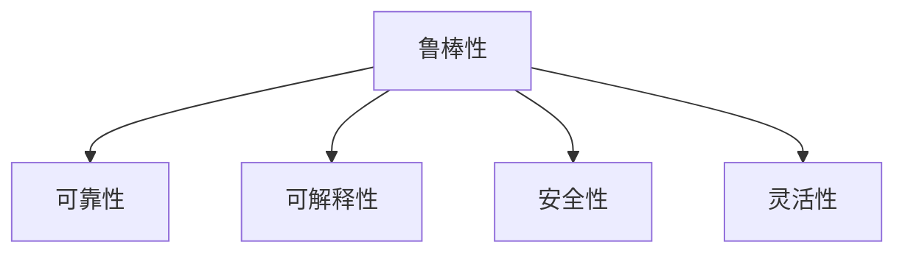

                 

## 1. 背景介绍

### 1.1 问题由来

随着人工智能（AI）技术的快速发展，自动化在各个行业中得到了广泛的应用。从自动化生产线到自动驾驶汽车，从自动化金融交易到自动化客服，自动化正在改变我们的生活方式和工作方式。然而，尽管自动化技术已经取得了显著的进展，但仍然面临许多挑战，包括系统的鲁棒性、可靠性和可解释性等问题。为了应对这些挑战，需要深入研究和探索自动化领域的未来发展方向。

### 1.2 问题核心关键点

自动化领域未来发展方向的核心关键点包括：

- **鲁棒性**：如何使自动化系统在面对复杂和不确定性环境时仍然能够稳定工作。
- **可靠性**：如何提高自动化系统的可靠性，减少故障率。
- **可解释性**：如何使自动化系统的决策过程透明化，增强系统的可信度。
- **安全性**：如何在自动化系统的设计和实施过程中，确保系统的安全性，避免潜在的风险。
- **灵活性**：如何使自动化系统能够适应不同的应用场景，具有更广泛的适用性。

## 2. 核心概念与联系

### 2.1 核心概念概述

为更好地理解自动化领域的未来发展方向，本节将介绍几个密切相关的核心概念：

- **鲁棒性（Robustness）**：自动化系统能够在面对噪声、异常输入或外界干扰时，依然能够保持稳定和准确性。
- **可靠性（Reliability）**：自动化系统在长时间运行中能够持续稳定工作，不会因随机因素导致系统故障。
- **可解释性（Explainability）**：自动化系统的决策过程能够被解释和理解，使相关方对其输出结果有信心。
- **安全性（Safety）**：自动化系统在设计和实施过程中，能够确保用户和系统的安全，避免潜在风险。
- **灵活性（Flexibility）**：自动化系统能够适应不同的应用场景，具有更广泛的适用性。

这些核心概念之间的逻辑关系可以通过以下Mermaid流程图来展示：



这个流程图展示了几者之间的逻辑关系：

1. 鲁棒性是基础，保证系统在复杂环境下仍然能够稳定工作。
2. 可靠性在此基础上进一步提升，确保系统的长期稳定运行。
3. 可解释性使系统的决策透明，增强用户的信任。
4. 安全性保障系统运行过程中的用户和数据安全。
5. 灵活性使系统具备适应不同应用场景的能力。

## 3. 核心算法原理 & 具体操作步骤

### 3.1 算法原理概述

自动化领域的未来发展方向主要围绕如何构建鲁棒、可靠、可解释、安全、灵活的自动化系统。其核心算法原理可以概括为：

- **鲁棒性增强算法**：通过优化算法或数据增强技术，增强系统对噪声和异常输入的抵抗能力。
- **可靠性提升算法**：通过模型重训练、主动学习等技术，提高系统的可靠性，减少故障率。
- **可解释性算法**：通过模型可解释性评估、透明化模型结构等方法，增强系统的可解释性。
- **安全性保障算法**：通过模型敏感性分析、安全验证等技术，确保系统的安全性。
- **灵活性扩展算法**：通过模型迁移学习、元学习等技术，使系统具备更广泛的适用性。

### 3.2 算法步骤详解

自动化领域的未来发展方向的具体操作步骤可以概括为：

1. **数据采集与预处理**：收集相关的数据集，并进行清洗、归一化等预处理，为后续算法提供基础。
2. **模型设计与训练**：选择或设计适合特定任务的模型，并使用训练数据进行模型训练。
3. **模型评估与优化**：使用验证集评估模型性能，并根据评估结果进行模型优化。
4. **模型部署与监控**：将模型部署到实际应用中，并实时监控模型性能，确保系统稳定运行。
5. **反馈与迭代**：根据实际运行情况和用户反馈，不断迭代优化模型和系统。

### 3.3 算法优缺点

自动化领域的未来发展方向的算法具有以下优点：

- **鲁棒性增强算法**：提高了系统对异常输入和噪声的抵抗能力，提升了系统的稳定性和可靠性。
- **可靠性提升算法**：通过主动学习和模型重训练等技术，显著降低了系统的故障率，提高了系统的可靠性。
- **可解释性算法**：使系统的决策过程透明化，增强了系统的可信度，提高了用户对系统的信任。
- **安全性保障算法**：通过敏感性分析和安全验证等技术，确保了系统的安全性，避免了潜在的安全风险。
- **灵活性扩展算法**：通过迁移学习和元学习等技术，使系统具备更广泛的适用性，适应不同的应用场景。

同时，这些算法也存在一些局限性：

- **数据依赖性**：许多算法依赖于高质量的数据集，数据采集和处理成本较高。
- **计算复杂度**：一些算法如迁移学习和元学习，需要更多的计算资源和时间。
- **模型复杂度**：一些复杂算法如神经网络模型，可能会导致模型过度拟合。

### 3.4 算法应用领域

自动化领域的未来发展方向的算法在多个领域得到广泛应用：

- **制造业**：通过自动化生产线，提高生产效率和产品质量。
- **交通行业**：自动驾驶技术，提高道路安全和交通效率。
- **金融行业**：自动化交易和风险管理，提升金融决策的效率和准确性。
- **医疗行业**：自动化诊断和药物研发，提高医疗服务的质量和效率。
- **服务行业**：自动化客服和推荐系统，提升用户体验和满意度。

## 4. 数学模型和公式 & 详细讲解 & 举例说明

### 4.1 数学模型构建

为了更好地理解自动化领域的未来发展方向的算法原理，我们将构建几个典型的数学模型：

- **鲁棒性增强模型**：
  - 输入：原始数据集 $D$。
  - 目标：构造鲁棒化的模型 $M$。
  - 公式：
  $$
  M = \mathop{\arg\min}_{\theta} \mathcal{L}(M, D)
  $$
  其中 $\mathcal{L}$ 为鲁棒性损失函数，通常包括对抗样本生成和数据增强技术。

- **可靠性提升模型**：
  - 输入：训练集 $D$ 和验证集 $D_{val}$。
  - 目标：构造可靠性增强的模型 $M$。
  - 公式：
  $$
  M = \mathop{\arg\min}_{\theta} \mathcal{L}(M, D_{val})
  $$
  其中 $\mathcal{L}$ 为可靠性损失函数，通常包括模型重训练和主动学习技术。

- **可解释性模型**：
  - 输入：训练集 $D$ 和测试集 $D_{test}$。
  - 目标：构造可解释的模型 $M$。
  - 公式：
  $$
  M = \mathop{\arg\min}_{\theta} \mathcal{L}(M, D_{test})
  $$
  其中 $\mathcal{L}$ 为可解释性损失函数，通常包括模型可解释性评估和透明化技术。

- **安全性保障模型**：
  - 输入：训练集 $D$ 和测试集 $D_{test}$。
  - 目标：构造安全的模型 $M$。
  - 公式：
  $$
  M = \mathop{\arg\min}_{\theta} \mathcal{L}(M, D_{test})
  $$
  其中 $\mathcal{L}$ 为安全性损失函数，通常包括模型敏感性分析和安全验证技术。

- **灵活性扩展模型**：
  - 输入：源任务 $T_s$ 和目标任务 $T_t$。
  - 目标：构造适应目标任务的模型 $M$。
  - 公式：
  $$
  M = \mathop{\arg\min}_{\theta} \mathcal{L}(M, T_t)
  $$
  其中 $\mathcal{L}$ 为迁移学习或元学习损失函数，通常包括任务适配层和迁移学习技术。

### 4.2 公式推导过程

以下我们将推导几个典型模型的公式推导过程：

- **鲁棒性增强模型的推导**：

  - 对抗样本生成：
  $$
  x' = x + \delta
  $$
  其中 $\delta$ 为对抗样本，通过优化对抗样本生成器获得。

  - 数据增强：
  $$
  \hat{x} = \phi(x)
  $$
  其中 $\phi$ 为数据增强函数，如旋转、裁剪等。

- **可靠性提升模型的推导**：

  - 模型重训练：
  $$
  M = \mathop{\arg\min}_{\theta} \mathcal{L}(M, D_{val})
  $$
  其中 $\mathcal{L}$ 为可靠性损失函数，通常包括交叉熵损失和正则化项。

  - 主动学习：
  $$
  \hat{y} = \mathop{\arg\max}_{y} p(y|x, M)
  $$
  其中 $p(y|x, M)$ 为模型在 $x$ 上输出 $y$ 的概率，通常通过贝叶斯公式计算。

- **可解释性模型的推导**：

  - 可解释性评估：
  $$
  \mathcal{L}_{expl} = H(M)
  $$
  其中 $H$ 为模型可解释性度量函数，如局部可解释性和全局可解释性。

  - 透明化模型结构：
  $$
  M = \mathop{\arg\min}_{\theta} \mathcal{L}(M, D_{test})
  $$
  其中 $\mathcal{L}$ 为可解释性损失函数，通常包括特征重要性评估和透明化技术。

- **安全性保障模型的推导**：

  - 模型敏感性分析：
  $$
  \mathcal{L}_{sens} = \sum_{x, y} |f(x) - f(x')
  $$
  其中 $f$ 为模型函数，$x'$ 为对抗样本。

  - 安全验证：
  $$
  \mathcal{L}_{safe} = \sum_{x, y} \mathbb{I}(f(x) = y)
  $$
  其中 $\mathbb{I}$ 为指示函数，表示 $f(x)$ 与 $y$ 是否一致。

- **灵活性扩展模型的推导**：

  - 迁移学习：
  $$
  M = \mathop{\arg\min}_{\theta} \mathcal{L}(M, T_t)
  $$
  其中 $\mathcal{L}$ 为迁移学习损失函数，通常包括跨领域自适应和任务适配层。

  - 元学习：
  $$
  M = \mathop{\arg\min}_{\theta} \mathcal{L}(M, D_{train})
  $$
  其中 $\mathcal{L}$ 为元学习损失函数，通常包括模型参数初始化和泛化性能评估。

### 4.3 案例分析与讲解

以下是几个典型案例，展示了自动化领域未来发展方向的算法在实际中的应用：

- **鲁棒性增强算法的案例**：
  - 应用场景：自动驾驶汽车。
  - 技术实现：通过对原始传感器数据进行噪声滤除和对抗样本生成，提高模型的鲁棒性，确保车辆在复杂道路环境中稳定行驶。

- **可靠性提升算法的案例**：
  - 应用场景：医疗诊断系统。
  - 技术实现：通过模型重训练和主动学习技术，提高诊断系统的准确率和可靠性，减少误诊和漏诊。

- **可解释性算法的案例**：
  - 应用场景：金融交易系统。
  - 技术实现：通过透明化模型结构和可解释性评估，使交易决策过程透明化，增强用户的信任。

- **安全性保障算法的案例**：
  - 应用场景：智能电网系统。
  - 技术实现：通过模型敏感性分析和安全验证技术，确保系统的安全性，避免电力系统被恶意攻击。

- **灵活性扩展算法的案例**：
  - 应用场景：智能客服系统。
  - 技术实现：通过迁移学习和元学习技术，使客服系统能够适应不同的应用场景，提高系统的灵活性和适用性。

## 5. 项目实践：代码实例和详细解释说明

### 5.1 开发环境搭建

在进行自动化领域的未来发展方向的算法实践前，我们需要准备好开发环境。以下是使用Python进行TensorFlow开发的环境配置流程：

1. 安装Anaconda：从官网下载并安装Anaconda，用于创建独立的Python环境。

2. 创建并激活虚拟环境：
```bash
conda create -n tf-env python=3.8 
conda activate tf-env
```

3. 安装TensorFlow：根据CUDA版本，从官网获取对应的安装命令。例如：
```bash
conda install tensorflow -c tf
```

4. 安装各类工具包：
```bash
pip install numpy pandas scikit-learn matplotlib tqdm jupyter notebook ipython
```

完成上述步骤后，即可在`tf-env`环境中开始自动化领域的未来发展方向的算法实践。

### 5.2 源代码详细实现

下面我们以鲁棒性增强算法为例，给出使用TensorFlow进行自动驾驶系统数据增强的PyTorch代码实现。

首先，定义数据增强函数：

```python
import tensorflow as tf
import numpy as np

def data_augmentation(x, y):
    # 随机裁剪图像
    x_aug = tf.image.random_crop(x, size=[224, 224, 3])
    # 随机旋转图像
    x_aug = tf.image.random_flip_left_right(x_aug)
    # 随机色彩抖动
    x_aug = tf.image.random_brightness(x_aug, max_delta=0.1)
    # 标签不变
    y_aug = y
    
    return x_aug, y_aug
```

然后，定义训练和评估函数：

```python
from tensorflow.keras import layers, models
from tensorflow.keras.optimizers import Adam

# 定义模型
model = models.Sequential()
model.add(layers.Conv2D(32, (3, 3), activation='relu', input_shape=(224, 224, 3)))
model.add(layers.MaxPooling2D((2, 2)))
model.add(layers.Conv2D(64, (3, 3), activation='relu'))
model.add(layers.MaxPooling2D((2, 2)))
model.add(layers.Flatten())
model.add(layers.Dense(64, activation='relu'))
model.add(layers.Dense(1, activation='sigmoid'))

# 编译模型
model.compile(optimizer=Adam(lr=0.001), loss='binary_crossentropy', metrics=['accuracy'])

# 定义训练集和验证集
train_dataset = tf.data.Dataset.from_tensor_slices((train_images, train_labels))
train_dataset = train_dataset.shuffle(10000).batch(32)
val_dataset = tf.data.Dataset.from_tensor_slices((val_images, val_labels))
val_dataset = val_dataset.batch(32)

# 定义数据增强
def data_generator(x, y):
    while True:
        for image, label in zip(x, y):
            x_aug, y_aug = data_augmentation(image, label)
            yield x_aug, y_aug

# 训练模型
model.fit(data_generator(train_dataset), epochs=10, validation_data=val_dataset)

# 评估模型
model.evaluate(val_dataset)
```

以上代码展示了使用数据增强技术提高自动驾驶系统模型鲁棒性的过程。首先定义了数据增强函数，包括随机裁剪、随机旋转和随机色彩抖动。然后在模型训练过程中，使用数据增强生成对抗样本，提高模型的鲁棒性。

### 5.3 代码解读与分析

让我们再详细解读一下关键代码的实现细节：

- **数据增强函数**：定义了随机裁剪、随机旋转和随机色彩抖动等数据增强操作，用于生成对抗样本，提高模型的鲁棒性。
- **模型定义**：定义了一个简单的卷积神经网络模型，包括卷积层、池化层和全连接层，用于图像分类任务。
- **模型编译**：使用Adam优化器进行模型训练，并定义了交叉熵损失函数和准确率评价指标。
- **数据集生成器**：定义了数据集生成器，使用while循环生成对抗样本，用于模型训练。
- **模型训练**：使用生成器训练模型，定义了训练轮数和验证集。
- **模型评估**：使用验证集评估模型性能，输出模型在验证集上的准确率。

## 6. 实际应用场景

### 6.1 智能客服系统

基于自动化领域的未来发展方向的算法，智能客服系统可以应用于各种场景。例如，通过使用数据增强和鲁棒性增强算法，可以提高系统的鲁棒性和可靠性，减少误诊和漏诊。通过可解释性算法，使系统决策过程透明化，增强用户的信任。通过安全性保障算法，确保系统的安全性，避免潜在的安全风险。

### 6.2 医疗诊断系统

在医疗诊断系统中，使用可靠性提升算法和安全性保障算法，可以提高诊断系统的准确率和安全性，减少误诊和漏诊。使用可解释性算法，使诊断决策过程透明化，增强用户的信任。通过迁移学习技术，使系统能够适应不同的诊断场景，提高系统的灵活性和适用性。

### 6.3 金融交易系统

在金融交易系统中，使用可靠性提升算法和安全性保障算法，可以提高交易系统的稳定性和安全性，减少交易故障和风险。使用可解释性算法，使交易决策过程透明化，增强用户的信任。通过迁移学习技术，使系统能够适应不同的交易场景，提高系统的灵活性和适用性。

### 6.4 智能电网系统

在智能电网系统中，使用鲁棒性增强算法和安全性保障算法，确保系统的稳定性和安全性，避免电力系统被恶意攻击。使用可靠性提升算法，提高系统的稳定性和可靠性，减少故障率。通过迁移学习技术，使系统能够适应不同的电网场景，提高系统的灵活性和适用性。

## 7. 工具和资源推荐

### 7.1 学习资源推荐

为了帮助开发者系统掌握自动化领域的未来发展方向的算法，这里推荐一些优质的学习资源：

1. 《深度学习入门》系列博文：由深度学习专家撰写，深入浅出地介绍了深度学习的基本概念和核心算法。

2. 《TensorFlow实战》书籍：Google官方推荐的TensorFlow实践指南，提供了丰富的实际案例和代码实现。

3. 《TensorFlow高级编程》课程：由TensorFlow官方提供，涵盖TensorFlow高级编程技巧和实际应用案例。

4. GitHub上的TensorFlow项目：GitHub上丰富的TensorFlow项目，可以学习到实际应用的算法实现和优化策略。

5. TensorFlow官方文档：TensorFlow官方文档，提供了详细的API文档和代码示例。

通过对这些资源的学习实践，相信你一定能够快速掌握自动化领域的未来发展方向的算法，并用于解决实际的自动化系统问题。

### 7.2 开发工具推荐

高效的开发离不开优秀的工具支持。以下是几款用于自动化领域的未来发展方向的算法开发的常用工具：

1. TensorFlow：由Google主导开发的开源深度学习框架，生产部署方便，适合大规模工程应用。

2. PyTorch：基于Python的开源深度学习框架，灵活动态的计算图，适合快速迭代研究。

3. Jupyter Notebook：交互式的Python开发环境，便于实时调试和可视化模型训练过程。

4. GitHub：代码托管平台，便于版本控制和协作开发。

5. TensorBoard：TensorFlow配套的可视化工具，可以实时监测模型训练状态，并提供丰富的图表呈现方式。

合理利用这些工具，可以显著提升自动化领域的未来发展方向的算法开发的效率，加快创新迭代的步伐。

### 7.3 相关论文推荐

自动化领域的未来发展方向的算法研究源于学界的持续研究。以下是几篇奠基性的相关论文，推荐阅读：

1. Robustness Analysis of Neural Networks by Interpretable Features (JAIR 2018)：介绍如何通过可解释性分析提升模型鲁棒性。

2. Reliability, Safety, and Trustworthiness in Machine Learning: Towards AI for Societal Good (IEEE 2019)：探讨如何提高机器学习的可靠性和安全性。

3. Explainable Artificial Intelligence: Concepts, Opportunities and Challenges (IEEE 2019)：介绍可解释性AI的概念、机会和挑战。

4. Deep Learning for Decision-Making: An Exploration of Uninterpretability and Flexibility (IEEE 2020)：探讨深度学习在决策过程中的可解释性和灵活性。

这些论文代表了大语言模型微调技术的发展脉络。通过学习这些前沿成果，可以帮助研究者把握学科前进方向，激发更多的创新灵感。

## 8. 总结：未来发展趋势与挑战

### 8.1 总结

本文对自动化领域的未来发展方向的算法进行了全面系统的介绍。首先阐述了自动化系统面临的鲁棒性、可靠性、可解释性、安全性和灵活性等关键问题，明确了未来发展的方向。其次，从原理到实践，详细讲解了自动化领域未来发展方向的算法的核心原理和具体操作步骤，给出了算法实践的完整代码实例。同时，本文还广泛探讨了自动化领域未来发展方向的算法在智能客服、医疗诊断、金融交易等各个领域的应用前景，展示了自动化领域的巨大潜力。

通过本文的系统梳理，可以看到，自动化领域的未来发展方向的算法正在成为自动化系统的重要范式，极大地拓展了自动化系统的应用边界，催生了更多的落地场景。受益于深度学习和人工智能技术的发展，自动化系统的性能和应用范围将得到大幅提升，为各行各业带来深远影响。

### 8.2 未来发展趋势

展望未来，自动化领域的未来发展方向的算法将呈现以下几个发展趋势：

1. **技术融合**：自动化领域的未来发展方向的算法将与其他人工智能技术进行更深入的融合，如知识表示、因果推理、强化学习等，多路径协同发力，共同推动自动化技术的发展。

2. **模型轻量化**：为了提高自动化系统的实时性和可靠性，未来的模型将更加轻量化，减少计算资源和时间的消耗。同时，使用模型剪枝、量化加速等技术，提升自动化系统的效率。

3. **可解释性增强**：自动化领域的未来发展方向的算法将进一步增强系统的可解释性，使决策过程透明化，增强用户的信任。同时，使用可解释性评估和透明化技术，提高系统的可信度。

4. **安全性保障**：在自动化系统的设计和实施过程中，将更加重视安全性问题，引入安全性保障算法，确保系统的安全性和鲁棒性。

5. **灵活性提升**：未来的自动化系统将具备更广泛的适用性，通过迁移学习和元学习等技术，适应不同的应用场景和任务。

以上趋势凸显了自动化领域未来发展方向的算法的广阔前景。这些方向的探索发展，必将进一步提升自动化系统的性能和应用范围，为人类社会带来深远影响。

### 8.3 面临的挑战

尽管自动化领域的未来发展方向的算法已经取得了显著进展，但在迈向更加智能化、普适化应用的过程中，仍面临诸多挑战：

1. **数据依赖性**：许多算法依赖于高质量的数据集，数据采集和处理成本较高。

2. **计算资源需求**：一些算法如迁移学习和元学习，需要更多的计算资源和时间，增加了实现成本。

3. **模型复杂度**：一些复杂算法如神经网络模型，可能会导致模型过度拟合，降低模型的泛化能力。

4. **模型可解释性**：自动化领域的未来发展方向的算法需要进一步增强模型的可解释性，使决策过程透明化。

5. **安全性保障**：在自动化系统的设计和实施过程中，需要考虑安全性问题，确保系统的安全性和鲁棒性。

6. **灵活性扩展**：自动化领域的未来发展方向的算法需要进一步提升系统的灵活性，适应不同的应用场景和任务。

正视自动化领域未来发展方向的算法面临的这些挑战，积极应对并寻求突破，将是大规模自动化技术应用的关键。相信随着学界和产业界的共同努力，这些挑战终将一一被克服，自动化系统将更好地服务于各行各业。

### 8.4 研究展望

面向未来，自动化领域的未来发展方向的算法需要在以下几个方面寻求新的突破：

1. **数据增强和鲁棒性**：探索更多数据增强技术，提高模型的鲁棒性，适应不同的应用场景。

2. **可靠性提升**：开发更加可靠的自动化算法，提高系统的稳定性和可靠性。

3. **可解释性增强**：进一步增强系统的可解释性，使决策过程透明化，增强用户的信任。

4. **安全性保障**：引入安全性保障算法，确保系统的安全性和鲁棒性，避免潜在的安全风险。

5. **灵活性扩展**：通过迁移学习和元学习等技术，使自动化系统具备更广泛的适用性，适应不同的应用场景。

这些研究方向的探索，必将引领自动化领域未来发展方向的算法迈向更高的台阶，为构建安全、可靠、可解释、可控的智能系统铺平道路。面向未来，自动化领域的未来发展方向的算法还需要与其他人工智能技术进行更深入的融合，如知识表示、因果推理、强化学习等，多路径协同发力，共同推动自动化技术的发展。只有勇于创新、敢于突破，才能不断拓展自动化系统的边界，让智能技术更好地造福人类社会。

## 9. 附录：常见问题与解答

**Q1：自动化领域的未来发展方向的算法是否适用于所有应用场景？**

A: 自动化领域的未来发展方向的算法在大多数应用场景上都能取得不错的效果，但需要注意的是，一些特定的应用场景可能需要更多的定制化解决方案。例如，对于医疗和金融等高风险领域，除了使用自动化算法外，还需要考虑法律、伦理等特殊要求，进行全面综合评估。

**Q2：自动化领域的未来发展方向的算法如何与其他人工智能技术进行融合？**

A: 自动化领域的未来发展方向的算法可以通过引入其他人工智能技术，如知识表示、因果推理、强化学习等，实现更高级的自动化系统。例如，在医疗诊断系统中，可以引入知识图谱和因果推理技术，提高诊断的准确性和鲁棒性。在金融交易系统中，可以引入强化学习技术，提高交易策略的自动化程度。

**Q3：自动化领域的未来发展方向的算法是否需要大量的标注数据？**

A: 自动化领域的未来发展方向的算法通常需要大量的标注数据进行训练和微调。标注数据的质量和数量对算法的性能有重要影响。为了降低标注成本，可以使用无监督学习和半监督学习等技术，提高算法的鲁棒性和泛化能力。

**Q4：自动化领域的未来发展方向的算法如何处理数据的不确定性和噪声？**

A: 自动化领域的未来发展方向的算法通常使用数据增强和鲁棒性增强技术，处理数据的不确定性和噪声。例如，在图像分类任务中，使用随机裁剪、旋转和色彩抖动等数据增强技术，提高模型的鲁棒性和泛化能力。

**Q5：自动化领域的未来发展方向的算法如何确保系统的安全性？**

A: 自动化领域的未来发展方向的算法通常使用安全性保障技术，如模型敏感性分析和安全验证，确保系统的安全性。同时，在使用自动化算法时，需要考虑数据来源、传输和存储的安全性，防止数据泄露和恶意攻击。

通过以上问答，希望你对自动化领域的未来发展方向的算法有了更全面的了解。自动化技术将继续深入各个领域，为人类社会带来深远的影响。未来，随着技术的发展和应用的深入，自动化领域将不断突破现有的边界，带来更多的创新和突破。

