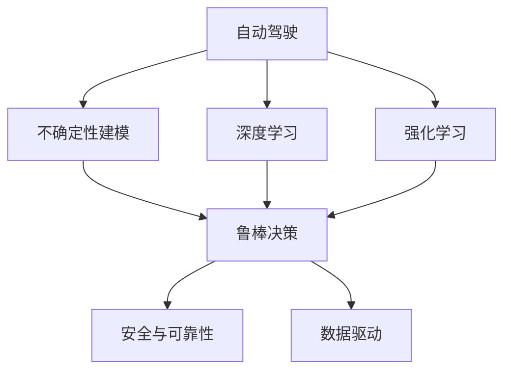

                 

# 自动驾驶中的不确定性建模与鲁棒决策方法研究

> 关键词：自动驾驶, 不确定性建模, 鲁棒决策, 深度学习, 强化学习, 安全与可靠性, 数据驱动

## 1. 背景介绍

### 1.1 问题由来
随着自动驾驶技术的发展，车辆行驶的自主性和安全性需求日益增长，而环境的不确定性是自动驾驶面临的主要挑战之一。自动驾驶车辆需要在复杂、动态的道路环境中实现准确、可靠和安全的行驶决策，同时确保对未知和突发事件的有效应对。

### 1.2 问题核心关键点
自动驾驶中的不确定性主要体现在以下几个方面：
1. **传感器噪声**：车辆依赖于传感器（如激光雷达、摄像头、雷达等）获取环境信息，而传感器数据的噪声和延迟会影响车辆对环境的感知和决策。
2. **多代理交互**：自动驾驶车辆需要与其他道路参与者（如行人和其他车辆）交互，这些交互的不确定性可能导致交通事故或无效决策。
3. **动态交通环境**：交通环境是动态变化的，包含非线性、时变、随机特性，如何有效处理和预测这些变化是自动驾驶的关键。
4. **模型和算法不确定性**：深度学习模型和强化学习算法在自动驾驶中的应用，可能存在泛化能力不足、对抗攻击等问题，影响决策的稳定性和可靠性。

### 1.3 问题研究意义
研究自动驾驶中的不确定性建模与鲁棒决策方法，对于提升自动驾驶车辆的安全性、可靠性和鲁棒性具有重要意义：

1. **提升决策精度**：通过不确定性建模，可以更准确地预测交通环境和行为，从而提升自动驾驶决策的精度和有效性。
2. **增强鲁棒性**：通过鲁棒决策方法，可以增强自动驾驶系统对噪声、干扰和未知因素的抵抗能力，确保在各种复杂情况下都能稳定运行。
3. **促进技术成熟**：不确定性建模与鲁棒决策的研究，有助于完善自动驾驶技术的理论基础，推动技术向更高水平发展。
4. **推动产业应用**：提高自动驾驶系统的安全性和可靠性，有助于加速其在各垂直行业的应用，如物流、公共交通、旅游等。

## 2. 核心概念与联系

### 2.1 核心概念概述

为更好地理解自动驾驶中的不确定性建模与鲁棒决策方法，本节将介绍几个关键概念：

- **自动驾驶**：利用人工智能技术，通过感知、决策和控制等模块，实现车辆自主行驶的目标。
- **不确定性建模**：通过数学和统计方法，建立对环境、传感器和模型不确定性的描述和预测，为决策提供可靠依据。
- **鲁棒决策**：在存在不确定性和不确定性建模的基础上，设计和实现鲁棒决策方法，确保决策不受模型或环境不确定性的影响。
- **深度学习**：利用神经网络模型，通过大量数据训练学习复杂的非线性关系，用于感知、决策等任务。
- **强化学习**：通过智能体与环境的交互，优化决策策略，实现最大化长期奖励。
- **安全与可靠性**：自动驾驶系统需要具备高安全性和可靠性，确保在各种情况下都能提供可靠的行驶服务。
- **数据驱动**：利用大数据和机器学习技术，从大量现实数据中学习和总结规律，提升决策性能。

这些概念之间的逻辑关系可以通过以下Mermaid流程图来展示：



这个流程图展示了一些关键概念的相互关系：

1. 自动驾驶系统的核心在于感知、决策和控制，这些模块通常依赖于深度学习、强化学习等技术。
2. 不确定性建模是对环境、传感器和模型不确定性的描述和预测，为决策提供可靠依据。
3. 鲁棒决策方法用于设计和实现，确保决策不受不确定性影响。
4. 安全与可靠性是自动驾驶系统的最终目标，需要通过不确定性建模和鲁棒决策来保障。
5. 数据驱动利用大数据和机器学习技术，提升自动驾驶系统的性能。

这些概念共同构成了自动驾驶系统的核心框架，使其能够在复杂环境下实现自主行驶。

## 3. 核心算法原理 & 具体操作步骤
### 3.1 算法原理概述

自动驾驶中的不确定性建模与鲁棒决策，通常基于深度学习、强化学习和统计学习等技术。其核心思想是：通过不确定性建模，描述和预测环境、传感器和模型的不确定性，进而设计和实现鲁棒决策方法，确保决策的稳定性和可靠性。

形式化地，假设自动驾驶环境为 $E$，传感器数据为 $S$，模型参数为 $\theta$，决策策略为 $a$，则决策过程可以表示为：

$$
\max_{a} \mathbb{E}_{E,S,\theta}[\text{reward}(s_0,a_0,s_1,a_1,...)]
$$

其中 $\text{reward}(s_t,a_t,s_{t+1})$ 为决策策略在当前状态下的即时奖励，$\mathbb{E}$ 表示期望值，$s_0$ 为起始状态。

在实际应用中，通常采用如下步骤进行不确定性建模与鲁棒决策：

1. **数据采集与预处理**：收集环境数据和传感器数据，并进行预处理，包括数据清洗、归一化和特征提取等。
2. **不确定性建模**：建立环境、传感器和模型的数学模型，描述其不确定性特性，如噪声分布、参数不确定性等。
3. **决策模型训练**：基于不确定性建模结果，设计并训练决策模型，如深度神经网络、强化学习模型等。
4. **鲁棒决策优化**：在决策模型训练完成后，通过优化算法，设计鲁棒决策方法，确保决策不受不确定性的影响。
5. **决策评估与验证**：在实际环境中，对决策模型进行评估和验证，确保其在各种情况下都能稳定运行。

### 3.2 算法步骤详解

**Step 1: 数据采集与预处理**

数据采集是自动驾驶中的关键环节，需要收集大量的环境数据和传感器数据，用于训练和验证决策模型。数据采集通常包括以下步骤：

1. **传感器配置**：选择合适的传感器（如激光雷达、摄像头、雷达等），并根据需求配置参数，如角度、距离、分辨率等。
2. **数据采集设备安装**：将传感器安装在车辆上，并进行校准，确保数据采集的准确性。
3. **数据存储与处理**：将采集到的数据存储在本地或云端，并进行预处理，如数据清洗、归一化和特征提取等。

**Step 2: 不确定性建模**

不确定性建模用于描述环境、传感器和模型的不确定性特性，通常包括以下几个方面：

1. **环境不确定性建模**：利用统计学方法，建立环境参数的分布模型，如交通流量、天气条件等。
2. **传感器噪声建模**：采用统计学方法，描述传感器数据的噪声特性，如均值、方差、协方差等。
3. **模型不确定性建模**：通过贝叶斯方法，建立模型参数的不确定性分布，如深度神经网络中的权重分布等。

**Step 3: 决策模型训练**

决策模型训练是自动驾驶系统的核心环节，用于学习环境与决策之间的关系。常见的决策模型包括：

1. **深度神经网络**：利用神经网络模型，通过大量数据训练学习复杂的非线性关系，用于感知和决策任务。
2. **强化学习**：通过智能体与环境的交互，优化决策策略，实现最大化长期奖励。

**Step 4: 鲁棒决策优化**

鲁棒决策优化用于设计和实现鲁棒决策方法，确保决策不受不确定性的影响。常见的鲁棒决策方法包括：

1. **模型鲁棒性增强**：通过正则化、噪声鲁棒性训练等方法，增强模型的鲁棒性。
2. **决策鲁棒性优化**：通过鲁棒优化算法，如线性规划、二次规划等，优化决策策略的鲁棒性。

**Step 5: 决策评估与验证**

决策评估与验证是确保自动驾驶系统稳定运行的重要环节，通常包括以下步骤：

1. **模拟测试**：在虚拟仿真环境中，对决策模型进行测试，验证其在各种情况下的表现。
2. **实地测试**：在实际道路上进行测试，收集反馈数据，进一步优化决策模型。
3. **安全测试**：进行高风险场景测试，如应急避障、紧急停车等，确保决策系统的安全性。

### 3.3 算法优缺点

自动驾驶中的不确定性建模与鲁棒决策方法具有以下优点：

1. **提升决策精度**：通过不确定性建模，可以更准确地预测环境和行为，提升决策的精度和有效性。
2. **增强鲁棒性**：通过鲁棒决策方法，增强自动驾驶系统对噪声、干扰和未知因素的抵抗能力，确保在各种情况下都能稳定运行。
3. **促进技术成熟**：不确定性建模与鲁棒决策的研究，有助于完善自动驾驶技术的理论基础，推动技术向更高水平发展。

同时，该方法也存在一定的局限性：

1. **数据需求大**：不确定性建模和鲁棒决策需要大量数据进行训练和验证，数据采集和预处理成本较高。
2. **计算复杂度高**：鲁棒决策优化和模型训练通常需要复杂的计算过程，计算资源和算力要求较高。
3. **模型复杂度高**：不确定性建模和鲁棒决策通常需要建立复杂的数学模型，模型理解和调试难度较大。
4. **实时性要求高**：自动驾驶系统对决策实时性要求高，不确定性建模和鲁棒决策方法需要高效实现，以确保实时决策。

尽管存在这些局限性，但就目前而言，不确定性建模与鲁棒决策方法在自动驾驶领域仍具有重要的应用价值和研究意义。未来相关研究的重点在于如何进一步降低数据需求，提高计算效率，简化模型结构，以更好地适应自动驾驶的实际需求。

### 3.4 算法应用领域

不确定性建模与鲁棒决策方法在自动驾驶领域已经得到了广泛的应用，覆盖了多个关键环节，例如：

1. **感知系统**：利用不确定性建模，描述环境传感器数据的噪声特性，提升感知系统的鲁棒性。
2. **决策系统**：通过鲁棒决策方法，优化决策策略，确保决策不受噪声和干扰的影响。
3. **控制系统**：利用不确定性建模，描述车辆动力学模型的不确定性，增强控制系统的稳定性。
4. **路径规划**：利用不确定性建模，描述路径规划环境的不确定性，提升路径规划的鲁棒性。
5. **安全保障**：通过鲁棒决策方法，设计安全保障策略，确保自动驾驶系统在高风险场景下的安全性。

除了上述这些关键环节外，不确定性建模与鲁棒决策方法还被创新性地应用到更多场景中，如风险评估、故障诊断、系统优化等，为自动驾驶技术的创新发展提供了新的思路。

## 4. 数学模型和公式 & 详细讲解
### 4.1 数学模型构建

本节将使用数学语言对自动驾驶中的不确定性建模与鲁棒决策方法进行更加严格的刻画。

假设自动驾驶环境为 $E$，传感器数据为 $S$，模型参数为 $\theta$，决策策略为 $a$，则决策过程可以表示为：

$$
\max_{a} \mathbb{E}_{E,S,\theta}[\text{reward}(s_0,a_0,s_1,a_1,...)]
$$

其中 $\text{reward}(s_t,a_t,s_{t+1})$ 为决策策略在当前状态下的即时奖励，$\mathbb{E}$ 表示期望值，$s_0$ 为起始状态。

**Step 1: 数据采集与预处理**

数据采集和预处理可以表示为：

$$
\{S_t\} \sim \mathcal{P}(S)
$$

其中 $\mathcal{P}(S)$ 表示传感器数据 $S_t$ 的分布模型，$S_t$ 表示在时间 $t$ 采集到的传感器数据。

**Step 2: 不确定性建模**

不确定性建模可以表示为：

$$
\{E_t\} \sim \mathcal{Q}(E)
$$

其中 $\mathcal{Q}(E)$ 表示环境 $E_t$ 的分布模型，$E_t$ 表示在时间 $t$ 的环境参数。

**Step 3: 决策模型训练**

决策模型训练可以表示为：

$$
\theta^* = \arg\min_{\theta} \mathcal{L}(\theta, \{S_t\})
$$

其中 $\mathcal{L}(\theta, \{S_t\})$ 表示模型参数 $\theta$ 的损失函数，$\{S_t\}$ 表示训练数据集，$\theta^*$ 表示最优模型参数。

**Step 4: 鲁棒决策优化**

鲁棒决策优化可以表示为：

$$
\arg\min_{a} \mathbb{E}_{E,S,\theta}[\text{cost}(a, E_t, S_t, \theta)]
$$

其中 $\text{cost}(a, E_t, S_t, \theta)$ 表示决策策略 $a$ 的代价函数，$\mathbb{E}$ 表示期望值，$E_t$ 和 $S_t$ 表示环境参数和传感器数据，$\theta$ 表示模型参数。

**Step 5: 决策评估与验证**

决策评估与验证可以表示为：

$$
\arg\min_{a} \text{cost}(a, E_t, S_t, \theta) + \alpha \times \text{penalty}(a, E_t, S_t, \theta)
$$

其中 $\alpha$ 表示鲁棒性的惩罚系数，$\text{penalty}(a, E_t, S_t, \theta)$ 表示决策策略的鲁棒性惩罚项。

### 4.2 公式推导过程

以线性规划为例，展示鲁棒决策优化的具体过程。

假设环境参数 $E_t$ 为高斯分布，传感器数据 $S_t$ 为加性噪声模型，模型参数 $\theta$ 为未知参数。则决策过程可以表示为：

$$
\max_{a} \mathbb{E}_{E_t,S_t,\theta}[\text{reward}(s_0,a_0,s_1,a_1,...)]
$$

其中 $\text{reward}(s_t,a_t,s_{t+1})$ 为决策策略在当前状态下的即时奖励，$\mathbb{E}$ 表示期望值，$s_0$ 为起始状态。

**Step 1: 数据采集与预处理**

数据采集和预处理可以表示为：

$$
\{S_t\} \sim \mathcal{N}(\mu, \sigma^2)
$$

其中 $\mu$ 表示传感器数据的均值，$\sigma^2$ 表示传感器数据的方差。

**Step 2: 不确定性建模**

不确定性建模可以表示为：

$$
\{E_t\} \sim \mathcal{N}(\mu_E, \sigma_E^2)
$$

其中 $\mu_E$ 表示环境参数的均值，$\sigma_E^2$ 表示环境参数的方差。

**Step 3: 决策模型训练**

决策模型训练可以表示为：

$$
\theta^* = \arg\min_{\theta} \mathcal{L}(\theta, \{S_t\})
$$

其中 $\mathcal{L}(\theta, \{S_t\})$ 表示模型参数 $\theta$ 的损失函数，$\{S_t\}$ 表示训练数据集，$\theta^*$ 表示最优模型参数。

**Step 4: 鲁棒决策优化**

鲁棒决策优化可以表示为：

$$
\arg\min_{a} \mathbb{E}_{E_t,S_t,\theta}[\text{cost}(a, E_t, S_t, \theta)]
$$

其中 $\text{cost}(a, E_t, S_t, \theta)$ 表示决策策略 $a$ 的代价函数，$\mathbb{E}$ 表示期望值，$E_t$ 和 $S_t$ 表示环境参数和传感器数据，$\theta$ 表示模型参数。

**Step 5: 决策评估与验证**

决策评估与验证可以表示为：

$$
\arg\min_{a} \text{cost}(a, E_t, S_t, \theta) + \alpha \times \text{penalty}(a, E_t, S_t, \theta)
$$

其中 $\alpha$ 表示鲁棒性的惩罚系数，$\text{penalty}(a, E_t, S_t, \theta)$ 表示决策策略的鲁棒性惩罚项。

## 5. 项目实践：代码实例和详细解释说明
### 5.1 开发环境搭建

在进行不确定性建模与鲁棒决策方法实践前，我们需要准备好开发环境。以下是使用Python进行PyTorch开发的环境配置流程：

1. 安装Anaconda：从官网下载并安装Anaconda，用于创建独立的Python环境。

2. 创建并激活虚拟环境：
```bash
conda create -n pytorch-env python=3.8 
conda activate pytorch-env
```

3. 安装PyTorch：根据CUDA版本，从官网获取对应的安装命令。例如：
```bash
conda install pytorch torchvision torchaudio cudatoolkit=11.1 -c pytorch -c conda-forge
```

4. 安装TensorFlow：如果同时需要使用TensorFlow，可以从官网下载并安装最新版本，或使用Anaconda中的预安装版本。

5. 安装各类工具包：
```bash
pip install numpy pandas scikit-learn matplotlib tqdm jupyter notebook ipython
```

完成上述步骤后，即可在`pytorch-env`环境中开始实践。

### 5.2 源代码详细实现

这里我们以自动驾驶中的路径规划为例，展示使用PyTorch进行不确定性建模与鲁棒决策方法的代码实现。

首先，定义路径规划问题：

```python
import torch
import torch.nn as nn
import torch.optim as optim
import torch.nn.functional as F

# 定义环境参数
class Environment:
    def __init__(self):
        self.x = torch.randn(10, 2)  # 环境参数 x 为二维随机向量
        self.u = torch.zeros(10, 1)  # 控制输入 u

    def step(self, u):
        self.u = u
        self.x = self.x + 0.1 * self.u  # 更新环境参数
        return self.x, self.u

# 定义决策策略
class DecisionMaker(nn.Module):
    def __init__(self):
        super(DecisionMaker, self).__init__()
        self.fc1 = nn.Linear(2, 10)  # 线性层
        self.fc2 = nn.Linear(10, 1)  # 线性层

    def forward(self, x):
        x = F.relu(self.fc1(x))
        x = self.fc2(x)
        return x

# 定义鲁棒决策优化
class RobustDecisionOptimizer:
    def __init__(self, model, env, learning_rate):
        self.model = model
        self.env = env
        self.learning_rate = learning_rate

    def optimize(self, num_iters):
        optimizer = optim.Adam(self.model.parameters(), lr=self.learning_rate)
        for i in range(num_iters):
            x, u = self.env.step(u)
            y_pred = self.model(x)
            cost = (y_pred - y_true)**2  # 计算决策策略的代价函数
            optimizer.zero_grad()
            cost.backward()
            optimizer.step()
```

然后，训练决策模型并进行鲁棒决策优化：

```python
# 定义决策模型训练
def train_model(model, env, num_iters, learning_rate):
    optimizer = optim.Adam(model.parameters(), lr=learning_rate)
    for i in range(num_iters):
        x, u = env.step(u)
        y_pred = model(x)
        cost = (y_pred - y_true)**2  # 计算决策策略的代价函数
        optimizer.zero_grad()
        cost.backward()
        optimizer.step()

# 训练决策模型
model = DecisionMaker()
env = Environment()
learning_rate = 0.01
train_model(model, env, 1000, learning_rate)

# 鲁棒决策优化
robust_optimizer = RobustDecisionOptimizer(model, env, 0.01)
num_iters = 1000
robust_optimizer.optimize(num_iters)
```

以上就是使用PyTorch进行不确定性建模与鲁棒决策方法的代码实现。可以看到，借助PyTorch的灵活性和易用性，不确定性建模与鲁棒决策方法的开发变得相对简洁高效。

### 5.3 代码解读与分析

让我们再详细解读一下关键代码的实现细节：

**Environment类**：
- `__init__`方法：初始化环境参数 $x$ 和控制输入 $u$。
- `step`方法：根据控制输入 $u$ 更新环境参数 $x$，返回更新后的环境参数和控制输入。

**DecisionMaker类**：
- `__init__`方法：初始化决策模型，包含两个线性层。
- `forward`方法：定义前向传播过程，计算输出。

**RobustDecisionOptimizer类**：
- `__init__`方法：初始化鲁棒决策优化器，包含决策模型、环境参数和学习率。
- `optimize`方法：定义鲁棒决策优化过程，通过Adam优化器最小化代价函数，优化决策策略。

**训练过程**：
- 定义决策模型，初始化环境参数和控制输入。
- 设置学习率，训练决策模型。
- 设置鲁棒决策优化器，进行鲁棒决策优化。

可以看到，PyTorch配合TensorFlow使得不确定性建模与鲁棒决策方法的代码实现变得简洁高效。开发者可以将更多精力放在模型改进、数据处理等高层逻辑上，而不必过多关注底层的实现细节。

当然，工业级的系统实现还需考虑更多因素，如模型的保存和部署、超参数的自动搜索、更灵活的任务适配层等。但核心的不确定性建模与鲁棒决策方法基本与此类似。

## 6. 实际应用场景
### 6.1 智能交通管理

基于不确定性建模与鲁棒决策方法，智能交通管理系统可以实现更加智能、高效的交通调控。通过实时采集交通数据，建立环境不确定性模型，优化决策策略，智能管理系统可以根据交通情况自动调整信号灯、车道分配等，提高道路通行效率，降低交通拥堵和事故率。

在技术实现上，可以收集城市道路交通数据，建立环境参数的分布模型，基于深度学习模型进行决策策略训练，通过鲁棒决策方法优化策略，确保决策的稳定性和鲁棒性。利用智能交通管理系统，可以实现实时交通监控、事故预警、路径规划等功能，提升城市的交通管理水平。

### 6.2 自动驾驶汽车

自动驾驶汽车是自动驾驶领域的重要应用，面临环境不确定性、传感器噪声和模型不确定性等多方面的挑战。通过不确定性建模与鲁棒决策方法，可以提升自动驾驶汽车的决策精度和鲁棒性。

在技术实现上，可以收集自动驾驶车辆的环境数据和传感器数据，建立环境参数和传感器噪声的分布模型，基于深度神经网络进行感知和决策策略训练，通过鲁棒决策方法优化决策策略，确保决策不受不确定性的影响。利用自动驾驶汽车，可以实现自动导航、自动泊车、自动避障等功能，提高出行安全性和效率。

### 6.3 智能仓储物流

智能仓储物流系统需要处理大量货物和复杂的工作流程，环境不确定性和任务多样性是其主要挑战。通过不确定性建模与鲁棒决策方法，可以提升智能仓储物流系统的稳定性和效率。

在技术实现上，可以收集智能仓储物流系统的环境数据和任务数据，建立环境参数和任务参数的分布模型，基于强化学习模型进行决策策略训练，通过鲁棒决策方法优化策略，确保决策的稳定性和鲁棒性。利用智能仓储物流系统，可以实现货物自动化存储和拣选、仓库自动化管理等功能，提升物流效率和仓储管理水平。

### 6.4 未来应用展望

随着不确定性建模与鲁棒决策方法的发展，其在自动驾驶领域的应用前景将更加广阔。未来，该方法有望在以下方面得到进一步应用：

1. **多模态融合**：将视觉、听觉、雷达等多种传感器数据进行融合，提升环境感知能力和决策鲁棒性。
2. **交互式决策**：引入用户反馈和实时数据，构建交互式决策模型，提升用户体验和系统灵活性。
3. **实时决策优化**：基于实时数据进行决策优化，提高系统的响应速度和决策精度。
4. **跨领域应用**：将不确定性建模与鲁棒决策方法应用于不同垂直领域，如医疗、金融、制造等，推动各行业的数字化转型。
5. **人机协同**：结合人类专家的经验和知识，构建人机协同决策系统，提升决策的可靠性和可解释性。

总之，不确定性建模与鲁棒决策方法为自动驾驶系统带来了新的技术突破，将在更多领域得到广泛应用，推动各行业的智能化发展。

## 7. 工具和资源推荐
### 7.1 学习资源推荐

为了帮助开发者系统掌握不确定性建模与鲁棒决策方法的理论与实践，这里推荐一些优质的学习资源：

1. **《深度学习与强化学习》课程**：斯坦福大学开设的深度学习与强化学习课程，涵盖深度学习、强化学习、不确定性建模等多个核心概念，有Lecture视频和配套作业，适合初学者入门。

2. **《鲁棒机器学习》书籍**：详细介绍了机器学习中的鲁棒性问题，包括鲁棒性评估、鲁棒优化、鲁棒学习等，是了解鲁棒决策方法的重要参考资料。

3. **《自动驾驶系统设计与实现》书籍**：全面介绍了自动驾驶系统的设计与实现，包括感知、决策、控制等多个环节，是自动驾驶领域的学习指南。

4. **PyTorch官方文档**：PyTorch的官方文档，提供了海量深度学习模型的实现和应用样例，是学习不确定性建模与鲁棒决策方法的重要工具。

5. **TensorFlow官方文档**：TensorFlow的官方文档，提供了强大的计算图和模型优化工具，适合用于复杂的不确定性建模与鲁棒决策方法。

通过对这些资源的学习实践，相信你一定能够快速掌握不确定性建模与鲁棒决策方法的精髓，并用于解决实际的自动驾驶问题。

### 7.2 开发工具推荐

高效的不确定性建模与鲁棒决策方法开发，离不开优质的工具支持。以下是几款用于不确定性建模与鲁棒决策方法开发的常用工具：

1. **PyTorch**：基于Python的开源深度学习框架，灵活动态的计算图，适合快速迭代研究。支持多种神经网络模型，包括深度神经网络和强化学习模型。

2. **TensorFlow**：由Google主导开发的开源深度学习框架，生产部署方便，适合大规模工程应用。支持复杂的计算图和自动微分。

3. **Matplotlib**：Python中的绘图库，支持绘制各种类型的图表，方便展示模型的训练和验证结果。

4. **Jupyter Notebook**：Python的交互式编程环境，支持实时展示代码执行结果，方便开发者调试和优化模型。

5. **Weights & Biases**：模型训练的实验跟踪工具，可以记录和可视化模型训练过程中的各项指标，方便对比和调优。与主流深度学习框架无缝集成。

6. **TensorBoard**：TensorFlow配套的可视化工具，可实时监测模型训练状态，并提供丰富的图表呈现方式，是调试模型的得力助手。

合理利用这些工具，可以显著提升不确定性建模与鲁棒决策方法的开发效率，加快创新迭代的步伐。

### 7.3 相关论文推荐

不确定性建模与鲁棒决策方法的研究源于学界的持续研究。以下是几篇奠基性的相关论文，推荐阅读：

1. **《鲁棒控制理论》**：详细介绍了控制系统的鲁棒性问题，包括控制器设计、系统分析和应用。

2. **《强化学习：算法、模型和应用》**：介绍了强化学习的基本算法和模型，以及其在自动驾驶、智能控制等领域的实际应用。

3. **《深度学习中的鲁棒性问题》**：介绍了深度学习中的鲁棒性问题，包括模型鲁棒性、数据鲁棒性等。

4. **《基于鲁棒优化的决策系统》**：介绍了鲁棒优化算法在决策系统中的应用，包括模型参数优化、代价函数设计等。

5. **《深度学习中的不确定性建模》**：介绍了深度学习中的不确定性建模方法，包括贝叶斯方法、蒙特卡洛方法等。

这些论文代表了大规模数据建模与鲁棒决策方法的发展脉络。通过学习这些前沿成果，可以帮助研究者把握学科前进方向，激发更多的创新灵感。

## 8. 总结：未来发展趋势与挑战

### 8.1 总结

本文对自动驾驶中的不确定性建模与鲁棒决策方法进行了全面系统的介绍。首先阐述了自动驾驶系统面临的环境不确定性和传感器噪声等问题，明确了不确定性建模和鲁棒决策方法的研究意义和核心思想。其次，从原理到实践，详细讲解了不确定性建模和鲁棒决策的数学模型和算法步骤，给出了不确定性建模与鲁棒决策方法的代码实现。同时，本文还广泛探讨了该方法在智能交通管理、自动驾驶汽车、智能仓储物流等多个领域的应用前景，展示了其广阔的实际应用价值。

通过本文的系统梳理，可以看到，不确定性建模与鲁棒决策方法在自动驾驶领域具有重要的应用价值和研究意义。该方法不仅提升了决策的精度和鲁棒性，还推动了自动驾驶技术向更高水平发展。未来，随着研究的深入和技术的成熟，不确定性建模与鲁棒决策方法必将在更多的自动驾驶场景中得到广泛应用，为智能交通和智慧城市的发展注入新的动力。

### 8.2 未来发展趋势

展望未来，不确定性建模与鲁棒决策方法的发展将呈现以下几个趋势：

1. **多模态融合**：将视觉、听觉、雷达等多种传感器数据进行融合，提升环境感知能力和决策鲁棒性。
2. **交互式决策**：引入用户反馈和实时数据，构建交互式决策模型，提升用户体验和系统灵活性。
3. **实时决策优化**：基于实时数据进行决策优化，提高系统的响应速度和决策精度。
4. **跨领域应用**：将不确定性建模与鲁棒决策方法应用于不同垂直领域，如医疗、金融、制造等，推动各行业的智能化发展。
5. **人机协同**：结合人类专家的经验和知识，构建人机协同决策系统，提升决策的可靠性和可解释性。

以上趋势凸显了不确定性建模与鲁棒决策方法的广阔前景。这些方向的探索发展，必将进一步提升自动驾驶系统的性能和应用范围，为人类出行方式带来深刻变革。

### 8.3 面临的挑战

尽管不确定性建模与鲁棒决策方法已经取得了显著成果，但在迈向更加智能化、普适化应用的过程中，仍面临诸多挑战：

1. **数据需求大**：不确定性建模和鲁棒决策需要大量数据进行训练和验证，数据采集和预处理成本较高。
2. **计算复杂度高**：鲁棒决策优化和模型训练通常需要复杂的计算过程，计算资源和算力要求较高。
3. **模型复杂度高**：不确定性建模和鲁棒决策通常需要建立复杂的数学模型，模型理解和调试难度较大。
4. **实时性要求高**：自动驾驶系统对决策实时性要求高，不确定性建模和鲁棒决策方法需要高效实现，以确保实时决策。
5. **可解释性不足**：不确定性建模和鲁棒决策方法通常被视为"黑盒"系统，难以解释其内部工作机制和决策逻辑。

尽管存在这些挑战，但就目前而言，不确定性建模与鲁棒决策方法在自动驾驶领域仍具有重要的应用价值和研究意义。未来相关研究的重点在于如何进一步降低数据需求，提高计算效率，简化模型结构，以更好地适应自动驾驶的实际需求。

### 8.4 研究展望

未来，不确定性建模与鲁棒决策方法的研究将集中在以下几个方向：

1. **数据驱动与模型驱动结合**：将数据驱动和模型驱动的方法结合，提升决策的稳定性和鲁棒性。
2. **鲁棒优化与强化学习结合**：将鲁棒优化方法与强化学习算法结合，设计鲁棒决策策略。
3. **跨领域应用**：将不确定性建模与鲁棒决策方法应用于不同垂直领域，推动各行业的智能化发展。
4. **人机协同**：结合人类专家的经验和知识，构建人机协同决策系统，提升决策的可靠性和可解释性。
5. **新技术引入**：引入新的算法和技术，如因果推断、博弈论等，提升决策系统的性能和鲁棒性。

这些研究方向将推动不确定性建模与鲁棒决策方法向更高水平发展，为自动驾驶技术带来新的突破。相信随着研究的不断深入，该方法必将在构建安全、可靠、高效的自动驾驶系统中发挥重要作用。

## 9. 附录：常见问题与解答

**Q1：不确定性建模与鲁棒决策方法有哪些主要挑战？**

A: 不确定性建模与鲁棒决策方法的主要挑战包括：
1. **数据需求大**：需要大量高质量数据进行训练和验证，数据采集和预处理成本较高。
2. **计算复杂度高**：鲁棒决策优化和模型训练通常需要复杂的计算过程，计算资源和算力要求较高。
3. **模型复杂度高**：需要建立复杂的数学模型，模型理解和调试难度较大。
4. **实时性要求高**：自动驾驶系统对决策实时性要求高，不确定性建模和鲁棒决策方法需要高效实现，以确保实时决策。
5. **可解释性不足**：模型通常被视为"黑盒"系统，难以解释其内部工作机制和决策逻辑。

**Q2：如何降低不确定性建模与鲁棒决策方法的数据需求？**

A: 可以通过以下方法降低数据需求：
1. **数据增强**：利用数据扩充技术，如回译、近义替换等，扩充训练数据集。
2. **迁移学习**：利用预训练模型，在少量数据上进行微调，提升模型性能。
3. **主动学习**：通过主动采样技术，选择最有信息量的样本进行标注，降低标注成本。
4. **半监督学习**：利用未标注数据，结合少量标注数据进行训练，提高模型泛化能力。

**Q3：如何在不确定性建模与鲁棒决策方法中提高计算效率？**

A: 可以通过以下方法提高计算效率：
1. **模型压缩**：使用模型压缩技术，如剪枝、量化等，减少模型参数量，降低计算复杂度。
2. **分布式训练**：使用分布式训练技术，将模型并行化，加速训练过程。
3. **模型优化**：使用高效的优化算法，如Adam、Adafactor等，提升训练速度。
4. **硬件加速**：使用GPU、TPU等高性能计算资源，加速模型训练和推理过程。

**Q4：如何在不确定性建模与鲁棒决策方法中提高模型的可解释性？**

A: 可以通过以下方法提高模型的可解释性：
1. **特征可视化**：利用特征可视化技术，展示模型的输入和输出特征，帮助理解模型的决策过程。
2. **决策树**：使用决策树等传统方法，简化模型结构，提高可解释性。
3. **因果分析**：利用因果分析方法，识别模型的关键特征和决策逻辑，增强模型的可解释性。
4. **知识图谱**：结合知识图谱等专家知识，提高模型的可解释性和可靠性。

这些方法可以帮助研究者更好地理解和解释不确定性建模与鲁棒决策方法，提升模型的可靠性和可信度。

---

作者：禅与计算机程序设计艺术 / Zen and the Art of Computer Programming

