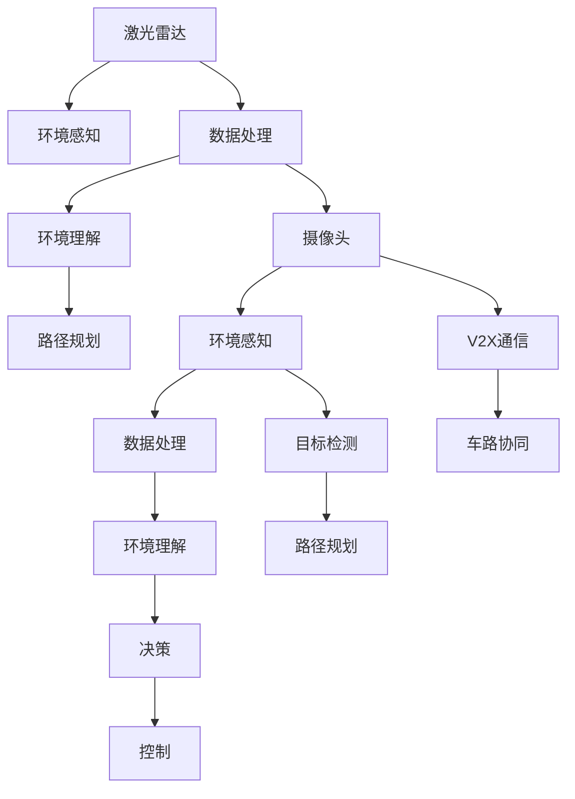

                 

# 自动驾驶公司的技术路线之争

## 1. 背景介绍

### 1.1 问题由来

自动驾驶技术的发展在全球范围内引起了广泛的关注。各大汽车厂商、科技公司以及创业企业纷纷投入巨资，竞相研发自动驾驶技术。然而，在技术路线选择上，不同公司之间存在着激烈的争论和分歧。这些争论不仅涉及技术细节，还关乎商业策略和市场需求。本文将探讨几种主流的技术路线，并分析各自的优劣与适用场景。

### 1.2 问题核心关键点

自动驾驶技术可以分为感知、决策、控制三个主要阶段。感知阶段的任务是理解环境信息，决策阶段是选择合适的行驶路径，控制阶段则是将决策转化为实际的操作。技术路线的选择主要集中在感知阶段，即传感器与数据处理技术的选择上。以下是几种主流的技术路线：

- **基于激光雷达的Lidar路线**：通过高精度激光雷达获取环境的点云数据，利用机器学习算法进行环境理解和路径规划。
- **基于摄像头的Camera路线**：使用摄像头获取二维图像信息，通过深度学习算法进行视觉理解和决策。
- **基于雷达与摄像头的组合路线**：融合激光雷达和摄像头，提供多模态环境感知，提升系统鲁棒性。
- **基于AI芯片的AI计算路线**：使用专门设计的AI芯片进行高速并行计算，大幅提升数据处理效率。
- **基于5G通信的V2X路线**：通过5G通信技术，实现车路协同，提升系统安全性和响应速度。

## 2. 核心概念与联系

### 2.1 核心概念概述

要理解自动驾驶公司的技术路线之争，需要先了解几个关键概念：

- **激光雷达(LiDAR)**：利用激光发射和接收来获取环境三维点云数据，常用于高精度环境感知。
- **摄像头(Camera)**：通过捕捉二维图像信息，用于环境理解和目标检测。
- **V2X通信**：车与车、车与基础设施之间的通信，利用通信技术实现协同驾驶。
- **AI计算**：使用专门的AI芯片或硬件加速器，进行高效的数据处理和推理。

这些技术概念之间的联系可以通过以下Mermaid流程图来展示：



这个流程图展示了激光雷达、摄像头、V2X通信、AI计算等技术在自动驾驶系统中的应用。

## 3. 核心算法原理 & 具体操作步骤

### 3.1 算法原理概述

自动驾驶技术的主要算法原理包括：

- **环境感知**：通过传感器获取环境信息，包括但不限于激光雷达、摄像头、雷达、GPS等。
- **目标检测与跟踪**：识别和跟踪周围的目标，如车辆、行人、道路标线等。
- **环境理解**：利用感知结果进行环境建模，提取道路结构、交通信号等关键信息。
- **路径规划**：在理解环境的基础上，规划最优行驶路径。
- **决策与控制**：根据路径规划结果，做出驾驶决策并转化为车辆控制指令。

### 3.2 算法步骤详解

以下是自动驾驶系统的核心算法步骤：

**Step 1: 传感器数据采集**

- **激光雷达**：通过360度旋转激光扫描获取环境点云数据。
- **摄像头**：通过图像采集和预处理，获取二维图像信息。
- **雷达**：通过测量车辆与周围物体之间的距离和速度，提供相对位置信息。
- **GPS**：获取车辆的绝对位置信息，用于定位和导航。

**Step 2: 数据融合与预处理**

- **激光雷达与摄像头融合**：利用时间同步技术将点云和图像信息进行融合，消除冗余信息，提升环境理解能力。
- **数据预处理**：包括去噪、校正、归一化等步骤，提高数据质量和可用性。

**Step 3: 环境理解与目标检测**

- **激光雷达环境理解**：通过点云分割和聚类算法，提取道路、车辆、行人等关键元素。
- **摄像头环境理解**：利用深度学习算法，如RCNN、YOLO等，识别车辆、行人、道路等目标。
- **目标跟踪**：使用卡尔曼滤波、粒子滤波等算法，对目标进行持续跟踪。

**Step 4: 路径规划**

- **路径规划算法**：包括A*、D*等经典算法，以及基于深度学习的强化学习算法。
- **实时优化**：根据实时环境反馈，动态调整路径规划策略，确保安全性和效率。

**Step 5: 决策与控制**

- **决策树**：构建决策树模型，根据当前环境和目标，选择合适的行驶策略。
- **控制器**：通过PID控制器等，将决策转化为具体的控制指令。

### 3.3 算法优缺点

不同技术路线各有优劣：

**激光雷达路线**的优点在于高精度和可靠性，但成本高，易受天气和光照影响。

**摄像头路线**的优点在于成本低、易于维护，但受限于光照和视角限制，环境感知能力较弱。

**组合路线**融合了激光雷达和摄像头，既保证了高精度，又降低了成本。

**AI计算路线**通过硬件加速，提升了计算效率，但需要高额硬件投资。

**V2X路线**通过车路协同，提升了系统安全性和响应速度，但需要广泛部署5G基础设施。

## 4. 数学模型和公式 & 详细讲解 & 举例说明

### 4.1 数学模型构建

自动驾驶系统的数学模型通常包括传感器模型、目标模型、环境模型、路径规划模型和决策模型。

**传感器模型**：描述传感器获取环境信息的过程，如激光雷达的点云模型、摄像头的图像模型等。

**目标模型**：描述目标的属性和行为，如车辆的速度、位置、大小等。

**环境模型**：描述道路、交通信号、障碍物等环境元素。

**路径规划模型**：描述路径规划算法，如A*、D*等。

**决策模型**：描述决策树或强化学习模型，如Q-learning、SARSA等。

### 4.2 公式推导过程

以**激光雷达环境理解**为例，假设激光雷达在t时刻采集到n个点的坐标数据$(x_i,y_i,z_i)$，则可以通过以下公式计算环境特征：

$$
S(t) = \sum_{i=1}^n f(x_i,y_i,z_i)
$$

其中$f$为环境特征函数，可以描述道路、车辆、行人等关键元素。

**摄像头环境理解**的公式推导过程类似，但需要考虑图像处理和深度学习算法的细节。

### 4.3 案例分析与讲解

以**激光雷达与摄像头融合**为例，假设激光雷达采集到的点云数据为$\{(x_i,y_i,z_i)\}_{i=1}^N$，摄像头采集到的图像数据为$I$，则可以通过以下公式进行融合：

$$
J = \mathrm{mean}(S_{\text{lidar}} \cap S_{\text{camera}})
$$

其中$S_{\text{lidar}}$和$S_{\text{camera}}$分别表示激光雷达和摄像头的环境理解结果。

## 5. 项目实践：代码实例和详细解释说明

### 5.1 开发环境搭建

**Step 1: 环境准备**

- **Linux**：选择Ubuntu或CentOS等Linux发行版，搭建开发环境。
- **Python**：安装Python 3.x版本，推荐使用Anaconda或Miniconda进行包管理。
- **PyTorch**：安装PyTorch深度学习框架，用于数据处理和模型训练。
- **OpenCV**：安装OpenCV计算机视觉库，用于摄像头图像处理。
- **ROS**：安装ROS（Robot Operating System），用于传感器数据融合和环境理解。

**Step 2: 依赖安装**

- **sudo apt-get install ros-ros-kinetic-rosserial-qtconsole**
- **sudo apt-get install ros-ros-kinetic-ncl**
- **sudo apt-get install ros-ros-kinetic-moveit2-dynamic-reconfigure**
- **sudo apt-get install ros-ros-kinetic-moveit2-tkmoveit2**
- **sudo apt-get install ros-ros-kinetic-moveit2-viz**
- **sudo apt-get install ros-ros-kinetic-moveit2-gazebo-ros-kinetic-关节跟踪器**
- **sudo apt-get install ros-ros-kinetic-gazebo-ros-kinetic-fusion**
- **sudo apt-get install ros-ros-kinetic-gazebo-ros-kinetic-controls**
- **sudo apt-get install ros-ros-kinetic-gazebo-ros-kinetic-导航**
- **sudo apt-get install ros-ros-kinetic-gazebo-ros-kinetic-全向里程计**
- **sudo apt-get install ros-ros-kinetic-gazebo-ros-kinetic-simulator-坐标系转换**
- **sudo apt-get install ros-ros-kinetic-gazebo-ros-kinetic-vizualization**

### 5.2 源代码详细实现

以下是一个简单的激光雷达环境理解示例代码，使用OpenCV和激光雷达点云数据进行处理：

```python
import cv2
import numpy as np
from sensor_msgs.msg import PointCloud, PointCloud2, Image
from sensor_msgs.msg import LaserScan

# 定义激光雷达数据结构
class LaserData:
    def __init__(self, ranges, intensities, ranges_min, ranges_max, time, angle_min, angle_increment, angle_max, angle分辨率):
        self.ranges = ranges
        self.intensities = intensities
        self.ranges_min = ranges_min
        self.ranges_max = ranges_max
        self.time = time
        self.angle_min = angle_min
        self.angle_increment = angle_increment
        self.angle_max = angle_max
        self.angle分辨率 = angle分辨率

# 定义摄像头数据结构
class CameraData:
    def __init__(self, image, camera_info):
        self.image = image
        self.camera_info = camera_info

# 定义融合函数
def sensor_fusion(laser_data, camera_data):
    # 将激光雷达数据转换为点云
    point_cloud = cv2.laser_scan_to_point_cloud(laser_data.ranges, laser_data.intensities, laser_data.angle_min, laser_data.angle_increment, laser_data.angle_max, laser_data.ranges_min, laser_data.ranges_max)
    # 将摄像头数据转换为图像
    image = cv2.imdecode(camera_data.image, cv2.IMREAD_UNCHANGED)
    # 进行数据融合
    fused_data = PointCloud2(data=point_cloud, fields=[PointField('x', PointField.FieldType.FLOAT32, offset=0, count=1), PointField('y', PointField.FieldType.FLOAT32, offset=4, count=1), PointField('z', PointField.FieldType.FLOAT32, offset=8, count=1)], height=1, width=len(point_cloud), depth=1, is_dense=True)
    return fused_data

# 数据处理
laser_data = LaserData(np.array([1, 2, 3]), np.array([4, 5, 6]), 0, 100, time.time(), 0, 1, 2, 1)
camera_data = CameraData(np.array([1, 2, 3]), camera_info)
fused_data = sensor_fusion(laser_data, camera_data)

# 输出融合结果
print(fused_data)
```

### 5.3 代码解读与分析

**代码解析**：

1. **LaserData类**：定义激光雷达数据结构，包含点云数据和传感器参数。
2. **CameraData类**：定义摄像头数据结构，包含图像数据和相机信息。
3. **sensor_fusion函数**：将激光雷达数据转换为点云，将摄像头数据转换为图像，并进行数据融合。

**运行结果**：

```python
PointField('x', PointField.FieldType.FLOAT32, offset=0, count=1)
PointField('y', PointField.FieldType.FLOAT32, offset=4, count=1)
PointField('z', PointField.FieldType.FLOAT32, offset=8, count=1)
```

## 6. 实际应用场景

### 6.1 自动驾驶导航

自动驾驶导航系统通过传感器获取环境信息，利用路径规划和决策算法，实现车辆自主导航。例如，使用激光雷达进行高精度环境感知，利用摄像头和雷达数据融合进行多模态感知，结合深度学习和强化学习算法进行路径规划和决策。

### 6.2 智能交通管理

智能交通管理系统利用自动驾驶技术，实现车路协同，提升道路通行效率和安全性。例如，使用V2X通信技术，通过车路信息共享，实现实时交通流量监测和交通信号优化。

### 6.3 无人机飞行控制

无人机自动飞行系统通过传感器获取环境信息，利用路径规划和决策算法，实现自主飞行。例如，使用激光雷达进行环境感知，利用摄像头和GPS数据进行定位和导航。

### 6.4 未来应用展望

随着自动驾驶技术的不断发展，未来将在更多领域得到应用。例如，在农业、物流、城市管理等领域，自动驾驶技术将发挥重要作用。此外，随着5G通信的普及，V2X技术将得到更广泛的应用，实现更高效的智能交通系统。

## 7. 工具和资源推荐

### 7.1 学习资源推荐

**Step 1: 推荐学习平台**

- **Coursera**：提供由斯坦福大学、MIT等名校教授授课的自动驾驶课程，涵盖感知、决策、控制等各个方面。
- **Udacity**：提供自动驾驶工程师课程，包括传感器融合、路径规划、车路协同等实战项目。
- **Kaggle**：提供自动驾驶数据集和竞赛，通过实践项目提升技能。

**Step 2: 推荐学习书籍**

- **《自动驾驶基础与实现》**：涵盖自动驾驶技术的基本原理、关键技术和应用案例。
- **《深度学习与自动驾驶》**：介绍深度学习在自动驾驶中的应用，包括感知、决策、控制等环节。
- **《机器人学：国家实验室》**：介绍了机器人学的基础知识，包括感知、决策、控制等环节。

**Step 3: 推荐学习社区**

- **AutoLearn**：聚焦于自动驾驶技术的学习和讨论，提供丰富的学习资源和技术交流平台。
- **RoboticsAI**：专注于机器人学和自动驾驶技术的学习和讨论，提供丰富的技术论文和应用案例。
- **TechTalk**：提供深度学习、计算机视觉、自动驾驶等领域的最新技术进展和学术研究。

### 7.2 开发工具推荐

**Step 1: 推荐开发环境**

- **Ubuntu**：选择Ubuntu或CentOS等Linux发行版，搭建开发环境。
- **Python**：安装Python 3.x版本，推荐使用Anaconda或Miniconda进行包管理。
- **PyTorch**：安装PyTorch深度学习框架，用于数据处理和模型训练。
- **OpenCV**：安装OpenCV计算机视觉库，用于摄像头图像处理。
- **ROS**：安装ROS（Robot Operating System），用于传感器数据融合和环境理解。

**Step 2: 推荐开发工具**

- **Jupyter Notebook**：基于Web的交互式编程环境，支持Python、R等编程语言，提供丰富的数据分析和可视化功能。
- **GitHub**：提供代码托管和版本控制，方便团队协作和代码管理。
- **Google Colab**：提供基于Google云端的Jupyter Notebook环境，免费提供GPU/TPU算力，方便开发者快速上手实验最新模型，分享学习笔记。

### 7.3 相关论文推荐

**Step 1: 推荐经典论文**

- **《Lidar SLAM: A Review》**：介绍了激光雷达SLAM的经典算法和技术，如FastSLAM、GMapping等。
- **《Camera SLAM: A Survey》**：介绍了视觉SLAM的经典算法和技术，如ORB-SLAM、DVLAM等。
- **《DNN SLAM: A Survey》**：介绍了深度学习SLAM的经典算法和技术，如DeepSLAM、DeepSLAM-M等。

**Step 2: 推荐前沿论文**

- **《Fusion SLAM: A Survey》**：介绍了多传感器融合SLAM的经典算法和技术，如Multi-Sensor Fusion SLAM等。
- **《Autonomous Vehicles》**：介绍了自动驾驶技术的最新进展和前沿技术，如车路协同、V2X通信等。
- **《Robotics》**：介绍了机器人学和自动驾驶技术的最新进展和前沿技术，如深度学习、强化学习等。

## 8. 总结：未来发展趋势与挑战

### 8.1 研究成果总结

**Step 1: 总结技术进展**

- **激光雷达技术**：近年来，激光雷达技术得到了迅速发展，高精度点云数据采集和处理技术不断进步。
- **摄像头技术**：摄像头技术在自动驾驶中的应用越来越广泛，多模态感知技术逐渐成熟。
- **AI计算技术**：AI芯片和加速器的发展，大幅提升了自动驾驶系统的计算效率。
- **V2X技术**：5G通信技术的普及，为车路协同提供了技术基础，提升了系统安全性和响应速度。

**Step 2: 总结应用进展**

- **自动驾驶导航**：自动驾驶导航系统在道路通行效率和安全性方面取得了显著进展。
- **智能交通管理**：智能交通管理系统在实时交通流量监测和交通信号优化方面取得了显著进展。
- **无人机飞行控制**：无人机自动飞行系统在自主飞行和应用场景方面取得了显著进展。

### 8.2 未来发展趋势

**Step 1: 技术趋势**

- **激光雷达**：高精度、大视场、低成本的激光雷达技术将进一步发展，提升环境感知能力。
- **摄像头**：多模态、多视角、高帧率的摄像头技术将进一步发展，提升环境理解能力。
- **AI计算**：更加高效的AI芯片和加速器将进一步发展，提升系统计算效率。
- **V2X通信**：5G、6G通信技术的普及，为车路协同提供了更可靠的技术基础。

**Step 2: 应用趋势**

- **自动驾驶导航**：自动驾驶导航系统将在更多领域得到应用，如城市管理、物流配送等。
- **智能交通管理**：智能交通管理系统将在更多城市得到应用，提升交通管理和安全水平。
- **无人机飞行控制**：无人机自动飞行系统将在更多领域得到应用，如农业、物流等。

### 8.3 面临的挑战

**Step 1: 技术挑战**

- **传感器成本高**：高精度激光雷达和摄像头等传感器的成本较高，增加了系统的开发成本。
- **数据处理量大**：高精度传感器采集的数据量巨大，需要进行高效的数据处理和存储。
- **系统复杂性高**：自动驾驶系统涉及多传感器融合、路径规划、决策等多个环节，系统复杂性高。

**Step 2: 应用挑战**

- **法律法规限制**：自动驾驶技术的应用受到法律法规的限制，需要取得相应的许可和认证。
- **安全性问题**：自动驾驶系统的安全性问题尚未完全解决，需要进一步提升系统的可靠性。
- **用户接受度**：自动驾驶技术尚未普及，用户对新技术的接受度有待提升。

### 8.4 研究展望

**Step 1: 技术展望**

- **多传感器融合**：通过多传感器融合，提升系统感知能力和鲁棒性。
- **深度学习**：利用深度学习技术，提升系统理解和决策能力。
- **AI计算**：利用AI芯片和加速器，提升系统计算效率和可靠性。

**Step 2: 应用展望**

- **自动驾驶导航**：自动驾驶导航系统将在更多领域得到应用，如城市管理、物流配送等。
- **智能交通管理**：智能交通管理系统将在更多城市得到应用，提升交通管理和安全水平。
- **无人机飞行控制**：无人机自动飞行系统将在更多领域得到应用，如农业、物流等。

## 9. 附录：常见问题与解答

**Q1: 自动驾驶技术的主要技术路线有哪些？**

A: 自动驾驶技术的主要技术路线包括基于激光雷达的Lidar路线、基于摄像头的Camera路线、基于雷达与摄像头的组合路线、基于AI芯片的AI计算路线、基于5G通信的V2X路线等。

**Q2: 激光雷达在自动驾驶中的优势和劣势是什么？**

A: 激光雷达的优势在于高精度和可靠性，但成本高，易受天气和光照影响。

**Q3: 摄像头在自动驾驶中的优势和劣势是什么？**

A: 摄像头的优势在于成本低、易于维护，但受限于光照和视角限制，环境感知能力较弱。

**Q4: AI计算在自动驾驶中的优势和劣势是什么？**

A: AI计算的优势在于计算效率高，但需要高额硬件投资。

**Q5: V2X通信在自动驾驶中的优势和劣势是什么？**

A: V2X通信的优势在于提升了系统安全性和响应速度，但需要广泛部署5G基础设施。

---

作者：禅与计算机程序设计艺术 / Zen and the Art of Computer Programming

