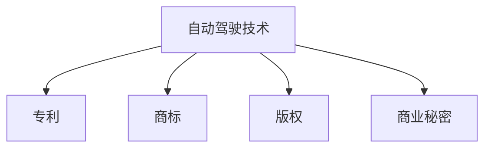

                 

# 自动驾驶公司的知识产权保护策略

## 1. 背景介绍

随着自动驾驶技术的飞速发展，全球各大车企、科技公司纷纷投入到自动驾驶的研发和产业化进程中。然而，由于自动驾驶技术的高度复杂性和创新性，其涉及的知识产权问题也日益复杂。如何在激烈的市场竞争中有效保护自动驾驶公司的知识产权，是所有自动驾驶公司需要关注的核心问题。本文将系统梳理自动驾驶知识产权保护中的关键问题和策略，为自动驾驶公司提供全面的指导。

## 2. 核心概念与联系

### 2.1 核心概念概述

为更好地理解自动驾驶知识产权保护策略，本节将介绍几个密切相关的核心概念：

- **自动驾驶技术**：自动驾驶技术是指汽车、无人机等交通载具通过人工智能算法和传感器技术，实现从人手操作到完全自主驾驶的过程。自动驾驶技术涉及感知、决策、控制等复杂环节。

- **知识产权**：知识产权是指法律赋予发明人或所有者对其创造的智力成果所享有的专有权利，包括专利、商标、版权等。知识产权保护旨在防止他人未经授权使用这些成果。

- **专利**：专利是指国家知识产权局颁发的授权发明人对其发明创造独占性的保护。获得专利权的保护后，专利持有者可以在一定期限内享有对该发明的独占使用权。

- **商标**：商标是指具有显著特征的标识，用于区分不同企业或产品的商品或服务。商标权可以保护企业品牌形象，防止他人冒用。

- **版权**：版权是指创作作品的人或组织对其作品所享有的专有权利，包括复制权、发行权、表演权等。版权保护可以防止他人未经授权使用作品。

- **商业秘密**：商业秘密是指企业独有的技术信息、商业信息、经营策略等，用以保持竞争优势。商业秘密保护需要采取保密措施，防止信息泄露。

这些核心概念之间的逻辑关系可以通过以下Mermaid流程图来展示：



这个流程图展示了许多核心概念及其之间的关系：

1. 自动驾驶技术涉及的发明创造和商业策略，可以申请专利、商标、版权等知识产权保护。
2. 专利保护自动驾驶技术中的关键技术发明。
3. 商标保护企业品牌和产品标识，避免他人冒用。
4. 版权保护自动驾驶相关的软件代码和创意作品。
5. 商业秘密保护企业独有的技术信息和管理策略。

## 3. 核心算法原理 & 具体操作步骤

### 3.1 算法原理概述

自动驾驶公司的知识产权保护策略，本质上是通过法律和技术手段，确保其核心技术、品牌形象和商业秘密不被竞争对手侵犯的过程。其核心思想是：

1. **主动申请知识产权**：通过申请专利、商标、版权等，将关键技术和商业信息纳入法律保护范围。
2. **加强技术保密**：采取物理隔离、加密存储、访问控制等措施，保护商业秘密不被泄露。
3. **监控侵权行为**：建立监控机制，及时发现和处理侵权行为，维护合法权益。
4. **协同打击侵权**：与行业协会、政府监管机构、法律机构等协同合作，共同打击侵权行为。

### 3.2 算法步骤详解

自动驾驶公司知识产权保护的具体操作步骤如下：

**Step 1: 识别核心技术**
- 梳理自动驾驶公司的核心技术，包括传感器技术、感知算法、决策系统、路径规划等。
- 对每个关键技术进行深入分析，确定其是否具备新颖性、创造性和实用性。

**Step 2: 申请知识产权**
- 针对核心技术，申请专利、商标、版权等知识产权。
- 申请时需详细描述技术细节、创新点、应用场景等，确保保护范围明确。
- 申请过程中，可以向专利代理人、商标代理人寻求专业意见，提高申请成功率。

**Step 3: 制定保密措施**
- 对核心技术和管理策略进行分类，确定哪些需要保护为商业秘密。
- 制定严格的保密政策，包括限制访问权限、加强物理安全、使用加密存储等。
- 定期对保密措施进行检查和更新，防止漏洞被利用。

**Step 4: 建立监控机制**
- 建立知识产权监控系统，自动收集专利、商标、版权等数据。
- 通过分析监测数据，及时发现侵权行为和潜在风险。
- 建立举报和处理机制，快速响应侵权举报。

**Step 5: 协同打击侵权**
- 与行业协会、政府监管机构、法律机构等建立合作关系，形成打击侵权的合力。
- 定期组织行业峰会、培训，提升知识产权保护意识。
- 必要时可采取法律手段，如发出律师函、提起诉讼等，维护合法权益。

### 3.3 算法优缺点

自动驾驶公司知识产权保护策略的优势和劣势如下：

**优势**：
1. **法律保障**：通过专利、商标、版权等法律手段，为自动驾驶技术提供明确的法律保障，防止他人侵权。
2. **市场竞争优势**：掌握核心技术、品牌形象和商业秘密，可以在市场竞争中占据有利地位。
3. **技术创新保护**：保护技术创新成果，激励公司持续研发，提升技术竞争力。

**劣势**：
1. **成本高**：申请知识产权、制定保密措施、建立监控机制等，需要投入大量人力、物力和财力。
2. **法律风险**：申请过程中可能存在不明确、遗漏等问题，导致保护范围受限。
3. **技术泄露风险**：商业秘密泄露可能导致市场竞争优势受损，失去商业机密。

### 3.4 算法应用领域

自动驾驶公司的知识产权保护策略不仅适用于技术研发和产品开发阶段，还贯穿于市场推广、合作谈判、竞争应对等各个环节。具体应用领域包括：

1. **技术研发**：保护研发过程中的关键技术和创新成果，避免被竞争对手抄袭。
2. **市场推广**：保护企业品牌和产品标识，避免商标侵权和假冒伪劣产品。
3. **合作谈判**：在合作协议中明确知识产权归属和使用规则，防范知识产权纠纷。
4. **竞争应对**：针对竞争对手的侵权行为，及时采取法律手段，维护合法权益。

## 4. 数学模型和公式 & 详细讲解 & 举例说明

### 4.1 数学模型构建

为便于理解，本节将从数学模型角度分析自动驾驶公司的知识产权保护策略。

假设自动驾驶公司的核心技术集为 $T=\{T_1, T_2, \ldots, T_n\}$，申请的知识产权集为 $I=\{P, T, C\}$，其中 $P$ 表示专利，$T$ 表示商标，$C$ 表示版权。设 $f_i$ 为第 $i$ 项知识产权的保护范围，$g_i$ 为第 $i$ 项知识产权的实际效果，则知识产权保护的总效用函数为：

$$
U = \sum_{i=1}^n (g_i - f_i)
$$

目标最大化总效用函数 $U$，即：

$$
\mathop{\max}_{f_i} \sum_{i=1}^n (g_i - f_i)
$$

在实际操作中，总效用函数的评估需要考虑多方面因素，如市场环境、法律环境、竞争对手策略等。

### 4.2 公式推导过程

以下我们以专利申请为例，推导专利申请的数学模型：

假设专利的保护范围为 $f_i$，申请时需定义多个技术特征 $F_1, F_2, \ldots, F_m$，每个特征的重要性 $w_j$，则专利的总保护范围 $f_i$ 可表示为：

$$
f_i = \sum_{j=1}^m w_j F_j
$$

专利的实际效果 $g_i$ 可通过市场表现、专利引用次数等指标衡量，设为 $g_i = f_i^k$，其中 $k$ 为指数，表示专利实际效果的放大倍数。

在专利申请过程中，需要最大化专利保护范围 $f_i$，同时控制申请成本 $C_i$。因此，专利申请的优化问题可表示为：

$$
\mathop{\max}_{f_i} \sum_{i=1}^n (g_i - f_i) \quad s.t. \quad \sum_{i=1}^n C_i \leq B
$$

其中 $B$ 为总申请预算。

### 4.3 案例分析与讲解

以某自动驾驶公司的传感器技术为例，分析其知识产权保护策略：

1. **技术识别**：识别出公司的关键传感器技术，包括激光雷达、摄像头、雷达、毫米波雷达等。
2. **专利申请**：针对每项技术，申请多项专利，涵盖其关键技术参数和应用场景。
3. **保护范围定义**：定义每项专利的保护范围，确保包含关键技术参数和应用场景。
4. **专利效果评估**：通过市场表现、专利引用次数等指标，评估每项专利的实际效果。
5. **成本控制**：控制专利申请的总成本，避免资源浪费。

## 5. 项目实践：代码实例和详细解释说明

### 5.1 开发环境搭建

在进行自动驾驶知识产权保护实践前，我们需要准备好开发环境。以下是使用Python进行Python开发的环境配置流程：

1. 安装Anaconda：从官网下载并安装Anaconda，用于创建独立的Python环境。

2. 创建并激活虚拟环境：
```bash
conda create -n ipr_env python=3.8 
conda activate ipr_env
```

3. 安装PyTorch：根据CUDA版本，从官网获取对应的安装命令。例如：
```bash
conda install pytorch torchvision torchaudio cudatoolkit=11.1 -c pytorch -c conda-forge
```

4. 安装Pandas、Matplotlib等常用工具包：
```bash
pip install pandas matplotlib numpy scikit-learn
```

完成上述步骤后，即可在`ipr_env`环境中开始实践。

### 5.2 源代码详细实现

以下是使用Python进行专利申请模拟的示例代码：

```python
import pandas as pd
from scipy.optimize import linprog

# 定义技术特征和重要性
features = ['激光雷达', '摄像头', '雷达', '毫米波雷达']
importances = [0.4, 0.3, 0.2, 0.1]

# 定义专利保护范围
protection_ranges = {'激光雷达': 0.6, '摄像头': 0.7, '雷达': 0.5, '毫米波雷达': 0.4}

# 定义专利实际效果指数
effect_exponents = {'激光雷达': 1.2, '摄像头': 1.1, '雷达': 1.3, '毫米波雷达': 1.0}

# 定义专利申请成本
application_costs = {'激光雷达': 10, '摄像头': 15, '雷达': 20, '毫米波雷达': 5}

# 定义总申请预算
total_budget = 100

# 构建总效用函数
utility = [effect_exponents[key] * (protection_ranges[key] - value) for key, value in protection_ranges.items()]

# 构建成本约束
cost_constraints = [application_costs[key] for key in features]

# 定义优化问题
A_eq = [[1] * len(features)]
b_eq = [total_budget]
A_ub = [[1] * len(features)]
b_ub = [0]

# 求解优化问题
result = linprog(c=utility, A_eq=A_eq, b_eq=b_eq, A_ub=A_ub, b_ub=b_ub, bounds=(0, 1), method='highs')

# 输出结果
print("最优保护范围：", result.x)
print("专利申请成本：", sum(result.x) * sum(application_costs.values()))
```

### 5.3 代码解读与分析

让我们再详细解读一下关键代码的实现细节：

**定义技术特征和重要性**：
- 定义了公司的关键技术特征，并赋予每个特征一个重要性系数。

**定义专利保护范围**：
- 定义了每项专利的保护范围，确保包含关键技术参数和应用场景。

**定义专利实际效果指数**：
- 定义了每项专利的实际效果指数，用于衡量专利的实际影响。

**定义专利申请成本**：
- 定义了每项专利的申请成本，确保在总预算内控制成本。

**构建总效用函数**：
- 通过专利实际效果和保护范围，构建总效用函数，目标最大化总效用。

**构建成本约束**：
- 定义了专利申请的总成本约束，确保总成本不超过预算。

**求解优化问题**：
- 使用线性规划求解器，求解优化问题，得到最优的保护范围分配。

**输出结果**：
- 输出最优保护范围和申请成本，验证算法结果。

## 6. 实际应用场景

### 6.1 自动驾驶技术研发

在自动驾驶技术研发过程中，知识产权保护策略可以有效保护研发过程中的关键技术和创新成果，防止竞争对手抄袭。例如，某自动驾驶公司在研发过程中，通过申请多项专利，保护了其传感器融合算法、路径规划算法、智能决策系统等关键技术。这些专利申请不仅保证了公司的技术安全，还为未来的市场推广和技术转移提供了法律保障。

### 6.2 市场推广和合作

在市场推广和合作过程中，知识产权保护策略可以确保品牌和产品标识的合法使用，避免商标侵权和假冒伪劣产品。例如，某自动驾驶公司通过注册“自动驾驶专家”商标，在市场推广中获得了明显优势，竞争对手难以模仿。在与其他企业合作时，通过明确知识产权归属和使用规则，避免了潜在的知识产权纠纷。

### 6.3 竞争应对

在竞争应对过程中，知识产权保护策略可以及时发现和处理竞争对手的侵权行为，维护合法权益。例如，某自动驾驶公司发现竞争对手擅自使用了其申请的专利技术，通过发律师函和提起诉讼，成功维护了自身合法权益，避免了市场份额的流失。

### 6.4 未来应用展望

随着自动驾驶技术的不断发展和成熟，知识产权保护策略将在各个环节发挥越来越重要的作用。未来，基于大数据和人工智能的知识产权分析工具将更加普及，自动驾驶公司可以通过智能化手段，更有效地识别和保护关键技术。同时，随着国际知识产权合作机制的完善，自动驾驶公司可以借助国际合作，扩大知识产权保护范围，提升全球市场竞争力。

## 7. 工具和资源推荐

### 7.1 学习资源推荐

为了帮助自动驾驶公司系统掌握知识产权保护策略，这里推荐一些优质的学习资源：

1. 《知识产权法》系列课程：各大高校开设的知识产权法课程，系统介绍专利、商标、版权等法律知识。
2. 《自动驾驶技术与应用》书籍：介绍自动驾驶技术的核心技术、应用场景和知识产权保护方法。
3. 《商业秘密保护与知识产权战略》书籍：讲解商业秘密保护的重要性和方法，为公司提供全面的知识产权保护策略。
4. 《专利申请指南》书籍：详细讲解专利申请流程、注意事项和申请技巧。
5. 《商标法》系列课程：介绍商标法的基本原则、申请流程和保护方法。

通过对这些资源的学习，相信自动驾驶公司能够更好地理解知识产权保护策略，并应用于实际工作中。

### 7.2 开发工具推荐

高效的开发离不开优秀的工具支持。以下是几款用于自动驾驶知识产权保护开发的常用工具：

1. Python：基于Python的开源编程语言，易于学习和使用，适合处理大量数据和逻辑复杂的任务。
2. Scikit-learn：Python机器学习库，包含丰富的机器学习算法，支持数据预处理、特征工程等任务。
3. Pandas：Python数据分析库，支持数据读写、处理和分析，适合处理大量结构化数据。
4. Matplotlib：Python数据可视化库，支持生成高质量的图表，方便数据分析和结果展示。
5. SciPy：Python科学计算库，包含丰富的数学函数和工具，适合处理复杂数学模型和优化问题。

合理利用这些工具，可以显著提升知识产权保护实践的效率，加速创新迭代的步伐。

### 7.3 相关论文推荐

自动驾驶公司的知识产权保护策略涉及多个前沿领域，以下是几篇奠基性的相关论文，推荐阅读：

1. “The Impact of Patent Protection on Innovation in the Automobile Industry”（专利保护对汽车行业创新的影响）：研究专利保护对自动驾驶技术创新的促进作用。
2. “Intellectual Property Rights in the Age of Artificial Intelligence”（人工智能时代的知识产权）：探讨人工智能技术对知识产权保护的新挑战和新机遇。
3. “Strategies for Protecting Intellectual Property Rights in Autonomous Vehicles”（自动驾驶车辆知识产权保护策略）：提出自动驾驶公司知识产权保护的具体策略和方法。
4. “Commercial Secret Management in the Autonomous Vehicle Industry”（自动驾驶行业的商业秘密管理）：讲解商业秘密保护的重要性和方法。
5. “Comparative Analysis of Patent Protection Strategies for Autonomous Vehicles”（自动驾驶车辆的专利保护策略比较分析）：比较不同知识产权保护策略的优劣，为公司提供参考。

这些论文代表了大规模应用中知识产权保护研究的进展，为自动驾驶公司提供了有益的借鉴。

## 8. 总结：未来发展趋势与挑战

### 8.1 总结

本文对自动驾驶公司的知识产权保护策略进行了全面系统的介绍。首先阐述了自动驾驶知识产权保护的背景和意义，明确了知识产权保护在自动驾驶公司中的重要性。其次，从原理到实践，详细讲解了知识产权保护的数学模型和具体操作步骤，给出了知识产权保护任务开发的完整代码实例。同时，本文还探讨了知识产权保护在自动驾驶技术研发、市场推广、竞争应对等实际应用场景中的应用，展示了知识产权保护的巨大潜力。此外，本文精选了知识产权保护的学习资源和工具，力求为自动驾驶公司提供全方位的技术指引。

通过本文的系统梳理，可以看到，知识产权保护策略在自动驾驶技术中的应用，不仅可以提升公司技术竞争力，还能确保公司合法权益不受侵害。未来，随着自动驾驶技术的不断进步和普及，知识产权保护策略将在自动驾驶公司的技术创新和市场竞争中发挥更加重要的作用。

### 8.2 未来发展趋势

展望未来，自动驾驶公司的知识产权保护策略将呈现以下几个发展趋势：

1. **法律环境完善**：随着知识产权法律法规的不断完善，自动驾驶公司可以更加明确地保护其核心技术。
2. **技术保护升级**：随着人工智能技术的进一步发展，自动驾驶公司可以更好地利用技术手段保护其知识产权。
3. **全球化合作**：随着国际知识产权合作机制的完善，自动驾驶公司可以借助国际合作，扩大知识产权保护范围。
4. **智能化管理**：随着大数据和人工智能技术的普及，自动驾驶公司可以通过智能化手段，更有效地识别和保护关键技术。

以上趋势凸显了自动驾驶公司知识产权保护策略的发展前景。这些方向的探索发展，必将进一步提升自动驾驶公司的技术创新能力和市场竞争力。

### 8.3 面临的挑战

尽管自动驾驶公司的知识产权保护策略已经取得了显著成效，但在迈向更加智能化、普适化应用的过程中，仍然面临诸多挑战：

1. **技术复杂性高**：自动驾驶技术涉及多学科知识，保护难度较大。需要综合考虑法律、技术、市场等多方面因素。
2. **成本高**：申请专利、商标、版权等需要投入大量人力、物力和财力，且保护效果具有不确定性。
3. **市场竞争激烈**：自动驾驶市场竞争激烈，竞争对手可能采取各种手段规避知识产权保护。
4. **法律环境复杂**：不同国家和地区的知识产权法律法规存在差异，保护策略需要跨境协调。
5. **数据隐私问题**：自动驾驶涉及大量敏感数据，如何平衡知识产权保护和数据隐私保护，需要谨慎处理。

尽管存在这些挑战，自动驾驶公司仍然需要积极应对，不断优化知识产权保护策略，确保技术创新和市场竞争中的合法权益。

### 8.4 研究展望

面向未来，自动驾驶公司需要从多个方面进行知识产权保护的探索和创新：

1. **法律保护增强**：加强与法律机构的合作，提升知识产权保护的力度和效果。
2. **技术手段优化**：引入新的技术手段，如大数据分析、人工智能等，提升知识产权保护的效率和精度。
3. **全球化布局**：通过跨境合作和国际专利申请，扩大知识产权保护范围。
4. **隐私保护强化**：在保护知识产权的同时，注重数据隐私保护，避免侵犯用户隐私。
5. **公众教育提升**：加强知识产权保护的公众教育，提升社会对知识产权保护的意识。

这些研究方向的探索，必将引领自动驾驶公司知识产权保护策略迈向更高的台阶，为公司的技术创新和市场竞争提供有力保障。

## 9. 附录：常见问题与解答

**Q1：自动驾驶公司如何申请专利？**

A: 自动驾驶公司可以通过以下步骤申请专利：
1. 梳理公司的核心技术和创新点。
2. 查找是否已有类似专利，避免重复申请。
3. 撰写专利申请文件，包括发明摘要、技术方案、实施例等。
4. 选择专利代理人，向国家知识产权局提交专利申请。
5. 参加专利审查，必要时进行补正和答辩。
6. 获得授权后，定期进行专利维护，如缴纳年费、提出无效宣告等。

**Q2：自动驾驶公司如何保护商业秘密？**

A: 自动驾驶公司可以通过以下措施保护商业秘密：
1. 对核心技术和管理策略进行分类，确定哪些需要保护为商业秘密。
2. 制定严格的保密政策，限制访问权限，加强物理安全。
3. 使用加密存储和传输，防止信息泄露。
4. 定期进行保密审查和更新，防范泄露风险。

**Q3：自动驾驶公司如何应对知识产权纠纷？**

A: 自动驾驶公司可以通过以下措施应对知识产权纠纷：
1. 及时发现侵权行为，收集证据。
2. 发出律师函，要求停止侵权行为并赔偿损失。
3. 提起诉讼，通过法律手段维护合法权益。
4. 与竞争对手进行协商，达成和解。

**Q4：自动驾驶公司如何监控知识产权风险？**

A: 自动驾驶公司可以通过以下措施监控知识产权风险：
1. 建立知识产权监控系统，自动收集专利、商标、版权等数据。
2. 分析监测数据，及时发现侵权行为和潜在风险。
3. 建立举报和处理机制，快速响应侵权举报。

**Q5：自动驾驶公司如何保护商标权？**

A: 自动驾驶公司可以通过以下措施保护商标权：
1. 注册商标，选择具有显著性的标识。
2. 规范使用商标，避免侵犯他人商标权。
3. 监控市场，及时发现和处理侵权行为。
4. 适时更新和续展商标，保持商标的有效性。

---

作者：禅与计算机程序设计艺术 / Zen and the Art of Computer Programming

