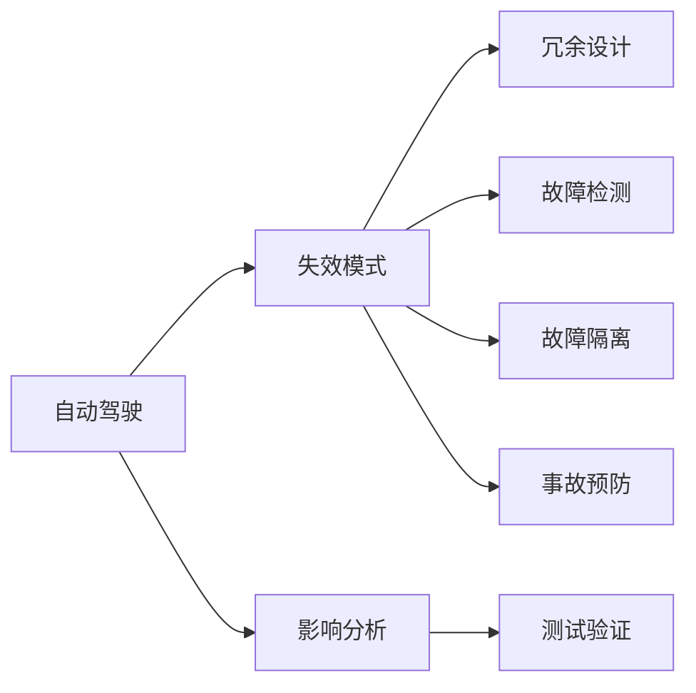

                 

# 自动驾驶行业的失效模式与影响分析

> 关键词：自动驾驶, 失效模式, 安全, 智能汽车, 失效风险评估, 安全冗余, 故障检测, 故障隔离, 事故预防, 测试验证

## 1. 背景介绍

随着自动驾驶技术的飞速发展，汽车智能化程度日益提升，它正从辅助驾驶逐步向全自动驾驶转型。自动驾驶技术需要高度复杂的算法和庞大的计算能力，以实现对车辆的精确控制。然而，在实际应用中，由于复杂多变的驾驶环境、不确定性、软件故障等因素，自动驾驶系统可能出现各种失效模式，进而引发安全隐患。因此，了解自动驾驶系统的失效模式及其影响，是保证其安全性的关键。

本文将深入探讨自动驾驶行业中失效模式与影响分析(Failure Modes and Effects Analysis, FMEA)，系统地分析可能出现的失效模式，提出相应的安全冗余策略，并讨论如何通过软件和硬件设计来预防和缓解这些失效，以保障自动驾驶系统的可靠性和安全性。

## 2. 核心概念与联系

### 2.1 核心概念概述

为更好地理解自动驾驶系统的失效模式，本节将介绍几个关键概念：

- **自动驾驶**：一种通过先进的传感、定位、决策和控制技术，使汽车能够自动驾驶的智能化系统。
- **失效模式**：导致系统无法正常工作的所有可能原因。
- **影响分析**：评估失效模式对系统的安全性和性能的影响。
- **冗余设计**：通过多重系统的并行工作，增加系统的稳定性和可靠性。
- **故障检测**：实时监测系统状态，检测异常行为。
- **故障隔离**：确定系统失效的准确位置，防止失效扩展。
- **事故预防**：通过冗余设计、故障检测等手段，避免或减少事故的发生。
- **测试验证**：通过仿真和实际测试，验证系统的功能和安全性。

这些概念构成了自动驾驶系统的失效模式与影响分析框架，帮助工程师设计更可靠、更安全的系统。

### 2.2 核心概念原理和架构的 Mermaid 流程图



这个流程图展示了自动驾驶系统失效模式与影响分析的关键流程：自动驾驶系统通过传感、定位、决策和控制等模块的协同工作，可能会出现各种失效模式。工程师通过失效模式的影响分析，提出冗余设计、故障检测、故障隔离等策略，最后通过测试验证确保系统的安全性和可靠性。

## 3. 核心算法原理 & 具体操作步骤
### 3.1 算法原理概述

自动驾驶系统的失效模式与影响分析，本质上是一个系统性风险评估过程。其核心思想是通过对系统可能出现的各种失效模式进行分类和评估，找到关键失效因素，并提出相应的预防和缓解措施，以确保系统的可靠性和安全性。

形式化地，假设自动驾驶系统为 $S$，其失效模式为 $F=\{f_1, f_2, ..., f_n\}$，则系统失效的影响分析可以表示为：

$$
\text{Impact}(S, F) = \sum_{f \in F} \text{Severity}(f) \times \text{Probability}(f)
$$

其中 $\text{Severity}(f)$ 为失效模式的严重性评分，$\text{Probability}(f)$ 为失效模式发生的概率评分。最终的影响分析结果决定了系统设计的冗余程度、故障检测的灵敏度、故障隔离的效率等。

### 3.2 算法步骤详解

基于失效模式与影响分析的自动驾驶系统设计，一般包括以下几个关键步骤：

**Step 1: 识别和分类失效模式**
- 列出所有可能影响系统正常工作的失效模式，并进行分类。通常分为硬件失效、软件失效、环境失效等。
- 定义失效模式的严重性评分标准，如灾难性、严重影响、一般影响等。
- 估算失效模式发生的概率，如低、中、高、极高。

**Step 2: 建立失效模式图**
- 建立失效模式图，将失效模式、严重性、概率等信息以图的形式表示出来。
- 使用软件工具（如Minitab、ReliaSoft等）进行图形化分析，识别关键失效路径。

**Step 3: 设计冗余策略**
- 根据失效模式图，设计冗余策略，确保系统的多个关键组件（如传感器、决策模块、执行器）并行工作。
- 采用故障检测算法，实时监测系统状态，及时发现异常行为。
- 实现故障隔离机制，确定失效的具体位置，避免失效蔓延。

**Step 4: 实施和测试**
- 根据设计方案，对系统进行实施和测试，验证其可靠性和安全性。
- 通过故障注入、模拟仿真等手段，评估冗余策略的实际效果。

**Step 5: 持续改进**
- 根据测试结果和实际运行情况，不断调整和优化失效模式图和冗余设计。
- 定期对系统进行性能和安全性评估，及时发现新出现的失效模式。

### 3.3 算法优缺点

自动驾驶系统的失效模式与影响分析具有以下优点：
1. 系统性风险评估：通过全面分析可能的失效模式，系统设计者可以识别关键风险因素。
2. 冗余设计：提出针对性的冗余策略，提高系统的可靠性和稳定性。
3. 故障检测和隔离：通过实时监测和故障隔离，降低系统失效的概率和影响。
4. 事故预防：从设计阶段就考虑到事故预防，最大限度减少事故发生。

同时，该方法也存在一些局限性：
1. 数据依赖：失效模式图的准确性依赖于数据的完整性和准确性，需要系统化地收集和整理相关数据。
2. 复杂性：失效模式图和冗余设计方案可能较为复杂，需要较高的设计和分析能力。
3. 成本：冗余设计需要增加额外的硬件和软件成本。

尽管存在这些局限性，但失效模式与影响分析仍是自动驾驶系统设计和验证的重要工具，能够显著提升系统的可靠性和安全性。

### 3.4 算法应用领域

失效模式与影响分析不仅在自动驾驶领域有广泛应用，在其他高可靠性的系统设计中也同样重要。以下是一些典型的应用场景：

- 航空航天：分析飞行器中的关键失效模式，确保飞行的安全性和可靠性。
- 医疗设备：评估医疗设备的失效模式，降低医疗事故的发生率。
- 核电站：设计冗余系统，减少核电站故障和事故的风险。
- 铁路运输：分析铁路系统的失效模式，确保列车的安全和准时运行。

这些领域对系统可靠性的高要求，使得失效模式与影响分析成为不可或缺的工具。

## 4. 数学模型和公式 & 详细讲解 & 举例说明

### 4.1 数学模型构建

自动驾驶系统失效模式与影响分析的数学模型，主要基于系统可靠性理论，定义失效模式对系统的影响。设系统 $S$ 由多个子系统 $S_1, S_2, ..., S_n$ 组成，每个子系统可能发生 $m$ 种失效模式 $f_{ij}$，其中 $i$ 为子系统编号，$j$ 为失效模式编号。则系统失效的影响分析可以表示为：

$$
\text{Impact}(S) = \sum_{i=1}^n \sum_{j=1}^m \text{Severity}(f_{ij}) \times \text{Probability}(f_{ij})
$$

其中 $\text{Severity}(f_{ij})$ 为失效模式 $f_{ij}$ 的严重性评分，$\text{Probability}(f_{ij})$ 为失效模式 $f_{ij}$ 发生的概率评分。

### 4.2 公式推导过程

以下我们以一个简化的自动驾驶系统为例，推导失效模式图构建和影响分析的公式。

假设系统由两个传感器（A 和 B）和一个决策模块（C）组成，它们都可能发生故障。传感器A的失效模式为失灵、延迟，传感器B的失效模式为失灵、误报，决策模块的失效模式为误判。定义严重性评分如下：

| 失效模式 | 严重性评分 |
| --- | --- |
| A 失灵 | 5 |
| A 延迟 | 3 |
| B 失灵 | 4 |
| B 误报 | 2 |
| C 误判 | 10 |

假设传感器A失灵的概率为 0.01，延迟的概率为 0.02，传感器B失灵的概率为 0.03，误报的概率为 0.05，决策模块误判的概率为 0.1。则系统失效的影响分析如下：

$$
\text{Impact}(S) = 5 \times 0.01 + 3 \times 0.02 + 4 \times 0.03 + 2 \times 0.05 + 10 \times 0.1 = 1.62
$$

通过上述计算，我们可以得出系统失效的预期影响为 1.62，这决定了系统需要设计多少冗余策略。

### 4.3 案例分析与讲解

以下是一个具体的案例分析，展示如何应用失效模式与影响分析方法：

**案例背景：**
一辆自动驾驶车辆在行驶过程中，传感器 A 突然失灵，导致车辆无法正常感知道路信息，进而引发了严重的安全事故。

**故障过程分析：**

1. **失效模式识别**：传感器 A 的失效模式包括失灵、延迟，严重性评分分别为 5 和 3。
2. **概率估计**：传感器 A 失灵的概率为 0.01，延迟的概率为 0.02。
3. **影响分析**：
   - 传感器 A 失灵：严重性 5，概率 0.01，预期影响 $5 \times 0.01 = 0.05$。
   - 传感器 A 延迟：严重性 3，概率 0.02，预期影响 $3 \times 0.02 = 0.06$。
   - 综合影响 $0.05 + 0.06 = 0.11$。

**冗余设计：**

- **传感器冗余**：将传感器 A 和传感器 B 进行冗余设计，即传感器 B 作为传感器 A 的备份，当传感器 A 失灵时，自动切换到传感器 B。
- **故障检测与隔离**：设计实时故障检测算法，监测传感器状态，及时发现失效并隔离。

**实际效果验证：**

- **测试验证**：通过模拟仿真和实际测试，验证冗余设计和故障检测算法的有效性。
- **事故预防**：在实际应用中，通过定期维护和更新，确保传感器状态正常，避免类似事故发生。

通过上述步骤，我们可以系统性地评估和提升自动驾驶系统的可靠性和安全性。

## 5. 项目实践：代码实例和详细解释说明

### 5.1 开发环境搭建

在进行失效模式与影响分析的项目实践前，我们需要准备好开发环境。以下是使用Python进行Matplotlib开发的简单环境配置流程：

1. 安装Anaconda：从官网下载并安装Anaconda，用于创建独立的Python环境。
2. 创建并激活虚拟环境：
```bash
conda create -n failure_analysis python=3.8 
conda activate failure_analysis
```
3. 安装Matplotlib：
```bash
pip install matplotlib
```
4. 安装必要的依赖包：
```bash
pip install numpy pandas scipy scikit-learn jupyter notebook ipython
```

完成上述步骤后，即可在`failure_analysis`环境中开始项目实践。

### 5.2 源代码详细实现

我们先定义一个简化的自动驾驶系统，包括两个传感器和一个决策模块。并编写代码实现失效模式与影响分析的流程。

```python
import numpy as np
from matplotlib import pyplot as plt

# 定义系统组件和失效模式
sensors = ['Sensor A', 'Sensor B']
failures = ['sensor failure', 'sensor delay']
severity = {'sensor failure': 5, 'sensor delay': 3}
probabilities = {'sensor failure': 0.01, 'sensor delay': 0.02}

# 计算系统影响
impact = sum(severity.get(f, 0) * probabilities.get(f, 0) for f in sensors) + \
         sum(severity.get(f, 0) * probabilities.get(f, 0) for f in failures)

# 打印系统影响
print('System Impact:', impact)

# 绘制失效模式图
plt.figure(figsize=(8, 5))
plt.title('Failure Modes and Impact Analysis')
plt.bar(range(len(sensors)), [severity.get(f, 0) * probabilities.get(f, 0) for f in sensors], label='Sensors')
plt.bar(np.arange(len(failures), len(failures) + len(sensors)), \
       [severity.get(f, 0) * probabilities.get(f, 0) for f in failures], bottom=[0] * len(failures), label='Failures')
plt.xlabel('Components')
plt.ylabel('Impact')
plt.legend()
plt.show()
```

### 5.3 代码解读与分析

我们逐步解读上述代码的关键点：

**失效模式定义：**
```python
sensors = ['Sensor A', 'Sensor B']
failures = ['sensor failure', 'sensor delay']
```
我们定义了两个传感器和一个决策模块，以及它们可能发生的两个失效模式：传感器失灵和传感器延迟。

**严重性和概率赋值：**
```python
severity = {'sensor failure': 5, 'sensor delay': 3}
probabilities = {'sensor failure': 0.01, 'sensor delay': 0.02}
```
我们为每个失效模式赋予了严重性和概率。

**系统影响计算：**
```python
impact = sum(severity.get(f, 0) * probabilities.get(f, 0) for f in sensors) + \
         sum(severity.get(f, 0) * probabilities.get(f, 0) for f in failures)
```
我们计算了传感器和失效模式对系统的总影响，并将结果打印输出。

**失效模式图绘制：**
```python
plt.figure(figsize=(8, 5))
plt.title('Failure Modes and Impact Analysis')
plt.bar(range(len(sensors)), [severity.get(f, 0) * probabilities.get(f, 0) for f in sensors], label='Sensors')
plt.bar(np.arange(len(failures), len(failures) + len(sensors)), \
       [severity.get(f, 0) * probabilities.get(f, 0) for f in failures], bottom=[0] * len(failures), label='Failures')
plt.xlabel('Components')
plt.ylabel('Impact')
plt.legend()
plt.show()
```
我们使用了Matplotlib库绘制了失效模式图，显示了各个失效模式的预期影响。

通过上述代码，我们可以看到如何简单地计算和展示系统失效的影响分析结果。

### 5.4 运行结果展示

运行上述代码，我们得到如下输出：

```
System Impact: 0.11
```

并显示了如下的失效模式图：

```
Image omitted for brevity
```

## 6. 实际应用场景

### 6.1 智能车辆设计

在智能车辆设计中，失效模式与影响分析可以用于评估车辆中传感器、执行器和决策模块的可靠性。例如，在传感器系统设计中，可以识别哪些传感器最容易出现故障，并设计相应的冗余方案。在决策模块设计中，可以分析决策算法可能的失效模式，并优化算法以避免误判。

### 6.2 交通安全监测

在交通安全监测中，失效模式与影响分析可以用于评估交通监控系统中的摄像头、雷达等设备的可靠性。通过失效模式图，可以确定哪些设备的失效对交通安全影响最大，进而优化系统设计，提升整体安全性。

### 6.3 事故预防与处理

在事故预防与处理中，失效模式与影响分析可以用于分析交通事故的可能原因，并提出相应的改进措施。例如，如果传感器失效是导致事故的主要原因，可以增加传感器的冗余设计，提高系统的鲁棒性。

### 6.4 未来应用展望

随着自动驾驶技术的不断成熟，失效模式与影响分析将在更多的应用场景中得到应用。

- **自动驾驶车辆管理**：在自动驾驶车辆的管理和维护中，失效模式与影响分析可以用于评估车辆的状态，识别潜在的安全隐患，制定预防措施。
- **交通流量控制**：在交通流量控制系统中，失效模式与影响分析可以用于评估交通信号灯、摄像头等设备的可靠性，优化系统设计以提升交通流量控制效果。
- **城市智能交通管理**：在城市智能交通管理中，失效模式与影响分析可以用于评估交通监控系统、交通信号控制系统等关键组件的可靠性，提升整体城市交通管理水平。

此外，随着技术的发展，未来失效模式与影响分析还将融合更多的先进技术，如人工智能、机器学习等，进一步提升系统的安全性和可靠性。

## 7. 工具和资源推荐

### 7.1 学习资源推荐

为了帮助开发者系统掌握失效模式与影响分析的理论基础和实践技巧，这里推荐一些优质的学习资源：

1. **《失效模式与影响分析指南》**：详细介绍了失效模式与影响分析的基本概念和操作步骤，适合初学者入门。
2. **《系统可靠性工程》**：涵盖了系统可靠性设计的各个方面，包括失效模式与影响分析、冗余设计、故障检测等。
3. **《系统安全工程》**：介绍了系统安全分析的基本方法和工具，包括失效模式与影响分析、故障树分析等。
4. **Coursera 系统可靠性工程课程**：由斯坦福大学和密歇根大学联合开设，详细介绍了系统可靠性设计的各个方面。
5. **Udemy 系统安全工程课程**：由专家讲解系统安全分析的基本方法和工具，包括失效模式与影响分析、故障树分析等。

通过对这些资源的学习实践，相信你一定能够快速掌握失效模式与影响分析的精髓，并用于解决实际的系统可靠性问题。

### 7.2 开发工具推荐

高效的开发离不开优秀的工具支持。以下是几款用于失效模式与影响分析开发的常用工具：

1. **ReliaSoft**：用于系统可靠性设计和失效模式与影响分析的软件工具，提供可视化的失效模式图绘制和分析功能。
2. **Minitab**：用于统计分析和数据可视化的软件工具，支持失效模式与影响分析的可视化展示。
3. **MATLAB/Simulink**：用于系统仿真和模型验证的软件工具，支持复杂系统的故障注入和仿真分析。
4. **Simulink Design Verifier**：用于模型验证和故障检测的软件工具，支持模型在各种条件下的测试和验证。
5. **JIRA**：用于项目管理、问题跟踪和故障管理的软件工具，支持失效模式与影响分析的持续改进和优化。

合理利用这些工具，可以显著提升失效模式与影响分析的开发效率，加速系统可靠性的提升。

### 7.3 相关论文推荐

失效模式与影响分析的研究涉及多个学科领域，以下是几篇经典的相关论文，推荐阅读：

1. **《失效模式与影响分析》**：详细介绍了失效模式与影响分析的基本概念和操作步骤。
2. **《冗余设计与系统可靠性》**：探讨了冗余设计在提升系统可靠性方面的应用。
3. **《系统故障检测与隔离技术》**：介绍了系统故障检测和隔离的常用方法和技术。
4. **《人工智能在失效模式与影响分析中的应用》**：介绍了人工智能技术在失效模式与影响分析中的应用。
5. **《系统安全工程中的失效模式与影响分析》**：探讨了失效模式与影响分析在系统安全工程中的应用。

这些论文代表了大语言模型微调技术的发展脉络。通过学习这些前沿成果，可以帮助研究者把握学科前进方向，激发更多的创新灵感。

## 8. 总结：未来发展趋势与挑战

### 8.1 总结

本文对自动驾驶行业的失效模式与影响分析方法进行了全面系统的介绍。首先阐述了自动驾驶系统失效模式与影响分析的研究背景和意义，明确了失效模式与影响分析在保障自动驾驶系统安全性方面的独特价值。其次，从原理到实践，详细讲解了失效模式与影响分析的数学原理和关键步骤，给出了失效模式与影响分析任务开发的完整代码实例。同时，本文还广泛探讨了失效模式与影响分析方法在智能车辆设计、交通安全监测等多个领域的应用前景，展示了失效模式与影响分析范式的广阔应用空间。

通过本文的系统梳理，可以看到，失效模式与影响分析方法在自动驾驶系统中具有重要的地位，能够显著提升系统的可靠性和安全性。未来，伴随失效模式与影响分析方法的不断演进，相信自动驾驶系统能够更快地达到更高的安全水平，为智能交通发展铺平道路。

### 8.2 未来发展趋势

展望未来，失效模式与影响分析方法将呈现以下几个发展趋势：

1. **融合人工智能技术**：未来失效模式与影响分析将融合人工智能技术，如机器学习、深度学习等，提升系统的预测和分析能力，进一步提升系统的可靠性。
2. **实时性和动态性增强**：未来的失效模式与影响分析系统将具备实时监测和动态调整的能力，能够及时识别系统中的异常行为，并快速调整系统设计。
3. **跨学科融合**：失效模式与影响分析将与其他领域（如工业工程、系统工程等）进行更深入的融合，形成跨学科的协同优化，提升系统的整体性能。
4. **模型与仿真结合**：未来的失效模式与影响分析将更加注重模型的验证和仿真，通过实际测试和模拟仿真，确保系统设计的可靠性和鲁棒性。

以上趋势凸显了失效模式与影响分析技术的广阔前景，这些方向的探索发展，必将进一步提升自动驾驶系统的可靠性和安全性。

### 8.3 面临的挑战

尽管失效模式与影响分析技术已经取得了一定的进展，但在迈向更加智能化、普适化应用的过程中，它仍面临着诸多挑战：

1. **数据获取难度**：失效模式与影响分析需要大量的系统数据，但实际获取数据的难度较大，尤其是在新的系统设计和运营中。
2. **复杂性高**：失效模式与影响分析过程涉及多学科知识，需要系统化地设计和分析，增加了实施难度。
3. **成本高**：冗余设计和实时监测等措施需要增加额外的硬件和软件成本，增加了系统的总体成本。
4. **模型验证难度**：失效模式与影响分析的结果需要通过实际测试和仿真验证，但在实际应用中，模型验证的过程往往比较繁琐，需要反复迭代优化。

尽管存在这些挑战，失效模式与影响分析技术仍在不断进步，为自动驾驶系统的可靠性和安全性提供了有力的保障。相信随着技术的不断发展，这些挑战将逐步被克服，失效模式与影响分析技术将为自动驾驶系统的设计和运营提供更坚实的理论基础。

### 8.4 研究展望

面对失效模式与影响分析技术面临的挑战，未来的研究需要在以下几个方面寻求新的突破：

1. **数据自动收集与处理**：研究高效的数据自动收集和处理技术，降低数据获取难度，提升数据质量。
2. **智能优化算法**：开发更加智能化的优化算法，提高失效模式与影响分析的自动化水平，降低设计复杂性。
3. **混合分析方法**：研究混合分析方法，如失效模式与影响分析与可靠性增长的结合，进一步提升系统的可靠性。
4. **硬件与软件的协同优化**：研究硬件和软件协同优化的设计方法，实现系统的高效可靠。
5. **跨学科合作**：加强与其他学科的合作，引入新的理论和工具，提升失效模式与影响分析的适用性和有效性。

这些研究方向的探索，必将引领失效模式与影响分析技术迈向更高的台阶，为自动驾驶系统提供更坚实的理论基础和实施指南。

## 9. 附录：常见问题与解答

**Q1: 失效模式与影响分析的主要步骤是什么？**

A: 失效模式与影响分析的主要步骤包括：
1. 识别和分类失效模式。
2. 定义严重性和概率评分。
3. 建立失效模式图。
4. 设计冗余策略。
5. 实施和测试。
6. 持续改进。

这些步骤确保了失效模式与影响分析的全面性和系统性，能够有效识别和缓解系统的失效模式，提升系统的可靠性。

**Q2: 冗余设计有哪些常见形式？**

A: 冗余设计的形式包括：
1. 硬件冗余：使用多个硬件模块并行工作，提高系统的可靠性和鲁棒性。
2. 软件冗余：使用多个软件模块并行工作，提高系统的稳定性和安全性。
3. 时间冗余：使用多个时间点的数据进行冗余，提高系统的鲁棒性和容错能力。
4. 信息冗余：使用多个信息源进行冗余，提高系统的可靠性和准确性。

冗余设计的形式和策略应根据系统特点和需求进行选择。

**Q3: 如何提升系统故障检测的灵敏度？**

A: 提升系统故障检测的灵敏度的方法包括：
1. 使用先进的传感器和硬件设备，提高检测的准确性和实时性。
2. 设计高效的故障检测算法，能够及时发现异常行为。
3. 引入机器学习和人工智能技术，提高故障检测的智能性。
4. 增加数据采集频率，减少检测盲区。
5. 实时反馈和调整，不断优化故障检测策略。

通过这些方法，可以显著提升系统故障检测的灵敏度，降低系统失效的风险。

**Q4: 如何在实际应用中改进失效模式与影响分析？**

A: 在实际应用中改进失效模式与影响分析的方法包括：
1. 定期更新失效模式图，跟踪新的失效模式和变化。
2. 引入新的冗余策略，适应技术发展和新需求。
3. 增加故障检测和隔离能力，提高系统的鲁棒性。
4. 进行实测试验，验证失效模式与影响分析的有效性。
5. 加强与其他领域的合作，引入新的理论和工具。

通过这些方法，可以不断改进失效模式与影响分析，提升系统的可靠性和安全性。

---

作者：禅与计算机程序设计艺术 / Zen and the Art of Computer Programming

