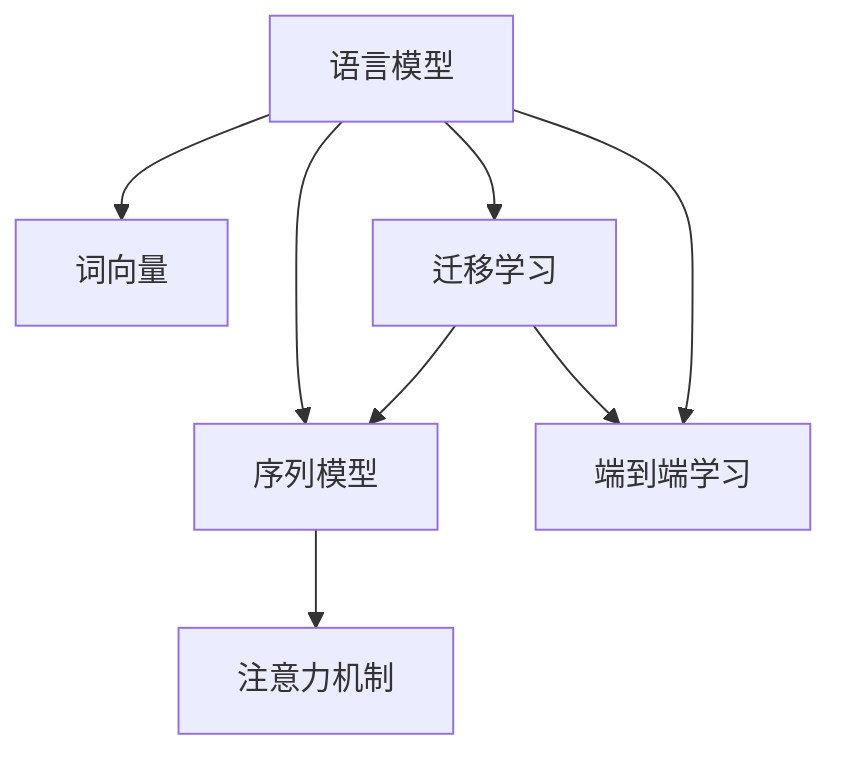

                 

# 自然语言处理 (Natural Language Processing)

> 关键词：自然语言处理(NLP), 语言模型, 机器翻译, 命名实体识别, 情感分析, 信息抽取, 生成式对话, 深度学习, 神经网络, 无监督学习, 监督学习

## 1. 背景介绍

### 1.1 问题由来
自然语言处理 (Natural Language Processing, NLP) 是计算机科学、人工智能和语言学交叉领域的一个研究分支，旨在使计算机理解和处理自然语言。在现代社会中，自然语言是人类交流的主要方式，因此，NLP 技术的应用场景极其广泛，包括智能客服、智能搜索、机器翻译、文本分类、情感分析、信息抽取、生成式对话等。

NLP 技术的核心是语言模型，它能够根据已有的语言知识和数据，预测出一段文本在给定上下文中的概率，从而实现各种自然语言处理任务。语言模型不仅能够处理语言中的语法结构，还能够理解词义、语义和上下文关系，因此，它是 NLP 技术的基石。

### 1.2 问题核心关键点
NLP 技术的核心问题是如何有效地将自然语言转化为计算机可以理解和处理的形式。这包括语言理解、语言生成、语言推理等任务。NLP 技术的研究目标是通过深度学习、机器学习和人工智能等方法，使计算机能够理解、处理和生成自然语言，从而实现语言与计算机之间的无障碍交流。

NLP 技术的关键点包括：
- 语言模型：理解文本的语法和语义结构，预测下一个词或一段文本的概率。
- 词向量：将单词或短语转换为向量形式，以便计算机处理。
- 序列模型：理解文本序列的上下文关系，如循环神经网络（RNN）、长短期记忆网络（LSTM）等。
- 注意力机制：处理长文本时，通过注意力机制，选择文本中重要的部分进行关注。
- 迁移学习：通过在其他领域训练的模型，迁移到新的领域任务上，提升性能。
- 端到端学习：直接从文本序列到标签序列进行训练，减少中间步骤的复杂度。
- 零样本学习和少样本学习：模型在未见过特定样本的情况下，通过提示或转移学习，实现快速适应新任务。

NLP 技术的研究和应用已经取得了显著的进展，推动了人工智能技术的快速发展。然而，NLP 仍然面临许多挑战，如多义词消歧、长距离依赖关系处理、语义表示学习、跨领域知识迁移等。

### 1.3 问题研究意义
研究 NLP 技术，对于推动人工智能技术在各行各业的应用，提升自然语言交互的智能化水平，具有重要意义：

1. 降低应用开发成本。NLP 技术可以显著减少从头开发所需的数据、计算和人力等成本投入。
2. 提升模型效果。NLP 技术能够使计算机理解和处理自然语言，从而在各种任务上取得更好的性能。
3. 加速开发进度。利用现有的预训练模型和微调技术，NLP 开发者可以更快地完成任务适配，缩短开发周期。
4. 带来技术创新。NLP 技术的不断发展，催生了深度学习、神经网络、迁移学习等新的研究方向。
5. 赋能产业升级。NLP 技术在教育、金融、医疗、客服等领域的应用，为传统行业数字化转型升级提供了新的技术路径。

## 2. 核心概念与联系

### 2.1 核心概念概述

为更好地理解 NLP 技术的工作原理和优化方向，本节将介绍几个密切相关的核心概念：

- 语言模型 (Language Model)：用于计算一个单词或一段文本在给定上下文中出现的概率，从而预测下一个词或一段文本。
- 词向量 (Word Embedding)：将单词或短语转换为高维向量形式，便于计算机处理。常用的词向量模型包括 Word2Vec、GloVe 等。
- 序列模型 (Sequence Model)：用于处理文本序列的上下文关系，常见的序列模型包括循环神经网络（RNN）、长短期记忆网络（LSTM）、门控循环单元（GRU）等。
- 注意力机制 (Attention Mechanism)：用于处理长文本，选择文本中重要的部分进行关注，常见的注意力机制包括软注意力 (Soft Attention)、硬注意力 (Hard Attention) 等。
- 迁移学习 (Transfer Learning)：将在其他领域训练的模型迁移到新的领域任务上，提升性能。NLP 中的迁移学习主要通过预训练语言模型实现。
- 端到端学习 (End-to-End Learning)：直接从文本序列到标签序列进行训练，减少中间步骤的复杂度。
- 零样本学习和少样本学习：模型在未见过特定样本的情况下，通过提示或转移学习，实现快速适应新任务。

这些核心概念之间的逻辑关系可以通过以下 Mermaid 流程图来展示：



这个流程图展示了一些核心概念及其之间的关系：

1. 语言模型通过词向量将单词或短语转换为向量形式，用于后续处理。
2. 序列模型通过注意力机制，处理文本序列的上下文关系。
3. 迁移学习通过预训练语言模型，实现不同领域之间的知识迁移。
4. 端到端学习直接从文本序列到标签序列进行训练，减少中间步骤的复杂度。
5. 零样本学习和少样本学习，通过提示或转移学习，实现快速适应新任务。

这些概念共同构成了 NLP 技术的研究框架，使得计算机能够理解和处理自然语言，实现各种自然语言处理任务。

## 3. 核心算法原理 & 具体操作步骤

### 3.1 算法原理概述

NLP 技术的核心算法是深度学习模型，主要使用神经网络进行序列建模和语言推理。其中，语言模型是最为核心的算法，它能够根据已有的语言知识和数据，预测出一段文本在给定上下文中的概率，从而实现各种自然语言处理任务。

语言模型的基本原理是最大似然估计，即通过已知文本序列计算出其出现的概率，并使用概率模型来预测下一个词或一段文本的概率。具体来说，语言模型可以表示为：

$$
P(X) = \prod_{i=1}^{n} P(x_i | x_{<i})
$$

其中 $X$ 是文本序列，$x_i$ 是序列中的第 $i$ 个单词或短语，$P(x_i | x_{<i})$ 表示在 $x_{<i}$ 的条件下，$x_i$ 出现的概率。

语言模型的训练过程可以使用最大似然估计或变分推断等方法，将文本序列的概率最大化。常用的深度学习模型包括循环神经网络（RNN）、长短期记忆网络（LSTM）、门控循环单元（GRU）等。

### 3.2 算法步骤详解

NLP 技术的深度学习模型通常包括以下几个关键步骤：

**Step 1: 准备数据集**
- 收集标注好的数据集，包括训练集、验证集和测试集。
- 数据集应包含单词或短语及其对应的标签，如分类、序列标注、生成等。

**Step 2: 构建模型架构**
- 选择合适的深度学习模型架构，如 RNN、LSTM、GRU 等。
- 定义模型输入和输出，如输入为单词或短语，输出为分类、序列标注、生成等。

**Step 3: 训练模型**
- 使用训练集对模型进行训练，调整模型参数以最小化损失函数。
- 在每个训练迭代中，将输入数据送入模型，计算损失函数，反向传播更新模型参数。
- 在验证集上评估模型性能，调整超参数以避免过拟合。

**Step 4: 测试和评估**
- 使用测试集对模型进行测试，评估模型的性能指标。
- 计算模型的准确率、召回率、F1 分数等指标，评估模型的效果。
- 如果模型性能不佳，可以尝试调整模型架构、超参数、数据集等。

### 3.3 算法优缺点

深度学习模型在 NLP 技术中具有以下优点：
1. 能够处理复杂的文本结构，理解上下文关系。
2. 通过端到端学习，减少中间步骤的复杂度，提高效率。
3. 能够处理长文本，并保留长距离依赖关系。
4. 可以通过迁移学习，提升模型在新领域的性能。

然而，深度学习模型也存在一些局限性：
1. 需要大量标注数据，标注成本较高。
2. 模型复杂度高，计算资源消耗大。
3. 模型的泛化能力较弱，对新样本的适应能力较差。
4. 模型的可解释性较差，难以理解模型的决策过程。

尽管存在这些局限性，但深度学习模型在 NLP 技术中的应用仍然非常广泛，并且不断发展，未来有望在更多的领域中发挥重要作用。

### 3.4 算法应用领域

NLP 技术的深度学习模型在多个领域得到了广泛的应用，以下是几个典型的应用场景：

- 文本分类：如情感分析、主题分类、垃圾邮件过滤等。通过分类模型将文本分为不同的类别。
- 序列标注：如命名实体识别、词性标注、依存句法分析等。通过标注模型识别文本中的实体、词性、句法结构等。
- 机器翻译：如自动翻译、语音识别等。通过序列到序列模型将源语言翻译成目标语言。
- 信息抽取：如事件抽取、关系抽取等。通过实体识别和关系抽取模型从文本中抽取关键信息。
- 生成式对话：如智能客服、聊天机器人等。通过生成模型进行自然语言交互。
- 问答系统：如智能问答、智能搜索等。通过问答模型对用户提问进行回答。

除了上述这些经典任务外，NLP 技术还在更多场景中得到了创新性的应用，如文本摘要、文本生成、语音合成等，为 NLP 技术带来了新的突破。

## 4. 数学模型和公式 & 详细讲解 & 举例说明

### 4.1 数学模型构建

NLP 技术的深度学习模型通常使用神经网络进行序列建模和语言推理，其中最为核心的是语言模型。语言模型的数学模型可以表示为：

$$
P(x_1,x_2,...,x_n) = \prod_{i=1}^{n} P(x_i | x_{<i})
$$

其中 $x_1,x_2,...,x_n$ 是文本序列中的单词或短语，$P(x_i | x_{<i})$ 表示在 $x_{<i}$ 的条件下，$x_i$ 出现的概率。

在深度学习中，语言模型通常使用神经网络进行建模，其中最基本的模型是 RNN。RNN 模型的基本结构包括输入层、隐藏层和输出层。输入层接收输入序列，隐藏层通过循环连接存储上下文信息，输出层计算概率。

### 4.2 公式推导过程

以下是使用 RNN 模型进行语言模型训练的基本公式推导过程：

1. 定义隐藏状态 $h_t$，表示在第 $t$ 个时间步的上下文信息。
2. 定义输出层 $y_t$，表示在第 $t$ 个时间步的输出概率。
3. 定义模型参数 $\theta$，包括输入到隐藏层的权重矩阵 $W$、隐藏到隐藏层的权重矩阵 $U$、隐藏到输出的权重矩阵 $V$ 和偏置向量 $b$。
4. 定义损失函数 $J(\theta)$，表示模型在训练集上的误差。
5. 定义优化算法，如梯度下降算法，最小化损失函数。

具体来说，RNN 模型的输出概率可以表示为：

$$
y_t = softmax(W h_t + U h_{t-1} + b)
$$

其中 $softmax$ 函数将输出转换为概率分布。

模型的损失函数可以表示为：

$$
J(\theta) = -\frac{1}{N} \sum_{i=1}^{N} \sum_{t=1}^{T} \log P(x_i | x_{<i})
$$

其中 $N$ 是训练集的大小，$T$ 是文本序列的长度。

模型的优化算法可以表示为：

$$
\theta \leftarrow \theta - \eta \nabla_{\theta}J(\theta)
$$

其中 $\eta$ 是学习率，$\nabla_{\theta}J(\theta)$ 是损失函数对模型参数的梯度，可通过反向传播算法计算。

### 4.3 案例分析与讲解

以下是使用 RNN 模型进行文本分类任务的案例分析与讲解：

1. 准备数据集
   - 收集标注好的文本数据集，如新闻、评论、邮件等。
   - 将文本数据转换为单词序列，并划分为训练集、验证集和测试集。

2. 构建模型架构
   - 定义输入层，接收单词序列，使用嵌入层将单词转换为向量形式。
   - 定义隐藏层，使用 RNN 模型进行序列建模。
   - 定义输出层，使用全连接层将隐藏层的输出转换为分类概率。
   - 定义损失函数，如交叉熵损失函数。

3. 训练模型
   - 使用训练集对模型进行训练，调整模型参数以最小化损失函数。
   - 在每个训练迭代中，将输入数据送入模型，计算损失函数，反向传播更新模型参数。
   - 在验证集上评估模型性能，调整超参数以避免过拟合。

4. 测试和评估
   - 使用测试集对模型进行测试，评估模型的性能指标。
   - 计算模型的准确率、召回率、F1 分数等指标，评估模型的效果。
   - 如果模型性能不佳，可以尝试调整模型架构、超参数、数据集等。

## 5. 项目实践：代码实例和详细解释说明

### 5.1 开发环境搭建

在进行 NLP 技术开发前，我们需要准备好开发环境。以下是使用 Python 和 PyTorch 进行 NLP 技术开发的开发环境配置流程：

1. 安装 Anaconda：从官网下载并安装 Anaconda，用于创建独立的 Python 环境。
2. 创建并激活虚拟环境：
```bash
conda create -n nlp-env python=3.8 
conda activate nlp-env
```
3. 安装 PyTorch：根据 CUDA 版本，从官网获取对应的安装命令。例如：
```bash
conda install pytorch torchvision torchaudio cudatoolkit=11.1 -c pytorch -c conda-forge
```
4. 安装 Transformers 库：
```bash
pip install transformers
```
5. 安装各类工具包：
```bash
pip install numpy pandas scikit-learn matplotlib tqdm jupyter notebook ipython
```

完成上述步骤后，即可在 `nlp-env` 环境中开始 NLP 技术开发。

### 5.2 源代码详细实现

这里我们以文本分类任务为例，给出使用 PyTorch 进行 RNN 模型训练的代码实现。

首先，定义文本分类任务的输入和输出：

```python
import torch
import torch.nn as nn
import torch.optim as optim
from torchtext import datasets, data

# 定义输入字段和输出字段
TEXT = data.Field(tokenize='spacy', lower=True, pad_first=True)
LABEL = data.LabelField(dtype=torch.int64)

# 加载数据集
train_data, test_data = datasets.IMDB.splits(TEXT, LABEL)

# 构建词汇表
TEXT.build_vocab(train_data, max_size=10000, vectors="glove.6B.100d")
LABEL.build_vocab(train_data)

# 将数据集分成批次
BATCH_SIZE = 64
TEXT.vocab.set_default_index()
train_iterator, test_iterator = data.BucketIterator.splits(
    (train_data, test_data), batch_size=BATCH_SIZE, device='cuda')
```

然后，定义 RNN 模型的结构和训练过程：

```python
class RNN(nn.Module):
    def __init__(self, input_size, hidden_size, output_size):
        super(RNN, self).__init__()
        self.hidden_size = hidden_size
        self.rnn = nn.RNN(input_size, hidden_size, batch_first=True)
        self.fc = nn.Linear(hidden_size, output_size)

    def forward(self, input, hidden):
        output, hidden = self.rnn(input, hidden)
        output = self.fc(output)
        return output, hidden

# 定义模型参数
INPUT_SIZE = len(TEXT.vocab)
HIDDEN_SIZE = 256
OUTPUT_SIZE = len(LABEL.vocab)
LR = 0.001
EMBEDDING_DIM = 100
model = RNN(INPUT_SIZE, HIDDEN_SIZE, OUTPUT_SIZE)

# 定义优化器和损失函数
optimizer = optim.Adam(model.parameters(), lr=LR)
criterion = nn.CrossEntropyLoss()

# 训练模型
def train(model, iterator, optimizer, criterion):
    model.train()
    for batch in iterator:
        optimizer.zero_grad()
        text, labels = batch.text, batch.label
        predictions = model(text, hidden)[0]
        loss = criterion(predictions, labels)
        loss.backward()
        optimizer.step()

    # 计算准确率
    model.eval()
    total, correct = 0, 0
    with torch.no_grad():
        for batch in iterator:
            text, labels = batch.text, batch.label
            predictions = model(text, None)[0]
            _, predicted = torch.max(predictions.data, 1)
            total += labels.size(0)
            correct += (predicted == labels).sum().item()
    
    return correct / total

# 在训练集上进行训练
EPOCHS = 5
for epoch in range(EPOCHS):
    train_loss = 0
    for batch in train_iterator:
        optimizer.zero_grad()
        text, labels = batch.text, batch.label
        predictions = model(text, hidden)[0]
        loss = criterion(predictions, labels)
        loss.backward()
        optimizer.step()
        train_loss += loss.item()
    print(f'Epoch: {epoch+1}, Loss: {train_loss / len(train_iterator)}')

# 在测试集上进行测试
test_loss = 0
total, correct = 0, 0
with torch.no_grad():
    for batch in test_iterator:
        text, labels = batch.text, batch.label
        predictions = model(text, None)[0]
        _, predicted = torch.max(predictions.data, 1)
        total += labels.size(0)
        correct += (predicted == labels).sum().item()
test_loss += criterion(predictions, labels).item()
print(f'Test Loss: {test_loss / len(test_iterator)}, Accuracy: {correct / total}')
```

以上就是使用 PyTorch 进行 RNN 模型训练的完整代码实现。可以看到，得益于 PyTorch 的强大封装，我们能够用相对简洁的代码完成模型训练和测试。

### 5.3 代码解读与分析

让我们再详细解读一下关键代码的实现细节：

**输入和输出字段定义**：
- 使用 `torchtext` 库定义输入和输出字段，包括单词序列和标签。
- 使用 `spacy` 分词器进行分词处理，并将所有单词转换为小写，增加标签类型。

**数据集加载**：
- 使用 `torchtext.datasets` 加载 IMDB 数据集，包括训练集和测试集。
- 使用 `torchtext.data.Field` 构建词汇表，将单词转换为整数编码。
- 使用 `torchtext.data.BucketIterator` 将数据集分批次，并发送到 GPU 上。

**模型定义**：
- 定义 RNN 模型，包括输入层、隐藏层和输出层。
- 使用 PyTorch 的 `nn.RNN` 模块实现 RNN 模型。
- 使用 `nn.Linear` 实现全连接层，输出分类概率。

**训练过程**：
- 定义优化器和损失函数，使用 Adam 优化器进行参数更新，交叉熵损失函数用于计算模型预测结果与真实标签之间的差异。
- 使用 `train` 函数进行模型训练，每次迭代更新模型参数并计算训练损失。
- 在测试集上进行模型测试，计算测试损失和准确率。

**结果输出**：
- 在每个训练迭代中，打印出当前的训练损失。
- 在测试集上进行模型测试，计算测试损失和准确率。

可以看到，PyTorch 配合 `torchtext` 库使得 NLP 技术的开发变得简洁高效。开发者可以将更多精力放在数据处理、模型改进等高层逻辑上，而不必过多关注底层的实现细节。

当然，工业级的系统实现还需考虑更多因素，如模型的保存和部署、超参数的自动搜索、更灵活的任务适配层等。但核心的训练范式基本与此类似。

## 6. 实际应用场景

### 6.1 智能客服系统

智能客服系统是 NLP 技术的重要应用场景之一。传统客服往往需要配备大量人力，高峰期响应缓慢，且一致性和专业性难以保证。而使用 NLP 技术构建的智能客服系统，可以 24/7 不间断服务，快速响应客户咨询，用自然流畅的语言解答各类常见问题。

在技术实现上，可以收集企业内部的历史客服对话记录，将问题和最佳答复构建成监督数据，在此基础上对预训练语言模型进行微调。微调后的语言模型能够自动理解用户意图，匹配最合适的答案模板进行回复。对于客户提出的新问题，还可以接入检索系统实时搜索相关内容，动态组织生成回答。如此构建的智能客服系统，能大幅提升客户咨询体验和问题解决效率。

### 6.2 金融舆情监测

金融机构需要实时监测市场舆论动向，以便及时应对负面信息传播，规避金融风险。传统的人工监测方式成本高、效率低，难以应对网络时代海量信息爆发的挑战。NLP 技术的文本分类和情感分析技术，为金融舆情监测提供了新的解决方案。

具体而言，可以收集金融领域相关的新闻、报道、评论等文本数据，并对其进行主题标注和情感标注。在此基础上对预训练语言模型进行微调，使其能够自动判断文本属于何种主题，情感倾向是正面、中性还是负面。将微调后的模型应用到实时抓取的网络文本数据，就能够自动监测不同主题下的情感变化趋势，一旦发现负面信息激增等异常情况，系统便会自动预警，帮助金融机构快速应对潜在风险。

### 6.3 个性化推荐系统

当前的推荐系统往往只依赖用户的历史行为数据进行物品推荐，无法深入理解用户的真实兴趣偏好。NLP 技术的个性化推荐系统可以更好地挖掘用户行为背后的语义信息，从而提供更精准、多样的推荐内容。

在实践中，可以收集用户浏览、点击、评论、分享等行为数据，提取和用户交互的物品标题、描述、标签等文本内容。将文本内容作为模型输入，用户的后续行为（如是否点击、购买等）作为监督信号，在此基础上微调预训练语言模型。微调后的模型能够从文本内容中准确把握用户的兴趣点。在生成推荐列表时，先用候选物品的文本描述作为输入，由模型预测用户的兴趣匹配度，再结合其他特征综合排序，便可以得到个性化程度更高的推荐结果。

### 6.4 未来应用展望

随着 NLP 技术的不断发展，未来其在更多领域的应用前景将更加广阔。以下是几个可能的未来应用场景：

- 智慧医疗领域：基于 NLP 技术的医疗问答、病历分析、药物研发等应用将提升医疗服务的智能化水平，辅助医生诊疗，加速新药开发进程。
- 智能教育领域：NLP 技术的问答系统、学情分析、知识推荐等应用将因材施教，促进教育公平，提高教学质量。
- 智慧城市治理：NLP 技术的智能事件监测、舆情分析、应急指挥等应用将提高城市管理的自动化和智能化水平，构建更安全、高效的未来城市。
- 企业生产、社会治理、文娱传媒等众多领域，NLP 技术的应用将不断涌现，为经济社会发展注入新的动力。

## 7. 工具和资源推荐

### 7.1 学习资源推荐

为了帮助开发者系统掌握 NLP 技术的基础理论和实践技巧，这里推荐一些优质的学习资源：

1. 《Deep Learning for Natural Language Processing》系列博文：由大模型技术专家撰写，深入浅出地介绍了 NLP 技术的基础理论、模型架构和应用案例。

2. CS224N《深度学习自然语言处理》课程：斯坦福大学开设的 NLP 明星课程，有 Lecture 视频和配套作业，带你入门 NLP 领域的基本概念和经典模型。

3. 《Natural Language Processing with Python》书籍：使用 Python 实现 NLP 技术的经典教材，涵盖 NLP 技术的各个方面，包括文本处理、文本分类、情感分析等。

4. TensorFlow 官方文档：TensorFlow 的官方文档，提供了丰富的 NLP 库和示例代码，是上手实践的必备资料。

5. PyTorch 官方文档：PyTorch 的官方文档，提供了 NLP 库和示例代码，是上手实践的必备资料。

6. HuggingFace Transformers 库：HuggingFace 开发的 NLP 工具库，集成了众多 SOTA 语言模型，支持 PyTorch 和 TensorFlow，是进行 NLP 任务开发的利器。

通过对这些资源的学习实践，相信你一定能够快速掌握 NLP 技术的精髓，并用于解决实际的 NLP 问题。

### 7.2 开发工具推荐

高效的开发离不开优秀的工具支持。以下是几款用于 NLP 技术开发的常用工具：

1. PyTorch：基于 Python 的开源深度学习框架，灵活动态的计算图，适合快速迭代研究。大部分 NLP 任务都有 PyTorch 版本的实现。

2. TensorFlow：由 Google 主导开发的开源深度学习框架，生产部署方便，适合大规模工程应用。同样有丰富的 NLP 模型资源。

3. Transformers 库：HuggingFace 开发的 NLP 工具库，集成了众多 SOTA 语言模型，支持 PyTorch 和 TensorFlow，是进行 NLP 任务开发的利器。

4. Weights & Biases：模型训练的实验跟踪工具，可以记录和可视化模型训练过程中的各项指标，方便对比和调优。与主流深度学习框架无缝集成。

5. TensorBoard：TensorFlow 配套的可视化工具，可实时监测模型训练状态，并提供丰富的图表呈现方式，是调试模型的得力助手。

6. Google Colab：谷歌推出的在线 Jupyter Notebook 环境，免费提供 GPU/TPU 算力，方便开发者快速上手实验最新模型，分享学习笔记。

合理利用这些工具，可以显著提升 NLP 技术开发和实验的效率，加快创新迭代的步伐。

### 7.3 相关论文推荐

NLP 技术的研究源于学界的持续研究。以下是几篇奠基性的相关论文，推荐阅读：

1. Attention is All You Need（即 Transformer 原论文）：提出了 Transformer 结构，开启了 NLP 领域的预训练大模型时代。

2. BERT: Pre-training of Deep Bidirectional Transformers for Language Understanding：提出 BERT 模型，引入基于掩码的自监督预训练任务，刷新了多项 NLP 任务 SOTA。

3. Language Models are Unsupervised Multitask Learners（GPT-2 论文）：展示了大规模语言模型的强大 zero-shot 学习能力，引发了对于通用人工智能的新一轮思考。

4. SQuAD: 10k: 100k 问题答案数据集：SQuAD 数据集是 NLP 领域最为重要的数据集之一，用于训练问答系统。

5. ELMO: Distributed Representations of Words and Phrases and their Compositionality：提出了 ELMO 词向量，能够捕捉单词的多义词和上下文语义，成为 NLP 领域的经典词向量模型。

6. GPT-3: Language Models are Few-Shot Learners：提出 GPT-3 模型，具有强大的少样本学习能力，能够在仅有几个示例的情况下，准确地进行新任务的推理和生成。

这些论文代表了大规模 NLP 技术的研究进展。通过学习这些前沿成果，可以帮助研究者把握学科前进方向，激发更多的创新灵感。

## 8. 总结：未来发展趋势与挑战

### 8.1 总结

本文对 NLP 技术的深度学习模型进行了全面系统的介绍。首先阐述了 NLP 技术的研究背景和意义，明确了深度学习模型在 NLP 技术中的核心作用。其次，从原理到实践，详细讲解了深度学习模型的构建和训练过程，给出了 NLP 任务开发的完整代码实例。同时，本文还广泛探讨了 NLP 技术在智能客服、金融舆情、个性化推荐等多个行业领域的应用前景，展示了 NLP 技术的发展潜力。

通过本文的系统梳理，可以看到，NLP 技术的深度学习模型已经在多个领域取得了显著的进展，推动了人工智能技术在各行各业的应用。未来，伴随深度学习模型的不断演进，NLP 技术有望在更多的领域中发挥重要作用，为经济社会发展注入新的动力。

### 8.2 未来发展趋势

展望未来，NLP 技术将呈现以下几个发展趋势：

1. 模型规模持续增大。随着算力成本的下降和数据规模的扩张，深度学习模型的参数量还将持续增长。超大规模模型蕴含的丰富语言知识，有望支撑更加复杂多变的 NLP 任务。

2. 迁移学习成为常态。未来的深度学习模型将更多地利用迁移学习，通过预训练模型在多个领域迁移，提升模型的泛化能力和性能。

3. 持续学习成为热点。随着数据分布的不断变化，NLP 模型需要持续学习新知识以保持性能。如何在不遗忘原有知识的同时，高效吸收新样本信息，将是重要的研究方向。

4. 零样本和少样本学习兴起。未来的 NLP 模型将更多地关注零样本和少样本学习，通过更巧妙的提示模板，实现快速适应新任务。

5. 多模态融合成为趋势。未来的 NLP 模型将更多地融合多模态信息，如视觉、语音等，提升对现实世界的理解和建模能力。

6. 可解释性成为关注点。未来的 NLP 模型将更多地关注模型的可解释性，增强模型的透明度和可审计性。

7. 安全性成为重要课题。未来的 NLP 模型将更多地关注模型的安全性，避免恶意用途和偏见输出。

这些趋势凸显了 NLP 技术的广阔前景。这些方向的探索发展，必将进一步提升 NLP 系统的性能和应用范围，为经济社会发展注入新的动力。

### 8.3 面临的挑战

尽管 NLP 技术已经取得了显著进展，但在迈向更加智能化、普适化应用的过程中，它仍面临诸多挑战：

1. 数据标注成本高。NLP 任务通常需要大量标注数据，标注成本较高。如何降低数据标注成本，提高标注效率，将是一大难题。

2. 模型复杂度高。深度学习模型往往参数量大，计算资源消耗大，难以在资源受限的环境中部署。如何降低模型复杂度，提高模型效率，将是一大挑战。

3. 模型泛化能力差。NLP 模型对新样本的泛化能力较弱，难以适应数据分布的变化。如何提升模型的泛化能力，将是重要的研究方向。

4. 模型可解释性差。NLP 模型通常被视为“黑盒”系统，难以解释其内部工作机制和决策逻辑。如何增强模型的可解释性，将是亟待解决的问题。

5. 安全性问题突出。NLP 模型可能学习到有害的偏见和信息，通过迁移学习传递到下游任务，造成负面影响。如何确保模型的安全性，将是重要的研究方向。

6. 知识迁移困难。现有的 NLP 模型往往局限于任务内数据，难以灵活吸收和运用更广泛的先验知识。如何让模型更好地与外部知识库、规则库等专家知识结合，形成更加全面、准确的信息整合能力，还有很大的想象空间。

正视 NLP 技术面临的这些挑战，积极应对并寻求突破，将是大规模 NLP 模型迈向成熟的必由之路。相信随着学界和产业界的共同努力，这些挑战终将一一被克服，NLP 技术必将在构建人机协同的智能时代中扮演越来越重要的角色。

### 8.4 研究展望

面对 NLP 技术面临的挑战，未来的研究需要在以下几个方面寻求新的突破：

1. 探索无监督和半监督学习范式。摆脱对大规模标注数据的依赖，利用自监督学习、主动学习等无监督和半监督范式，最大限度利用非结构化数据，实现更加灵活高效的 NLP 任务微调。

2. 研究参数高效和计算高效的模型。开发更加参数高效的模型，如自注意力模型、轻量级模型等，在保证性能的同时，减少计算资源消耗。

3. 引入因果推理和对比学习范式。通过引入因果推断和对比学习思想，增强模型的泛化能力和鲁棒性，学习更加普适、鲁棒的语言表征。

4. 结合符号化和深度学习。将符号化的先验知识，如知识图谱、逻辑规则等，与神经网络模型进行巧妙融合，引导 NLP 模型学习更准确、合理的语言模型。

5. 纳入伦理道德约束。在模型训练目标中引入伦理导向的评估指标，过滤和惩罚有偏见、有害的输出倾向。同时加强人工干预和审核，建立模型行为的监管机制，确保输出符合人类价值观和伦理道德。

这些研究方向的探索，必将引领 NLP 技术迈向更高的台阶，为构建安全、可靠、可解释、可控的智能系统铺平道路。面向未来，NLP 技术还需要与其他人工智能技术进行更深入的融合，如知识表示、因果推理、强化学习等，多路径协同发力，共同推动自然语言理解和智能交互系统的进步。只有勇于创新、敢于突破，才能不断拓展 NLP 技术的边界，让智能技术更好地造福人类社会。

## 9. 附录：常见问题与解答

**Q1: NLP 技术的深度学习模型有哪些优点？**

A: NLP 技术的深度学习模型具有以下优点：
1. 能够处理复杂的文本结构，理解上下文关系。
2. 通过端到端学习，减少中间步骤的复杂度，提高效率。
3. 能够处理长文本，并保留长距离依赖关系。
4. 可以通过迁移学习，提升模型在新领域的性能。

**Q2: 如何使用 PyTorch 进行 RNN 模型训练？**

A: 使用 PyTorch 进行 RNN 模型训练的基本步骤如下：
1. 定义输入和输出字段，如单词序列和标签。
2. 加载训练集和测试集，并构建词汇表。
3. 定义 RNN 模型架构，包括输入层、隐藏层和输出层。
4. 定义优化器和损失函数，如 Adam 优化器和交叉熵损失函数。
5. 训练模型，在每个迭代中计算损失函数并更新模型参数。
6. 在测试集上进行模型测试，计算测试损失和准确率。

**Q3: NLP 技术在未来有哪些应用前景？**

A: 未来 NLP 技术的应用前景广泛，包括以下几个方面：
1. 智慧医疗领域：基于 NLP 技术的医疗问答、病历分析、药物研发等应用将提升医疗服务的智能化水平，辅助医生诊疗，加速新药开发进程。
2. 智能教育领域：NLP 技术的问答系统、学情分析、知识推荐等应用将因材施教，促进教育公平，提高教学质量。
3. 智慧城市治理：NLP 技术的智能事件监测、舆情分析、应急指挥等应用将提高城市管理的自动化和智能化水平，构建更安全、高效的未来城市。
4. 企业生产、社会治理、文娱传媒等众多领域，NLP 技术的应用将不断涌现，为经济社会发展注入新的动力。

**Q4: NLP 技术的深度学习模型存在哪些局限性？**

A: NLP 技术的深度学习模型存在以下局限性：
1. 需要大量标注数据，标注成本较高。
2. 模型复杂度高，计算资源消耗大。
3. 模型的泛化能力较弱，对新样本的适应能力较差。
4. 模型的可解释性较差，难以理解模型的决策过程。

**Q5: NLP 技术的深度学习模型如何进行迁移学习？**

A: NLP 技术的深度学习模型可以通过预训练语言模型进行迁移学习，具体步骤如下：
1. 在大规模语料上预训练语言模型，学习通用的语言表示。
2. 在目标任务上微调预训练语言模型，调整模型参数以适应新任务。
3. 通过迁移学习，预训练模型能够保留通用的语言知识和表示，提升在新任务上的性能。

**Q6: NLP 技术的深度学习模型如何实现零样本学习？**

A: NLP 技术的深度学习模型可以通过提示学习 (Prompt Learning) 实现零样本学习，具体步骤如下：
1. 使用预训练模型，输入任务描述或提示模板。
2. 模型根据提示模板生成答案或执行推理。
3. 通过调整提示模板，指导模型生成符合任务需求的输出，无需更新模型参数。

---

作者：禅与计算机程序设计艺术 / Zen and the Art of Computer Programming

