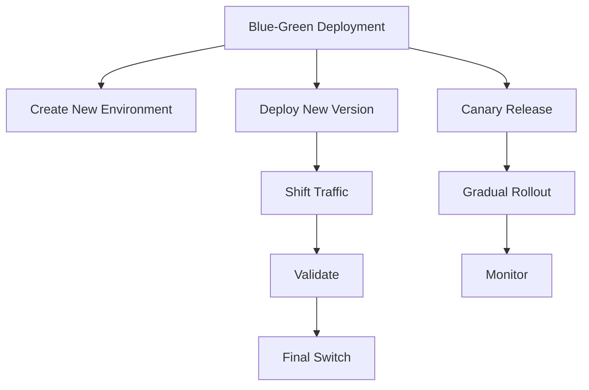

                 

# 蓝绿部署与金丝雀发布原理与代码实战案例讲解

> 关键词：蓝绿部署,金丝雀发布,微服务,容错设计,持续集成(CI),持续交付(CD),DevOps

## 1. 背景介绍

### 1.1 问题由来
在软件开发和系统运维的过程中，新功能的发布、代码的更新、配置的更改等操作都是不可避免的。然而，这些变更操作往往会导致系统的不稳定和业务的中断，给用户带来不良体验。例如，一个关键的代码更改可能导致了线上崩溃，一个新功能的上线可能引起服务宕机，一个配置的调整可能带来数据丢失。

为了解决这个问题，工程师们开发出了一系列的方法和工具，其中最常用的是“蓝绿部署”和“金丝雀发布”。这两种方法可以有效降低发布风险，保障系统稳定，是现代DevOps工程文化的重要组成部分。

## 2. 核心概念与联系

### 2.1 核心概念概述

为了更好地理解蓝绿部署与金丝雀发布，需要了解几个核心概念：

- **蓝绿部署（Blue-Green Deployment）**：一种无中断发布的方法，通过创建两个相同的生产环境（一个旧版环境和一个新版环境），将新版本的代码或配置部署到新版环境中进行测试。如果测试成功，切换流量到新版环境，关闭旧版环境。这样可以确保新功能上线时，旧版环境仍然能够正常服务。

- **金丝雀发布（Canary Release）**：一种分阶段发布的方法，通过创建一个“金丝雀”（通常是一台或几台服务器），在新版本上线前先部署到金丝雀上。如果金丝雀运行正常，再将新功能逐步推广到所有服务器上。这样可以逐步验证新功能的安全性和稳定性。

- **微服务（Microservices）**：将应用拆分成一系列小的、独立的服务单元，每个服务独立部署、扩展和更新。微服务架构使得蓝绿部署和金丝雀发布更加容易实现。

- **容错设计（Fault Tolerance Design）**：为了保障系统的稳定性和可用性，采用一系列的容错机制，如自动故障切换、负载均衡、监控告警等。这些机制在蓝绿部署和金丝雀发布中尤为重要。

- **持续集成（CI）**：自动化地构建、测试和部署软件，以快速验证代码变更的有效性，并提前发现问题。持续集成是实现蓝绿部署和金丝雀发布的重要工具。

- **持续交付（CD）**：自动化地将软件从开发环境持续地交付到生产环境，以支持快速、可靠地发布。持续交付是蓝绿部署和金丝雀发布的底层支持。

- **DevOps**：将软件开发和运维工作整合，强调自动化、持续交付和高效协作。DevOps文化是实现蓝绿部署和金丝雀发布的基础。

这些核心概念之间的逻辑关系可以通过以下Mermaid流程图来展示：



这个流程图展示了大规模部署的基本流程：

1. 创建新环境（B），通常是部署新功能的容器实例。
2. 部署新功能到新环境（C）。
3. 分阶段发布（D），在新版本上线前，先在金丝雀服务器上测试。
4. 验证测试结果（G），确认新功能稳定。
5. 切换流量（E），将新功能上线到新环境。
6. 监控新环境（H），确保新功能正常运行。
7. 完成切换（I），关闭旧功能环境。

## 3. 核心算法原理 & 具体操作步骤
### 3.1 算法原理概述

蓝绿部署和金丝雀发布的原理都是基于冗余部署和流量控制的思想。核心步骤如下：

1. 创建新环境：在现有生产环境之外，创建一个新环境，通常是与旧环境相同的容器或虚拟机实例。
2. 部署新版本：将新版本代码或配置部署到新环境中，进行功能测试。
3. 验证测试结果：通过监控、压力测试等方式验证新版本是否稳定。
4. 切换流量：通过负载均衡器或DNS等工具，将部分或全部流量切换到新环境。
5. 关闭旧环境：在新环境正常运行一段时间后，关闭旧环境，完成部署。

### 3.2 算法步骤详解

以一个典型的蓝绿部署流程为例，详细讲解每一步的具体操作。

**Step 1: 创建新环境**

- 准备新环境的部署配置文件，包括IP地址、端口、环境变量等。
- 使用容器编排工具（如Docker Compose、Kubernetes等）创建新环境的容器实例。

**Step 2: 部署新版本**

- 将新功能的代码部署到新环境的容器中。
- 更新新环境的数据库和配置文件。

**Step 3: 验证测试结果**

- 在新环境上启动监控脚本，收集性能指标和错误日志。
- 运行压力测试，模拟高并发访问，确保新功能稳定。

**Step 4: 切换流量**

- 使用负载均衡器（如Nginx、HAProxy等）配置流量规则，将部分或全部流量切换到新环境。
- 如果新环境不稳定，可以手动回切流量到旧环境，确保业务连续性。

**Step 5: 关闭旧环境**

- 如果新环境运行正常，通知运维团队关闭旧环境的容器实例。
- 删除旧环境的配置文件和数据备份。

### 3.3 算法优缺点

蓝绿部署和金丝雀发布的主要优点包括：

- 零停机：部署过程中不中断现有服务，保障业务连续性。
- 低风险：通过分阶段发布，逐步验证新功能的稳定性。
- 快速回滚：在测试过程中发现问题，可以随时回滚到旧环境，减少故障影响。

但这些方法也存在一些缺点：

- 资源消耗：创建新环境、部署新版本等操作需要额外的计算资源。
- 复杂性：部署流程需要协调多个组件，操作复杂。
- 部署窗口：部署时间窗口较长，可能影响业务需求。

### 3.4 算法应用领域

蓝绿部署和金丝雀发布广泛应用于各种大规模部署场景，特别是在金融、电商、社交网络等高可用性要求的领域。这些技术可以有效减少发布风险，保障系统稳定，提升用户体验。

## 4. 数学模型和公式 & 详细讲解 & 举例说明

### 4.1 数学模型构建

以一个简单的统计模型为例，介绍蓝绿部署和金丝雀发布的数学原理。

假设系统有N个用户，其中M个用户使用旧功能，N-M个用户使用新功能。初始时，旧功能在线。

旧功能和新功能的性能指标分别为$f_{old}$和$f_{new}$。我们希望在测试期间，新功能性能高于旧功能，即$f_{new} > f_{old}$。

在测试期间，我们将旧功能和新功能同时部署，流量分配为$k/N$。新功能的性能指标为：

$$
f_{test} = kf_{new} + (N-k)f_{old}
$$

如果$f_{test} > f_{old}$，则新功能通过测试，可以部署。

### 4.2 公式推导过程

将上述公式进一步推导，得到：

$$
f_{test} = f_{old} + k(f_{new} - f_{old})
$$

令$f_{new} - f_{old} = \delta$，则有：

$$
f_{test} = f_{old} + k\delta
$$

根据测试结果，我们可以得到：

$$
k = \frac{f_{test} - f_{old}}{\delta}
$$

这就是确定流量分配比例的公式。

### 4.3 案例分析与讲解

假设系统有100个用户，初始时旧功能在线，性能指标为50。新功能性能指标为100。我们希望新功能上线后，性能至少比旧功能高20%。

根据上述公式，我们有：

$$
f_{test} = 50 + k(100-50) = 50 + 50k
$$

为了确保新功能上线后性能提高20%，我们有：

$$
f_{test} = 60 \Rightarrow 50 + 50k = 60 \Rightarrow k = \frac{60 - 50}{50} = 0.2
$$

因此，我们将80%的流量切换到新功能，20%的流量保持在新功能，以验证新功能的性能。如果新功能性能稳定，我们可以逐步增加流量，直至全量切换。

## 5. 项目实践：代码实例和详细解释说明
### 5.1 开发环境搭建

蓝绿部署和金丝雀发布需要依赖容器编排工具和负载均衡工具。以Docker和Nginx为例，搭建一个简单的部署环境：

1. 安装Docker和Docker Compose。
2. 创建新环境配置文件，定义IP地址、端口等。
3. 启动新环境容器。

```bash
docker-compose up -d
```

### 5.2 源代码详细实现

假设我们有一个新的功能模块，实现如下：

```python
from flask import Flask

app = Flask(__name__)

@app.route('/')
def hello():
    return 'Hello, world!'

if __name__ == '__main__':
    app.run(debug=True)
```

部署新功能到新环境中：

1. 将代码打包成Docker镜像。
2. 在新环境配置文件中配置启动命令。

```dockerfile
FROM python:3.7-slim
WORKDIR /app
COPY requirements.txt ./
RUN pip install -r requirements.txt
COPY . .
CMD ["python", "app.py"]
```

### 5.3 代码解读与分析

在实际开发中，代码部署需要考虑很多细节，如日志输出、错误处理、环境变量等。以下是一些关键代码的解读：

- **Dockerfile**：定义了Docker镜像的构建步骤，包含安装Python、复制代码、安装依赖等操作。
- **requirements.txt**：定义了项目依赖的Python包及其版本，确保在生产环境中有依赖。
- **app.py**：定义了Web应用的路由和业务逻辑，以Flask为例，运行app.run()启动应用。

### 5.4 运行结果展示

启动新环境容器，通过浏览器访问新功能，验证是否正常工作。

```bash
docker-compose run --rm hello-world
```

## 6. 实际应用场景

### 6.1 大型电商网站的发布

电商网站的上线和下线是一个典型的蓝绿部署场景。由于电商网站的交易流量巨大，任何意外的故障都可能导致严重的经济损失。通过蓝绿部署，可以在新功能上线前，先在部分服务器上进行测试，逐步推广到全部服务器。这样可以确保新功能上线时，不影响现有业务。

### 6.2 金融系统的迭代

金融系统的迭代发布也是一个典型的金丝雀发布场景。金融系统的交易数据和客户信息至关重要，任何问题都可能导致巨大的损失。通过金丝雀发布，可以在新功能上线前，先在少量服务器上进行测试，逐步推广到全部服务器。这样可以逐步验证新功能的稳定性，减少风险。

### 6.3 社交网络的更新

社交网络的更新发布也需要考虑业务连续性和用户体验。通过蓝绿部署和金丝雀发布，可以在新功能上线前，先在部分服务器上进行测试，逐步推广到全部服务器。这样可以确保新功能上线时，不影响现有业务。

## 7. 工具和资源推荐
### 7.1 学习资源推荐

为了帮助开发者系统掌握蓝绿部署和金丝雀发布的理论基础和实践技巧，这里推荐一些优质的学习资源：

1. 《微服务架构》系列博文：介绍微服务架构的基本概念和设计原则，包括容错设计、负载均衡、服务发现等。
2. 《DevOps实践指南》书籍：介绍DevOps文化的基本概念和实践方法，包括持续集成、持续交付、自动化测试等。
3. 《蓝绿部署与金丝雀发布最佳实践》文章：详细讲解蓝绿部署和金丝雀发布的原理和实现方法，提供实际案例和代码示例。

通过对这些资源的学习实践，相信你一定能够快速掌握蓝绿部署和金丝雀发布的精髓，并用于解决实际的发布问题。

### 7.2 开发工具推荐

高效的开发离不开优秀的工具支持。以下是几款用于蓝绿部署和金丝雀发布的常用工具：

1. Docker：轻量级的容器引擎，方便打包和部署应用。
2. Kubernetes：容器编排工具，支持自动扩展和滚动更新。
3. Jenkins：开源的CI/CD工具，支持自动化构建、测试和部署。
4. GitLab CI/CD：基于GitLab的CI/CD工具，支持代码托管和持续集成。
5. Nginx：高性能的负载均衡器和反向代理，支持分阶段发布。

合理利用这些工具，可以显著提升发布效率和成功率，缩短发布周期，降低发布风险。

### 7.3 相关论文推荐

蓝绿部署和金丝雀发布的发展源于学界的持续研究。以下是几篇奠基性的相关论文，推荐阅读：

1. Blue-Green Deployment and the Platform as a Service: Two Years of Learnings: Research and Beyond: 介绍蓝绿部署和平台即服务的发展历程和实际应用。
2. Canary Releases: A practical guide: 详细介绍金丝雀发布的原理和实践方法，提供代码示例和部署指南。
3. Microservices and Containers: A Practical Guide to Implementation: 介绍微服务架构和容器化的实现方法，涵盖蓝绿部署和金丝雀发布等内容。

这些论文代表了大规模部署技术的发展脉络。通过学习这些前沿成果，可以帮助研究者把握学科前进方向，激发更多的创新灵感。

## 8. 总结：未来发展趋势与挑战

### 8.1 总结

本文对蓝绿部署和金丝雀发布的方法进行了全面系统的介绍。首先阐述了这些方法的背景和意义，明确了其在保障系统稳定、提升发布效率方面的独特价值。其次，从原理到实践，详细讲解了部署流程的每一步操作，提供了实际的代码示例和详细解读。同时，本文还广泛探讨了这些方法在电商、金融、社交网络等领域的实际应用，展示了其在工业界的广泛应用前景。

通过本文的系统梳理，可以看到，蓝绿部署和金丝雀发布是现代DevOps工程文化的重要组成部分，对于保障系统稳定、提升发布效率具有重要意义。这些方法不仅适用于传统的Web应用，还广泛应用于微服务架构中，是实现系统高可用性的重要手段。未来，伴随DevOps文化的普及和容器化技术的成熟，这些技术必将进一步提升系统开发和运维的效率和质量。

### 8.2 未来发展趋势

展望未来，蓝绿部署和金丝雀发布将呈现以下几个发展趋势：

1. 自动化程度提升。伴随DevOps文化的深入应用，更多工具和框架将支持自动化部署和自动化测试，减少人工干预。
2. 容器化和无服务器架构。基于容器和无服务器架构，部署和测试将更加灵活和高效，减少资源消耗。
3. 更多支持滚动更新。基于容器编排工具，支持更灵活的滚动更新，减少发布窗口。
4. 更多支持A/B测试。基于多版本发布工具，支持更灵活的A/B测试，快速验证新功能的效果。

这些趋势凸显了大规模部署技术的广阔前景。这些方向的探索发展，必将进一步提升DevOps工程效率，构建更加可靠和高效的软件交付体系。

### 8.3 面临的挑战

尽管蓝绿部署和金丝雀发布在工业界已经得到了广泛应用，但在迈向更加智能化、普适化应用的过程中，它仍面临诸多挑战：

1. 发布窗口问题。部署和测试时间窗口较长，可能影响业务需求。如何压缩发布窗口，缩短发布周期，是一个重要问题。
2. 资源消耗问题。创建新环境、部署新版本等操作需要额外的计算资源。如何在资源受限的情况下，灵活部署和测试，是一个挑战。
3. 系统稳定性问题。部署过程中可能会出现各种异常，如何提高系统的容错性和稳定性，是一个重要课题。
4. 用户体验问题。新功能上线可能引起系统不稳定，如何保证用户体验，是一个重要问题。

这些挑战需要通过不断的技术创新和工程实践来克服。只有从数据、算法、工程、业务等多个维度协同发力，才能真正实现系统的高可用性和高稳定性。

### 8.4 研究展望

未来的研究需要在以下几个方面寻求新的突破：

1. 探索无服务器架构下的部署方法。基于云平台，支持无服务器架构的部署和测试，提高资源利用率，缩短发布周期。
2. 研究自动化的发布策略。探索基于机器学习和人工智能的自动化发布策略，减少人工干预，提高发布效率。
3. 研究容错的微服务架构。探索基于微服务架构的容错设计方法，提高系统的容错性和稳定性。
4. 研究自适应负载均衡。探索基于自适应负载均衡的部署方法，根据业务流量动态调整资源配置，提高系统的灵活性和可靠性。
5. 研究零停机发布。探索基于容器编排和滚动更新的零停机发布方法，保证业务连续性。

这些研究方向将引领蓝绿部署和金丝雀发布技术的不断创新，为构建更加可靠和高效的软件交付体系铺平道路。

## 9. 附录：常见问题与解答

**Q1: 蓝绿部署和金丝雀发布有什么区别？**

A: 蓝绿部署和金丝雀发布都是无中断发布的方法，但部署策略有所不同。蓝绿部署是将新功能和旧功能同时部署到两个相同的生产环境，通过切换流量实现发布；金丝雀发布是先在少数服务器上部署新功能，逐步推广到全部服务器。蓝绿部署适用于需要零停机发布的情况，而金丝雀发布适用于需要逐步验证新功能的情况。

**Q2: 蓝绿部署和金丝雀发布需要哪些工具支持？**

A: 蓝绿部署和金丝雀发布需要依赖容器化工具、负载均衡工具、CI/CD工具等。常用的工具包括Docker、Kubernetes、Jenkins、GitLab CI/CD、Nginx等。这些工具可以帮助我们实现自动化的部署、测试和发布，减少人工干预，提高发布效率。

**Q3: 蓝绿部署和金丝雀发布的缺点是什么？**

A: 蓝绿部署和金丝雀发布的主要缺点是资源消耗较大，部署时间窗口较长，操作复杂。创建新环境、部署新版本等操作需要额外的计算资源。部署流程需要协调多个组件，操作复杂。部署窗口较长，可能影响业务需求。

**Q4: 如何应对发布窗口问题？**

A: 可以通过自动化测试、并行发布等方法来压缩发布窗口，缩短发布周期。自动化测试可以在测试过程中发现更多问题，减少人工干预。并行发布可以同时部署多个环境，缩短发布窗口。

**Q5: 如何应对资源消耗问题？**

A: 可以通过容器化和无服务器架构来降低资源消耗。基于容器和无服务器架构，部署和测试将更加灵活和高效，减少资源消耗。同时，也可以通过滚动更新等方法，逐步减少旧环境中的资源消耗。

**Q6: 如何应对系统稳定性问题？**

A: 可以通过容错设计、负载均衡、监控告警等方法来提高系统的稳定性。容错设计可以保证在部分组件故障时，系统仍然能够正常运行。负载均衡可以将流量分发到多个环境，防止单点故障。监控告警可以及时发现系统异常，快速恢复。

**Q7: 如何应对用户体验问题？**

A: 可以通过负载均衡、压力测试等方法来保证用户体验。负载均衡可以将流量分发到多个环境，防止单点故障。压力测试可以提前发现系统瓶颈，优化性能。

---

作者：禅与计算机程序设计艺术 / Zen and the Art of Computer Programming

