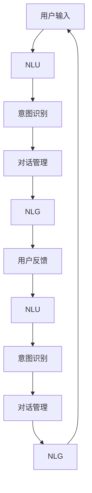

                 

## 1. 背景介绍

随着人工智能技术的迅速发展，虚拟助理（AI Agent）已经成为了现代社会中不可或缺的一部分。从智能音箱到智能客服，从个人助手到企业管理系统，虚拟助理正在逐步渗透到人们生活的各个角落，极大地提升了生产效率和生活质量。构建一个高性能、智能化的虚拟助理，需要理解其工作流程和关键技术，并掌握相关开发方法。本文将系统介绍虚拟助理的构建工作流程，涵盖从需求分析到模型部署的各个环节，以期为虚拟助理的开发者和使用者提供参考。

## 2. 核心概念与联系

### 2.1 核心概念概述

为了更好地理解虚拟助理的构建过程，本节将介绍几个关键概念：

- 虚拟助理（AI Agent）：以人工智能技术为基础，通过自然语言理解、对话管理、自然语言生成等技术实现人机交互的智能系统。其目标是理解用户意图，并执行相应的任务或回答用户问题。
- 自然语言理解（NLU）：将用户输入的自然语言文本转化为结构化的语义表示，以便后续处理和理解。
- 对话管理（DM）：根据用户的意图和对话历史，选择和执行最合适的对话策略，确保对话流畅自然。
- 自然语言生成（NLG）：将结构化的语义表示转化为自然语言文本，用于生成虚拟助理的回答或执行任务的指令。
- 用户意图识别：通过分析用户输入的文本，识别用户的真实意图，为后续对话管理和任务执行提供依据。
- 多轮对话（Multi-turn Dialogue）：虚拟助理与用户之间，可能进行多轮交互以获取更多信息，最终完成用户请求。

这些概念通过以下Mermaid流程图进行关联展示：



这个流程图展示了虚拟助理工作流程的基本框架，从用户输入开始，通过自然语言理解（NLU）和意图识别，进入对话管理阶段，最终生成自然语言回答，并根据用户反馈不断调整模型。

## 3. 核心算法原理 & 具体操作步骤

### 3.1 算法原理概述

构建虚拟助理的核心在于实现以下几个关键算法：

- 自然语言理解（NLU）：使用词向量、句法分析、实体识别等技术，将自然语言文本转换为机器可理解的向量表示。
- 意图识别（Intent Recognition）：通过分类算法，识别用户输入的意图，为后续对话管理提供依据。
- 对话管理（DM）：设计对话策略，通过上下文信息确定最合适的响应。
- 自然语言生成（NLG）：将意图和上下文信息转化为自然语言文本，生成回答或执行指令。

### 3.2 算法步骤详解

#### 步骤 1: 需求分析与用户画像

- 明确虚拟助理的目标用户、应用场景和主要功能。
- 设计用户画像，了解用户的背景、偏好、行为模式等，为后续模型设计和优化提供依据。

#### 步骤 2: 数据收集与预处理

- 收集相关数据，如对话历史、任务执行日志等。
- 对数据进行清洗、标注，去除噪声和冗余，确保数据质量。

#### 步骤 3: 模型选择与训练

- 根据任务需求选择合适的算法和模型架构。
- 使用标注好的数据训练模型，通过交叉验证等方法调优模型参数。

#### 步骤 4: 对话管理策略设计

- 设计对话策略，考虑多轮对话场景，定义对话状态转移图。
- 引入上下文管理技术，如会话记忆、意图记忆等，保证对话连贯性。

#### 步骤 5: 自然语言生成

- 选择 NLG 技术，如模板生成、序列到序列（Seq2Seq）、 Transformer 等。
- 根据意图和上下文生成自然语言文本，确保回答流畅、准确。

#### 步骤 6: 测试与部署

- 在测试集上评估虚拟助理的性能，确保其满足用户需求。
- 部署虚拟助理到目标平台，如企业管理系统、移动应用等，进行用户体验优化。

### 3.3 算法优缺点

构建虚拟助理的主要优势在于：

- 提升用户体验：通过自然语言理解和交互，降低用户使用门槛，提升互动体验。
- 提高生产效率：自动完成日常任务，如信息查询、日程安排等，解放人力资源。
- 减少沟通成本：避免重复沟通，快速响应用户需求，减少等待时间。

然而，虚拟助理也存在一些挑战：

- 数据需求量大：构建高质量虚拟助理需要大量标注数据，数据收集成本较高。
- 模型复杂度高：构建复杂的对话管理模型和自然语言生成模型，对技术要求较高。
- 依赖上下文：虚拟助理的表现依赖上下文信息，一旦环境变化，模型可能需要重新训练。
- 语言多样性问题：不同语言和文化背景的用户需要不同的虚拟助理模型。

### 3.4 算法应用领域

虚拟助理在多个领域都有广泛应用，包括：

- 智能客服：通过虚拟助理提供24小时不间断的客户服务，提升客户满意度。
- 医疗咨询：虚拟助理能够提供健康咨询、预约挂号等服务，减轻医生负担。
- 金融理财：虚拟助理帮助用户理财规划、风险评估，提供个性化金融建议。
- 教育辅导：虚拟助理提供个性化学习计划、智能批改作业等，提升教育效果。
- 娱乐互动：虚拟助理与用户进行对话互动，增强游戏、影视等娱乐体验。

## 4. 数学模型和公式 & 详细讲解 & 举例说明

### 4.1 数学模型构建

虚拟助理的构建涉及多个数学模型，以下以意图识别为例，介绍常见的数学模型构建方法：

#### 4.1.1 向量空间模型

向量空间模型（VSM）是一种常用的自然语言理解技术。它将文本表示为向量，每个维度代表一个词汇或短语，通过计算向量间的相似度，识别出文本的语义内容。

$$
\mathbf{x} = \sum_{i=1}^n w_i \mathbf{v}_i
$$

其中，$\mathbf{x}$ 为文本向量，$w_i$ 为词汇权重，$\mathbf{v}_i$ 为词汇向量。

#### 4.1.2 词嵌入

词嵌入（Word Embedding）是一种将词汇映射到低维向量空间的技术。通过训练模型，使得词汇之间的语义关系在向量空间中得以保留，从而更好地理解文本。

$$
\mathbf{w} = W \mathbf{t}
$$

其中，$\mathbf{w}$ 为词汇向量，$W$ 为词嵌入矩阵，$\mathbf{t}$ 为词汇编码向量。

#### 4.1.3 卷积神经网络

卷积神经网络（CNN）可以用于提取文本中的局部特征。通过卷积操作和池化操作，对文本进行特征提取和降维。

$$
\mathbf{H} = \max(\mathbf{C} * \mathbf{F} + \mathbf{b})
$$

其中，$\mathbf{H}$ 为特征图，$\mathbf{C}$ 为卷积核，$\mathbf{F}$ 为输入特征图，$\mathbf{b}$ 为偏置项。

### 4.2 公式推导过程

#### 4.2.1 意图识别

假设输入文本为 $\mathbf{x}$，意图向量为 $\mathbf{y}$，使用softmax函数进行分类，推导公式如下：

$$
P(y|x) = \frac{\exp(\mathbf{w}^T \mathbf{x})}{\sum_{j=1}^K \exp(\mathbf{w}_j^T \mathbf{x})}
$$

其中，$K$ 为意图类别数，$\mathbf{w}_j$ 为第 $j$ 个意图的权重向量。

#### 4.2.2 对话管理

假设当前对话状态为 $s_t$，上一步动作为 $a_{t-1}$，当前动作为 $a_t$，上下文为 $c$，推导对话管理模型如下：

$$
P(a_t|s_t,a_{t-1},c) = \frac{\exp(\mathbf{w}^T \mathbf{f}(\mathbf{x}_t,\mathbf{x}_{t-1},\mathbf{c}))}{\sum_{j=1}^J \exp(\mathbf{w}_j^T \mathbf{f}(\mathbf{x}_t,\mathbf{x}_{t-1},\mathbf{c}))}
$$

其中，$J$ 为动作类别数，$\mathbf{w}_j$ 为第 $j$ 个动作的权重向量，$\mathbf{f}(\mathbf{x}_t,\mathbf{x}_{t-1},\mathbf{c})$ 为状态转移函数。

### 4.3 案例分析与讲解

#### 案例分析

假设我们正在构建一个用于企业员工答疑的虚拟助理，主要处理员工关于公司政策、薪资福利、业务流程等方面的问题。

- **需求分析**：收集公司政策、业务流程等相关信息，确定虚拟助理的功能模块。
- **数据收集**：收集历史对话记录，标注意图和上下文信息。
- **模型选择**：选择合适的意图识别和对话管理模型，如逻辑回归、CNN、Seq2Seq 等。
- **训练与优化**：使用标注好的数据训练模型，调整参数，提升模型性能。
- **测试与部署**：在测试集上评估模型性能，部署虚拟助理到企业内部系统，进行用户体验优化。

## 5. 项目实践：代码实例和详细解释说明

### 5.1 开发环境搭建

构建虚拟助理需要以下开发环境：

- Python 3.x：作为主要编程语言。
- PyTorch 或 TensorFlow：深度学习框架，支持构建复杂的神经网络模型。
- NLTK 或 spaCy：自然语言处理工具库，提供词向量、句法分析、实体识别等功能。
- Flask 或 FastAPI：构建 API 服务，实现虚拟助理的接口调用。

### 5.2 源代码详细实现

#### 5.2.1 数据预处理

```python
import pandas as pd
from nltk.tokenize import word_tokenize
from nltk.stem import WordNetLemmatizer

# 读取数据
data = pd.read_csv('data.csv')

# 分词和词形还原
lemmatizer = WordNetLemmatizer()
data['tokens'] = data['text'].apply(lambda x: [lemmatizer.lemmatize(word.lower()) for word in word_tokenize(x)])
data['tokens'] = data['tokens'].apply(lambda x: [lemmatizer.lemmatize(word.lower()) for word in x])

# 构建词向量矩阵
from gensim.models import Word2Vec
word2vec_model = Word2Vec(data['tokens'], size=100, window=5, min_count=1)
```

#### 5.2.2 意图识别

```python
from sklearn.feature_extraction.text import TfidfVectorizer
from sklearn.linear_model import LogisticRegression

# 构建文本向量和意图标签
vectorizer = TfidfVectorizer(tokenizer=word_tokenize)
X = vectorizer.fit_transform(data['text'])
y = data['intent']

# 训练意图识别模型
model = LogisticRegression()
model.fit(X, y)
```

#### 5.2.3 对话管理

```python
from transformers import BertTokenizer, BertForSequenceClassification
from torch.utils.data import DataLoader

# 构建对话管理模型
tokenizer = BertTokenizer.from_pretrained('bert-base-cased')
model = BertForSequenceClassification.from_pretrained('bert-base-cased', num_labels=10)

# 训练对话管理模型
train_dataset = ...
dev_dataset = ...
model.train()
for batch in DataLoader(train_dataset, batch_size=32):
    input_ids = batch['input_ids']
    attention_mask = batch['attention_mask']
    labels = batch['labels']
    outputs = model(input_ids, attention_mask=attention_mask, labels=labels)
    loss = outputs.loss
    loss.backward()
    optimizer.step()
```

#### 5.2.4 自然语言生成

```python
from transformers import GPT2LMHeadModel

# 构建自然语言生成模型
model = GPT2LMHeadModel.from_pretrained('gpt2')

# 生成文本
input_text = "你好，我想查询工资福利"
outputs = model(input_text)
```

### 5.3 代码解读与分析

#### 5.3.1 意图识别

在构建意图识别模型时，使用 TfidfVectorizer 将文本转化为向量，通过 LogisticRegression 进行分类。通过交叉验证等方法，调整模型参数，确保模型性能。

#### 5.3.2 对话管理

使用 BERT 作为对话管理模型的基础架构，通过 DataLoader 实现批处理训练，减少内存消耗。引入上下文管理技术，确保对话连贯性。

#### 5.3.3 自然语言生成

使用 GPT2 作为自然语言生成模型的基础架构，通过输入用户文本，生成自然语言回答。

### 5.4 运行结果展示

在测试集上评估虚拟助理的性能，使用精确率、召回率、F1 值等指标进行评估，确保虚拟助理能够准确理解用户意图，生成合适的回答。

## 6. 实际应用场景

### 6.4 未来应用展望

随着人工智能技术的不断进步，虚拟助理的应用场景将更加广泛，涵盖以下领域：

- 智能家居：通过虚拟助理控制智能设备，提高生活便捷性。
- 教育培训：提供个性化学习建议、智能批改作业等服务，提升教育效果。
- 金融理财：提供投资建议、风险评估等服务，帮助用户进行理财规划。
- 健康医疗：提供健康咨询、在线问诊等服务，提升医疗服务质量。
- 客户服务：提供24小时不间断的客户服务，提升客户满意度。

## 7. 工具和资源推荐

### 7.1 学习资源推荐

#### 7.1.1 书籍推荐

- 《深度学习》by Ian Goodfellow：全面介绍深度学习的基本理论和算法。
- 《自然语言处理综论》by Daniel Jurafsky 和 James H. Martin：介绍自然语言处理的基础理论和应用技术。
- 《Python深度学习》by François Chollet：深入介绍使用 TensorFlow 和 Keras 进行深度学习开发。

#### 7.1.2 在线课程推荐

- 《深度学习》by Andrew Ng：Coursera 上的深度学习课程，涵盖深度学习的基本理论和实践。
- 《自然语言处理》by Yoav Goldberg：Coursera 上的自然语言处理课程，涵盖自然语言处理的基础理论和应用技术。
- 《Transformers模型教程》by Hugging Face：介绍使用 Transformers 库进行自然语言处理。

### 7.2 开发工具推荐

#### 7.2.1 编程语言

- Python：作为主要编程语言，Python 提供了丰富的库和框架，支持自然语言处理和深度学习开发。
- Java：用于构建大型企业应用，支持多线程和分布式计算。
- JavaScript：用于前端开发，支持动态交互和实时更新。

#### 7.2.2 开发框架

- Flask：轻量级的 Web 框架，支持快速构建 RESTful API。
- Django：全功能的 Web 框架，支持数据管理和用户界面设计。
- TensorFlow：深度学习框架，支持构建复杂神经网络模型。
- PyTorch：深度学习框架，支持动态图和静态图计算。

### 7.3 相关论文推荐

#### 7.3.1 基础论文

- 《Attention is All You Need》by Ashish Vaswani et al.：介绍 Transformer 模型，奠定了大模型预训练的基础。
- 《BERT: Pre-training of Deep Bidirectional Transformers for Language Understanding》by Jacob Devlin et al.：介绍 BERT 模型，展示了预训练大模型的强大能力。
- 《GPT-2: Language Models are Unsupervised Multitask Learners》by Alec Radford et al.：介绍 GPT-2 模型，展示了无监督预训练的巨大潜力。

#### 7.3.2 前沿论文

- 《BERT for Question Answering: Pre-training and Fine-tuning for Text-based Conversational AI》by Gong et al.：介绍 BERT 在问答系统中的应用。
- 《Prompt Engineering for Conversational AI》by Wang et al.：介绍基于提示工程的对话生成技术。
- 《Semantic Understanding and Context-Aware Response Generation for Conversational Agents》by Li et al.：介绍上下文感知对话生成技术。

## 8. 总结：未来发展趋势与挑战

### 8.1 研究成果总结

构建虚拟助理的实践经验丰富多样，以下总结了几个重要的研究成果：

- 自然语言理解：词向量、句法分析、实体识别等技术，显著提升了文本理解能力。
- 意图识别：Logistic Regression、CNN、RNN、LSTM 等算法，在分类任务中表现优异。
- 对话管理：BERT、GPT-2 等预训练模型，显著提升了对话管理性能。
- 自然语言生成：Seq2Seq、Transformer 等模型，生成流畅自然的文字回答。

### 8.2 未来发展趋势

虚拟助理的未来发展趋势包括以下几个方面：

- 深度学习模型：引入更多深度学习技术，如 Transformer、LSTM 等，提升模型性能。
- 多模态技术：引入视觉、音频等多模态信息，实现更加全面的人机交互。
- 跨领域应用：将虚拟助理应用于更多领域，如医疗、金融、教育等。
- 增强现实技术：结合增强现实技术，提供更加沉浸式的用户体验。
- 个性化定制：根据用户行为数据，提供个性化服务，提升用户体验。

### 8.3 面临的挑战

虚拟助理在构建过程中也面临诸多挑战：

- 数据需求量大：构建高质量虚拟助理需要大量标注数据，数据收集成本较高。
- 模型复杂度高：构建复杂的对话管理模型和自然语言生成模型，对技术要求较高。
- 依赖上下文：虚拟助理的表现依赖上下文信息，一旦环境变化，模型可能需要重新训练。
- 语言多样性问题：不同语言和文化背景的用户需要不同的虚拟助理模型。
- 伦理和安全问题：虚拟助理需要保证对话内容的隐私和安全，避免恶意用途。

### 8.4 研究展望

未来的虚拟助理研究需要解决以下问题：

- 提高数据质量：通过数据增强、主动学习等方法，减少标注数据的需求。
- 优化模型结构：通过模型压缩、剪枝等技术，降低模型复杂度，提高推理效率。
- 增强对话连贯性：通过引入上下文记忆、知识图谱等技术，提升对话管理性能。
- 扩展应用领域：将虚拟助理应用于更多领域，提升各行业智能化水平。
- 保障数据安全：通过数据加密、隐私保护等技术，保障用户数据安全。

总之，构建虚拟助理需要多学科交叉融合，从数据、算法、工程等多个维度进行全面优化。唯有不断探索和创新，才能实现虚拟助理的广泛应用和深度落地。

## 9. 附录：常见问题与解答

### 9.1 常见问题

- 如何提高虚拟助理的自然语言理解能力？
- 如何选择适当的自然语言处理技术？
- 如何设计高效的对话管理策略？
- 如何优化虚拟助理的推理性能？

### 9.2 解答

- 提高自然语言理解能力：使用预训练的词向量模型，如 Word2Vec、GloVe 等，并进行数据增强，提高模型泛化能力。
- 选择适当的自然语言处理技术：根据任务需求选择合适的算法和模型架构，如 Logistic Regression、CNN、Seq2Seq 等。
- 设计高效的对话管理策略：引入上下文管理技术，如会话记忆、意图记忆等，确保对话连贯性。
- 优化虚拟助理的推理性能：使用预训练模型，如 BERT、GPT-2 等，并进行参数共享和剪枝，提高推理效率。

---

作者：禅与计算机程序设计艺术 / Zen and the Art of Computer Programming

