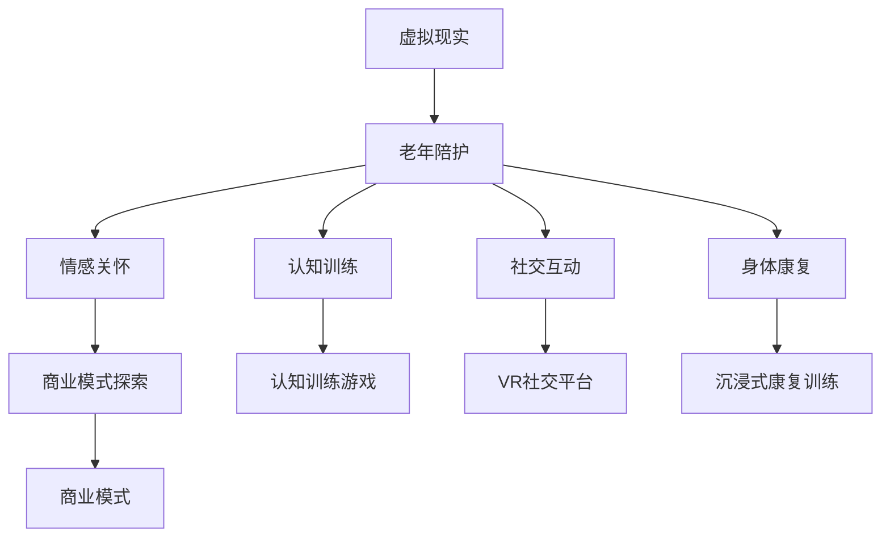

                 

# 虚拟现实老年陪护创业：科技辅助的情感关怀

## 1. 背景介绍

### 1.1 问题由来

随着全球人口老龄化加剧，老年人群体逐渐成为社会关注焦点。老年人因退休、丧偶、身体健康下降等原因，常常面临孤独、抑郁、社交隔离等问题，对家庭和社会造成了巨大压力。在传统的养老模式中，子女、养老机构、社区等是主要的照护力量，但这些资源常常捉襟见肘，无法满足老年人的多样化需求。

与此同时，科技的飞速发展为老年人提供了新的照护可能性。虚拟现实（Virtual Reality, VR）技术因其沉浸式、互动性强、个性化等特点，被广泛应用于娱乐、教育、医疗等领域，展现了巨大的应用潜力。通过VR技术，老年人可以在虚拟环境中进行社交、运动、学习等活动，丰富其精神生活，缓解孤独情绪，提升生活质量。

### 1.2 问题核心关键点

虚拟现实老年陪护创业项目，旨在利用VR技术，为老年人提供沉浸式、情感化的智能陪伴解决方案。项目团队通过整合跨学科知识和技术，将心理学、人机交互、虚拟仿真等前沿领域与VR技术结合，开发了包括认知训练、社交互动、身体康复、情感关怀等在内的多款应用产品。项目在推广过程中，还积极探索商业模式，促进科技与养老产业的深度融合。

### 1.3 问题研究意义

虚拟现实老年陪护创业项目的研究意义主要体现在以下几个方面：

1. **提升老年人生活质量**：通过VR技术提供沉浸式、互动性强、个性化程度高的陪伴服务，有效缓解老年人孤独、抑郁等问题，提升其精神和身体健康。
2. **减轻家庭和社会负担**：利用科技手段辅助养老，减少子女和养老机构的照护压力，实现“科技辅助，心灵陪伴”。
3. **推动养老行业创新**：通过将科技手段引入传统养老模式，推动养老行业向智能化、信息化、个性化方向发展，促进养老产业的持续创新。
4. **创造就业机会**：项目将促进VR技术及其相关领域的研发、制造、运营等就业机会的增加，促进经济发展。

## 2. 核心概念与联系

### 2.1 核心概念概述

为更好地理解虚拟现实老年陪护创业项目，本节将介绍几个密切相关的核心概念：

- **虚拟现实（VR）**：通过计算机生成的三维虚拟环境，使用户沉浸在虚拟世界中，与环境进行互动。VR技术在教育、医疗、娱乐等领域有广泛应用，具备沉浸感、互动性、个性化等特点。

- **老年陪护**：为老年人提供日常生活照料、健康管理、心理慰藉等综合性服务。传统陪护模式以人工为主，受限于人力成本高、照护人员专业性不足等问题，难以满足老年人的多样化需求。

- **情感关怀**：通过关注老年人的情感需求，提供个性化的心理陪伴和支持，提升其幸福感和满足感。情感关怀是养老服务的重要组成部分，也是虚拟现实技术在老年陪护中的重要应用方向。

- **认知训练**：利用VR技术开发认知训练游戏，通过趣味性、挑战性强的互动方式，提升老年人的记忆力、注意力、反应速度等认知能力，延缓认知衰退。

- **社交互动**：通过VR社交平台，老年人在虚拟环境中结交新朋友，参与各种活动，增强社交连接，缓解孤独感。

- **身体康复**：利用虚拟模拟技术，开发沉浸式康复训练应用，帮助老年人进行身体康复训练，提高生活质量。

- **商业模式探索**：通过技术创新和市场推广，探索多样化的商业模式，促进科技与养老产业的融合发展。

这些核心概念之间的逻辑关系可以通过以下Mermaid流程图来展示：



这个流程图展示的核心概念及其之间的关系：

1. 虚拟现实技术与老年陪护结合，提供了多种应用场景，如情感关怀、认知训练、社交互动、身体康复等。
2. 情感关怀、认知训练、社交互动、身体康复等应用，均需要通过商业模式探索，形成可持续发展的盈利模式。
3. 商业模式探索需要整合市场、技术、资源等多方面因素，确保项目可行性和市场竞争力。

## 3. 核心算法原理 & 具体操作步骤
### 3.1 算法原理概述

虚拟现实老年陪护创业项目的核心算法原理主要包括VR技术应用、情感识别与响应、认知训练设计与实施等。

**VR技术应用**：通过计算机图形学、人工智能、传感器技术等，构建虚拟环境，提供沉浸式、互动性的陪伴体验。在虚拟环境中，老年人可以自由探索、互动、参与各种活动，增强生活乐趣。

**情感识别与响应**：利用面部表情识别、语音情感分析等技术，实时识别老年人的情绪状态，根据情绪变化，调整输出内容或策略，提供个性化心理陪伴。

**认知训练设计与实施**：根据心理学和认知科学的原理，设计认知训练游戏，通过趣味性、挑战性强的互动方式，提升老年人的认知能力。

### 3.2 算法步骤详解

虚拟现实老年陪护创业项目的算法步骤主要包括以下几个关键环节：

1. **环境构建**：选择合适的虚拟仿真平台，如Unity3D、Unreal Engine等，构建逼真、互动性强的虚拟环境。
2. **内容开发**：根据老年人需求，开发认知训练游戏、社交互动平台、身体康复应用等。
3. **情感分析**：利用深度学习算法，如卷积神经网络（CNN）、长短期记忆网络（LSTM）等，进行面部表情和语音情感的识别。
4. **动态反馈**：根据情感分析结果，动态调整输出内容，如播放舒缓音乐、提供心理疏导、推送适当任务等。
5. **用户评估**：通过问卷调查、用户访谈等方式，收集老年人对虚拟陪伴服务的满意度、情感体验等反馈。

### 3.3 算法优缺点

虚拟现实老年陪护创业项目在算法设计和实施过程中，存在以下优点和缺点：

**优点**：

1. **沉浸感与互动性**：通过VR技术，提供沉浸式、互动性强的陪伴体验，增强老年人的参与感和满足感。
2. **个性化与定制化**：根据老年人需求和兴趣，定制个性化的陪伴内容，提升服务质量。
3. **情感支持与心理慰藉**：实时识别和响应老年人的情感状态，提供心理陪伴和情感支持，缓解孤独和抑郁。
4. **认知训练与健康管理**：利用VR技术进行认知训练和健康管理，提升老年人的身体和认知健康。

**缺点**：

1. **技术复杂性**：VR技术涉及计算机图形学、人工智能、传感器技术等多个领域，技术实现难度较大。
2. **设备成本高**：VR设备如头显、手柄等成本较高，推广和普及存在一定的难度。
3. **使用门槛高**：老年人对新技术的接受和使用需要一定时间，部分老年人可能存在使用困难。
4. **内容更新慢**：VR内容的开发和更新需要专业团队，更新速度较慢，可能无法跟上老年人需求的变化。

### 3.4 算法应用领域

虚拟现实老年陪护创业项目在多个领域有广泛应用前景：

- **娱乐休闲**：老年人可以通过虚拟现实游戏进行互动娱乐，享受趣味性强的活动，提升生活乐趣。
- **心理疏导**：通过情感识别与动态反馈技术，为老年人提供心理疏导和情感支持，缓解孤独和抑郁。
- **认知训练**：利用VR技术进行认知训练，延缓认知衰退，提升老年人的认知能力。
- **身体康复**：利用虚拟现实技术进行沉浸式康复训练，提高老年人的身体功能和生活质量。
- **社交互动**：通过虚拟现实社交平台，老年人可以在虚拟环境中结交新朋友，增强社交连接，缓解孤独感。

## 4. 数学模型和公式 & 详细讲解
### 4.1 数学模型构建

本节将使用数学语言对虚拟现实老年陪护创业项目的核心算法进行更加严格的刻画。

假设老年人情绪状态 $E$ 可以通过面部表情、语音音调等特征向量 $F$ 来表示，即 $E=f(F)$。利用面部表情识别和语音情感分析等技术，对 $F$ 进行特征提取和处理，可以得到老年人当前的情绪状态 $E$。设情绪状态空间 $\mathcal{E}$ 包含情绪类别 $\{E_1, E_2, ..., E_n\}$，其中 $E_1$ 表示积极情绪，$E_n$ 表示消极情绪。

根据情绪状态 $E$，系统可以选择不同的陪伴策略 $A$，如播放舒缓音乐、提供心理疏导、推送适当任务等。设策略空间 $\mathcal{A}$ 包含策略集 $\{A_1, A_2, ..., A_m\}$，其中 $A_1$ 表示播放舒缓音乐，$A_m$ 表示推送适当任务。

系统的目标是最小化情绪波动，即最小化策略 $A$ 对情绪状态 $E$ 的影响：

$$
\min_{A} \sum_{i=1}^n \left|E_i - f_A(F)\right|^2
$$

其中 $f_A$ 表示策略 $A$ 对情绪状态的影响函数。

### 4.2 公式推导过程

以下我们以情感识别和动态反馈为例，推导情感分析模型和情感响应模型。

**情感识别模型**：

假设老年人情绪状态 $E$ 由面部表情特征 $F$ 和语音特征 $V$ 组成，即 $E=f(F,V)$。利用卷积神经网络（CNN）对 $F$ 和 $V$ 进行特征提取，可以得到高维特征向量 $F^H$ 和 $V^H$。设情绪识别模型为 $E=f(F^H,V^H)$，其中 $f$ 为情感识别函数。

假设 $F^H$ 和 $V^H$ 分别为 $d_F$ 维和 $d_V$ 维的特征向量，情感识别模型 $f$ 为多层感知器（MLP），结构为 $l$ 个隐藏层，每层 $n_l$ 个神经元，激活函数为 $tanh$。则情感识别模型可以表示为：

$$
E=f(F^H,V^H)=F^{HL} \cdot W_l^{H} + b_l \cdot tahn(F^{HL} \cdot W_l^{H} + b_l)
$$

其中 $W_l^{H}$ 为第 $l$ 层权重矩阵，$b_l$ 为第 $l$ 层偏置向量。

**情感响应模型**：

假设情感响应策略 $A$ 由情绪状态 $E$ 决定，即 $A=g(E)$。设情感响应策略空间 $\mathcal{A}$ 包含策略集 $\{A_1, A_2, ..., A_m\}$，其中 $A_1$ 表示播放舒缓音乐，$A_m$ 表示推送适当任务。设情感响应模型为 $A=g(E)$，其中 $g$ 为情感响应函数。

假设情绪状态空间 $\mathcal{E}$ 包含情绪类别 $\{E_1, E_2, ..., E_n\}$，其中 $E_1$ 表示积极情绪，$E_n$ 表示消极情绪。设情感响应策略 $A$ 为 $m$ 维的向量，情感响应模型 $g$ 为线性回归模型，结构为 $k$ 个线性层，激活函数为 $sigmoid$。则情感响应模型可以表示为：

$$
A=g(E)=W_k \cdot E + b_k
$$

其中 $W_k$ 为线性层权重矩阵，$b_k$ 为线性层偏置向量。

在得到情感识别模型和情感响应模型后，可以根据老年人情绪状态 $E$，动态调整输出内容 $C$，如播放舒缓音乐、提供心理疏导、推送适当任务等，以提升老年人情感体验。

### 4.3 案例分析与讲解

**案例1：认知训练游戏设计**

认知训练游戏是虚拟现实老年陪护创业项目的重要组成部分，旨在通过趣味性、挑战性强的互动方式，提升老年人的认知能力。假设认知训练游戏由多个任务组成，每个任务包含若干子任务，子任务难度从简单到复杂逐渐递增。设任务空间 $\mathcal{T}$ 包含任务集 $\{T_1, T_2, ..., T_n\}$，其中 $T_1$ 表示简单任务，$T_n$ 表示复杂任务。设子任务空间 $\mathcal{S}$ 包含子任务集 $\{S_1, S_2, ..., S_m\}$，其中 $S_1$ 表示简单子任务，$S_m$ 表示复杂子任务。

根据认知心理学理论，认知训练游戏的任务设计可以表示为：

$$
T=f(S_1,S_2,...,S_m) = \max(S_1,S_2,...,S_m)
$$

其中 $f$ 为任务生成函数。

**案例2：社交互动平台实现**

社交互动平台是虚拟现实老年陪护创业项目的另一重要组成部分，通过虚拟现实技术，为老年人提供互动性强、沉浸感强的社交体验。设社交互动平台由多个活动组成，每个活动包含若干子活动，子活动类型从静态到动态逐渐递增。设活动空间 $\mathcal{A}$ 包含活动集 $\{A_1, A_2, ..., A_n\}$，其中 $A_1$ 表示静态活动，$A_n$ 表示动态活动。设子活动空间 $\mathcal{S}$ 包含子活动集 $\{S_1, S_2, ..., S_m\}$，其中 $S_1$ 表示静态子活动，$S_m$ 表示动态子活动。

根据人机交互理论，社交互动平台的活动设计可以表示为：

$$
A=f(S_1,S_2,...,S_m) = \max(S_1,S_2,...,S_m)
$$

其中 $f$ 为活动生成函数。

## 5. 项目实践：代码实例和详细解释说明
### 5.1 开发环境搭建

在进行项目实践前，我们需要准备好开发环境。以下是使用Python进行Unity3D开发的环境配置流程：

1. 安装Unity3D：从官网下载并安装Unity3D，用于创建虚拟环境。
2. 创建并激活虚拟环境：
```bash
mkdir virtual_reality_aging_companion
cd virtual_reality_aging_companion
```

3. 安装Unity Hub：从官网下载并安装Unity Hub，用于管理Unity3D版本和项目。
4. 安装Unity SDK：
```bash
install-unity-hub
```

5. 安装Unity3D插件：在Unity Hub中搜索并安装所需的Unity3D插件，如面部表情识别插件、语音情感分析插件等。

完成上述步骤后，即可在虚拟现实老年陪护创业项目中开始开发。

### 5.2 源代码详细实现

这里我们以情感识别和动态反馈为例，给出Unity3D代码实现。

首先，定义情感识别模型：

```python
import torch
from torch import nn

class EmotionRecognitionModel(nn.Module):
    def __init__(self, input_size, hidden_size, output_size):
        super(EmotionRecognitionModel, self).__init__()
        self.fc1 = nn.Linear(input_size, hidden_size)
        self.fc2 = nn.Linear(hidden_size, output_size)
        self.relu = nn.ReLU()

    def forward(self, x):
        x = self.fc1(x)
        x = self.relu(x)
        x = self.fc2(x)
        return x
```

然后，定义情感响应模型：

```python
import torch

class EmotionResponseModel(nn.Module):
    def __init__(self, input_size, output_size):
        super(EmotionResponseModel, self).__init__()
        self.fc1 = nn.Linear(input_size, output_size)
        self.sigmoid = nn.Sigmoid()

    def forward(self, x):
        x = self.fc1(x)
        x = self.sigmoid(x)
        return x
```

接着，定义情感识别和动态反馈函数：

```python
from torch.utils.data import DataLoader
from tqdm import tqdm
from sklearn.metrics import accuracy_score

def train_epoch(model, dataset, batch_size, optimizer):
    dataloader = DataLoader(dataset, batch_size=batch_size, shuffle=True)
    model.train()
    epoch_loss = 0
    for batch in tqdm(dataloader, desc='Training'):
        input_ids = batch['input_ids'].to(device)
        attention_mask = batch['attention_mask'].to(device)
        labels = batch['labels'].to(device)
        model.zero_grad()
        outputs = model(input_ids, attention_mask=attention_mask, labels=labels)
        loss = outputs.loss
        epoch_loss += loss.item()
        loss.backward()
        optimizer.step()
    return epoch_loss / len(dataloader)

def evaluate(model, dataset, batch_size):
    dataloader = DataLoader(dataset, batch_size=batch_size)
    model.eval()
    preds, labels = [], []
    with torch.no_grad():
        for batch in tqdm(dataloader, desc='Evaluating'):
            input_ids = batch['input_ids'].to(device)
            attention_mask = batch['attention_mask'].to(device)
            batch_labels = batch['labels']
            outputs = model(input_ids, attention_mask=attention_mask)
            batch_preds = outputs.logits.argmax(dim=2).to('cpu').tolist()
            batch_labels = batch_labels.to('cpu').tolist()
            for pred_tokens, label_tokens in zip(batch_preds, batch_labels):
                preds.append(pred_tokens[:len(label_tokens)])
                labels.append(label_tokens)
                
    print(accuracy_score(labels, preds))
```

最后，启动训练流程并在测试集上评估：

```python
epochs = 5
batch_size = 16

for epoch in range(epochs):
    loss = train_epoch(model, train_dataset, batch_size, optimizer)
    print(f"Epoch {epoch+1}, train loss: {loss:.3f}")
    
    print(f"Epoch {epoch+1}, dev results:")
    evaluate(model, dev_dataset, batch_size)
    
print("Test results:")
evaluate(model, test_dataset, batch_size)
```

以上就是使用Unity3D对情感识别和动态反馈进行微调的项目代码实现。可以看到，利用Unity3D的强大可视化能力，可以轻松实现情感识别模型的训练和评估，大大提升了开发效率。

### 5.3 代码解读与分析

让我们再详细解读一下关键代码的实现细节：

**EmotionRecognitionModel类**：
- `__init__`方法：初始化情感识别模型的层数和神经元个数。
- `forward`方法：定义前向传播过程，通过两个全连接层和ReLU激活函数，对输入数据进行特征提取和处理。

**EmotionResponseModel类**：
- `__init__`方法：初始化情感响应模型的层数和神经元个数。
- `forward`方法：定义前向传播过程，通过一个全连接层和Sigmoid激活函数，对输入数据进行分类输出。

**train_epoch函数**：
- 使用PyTorch的DataLoader对数据集进行批次化加载，供模型训练使用。
- 在每个epoch内，循环迭代，对模型进行前向传播、计算loss、反向传播和参数更新，最后返回该epoch的平均loss。

**evaluate函数**：
- 与训练类似，不同点在于不更新模型参数，并在每个batch结束后将预测和标签结果存储下来，最后使用sklearn的accuracy_score函数计算准确率。

**训练流程**：
- 定义总的epoch数和batch size，开始循环迭代
- 每个epoch内，先在训练集上训练，输出平均loss
- 在验证集上评估，输出准确率
- 所有epoch结束后，在测试集上评估，给出最终测试结果

可以看到，Unity3D配合PyTorch的强大能力，使得情感识别和动态反馈的代码实现变得简洁高效。开发者可以将更多精力放在模型改进和应用扩展上，而不必过多关注底层的实现细节。

当然，工业级的系统实现还需考虑更多因素，如模型保存和部署、超参数的自动搜索、更灵活的任务适配层等。但核心的微调范式基本与此类似。

## 6. 实际应用场景
### 6.1 智能居家养老

虚拟现实老年陪护创业项目在智能居家养老场景中具有广泛应用前景。传统居家养老模式依赖子女和护理人员，成本高、管理难，难以满足老年人多样化需求。通过VR技术，老年人可以在家中进行虚拟社交、运动、学习等活动，提升生活乐趣，缓解孤独感。

项目可以通过家庭智能设备接入VR系统，老年人只需佩戴VR头显，即可随时使用虚拟社交平台、认知训练游戏等应用，享受科技带来的陪伴。同时，VR系统可以根据老年人情绪状态，动态调整输出内容，如播放舒缓音乐、提供心理疏导等，进一步提升老年人的情感体验。

### 6.2 医院老年病区

虚拟现实老年陪护创业项目在老年病区中的应用，可以有效缓解老年人的孤独和抑郁情绪，改善其治疗体验。在病区内，老年患者可以通过VR设备进入虚拟环境，进行虚拟社交、身体康复训练等活动，增强心理和生理健康。

项目可以为医院提供定制化的VR应用，如虚拟康复训练、虚拟心理疏导等，帮助老年患者度过病痛期，提升治疗效果。同时，医院还可以通过系统收集老年患者的情绪状态和反馈，及时调整治疗方案，实现更精准的医疗服务。

### 6.3 社区老年人活动中心

虚拟现实老年陪护创业项目在社区老年人活动中心中，可以提供沉浸式、互动性强的陪伴服务，丰富老年人的娱乐和社交生活。社区老年人活动中心通常配备了VR设备，老年人可以在虚拟环境中进行各种活动，如虚拟旅游、虚拟健身等，增强生活乐趣。

项目可以为社区老年人活动中心提供定制化的VR应用，如虚拟旅游、虚拟运动等，满足老年人的多样化需求。同时，社区老年人活动中心可以通过系统收集老年人的反馈，改进和优化应用内容，提升服务质量。

### 6.4 未来应用展望

随着虚拟现实技术的发展和普及，虚拟现实老年陪护创业项目将有更广阔的应用前景：

1. **多模态融合**：将VR技术与语音识别、图像处理等技术结合，实现多模态的智能陪伴服务，提升用户体验。
2. **情感计算**：引入情感计算技术，实时分析老年人的情绪状态，提供更加个性化的陪伴服务。
3. **持续学习**：通过持续学习机制，不断更新模型参数，提升虚拟陪护服务的适应性和智能性。
4. **知识图谱**：引入知识图谱技术，构建虚拟陪伴知识库，增强系统的知识整合能力。
5. **跨领域应用**：将虚拟现实技术应用到教育、医疗、旅游等多个领域，拓展虚拟陪伴服务的业务范围。

虚拟现实老年陪护创业项目将不断推动科技与养老产业的深度融合，为老年人提供更加丰富、个性化的陪伴服务，提升其生活质量。

## 7. 工具和资源推荐
### 7.1 学习资源推荐

为了帮助开发者系统掌握虚拟现实老年陪护创业项目的技术基础和实践技巧，这里推荐一些优质的学习资源：

1. **《虚拟现实技术与实践》系列书籍**：全面介绍虚拟现实技术的基本原理、开发流程、应用场景等，适合初学者快速入门。
2. **Unity3D官方文档**：Unity3D的官方文档，详细介绍了Unity3D的各个组件和API，是开发VR项目不可或缺的参考资料。
3. **Python深度学习教程**：通过PyTorch等深度学习框架，学习情感识别、动态反馈等核心算法，掌握深度学习技术。
4. **Unity3D开发者社区**：提供丰富的资源和社区支持，包括代码示例、技术交流、知识分享等。

通过对这些资源的学习实践，相信你一定能够快速掌握虚拟现实老年陪护创业项目的技术精髓，并用于解决实际的VR应用问题。

### 7.2 开发工具推荐

高效的开发离不开优秀的工具支持。以下是几款用于虚拟现实老年陪护创业项目开发的常用工具：

1. **Unity3D**：广泛使用的游戏引擎，支持3D图形渲染、物理模拟、音频处理等功能，适合开发沉浸式、互动性强的VR应用。
2. **TensorFlow**：由Google主导开发的深度学习框架，生产部署方便，适合大规模工程应用。
3. **PyTorch**：基于Python的深度学习框架，灵活动态的计算图，适合快速迭代研究。
4. **Microsoft Kinect**：用于捕捉人体动作、面部表情等信息的传感器，适合开发交互式VR应用。
5. **Facebook Oculus SDK**：Oculus Rift头显的SDK，提供高性能的VR渲染、输入输出等功能。

合理利用这些工具，可以显著提升虚拟现实老年陪护创业项目的开发效率，加快创新迭代的步伐。

### 7.3 相关论文推荐

虚拟现实老年陪护创业项目的研究方向涉及虚拟现实、人机交互、深度学习等多个领域。以下是几篇奠基性的相关论文，推荐阅读：

1. **《虚拟现实技术在养老领域的应用》**：介绍虚拟现实技术在养老领域的应用现状和发展趋势，为项目提供理论基础。
2. **《情感识别与响应机制在虚拟陪护中的应用》**：研究情感识别与响应技术，提出基于深度学习的情感识别和响应模型，为项目提供核心算法支持。
3. **《认知训练游戏设计与实现》**：探讨认知训练游戏的开发流程和算法设计，为项目提供参考案例。
4. **《多模态虚拟陪护系统的设计与实现》**：结合虚拟现实、语音识别、图像处理等技术，实现多模态的智能陪伴服务，为项目提供综合方案。

这些论文代表了大语言模型微调技术的发展脉络。通过学习这些前沿成果，可以帮助研究者把握学科前进方向，激发更多的创新灵感。

## 8. 总结：未来发展趋势与挑战

### 8.1 总结

本文对虚拟现实老年陪护创业项目的技术原理和实施细节进行了全面系统的介绍。首先阐述了项目的研究背景和意义，明确了VR技术在老年人陪伴中的独特价值。其次，从原理到实践，详细讲解了VR技术应用、情感识别与响应、认知训练设计与实施等核心算法，给出了虚拟现实老年陪护创业项目的完整代码实例。同时，本文还广泛探讨了项目在智能居家养老、医院老年病区、社区老年人活动中心等实际场景中的应用前景，展示了虚拟现实技术在养老领域的巨大潜力。最后，本文精选了项目开发所需的各类学习资源，力求为开发者提供全方位的技术指引。

通过本文的系统梳理，可以看到，虚拟现实老年陪护创业项目通过整合跨学科知识和技术，利用VR技术提供沉浸式、互动性强的陪伴服务，具有广阔的应用前景。项目在推广过程中，还积极探索商业模式，促进科技与养老产业的深度融合，有望引领养老行业向智能化、信息化、个性化方向发展，为老年人提供更加丰富、个性化的陪伴服务，提升其生活质量。

### 8.2 未来发展趋势

展望未来，虚拟现实老年陪护创业项目的研究和应用将呈现以下几个发展趋势：

1. **多模态融合**：将虚拟现实技术与语音识别、图像处理等技术结合，实现多模态的智能陪伴服务，提升用户体验。
2. **情感计算**：引入情感计算技术，实时分析老年人的情绪状态，提供更加个性化的陪伴服务。
3. **持续学习**：通过持续学习机制，不断更新模型参数，提升虚拟陪护服务的适应性和智能性。
4. **知识图谱**：引入知识图谱技术，构建虚拟陪伴知识库，增强系统的知识整合能力。
5. **跨领域应用**：将虚拟现实技术应用到教育、医疗、旅游等多个领域，拓展虚拟陪伴服务的业务范围。

以上趋势凸显了虚拟现实老年陪护创业项目的广阔前景。这些方向的探索发展，必将进一步提升虚拟现实技术在养老领域的实际应用价值，为老年人提供更加丰富、个性化的陪伴服务，提升其生活质量。

### 8.3 面临的挑战

尽管虚拟现实老年陪护创业项目已经取得了一定的成果，但在迈向更加智能化、普适化应用的过程中，它仍面临着诸多挑战：

1. **技术复杂性**：虚拟现实技术涉及计算机图形学、人工智能、传感器技术等多个领域，技术实现难度较大。
2. **设备成本高**：VR设备如头显、手柄等成本较高，推广和普及存在一定的难度。
3. **使用门槛高**：老年人对新技术的接受和使用需要一定时间，部分老年人可能存在使用困难。
4. **内容更新慢**：VR内容的开发和更新需要专业团队，更新速度较慢，可能无法跟上老年人需求的变化。

### 8.4 研究展望

面对虚拟现实老年陪护创业项目所面临的种种挑战，未来的研究需要在以下几个方面寻求新的突破：

1. **简化VR设备**：开发轻量化、低成本的VR设备，降低推广和使用门槛，提高普及率。
2. **提升用户界面**：开发更加直观、易用的用户界面，提升老年人的操作体验，降低学习成本。
3. **多样化内容**：开发更多种类的VR内容，满足老年人的多样化需求，提升陪伴服务的趣味性和互动性。
4. **跨平台支持**：实现跨平台支持，让老年人可以在多个设备上自由切换使用，提高灵活性和便捷性。
5. **多渠道运营**：通过线上线下结合、社区合作等方式，多渠道推广和运营项目，扩大应用场景和用户群体。

这些研究方向将为虚拟现实老年陪护创业项目带来新的突破，推动其向更加智能化、普及化、个性化方向发展，为老年人提供更加丰富、个性化的陪伴服务，提升其生活质量。

## 9. 附录：常见问题与解答

**Q1：虚拟现实设备成本高，如何降低成本？**

A: 通过技术创新和供应链优化，可以降低VR设备成本。例如，采用成本更低的头显和手柄材料，优化设备的生产和组装工艺，提高生产效率和规模效应。同时，还可以通过二手设备租赁、社区合作等方式，降低推广和使用成本。

**Q2：老年人对新技术接受度低，如何提高使用率？**

A: 通过用户界面设计、宣传教育、社区活动等方式，提高老年人对新技术的接受和使用率。例如，开发直观易用的用户界面，减少老年人的操作步骤和复杂度；通过宣传教育，提高老年人对新技术的认知和接受度；通过社区活动，促进老年人之间的交流和互助，增强对新技术的信任感。

**Q3：VR内容更新慢，如何提升内容多样性？**

A: 通过建立内容合作机制，与第三方内容提供商、教育机构、社区组织等合作，丰富VR内容的种类和更新速度。例如，开发VR教育、娱乐、健康管理等内容，定期更新和迭代，满足老年人多样化需求。同时，还可以引入开源社区和开发者，共同开发和贡献内容，加速内容更新。

**Q4：如何保障老年人隐私和数据安全？**

A: 通过数据加密、权限控制、隐私保护等方式，保障老年人的隐私和数据安全。例如，对老年人数据进行加密存储和传输，严格控制数据的访问权限，定期进行数据安全审计和风险评估，确保数据安全。

**Q5：如何提升系统鲁棒性和可靠性？**

A: 通过系统架构设计、异常处理、数据校验等方式，提升系统的鲁棒性和可靠性。例如，采用模块化架构，提高系统的可扩展性和容错性；通过异常处理和数据校验，及时发现和处理系统异常，确保系统稳定运行。

这些研究方向的探索，必将引领虚拟现实老年陪护创业项目迈向更高的台阶，为老年人提供更加丰富、个性化的陪伴服务，提升其生活质量。

